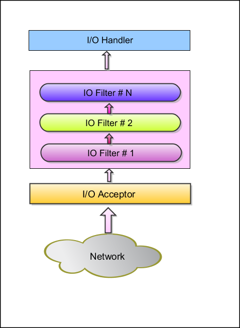
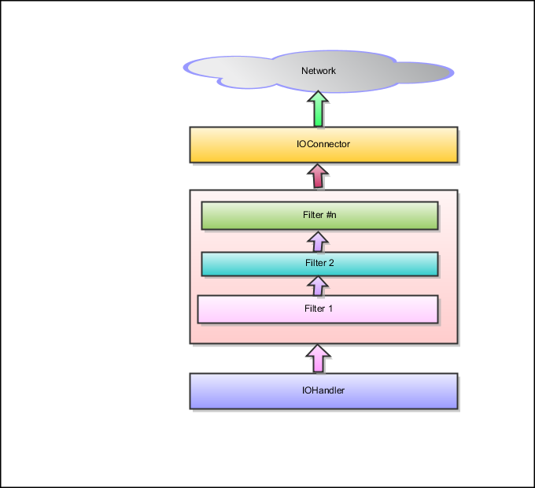
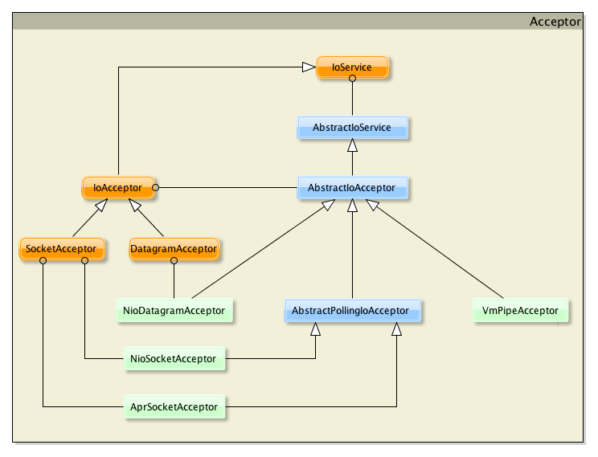

# 概览
NIO Java1.4引入，Nina基于NIO 1，Java7 设计了新的NIO 2.

`java.nio.*`包含了：

* Buffers 缓冲-数据容器
* Chartsets 字符集 -字节和Unicode码的翻译容器
* Channel 通道-表示实体I/O操作的连接
* Selector 选择器-提供可选择的，多路非阻塞IO
* Regexps 正则表达式-提供一些操作正则表达式的工具

# Mina架构


基于Mina的应用划分为三个层次：

* I/O Service 具体的IO操作
* I/O Filter Chain 将字节过滤转换为想要的数据结构
* I/O Handler 实现实际的业务逻辑

创建一个Mina应用步骤：

1. 创建一个I/O Service 从已存在的可用service(*Acceptor)中挑选一个或者创建自己的
2. 创建一个I/O Filter Chain 从现有Filter中挑选，或者创建一个用于转换请求响应的自定义Filter
3. 创建一个I/O Handler 处理不同消息时编写的具体业务逻辑

# 服务端架构



* I/O Acceptor 监听网络获取连接或包
* 新连接会创建新session，统一ip/端口号组合的请求在同一session中处理
* session中接收到的包会经过Filter Chain处理
* 最后交给IOHandler 实现各种具体业务逻辑

# 客户端架构



* 创建一个IOConnector，绑定服务器
* 连接创建，session创建并关联到该连接
* 应用或者客户端写入session，经过FilterChain后发送给服务器
* 所有接受自服务器的响应由IOHandler接受并处理

# IOService
支持所有IO服务的基类，不管是在服务端还是客户端，处理所有与应用的交互，远程对端的交互，发送并接收消息，管理session，管理连接等等。

是一个接口，服务端实现为IoAcceptor，客户端为IoConnector

```
public interface IoService {
	//获取连接通信的元数据
    TransportMetadata getTransportMetadata();

    //添加一个IoServiceListener，对IoService相关事件进行监听
    void addListener(IoServiceListener listener);

    //移除存在的监听器
    void removeListener(IoServiceListener listener);
    
    //如果dispose方法已被调用，返回true，不能说明服务已经停止，可能还有一些session正在处理中
    boolean isDisposing();
	
	//如果dispose方法已被调用，并且执行中的线程已经结束，返回true
    boolean isDisposed();

    //停止服务，服务只能在所有等待中的session都被处理后才能停止
    void dispose();

    //参数为true的话，等待每一个执行中的线程正常结束
    void dispose(boolean awaitTermination);

    //服务实例化之后获取关联的LoHandler
    IoHandler getHandler();

    //服务实例化后添加关联的IoHandler
    void setHandler(IoHandler handler);

    //获取当前服务管理的所有session
    Map<Long, IoSession> getManagedSessions();

    //获取当前服务管理的所有session总数
    int getManagedSessionCount();

    //返回当前服务创建的新的IoSession的默认配置
    IoSessionConfig getSessionConfig();

    //返回一个能够生成IoFilterChain的生成器，过滤器链被当前服务创建的IoSession使用
    IoFilterChainBuilder getFilterChainBuilder();

    //添加一个能够生成IoFilterChain的生成器，生成过滤器链被当前服务创建的IoSession使用
    void setFilterChainBuilder(IoFilterChainBuilder builder);

    //返回正在使用的过滤器链
    DefaultIoFilterChainBuilder getFilterChain();

    //如果服务能够接受连入请求返回true
    boolean isActive();

    //返回服务的活跃时间，如果服务已经不活跃，则返回最后的活跃时间
    long getActivationTime();

    //给当前服务管理的所有IoSession广播消息
    Set<WriteFuture> broadcast(Object message);

    //返回新创建的session的数据结构工厂
    //用户在session中可能需要存储一些自定义的属性，默认情况下是Map，用户可以自定义其他的数据结构
    IoSessionDataStructureFactory getSessionDataStructureFactory();
	
	//设置新创建的session的数据结构工厂
    void setSessionDataStructureFactory(IoSessionDataStructureFactory sessionDataStructureFactory);

    //返回应该被写入的字节数
    int getScheduledWriteBytes();

    //返回应该被写入的消息数
    int getScheduledWriteMessages();

    //统计功能
    IoServiceStatistics getStatistics();
}

```

AbstractIoService是抽象类，实现了IoService，对IoService进行了基础的实现，包含了一个Executor来处理接收的事件

```
public abstract class AbstractIoService implements IoService {

    private static final Logger LOGGER = LoggerFactory.getLogger(AbstractIoService.class);

    //Service id
    private static final AtomicInteger id = new AtomicInteger();

    private final String threadName;

    //处理IO的Executor
    private final Executor executor;

    //用来标志executor是在当前实例被创建的，不是调用者传过来的
    private final boolean createdExecutor;

    //负责管理所有I/O活动的IoHandler
    private IoHandler handler;

    //新创建的session使用的默认的session配置
    protected final IoSessionConfig sessionConfig;

    private final IoServiceListener serviceActivationListener = new IoServiceListener() {
        public void serviceActivated(IoService service) {
            // Update lastIoTime.
            AbstractIoService s = (AbstractIoService) service;
            IoServiceStatistics _stats = s.getStatistics();
            _stats.setLastReadTime(s.getActivationTime());
            _stats.setLastWriteTime(s.getActivationTime());
            _stats.setLastThroughputCalculationTime(s.getActivationTime());

        }

        public void serviceDeactivated(IoService service) throws Exception {
            // Empty handler
        }

        public void serviceIdle(IoService service, IdleStatus idleStatus) throws Exception {
            // Empty handler
        }

        public void sessionCreated(IoSession session) throws Exception {
            // Empty handler
        }

        public void sessionClosed(IoSession session) throws Exception {
            // Empty handler
        }

        public void sessionDestroyed(IoSession session) throws Exception {
            // Empty handler
        }
    };

    /**
     * Current filter chain builder.
     */
    private IoFilterChainBuilder filterChainBuilder = new DefaultIoFilterChainBuilder();

    private IoSessionDataStructureFactory sessionDataStructureFactory = new DefaultIoSessionDataStructureFactory();

    /**
     * Maintains the {@link IoServiceListener}s of this service.
     */
    private final IoServiceListenerSupport listeners;

    /**
     * A lock object which must be acquired when related resources are
     * destroyed.
     */
    protected final Object disposalLock = new Object();

    private volatile boolean disposing;

    private volatile boolean disposed;

    /**
     * {@inheritDoc}
     */
    private IoServiceStatistics stats = new IoServiceStatistics(this);

    /**
     * Constructor for {@link AbstractIoService}. You need to provide a default
     * session configuration and an {@link Executor} for handling I/O events. If
     * a null {@link Executor} is provided, a default one will be created using
     * {@link Executors#newCachedThreadPool()}.
     * 
     * @param sessionConfig
     *            the default configuration for the managed {@link IoSession}
     * @param executor
     *            the {@link Executor} used for handling execution of I/O
     *            events. Can be <code>null</code>.
     */
    protected AbstractIoService(IoSessionConfig sessionConfig, Executor executor) {
        if (sessionConfig == null) {
            throw new IllegalArgumentException("sessionConfig");
        }

        if (getTransportMetadata() == null) {
            throw new IllegalArgumentException("TransportMetadata");
        }

        if (!getTransportMetadata().getSessionConfigType().isAssignableFrom(sessionConfig.getClass())) {
            throw new IllegalArgumentException("sessionConfig type: " + sessionConfig.getClass() + " (expected: "
                    + getTransportMetadata().getSessionConfigType() + ")");
        }

        // Create the listeners, and add a first listener : a activation listener
        // for this service, which will give information on the service state.
        listeners = new IoServiceListenerSupport(this);
        listeners.add(serviceActivationListener);

        // Stores the given session configuration
        this.sessionConfig = sessionConfig;

        // Make JVM load the exception monitor before some transports
        // change the thread context class loader.
        ExceptionMonitor.getInstance();

        if (executor == null) {
            this.executor = Executors.newCachedThreadPool();
            createdExecutor = true;
        } else {
            this.executor = executor;
            createdExecutor = false;
        }

        threadName = getClass().getSimpleName() + '-' + id.incrementAndGet();
    }

    /**
     * {@inheritDoc}
     */
    public final IoFilterChainBuilder getFilterChainBuilder() {
        return filterChainBuilder;
    }

    /**
     * {@inheritDoc}
     */
    public final void setFilterChainBuilder(IoFilterChainBuilder builder) {
        if (builder == null) {
            builder = new DefaultIoFilterChainBuilder();
        }
        filterChainBuilder = builder;
    }

    /**
     * {@inheritDoc}
     */
    public final DefaultIoFilterChainBuilder getFilterChain() {
        if (filterChainBuilder instanceof DefaultIoFilterChainBuilder) {
            return (DefaultIoFilterChainBuilder) filterChainBuilder;
        }

        throw new IllegalStateException("Current filter chain builder is not a DefaultIoFilterChainBuilder.");
    }

    /**
     * {@inheritDoc}
     */
    public final void addListener(IoServiceListener listener) {
        listeners.add(listener);
    }

    /**
     * {@inheritDoc}
     */
    public final void removeListener(IoServiceListener listener) {
        listeners.remove(listener);
    }

    /**
     * {@inheritDoc}
     */
    public final boolean isActive() {
        return listeners.isActive();
    }

    /**
     * {@inheritDoc}
     */
    public final boolean isDisposing() {
        return disposing;
    }

    /**
     * {@inheritDoc}
     */
    public final boolean isDisposed() {
        return disposed;
    }

    /**
     * {@inheritDoc}
     */
    public final void dispose() {
        dispose(false);
    }

    /**
     * {@inheritDoc}
     */
    public final void dispose(boolean awaitTermination) {
        if (disposed) {
            return;
        }

        synchronized (disposalLock) {
            if (!disposing) {
                disposing = true;

                try {
                    dispose0();
                } catch (Exception e) {
                    ExceptionMonitor.getInstance().exceptionCaught(e);
                }
            }
        }

        if (createdExecutor) {
            ExecutorService e = (ExecutorService) executor;
            e.shutdownNow();
            if (awaitTermination) {

                try {
                    LOGGER.debug("awaitTermination on {} called by thread=[{}]", this, Thread.currentThread().getName());
                    e.awaitTermination(Integer.MAX_VALUE, TimeUnit.SECONDS);
                    LOGGER.debug("awaitTermination on {} finished", this);
                } catch (InterruptedException e1) {
                    LOGGER.warn("awaitTermination on [{}] was interrupted", this);
                    // Restore the interrupted status
                    Thread.currentThread().interrupt();
                }
            }
        }
        disposed = true;
    }

    /**
     * Implement this method to release any acquired resources.  This method
     * is invoked only once by {@link #dispose()}.
     * 
     * @throws Exception If the dispose failed
     */
    protected abstract void dispose0() throws Exception;

    /**
     * {@inheritDoc}
     */
    public final Map<Long, IoSession> getManagedSessions() {
        return listeners.getManagedSessions();
    }

    /**
     * {@inheritDoc}
     */
    public final int getManagedSessionCount() {
        return listeners.getManagedSessionCount();
    }

    /**
     * {@inheritDoc}
     */
    public final IoHandler getHandler() {
        return handler;
    }

    /**
     * {@inheritDoc}
     */
    public final void setHandler(IoHandler handler) {
        if (handler == null) {
            throw new IllegalArgumentException("handler cannot be null");
        }

        if (isActive()) {
            throw new IllegalStateException("handler cannot be set while the service is active.");
        }

        this.handler = handler;
    }

    /**
     * {@inheritDoc}
     */
    public final IoSessionDataStructureFactory getSessionDataStructureFactory() {
        return sessionDataStructureFactory;
    }

    /**
     * {@inheritDoc}
     */
    public final void setSessionDataStructureFactory(IoSessionDataStructureFactory sessionDataStructureFactory) {
        if (sessionDataStructureFactory == null) {
            throw new IllegalArgumentException("sessionDataStructureFactory");
        }

        if (isActive()) {
            throw new IllegalStateException("sessionDataStructureFactory cannot be set while the service is active.");
        }

        this.sessionDataStructureFactory = sessionDataStructureFactory;
    }

    /**
     * {@inheritDoc}
     */
    public IoServiceStatistics getStatistics() {
        return stats;
    }

    /**
     * {@inheritDoc}
     */
    public final long getActivationTime() {
        return listeners.getActivationTime();
    }

    /**
     * {@inheritDoc}
     */
    public final Set<WriteFuture> broadcast(Object message) {
        // Convert to Set.  We do not return a List here because only the
        // direct caller of MessageBroadcaster knows the order of write
        // operations.
        final List<WriteFuture> futures = IoUtil.broadcast(message, getManagedSessions().values());
        return new AbstractSet<WriteFuture>() {
            @Override
            public Iterator<WriteFuture> iterator() {
                return futures.iterator();
            }

            @Override
            public int size() {
                return futures.size();
            }
        };
    }

    public final IoServiceListenerSupport getListeners() {
        return listeners;
    }

    protected final void executeWorker(Runnable worker) {
        executeWorker(worker, null);
    }

    protected final void executeWorker(Runnable worker, String suffix) {
        String actualThreadName = threadName;
        if (suffix != null) {
            actualThreadName = actualThreadName + '-' + suffix;
        }
        executor.execute(new NamePreservingRunnable(worker, actualThreadName));
    }

    // TODO Figure out make it work without causing a compiler error / warning.
    @SuppressWarnings("unchecked")
    protected final void initSession(IoSession session, IoFuture future, IoSessionInitializer sessionInitializer) {
        // Update lastIoTime if needed.
        if (stats.getLastReadTime() == 0) {
            stats.setLastReadTime(getActivationTime());
        }

        if (stats.getLastWriteTime() == 0) {
            stats.setLastWriteTime(getActivationTime());
        }

        // Every property but attributeMap should be set now.
        // Now initialize the attributeMap.  The reason why we initialize
        // the attributeMap at last is to make sure all session properties
        // such as remoteAddress are provided to IoSessionDataStructureFactory.
        try {
            ((AbstractIoSession) session).setAttributeMap(session.getService().getSessionDataStructureFactory()
                    .getAttributeMap(session));
        } catch (IoSessionInitializationException e) {
            throw e;
        } catch (Exception e) {
            throw new IoSessionInitializationException("Failed to initialize an attributeMap.", e);
        }

        try {
            ((AbstractIoSession) session).setWriteRequestQueue(session.getService().getSessionDataStructureFactory()
                    .getWriteRequestQueue(session));
        } catch (IoSessionInitializationException e) {
            throw e;
        } catch (Exception e) {
            throw new IoSessionInitializationException("Failed to initialize a writeRequestQueue.", e);
        }

        if ((future != null) && (future instanceof ConnectFuture)) {
            // DefaultIoFilterChain will notify the future. (We support ConnectFuture only for now).
            session.setAttribute(DefaultIoFilterChain.SESSION_CREATED_FUTURE, future);
        }

        if (sessionInitializer != null) {
            sessionInitializer.initializeSession(session, future);
        }

        finishSessionInitialization0(session, future);
    }

    /**
     * Implement this method to perform additional tasks required for session
     * initialization. Do not call this method directly;
     * {@link #initSession(IoSession, IoFuture, IoSessionInitializer)} will call
     * this method instead.
     * 
     * @param session The session to initialize
     * @param future The Future to use
     * 
     */
    protected void finishSessionInitialization0(IoSession session, IoFuture future) {
        // Do nothing. Extended class might add some specific code
    }

    /**
     * A specific class used to 
     * @author elecharny
     *
     */
    protected static class ServiceOperationFuture extends DefaultIoFuture {
        public ServiceOperationFuture() {
            super(null);
        }

        public final boolean isDone() {
            return getValue() == Boolean.TRUE;
        }

        public final void setDone() {
            setValue(Boolean.TRUE);
        }

        public final Exception getException() {
            if (getValue() instanceof Exception) {
                return (Exception) getValue();
            }

            return null;
        }

        public final void setException(Exception exception) {
            if (exception == null) {
                throw new IllegalArgumentException("exception");
            }
            
            setValue(exception);
        }
    }

    /**
     * {@inheritDoc}
     */
    public int getScheduledWriteBytes() {
        return stats.getScheduledWriteBytes();
    }

    /**
     * {@inheritDoc}
     */
    public int getScheduledWriteMessages() {
        return stats.getScheduledWriteMessages();
    }

}

```

## IoAcceptor
负责客户端和服务端连接的创建，服务器端接收连入的连接请求。

具体实现类：

* NioSocketAcceptor 非阻塞套接字传输 IoAcceptor
* NioDatagramAcceptor 非阻塞UDP传输 IoAcceptor
* AprSocketAcceptor 基于APR的阻塞套接字传输 IoAcceptor
* VmPipeSocketAcceptor in-VM IoAcceptor



IoAcceptor也是一个接口，继承自IoService

```
public interface IoAcceptor extends IoService {
    //返回当前绑定的本机的地址，有多个的时候，只返回一个
    SocketAddress getLocalAddress();
    Set<SocketAddress> getLocalAddresses();
    SocketAddress getDefaultLocalAddress();
    List<SocketAddress> getDefaultLocalAddresses();

    //设置本机默认地址
    void setDefaultLocalAddress(SocketAddress localAddress);
    void setDefaultLocalAddresses(SocketAddress firstLocalAddress, SocketAddress... otherLocalAddresses);
    void setDefaultLocalAddresses(Iterable<? extends SocketAddress> localAddresses);
    void setDefaultLocalAddresses(List<? extends SocketAddress> localAddresses);

    //当acceptor解除绑定本地地址时，仅当所有的客户端都关闭了才返回true
    boolean isCloseOnDeactivation();

    //设置当acceptor解除绑定本地地址时，是否所有的session都要关闭
    void setCloseOnDeactivation(boolean closeOnDeactivation);

   	//绑定地址，并且开始接受连接
    void bind() throws IOException;
    void bind(SocketAddress localAddress) throws IOException;
    void bind(SocketAddress firstLocalAddress, SocketAddress... addresses) throws IOException;
    void bind(SocketAddress... addresses) throws IOException;
    void bind(Iterable<? extends SocketAddress> localAddresses) throws IOException;

    //解除绑定，停止接受连接，所有的已经存在的连接都会被关闭。
    void unbind();
    void unbind(SocketAddress localAddress);
    void unbind(SocketAddress firstLocalAddress, SocketAddress... otherLocalAddresses);
    void unbind(Iterable<? extends SocketAddress> localAddresses);

    //为特定的地址新建session
    IoSession newSession(SocketAddress remoteAddress, SocketAddress localAddress);
}
```


## IoConnector
具体实现类：

* NioSocketConnector 非阻塞套接字传输 IoConnector
* NioDatagramConnector 非阻塞UDP传输 IoConnector
* AprSocketConnector 基于APR的阻塞套接字传输IoConnector
* ProxyConnector 提供代理支持
* SerialConnector 用于串行传输
* VmPipeConnector in-VM IoConnector


# Session
当一个客户端连接到服务器，一个新的会话被创建，在客户端关掉连接之前会一直保存在内存中。

保存连接的持久信息，以及在请求处理过程中，会话的生命周期中服务器可能需要用到的任何信息。

## 会话的状态

* 已连接 会话已被创建并可用
* 闲置 会话在至少一段时间内没有处理任何请求
	
	- 读闲置 一段时间内没任何读操作
	- 写闲置 一段时间内没任何写操作
	- 同时闲置 一段时间内没读操作也没写操作

* 关闭中 会话正在关闭中 还有正在清空的消息，清理尚未结束
* 已关闭 会话已被关闭


## 配置参数

* 接受缓冲大小
* 发送缓冲大小
* 空闲时间
* 写超时时间

## 统计
每个会话也会保持对会话处理结束的一些记录跟踪：

* 接受或发送的字节数
* 接受或发送的消息数
* 闲置状态
* 吞吐量

# Filter

IoFilter 过滤IoService和IoHandler之间的所有I/O事件和请求。

* LoggingFilter记录所有事件和请求
* ProtocolCodecFilter将一个连入的ByteBuffer转化为消息POJO
* CompressionFilter压缩所有数据
* SSLFilter添加SSL-TLS-StartTLS支持
* 更多

# Transport

* APR 传输
* 串行传输

# Handler
处理 MINA 所触发 I/O 事件，这一接口是在过滤器链最后完成的。

IoHandler 具有以下方法：

* sessionCreated
* sessionOpened
* sessionClosed
* sessionIdle
* exceptionCaught
* messageReceived
* messageSent

## sessionCreated

新的连接被创建时触发。对于 TCP 来说这是连接接受的结果，而对于 UDP 这个在接收到一个 UDP 包时产生。这一方法可以被用于初始化会话属性，并为一些特定连接执行一次性活动。

这个方法由 I/O 处理线程的环境中调用，应该以一个低耗时的方式实现，因为同一个线程要处理多个会话。

## sessionOpened

在一个连接被打开时调用。它总是在 sessionCreated 事件之后调用。如果配置了一个线程模型，这一方法将在 I/O 处理线程之外的一个线程中调用。

## sessionClosed

在会话被关闭时调用。会话清理活动比如清理信息可以在这里执行。

## sessionIdle

在会话变为闲置状态时触发。这一方法并不为基于 UDP 的传输调用。

## exceptionCaught

在用户代码或者 MINA 抛异常时调用。如果是一个 IOException 异常的话当前连接将被关闭。

## messageReceived

在一个消息被接收到时触发。这是一个应用最常发生的处理。你需要照顾到所有要碰到的消息类型

## messageSent

在消息响应被发送 (调用 IoSession.write()) 时触发。


# IoBuffer
Mina所用的一个字节缓存。代替ByteBuffer：

* ByteBuffer没有提供getter和putter方法
* ByteBuffer固定容量的特性，很难写入可变长度的数据

IoBuffer是抽象类，不能直接被实例化。实现了Comparable接口。

