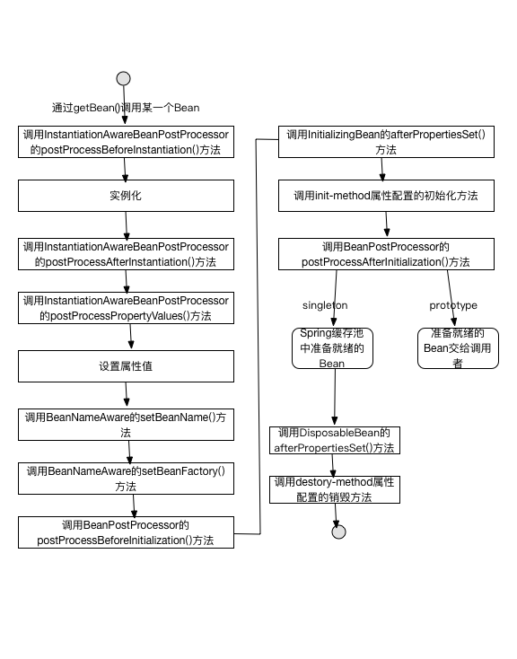
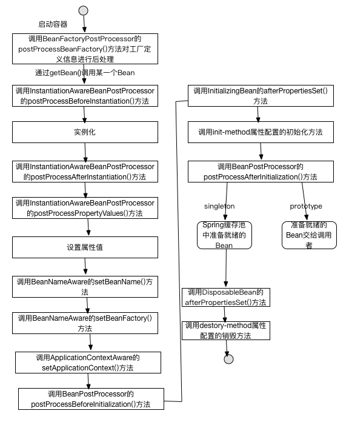
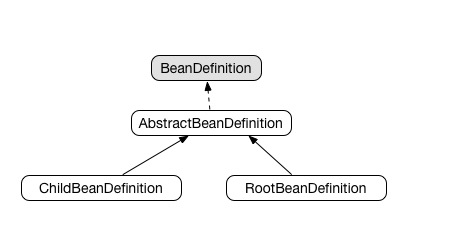

# IOC类型
注入方法上看，分为3种类型：构造函数注入，属性注入，接口注入。

Spring支持构造函数注入和属性注入。

# 资源抽象接口Resource
Resource的实现类：

* ByteArrayResource 二进制数组表示的资源
* ClassPathResource 类路径下的资源
* FileSystemResource 文件系统资源
* InputStreamResource InputStream资源
* ServletContextResource 访问web容器上下文资源
* UrlResource 封装了java.net.URL 访问URL表示的资源

# BeanFactory
BeanFactory最主要的方法是getBean(String beanName)，从容器中返回特定名称的Bean

* ListbleBeanFactory 该接口定义了访问容器中Bean基本信息的方法。
* HierarchicalBeanFactory 父子级联IOC容器接口，子容器可以通过接口方法访问父容器。
* ConfigurableBeanFactory 重要接口，增强了IOC容器的可定制性，定义了设置类装载器，属性编辑器，容器初始化后置处理器等方法。
* AutowireCapableBeanFactory 定义了将容器中的Bean按某种规则进行自动装配的方法。
* SingletonBeanRegistry 定义了允许在运行期间向容器注册单实例Bean的方法。
* BeanDefinitionRegistry Spring配置文件中每一个Bean节点元素在Spring容器里都通过一个BeanDefinition对象表示，描述了Bean配置信息。BeanDefinitionRegistry接口提供了向容器手工注册BeanDefinition对象的方法。

# ApplicationContext
由BeanFactory派生而来，提供了更多面向实际应用的功能。

主要实现类ClassPathXmlApplicationContext 默认从类路径加载配置文件，FileSystemXmlApplicationContext默认从文件系统中装载配置文件。

>ApplicationContext的初始化和BeanFactory有一个重大区别：BeanFactory在初始化容器时，并未实例化Bean，直到第一次访问某个Bean时才实例目标Bean；而ApplicationContext则在初始化应用上下文时就实例化所有单实例的Bean。

Spring为基于注解类的配置专门提供了ApplicationContext实现类：AnnotationConfigApplicationContext。

# WebApplicationContext
专门为Web应用提供，允许从相对于Web根目录的路径中装载配置文件完成初始化工作。从WebApplicationContext中可以获得ServletContext的引用，整个Web应用上下文对象将作为属性放到ServletContext中，以便Web环境可以访问Spring上下文。

WebApplicationContextUtils.getWebApplicationContext(ServletContext sc)可从ServletContext中获取WebApplicationContext实例。

>WebApplicationContext初始化方式和BeanFactory，ApplicationContext有所区别,WebApplicationContext需要ServletContext实例，也就是说必须拥有Web容器的前提下才能完成启动工作。web.xml中配置servlet或者监听器都行。


# 父子容器
通过HierarchicalBeanFactory接口，Spring的IOC容器可以建立父子层级关联的容器体系，子容器何以访问父容器中的Bean，但父容器不能访问子容器的Bean。容器内Bean的id是唯一的，子容器可以拥有一个和父容器id相同的Bean。

比如在Springmvc中，展现层Bean位于一个子容器中，业务层和持久层的Bean位于父容器中。展现层Bean可以引用业务层和持久层Bean，业务层和持久层看不到展现层Bean。


# Bean的生命周期

## BeanFactory中Bean的生命周期



1. 当调用者通过getBean(BeanName)向容器请求一个Bean时，如果容器注册了org.springframework.beans.factory.config.InstantiationAwareBeanPostProcessor接口，在实例化Bean之前，将调用接口的postProcessBeforeInstantiation()方法。
2. 根据配置情况调用Bean构造函数或工厂方法实例化Bean。
3. 如果容器注册了InstantiationAwareBeanPostProcessor接口，在实例化Bean之后，将调用该接口的postProcessAfterInstantiation()方法，可在这里对已经实例化的对象进行一些修饰。
4. 如果Bean配置了属性信息，容器在这一步着手将配置值设置到Bean对应的属性中，不过在设置每个属性之前将先调用InstantiationAwareBeanPostProcessor接口的postProcessPropertyValues()方法。
5. 调用Bean属性设置方法设置属性值。
6. 如果Bean实现了org.springframework.beans.factory.BeanNameAware接口，将调用setBeanName()方法，将配置文件中该Bean对应的名称设置到Bean中。
7. 如果Bean实现了org.springframework.beans.factory.BeanFactoryAware接口，将调用setBeanFactory()方法，将BeanFactory容器实例设置到Bean中。
8. 如果BeanFactory装配了org.springframework.beans.factory.config.BeanPostProcessor后处理器，将调用BeanPostProcessor的Object postProcessBeforeInitialization(Object bean,String beanName)接口方法对Bean进行加工操作。其中参数bean是当前正在处理的Bean，beanName是当前Bean的配置名，返回的对象为加工处理后的Bean。***Spring容器所提供的AOP，动态代理等都通过BeanPostProcessor实施***
9. 如果Bean实现了InitializingBean接口，将调用afterPropertiesSet()方法。
10. 如果在<bean>通过init-method属性定义了初始化方法，将执行这个方法。
11. BeanPostProcessor后处理器定义了两个方法：postProcessBeforeInitialization在第8步调用，另一个是Object postProcessAfterInitialization(Object bean,String beanName),这个方法在此调用，容器再次获得对Bean进行加工的机会。
12. 如果在<bean>中指定Bean的范围为scope="prototype"，将Bean返回给调用者，调用者负责这个Bean后续生命管理，Spring不在管理这个Bean生命周期。如果作用域为singleton，则将Bean放入到SpringIOC容器缓存池中，并将Bean引用返回给调用者，Spring继续对这些Bean进行后续生命周期管理。
13. 对于作用域为singleton的Bean，容器关闭时，将触发Spring对Bean的后续生命周期管理，如果Bean实现了DisposableBean接口，则将调用接口的afterPropertiesSet()方法，可在此编写释放资源，记录日志等操作。
14. 对于作用域为singleton的Bean，如果<bean>的destory-method属性指定了Bean销毁方法，Spring执行此方法，完成Bean资源的释放操作。

Bean完整生命周期大致划分为三类：

* Bean自身方法
* Bean级生命周期接口方法
* 容器级生命周期接口方法

## ApplicationContext中Bean的生命周期

和BeanFactory中生命周期类似。不同点，如果Bean实现了org.springframework.context.ApplicationContextAware接口，会增加一个调用该接口方法setApplicationContext()的步骤。



ApplicationContext和BeanFactory最大不同：ApplicationContext会利用java反射机制自动识别出配置文件中定义的BeanPostProcessor，InstantiationAwareBeanPostProcessor和BeanFactoryPostProcessor，并自动将他们注册到应用上下文中；BeanFactory需要通过代码进行注册。所以开发时多使用ApplicationContext。


# 依赖注入

## 属性注入

属性注入要求Bean提供一个默认的构造函数，并为需要注入的属性提供对应的Setter方法。Spring首先调用默认构造函数实例化Bean对象，然后通过反射方式调用Setter方法注入属性值。

## 构造函数注入

构造函数注入保证一些必要的属性在Bean实例化时就得到设置，保证Bean在实例化之后就可以使用。

## 工厂方法注入


## lookup-method

主要使用场景：一个singleton的Bean需要引用一个prototype的Bean；一个无状态的Bean需要引用一个有状态的Bean等。

## 方法替换
replacer


# bean之间的关系


# 整合多个配置文件

<import>

# Bean作用域

## singleton作用域
Spring中Bean默认作用域为singleton。

## prototype作用域
默认情况下，Spring在容器启动时不实例化prototype的Bean，Spring容器将prototype的Bean交给调用者后，就不再管理它的生命周期了。

## request作用域

## session作用域

## globalSession作用域


# FactoryBean

工厂类接口，用户可以通过实现该工厂接口定制实例化Bean的逻辑。

# 基于注解的配置

## @Component

以下三个和@Component等效：

* @Repository 对Dao类实现标注
* @Service 对Service实现标注
* @Controller 对Controller实现标注

## @AutoWired 
自动注入，默认按照类型匹配方式。

required 属性，默认为true，如果希望Spring找不到匹配的Bean完成诸如，也不要抛异常，可以使用@Autowired(required=false)标注。

### @Qualifier
指定注入Bean的名称

### 对类方法进行标注
@Autowired可以对类成员变量及方法的入参进行标注。

### 对集合类进行标注
如果对集合类的变量或者方法入参进行@Autowired标注，Spring会将容器中类型匹配的所有Bean都自动注入进来。

## 作用范围及生命过程方法
注解配置的Bean和<bean>配置的一样，默认作用范围都是singleton。

@Scope可以显示指定Bean的作用范围。

@PostConstruct 相当于init-method

@PreDestory 相当于destory-method

# 基于Java类的配置

@Configuration注解可以为Spring容器提供Bean定义的信息。

@Bean提供Bean定义信息。

@Import可以将多个配置类组装到一个配置类中。

@ImportResource引入XML配置文件。


# 内部工作机制
Spring的AbstractApplicationContext是ApplicationContext抽象实现类，该类refresh()方法定义了Spring容器在加载配置文件后的各项处理过程。

```
public void refresh() throws BeansException, IllegalStateException {
    Object var1 = this.startupShutdownMonitor;
    synchronized(this.startupShutdownMonitor) {
        this.prepareRefresh();
        //初始化BeanFactory
        ConfigurableListableBeanFactory beanFactory = this.obtainFreshBeanFactory();
        this.prepareBeanFactory(beanFactory);

        try {
            this.postProcessBeanFactory(beanFactory);
            //调用工厂后处理器
            this.invokeBeanFactoryPostProcessors(beanFactory);
            //注册Bean后处理器
            this.registerBeanPostProcessors(beanFactory);
            //初始化消息源
            this.initMessageSource();
            //初始化应用上下文事件广播器            
            this.initApplicationEventMulticaster();
            //初始化其他特殊Bean，由子类实现
            this.onRefresh();
            //注册事件监听器
            this.registerListeners();
            //初始化所有单实例Bean，使用懒初始化模式的Bean除外
            this.finishBeanFactoryInitialization(beanFactory);
            //完成刷新并发布容器刷新事件
            this.finishRefresh();
        } catch (BeansException var4) {
            this.destroyBeans();
            this.cancelRefresh(var4);
            throw var4;
        }

    }
}
```

1. 初始化BeanFactory，根据配置文件初始化BeanFactory，getBeanFactory()方法由具体子类实现，在这一步Spring将配置文件的信息装入到容器的Bean定义注册表（BeanDefinitionRegistry）中，此时Bean还未初始化。
2. 调用工厂后处理器：根据反射机制从BeanDefinitionRegistry中找出所有BeanFactoryPostProcessor类型的Bean，并调用postProcessBeanFactory()方法。
3. 注册Bean后处理器，根据反射机制从BeanDefinitionRegistry中找出所有BeanPostProcessor类型的Bean，并将它们注册到容器Bean后处理器的注册表中。
4. 初始化消息源：初始化容器的国际化信息资源。
5. 初始化应用上下文事件广播器
6. 初始化其他特殊的Bean：这是一个钩子方法，子类可借助此方法执行一些特殊的操作。
7. 注册事件监听器。
8. 初始化所有单实例Bean，使用懒初始化的Bean除外，初始化Bean后将他们放到Spring容器的缓存中。
9. 发布上下文刷新事件，创建上下文刷新事件，事件广播器负责将这些事件广播到每个注册的事件监听器中。

Spring容器从加载配置文件到创建出一个Bean的流程：

1. ResourceLoader从存储介质中加载Spring配置信息，使用Resource 表示这个配置文件的资源。
2. BeanDefinitionReader读取Resource所指向的配置文件资源，然后解析配置文件。配置文件中的每一个<bean>解析成一个BeanDefinition对象，并保存到BeanDefinitionRegistry中。
3. 容器扫描BeanDefinitionRegistry中的BeanDefinition，使用Java的反射机制自动识别出Bean工厂后处理器（实现BeanFactoryPostProcessor接口）的Bean，然后调用这些Bean工厂后处理器对BeanDefinitionRegistry中的BeanDefinition进行加工处理，主要完成以下两项工作：
	* 对使用到占位符的<bean>元素标签进行解析，得到最终的配置值，这意味着对一些半成品式的BeanDefinition对象进行加工处理并得到成品的BeanDefinition对象；
	* 对BeanDefinitionRegistry中的BeanDefinition进行扫描，通过反射找出属性编辑器的Bean（实现java.bean.PropertyEditor接口），将他们注册到Spring容器的属性编辑器注册表中（PropertyEditorRegistry）
4. Spring容器从BeanDefinitionRegistry中取出加工后的BeanDefinition，调用InstantiationStrategy着手进行Bean实例化。
5. 实例化Bean时，Spring容器使用BeanWrapper对Bean进行封装，BeanWrapper提供很多反射机制操作Bean的方法，完成属性的设置工作。
6. 利用Bean后处理器（实现BeanPostProcessor接口）对完成属性设置的Bean进行后续加工，直接装配出一个准备就绪的Bean


Spring组件按照角色可划分两类：

1. 物料组件：Resource，BeanDefinition，PropertyEditor，最终的Bean，他们是加工流程中被加工，被消费的组件。
2. 加工设备组件：ResourceLoader，BeanDefinitionReader，BeanFactoryPostProcessor，InstantiationStrategy以及BeanWrapper等是加工设备。


## BeanDefinition
BeanDefinition是配置文件<bean>在容器内部的表示。



父bean用RootBeanDefinition表示，子bean用ChildBeanDefinition表示。

Spring通过BeanDefinition将bean配置信息转换为容器内部表示，并将BeanDefinition注册到BeanDefinitionRegistry中。BeanDefinitionRegistry就像配置信息内存数据库，后续操作直接读取配置信息。

创建BeanDefinition步骤：

1. 利用BeanDefinitionReader对配置信息Resource进行读取，通过XML解析器解析配置新的DOM对象，为bean生成对应的BeanDefinition对象。可能是半成品。
2. 利用BeanFactoryPostProcessor对半成品BeanDefinition进行加工处理，将以占位符表示的配置解析为最终实际值，变成成品BeanDefinition。

## InstantiationStrategy
InstantiationStrategy 负责根据BeanDefinition对象创建一个Bean实例。仅负责实例化Bean操作，相当于执行new功能，不会参与Bean属性的设置工作。属性填充功能由BeanWrapper完成。

## BeanWrapper

BeanWrapper相当于一个代理器，完成Bean属性的填充工作。

# 属性编辑器

# 国际化信息

# 容器事件

# AOP

* 连接点（Joinpoint）程序执行的某个特定位置，如类开始初始化前后，类的某个方法调用前、后、抛异常后。Spring仅支持方法的连接点。
* 切点（Pointcut）使用类和方法作为连接点的查询条件
* 增强（Advice）是织入到目标类连接点上的一段代码程序。
* 目标对象（Target）增强逻辑的织入目标类。
* 引介（Introduction）特殊的增强，为类添加一些属性和方法。
* 织入（Weaving）将增强添加到目标类具体连接点上的过程。AOP有三种织入方式：
	- 编译期织入，使用特殊的Java编译器
	- 类装载期织入，使用特殊的类装载器
	- 动态代理织入，运行期为目标类添加增强生成子类的方式
	Spring采用动态代理织入，AspectJ采用编译期织入和类装载期织入。
* 代理（Proxy）一个类被AOP织入增强后，就产生一个结果类，它是融合原类和增强逻辑的代理类。
* 切面（Aspect）切面由切点和增强（引介）组成，包括横切逻辑的定义，也包括连接点的定义。

## AOP的实现者

* AspectJ
* AspectWerkz
* JBossAOP
* Spring AOP


# 创建增强类

Spring使用增强类定义横切逻辑，增强既包括横切逻辑，还包含部分连接点的信息。

## 增强类型

* 前置增强：BeforeAdvice，表示在目标方法执行之前实施增强
* 后置增强：AfterAdvice，表示在目标方法执行之后实施增强
* 环绕增强：MethodInterceptor，表示在目标方法执行前后实施增强
* 异常抛出增强：ThrowsAdvice，表示在目标方法抛出异常后实施增强
* 引介增强：IntroductionInterceptor，表示在目标类中添加一些新的方法和属性。

### 前置增强

BeforeAdvice 前置增强接口，MethodBeforeAdvice接口是其子类。

MethodBeforeAdvice中定义了唯一方法：before(Method method,Object[] args,Object obj) throws Throwable，method为目标类的方法，args为目标类的入参，obj为目标类实例。

#### ProxyFactory
内部使用JDK或者CGLib代理技术。

可以通过使用Pro需要Factory的 setOptimize(true)方法，让ProxyFactory启动优化代理方式。

### 后置增强

在目标类方法调用后执行。

### 环绕增强

允许在目标里方法调用前后织入横切逻辑。

### 异常抛出增强

异常抛出增强最合适的应用场景是事务管理。

### 引介增强
为目标类创建新的方法和属性，引介增强的连接点是类级别的，不是方法级别的。

# 创建切面

增强提供了连接点方位信息，如织入到方法前面、后面等，而切点进一步描述织入到哪些类的哪些方法上。

Pointcut描述切点。

## 切点类型

* 静态方法切点
* 动态方法切点
* 注解切点
* 表达式切点
* 流程切点
* 复合切点

## 切面类型

Advisor接口表示切面的概念，一个切面同时包含横切代码和连接点信息。

* Advisor 一般切面，仅包含一个Advice，Advice包含了横切代码和连接点信息，所以Advice本身就是一个简单的切面。横切面太宽泛，一般不直接使用。
* PointcutAdvisor 切点切面，包含Advice和Pointcut两个里，可以通过类，方法名以及方法方位等信息灵活定义切面的连接点。
* INtroductionAdvisor 引介切面，对应引介增强的特殊切面，应用在类层面上。


# 自动创建代理

# 基于@AspectJ和Schema的AOP

# LTW

# Spring 对DAO的支持

## 统一的异常体系

### Spring的DAO异常体系
Spring的异常体系都是建立在运行期异常的基础上。 

# Spring的事务管理

## 数据库事务

### 数据并发问题

* 脏读
* 不可重复读
* 幻象读
* 第一类丢失更新和第二类丢失更新

### 数据库锁机制

表锁定和行锁定

共享锁定和独占锁定

### 事务隔离级别

read uncommited

read commited

repeatable read

serializable

### ThreadLocal

ThreadLocal是线程的一个本地化对象，当工作于多线程中的对象使用ThreadLocal维护变量时，ThreadLocal为每个使用该变量的线程分配一个独立的变量副本。


### Sprig JDBC 和iBatis
它们都是基于数据源的Connection访问数据库，所以可以使用DataSourceTransactionManager。

### JPA

JPA通过EntityTransaction管理JPA事务。

底层JPA依然通过JDBC的Connection的事务方法完成最终控制，因此要配置一个JPA事务管理器，必须现提供一个DataSource，然后配置一个EntityManagerFactory，最后配置JpaTransactionManager。

### Hibernate

Hibernate使用Session封装Connection，所以需要一个能创建session的SessionFactory。

### JTA

JtaTrancactionmanager不需要知道DataSource和其他的特定资源，因为它引用容器提供的全局事务管理。

### 事务同步管理器

### 事务传播行为

PROPAGATION_REQUIRED 如果当前没有事务，就新建一个事务，如果已经存在一个事务中，加入到这个事务中，这是最常见的选择。

PROPAGATION_SUPPORTS 支持当前事务，如果当前没有事务，就以非事务方式执行。

PROPAGATION_MANDATORY 使用当前事务，如果当前没有事务，就抛出异常。

PROPAGATION_REQUIRES_NEW 新建事务，如当前存在事务，把当前事务挂起。

PROPAGATION_NOT_SUPPORTED 以非事务方式执行，如果当前存在事务，酒吧当前事务挂起。

PROPAGATION_NEVER 以非事务当时执行，如果当前存在事务，就抛出异常。

PROPAGATION_NESTED 如果当前存在事务，则嵌套事务内执行，如果当前没有事务，则执行与PROPAGATION_REQUIERED类似的操作。

# 任务调度和异步执行器

## Quartz

* Job 实现该接口定义需要执行的任务。
* JobDetail 
* Trigger 描述触发Job执行的时间触发规则。
* Calendar 一些日历特定时间点的集合。
* Scheduler 代表一个Quartz的独立运行容器。
* ThreadPool Scheduler使用一个线程池作为任务运行的基础设施，任务通过共享线程池中的线程提高运行效率。

Quartz可以通过两种方式实现集群，一种是中间数据库，另一种是通过Teracotta进行集群。


# Spring MVC

1. Http请求，web应用服务器收到请求，如果匹配DispatcherServlet的请求映射路径（web.xml中指定），该请求转交给DispatcherServlet处理。
2. DispatcherServlet收到请求，根据请求信息及HandlerMapping的配置找到处理请求的处理器Handler。可将HandlerMapping看成路由控制器，将Handler看成目标主机。
3. 当DispatcherServlet根据HandlerMapping得到对应当前请求的Handler后，通过HandlerAdapter对Handler进行封装，再以统一的适配器接口调用Handler。
4. 处理器完成业务逻辑的处理后，返回一个ModelAndView给DispatcherServlet，ModelAndView包含了试图逻辑名和模型数据信息。
5. ModelAndView包含的是逻辑视图名，非真正视图对象，DispatcherServlet用ViewResolver完成逻辑视图名到真实视图对象的解析工作。
6. 当得到真实视图对象View后，DispatcherServlet就使用这个View对象对ModelAndView中的模型数据进行视图渲染。
7. 最终客户端得到相应信息，html，xml，json等等。


