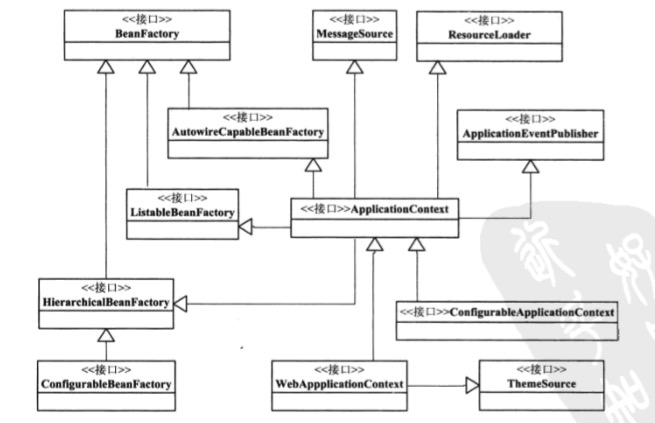
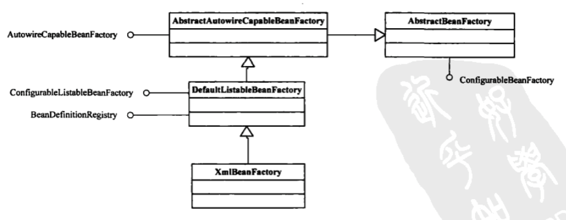
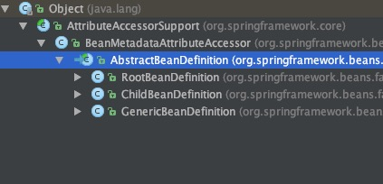

# Sprig IOC容器的设计

有两个主要的容器系列：

* 一个是实现BeanFactory接口的简单容器系列，只实现了容器最基本功能
* 一个是ApplicationContext应用上下文，作为容器的高级形态存在，增加了许多面向框架的特性，对应用环境做了许多适配。

BeanDefinition抽象了对bean的定义。



* 从接口BeanFactory到HierarchicalBeanFactory，再到ConfigurableBeanFactory是一条主要的BeanFactory设计路径。BeanFactory接口定义了基本的IOC容器规范。HierarchicalBeanFactory接口继承了BeanFactory，增加了getParentBeanFactory，使得BeanFactory具备了双亲IOC容器的管理功能。ConfigurableBeanFactory接口主要定义了一些对BeanFactory的配置功能。
* 第二条主线以ApplicationContext应用上下文接口为核心，从BeanFactory到ListableBeanFactory，再到ApplicationContext再到WebApplicationContext或者ConfigurableApplicationContext接口。ListableBeanFactory和HierarchicalBeanFactory连接BeanFactory接口定义和ApplicationContext的接口功能。ApplicationContext通过集成MessageSource，ResourceLoader，ApplicationEventPublisher接口，在IOC容器的基础上添加了许多对高级容器的特性支持。
* 这里设计的是主要的接口关系，具体IOC容器是在这些接口下实现的，DefaultLisableBeanFactory实现了ConfigurableBeanFactory，成为一个简单的IOC实现。XMLBeanFactory都是在DefaultListableBeanFactory的基础上做扩展。
* 这个接口体系是一BeanFactory和ApplicationContext为核心。BeanFactory是IOC容器最基本的接口。web环境中设计了WebApplicationContext接口。

# BeanFactory
接口定义了IOC容器最基本的形式，提供了IOC容器所应遵守的最基本的服务契约。

使用`&`符号得到FactoryBean本身，区分通过容器来获取FactoryBean产生的对象和FactoryBean本身。

getBean方法是主要方法，可以取得IOC容器中管理的Bean。

```
public interface BeanFactory {
	//使用`&`符号得到FactoryBean本身，
	//区分通过容器来获取FactoryBean产生的对象和FactoryBean本身。
	String FACTORY_BEAN_PREFIX = "&";

	//取得IOC容器中管理的Bean
	Object getBean(String name) throws BeansException;

	//根据名字和类型获取Bean
	<T> T getBean(String name, Class<T> requiredType) throws BeansException;

	//根据类型获取bean
	<T> T getBean(Class<T> requiredType) throws BeansException;

	//获取的Bean是prototype类型的，可以为这个类型的bean生成指定构造函数对应参数
	Object getBean(String name, Object... args) throws BeansException;

	//判断容器是否含有指定名字的bean
	boolean containsBean(String name);

	//查询指定名字的bean是否是单例bean，单例属性可以再BeanDefinition中指定
	boolean isSingleton(String name) throws NoSuchBeanDefinitionException;

	//查询指定名字的bean是否是原型bean
	boolean isPrototype(String name) throws NoSuchBeanDefinitionException;

	//根据名字查询bean是否是特定的class类型
	boolean isTypeMatch(String name, Class<?> targetType) throws NoSuchBeanDefinitionException;

	//查询指定名字的bean的类型
	Class<?> getType(String name) throws NoSuchBeanDefinitionException;

	//获取bean的所有别名
	String[] getAliases(String name);

}
```

## XmlBeanFactory

Spring 3.1 之后被废除，官方建议使用DefaultListableBeanFactory和XmlBeanDefinitionReader来代替XmlBeanFactory。

只提供最基本的IOC容器的功能，可以认为直接的BeanFactory实现是IOC容器的基本形式，而各种ApplicationContext的实现是IOC容器的高级表现形式。




XmlBeanFactory继承自DefaultListableBeanFactory，后者非常重要，是经常要用到的一个IOC容器的实现，ApplicationContext也会用到它。DefaultListableBeanFactory实际上已经包含了基本IOC容器所具有的重要功能。

Spring中实际上是把DefaultListableBeanFactory作为一个默认的功能完整的IOC容器来使用。

在XmlBeanFactory中初始化了一个XmlBeanDefinitionReader对象来处理BeanDefinition。

```
public class XmlBeanFactory extends DefaultListableBeanFactory {
	//初始化一个reader
	private final XmlBeanDefinitionReader reader = new XmlBeanDefinitionReader(this);
	//构造方法
	public XmlBeanFactory(Resource resource) throws BeansException {
		this(resource, null);
	}

	//构造方法
	public XmlBeanFactory(Resource resource, BeanFactory parentBeanFactory) throws BeansException {
		super(parentBeanFactory);
		//从Resource中载入BeanDefinitions的过程，
		//也是IOC初始化的重要组成部分
		this.reader.loadBeanDefinitions(resource);
	}

}
```

使用编程式IOC容器：

```
ClassPathResource res = new ClassPathResource("beans.xml");
DefaultListableBeanFactory factory = new DefaultListableBeanFactory();
XmlBeanDefinitionReader reader = new XmlBeanDefinitionReader(factory);
reader.loadBeanDefinitions(res);
```

# ApplicationContext
高级形态意义的IOC容器，在BeanFactory基础上添加附加功能。

* 支持不同的信息源 扩展了MessageSource接口，支持国际化的实现。
* 访问资源 体现在对ResourceLoader和Resource的支持上，可以从不同地方得到Bean定义资源。
* 支持应用事件 继承了接口ApplicationEventPublisher，在上下文引入了事件机制。
* 在ApplicationContext中提供附加功能，一般建议ApplicationContext作为IOC容器的基本形式

## FileSystemXmlApplicationContext
ApplicationContext应用上下文的主要功能已经在FileSystemXmlApplicationContext的基类AbstractXmlApplicationContext中实现了。

```
//实例化应用上下文支持，同时启动IOC容器的refresh过程
//refresh会牵涉ioc容器启动的一些列复杂操作。
public FileSystemXmlApplicationContext(String[] configLocations, boolean refresh, ApplicationContext parent)throws BeansException {

	super(parent);
	setConfigLocations(configLocations);
	if (refresh) {
		refresh();
	}
}
//可以为在文件系统中读取以xml形式存在的BeanDefinition做准备
protected Resource getResourceByPath(String path) {
	if (path != null && path.startsWith("/")) {
		path = path.substring(1);
	}
	return new FileSystemResource(path);
}
```

# IOC容器的初始化过程
初始化是由refresh()方法启动的，标志着ioc容器的正式启动

* BeanDefinition的Resource定位
* BeanDefinition载入
* 向IOC容器注册BeanDefinition

Resource定位过程，是指BeanDefinition的资源定位，由ResourceLoader通过统一的Resource接口完成。

BeanDefinition的载入，是把用户定义好的Bean表示成IOC容器内部的数据结构，内部数据结构就是BeanDefinition。

向容器注册BeanDefinition，是通过调用BeanDefinitionRegistry接口来实现的。在IOC容器内部将BeanDefinition注入到一个HashMap中区，通过这个map来持有BeanDefinition数据。

初始化过程一般不包含Bean依赖注入的实现，Bean定义的载入和依赖注入是两个独立过程，依赖注入一般发生在应用第一次通过getBean向容器获取bean的时候。

但是如果我们对某个bean设置了lazyinit属性，那么这个bean的依赖注入在容器初始化就预先完成了。


## BeanDefinition的Resource定位
FileSystemXmlBeanFactory已经通过集成AbstractApplicationContext具备了ResourceLoader读入以Resource定义的BeanDefinition的能力。

```
public class FileSystemXmlApplicationContext extends AbstractXmlApplicationContext {
	public FileSystemXmlApplicationContext() {
	}
	public FileSystemXmlApplicationContext(ApplicationContext parent) {
		super(parent);
	}

	//configLocation包含的是BeanDefinition所在的文件路径
	public FileSystemXmlApplicationContext(String configLocation) throws BeansException {
		this(new String[] {configLocation}, true, null);
	}

	//允许包含多个路径
	public FileSystemXmlApplicationContext(String... configLocations) throws BeansException {
		this(configLocations, true, null);
	}

	//允许多个路径，并允许自定自己的双亲容器
	public FileSystemXmlApplicationContext(String[] configLocations, ApplicationContext parent) throws BeansException {
		this(configLocations, true, parent);
	}

	public FileSystemXmlApplicationContext(String[] configLocations, boolean refresh) throws BeansException {
		this(configLocations, refresh, null);
	}

	//在对象初始化过程中，调用refresh方法载入BeanDefinition
	//这个refresh启动了BeanDefinition的载入过程
	public FileSystemXmlApplicationContext(String[] configLocations, boolean refresh, ApplicationContext parent)
			throws BeansException {

		super(parent);
		setConfigLocations(configLocations);
		if (refresh) {
			refresh();
		}
	}

	//应用于文件系统中Resource的实现，构造一个FileSystemResource来得到一个在文件系统中定位的BeanDefinition
	//这个getResourceByPath是在BeanDefinitionReader的loadBeanDefinition中被调用的，
	//loadBeanDefinition采用模板模式，具体的实现实际是子类完成的
	@Override
	protected Resource getResourceByPath(String path) {
		if (path != null && path.startsWith("/")) {
			path = path.substring(1);
		}
		return new FileSystemResource(path);
	}

}
```

```
protected final void refreshBeanFactory() throws BeansException {
	//如果已建立BeanFactory，则销毁并关闭该BeanFactory
	if (hasBeanFactory()) {
		destroyBeans();
		closeBeanFactory();
	}
	//这里创建并设置持有的DefaultListableBeanFactory的地方
	//同时调用loadBeanDefinitions再载入BeanDefinition的信息
	try {
		DefaultListableBeanFactory beanFactory = createBeanFactory();
		beanFactory.setSerializationId(getId());
		customizeBeanFactory(beanFactory);
		loadBeanDefinitions(beanFactory);
		synchronized (this.beanFactoryMonitor) {
			this.beanFactory = beanFactory;
		}
	}
}
```


```
//这是在上下文中创建DefaultListableBeanFactory的地方
//getInternalParentBeanFactory的具体实现可以参考AbstractApplicationContext中的实现，会根据容器已有的双亲IOC容器来生成DefaultListableBeanFactory的双亲IOC容器
protected DefaultListableBeanFactory createBeanFactory() {
	return new DefaultListableBeanFactory(getInternalParentBeanFactory());
}
```

loadBeanDefinitions：

是使用BeanDefinitionReader载入bean定义的地方

```
public int loadBeanDefinitions(String location, Set<Resource> actualResources) throws BeanDefinitionStoreException {
	//获取resourceLoader，使用的是DefaultResourceLoader
	ResourceLoader resourceLoader = getResourceLoader();
	//解析Resource路径模式
	//比如我们设定的各种Ant格式的路径定义，得到需要的Resource集合
	//这些Resource集合指向我们已经定义好的BeanDefinition信息，可以是多个文件
	if (resourceLoader instanceof ResourcePatternResolver) {
		try {
			//调用DefaultResourceLoader的getResource完成具体的resource定位
			Resource[] resources = ((ResourcePatternResolver) resourceLoader).getResources(location);
			int loadCount = loadBeanDefinitions(resources);
			if (actualResources != null) {
				for (Resource resource : resources) {
					actualResources.add(resource);
				}
			}
			return loadCount;
		}
	}
	else {
		//调用DefaultResourceLoader的getResource完成具体的resource定位
		Resource resource = resourceLoader.getResource(location);
		int loadCount = loadBeanDefinitions(resource);
		if (actualResources != null) {
			actualResources.add(resource);
		}
		return loadCount;
	}
}
```

getResource：

DefaultResourceLoader


```
public Resource getResource(String location) {
	//处理带有classpath标识的resource
	if (location.startsWith(CLASSPATH_URL_PREFIX)) {
		return new ClassPathResource(location.substring(CLASSPATH_URL_PREFIX.length()), getClassLoader());
	}
	else {
		try {
			//处理带URL的resource定位
			URL url = new URL(location);
			return new UrlResource(url);
		}
		catch (MalformedURLException ex) {
			//既不是ClassPath也不是url的，把getResource任务交给getResourceByPath，默认的实现是得到一个ClassPathContextResource，由子类来实现
			return getResourceByPath(location);
		}
	}
}
```

FileSystemXmlApplicationContext实现了getResourceByPath。

# BeanDefinition的载入和解析

对IOC容器来说，载入过程相当于把定义的BeanDefinition在IOC容器中转化成一个Spring内部表示的数据结构的过程。BeanDefinition通过HashMap来保持和维护。

refresh方法：描述了整个ApplicationContext的初始化过程。

```
public void refresh() throws BeansException, IllegalStateException {
	synchronized (this.startupShutdownMonitor) {
		prepareRefresh();

		//这是在子类中启动refreshBeanFactory的地方
		ConfigurableListableBeanFactory beanFactory = obtainFreshBeanFactory();

		// Prepare the bean factory for use in this context.
		prepareBeanFactory(beanFactory);

		try {
			//设置BeanFactory的后置处理
			postProcessBeanFactory(beanFactory);

			//调用BeanFactory的后处理器，这些后处理器是在Bean定义中向容器注册的
			invokeBeanFactoryPostProcessors(beanFactory);

			//注册bean的后处理器，在bean创建过程中调用
			registerBeanPostProcessors(beanFactory);

			//对上下文中的消息源进行初始化
			initMessageSource();

			//对上下文中的事件机制进行初始化
			initApplicationEventMulticaster();

			//初始化其他特殊bean
			onRefresh();

			//检查监听bean，并将这些bean向容器注册
			registerListeners();

			// 实例化所有的 (non-lazy-init)单例.
			finishBeanFactoryInitialization(beanFactory);

			// 发布容器事件，结束refres过程
			finishRefresh();
		}catch (BeansException ex) {
			//销毁前面过程生成的单例bean
			destroyBeans();
			// 重置active标志
			cancelRefresh(ex);
		}
	}
}
```

在AbstractRefreshableApplicationContext的refreshBeanFactory方法中，创建了BeanFactory，在创建容器之前，如果已有容器存在，需要把已有容器销毁和关闭。在建立好当前的IOC容器以后，开始对容器的初始化过程，比如BeanDefinition的载入。

loadBeanDefinitions抽象方法，实际在AbstractXmlApplicationContext中实现，在这个loadBeanDefinitions中初始化读取器XMLBeanDefinitionReader，然后把这个读取器在ioc容器中设置好，最后启动读取器来完成BeanDefinition的载入

```
protected void loadBeanDefinitions(DefaultListableBeanFactory beanFactory) throws BeansException, IOException {
	//创建XmlBeanDefinitionReader，并通过回调设置到BeanFactory中去
	//使用的是DefaultListableBeanFactory
	XmlBeanDefinitionReader beanDefinitionReader = new XmlBeanDefinitionReader(beanFactory);
beanDefinitionReader.setEnvironment(this.getEnvironment());
	//这里设置XmlBeanDefinitionReader，为XmlBeanDefinitionReader配置ResourceLoader，因为DefaultResourceLoader是父类，所以this可以直接被使用
	beanDefinitionReader.setResourceLoader(this);
	beanDefinitionReader.setEntityResolver(new ResourceEntityResolver(this));

	//启动bean定义信息载入过程
	initBeanDefinitionReader(beanDefinitionReader);
	loadBeanDefinitions(beanDefinitionReader);
}
```

接着调用loadBeanDefinitions，首先得到BeanDefinition信息的Resource定位，然后调用XmlBeanDefinitionReader来读取，具体载入过程是委托给BeanDefinitionReader完成。

```
protected void loadBeanDefinitions(XmlBeanDefinitionReader reader) throws BeansException, IOException {
	Resource[] configResources = getConfigResources();
	if (configResources != null) {
		reader.loadBeanDefinitions(configResources);
	}
	String[] configLocations = getConfigLocations();
	if (configLocations != null) {
		reader.loadBeanDefinitions(configLocations);
	}
}
```

初始化FileSystemXmlApplicationContext的过程是通过调用IOC的refresh来启动BeanDefinition的载入过程，初始化是通过定义的XmlBeanDefinitionReader来完成。

具体的Resource载入在XmlBeanDefinitionReader读入BeanDefinition时实现。

```
public int loadBeanDefinitions(Resource... resources) throws BeanDefinitionStoreException {
	//载入BeanDefinition的过程会遍历整个Resource集合所包含的BeanDefinition信息
	int counter = 0;
	for (Resource resource : resources) {
		counter += loadBeanDefinitions(resource);
	}
	return counter;
}
```

loadBeanDefinitions：在读取器中需要得到XMl的resource，得到xml之后，就可以解析了，解析交给了BeanDefinitionParserDelegate来完成。

```
public int loadBeanDefinitions(EncodedResource encodedResource) throws BeanDefinitionStoreException {

	Set<EncodedResource> currentResources = this.resourcesCurrentlyBeingLoaded.get();
	if (currentResources == null) {
		currentResources = new HashSet<EncodedResource>(4);
		this.resourcesCurrentlyBeingLoaded.set(currentResources);
	}
	if (!currentResources.add(encodedResource)) {}
	//这里得到xml文件，并得到IO的InputSource准备进行读取
	try {
		InputStream inputStream = encodedResource.getResource().getInputStream();
		try {
			InputSource inputSource = new InputSource(inputStream);
			if (encodedResource.getEncoding() != null) {
				inputSource.setEncoding(encodedResource.getEncoding());
			}
			return doLoadBeanDefinitions(inputSource, encodedResource.getResource());
		}
		
	}
}
```

具体的读取过程在doLoadBeanDefinitions方法中，从特定的xml文件中实际载入BeanDefinition的地方：

```
protected int doLoadBeanDefinitions(InputSource inputSource, Resource resource)
			throws BeanDefinitionStoreException {
	try {
		int validationMode = getValidationModeForResource(resource);
		//取得xml文件的Document对象，解析过程是由documentLoader（DefaultDocumentLoader）完成的
		Document doc = this.documentLoader.loadDocument(
				inputSource, getEntityResolver(), this.errorHandler, validationMode, isNamespaceAware());
		//启动对BeanDefinition解析的详细过程，这个解析会使用到Spring的Bean配置规则
		return registerBeanDefinitions(doc, resource);
	}
}
```

registerBeanDefinitions 按照Spring的Bean语义要求进行解析并转化为容器内部数据结构。

```
public int registerBeanDefinitions(Document doc, Resource resource) throws BeanDefinitionStoreException {
	//创建BeanDefinitionDocumentReader来对xml的BeanDefinition进行解析
	BeanDefinitionDocumentReader documentReader = createBeanDefinitionDocumentReader();
	documentReader.setEnvironment(getEnvironment());
	int countBefore = getRegistry().getBeanDefinitionCount();
	//具体解析过程在registerBeanDefinitions中完成
	documentReader.registerBeanDefinitions(doc, createReaderContext(resource));
	return getRegistry().getBeanDefinitionCount() - countBefore;
}
```

创建BeanDefinitionDocumentReader：

```
protected BeanDefinitionDocumentReader createBeanDefinitionDocumentReader() {
	return BeanDefinitionDocumentReader.class.cast(BeanUtils.instantiateClass(this.documentReaderClass));
}
```

得到reader之后，具体解析过程：`registerBeanDefinitions->doRegisterBeanDefinitions->parseBeanDefinitions->parseDefaultElement->processBeanDefinition`
BeanDefinitionParserDelegate来解析：

```
protected void processBeanDefinition(Element ele, BeanDefinitionParserDelegate delegate) {
	//封装了BeanDefinition，Bean的名字和别名，来完成向ioc容器注册
	//得到这个holder意味着对xml的解析是按照spring的bean规则进行解析得到的
	BeanDefinitionHolder bdHolder = delegate.parseBeanDefinitionElement(ele);
	if (bdHolder != null) {
		bdHolder = delegate.decorateBeanDefinitionIfRequired(ele, bdHolder);
		try {
			//这里是向容器注册解析得到的BeanDefinition的地方
			BeanDefinitionReaderUtils.registerBeanDefinition(bdHolder, getReaderContext().getRegistry());
		}
		//注册以后，发送消息
		getReaderContext().fireComponentRegistered(new BeanComponentDefinition(bdHolder));
	}
}
```

具体BeanDefinition解析是在BeanDefinitionParserDelegate中完成的，这个类包含了对bean定义规则的处理。

其他元素的解析，比如各种bean属性的配置，是由parseBeanDefinitionElement来完成。

上面是BeanDefinition依据xml的`<bean>`定义被创建的过程。



这个BeanDefinition可以看成是对`<bean>`的抽象。


# BeanDefinition在IOC容器中的注册

前面是BeanDefinition在IOC容器中的载入和解析，接着需要对BeanDefinition进行注册。

BeanDefinitionReaderUtils.registerBeanDefinition(bdHolder, getReaderContext().getRegistry());

在DefaultListableBeanFactory中实现了BeanDefinitionRegistry接口，这个接口的实现完成BeanDefinition向容器的注册。就是把解析得到的BeanDefinition设置到hashMap中去，如果遇到同名BeanDefinition，需要根据allowBeanDefinitionOverriding的配置来完成。

```
public void registerBeanDefinition(String beanName, BeanDefinition beanDefinition)
			throws BeanDefinitionStoreException {

	if (beanDefinition instanceof AbstractBeanDefinition) {
		try {
			((AbstractBeanDefinition) beanDefinition).validate();
		}
	}

	BeanDefinition oldBeanDefinition;
	//注册过程需要同步，保证数据的一致性
	synchronized (this.beanDefinitionMap) {		//检查是不是有相同名字的BeanDefinition已经在IOC容器中注册了，
		//如果有，但不允许覆盖就抛异常
		oldBeanDefinition = this.beanDefinitionMap.get(beanName);
		if (oldBeanDefinition != null) {
			if (!this.allowBeanDefinitionOverriding) {}
			else {}
		}
		else {
			//正常注册BeanDefinition过程
			this.beanDefinitionNames.add(beanName);
			this.frozenBeanDefinitionNames = null;
		}
		this.beanDefinitionMap.put(beanName, beanDefinition);
	}

	if (oldBeanDefinition != null || containsSingleton(beanName)) {
		resetBeanDefinition(beanName);
	}
}
```

完成了BeanDefinition的注册，就完成了容器的初始化，此时容器DefaultListableBeanFactory中已经建立起整个Bean的配置信息。

# IOC容器的依赖注入

依赖注入的过程是第一次向容器getBean的时候触发。但是也能通过lazy-init属性让容器完成对bean的预实例化，这也是一个完成依赖注入的过程，是在初始化的过程中完成的。

AbstractBeanFactory中getBean的实现，getBean实际调用doGetBean：

```
//实际取得bean的地方，也是触发依赖注入发生的地方
protected <T> T doGetBean(
			final String name, final Class<T> requiredType, final Object[] args, boolean typeCheckOnly)
			throws BeansException {

	final String beanName = transformedBeanName(name);
	Object bean;

	//先从缓存中取得Bean，处理那些已经被创建过的单例模式的bean，这种bean不需要重复的创建
	Object sharedInstance = getSingleton(beanName);
	if (sharedInstance != null && args == null) {
		//完成的是FactoryBean的相关处理，以取得FactoryBean的生产结果
		bean = getObjectForBeanInstance(sharedInstance, name, beanName, null);
	}else {
		if (isPrototypeCurrentlyInCreation(beanName)) {
			throw new BeanCurrentlyInCreationException(beanName);
		}

		//这里对IOC容器中的BeanDefinition是否存在进行检查，
		//检查是否能在当前的BeanFactory中取得需要的Bean，
		//如果当前工厂没有则到BeanFactory中去取，如果当前的双亲工厂取不到，就顺着双亲的BeanFactory链一直查找
		BeanFactory parentBeanFactory = getParentBeanFactory();
		if (parentBeanFactory != null && !containsBeanDefinition(beanName)) {
			String nameToLookup = originalBeanName(name);
			if (args != null) {
				return (T) parentBeanFactory.getBean(nameToLookup, args);
			}else {
				return parentBeanFactory.getBean(nameToLookup, requiredType);
			}
		}

		if (!typeCheckOnly) {
			markBeanAsCreated(beanName);
		}

		try {
			//根据bean的名字取得BeanDefinition
			final RootBeanDefinition mbd = getMergedLocalBeanDefinition(beanName);
			checkMergedBeanDefinition(mbd, beanName, args);

			//获取当前bean的所有依赖bean，会触发getBean的递归调用，直到取到一个没有任何依赖的bean为止
			String[] dependsOn = mbd.getDependsOn();
			if (dependsOn != null) {
				for (String dependsOnBean : dependsOn) {
					getBean(dependsOnBean);
					registerDependentBean(dependsOnBean, beanName);
				}
			}

			// 这里通过createBean创建单例bean实例
			if (mbd.isSingleton()) {
				sharedInstance = getSingleton(beanName, new ObjectFactory<Object>() {
					public Object getObject() throws BeansException {
						try {
							return createBean(beanName, mbd, args);
						}catch (BeansException ex) {
							destroySingleton(beanName);
							throw ex;
						}
					}
				});
				bean = getObjectForBeanInstance(sharedInstance, name, beanName, mbd);
			}
			//创建原型bean
			else if (mbd.isPrototype()) {
				// It's a prototype -> create a new instance.
				Object prototypeInstance = null;
				try {
					beforePrototypeCreation(beanName);
					prototypeInstance = createBean(beanName, mbd, args);
				}
				finally {
					afterPrototypeCreation(beanName);
				}
				bean = getObjectForBeanInstance(prototypeInstance, name, beanName, mbd);
			}

			else {
				String scopeName = mbd.getScope();
				final Scope scope = this.scopes.get(scopeName);
				if (scope == null) {
					throw new IllegalStateException("No Scope registered for scope '" + scopeName + "'");
				}
				try {
					Object scopedInstance = scope.get(beanName, new ObjectFactory<Object>() {
						public Object getObject() throws BeansException {
							beforePrototypeCreation(beanName);
							try {
								return createBean(beanName, mbd, args);
							}
							finally {
								afterPrototypeCreation(beanName);
							}
						}
					});
					bean = getObjectForBeanInstance(scopedInstance, name, beanName, mbd);
				}
			}
		}catch (BeansException ex) {
			cleanupAfterBeanCreationFailure(beanName);
			throw ex;
		}
	}

	//对创建的bean进行类型检查，没问题就返回新创建的bean，这个bean已经包含依赖关系
	if (requiredType != null && bean != null && !requiredType.isAssignableFrom(bean.getClass())) {
		try {
			return getTypeConverter().convertIfNecessary(bean, requiredType);
		}
		catch (TypeMismatchException ex) {
			if (logger.isDebugEnabled()) {
				logger.debug("Failed to convert bean '" + name + "' to required type [" +
						ClassUtils.getQualifiedName(requiredType) + "]", ex);
			}
			throw new BeanNotOfRequiredTypeException(name, requiredType, bean.getClass());
		}
	}
	return (T) bean;
}
```

getBean是依赖注入的起点，之后会调用createBean。

```
protected Object createBean(final String beanName, final RootBeanDefinition mbd, final Object[] args)
			throws BeanCreationException {
	//判断需要创建的bean是否可以被实例化，这个类是否可以通过类装载器来载入
	resolveBeanClass(mbd, beanName);
	try {
		mbd.prepareMethodOverrides();
	}
	try {
		//如果bean配置了PostProcessor，这里返回的是一个代理
		Object bean = resolveBeforeInstantiation(beanName, mbd);
		if (bean != null) {
			return bean;
		}
	}
	//创建bean的调用
	Object beanInstance = doCreateBean(beanName, mbd, args);
	return beanInstance;
}
```

```
protected Object doCreateBean(final String beanName, final RootBeanDefinition mbd, final Object[] args) {
	//这个BeanWrapper是用来持有创建出来的Bean对象的
	BeanWrapper instanceWrapper = null;
	//如果是单例，先把缓存中的同名bean清除
	if (mbd.isSingleton()) {
		instanceWrapper = this.factoryBeanInstanceCache.remove(beanName);
	}
	//创建bean实例
	if (instanceWrapper == null) {
		instanceWrapper = createBeanInstance(beanName, mbd, args);
	}
	final Object bean = (instanceWrapper != null ? instanceWrapper.getWrappedInstance() : null);
	Class<?> beanType = (instanceWrapper != null ? instanceWrapper.getWrappedClass() : null);
	synchronized (mbd.postProcessingLock) {
		if (!mbd.postProcessed) {
			applyMergedBeanDefinitionPostProcessors(mbd, beanType, beanName);
			mbd.postProcessed = true;
		}
	}
	boolean earlySingletonExposure = (mbd.isSingleton() && this.allowCircularReferences &&
			isSingletonCurrentlyInCreation(beanName));
	if (earlySingletonExposure) {
		addSingletonFactory(beanName, new ObjectFactory<Object>() {
			public Object getObject() throws BeansException {
				return getEarlyBeanReference(beanName, mbd, bean);
			}
		});
	}

	//这里是对bean的初始化，依赖注入在这里发生，
	//exposedObject在初始化处理完以后会返回作为依赖注入完成之后的bean
	Object exposedObject = bean;
	try {
		populateBean(beanName, mbd, instanceWrapper);
		if (exposedObject != null) {
			exposedObject = initializeBean(beanName, exposedObject, mbd);
		}
	}

	if (earlySingletonExposure) {
		Object earlySingletonReference = getSingleton(beanName, false);
		if (earlySingletonReference != null) {
			if (exposedObject == bean) {
				exposedObject = earlySingletonReference;
			}
			else if (!this.allowRawInjectionDespiteWrapping && hasDependentBean(beanName)) {
				String[] dependentBeans = getDependentBeans(beanName);
				Set<String> actualDependentBeans = new LinkedHashSet<String>(dependentBeans.length);
				for (String dependentBean : dependentBeans) {
					if (!removeSingletonIfCreatedForTypeCheckOnly(dependentBean)) {
						actualDependentBeans.add(dependentBean);
					}
				}
				if (!actualDependentBeans.isEmpty()) {
					throw new BeanCurrentlyInCreationException();
				}
			}
		}
	}
	try {
		registerDisposableBeanIfNecessary(beanName, bean, mbd);
	}

	return exposedObject;
}

```

与依赖注入关系密切的方法有createBeanInstance和populateBean。

在createBeanInstance中生成了bean所包含的java对象。

```
protected BeanWrapper createBeanInstance(String beanName, RootBeanDefinition mbd, Object[] args) {
	//确认需要创建的bean实例的类可以被实例化
	Class<?> beanClass = resolveBeanClass(mbd, beanName);

	if (beanClass != null && !Modifier.isPublic(beanClass.getModifiers()) && !mbd.isNonPublicAccessAllowed()) {
		throw new BeanCreationException();
	}
	//使用工厂方法对bean进行实例化
	if (mbd.getFactoryMethodName() != null)  {
		return instantiateUsingFactoryMethod(beanName, mbd, args);
	}

	// Shortcut when re-creating the same bean...
	boolean resolved = false;
	boolean autowireNecessary = false;
	if (args == null) {
		synchronized (mbd.constructorArgumentLock) {
			if (mbd.resolvedConstructorOrFactoryMethod != null) {
				resolved = true;
				autowireNecessary = mbd.constructorArgumentsResolved;
			}
		}
	}
	if (resolved) {
		if (autowireNecessary) {
			return autowireConstructor(beanName, mbd, null, null);
		}
		else {
			return instantiateBean(beanName, mbd);
		}
	}

	//使用构造函数进行实例化
	Constructor<?>[] ctors = determineConstructorsFromBeanPostProcessors(beanClass, beanName);
	if (ctors != null ||
			mbd.getResolvedAutowireMode() == RootBeanDefinition.AUTOWIRE_CONSTRUCTOR ||
			mbd.hasConstructorArgumentValues() || !ObjectUtils.isEmpty(args))  {
		return autowireConstructor(beanName, mbd, ctors, args);
	}

	//使用默认构造函数进行实例化
	return instantiateBean(beanName, mbd);
}

//最常见的实例化过程
protected BeanWrapper instantiateBean(final String beanName, final RootBeanDefinition mbd) {
	//使用默认的实例化策略对bean进行实例化
	//默认的实例化策略是CglibSubclassingInstantiationStrategy
	//使用Cglib来对bean进行实例化
	try {
		Object beanInstance;
		final BeanFactory parent = this;
		if (System.getSecurityManager() != null) {
			beanInstance = AccessController.doPrivileged(new PrivilegedAction<Object>() {
				public Object run() {
					return getInstantiationStrategy().instantiate(mbd, beanName, parent);
				}
			}, getAccessControlContext());
		}
		else {
			beanInstance = getInstantiationStrategy().instantiate(mbd, beanName, parent);
		}
		BeanWrapper bw = new BeanWrapperImpl(beanInstance);
		initBeanWrapper(bw);
		return bw;
	}
}
```

Cglib来生成bean对象，SimpleInstantiationStrategy，提供两种方法实例化，一种是BeanUtils使用jvm反射，一种是cglib：

```
public Object instantiate(RootBeanDefinition beanDefinition, String beanName, BeanFactory owner) {
	if (beanDefinition.getMethodOverrides().isEmpty()) {
		//取得指定的构造函数或生成对象的工厂方法来对bean进行实例化
		Constructor<?> constructorToUse;
		synchronized (beanDefinition.constructorArgumentLock) {
			constructorToUse = (Constructor<?>) beanDefinition.resolvedConstructorOrFactoryMethod;
			if (constructorToUse == null) {
				final Class<?> clazz = beanDefinition.getBeanClass();
				if (clazz.isInterface()) {
					throw new BeanInstantiationException();
				}
				try {
					if (System.getSecurityManager() != null) {
						constructorToUse = AccessController.doPrivileged(new PrivilegedExceptionAction<Constructor>() {
							public Constructor<?> run() throws Exception {
								return clazz.getDeclaredConstructor((Class[]) null);
							}
						});
					}
					else {
						constructorToUse =	clazz.getDeclaredConstructor((Class[]) null);
					}
					beanDefinition.resolvedConstructorOrFactoryMethod = constructorToUse;
				}
			}
		}
		//通过BeanUtils进行实例化
		return BeanUtils.instantiateClass(constructorToUse);
	}
	else {
		//使用cglib进行实例化
		return instantiateWithMethodInjection(beanDefinition, beanName, owner);
	}
}
```
bean对象生成后，怎样把bean对象的依赖关系设置好，完成这个依赖注入过程需要查看下面populateBean：

populateBean：

```
protected void populateBean(String beanName, RootBeanDefinition mbd, BeanWrapper bw) {
	//取得在BeanDefinition中设置的property值，这些property来自对BeanDefinition的解析
	PropertyValues pvs = mbd.getPropertyValues();

	//开始进行依赖注入，先处理autowire的注入
	if (mbd.getResolvedAutowireMode() == RootBeanDefinition.AUTOWIRE_BY_NAME ||
			mbd.getResolvedAutowireMode() == RootBeanDefinition.AUTOWIRE_BY_TYPE) {
		MutablePropertyValues newPvs = new MutablePropertyValues(pvs);
		if (mbd.getResolvedAutowireMode() == RootBeanDefinition.AUTOWIRE_BY_NAME) {
			autowireByName(beanName, mbd, bw, newPvs);
		}
		if (mbd.getResolvedAutowireMode() == RootBeanDefinition.AUTOWIRE_BY_TYPE) {
			autowireByType(beanName, mbd, bw, newPvs);
		}

		pvs = newPvs;
	}
	//对属性进行注入
	applyPropertyValues(beanName, mbd, bw, pvs);
}

//通过applyPropertyValues了解具体的对属性进行解析然后注入的过程
protected void applyPropertyValues(String beanName, BeanDefinition mbd, BeanWrapper bw, PropertyValues pvs) {
	
	BeanDefinitionValueResolver valueResolver = new BeanDefinitionValueResolver(this, beanName, mbd, converter);

	// Create a deep copy, resolving any references for values.
	List<PropertyValue> deepCopy = new ArrayList<PropertyValue>(original.size());
	boolean resolveNecessary = false;
	for (PropertyValue pv : original) {
		if (pv.isConverted()) {
			deepCopy.add(pv);
		}
		else {
			String propertyName = pv.getName();
			Object originalValue = pv.getValue();
			Object resolvedValue = valueResolver.resolveValueIfNecessary(pv, originalValue);
			Object convertedValue = resolvedValue;
			boolean convertible = bw.isWritableProperty(propertyName) &&
					!PropertyAccessorUtils.isNestedOrIndexedProperty(propertyName);
			if (convertible) {
				convertedValue = convertForProperty(resolvedValue, propertyName, bw, converter);
			}
			if (resolvedValue == originalValue) {
				if (convertible) {
					pv.setConvertedValue(convertedValue);
				}
				deepCopy.add(pv);
			}
			else if (convertible && originalValue instanceof TypedStringValue &&
					!((TypedStringValue) originalValue).isDynamic() &&
					!(convertedValue instanceof Collection || ObjectUtils.isArray(convertedValue))) {
				pv.setConvertedValue(convertedValue);
				deepCopy.add(pv);
			}
			else {
				resolveNecessary = true;
				deepCopy.add(new PropertyValue(pv, convertedValue));
			}
		}
	}
	if (mpvs != null && !resolveNecessary) {
		mpvs.setConverted();
	}

	//依赖注入发生的地方，会在BeanWrapperImpl中完成
	try {
		bw.setPropertyValues(new MutablePropertyValues(deepCopy));
	}
}
```

通过使用BeanDefinitionResolver来对BeanDefinition进行解析，然后注入到property中，BeanDefinitionValueResolver中看下解析过程：


完成解析之后，已经为依赖注入准备好了条件，这是真正把Bean对象设置到它所依赖的另一个bean的属性中去的地方。依赖注入的发生是在BeanWrapper的setPropertyValues中，具体实现是在BeanWrapper子类BeanWrapperImpl中实现。


# 容器其他相关特性的设计与实现

IOC容器中Bean的生命周期：

* Bean实例的创建
* 为Bean实例设置属性
* 调用Bean的初始化方法
* 应用可通过ioc容器使用bean
* 容器关闭时，调用bean的销毁方法

# Spring AOP的实现

### Advice通知
定义在连接点做什么，为切面增强提供织入接口。

### Pointcut切点
决定Advice通知应该作用于哪个连接点，也就是通过Pointcut来定义需要增强的方法的集合。

###  Advisor通知器
完成对目标方法的切面增强设计（Advice）和关注点（Pointcut）之后，需要一个对象把他们结合起来，这个就是Advisor通知器。

##Spring AOP的设计与实现
是用的核心技术是动态代理。通过JDK的动态代理，可以为任意Java对象创建代理对象。

### 配置ProxyFactoryBean
ProxyFactoryBean是在SpringIOC环境中创建AOP的底层方法。Spring通过它完成了对AOP使用的封装。

### ProxyFactoryBean生成AopProxy代理对象

ProxyFactoryBean的getObject()方法：

```
public Object getObject() throws BeansException {
	//初始化通知器链
	initializeAdvisorChain();
	//对单例和原型进行区分，生成对应的proxy
	if (isSingleton()) {
		return getSingletonInstance();
	}
	else {
		return newPrototypeInstance();
	}
}
```

位Proxy代理对象配置Advisor链是在initializeAdvisorChain中完成的：

```
private synchronized void initializeAdvisorChain() throws AopConfigException, BeansException {
	//已经被初始化过，直接返回
	if (this.advisorChainInitialized) {
		return;
	}
	if (!ObjectUtils.isEmpty(this.interceptorNames)) {
		//这里添加Advisor链的调用，通过interceptorNames属性进行配置的。
		for (String name : this.interceptorNames) {
			if (name.endsWith(GLOBAL_SUFFIX)) {
				//IOC容器中取得的通知器加入拦截器链中。
				addGlobalAdvisor((ListableBeanFactory) this.beanFactory,
						name.substring(0, name.length() - GLOBAL_SUFFIX.length()));
			}

			else {
				//如果程序执行到这里，需要加入命名的连接器advice，并且需要检查这个Bean是单例还是原型的。
				if (this.singleton || this.beanFactory.isSingleton(name)) {
					//如果是单例，加入
					advice = this.beanFactory.getBean(name);
				}
				else {
					//原型类型的
					advice = new PrototypePlaceholderAdvisor(name);
				}
				addAdvisorOnChainCreation(advice, name);
			}
		}
	}

	this.advisorChainInitialized = true;
}
```

生成单例的代理对象在getSingletonInstance中完成，这个方法是ProxyFactoryBean生成AopProxy代理对象的入口。代理对象会封装对target目标对象的调用。生成过程：首先读取ProxyFactoryBean中的配置，为生成代理对象做好必要的准备，比如设置代理的方法调用接口等。

Spring通过AopProxy类来具体生成代理对象。

getSingletonInstance：

```
private synchronized Object getSingletonInstance() {
	if (this.singletonInstance == null) {
		this.targetSource = freshTargetSource();
		if (this.autodetectInterfaces && getProxiedInterfaces().length == 0 && !isProxyTargetClass()) {
			//根据AOP框架来判断需要代理的接口
			Class<?> targetClass = getTargetClass();
			//设置代理对象的接口
			setInterfaces(ClassUtils.getAllInterfacesForClass(targetClass, this.proxyClassLoader));
		}
		super.setFrozen(this.freezeProxy);
		//使用ProxyFactory来生成需要的Proxy
		this.singletonInstance = getProxy(createAopProxy());
	}
	return this.singletonInstance;
}
```

### JDK生成AOPProxy代理对象
JdkDynamicAopProxy使用JDK的Proxy类来生成代理对象，生成Proxy对象之前，首先从advised对象中取得代理对象的代理接口配置，然后调用Proxy的newProxyInstance方法，最终得到对应的Proxy代理对象。生成代理对象时需要指明三个参数，一个是类装载器，一个是代理接口，另一是Proxy回调方法所在的对象，这个对象需要实现InvocationHandler接口。

```
public Object getProxy(ClassLoader classLoader) {
	Class<?>[] proxiedInterfaces = AopProxyUtils.completeProxiedInterfaces(this.advised);
	findDefinedEqualsAndHashCodeMethods(proxiedInterfaces);
	//调用jdk生成Proxy的地方
	return Proxy.newProxyInstance(classLoader, proxiedInterfaces, this);
}
```

### CGLIB生成AopProxy代理对象

## Spring AOP拦截器调用的实现
