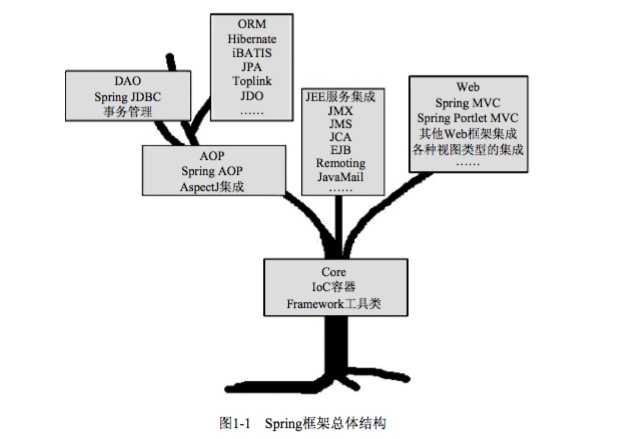

# Spring IOC之BeanFactory

Spring提供了两种容器类型:BeanFactory和ApplicationContext。

* BeanFactory。基础类型IoC容器,提供完整的IoC服务支持。如果没有特殊指定,默认采用延迟初始化策略(lazy-load)。只有当客户端对象需要访问容器中的某个受管对象的时候,才对 该受管对象进行初始化以及依赖注入操作。所以,相对来说,容器启动初期速度较快,所需 要的资源有限。对于资源有限,并且功能要求不是很严格的场景,BeanFactory是比较合适的 IoC容器选择。

* ApplicationContext。ApplicationContext在BeanFactory的基础上构建,是相对比较高级的容器实现,除了拥有BeanFactory的所有支持,ApplicationContext还提供了其他高级特性,比如事件发布、国际化信息支持等。ApplicationContext所管理 的对象,在该类型容器启动之后,默认全部初始化并绑定完成。所以,相对于BeanFactory来说,ApplicationContext要求更多的系统资源,同时,因为在启动时就完成所有初始化,容器启动时间较之BeanFactory也会长一些。在那些系统资源充足,并且要求更多功能的场景中,ApplicationContext类型的容器是比较合适的选择。