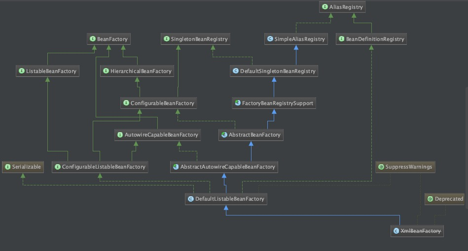

# DefaultListableBeanFactory

XmlBeanFactory继承自DefaultListableBeanFactory，DefaultListableBeanFactory是bean加载的核心，是注册及加载bean的默认实现。



* AliasRegistry定义对alias的简单增删改等操作。
* SimpleAliasRegistry主要使用map作为alias的缓存，并对接口AliasRegistry进行实现。
* SingletonBeanRegistry定义对单例的注册及获取。
* BeanFactory定义获取bean及各种属性。
* DefaultSingletonBeanRegistry对接口SingletonBeanRegistry的实现。
* HierarchicalBeanFactory继承BeanFactory，增加了对parentFactory的支持。
* BeanDefinitionRegistry定义对BeanDefinition的各种增删改操作。
* FactoryBeanRegistrySupport在DefaultSingletonBeanRegistry的基础上增加了对FactoryBean的特殊处理。
* ConfigurableBeanFactory提供配置Factory的各种方法。
* ListableBeanFactory根据条件获取bean的配置清单。
* AbstractBeanFactory综合FactoryBeanRegistrySupport和ConfigurableBeanFactory的功能。
* AutowireCapableBeanFactory提供创建bean，自动注入，初始化以及应用bean的后处理器。
* AbstractAutowireCapableBeanFactory综合AbstractBeanFactory，并对接口AutowireCapableBeanFactory进行实现。
* ConfigurableListableBeanFactory BeanFactory的配置清单，指定忽略类型及接口等。
* DefaultListableBeanFactory 综合上面所有功能，主要是对Bean注册后的处理。

# XMLBeanDefinitionReader

* ResourceLoader 定义资源加载器，主要应用于根据给定的资源文件地址返回对应的Resource。
* BeanDefinitionReader 主要定义资源文件读取并转换为BeanDefinition的各个功能。
* EnvironmentCapale定义获取Environment方法。
* DocumentLoader定义从资源文件加载到转换为Document的功能。
* AbstractBeanDefinitionReader对BeanDefinitionReader，EnvironmentCapale进行实现。
* BeanDefinitionParserDelegate定义解析Element的各种方法。

## XML配置文件读取的大致流程
1. 通过继承自AbstractBeanDefinitionReader中的方法，使用ResourceLoader将资源文件路径转换为对应的Resource文件。
2. 通过DocumentLoader对Resource文件进行转换，将Resource文件转换为Document文件。
3. 通过实现接口BeanDefinitionDocumentReader的DefaultBeanDefinitionDocumentReader类对Document进行解析，并使用BeanDefinitionParserDelegate对Element进行解析。

# XmlBeanFactory

## 配置文件封装

Spring使用Resource接口封装底层资源。

### InputStreamSource
接口
### Resource
接口，继承InputStreamResource

### AbstractResource
抽象类，实现了Resource接口，对接口的方法加以实现。

### WritableResource
接口，继承自Resource。	

### FileSystemResource
继承AbstractResource，实现WritableResource。

构造可以指定一个File或者路径。

```
public InputStream getInputStream() throws IOException {
	return new FileInputStream(this.file);
}
```

直接使用FileInputStream返回一个实例。

### AbstractFileResolvingResource
继承AbstractResource，实现URL到文件引用的转换。

### ClassPathResource
继承自AbstractFileResolvingResource。

```
public InputStream getInputStream() throws IOException {
	InputStream is;
	if (this.clazz != null) {
		is = this.clazz.getResourceAsStream(this.path);
	}
	else if (this.classLoader != null) {
		is = this.classLoader.getResourceAsStream(this.path);
	}
	else {
		is = ClassLoader.getSystemResourceAsStream(this.path);
	}
	return is;
}
```

使用class或者classLoader提供的底层方法实现。

通过Resource相关类完成了对配置文件封装后，读取工作就交给了XMLBeanDefinitionReader来处理。

# XmlBeanFactory

构造函数源码：

```
public XmlBeanFactory(Resource resource, BeanFactory parentBeanFactory) throws BeansException {
	super(parentBeanFactory);
	this.reader.loadBeanDefinitions(resource);
}
```

XmlBeanFactory有两个构造函数，其中`super(parentBeanFactory);`可以追踪到父类AbstractAutowireCapableBeanFactory中：

```
public AbstractAutowireCapableBeanFactory() {
	super();
	ignoreDependencyInterface(BeanNameAware.class);
	ignoreDependencyInterface(BeanFactoryAware.class);
	ignoreDependencyInterface(BeanClassLoaderAware.class);
}
```

`ignoreDependencyInterface`主要是忽略给定接口的自动装配功能。

真正实现资源加载的是在`this.reader.loadBeanDefinitions(resource);`中，也就是在XmlBeanDefinitionReader中完成的。

# 加载Bean，XmlBeanDefinitionReader

1. 封装资源文件，进入XmlBeanDefinitionReader后先对参数Resource使用EncodedResource进行封装。
2. 获取输入流，从Resource中获取对应的InputStream并构造InputSource。
3. 通过构造的InputSource实例和Resource实例继续调用函数doLoadBeanDefinitions(inputSource, encodedResource.getResource());

## EncodedResource
对资源文件的编码进行处理。

## doLoadBeanDefinitions
真正处理部分。

```
protected int doLoadBeanDefinitions(InputSource inputSource, Resource resource)throws BeanDefinitionStoreException {
	try {
		//1. 获取XML文件的验证模式
		int validationMode = getValidationModeForResource(resource);
		//2. 加载XML文件，得到Document
		Document doc = this.documentLoader.loadDocument(
				inputSource, getEntityResolver(), this.errorHandler, validationMode, isNamespaceAware());
		//3. 根据返回的Document注册Bean信息
		return registerBeanDefinitions(doc, resource);
	}
	...
}
```

## 获取XML验证模式

```
protected int getValidationModeForResource(Resource resource) {
	//获取当前验证模式
	int validationModeToUse = getValidationMode();
	//如果验证模式是手工指定的，使用指定的验证模式
	if (validationModeToUse != VALIDATION_AUTO) {
		return validationModeToUse;
	}
	//自动检测验证模式，VALIDATION_DTD 2，VALIDATION_XSD 3
	int detectedMode = detectValidationMode(resource);
	if (detectedMode != VALIDATION_AUTO) {
		return detectedMode;
	}
	//没有自动检测到就使用xsd
	return VALIDATION_XSD;
}
```

## 获取Document

```
Document doc = this.documentLoader.loadDocument(
					inputSource, getEntityResolver(), this.errorHandler, validationMode, isNamespaceAware());
```

获取Document委托给DocumentLoader，DocumentLoader是接口，真正的实现在DefaultDocumentLoader。

DefaultDocumentLoader中代码：

```
public Document loadDocument(InputSource inputSource, EntityResolver entityResolver,ErrorHandler errorHandler, int validationMode, boolean namespaceAware) throws Exception {

//创建DocumentBuilderFactory
	DocumentBuilderFactory factory = createDocumentBuilderFactory(validationMode, namespaceAware);
	//创建DocumentBuilder
	DocumentBuilder builder = createDocumentBuilder(factory, entityResolver, errorHandler);
	//解析InputSource返回Document。
	return builder.parse(inputSource);
}
```

## EntityResolver
作用是项目本身提供一个如何寻找DTD声明的方法，由程序来实现寻找DTD声明的过程。

DelegatingEntityResolver：

```
public InputSource resolveEntity(String publicId, String systemId) throws SAXException, IOException {
	if (systemId != null) {
	//如果是dtd从这解析
		if (systemId.endsWith(DTD_SUFFIX)) {
			return this.dtdResolver.resolveEntity(publicId, systemId);
		}
		else if (systemId.endsWith(XSD_SUFFIX)) {
			//调用"META-INF/spring.schemas";解析
			return this.schemaResolver.resolveEntity(publicId, systemId);
		}
	}
	return null;
}
```
DTD类型的由BeansDtdResolver来解析，直接截取systemId最后的xx.dtd然后去当前路进行该寻找。

XSD类型的由PluggableSchemaResolver解析，默认到META-INF/spring.schemas文件中找到systemId所对应的XSD文件并加载。

## 解析及注册BeanDefinitions

文件转换成Document之后，就需要解析注册bean了。代码如下：

```
public int registerBeanDefinitions(Document doc, Resource resource) throws BeanDefinitionStoreException {
//使用DefaultBeanDefinitionDocumentReader实例化
	BeanDefinitionDocumentReader documentReader = createBeanDefinitionDocumentReader();
	//设置环境变量
	documentReader.setEnvironment(getEnvironment());
	//记录下加载新的BeanDefinition之前的个数
	int countBefore = getRegistry().getBeanDefinitionCount();
	//加载注册bean
	documentReader.registerBeanDefinitions(doc, createReaderContext(resource));
	//返回本次加载的BeanDefinition个数
	return getRegistry().getBeanDefinitionCount() - countBefore;
}
```

DefaultBeanDefinitionDocumentReader中：

```
public void registerBeanDefinitions(Document doc, XmlReaderContext readerContext) {
	this.readerContext = readerContext;
	logger.debug("Loading bean definitions");
	//获取root
	Element root = doc.getDocumentElement();
	//真正开始解析的方法
	doRegisterBeanDefinitions(root);
}
```

```
protected void doRegisterBeanDefinitions(Element root) {
//处理profile属性
	String profileSpec = root.getAttribute(PROFILE_ATTRIBUTE);
	if (StringUtils.hasText(profileSpec)) {
		String[] specifiedProfiles = StringUtils.tokenizeToStringArray(
				profileSpec, BeanDefinitionParserDelegate.MULTI_VALUE_ATTRIBUTE_DELIMITERS);
		if (!getEnvironment().acceptsProfiles(specifiedProfiles)) {
			return;
		}
	}

//专门处理解析
	BeanDefinitionParserDelegate parent = this.delegate;
	this.delegate = createDelegate(this.readerContext, root, parent);

	//解析前处理，留给子类实现
	preProcessXml(root);
	parseBeanDefinitions(root, this.delegate);
	//解析后处理，留给子类实现
	postProcessXml(root);

	this.delegate = parent;
}
```

### profile属性的使用
可以用于多环境配置。

```
<beans profile="dev">
	...
</beans>
<beans profile="test">
	...
</beans>
...
```

首先获取是否定义了profile属性，如果定义了会需要到环境变量中寻找。

### parseBeanDefinitions
解析并注册BeanDefinition。

```
protected void parseBeanDefinitions(Element root, BeanDefinitionParserDelegate delegate) {
//对默认的root进行处理
	if (delegate.isDefaultNamespace(root)) {
		NodeList nl = root.getChildNodes();
		for (int i = 0; i < nl.getLength(); i++) {
			Node node = nl.item(i);
			if (node instanceof Element) {
				Element ele = (Element) node;
				if (delegate.isDefaultNamespace(ele)) {
				//处理默认bean标签
					parseDefaultElement(ele, delegate);
				}
				else {
				//处理自定义bean标签
					delegate.parseCustomElement(ele);
				}
			}
		}
	}
	else {
	//处理自定义root标签
		delegate.parseCustomElement(root);
	}
}
```

Spring配置有默认Bean声明和自定义声明。

# 默认标签的解析
## parseDefaultElement

```
private void parseDefaultElement(Element ele, BeanDefinitionParserDelegate delegate) {
	if (delegate.nodeNameEquals(ele, IMPORT_ELEMENT)) {
	//解析import标签
		importBeanDefinitionResource(ele);
	}
	else if (delegate.nodeNameEquals(ele, ALIAS_ELEMENT)) {
	//解析alias标签
		processAliasRegistration(ele);
	}
	else if (delegate.nodeNameEquals(ele, BEAN_ELEMENT)) {
	//解析bean标签
		processBeanDefinition(ele, delegate);
	}
	else if (delegate.nodeNameEquals(ele, NESTED_BEANS_ELEMENT)) {
		//对beans标签的处理
		doRegisterBeanDefinitions(ele);
	}
}
```

## bean标签的解析

```
processBeanDefinition(ele, delegate);
```

```
protected void processBeanDefinition(Element ele, BeanDefinitionParserDelegate delegate) {
	BeanDefinitionHolder bdHolder = delegate.parseBeanDefinitionElement(ele);
	if (bdHolder != null) {
		bdHolder = delegate.decorateBeanDefinitionIfRequired(ele, bdHolder);
		try {
			// Register the final decorated instance.
			BeanDefinitionReaderUtils.registerBeanDefinition(bdHolder, getReaderContext().getRegistry());
		}
		// Send registration event.
		getReaderContext().fireComponentRegistered(new BeanComponentDefinition(bdHolder));
	}
}
```

1. 首先委托BeanDefinitionDelegate类的parseBeanDefinitionElement方法进行元素解析，返回BeanDefinitionHolder类型的实例bdHolder，处理之后bdHolder包含配置文件中各种属性，class，name，id，alias等。
2. 返回的bdHolder不为空，若存在默认标签的子节点下有自定义属性，需要再次对自定义标签进行解析。
3. 解析完成之后，需要对解析后的bdHolder进行注册，委托给BeanDefinitionReaderUtils的registerBeanDefinition方法。
4. 发出响应事件，通知相关的监听器。

## 解析BeanDefinition
delegate.parseBeanDefinitionElement(ele)：

```
public BeanDefinitionHolder parseBeanDefinitionElement(Element ele) {
	return parseBeanDefinitionElement(ele, null);
}
```

```
public BeanDefinitionHolder parseBeanDefinitionElement(Element ele, BeanDefinition containingBean) {
	//获取id属性
	String id = ele.getAttribute(ID_ATTRIBUTE);
	//获取name属性
	String nameAttr = ele.getAttribute(NAME_ATTRIBUTE);

	//分割name属性
	List<String> aliases = new ArrayList<String>();
	if (StringUtils.hasLength(nameAttr)) {
		String[] nameArr = StringUtils.tokenizeToStringArray(nameAttr, MULTI_VALUE_ATTRIBUTE_DELIMITERS);
		aliases.addAll(Arrays.asList(nameArr));
	}

	String beanName = id;
	//没有id但是有name，使用name作为beanName
	if (!StringUtils.hasText(beanName) && !aliases.isEmpty()) {
		beanName = aliases.remove(0);
		if (logger.isDebugEnabled()) {
			logger.debug("No XML 'id' specified - using '" + beanName +
					"' as bean name and " + aliases + " as aliases");
		}
	}

	if (containingBean == null) {
		checkNameUniqueness(beanName, aliases, ele);
	}

	AbstractBeanDefinition beanDefinition = parseBeanDefinitionElement(ele, beanName, containingBean);
	if (beanDefinition != null) {
	//不存在beanName，Spring提供的命名规则生成beanName
		if (!StringUtils.hasText(beanName)) {
			try {
				if (containingBean != null) {
					beanName = BeanDefinitionReaderUtils.generateBeanName(
							beanDefinition, this.readerContext.getRegistry(), true);
				}
				else {
					beanName = this.readerContext.generateBeanName(beanDefinition);
					String beanClassName = beanDefinition.getBeanClassName();
					if (beanClassName != null &&
							beanName.startsWith(beanClassName) && beanName.length() > beanClassName.length() &&
							!this.readerContext.getRegistry().isBeanNameInUse(beanClassName)) {
						aliases.add(beanClassName);
					}
				}
			}
		}
		String[] aliasesArray = StringUtils.toStringArray(aliases);
		return new BeanDefinitionHolder(beanDefinition, beanName, aliasesArray);
	}

	return null;
}
```

1. 提取元素中id，name属性。
2. 进一步解析其他所有属性统一封装至AbstractBeanDefinition类型实例。
3. 如果没有beanName，使用默认规则生成beanName。
4. 将信息封装到BeanDefinitionHolder实例中。

### 解析其他标签

`AbstractBeanDefinition beanDefinition = parseBeanDefinitionElement(ele, beanName, containingBean);`

```
public AbstractBeanDefinition parseBeanDefinitionElement(
			Element ele, String beanName, BeanDefinition containingBean) {

	this.parseState.push(new BeanEntry(beanName));

	String className = null;
	//解析class属性
	if (ele.hasAttribute(CLASS_ATTRIBUTE)) {
		className = ele.getAttribute(CLASS_ATTRIBUTE).trim();
	}

	try {
	//解析parent属性
		String parent = null;
		if (ele.hasAttribute(PARENT_ATTRIBUTE)) {
			parent = ele.getAttribute(PARENT_ATTRIBUTE);
		}
		//创建用于承载属性的AbstractBeanDefinition
		AbstractBeanDefinition bd = createBeanDefinition(className, parent);

		//解析默认bean的各种属性
		parseBeanDefinitionAttributes(ele, beanName, containingBean, bd);
		//提取description
		bd.setDescription(DomUtils.getChildElementValueByTagName(ele, DESCRIPTION_ELEMENT));
		//解析元数据
		parseMetaElements(ele, bd);
		//解析lookup-method属性
		parseLookupOverrideSubElements(ele, bd.getMethodOverrides());
		//解析replace-method属性
		parseReplacedMethodSubElements(ele, bd.getMethodOverrides());
		//解析构造函数参数
		parseConstructorArgElements(ele, bd);
		//解析property子元素
		parsePropertyElements(ele, bd);
		//解析qualifier子元素
		parseQualifierElements(ele, bd);

		bd.setResource(this.readerContext.getResource());
		bd.setSource(extractSource(ele));

		return bd;
	}

	return null;
}
```

### 创建用于承载属性的BeanDefinition
BeanDefinition是一个接口，有三种实现：RootBeanDefinition，ChildBeanDefinition，GenericBeanDefinition，都继承了AbstractBeanDefinition。

Spring通过BeanDefinition将配置文件中的bean配置信息转换为容器内部表示，并将这些BeanDefinition注册到BeanDefinitionRegistry中。BeanDefinitionRegistry主要是以map形式保存。

```
protected AbstractBeanDefinition createBeanDefinition(String className, String parentName)throws ClassNotFoundException {

	return BeanDefinitionReaderUtils.createBeanDefinition(
			parentName, className, this.readerContext.getBeanClassLoader());
}
```

```
public static AbstractBeanDefinition createBeanDefinition(
			String parentName, String className, ClassLoader classLoader) throws ClassNotFoundException {

	GenericBeanDefinition bd = new GenericBeanDefinition();
	bd.setParentName(parentName);
	if (className != null) {
		if (classLoader != null) {
			bd.setBeanClass(ClassUtils.forName(className, classLoader));
		}
		else {
			bd.setBeanClassName(className);
		}
	}
	return bd;
}
```

## 解析各种属性

```
public AbstractBeanDefinition parseBeanDefinitionAttributes(Element ele, String beanName,
			BeanDefinition containingBean, AbstractBeanDefinition bd) {
	//解析scope属性
	if (ele.hasAttribute(SCOPE_ATTRIBUTE)) {
		// Spring 2.x "scope" attribute
		bd.setScope(ele.getAttribute(SCOPE_ATTRIBUTE));
		//scope和singleton两个属性不能同时出现
		if (ele.hasAttribute(SINGLETON_ATTRIBUTE)) {
			error("Specify either 'scope' or 'singleton', not both", ele);
		}
	}
	//解析singleton属性
	else if (ele.hasAttribute(SINGLETON_ATTRIBUTE)) {
		// Spring 1.x "singleton" attribute
		bd.setScope(TRUE_VALUE.equals(ele.getAttribute(SINGLETON_ATTRIBUTE)) ?
				BeanDefinition.SCOPE_SINGLETON : BeanDefinition.SCOPE_PROTOTYPE);
	}
	else if (containingBean != null) {
		// Take default from containing bean in case of an inner bean definition.
		//在嵌入beanDefinition情况下且没有单独指定scope属性，则使用父类默认属性
		bd.setScope(containingBean.getScope());
	}

//解析abstract属性
	if (ele.hasAttribute(ABSTRACT_ATTRIBUTE)) {
		bd.setAbstract(TRUE_VALUE.equals(ele.getAttribute(ABSTRACT_ATTRIBUTE)));
	}
	//解析lazy-init属性
	String lazyInit = ele.getAttribute(LAZY_INIT_ATTRIBUTE);
	if (DEFAULT_VALUE.equals(lazyInit)) {
		lazyInit = this.defaults.getLazyInit();
	}
	//没有设置或者设置成其他的字符都会被设置为false
	bd.setLazyInit(TRUE_VALUE.equals(lazyInit));
	//解析autowire属性
	String autowire = ele.getAttribute(AUTOWIRE_ATTRIBUTE);
	bd.setAutowireMode(getAutowireMode(autowire));
	//解析dependency-check属性
	String dependencyCheck = ele.getAttribute(DEPENDENCY_CHECK_ATTRIBUTE);
	bd.setDependencyCheck(getDependencyCheck(dependencyCheck));
	//解析depends-on属性
	if (ele.hasAttribute(DEPENDS_ON_ATTRIBUTE)) {
		String dependsOn = ele.getAttribute(DEPENDS_ON_ATTRIBUTE);
		bd.setDependsOn(StringUtils.tokenizeToStringArray(dependsOn, MULTI_VALUE_ATTRIBUTE_DELIMITERS));
	}
	//解析autowire-candidate属性
	String autowireCandidate = ele.getAttribute(AUTOWIRE_CANDIDATE_ATTRIBUTE);
	if ("".equals(autowireCandidate) || DEFAULT_VALUE.equals(autowireCandidate)) {
		String candidatePattern = this.defaults.getAutowireCandidates();
		if (candidatePattern != null) {
			String[] patterns = StringUtils.commaDelimitedListToStringArray(candidatePattern);
			bd.setAutowireCandidate(PatternMatchUtils.simpleMatch(patterns, beanName));
		}
	}
	else {
		bd.setAutowireCandidate(TRUE_VALUE.equals(autowireCandidate));
	}
	
	//解析primary属性
	if (ele.hasAttribute(PRIMARY_ATTRIBUTE)) {
		bd.setPrimary(TRUE_VALUE.equals(ele.getAttribute(PRIMARY_ATTRIBUTE)));
	}
	
	//解析init-method属性
	if (ele.hasAttribute(INIT_METHOD_ATTRIBUTE)) {
		String initMethodName = ele.getAttribute(INIT_METHOD_ATTRIBUTE);
		if (!"".equals(initMethodName)) {
			bd.setInitMethodName(initMethodName);
		}
	}
	else {
		if (this.defaults.getInitMethod() != null) {
			bd.setInitMethodName(this.defaults.getInitMethod());
			bd.setEnforceInitMethod(false);
		}
	}
	
	//解析destory-method属性
	if (ele.hasAttribute(DESTROY_METHOD_ATTRIBUTE)) {
		String destroyMethodName = ele.getAttribute(DESTROY_METHOD_ATTRIBUTE);
		if (!"".equals(destroyMethodName)) {
			bd.setDestroyMethodName(destroyMethodName);
		}
	}
	else {
		if (this.defaults.getDestroyMethod() != null) {
			bd.setDestroyMethodName(this.defaults.getDestroyMethod());
			bd.setEnforceDestroyMethod(false);
		}
	}
	//解析factory-method属性
	if (ele.hasAttribute(FACTORY_METHOD_ATTRIBUTE)) {
		bd.setFactoryMethodName(ele.getAttribute(FACTORY_METHOD_ATTRIBUTE));
	}
	//解析factory-bean属性
	if (ele.hasAttribute(FACTORY_BEAN_ATTRIBUTE)) {
		bd.setFactoryBeanName(ele.getAttribute(FACTORY_BEAN_ATTRIBUTE));
	}

	return bd;
}
```

## 解析元数据 meta

```
<bean id="myBean" class="me.cxis.MyBean">
	<meta key="str" value="sadasd"/>
</bean>
```

```
public void parseMetaElements(Element ele, BeanMetadataAttributeAccessor attributeAccessor) {
//获取所有子元素
	NodeList nl = ele.getChildNodes();
	for (int i = 0; i < nl.getLength(); i++) {
		Node node = nl.item(i);
		if (isCandidateElement(node) && nodeNameEquals(node, META_ELEMENT)) {
			Element metaElement = (Element) node;
			String key = metaElement.getAttribute(KEY_ATTRIBUTE);
			String value = metaElement.getAttribute(VALUE_ATTRIBUTE);
			//使用key，value构造BeanMetadataAttribute
			BeanMetadataAttribute attribute = new BeanMetadataAttribute(key, value);
			attribute.setSource(extractSource(metaElement));
			attributeAccessor.addMetadataAttribute(attribute);
		}
	}
}
```

## 解析子元素lookup-method
获取器注入，把一个方法声明为返回某种类型的bean，但实际要返回的bean在配置文件里配置。

```
public void parseLookupOverrideSubElements(Element beanEle, MethodOverrides overrides) {
	NodeList nl = beanEle.getChildNodes();
	for (int i = 0; i < nl.getLength(); i++) {
		Node node = nl.item(i);
		//仅当在Spring默认bean的子元素下且为lookup-method时有效
		if (isCandidateElement(node) && nodeNameEquals(node, LOOKUP_METHOD_ELEMENT)) {
			Element ele = (Element) node;
			//要修饰的方法
			String methodName = ele.getAttribute(NAME_ATTRIBUTE);
			//要返回的bean
			String beanRef = ele.getAttribute(BEAN_ELEMENT);
			LookupOverride override = new LookupOverride(methodName, beanRef);
			override.setSource(extractSource(ele));
			overrides.addOverride(override);
		}
	}
}
```

## 解析子元素replaced-method
方法替换，可以在运行时用新的方法替换现有的方法，与lookup-method不同，replaced-method不但可以动态的替换返回实体bean，而且还能动态的更改原有方法的逻辑。

```
public void parseReplacedMethodSubElements(Element beanEle, MethodOverrides overrides) {
	NodeList nl = beanEle.getChildNodes();
	for (int i = 0; i < nl.getLength(); i++) {
		Node node = nl.item(i);
		//仅当在Spring默认bean的子元素下，并且为replaced-method时有效
		if (isCandidateElement(node) && nodeNameEquals(node, REPLACED_METHOD_ELEMENT)) {
			Element replacedMethodEle = (Element) node;
			//要替换的旧方法
			String name = replacedMethodEle.getAttribute(NAME_ATTRIBUTE);
			//新的替换方法
			String callback = replacedMethodEle.getAttribute(REPLACER_ATTRIBUTE);
			ReplaceOverride replaceOverride = new ReplaceOverride(name, callback);
			// Look for arg-type match elements.
			List<Element> argTypeEles = DomUtils.getChildElementsByTagName(replacedMethodEle, ARG_TYPE_ELEMENT);
			for (Element argTypeEle : argTypeEles) {
				//参数
				String match = argTypeEle.getAttribute(ARG_TYPE_MATCH_ATTRIBUTE);
				match = (StringUtils.hasText(match) ? match : DomUtils.getTextValue(argTypeEle));
				if (StringUtils.hasText(match)) {
					replaceOverride.addTypeIdentifier(match);
				}
			}
			replaceOverride.setSource(extractSource(replacedMethodEle));
			overrides.addOverride(replaceOverride);
		}
	}
}
```

## 解析子元素constructor-arg

```
public void parseConstructorArgElements(Element beanEle, BeanDefinition bd) {
	NodeList nl = beanEle.getChildNodes();
	for (int i = 0; i < nl.getLength(); i++) {
		Node node = nl.item(i);
		if (isCandidateElement(node) && nodeNameEquals(node, CONSTRUCTOR_ARG_ELEMENT)) {
			//具体的解析方法
			parseConstructorArgElement((Element) node, bd);
		}
	}
}
```


```
public void parseConstructorArgElement(Element ele, BeanDefinition bd) {
	//index属性
	String indexAttr = ele.getAttribute(INDEX_ATTRIBUTE);
	//type属性
	String typeAttr = ele.getAttribute(TYPE_ATTRIBUTE);
	//name属性
	String nameAttr = ele.getAttribute(NAME_ATTRIBUTE);
	if (StringUtils.hasLength(indexAttr)) {
		try {
			int index = Integer.parseInt(indexAttr);
			if (index < 0) {
				error("'index' cannot be lower than 0", ele);
			}
			else {
				try {
					this.parseState.push(new ConstructorArgumentEntry(index));
					Object value = parsePropertyValue(ele, bd, null);
					ConstructorArgumentValues.ValueHolder valueHolder = new ConstructorArgumentValues.ValueHolder(value);
					if (StringUtils.hasLength(typeAttr)) {
						valueHolder.setType(typeAttr);
					}
					if (StringUtils.hasLength(nameAttr)) {
						valueHolder.setName(nameAttr);
					}
					valueHolder.setSource(extractSource(ele));
					//不允许重复指定相同的参数
					if (bd.getConstructorArgumentValues().hasIndexedArgumentValue(index)) {
						error("Ambiguous constructor-arg entries for index " + index, ele);
					}
					else {
						bd.getConstructorArgumentValues().addIndexedArgumentValue(index, valueHolder);
					}
				}
				finally {
					this.parseState.pop();
				}
			}
		}
		
	}
	else {
		try {
			this.parseState.push(new ConstructorArgumentEntry());
			Object value = parsePropertyValue(ele, bd, null);
			ConstructorArgumentValues.ValueHolder valueHolder = new ConstructorArgumentValues.ValueHolder(value);
			if (StringUtils.hasLength(typeAttr)) {
				valueHolder.setType(typeAttr);
			}
			if (StringUtils.hasLength(nameAttr)) {
				valueHolder.setName(nameAttr);
			}
			valueHolder.setSource(extractSource(ele));
			bd.getConstructorArgumentValues().addGenericArgumentValue(valueHolder);
		}
		finally {
			this.parseState.pop();
		}
	}
}
```

* 如果配置中指定了index属性：
	1. 解析constructor-arg的子元素
	2. 使用ConstructorArgumentValues.ValueHolder类型来封装解析出来的元素。
	3. 将type、name、index属性一并封装在ConstructorArgumentValues.ValueHolder中并添加到当前BeanDefinition的indexedArgumentValues属性中。
* 如果没有指定index属性：
	1. 解析constructor-arg的子元素
	2. 使用ConstructorArgumentValues.ValueHolder类型来封装解析出来的元素。
	3. 将type、name、index属性一并封装在ConstructorArgumentValues.ValueHolder中并添加到当前BeanDefinition的genericArgumentValues属性中。

### parsePropertyVaule
解析构造函数配置中子元素的过程

```
public Object parsePropertyValue(Element ele, BeanDefinition bd, String propertyName) {
	String elementName = (propertyName != null) ?
					"<property> element for property '" + propertyName + "'" :
					"<constructor-arg> element";

	// Should only have one child element: ref, value, list, etc.
	NodeList nl = ele.getChildNodes();
	Element subElement = null;
	for (int i = 0; i < nl.getLength(); i++) {
		Node node = nl.item(i);
		if (node instanceof Element && !nodeNameEquals(node, DESCRIPTION_ELEMENT) &&
				!nodeNameEquals(node, META_ELEMENT)) {
			// Child element is what we're looking for.
			if (subElement != null) {
				error(elementName + " must not contain more than one sub-element", ele);
			}
			else {
				subElement = (Element) node;
			}
		}
	}
	//ref属性
	boolean hasRefAttribute = ele.hasAttribute(REF_ATTRIBUTE);
	//value属性
	boolean hasValueAttribute = ele.hasAttribute(VALUE_ATTRIBUTE);
	
	//1.有ref属性又有value属性
	//2.存在ref属性或者value属性且又有子元素
	if ((hasRefAttribute && hasValueAttribute) ||
			((hasRefAttribute || hasValueAttribute) && subElement != null)) {
		error(elementName +
				" is only allowed to contain either 'ref' attribute OR 'value' attribute OR sub-element", ele);
	}

	if (hasRefAttribute) {
		String refName = ele.getAttribute(REF_ATTRIBUTE);
		if (!StringUtils.hasText(refName)) {
			error(elementName + " contains empty 'ref' attribute", ele);
		}
		//使用RuntimeBeanReference封装对应的ref名称
		RuntimeBeanReference ref = new RuntimeBeanReference(refName);
		ref.setSource(extractSource(ele));
		return ref;
	}
	else if (hasValueAttribute) {
		//使用TypedStringValue封装value
		TypedStringValue valueHolder = new TypedStringValue(ele.getAttribute(VALUE_ATTRIBUTE));
		valueHolder.setSource(extractSource(ele));
		return valueHolder;
	}
	else if (subElement != null) {
		//解析子元素
		return parsePropertySubElement(subElement, bd);
	}
	else {
		// 没有ref，没有value，没有子元素
		error(elementName + " must specify a ref or value", ele);
		return null;
	}
}
```

## 解析子元素property

## 解析子元素qualifier
更多的使用的是注解形式。

# AbstractBeanDefinition属性

GenericBeanDefinition只是子类实现，而大部分通用属性都保存在了AbstractBeanDefinition中。

## 解析默认标签中的自定义标签元素

`bdHolder = delegate.decorateBeanDefinitionIfRequired(ele,bdHolder);`
当Spring中的bean使用的是默认标签配置，但是子元素使用了自定义配置，就使用此进行解析。

# 注册解析BeanDefinition

`BeanDefinitionReaderUtils.registerBeanDefinition(bdHolder, getReaderContext().getRegistry());`


```
public static void registerBeanDefinition(
			BeanDefinitionHolder definitionHolder, BeanDefinitionRegistry registry)
			throws BeanDefinitionStoreException {

	// 使用beanName做唯一标识
	String beanName = definitionHolder.getBeanName();
	registry.registerBeanDefinition(beanName, definitionHolder.getBeanDefinition());

	// 如果有别名，注册别名
	String[] aliases = definitionHolder.getAliases();
	if (aliases != null) {
		for (String aliase : aliases) {
			registry.registerAlias(beanName, aliase);
		}
	}
}
```

1. 通过beanName注册BeanDefinition

	```
	public void registerBeanDefinition(String beanName, BeanDefinition beanDefinition)
			throws BeanDefinitionStoreException {

		Assert.hasText(beanName, "Bean name must not be empty");
		Assert.notNull(beanDefinition, "BeanDefinition must not be null");
	
		if (beanDefinition instanceof AbstractBeanDefinition) {
			try {
			//注册前最后一次校验，主要是对于AbstractBeanDefinition属性中的methodOverrides校验，校验methodOverrides是否与工程方法共存或者methodOverrides对应的方法根本不存在。
				((AbstractBeanDefinition) beanDefinition).validate();
			}
			catch (BeanDefinitionValidationException ex) {
				throw new BeanDefinitionStoreException(beanDefinition.getResourceDescription(), beanName,
						"Validation of bean definition failed", ex);
			}
		}
	
		BeanDefinition oldBeanDefinition;
		//加锁，beanDefinitionMap是个全局变量
		synchronized (this.beanDefinitionMap) {
			//已经存在的beanDefinition
			oldBeanDefinition = this.beanDefinitionMap.get(beanName);
			//如果已经存在
			if (oldBeanDefinition != null) {
				//配置中配置了bean不允许覆盖，抛出异常
				if (!this.allowBeanDefinitionOverriding) {
					throw new BeanDefinitionStoreException(beanDefinition.getResourceDescription(), beanName,...);
				}

			}
			else {
				//记录beanName
				this.beanDefinitionNames.add(beanName);
				this.frozenBeanDefinitionNames = null;
			}
			//注册beanDefinition
			this.beanDefinitionMap.put(beanName, beanDefinition);
		}
		//重置beanName对应的缓存
		if (oldBeanDefinition != null || containsSingleton(beanName)) {
			resetBeanDefinition(beanName);
		}
	}
	```
	
	* 对AbstractBeanDefinition的methodOverrides属性进行校验。
	* beanName已经注册，如设置了不允许bean覆盖，则需要抛出异常，否则直接覆盖。
	* 加入map缓存。
	* 清除解析之前留下的对应beanName缓存。

2. 通过别名注册BeanDefinition
	
	```
	public void registerAlias(String name, String alias) {
		Assert.hasText(name, "'name' must not be empty");
		Assert.hasText(alias, "'alias' must not be empty");
		//alias与beanName相同，不记录alias并删除对应的alias
		if (alias.equals(name)) {
			this.aliasMap.remove(alias);
		}
		else {
			//不允许覆盖，抛异常
			if (!allowAliasOverriding()) {
				String registeredName = this.aliasMap.get(alias);
				if (registeredName != null && !registeredName.equals(name)) {
					throw new IllegalStateException(...);
				}
			}
			//若A->B存在，再次出现A->B->C时抛异常
			checkForAliasCircle(name, alias);
			this.aliasMap.put(alias, name);
		}
	}
	```
	
	* alias与beanName相同，则不需要处理并删除原来的alias。
	* alias覆盖处理。
	* alias循环检查。
	* 注册alias。

# 通知监听器解析及注册完成

`getReaderContext().fireComponentRegistered(new BeanComponentDefinition(bdHolder));`

Spring没对此事件做任何处理，留作开发人员扩展用。

# alias标签的解析

```
protected void processAliasRegistration(Element ele) {
	//获取name
	String name = ele.getAttribute(NAME_ATTRIBUTE);
	//获取alias
	String alias = ele.getAttribute(ALIAS_ATTRIBUTE);
	boolean valid = true;
	if (!StringUtils.hasText(name)) {
		getReaderContext().error("Name must not be empty", ele);
		valid = false;
	}
	if (!StringUtils.hasText(alias)) {
		getReaderContext().error("Alias must not be empty", ele);
		valid = false;
	}
	if (valid) {
		try {
			//注册alias
			getReaderContext().getRegistry().registerAlias(name, alias);
		}
		//注册之后通知监听器做相应处理
		getReaderContext().fireAliasRegistered(name, alias, extractSource(ele));
	}
}
```

# import标签解析

```
protected void importBeanDefinitionResource(Element ele) {
	//resource属性
	String location = ele.getAttribute(RESOURCE_ATTRIBUTE);
	if (!StringUtils.hasText(location)) {
		getReaderContext().error("Resource location must not be empty", ele);
		return;
	}

	// 解析系统属性 如 "${user.dir}"
	location = getEnvironment().resolveRequiredPlaceholders(location);

	Set<Resource> actualResources = new LinkedHashSet<Resource>(4);

	// 判断location是绝对uri还是相对uri
	boolean absoluteLocation = false;
	try {
		absoluteLocation = ResourcePatternUtils.isUrl(location) || ResourceUtils.toURI(location).isAbsolute();
	}

	// 绝对地址，根据地址加载配置文件
	if (absoluteLocation) {
		try {
			int importCount = getReaderContext().getReader().loadBeanDefinitions(location, actualResources);
			
		}
		
	}
	else {
		// 相对地址，根据相对地址计算出绝对路径
		try {
			int importCount;
			Resource relativeResource = getReaderContext().getResource().createRelative(location);
			if (relativeResource.exists()) {
				importCount = getReaderContext().getReader().loadBeanDefinitions(relativeResource);
				actualResources.add(relativeResource);
			}
			else {
				String baseLocation = getReaderContext().getResource().getURL().toString();
				importCount = getReaderContext().getReader().loadBeanDefinitions(
						StringUtils.applyRelativePath(baseLocation, location), actualResources);
			}
			
		}
	}
	Resource[] actResArray = actualResources.toArray(new Resource[actualResources.size()]);
	getReaderContext().fireImportProcessed(location, actResArray, extractSource(ele));
}
```

1. 获取resource属性表示的路径。
2. 解析路径中的系统属性。
3. 判断location是绝对路径还是相对路径。
4. 如果是绝对路径递归调用bean解析过程，进行解析。
5. 如果是相对路径则计算出绝对路径进行解析。
6. 通知监听器，解析完成。


# 自定义标签的解析
parseCustomElement

扩展Spring自定义标签步骤：

1. 创建一个需要扩展的组件。
2. 定义一个XSD文件描述组件内容。
3. 创建一个实现BeanDefinitionParser接口，解析XSD文件中定义和组件定义。
4. 创建一个Handler，扩展自NamespaceHandlerSupport，将组件注册到Spring容器。
5. 编写Spring.handlers和Spring.schemas文件。

## 自定义标签解析

```
//containingBd为父类bean，顶层元素为null
public BeanDefinition parseCustomElement(Element ele, BeanDefinition containingBd) {
	//获取对应命名空间
	String namespaceUri = getNamespaceURI(ele);
	//根据命名空间找到对应的NamespaceHandler
	NamespaceHandler handler = this.readerContext.getNamespaceHandlerResolver().resolve(namespaceUri);
	if (handler == null) {
		error("Unable to locate Spring NamespaceHandler for XML schema namespace [" + namespaceUri + "]", ele);
		return null;
	}
	//调用自定义NamespaceHandler进行解析
	return handler.parse(ele, new ParserContext(this.readerContext, this, containingBd));
}
```

## 获取标签命名空间

```
public String getNamespaceURI(Node node) {
	return node.getNamespaceURI();
}
```

调用jdk中的方法获取。

## 提取自定义标签处理器

```
public NamespaceHandler resolve(String namespaceUri) {
	//获取已经配置的handler映射
	Map<String, Object> handlerMappings = getHandlerMappings();
	//根据命名空间找到对应信息
	Object handlerOrClassName = handlerMappings.get(namespaceUri);
	if (handlerOrClassName == null) {
		return null;
	}
	else if (handlerOrClassName instanceof NamespaceHandler) {
		//已经做过解析的从缓存直接读取
		return (NamespaceHandler) handlerOrClassName;
	}
	else {
		//没有做过解析，返回类路径
		String className = (String) handlerOrClassName;
		try {
			//反射机制将类路径转化为类
			Class<?> handlerClass = ClassUtils.forName(className, this.classLoader);
			if (!NamespaceHandler.class.isAssignableFrom(handlerClass)) {
				throw new FatalBeanException("Class [" + className + "] for namespace [" + namespaceUri +
						"] does not implement the [" + NamespaceHandler.class.getName() + "] interface");
			}
			//初始化类
			NamespaceHandler namespaceHandler = (NamespaceHandler) BeanUtils.instantiateClass(handlerClass);
			//调用NamespaceHandler的初始化方法
			namespaceHandler.init();
			//记录在缓存中
			handlerMappings.put(namespaceUri, namespaceHandler);
			return namespaceHandler;
		}	}
}
```

getHandlerMappings：

```
private Map<String, Object> getHandlerMappings() {
	if (this.handlerMappings == null) {
		synchronized (this) {
			if (this.handlerMappings == null) {
				try {
					//this.handlerMappingsLocation已经初始化为META-INF/Spring.handlers
					Properties mappings =
							PropertiesLoaderUtils.loadAllProperties(this.handlerMappingsLocation, this.classLoader);
					if (logger.isDebugEnabled()) {
						logger.debug("Loaded NamespaceHandler mappings: " + mappings);
					}
					Map<String, Object> handlerMappings = new ConcurrentHashMap<String, Object>(mappings.size());
					CollectionUtils.mergePropertiesIntoMap(mappings, handlerMappings);
					this.handlerMappings = handlerMappings;
				}
			}
		}
	}
	return this.handlerMappings;
}
```

## 标签解析

`handler.parse(ele, new ParserContext(this.readerContext, this, containingBd));`

```
public BeanDefinition parse(Element element, ParserContext parserContext) {
	return findParserForElement(element, parserContext).parse(element, parserContext);
}
```
寻找元素对应的解析器，调用解析器中的parse方法。

```
private BeanDefinitionParser findParserForElement(Element element, ParserContext parserContext) {
	//获取元素名称
	String localName = parserContext.getDelegate().getLocalName(element);
	//找到对应解析器
	//注册的解析器
	BeanDefinitionParser parser = this.parsers.get(localName);
	if (parser == null) {
		parserContext.getReaderContext().fatal(
				"Cannot locate BeanDefinitionParser for element [" + localName + "]", element);
	}
	return parser;
}
```

parse方法

```
public final BeanDefinition parse(Element element, ParserContext parserContext) {
	AbstractBeanDefinition definition = parseInternal(element, parserContext);
	if (definition != null && !parserContext.isNested()) {
		try {
			String id = resolveId(element, definition, parserContext);
			if (!StringUtils.hasText(id)) {
				parserContext.getReaderContext().error(
						"Id is required for element '" + parserContext.getDelegate().getLocalName(element)
								+ "' when used as a top-level tag", element);
			}
			String[] aliases = new String[0];
			String name = element.getAttribute(NAME_ATTRIBUTE);
			if (StringUtils.hasLength(name)) {
				aliases = StringUtils.trimArrayElements(StringUtils.commaDelimitedListToStringArray(name));
			}
			//将AbstractBeanDefinition转换为BeanDefinitionHolder
			BeanDefinitionHolder holder = new BeanDefinitionHolder(definition, id, aliases);
			registerBeanDefinition(holder, parserContext.getRegistry());
			if (shouldFireEvents()) {
				//通知监听器进行处理
				BeanComponentDefinition componentDefinition = new BeanComponentDefinition(holder);
				postProcessComponentDefinition(componentDefinition);
				parserContext.registerComponent(componentDefinition);
			}
		}
	}
	return definition;
}
```

```
protected final AbstractBeanDefinition parseInternal(Element element, ParserContext parserContext) {
	BeanDefinitionBuilder builder = BeanDefinitionBuilder.genericBeanDefinition();
	String parentName = getParentName(element);
	if (parentName != null) {
		builder.getRawBeanDefinition().setParentName(parentName);
	}
	Class<?> beanClass = getBeanClass(element);
	if (beanClass != null) {
		builder.getRawBeanDefinition().setBeanClass(beanClass);
	}
	else {
		String beanClassName = getBeanClassName(element);
		if (beanClassName != null) {
			builder.getRawBeanDefinition().setBeanClassName(beanClassName);
		}
	}
	builder.getRawBeanDefinition().setSource(parserContext.extractSource(element));
	if (parserContext.isNested()) {
		// Inner bean definition must receive same scope as containing bean.
		builder.setScope(parserContext.getContainingBeanDefinition().getScope());
	}
	if (parserContext.isDefaultLazyInit()) {
		// Default-lazy-init applies to custom bean definitions as well.
		builder.setLazyInit(true);
	}
	doParse(element, parserContext, builder);
	return builder.getBeanDefinition();
}
```

# bean的加载

```
public Object getBean(String name) throws BeansException {
	return doGetBean(name, null, null, false);
}
```

```
protected <T> T doGetBean(
			final String name, final Class<T> requiredType, final Object[] args, boolean typeCheckOnly)
			throws BeansException {
	//提取对应的beanName
	final String beanName = transformedBeanName(name);
	Object bean;

	// 检查缓存中或者实例工厂中是否有对应的实例
	//Spring在创建单例Bean的时候回存在依赖注入的情况，而在创建依赖的时候为了避免循环依赖
	//Spring创建bean的原则是不等bean创建完成就会将创建bean的ObjectFactory提早曝光
	//也就是将ObjecFactory加入到缓存中去，一旦下个bean创建的时候需要依赖上个bean，直接使用ObjectFactory
	
	//直接尝试从缓存获取或者singletonFactories中的ObjectFactory中获取
	Object sharedInstance = getSingleton(beanName);
	if (sharedInstance != null && args == null) {
		
		//返回对应的实例，有时候存在诸如BeanFactory的情况，并不是直接返回实例本身而是返回制定方法返回的实例。
		bean = getObjectForBeanInstance(sharedInstance, name, beanName, null);
	}

	else {
		//只有在单例的情况才会尝试解决循环依赖，原型模式情况下如果存在A中有B的属性，B中有A的属性，
		//那么当依赖注入的时候，就会产生当A还未创建完的时候因为对于B的创建再次返回创建A，造成循环依赖
		if (isPrototypeCurrentlyInCreation(beanName)) {
			throw new BeanCurrentlyInCreationException(beanName);
		}

		//如果已经加载的类中不包括beanName则尝试从parentBeanFactory中检测
		BeanFactory parentBeanFactory = getParentBeanFactory();
		if (parentBeanFactory != null && !containsBeanDefinition(beanName)) {
			// Not found -> check parent.
			String nameToLookup = originalBeanName(name);
			if (args != null) {
				// Delegation to parent with explicit args.
				return (T) parentBeanFactory.getBean(nameToLookup, args);
			}
			else {
				// No args -> delegate to standard getBean method.
				return parentBeanFactory.getBean(nameToLookup, requiredType);
			}
		}
		//如果不是仅仅做类型检查，而是创建bean，要进行记录
		if (!typeCheckOnly) {
			markBeanAsCreated(beanName);
		}

		try {
		//将存储XML配置文件的GenericBeanDefinition转换为RootBeanDefinition，如果指定的beanName是子bean的话同时会合并父类的相关属性
			final RootBeanDefinition mbd = getMergedLocalBeanDefinition(beanName);
			checkMergedBeanDefinition(mbd, beanName, args);

			// 若存在依赖，则需要递归实例化依赖bean
			String[] dependsOn = mbd.getDependsOn();
			if (dependsOn != null) {
				for (String dependsOnBean : dependsOn) {
					getBean(dependsOnBean);
					registerDependentBean(dependsOnBean, beanName);
				}
			}

			// 实例化依赖的bean后便可以实例化mbd本身了
			//singleton模式的创建
			if (mbd.isSingleton()) {
				sharedInstance = getSingleton(beanName, new ObjectFactory<Object>() {
					public Object getObject() throws BeansException {
						try {
							return createBean(beanName, mbd, args);
						}
						
					}
				});
				bean = getObjectForBeanInstance(sharedInstance, name, beanName, mbd);
			}

			else if (mbd.isPrototype()) {
				// 原型模式的创建 -> create a new instance.
				Object prototypeInstance = null;
				try {
					beforePrototypeCreation(beanName);
					prototypeInstance = createBean(beanName, mbd, args);
				}
				finally {
					afterPrototypeCreation(beanName);
				}
				bean = getObjectForBeanInstance(prototypeInstance, name, beanName, mbd);
			}

			else {
			//指定的scope上实例化bean
				String scopeName = mbd.getScope();
				final Scope scope = this.scopes.get(scopeName);
				if (scope == null) {
					throw new IllegalStateException("No Scope registered for scope '" + scopeName + "'");
				}
				try {
					Object scopedInstance = scope.get(beanName, new ObjectFactory<Object>() {
						public Object getObject() throws BeansException {
							beforePrototypeCreation(beanName);
							try {
								return createBean(beanName, mbd, args);
							}
							finally {
								afterPrototypeCreation(beanName);
							}
						}
					});
					bean = getObjectForBeanInstance(scopedInstance, name, beanName, mbd);
				}
				
			}
		}
		
	}

	// 检查需要的类型是否符合bean的实际类型
	if (requiredType != null && bean != null && !requiredType.isAssignableFrom(bean.getClass())) {
		try {
			return getTypeConverter().convertIfNecessary(bean, requiredType);
		}
		
	}
	return (T) bean;
}
```

加载bean的过程：

1. 转换对应beanName
	* 去除FactoryBean的修饰符，例如去掉name="&aa"中的&。
	* 取指定alias所表示的最终beanName。

2. 尝试从缓存中加载单例。
3. bean的实例化。
4. 原型模式的依赖检查。
5. 检测parentBeanFactory。
6. 将存储XML配置文件的GernericBeanDefinition转换为RootBeanDefinition。
7. 寻找依赖。
8. 针对不同的scope进行bean的创建。
9. 类型转换。

# FactoryBean的使用

```
public interface FactoryBean<T>{
	T getObject() throws Exception;
	Class<?> getObjectType();
	boolean isSingleton();
}
```

* T getObject() 返回有FactoryBean创建的Bean实例，如果isSingleton()返回true，则该实例会方到Sprig容器中单实例缓存池中。
* isSingleton()返回由FactoryBean创建的bean实例的作用域是singleton还是prototype。
* getObjectType()返回FactoryBean创建的bean类型。

# 缓存中获取单例bean
单例在Spring的同一个容器内只会被创建一次，后续在获取bean直接从单例缓存中获取。

```
Object sharedInstance = getSingleton(beanName);
```

```
public Object getSingleton(String beanName) {
//参数true允许早期依赖
	return getSingleton(beanName, true);
}
```

```
protected Object getSingleton(String beanName, boolean allowEarlyReference) {
	//检查缓存中是否存在实例
	Object singletonObject = this.singletonObjects.get(beanName);
	if (singletonObject == null && isSingletonCurrentlyInCreation(beanName)) {
	//如果为空，锁定全局变量进行处理
		synchronized (this.singletonObjects) {
			//如果此bean正在加载则不处理
			singletonObject = this.earlySingletonObjects.get(beanName);
			if (singletonObject == null && allowEarlyReference) {
				ObjectFactory<?> singletonFactory = this.singletonFactories.get(beanName);
				if (singletonFactory != null) {
					singletonObject = singletonFactory.getObject();
					this.earlySingletonObjects.put(beanName, singletonObject);
					this.singletonFactories.remove(beanName);
				}
			}
		}
	}
	return (singletonObject != NULL_OBJECT ? singletonObject : null);
}
```

* singletonObjects用于保存BeanName和创建bean实例之间的关系，bean name --> bean instance
* singletonFactories用于保存BeanName和创建bean的工厂之间的关系 bean name --> ObjectFactory
* earlySingletonObjects也是用于保存BeanName和创建bean实例之间的关系，与singletonObjects不同之处在于当一个单例bean被放到这里之后，那么当bean还在创建过程中，就可以通过getBean方法获取了，其目的是用来检测循环引用。
* registedSingletons用来保存当前所有已注册的bean

# 从bean实例中获取对象

```
protected Object getObjectForBeanInstance(
			Object beanInstance, String name, String beanName, RootBeanDefinition mbd) {

	//如果指定的name是工厂相关，以&为前缀，并且beanInstance又不是FactoryBean类型，则验证不通过
	if (BeanFactoryUtils.isFactoryDereference(name) && !(beanInstance instanceof FactoryBean)) {
		throw new BeanIsNotAFactoryException(transformedBeanName(name), beanInstance.getClass());
	}

	//现在我们有了bean的实例，可能是正常bean或者是FactoryBean
	//如果是FactoryBean 使用它创建实例，如果用户想要直接获取工厂实例，而不是工厂的getObjects方法对应的实例，需要传入的name加上前缀&
	if (!(beanInstance instanceof FactoryBean) || BeanFactoryUtils.isFactoryDereference(name)) {
		return beanInstance;
	}
	
	//加载FactoryBean
	Object object = null;
	if (mbd == null) {
		//缓存中加载bean
		object = getCachedObjectForFactoryBean(beanName);
	}
	if (object == null) {
		// Return bean instance from factory.
		FactoryBean<?> factory = (FactoryBean<?>) beanInstance;
		// Caches object obtained from FactoryBean if it is a singleton.
		//containsBeanDefinition检测BeanDefinitionMap中是否定义beanName
		if (mbd == null && containsBeanDefinition(beanName)) {
			mbd = getMergedLocalBeanDefinition(beanName);
		}
		//是否是用户定义而不是应用程序本身定义的
		boolean synthetic = (mbd != null && mbd.isSynthetic());
		object = getObjectFromFactoryBean(factory, beanName, !synthetic);
	}
	return object;
}
```

1. 对FactoryBean正确性验证
2. 对非FactoryBean不做处理
3. 对bean进行转换
4. 将从Factory中解析bean的工作委托给getObjectFromFactoryBean


doGetObjectFromFactoryBean：

```
private Object doGetObjectFromFactoryBean(final FactoryBean<?> factory, final String beanName)
			throws BeanCreationException {

	Object object;
	try {
		if (System.getSecurityManager() != null) {
			AccessControlContext acc = getAccessControlContext();
			try {
				object = AccessController.doPrivileged(new PrivilegedExceptionAction<Object>() {
					public Object run() throws Exception {
							return factory.getObject();
						}
					}, acc);
			}
		}
		else {
			object = factory.getObject();
		}
	}

	if (object == null && isSingletonCurrentlyInCreation(beanName)) {
		throw new BeanCurrentlyInCreationException(
				beanName, ...);
	}
	return object;
}
```

后处理器：

```
protected Object postProcessObjectFromFactoryBean(Object object, String beanName) {
	return applyBeanPostProcessorsAfterInitialization(object, beanName);
}
```

尽可能保证所有bean初始化后都会调用注册的BeanPostProcessor的postProcessAfterInitialization方法进行处理，在实际开发过程中大可以针对此特性设计自己的业务逻辑。

# 获取单例

```
public Object getSingleton(String beanName, ObjectFactory<?> singletonFactory) {
	Assert.notNull(beanName, "'beanName' must not be null");
	//全局变量，需要同步
	synchronized (this.singletonObjects) {
		//首先检查对应的bean是否已经加载过
		Object singletonObject = this.singletonObjects.get(beanName);
		//如果为空才可以进行singleton的bean初始化
		if (singletonObject == null) {
			if (this.singletonsCurrentlyInDestruction) {
				throw new BeanCreationNotAllowedException(beanName,...);
			}
			//加载单例钱记录加载状态
			beforeSingletonCreation(beanName);
			boolean recordSuppressedExceptions = (this.suppressedExceptions == null);
			if (recordSuppressedExceptions) {
				this.suppressedExceptions = new LinkedHashSet<Exception>();
			}
			try {
			//初始化bean
				singletonObject = singletonFactory.getObject();
			}
			catch (BeanCreationException ex) {
				if (recordSuppressedExceptions) {
					for (Exception suppressedException : this.suppressedExceptions) {
						ex.addRelatedCause(suppressedException);
					}
				}
				throw ex;
			}
			finally {
				if (recordSuppressedExceptions) {
					this.suppressedExceptions = null;
				}
				//加载单例后处理方法，移除缓存中对一个该bean的正在加载的状态记录
				afterSingletonCreation(beanName);
			}
			//加入缓存，并且删除加载过程中的各种辅助状态记录
			addSingleton(beanName, singletonObject);
		}
		//返回结果
		return (singletonObject != NULL_OBJECT ? singletonObject : null);
	}
}
```

# 准备创建bean

```
protected Object createBean(final String beanName, final RootBeanDefinition mbd, final Object[] args)
			throws BeanCreationException {

	//锁定class，根据设置的class属性或者根据className解析class
	resolveBeanClass(mbd, beanName);

	//验证及准备覆盖的方法
	mbd.prepareMethodOverrides();
	
	// 给 BeanPostProcessors一个机会来返回代理，来代替真正的实例
	Object bean = resolveBeforeInstantiation(beanName, mbd);
	
	//创建bean
	Object beanInstance = doCreateBean(beanName, mbd, args);
	return beanInstance;
}
```

1. 根据设置的class属性或者根据className来解析class。
2. 对overide属性进行标记验证。
3. 应用初始化前的 后处理器，解析指定bean是否存在初始化前的短路操作。
4. 创建bean。

## 处理override属性

```
public void prepareMethodOverrides() throws BeanDefinitionValidationException {
	prepareMethodOverride(mo);
}
```

```
protected void prepareMethodOverride(MethodOverride mo) throws BeanDefinitionValidationException {
	//获取对应类中方法名的个数
	int count = ClassUtils.getMethodCountForName(getBeanClass(), mo.getMethodName());
	if (count == 0) {}
	else if (count == 1) {
		//标记MethodOverride暂未被覆盖，避免参数类型检查的开销。
		mo.setOverloaded(false);
	}
}
```

Spring配置中存在lookup-method和replace-method，这两个配置的加载其实就是将配置统一存放在BeanDefinition中的methodOverrides属性中，这两个功能实现原理其实是在bean实例化的时候如果检测到methodOverrides属性，会动态的为当前bean生成代理并使用对应的拦截器为bean做增强处理。

## 实例化前的配置
经过前置处理后，返回结果不为空，会直接略过后续bean的创建直接返回，AOP就是基于这里判断的。

```
protected Object resolveBeforeInstantiation(String beanName, RootBeanDefinition mbd) {
	//实例化前的后处理器应用
	bean = applyBeanPostProcessorsBeforeInstantiation(mbd.getBeanClass(), beanName);
	//实例化后的后处理器应用
	bean = applyBeanPostProcessorsAfterInitialization(bean, beanName);
	
	mbd.beforeInstantiationResolved = (bean != null);
	
	return bean;
}
```

1. 实例化前的后处理器应用 bean的实例化调用前，也就是AbstractBeanDefinition转换为BeanWrapper前的处理，给子类一个修改BeanDefinition的机会。当程序经历过这个方法之后，bean可能已经不是我们之前的bean了。
2. 实例化后的后处理器应用 

# 循环依赖
Spring容器循环依赖包括构造器循环依赖和setter循环依赖。

1. 构造器循环依赖 次依赖无法解决，直接抛异常。
2. setter循环依赖 通过Spring容器提前暴露刚完成构造器注入但未完成其他步骤的bean来完成的，而且只能解决单例作用域的bean循环依赖。
3. prototype范围的依赖处理 容器无法完成依赖注入，因为容器不进行缓存prototype作用域的bean。

对于singleton作用域，可通过setAllowCircularReferences(fasle)来禁用循环引用。

# 创建bean
常规bean的创建

doCreateBean：

```
protected Object doCreateBean(final String beanName, final RootBeanDefinition mbd, final Object[] args) {
	// Instantiate the bean.
	BeanWrapper instanceWrapper = null;
	//如果是单例，从缓存中移除
	instanceWrapper = this.factoryBeanInstanceCache.remove(beanName);

	//根据指定bean使用对应的策略创建新的实例，如工厂方法，构造函数自动注入，简单初始化
	instanceWrapper = createBeanInstance(beanName, mbd, args);
	
	//MergedBeanDefinitionPostProcessor的应用。
	applyMergedBeanDefinitionPostProcessors(mbd, beanType, beanName);

	//是否需要提早曝光：单例&&允许循环依赖&&当前bean正在创建中
	boolean earlySingletonExposure = (mbd.isSingleton() && this.allowCircularReferences &&
			isSingletonCurrentlyInCreation(beanName));
	if (earlySingletonExposure) {
		//为避免后期循环依赖，可以在bean初始化前将创建实例的ObjectFactory加入工厂
		addSingletonFactory(beanName, new ObjectFactory<Object>() {
			public Object getObject() throws BeansException {
				//对bean再一次依赖引用，主要应用SmartInstantiationAwareBeanPostProcessor
				//AOP就是在这里将advice动态织入bean中，若没有则直接返回bean不做处理。
				return getEarlyBeanReference(beanName, mbd, bean);
			}
		});
	}

	// Initialize the bean instance.
	Object exposedObject = bean;
	try {
		//对bean进行填充，将各个属性注入，其中可能存在依赖于其他bean的属性，递归初始化依赖bean
		populateBean(beanName, mbd, instanceWrapper);
		if (exposedObject != null) {
			//调用初始化方法 如init-method
			exposedObject = initializeBean(beanName, exposedObject, mbd);
		}
	}

	if (earlySingletonExposure) {
		Object earlySingletonReference = getSingleton(beanName, false);
		//earlySingletonReference只有在检测到有循环依赖的情况下才会不为空
		if (earlySingletonReference != null) {
			//如果exposedObject没有在初始化方法中被改变，也就是没被增强
			if (exposedObject == bean) {
				exposedObject = earlySingletonReference;
			}
			else if (!this.allowRawInjectionDespiteWrapping && hasDependentBean(beanName)) {
				String[] dependentBeans = getDependentBeans(beanName);
				Set<String> actualDependentBeans = new LinkedHashSet<String>(dependentBeans.length);
				for (String dependentBean : dependentBeans) {
					//检测依赖
					if (!removeSingletonIfCreatedForTypeCheckOnly(dependentBean)) {
						actualDependentBeans.add(dependentBean);
					}
				}
				//bean创建后其所依赖的bean一定是已经创建的
				//actualDependentBeans不为空则表示当前bean创建后其依赖的bean没全部创建完，也就是存在循环依赖。
				if (!actualDependentBeans.isEmpty()) {
					throw new BeanCurrentlyInCreationException(beanName,...);
				}
			}
		}
	}

	try {
		//根据scope注册bean
		registerDisposableBeanIfNecessary(beanName, bean, mbd);
	}

	return exposedObject;
}
```

1. 如果是单例首先清除缓存。
2. 实例化bean，将BeanDefinition转换为BeanWrapper。
	* 如果存在工程方法，则使用工厂方法进行初始化。
	* 一个类有多个构造函数，每个构造有不同参数，需要根据参数锁定构造并函数初始化。
	* 如果即不存在工厂方法，也不存在带有参数的构造函数，则使用默认的构造函数进行bean的实例化。

3. MergedBeanDefinitionPostProcessor的应用。bean合并后的处理，Autowired注解正是通过此方法实现注入类型的预解析。
4. 依赖处理。
5. 属性填充。
6. 循环依赖检查。
7. 注册DisposableBean。如果配置了destory-method，需要注册以便于在销毁时候调用。
8. 完成创建并返回

## 创建bean的实例
createBeanInstance：

```
protected BeanWrapper createBeanInstance(String beanName, RootBeanDefinition mbd, Object[] args) {
	//解析class
	Class<?> beanClass = resolveBeanClass(mbd, beanName);
	//如果工厂方法不为空则使用工厂方法初始化策略
	if (mbd.getFactoryMethodName() != null)  {
		return instantiateUsingFactoryMethod(beanName, mbd, args);
	}

	// Shortcut when re-creating the same bean...
	boolean resolved = false;
	boolean autowireNecessary = false;
	if (args == null) {
		synchronized (mbd.constructorArgumentLock) {
			//一个类有多个构造函数，每个构造函数都有不同的参数，所以调用前需要先根据参数锁定构造函数或对应的工厂方法。
			if (mbd.resolvedConstructorOrFactoryMethod != null) {
				resolved = true;
				autowireNecessary = mbd.constructorArgumentsResolved;
			}
		}
	}
	//如果已经解析过则使用解析好的构造函数方法，不需要再次锁定。
	if (resolved) {
		if (autowireNecessary) {
			//构造函数自动注入
			return autowireConstructor(beanName, mbd, null, null);
		}
		else {
			//使用默认构造函数构造
			return instantiateBean(beanName, mbd);
		}
	}

	// 需要根据参数解析构造函数
	Constructor<?>[] ctors = determineConstructorsFromBeanPostProcessors(beanClass, beanName);
	if (ctors != null ||
			mbd.getResolvedAutowireMode() == RootBeanDefinition.AUTOWIRE_CONSTRUCTOR ||
			mbd.hasConstructorArgumentValues() || !ObjectUtils.isEmpty(args))  {
		//构造函数自动注入
		return autowireConstructor(beanName, mbd, ctors, args);
	}

	//使用默认构造函数构造
	return instantiateBean(beanName, mbd);
}
```

1. 如果在RootBeanDefinition中存在factoryMethodName属性，或者配置文件中有factory-method，会尝试用instantiateUsingFactoryMethod(beanName, mbd, args);生成bean的实例。
2. 解析构造函数并进行构造函数的实例化。

## autowireConstructor

```
public BeanWrapper autowireConstructor(
			final String beanName, final RootBeanDefinition mbd, Constructor<?>[] chosenCtors, final Object[] explicitArgs) {

	BeanWrapperImpl bw = new BeanWrapperImpl();
	this.beanFactory.initBeanWrapper(bw);

	Constructor<?> constructorToUse = null;
	ArgumentsHolder argsHolderToUse = null;
	Object[] argsToUse = null;
	
	//explicitArgs通过getBean方法传入，如果调用的时候指定方法参数，直接使用
	if (explicitArgs != null) {
		argsToUse = explicitArgs;
	}
	else {
		//如果在getBean方法时候没有指定，则从配置文件中解析
		Object[] argsToResolve = null;
		//从缓存中读取
		synchronized (mbd.constructorArgumentLock) {
			constructorToUse = (Constructor<?>) mbd.resolvedConstructorOrFactoryMethod;
			if (constructorToUse != null && mbd.constructorArgumentsResolved) {
				// 从缓存中读取
				argsToUse = mbd.resolvedConstructorArguments;
				if (argsToUse == null) {
					//配置的构造函数参数
					argsToResolve = mbd.preparedConstructorArguments;
				}
			}
		}
		//缓存中存在
		if (argsToResolve != null) {
			//解析参数类型
			argsToUse = resolvePreparedArguments(beanName, mbd, bw, constructorToUse, argsToResolve);
		}
	}
	//缓存中不存在
	if (constructorToUse == null) {
		// Need to resolve the constructor.
		boolean autowiring = (chosenCtors != null ||
				mbd.getResolvedAutowireMode() == RootBeanDefinition.AUTOWIRE_CONSTRUCTOR);
		ConstructorArgumentValues resolvedValues = null;

		int minNrOfArgs;
		if (explicitArgs != null) {
			minNrOfArgs = explicitArgs.length;
		}
		else {
			//提取配置文件中配置的构造函数参数
			ConstructorArgumentValues cargs = mbd.getConstructorArgumentValues();
			//用于承载解析后的构造函数参数的值
			resolvedValues = new ConstructorArgumentValues();
			//能解析到的参数个数
			minNrOfArgs = resolveConstructorArguments(beanName, mbd, bw, cargs, resolvedValues);
		}

		// Take specified constructors, if any.
		Constructor<?>[] candidates = chosenCtors;
		if (candidates == null) {
			Class<?> beanClass = mbd.getBeanClass();
			try {
				candidates = (mbd.isNonPublicAccessAllowed() ?
						beanClass.getDeclaredConstructors() : beanClass.getConstructors());
			}
			
		}
		//排序给定的构造函数，public构造函数有限参数数量降序，非public构造函数参数数量降序
		AutowireUtils.sortConstructors(candidates);
		int minTypeDiffWeight = Integer.MAX_VALUE;
		Set<Constructor<?>> ambiguousConstructors = null;
		List<Exception> causes = null;

		for (int i = 0; i < candidates.length; i++) {
			Constructor<?> candidate = candidates[i];
			Class<?>[] paramTypes = candidate.getParameterTypes();
			
			if (constructorToUse != null && argsToUse.length > paramTypes.length) {
				// 如果已经找到选用的构造函数或者需要的参数个数小于当前构造函数参数的个数则终止，因为已经按照参数个数降序排列
				break;
			}
			if (paramTypes.length < minNrOfArgs) {
				//参数个数不相等
				continue;
			}

			ArgumentsHolder argsHolder;
			if (resolvedValues != null) {
				//有参数，则根据值来构造对应参数类型的参数
				try {
					String[] paramNames = null;
					if (constructorPropertiesAnnotationAvailable) {
						//注解上获取参数名称
						paramNames = ConstructorPropertiesChecker.evaluate(candidate, paramTypes.length);
					}
					if (paramNames == null) {
						//获取参数名称探索器
						ParameterNameDiscoverer pnd = this.beanFactory.getParameterNameDiscoverer();
						if (pnd != null) {
							//获取指定构造函数的参数名称
							paramNames = pnd.getParameterNames(candidate);
						}
					}
					//根据名称和数据类型创建参数持有者
					argsHolder = createArgumentArray(
							beanName, mbd, resolvedValues, bw, paramTypes, paramNames, candidate, autowiring);
				}
				
			}
			else {
				if (paramTypes.length != explicitArgs.length) {
					continue;
				}
				构造函数没有参数的情况
				argsHolder = new ArgumentsHolder(explicitArgs);
			}
			//探测是否有不确定的构造函数存在，例如不同构造函数的参数为父子关系
			int typeDiffWeight = (mbd.isLenientConstructorResolution() ?
					argsHolder.getTypeDifferenceWeight(paramTypes) : argsHolder.getAssignabilityWeight(paramTypes));
			//如果它代表着当前最接近的匹配规则选择作为构造函数。
			if (typeDiffWeight < minTypeDiffWeight) {
				constructorToUse = candidate;
				argsHolderToUse = argsHolder;
				argsToUse = argsHolder.arguments;
				minTypeDiffWeight = typeDiffWeight;
				ambiguousConstructors = null;
			}
			else if (constructorToUse != null && typeDiffWeight == minTypeDiffWeight) {
				if (ambiguousConstructors == null) {
					ambiguousConstructors = new LinkedHashSet<Constructor<?>>();
					ambiguousConstructors.add(constructorToUse);
				}
				ambiguousConstructors.add(candidate);
			}
		}

		if (explicitArgs == null) {
			//将解析的构造函数加入缓存
			argsHolderToUse.storeCache(mbd, constructorToUse);
		}
	}

	try {
		Object beanInstance;

		if (System.getSecurityManager() != null) {
			final Constructor<?> ctorToUse = constructorToUse;
			final Object[] argumentsToUse = argsToUse;
			beanInstance = AccessController.doPrivileged(new PrivilegedAction<Object>() {
				public Object run() {
					return beanFactory.getInstantiationStrategy().instantiate(
							mbd, beanName, beanFactory, ctorToUse, argumentsToUse);
				}
			}, beanFactory.getAccessControlContext());
		}
		else {
			beanInstance = this.beanFactory.getInstantiationStrategy().instantiate(
					mbd, beanName, this.beanFactory, constructorToUse, argsToUse);
		}
		//将构建的实例加入到BeanWrapper中
		bw.setWrappedInstance(beanInstance);
		return bw;
	}

}
```


1. 构造函数参数的确定。
	
	* 根据explicitArgs参数判断，如果传入参数不为空，可以直接确定参数，因为explicitArgs参数是在调用Bean的时候用户指定的。
	* 缓存中获取，构造函数参数已经记录在缓存中，直接拿来用。
	* 配置文件获取。

2. 构造函数的确定。
3. 根据确定的构造函数转换对应的参数类型。
4. 构造函数不确定性的验证。
5. 根据实例化策略以及得到的构造函数及构造函数参数实例化bean。

## instantiateBean
不带参数的构造函数的实例化

```
protected BeanWrapper instantiateBean(final String beanName, final RootBeanDefinition mbd) {
	try {
		Object beanInstance;
		final BeanFactory parent = this;
		if (System.getSecurityManager() != null) {
			beanInstance = AccessController.doPrivileged(new PrivilegedAction<Object>() {
				public Object run() {
					return getInstantiationStrategy().instantiate(mbd, beanName, parent);
				}
			}, getAccessControlContext());
		}
		else {
			beanInstance = getInstantiationStrategy().instantiate(mbd, beanName, parent);
		}
		BeanWrapper bw = new BeanWrapperImpl(beanInstance);
		initBeanWrapper(bw);
		return bw;
	}
}
```

## 实例化策略

```
public Object instantiate(RootBeanDefinition beanDefinition, String beanName, BeanFactory owner) {
	//如果有需要覆盖或动态替换的方法，则使用cglib进行动态代理，因为可以在创建代理的同时将动态方法织入类中。
	//如果没有需要动态改变的方法，直接使用反射
	if (beanDefinition.getMethodOverrides().isEmpty()) {
		Constructor<?> constructorToUse;
		synchronized (beanDefinition.constructorArgumentLock) {
			constructorToUse = (Constructor<?>) beanDefinition.resolvedConstructorOrFactoryMethod;
			if (constructorToUse == null) {
				final Class<?> clazz = beanDefinition.getBeanClass();
				if (clazz.isInterface()) {
					throw new BeanInstantiationException(clazz, "Specified class is an interface");
				}
				try {
					if (System.getSecurityManager() != null) {
						constructorToUse = AccessController.doPrivileged(new PrivilegedExceptionAction<Constructor>() {
							public Constructor<?> run() throws Exception {
								return clazz.getDeclaredConstructor((Class[]) null);
							}
						});
					}
					else {
						constructorToUse =	clazz.getDeclaredConstructor((Class[]) null);
					}
					beanDefinition.resolvedConstructorOrFactoryMethod = constructorToUse;
				}
				
			}
		}
		return BeanUtils.instantiateClass(constructorToUse);
	}
	else {
		// Must generate CGLIB subclass.
		return instantiateWithMethodInjection(beanDefinition, beanName, owner);
	}
}
```

CglibSubclassingInstantiationStrategy.java:

```
public Object instantiate(Constructor<?> ctor, Object[] args) {
	Enhancer enhancer = new Enhancer();
	enhancer.setSuperclass(this.beanDefinition.getBeanClass());
	enhancer.setNamingPolicy(SpringNamingPolicy.INSTANCE);
	enhancer.setCallbackFilter(new CallbackFilterImpl());
	enhancer.setCallbacks(new Callback[] {
			NoOp.INSTANCE,
			new LookupOverrideMethodInterceptor(),
			new ReplaceOverrideMethodInterceptor()
	});

	return (ctor != null ? enhancer.create(ctor.getParameterTypes(), args) : enhancer.create());
}
```

首先判断beanDefinition.getMethodOverrides().isEmpty()，就是用户么有使用replace或者lookup的配置方法，直接使用反射，如果用了，就用cglib。

## 循环依赖
Spring处理循环依赖的解决办法：在B中创建依赖A时通过ObjectFactory提供的实例化方法来终端A中属性的填充，使B中持有的A仅仅是刚刚初始化并没有填充任何属性的A，而这正初始化A的步骤还是在最开始最开始创建A的时候进行的，但是因为A与B中的A所表示的属性地址是一样的，所以在A中创建好的属性填充自然可以通过B中的A获取，这样就解决了循环依赖的问题。

## 属性注入

```
protected void populateBean(String beanName, RootBeanDefinition mbd, BeanWrapper bw) {
	PropertyValues pvs = mbd.getPropertyValues();

	if (bw == null) {
		if (!pvs.isEmpty()) {
			throw new BeanCreationException(...);
		}
		else {
			//没有属性可填充
			return;
		}
	}

	//给InstantiationAwareBeanPostProcessors最后一次机会再属性设置前来改变bean。
	//如：可以用来支持属性注入的类型。
	boolean continueWithPropertyPopulation = true;

	if (!mbd.isSynthetic() && hasInstantiationAwareBeanPostProcessors()) {
		for (BeanPostProcessor bp : getBeanPostProcessors()) {
			if (bp instanceof InstantiationAwareBeanPostProcessor) {
				InstantiationAwareBeanPostProcessor ibp = (InstantiationAwareBeanPostProcessor) bp;
				if (!ibp.postProcessAfterInstantiation(bw.getWrappedInstance(), beanName)) {
					continueWithPropertyPopulation = false;
					break;
				}
			}
		}
	}
	//如果后处理器发出停止填充命令，则终止往后的执行
	if (!continueWithPropertyPopulation) {
		return;
	}

	if (mbd.getResolvedAutowireMode() == RootBeanDefinition.AUTOWIRE_BY_NAME ||
			mbd.getResolvedAutowireMode() == RootBeanDefinition.AUTOWIRE_BY_TYPE) {
		MutablePropertyValues newPvs = new MutablePropertyValues(pvs);

		// 根据名称自动注入
		if (mbd.getResolvedAutowireMode() == RootBeanDefinition.AUTOWIRE_BY_NAME) {
			autowireByName(beanName, mbd, bw, newPvs);
		}

		// 根据类型自动注入
		if (mbd.getResolvedAutowireMode() == RootBeanDefinition.AUTOWIRE_BY_TYPE) {
			autowireByType(beanName, mbd, bw, newPvs);
		}

		pvs = newPvs;
	}
	//后处理器是否已经初始化
	boolean hasInstAwareBpps = hasInstantiationAwareBeanPostProcessors();
	//是否需要依赖检查
	boolean needsDepCheck = (mbd.getDependencyCheck() != RootBeanDefinition.DEPENDENCY_CHECK_NONE);

	if (hasInstAwareBpps || needsDepCheck) {
		PropertyDescriptor[] filteredPds = filterPropertyDescriptorsForDependencyCheck(bw, mbd.allowCaching);
		if (hasInstAwareBpps) {
			for (BeanPostProcessor bp : getBeanPostProcessors()) {
				if (bp instanceof InstantiationAwareBeanPostProcessor) {
					InstantiationAwareBeanPostProcessor ibp = (InstantiationAwareBeanPostProcessor) bp;
					//对所有需要依赖检查的属性进行后处理
					pvs = ibp.postProcessPropertyValues(pvs, filteredPds, bw.getWrappedInstance(), beanName);
					if (pvs == null) {
						return;
					}
				}
			}
		}
		if (needsDepCheck) {
			//依赖检查，对应depends-on属性，3.0已经废弃此属性
			checkDependencies(beanName, mbd, filteredPds, pvs);
		}
	}
	//将属性应用到bean中
	applyPropertyValues(beanName, mbd, bw, pvs);
}
```

1. 判断是否继续进行属性填充。
2. 根据注入类型，提取依赖bean，并统一存入PropertyValues中。
3. 对属性获取完毕填充前，对属性的再次处理。
4. 将所有PropertyValues中属性填充至BeanWrapper中。

### autowireByName

```
protected void autowireByName(
			String beanName, AbstractBeanDefinition mbd, BeanWrapper bw, MutablePropertyValues pvs) {
	
	//寻找bw中需要依赖注入的属性
	String[] propertyNames = unsatisfiedNonSimpleProperties(mbd, bw);
	for (String propertyName : propertyNames) {
		if (containsBean(propertyName)) {
			Object bean = getBean(propertyName);
			pvs.add(propertyName, bean);
			//注册依赖
			registerDependentBean(propertyName, beanName);
		}
		else {}
	}
}
```
在传入的参数pvs中找出已经加载的bean，并递归实例化，进而加入到pvs中。

### autowireByType

```
protected void autowireByType(
			String beanName, AbstractBeanDefinition mbd, BeanWrapper bw, MutablePropertyValues pvs) {

	TypeConverter converter = getCustomTypeConverter();
	if (converter == null) {
		converter = bw;
	}

	Set<String> autowiredBeanNames = new LinkedHashSet<String>(4);
	//寻找bw中需要依赖注入的属性
	String[] propertyNames = unsatisfiedNonSimpleProperties(mbd, bw);
	for (String propertyName : propertyNames) {
		try {
			PropertyDescriptor pd = bw.getPropertyDescriptor(propertyName);
			//探测指定属性的set方法
			if (!Object.class.equals(pd.getPropertyType())) {
				MethodParameter methodParam = BeanUtils.getWriteMethodParameter(pd);
				boolean eager = !PriorityOrdered.class.isAssignableFrom(bw.getWrappedClass());
				DependencyDescriptor desc = new AutowireByTypeDependencyDescriptor(methodParam, eager);
				//解析指定beanName的属性所匹配的值，并把解析到的属性吗存储在autowiredBeanName中，当属性存在多个封装bean时，将会找到所有匹配类型的bean并将其注入。
				Object autowiredArgument = resolveDependency(desc, beanName, autowiredBeanNames, converter);
				if (autowiredArgument != null) {
					pvs.add(propertyName, autowiredArgument);
				}
				for (String autowiredBeanName : autowiredBeanNames) {
					//注册依赖
					registerDependentBean(autowiredBeanName, beanName);
					
				}
				autowiredBeanNames.clear();
			}
		}
	}
}
```

## applyPropertyValues
获取的属性应用到实例化的bean中。

# 初始化bean
init-method

```
protected Object initializeBean(final String beanName, final Object bean, RootBeanDefinition mbd) {
	if (System.getSecurityManager() != null) {
		AccessController.doPrivileged(new PrivilegedAction<Object>() {
			public Object run() {
				invokeAwareMethods(beanName, bean);
				return null;
			}
		}, getAccessControlContext());
	}
	else {
		invokeAwareMethods(beanName, bean);
	}

	Object wrappedBean = bean;
	if (mbd == null || !mbd.isSynthetic()) {
		wrappedBean = applyBeanPostProcessorsBeforeInitialization(wrappedBean, beanName);
	}

	try {
		invokeInitMethods(beanName, wrappedBean, mbd);
	}
	catch (Throwable ex) {
		throw new BeanCreationException(
				(mbd != null ? mbd.getResourceDescription() : null),
				beanName, "Invocation of init method failed", ex);
	}

	if (mbd == null || !mbd.isSynthetic()) {
		wrappedBean = applyBeanPostProcessorsAfterInitialization(wrappedBean, beanName);
	}
	return wrappedBean;
}
```

1. 激活Aware方法
	
	Spring中提供一些Aware接口，BeanFactoryAware，ApplicationContextAware等，实现这些Aware接口的bean在被初始化之后，可以取得一些相对应的资源，例如实现BeanFactoryAware的bean初始化之后，Spring容器将会注入BeanFactory的实例。
	
2. 处理器的应用
3. 激活自定义的init方法

# 注册DisposableBean
destory-method

registerDisposableBeanIfNecessary

# 容器的功能扩展
* 使用BeanFactory加载
	
	BeanFactory bf = new XmlBeanFactory(new ClassPathResource("xxx.xml"));
	
* 使用ApplicationContext加载
	
	ApplicationContext ac = new ClassPathXmlApplicationContext("xxx.xml");

```
public ClassPathXmlApplicationContext(String[] configLocations, boolean refresh, ApplicationContext parent)
			throws BeansException {

	super(parent);
	setConfigLocations(configLocations);
	if (refresh) {
		refresh();
	}
}
```

## 设置文件路径

```
public void setConfigLocations(String[] locations) {
	//解析给定的路径
	this.configLocations[i] = resolvePath(locations[i]).trim();
}
```

## 扩展功能

```
public void refresh() throws BeansException, IllegalStateException {
	synchronized (this.startupShutdownMonitor) {
		//准备刷新的上下文环境
		prepareRefresh();

		//初始化BeanFactory，并进行XML文件读取
		ConfigurableListableBeanFactory beanFactory = obtainFreshBeanFactory();

		//对BeanFactory进行各种填充
		prepareBeanFactory(beanFactory);

		try {
			//子类覆盖方法做额外处理
			postProcessBeanFactory(beanFactory);

			//激活各种BeanFactory处理器
			invokeBeanFactoryPostProcessors(beanFactory);

			//注册拦截Bean创建的Bean处理器，这里只是注册，真正调用是在getBean的时候
			registerBeanPostProcessors(beanFactory);

			//为上下文初始化Message源，即不同语言的消息体，国际化处理
			initMessageSource();

			//初始化应用消息广播器，并放入applicationEventMulticaster bean中
			initApplicationEventMulticaster();

			//留给子类来初始化其他Bean
			onRefresh();

			//在所有注册的bean中查找Listener bean，注册到消息广播器中。
			registerListeners();

			//初始化剩下的单实例（非惰性）
			finishBeanFactoryInitialization(beanFactory);

			//完成刷新过程，通知生命周期处理器lifecycleProcessor刷新过程，同时发出ContextRefreshEvent通知别人。
			finishRefresh();
		}

		catch (BeansException ex) {

			// Destroy already created singletons to avoid dangling resources.
			destroyBeans();

			// Reset 'active' flag.
			cancelRefresh(ex);

			// Propagate exception to caller.
			throw ex;
		}
	}
}
```

ClassPathXmlApplicationContext初始化步骤：

1. 初始化前的准备工作，例如对系统属性或者环境变量进行准备及验证。
2. 初始化BeanFactory，并进行XML文件读取。ClassPathXmlApplicationContext包含着BeanFactory所提供的一切特征，这一步将会复用BeanFactory中配置文件的读取解析以及其他功能。这一步之后，ClassPathXmlApplicationContext实际已经包括了BeanFactory所提供的功能。
3. 对BeanFactory进行各种功能填充。@Qualifier和@Autowired两个注解正是在这一步中增加的支持。
4. 子类覆盖方法做额外处理。
5. 激活各种BeanFactory处理器。
6. 注册拦截bean创建的bean处理器，只是注册，真正调用是在getBean。
7. 为上下文初始化Message源，对不同语言的消息体进行国际化处理。
8. 初始化应用消息广播器，并放入applicationEventMulticaster bean中
9. 留给子类来初始化其他bean。
10. 在所有注册的bean中查找listener bean 注册到消息广播中。
11. 初始化剩下的单实例（非惰性）。
12. 完成刷新过程，通知生命周期处理器lifecycleProcessor刷新过程，同时发出ContextRefreshEvent通知别人。

## 环境准备

```
protected void prepareRefresh() {
	
	//留给子类覆盖
	initPropertySources();

	//验证需要的属性文件是否都已经放入到环境中
	getEnvironment().validateRequiredProperties();
}
```

## 加载BeanFactory

obtainFreshBeanFactory方法从字面理解是获取BeanFactory

```
protected ConfigurableListableBeanFactory obtainFreshBeanFactory() {
	//初始化BeanFactory，并进行XML文件读取，并将得到的BeanFactory记录在当前实体的属性中。
	refreshBeanFactory();
	//返回当前实体的BeanFactory
	ConfigurableListableBeanFactory beanFactory = getBeanFactory();
	return beanFactory;
}
```

```
protected final void refreshBeanFactory() throws BeansException {
	if (hasBeanFactory()) {
		destroyBeans();
		closeBeanFactory();
	}
	try {
		DefaultListableBeanFactory beanFactory = createBeanFactory();
		beanFactory.setSerializationId(getId());
		//定制BeanFactory，设置相关属性，包括是否允许覆盖同名称的不同定义的对象以及循环依赖以及设置Autowired和Qualifier注解解析器
		customizeBeanFactory(beanFactory);
		//初始化DocumentReader并进行xml文件读取及解析
		loadBeanDefinitions(beanFactory);
		synchronized (this.beanFactoryMonitor) {
			this.beanFactory = beanFactory;
		}
	}
}
```

1. 创建DefaultListableBeanFactory。
2. 指定序列化ID。
3. 定制BeanFactory。
4. 加载BeanDefinition。
5. 使用全局变量记录BeanFactory类实例。

## 定制BeanFactory
在基本容器的基础之上，增加了是否允许覆盖是否允许扩展的设置并提供了注解Qualifier和Autowired的支持。

```
protected void customizeBeanFactory(DefaultListableBeanFactory beanFactory) {
	//是否允许覆盖同名称的不同定义的对象
	if (this.allowBeanDefinitionOverriding != null) {
		beanFactory.setAllowBeanDefinitionOverriding(this.allowBeanDefinitionOverriding);
	}
	//是否允许bean之间存在循环依赖
	if (this.allowCircularReferences != null) {
		beanFactory.setAllowCircularReferences(this.allowCircularReferences);
	}
	//用于注解Qualifier和Autowired
	beanFactory.setAutowireCandidateResolver(new QualifierAnnotationAutowireCandidateResolver());
}
```

## 加载BeanDefinition

## 功能扩展
在进入prepareBeanFactory之前，已经完成了对配置的解析，ApplicationContext在功能上的扩展由此展开。

```
protected void prepareBeanFactory(ConfigurableListableBeanFactory beanFactory) {
	//设置beanFactory的ClassLoader为当前Context的ClassLoader
	beanFactory.setBeanClassLoader(getClassLoader());
	//设置BeanFactory的表达式语言处理器
	beanFactory.setBeanExpressionResolver(new StandardBeanExpressionResolver());
	//为BeanFactory增加了一个默认的propertyEditor，这个主要是对bean的属性等设置管理的一个工具
	beanFactory.addPropertyEditorRegistrar(new ResourceEditorRegistrar(this, getEnvironment()));

	//添加BeanPostProcessor
	beanFactory.addBeanPostProcessor(new ApplicationContextAwareProcessor(this));
	//设置几个忽略自动装配的接口
	beanFactory.ignoreDependencyInterface(ResourceLoaderAware.class);
	beanFactory.ignoreDependencyInterface(ApplicationEventPublisherAware.class);
	beanFactory.ignoreDependencyInterface(MessageSourceAware.class);
	beanFactory.ignoreDependencyInterface(ApplicationContextAware.class);
	beanFactory.ignoreDependencyInterface(EnvironmentAware.class);
	
	//设置几个自动装配的特殊规则
	beanFactory.registerResolvableDependency(BeanFactory.class, beanFactory);
	beanFactory.registerResolvableDependency(ResourceLoader.class, this);
	beanFactory.registerResolvableDependency(ApplicationEventPublisher.class, this);
	beanFactory.registerResolvableDependency(ApplicationContext.class, this);

	//增加对AspectJ的支持
	if (beanFactory.containsBean(LOAD_TIME_WEAVER_BEAN_NAME)) {
		beanFactory.addBeanPostProcessor(new LoadTimeWeaverAwareProcessor(beanFactory));
		// Set a temporary ClassLoader for type matching.
		beanFactory.setTempClassLoader(new ContextTypeMatchClassLoader(beanFactory.getBeanClassLoader()));
	}

	//添加磨人的系统环境bean
	if (!beanFactory.containsLocalBean(ENVIRONMENT_BEAN_NAME)) {
		beanFactory.registerSingleton(ENVIRONMENT_BEAN_NAME, getEnvironment());
	}
	if (!beanFactory.containsLocalBean(SYSTEM_PROPERTIES_BEAN_NAME)) {
		beanFactory.registerSingleton(SYSTEM_PROPERTIES_BEAN_NAME, getEnvironment().getSystemProperties());
	}
	if (!beanFactory.containsLocalBean(SYSTEM_ENVIRONMENT_BEAN_NAME)) {
		beanFactory.registerSingleton(SYSTEM_ENVIRONMENT_BEAN_NAME, getEnvironment().getSystemEnvironment());
	}
}
```

* 增加对SPEL语言的支持。
* 增加对属性编辑器的支持。
* 增加对一些内置类的信息注入。
* 设置类依赖功能可忽略的接口。
* 注册一些固定依赖的属性。
* 增加对AspecJ的支持。
* 将相关环境变量及属性注册以单例模式注册。

## 增加SPEL语言的支持

## 增加属性注册编辑器

## 添加ApplicationContextAwareProcessor处理器

# BeanFactory的后处理

