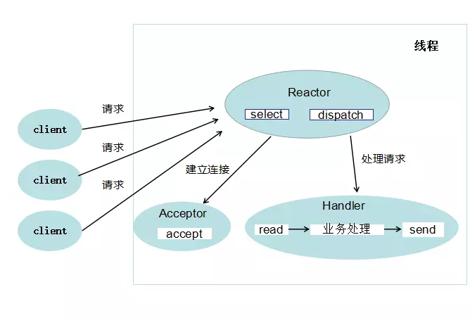
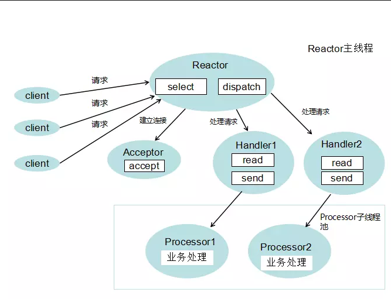
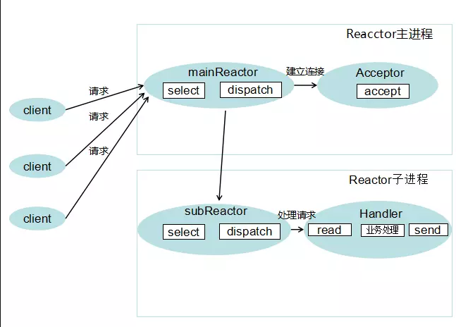

# Reactor模式

Reactor模式是指一个或多个事件输入同时传递给服务处理器(Reactor)，服务处理器负责监听各事件的状态，当任意一个事件准备就绪时，服务处理器收到该事件通知，并将事件发送给绑定了该对应网络事件的事件处理器(Handler)执行。

- 事件驱动模型
- 处理多个输入
- 采用多路复用将事件分发给相应的Handler处理

Reactor采用了分而治之和事件驱动的思想：

- 分而治之：一个连接里完整的网络处理过程一般分为：accept、read、decode、process、encode、send这些步骤。Reactor模式将每个步骤映射为一个Task，服务端线程执行的最小逻辑单元不再是一个完整的网络请求，而是Task，且采用非阻塞方式执行。
- 事件驱动：每个Task对应特定的网络事件，当Task准备就绪时，Reactor收到对应的网络事件通知，并将Task分发给绑定了对应网络事件的Handler执行。

#  Reactor模式的三种实现

Reactor中的角色含义：

- Reactor：负责响应事件，将事件分发给绑定了该事件的Handler处理。
- Handler：事件处理器，绑定了某类事件，负责执行对应事件的任务对事件进行处理。
- Acceptor：Hanlder的一种，绑定了connect事件，当客户端发起connect请求时，Reactor会将accept事件分发给Acceptor处理。

## 单Reactor单线程

以上的select，accept,read,send是标准I/O复用模型的网络编程API,dispatch和"业务处理"是需要完成的操作。

方案的具体步骤如下:

- Reactor对象通过select监控连接事件，收到事件后通过dispatch进行分发
- 如果是连接建立的事件，则交由 Acceptor 通过accept 处理连接请求，然后创建一个 Handler 对象处理连接完成后的后续业务处理
- 如果不是建立连接事件，则 Reactor 会分发调用连接对应的 Handler来响应
- Handler 会完成 read -> 业务处理 -> send 的完整业务流程

**单Reactor单线程的优点**：

- 模型简单，没有多线程，进程通信，竞争的问题，全部都在一个线程中完成

**缺点**：

- 只有一个进程，无法发挥多核 CPU的性能，只能采取部署多个系统来利用多核CPU,但这样会带来运维复杂度
- Handler 在处理某个连接上的业务时，整个进程无法处理其他连接的事件，很容易导致性能瓶颈

## 单Reactor多线程

方案步骤:

- 主线程中，Reactor对象通过select 监听连接事件，收到事件后通过 dispatch进行分发
- 如果是连接建立的事件，则由Acceptor处理，Acceptor通过 accept接受连接，并创建一个 Handler 来处理连接后续的各种事件。
- 如果不是连接建立事件，则Reactor会调用连接对应的Handler来进行相应。
- Handler 只负责响应事件，不进行业务处理，Handler 通过 read 读取到数据后，会发给 processor 进行业务处理。
- Processor 会在独立的子线程中完成真正的 业务处理，然后将响应结果发给主进程的 Handler处理，Handler 收到响应后通过 send 将响应结果返回给 client。

**优点**:

- 能够充分利用多核多 CPU的处理能力

**缺点**：

- 多线程数据共享和访问比较复杂
- Reactor 承担所有事件的监听和响应，只在主线程中运行，瞬间高并发时会成为性能瓶颈

## 主从Reactor多线程

方案说明:

- 主进程中mainReactor对象通过 select监控连接建立事件，收到事件后通过 Acceptor接收，将新的连接分配给某个子进程。
- 子进程中的 subReactor 将 mainReactor 分配的连接加入连接队列进行监听，并创建一个 Handler 用于处理连接的各种事件
- 当有新的事件发生时，subReactor 会调用里连接对应的 Handler 来响应
- Handler完成 read -> 业务处理 -> send 的完整业务流程

**特点**:

- 主进程和子进程的职责非常明确，主进程只负责接收新连接，子进程负责完成后续的业务处理
- 主进程和子进程的交互很简单，主进程只需要把新的连接传递给子进程，子进程无需返回数据
- 子进程之间是相互独立的，无需同步共享之类的处理（这里仅限于网络模型相关的 select,read,send等无须同步共享，"业务处理"还是有可能需要同步共享的）

参考：[https://juejin.im/post/5ba3845e6fb9a05cdd2d03c0](https://juejin.im/post/5ba3845e6fb9a05cdd2d03c0)
