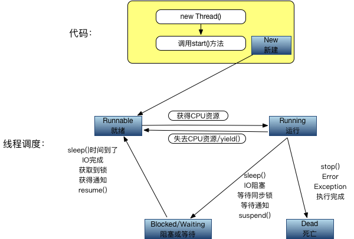

# Java多线程简介
Java中内置了对多线程的支持，让多线程的开发方便很多，但同时也带来了另外的复杂，线程间的交互以及很多的不确定性让多线程又显得很复杂。在此只是针对Java中多线程的基础做些说明，有关线程和进程的区别，以及多线程的好处和更深层的暂不多说。

# 线程的状态
线程的状态定义在Thread类中一个State枚举类型：

* 新建状态（NEW），通过`new Thread`新建的线程处于新建状态，通常会调用start()方法来启动线程。
* 就绪状态（RUNNABLE），此时线程并没有在执行，而是可执行，在等待CPU调度去真正执行。就绪状态的线程有可能是刚调用start()方法进入就绪队列的线程，也有可能是等待其他资源的状态的线程。
* 阻塞状态（BLOCKED），等待锁的线程会处于阻塞状态，线程等待进入synchronized块或方法时候处于阻塞状态；线程调用了wait()方法后等待重新获取锁的时候也会处于阻塞状态。
* 等待状态（WAITING），线程调用了wait()方法并且没有设置超时时间会一直处于等待状态；线程调用了join()方法并且没有设置超时时间会一直处于等待状态；线程调用了LockSupport.park()方法会处于等待状态。
* 有等待时间的等待状态（TIMED_WAITING），线程调用了以下方法，并且设置了等待的时间，会处于等待状态：1. Thread.sleep;2. wait(long)设置了超时时间；3. join(long)设置了超时时间；4. LockSupport.parkNanos()方法；5. LockSupport.parkUntil()方法。
* 终止状态（TERMINATED），线程处于终止状态，已经完成了执行。

# 线程的生命周期
线程的生命周期分为：新建（New），就绪（Runnable），运行（Running），阻塞（Blocked），死亡（Dead）五个阶段。

生命周期五个阶段之间的转换如图所示：


## 新建（New）
使用new关键字和Thread类创建一个线程之后，该线程就处于新建状态。新建跟普通Java对象的创建一样，由虚拟机分配内存，初始化成员变量等。接下来就等待调用start()方法。

## 就绪（Runnable）
当已经新建的线程对象调用了start()方法，该线程就处于就绪状态。此时线程并没有直接运行，而是处于就绪队列中，需要等待JVM线程调度器的调用。

## 运行状态（Running）
处于就绪状态的线程如果获取到了CPU，就可以执行进入运行状态。此时线程可以变成阻塞状态，就绪状态，死亡状态。

从运行状态转换到其他状态的几个条件：

* 失去CPU资源或者调用了yield()方法后线程进入就绪状态。
* 调用了sleep()方法，调用了阻塞IO方法，试图获取同步锁，等待通知notify或者调用了线程的suspend()方法后线程进入阻塞状态。
* 调用了stop()方法，遇到错误Error，遇到异常Exception，或者线程执行完成后线程进入死亡状态。

## 阻塞状态
当线程调用了sleep()方法，调用了阻塞IO方法，试图获取同步锁，等待通知notify或者调用了线程的suspend()方法后，线程进入阻塞状态。被阻塞的线程会进入就绪状态，等待CPU调度重新进入运行状态。

从阻塞状态进入到就绪状态的几个条件：

* 调用了sleep()方法后时间已经到了。
* 调用的IO操作已经完成。
* 获取到了同步锁。
* 获得到了通知。
* 调用到了resume()方法。

## 死亡状态

* 遇到Error或者Exception，线程死亡
* 直接调用了stop()方法
* 线程执行完成，正常结束

# Thread源码分析
> 源码版本：jdk7u80

`yield()` 字面意思是让出，让步。使当前线程从运行状态变成就绪状态。调用此方法之后，当前线程会把CPU执行时间让出去，供其他线程或者自己去获得CPU运行。

`sleep(long millis)`，`sleep(long millis, int nanos)` sleep方法强制使当前正在执行的方法暂停执行，会阻塞当前线程，让出CPU。这样可以让其他线程获取执行的机会。当睡眠时间到了之后，线程进入就绪状态。

在一个synchronized块中调用sleep()方法，对象持有的锁不会被释放，仍然占有该锁。

`currentThread()` 返回当前正在执行的线程对象。

`start()`该方法用来启动一个线程，线程启动后会执行run()方法中的代码。start()方法不能被重复调用。

`stop()`该方法可以用来停止一个线程的执行。该方法已经被弃用。

`interrupt()`该方法用来中断线程，设置中断状态为true。并没有被直接中断，而是设置了中断状态。

`interrupted()`测试当前线程是否已经中断，该方法还负责清除中断状态。

`isInterrupted()`判断中断状态。

`isAlive()`测试线程是否处于活动的状态。

`suspend()`把一个线程挂起，使线程处于阻塞状态，必须调用对应的resume()方法才能使线程进入可执行状态。已被废弃。

`resume()`把一个挂起的线程恢复执行。已被废弃。

`setPriority()`设置线程的优先级。

`getPriority()`获取线程的优先级。

`setName(String)`设置线程的名字。

`getName()`获取线程的名字。

`getThreadGroup()`获取线程组。

`activeCount()`获取当前线程所在线程组中活跃的线程数。

`join(),join(long),join(long,int)` 该方法可以把指定的线程加入到当前线程中。比如在线程A中调用线程B的join()方法，线程A会阻塞，直到线程B完成后，线程A才能继续执行。

`setDaemon(boolean)` 标记此线程为守护线程，此方法必须在start()方法之前调用。

`isDaemon()`判断是否是守护线程。

`holdsLock(Object)` 判断当前线程是否持有给定对象的锁。

`getId()`获得线程的id。

`getState()`获得当前线程的状态。

# 创建线程的方法
主要有三种方法：

1. 继承Thread类来创建线程，继承Thread类重写run方法，创建子类实例，调用start方法。
2. 实现Runnable接口来创建线程，实现Runnable接口并实现run方法，创建Runnable实现类的实例，new一个Thread的实例，并以Runnable实现类的实例作为target，调用thread的start方法。
3. 使用Callable和Future来创建线程，实现Callable接口并实现call方法，创建Callable实现类的实例并使用FutureTask类来包装Callable对象，使用FutureTask对象作为Thread的target创建启动新线程，最后调用FutureTask对象的get方法来获得子线程执行结束后的返回值。

前面两个不再举例子，最后一种代码如下：

CallableDemo：

```
public class CallableDemo implements Callable<Integer>{
    @Override
    public Integer call() throws Exception {
        return new Random().nextInt(1000);
    }
}
```

CallableAndFutureTest：

```
public class CallableAndFutureTest {
    public static void main(String[] args) {
        Callable<Integer> callable = new CallableDemo();
        FutureTask<Integer> futureTask = new FutureTask<Integer>(callable);
        new Thread(futureTask).start();

        try {
            Thread.sleep(5000);
            System.out.println(futureTask.get());
        }catch (InterruptedException e) {
            e.printStackTrace();
        } catch (ExecutionException e) {
            e.printStackTrace();
        }
    }
}
```
# 线程间协作
线程之间的通信协作可以使用Object对象中的wait()方法，notify()方法，notifyAll()方法来实现。

`wait(),wait(long),wait(long,int)` 该方法将当前线程进入休眠状态，wait()方法只能使用在同步方法或者同步块中调用。调用wait()方法后，当前线程释放锁。该线程处于该对象的等待池中。

`notify()，notifyAll()` 该方法用来通知那些可能在等待该对象的对象锁的其他线程。notify()方法必须在同步方法或代码块中调用。被唤醒的对象进入该对象的锁池中，锁池中的线程会去竞争该对象锁。