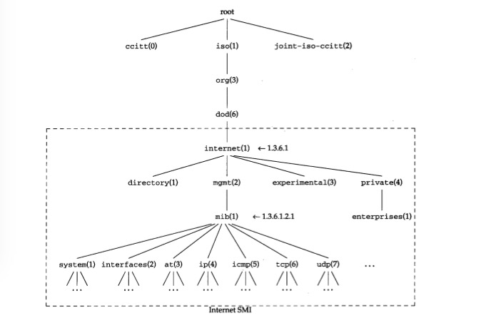

SNMP全称Simple Network Management Protocol，简单网络管理协议。是TCP/IP协议的一部分，属于应用层协议。SNMP协议主要用来解决网络设备的管理，大多数的网络管理系统都是基于SNMP协议。通过该协议可以实现在被管理的设备上获取各种参数，还可以设置修改这些参数。

## SNMP系统的组成
一般SNMP系统组成大致有4个部分：

1. 网络管理软件，也就是客户端，网络管理员或者是你和我可以通过管理软件对网络设备进行管理。也就是相当于我们平时使用的系统的后台管理。
2. 网络设备，也就是被管理的设备，比如服务器，路由器，交换机等网络设备。
3. 代理程序，代理程序运行在被管理的设备中，相当于服务器的角色。
4. MIB库，全称Management Information Base，相当于数据库。存储了被监控设备的各种参数和状态信息等。

SNMP协议就是用在网络管理软件和被管理的网络设备之间的协议，通过此协议被管理的网络设备才会听我们的话。

一般情况下做开发，比如我是做Java开发的，所需要做的就是开发网络管理软件，也就是客户端；服务器端的设备运行着代理程序，所有的信息都存储在MIB库中；我们要做的就是通过SNMP协议去读取和设置这些MIB库存的数据。

## SNMP协议的结构
SNMP使用UDP进行无连接操作，主要包括SNMP报头和协议数据单元：

* 版本标识符
* 团体名
* PDU

SNMP定义了五种报文，用来在管理软件和代理程序之间进行通信：

1. get-request，从代理程序处获取信息
2. get-next-request，从代理程序处获取下一个参数值
3. set-request，设置代理程序的值
4. get-response，代理程序返回值，上面三种请求都会使代理程序返回参数值
5. trap，代理程序主动发送的报文

## MIB库简介
Management Information Base 管理信息库，每个被管理的设备都需要有MIB库的存在，我们才能对设备进行管理。

MIB库中定义了可访问的网络设备及其属性，通过OID，Object Identifer来区别。MIB采用分级树形结构，以下是结构图：

结构类似于DNS和Unix的文件系统，例如`1.3.6.1.2.1`就代表`iso.org.dod.internet.mgmt.mib`。

## net-snmp
net-snmp是一种开放源代码的简单网络管理协议（Simple Network Management Protocol）软件，可以安装在linux系统，unix以及windows上。作用就是上面提到的代理程序。

### 安装使用
本次在Centos7上面安装使用net-snmp软件，具体步骤如下：

安装net-snmp：

```
sudo yum install net-snmp*
```

安装完成之后，修改net-snmp配置文件`/etc/snmp/snmpd.conf`，在下面代码后面添加两行：

```
##       sec.name  source          community
#com2sec local     localhost       COMMUNITY
#com2sec mynetwork NETWORK/24      COMMUNITY
```
添加两行如下：

```
com2sec local     localhost       public
com2sec mynet    192.168.0.0/24   public
```
上面的`192.168.0.0/24`根据你的实际情况添加，我的局域网网段是`192.168.1.xxx`，所以上面写的是`192.168.0.0`，后面的`24`是子网掩码`255.255.255.0`。

修改完配置文件后，启动net-snmp服务：

```
systemctl start snmpd.service
```

启动后可以使用以下命令查看启动是否有错：

```
systemctl status snmpd.service -l
```

如果没有提示错误啥的，现在服务应该就已经起来了，可以使用以下命令测试下：

```
snmpwalk -v1 -c public 192.168.110.198
```
后面的ip写net-snmp安装的那台机器的ip。回车后会输出以下信息(不会跟我的完全一样，只是类似的就对了)：

```
SNMPv2-MIB::sysDescr.0 = STRING: Linux localhost.localdomain 3.10.0-514.2.2.el7.x86_64 #1 SMP Tue Dec 6 23:06:41 UTC 2016 x86_64
SNMPv2-MIB::sysObjectID.0 = OID: NET-SNMP-MIB::netSnmpAgentOIDs.10
DISMAN-EVENT-MIB::sysUpTimeInstance = Timeticks: (4549) 0:00:45.49
SNMPv2-MIB::sysContact.0 = STRING: Root <root@localhost> (configure /etc/snmp/snmp.local.conf)
SNMPv2-MIB::sysName.0 = STRING: localhost.localdomain
SNMPv2-MIB::sysLocation.0 = STRING: Unknown (edit /etc/snmp/snmpd.conf)
SNMPv2-MIB::sysORLastChange.0 = Timeticks: (4) 0:00:00.04
SNMPv2-MIB::sysORID.1 = OID: SNMP-MPD-MIB::snmpMPDCompliance
SNMPv2-MIB::sysORID.2 = OID: SNMP-USER-BASED-SM-MIB::usmMIBCompliance
SNMPv2-MIB::sysORID.3 = OID: SNMP-FRAMEWORK-MIB::snmpFrameworkMIBCompliance
........还有很多输出，省略了......
```

## 使用SNMP4J开发
简单的例子：

```
public class GetCentosSystemInformation {

    private final static String REMOTE_ADDRESS = "udp:192.168.110.198/161";


    public static void main(String[] args) throws IOException {
        //初始化
        Address remoteAddress = GenericAddress.parse(REMOTE_ADDRESS);
        System.out.println("SNMP地址：" + REMOTE_ADDRESS + "；有效：" + remoteAddress.isValid());
        TransportMapping transportMapping = new DefaultUdpTransportMapping();
        Snmp snmp = new Snmp(transportMapping);
        snmp.listen();

        //构造发送目标
        CommunityTarget target = new CommunityTarget();
        target.setCommunity(new OctetString("public"));
        target.setAddress(remoteAddress);
        target.setVersion(SnmpConstants.version2c);
        target.setRetries(10);
        target.setTimeout(1500);

        //构造发送内容
        PDU pdu = new PDU();
        OID oid = new OID("1.3.6.1.2.10");
        pdu.add(new VariableBinding(oid));
        pdu.setType(PDU.GETNEXT);

        //异步监听响应
        ResponseListener responseListener = new ResponseListener() {
            @Override
            public void onResponse(ResponseEvent event) {
                ((Snmp)event.getSource()).cancel(event.getRequest(),this);
                PDU response = event.getResponse();
                PDU request = event.getRequest();
                if(response == null){
                    System.out.println("请求超时：" + response + "，请求的内容：" + request);
                }else {
                    System.out.println("获取到信息：" + response);
                }
            }
        };

        //发送
        snmp.send(pdu,target,null,responseListener);
        //由于是异步获取信息，在这里需要程序不能结束运行，否则接收不到异步获取的消息。
        System.in.read();
    }
}
```

