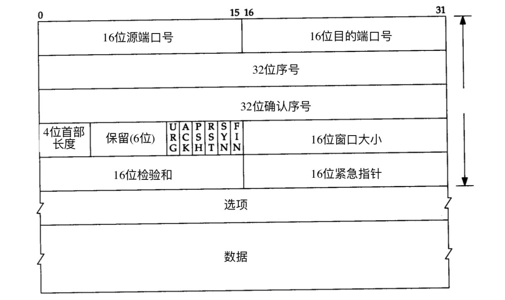
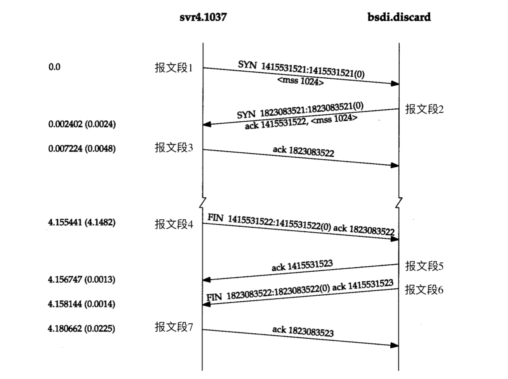

# TCP IP
IP首部：

## TCP连接的建立与终止
TCP首部：

连接建立与终止的时序：

### 建立连接

1. 请求端(通常称为客户)发送一个SYN段指明客户打算连接的服务器的端口，以及初始序号(ISN，在这个例子中为1415531521)。这个SYN段为报文段1。
2. 服务器发回包含服务器的初始序号的SYN报文段(报文段2)作为应答。同时，将确认序号设置为客户的ISN加1以对客户的SYN报文段进行确认。一个SYN将占用一个序号。
3. 客户必须将确认序号设置为服务器的ISN加1以对服务器的SYN报文段进行确认(报文段3)。

这三个报文段完成连接的建立。这个过程也称为三次握手(three-way handshake)。

### 连接终止

图中的报文段4发起终止连接，当服务器收到这个FIN，它发回一个ACK，确认序号为收到的序号加1(报文段5)。和SYN一样，一个FIN将占用一个序号。同时TCP服务器还向应用程序传送一个文件结束符。接着这个服务器程序就关闭它的连接，导致它的TCP端发送一个FIN(报文段6)，客户必须发回一个确认，并将确认序号设置为收到序号加1(报文段7)。