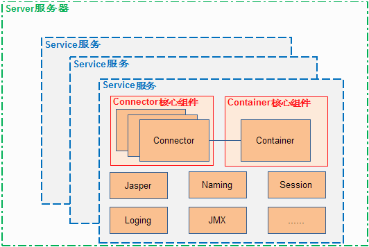

这里仅仅是对Tomcat7中主要组件进行简单说明，详细的可以查看下tomcat的相关文档。

首先看下网上找来的一张架构图，还有其他的类似的图，可以自行谷歌一下。看图片也大概能了解tomcat整体的组成。

# Server
Server表示整个容器，Tomcat提供了一个默认的Server接口的实现，用户几乎很少自己实现Server接口。

# Service
Service是一个中间组件，存活于Server中，绑定一个或者多个Connector到一个Engine上。用户很少自己实现Service接口，默认实现已经足够用。

# Engine
表示一个特定Service的请求处理流程。一个Service可能有多个Connector，Engine接受并处理这些来自Connector的所有请求，将响应传回给适当的Connector以传输到客户端。Engine也很少由用户自定义实现。

# Host
Host是一个网络名称同Tomcat服务器的关联。Engine可能存在多个Host。

# Connector
Connector处理和客户端的通信。Tomcat中有很多可用的Connector。

# Context
Context表示一个web应用，一个Host可能包含多个Context，每个Context都有一个唯一的path。

# 总的架构
Server可以表示是Tomcat，一个Tomcat中只有一个Server，一个Server下面可以有多个Service，每一个Service中包含多个Connector和一个Engine，每个Engine包含多个Host，每个Host包含多个Context。

Engine其实是一个Container，Container是Engine，Host，Context的父接口，这里把Engine称为Container，所以此时可以有如下表示：一个Server下面有多个Service，每个Service包含多个Connector和一个Container。

多个Connector和一个Container组成一个Service，这个Service就可以向外提供服务了。
