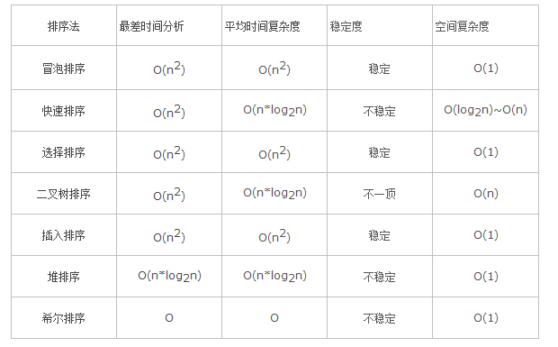
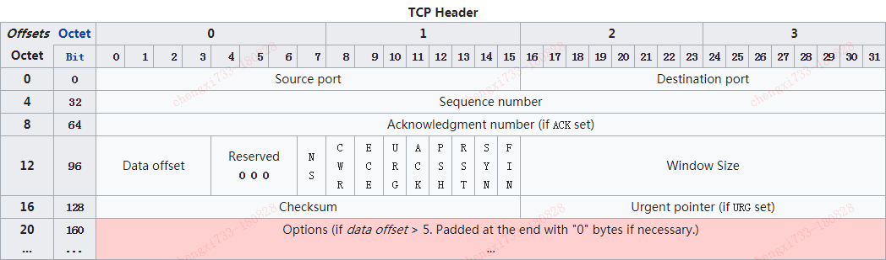

# 算法时间复杂度

常见算法时间复杂度由大道小依次为：**Ο(1)＜Ο(log2n)＜Ο(n)＜Ο(nlog2n)＜Ο(n2)＜Ο(n3)＜…＜Ο(2n)＜Ο(n!)**

求解算法时间复杂度的具体步骤：

1. 找出算法中的基本语句：算法中执行次数最多的那条语句就是基本语句，通常是最内层循环的循环体。
2. 计算基本语句的执行次数的数量级。
3. 用大O记号表示算法的时间性能。

如果算法中包含嵌套循环，基本语句通常是最内层的循环体;如果算法中包含并列循环，则将并列循环的时间复杂度相加。

Ο(1)表示基本语句的执行次数是一个常数，一般来说，只要算法中不存在循环语句，其时间复杂度就是Ο(1)。其中**Ο(log2n)、Ο(n)、 Ο(nlog2n)、Ο(n2)和Ο(n3)**称为多项式时间，而**Ο(2n)和Ο(n!)**称为指数时间。

计算算法时间复杂度的几个简单程序分析法则：

1. 简单的输入输出语句或者赋值语句，近似认为需要O(1)时间。
2. 顺序结构，需要依次执行一系列语句所用的时间，可采用O下求和法则。
3. 选择结构，if语句，主要耗费时间是在执行then字句或else字句;校验条件也需要O(1)时间。
4. 循环结构，循环语句的运行时间主要体现在多次迭代中执行循环体以及检验循环条件的时间耗费，一般可用大O下乘法法则。
5. 复杂算法，可以将它分为几个容易估算的部分，然后利用求和法则和乘法法则计算整个算法的时间复杂度。

常用算法时间复杂度和空间复杂度：


常用排序时间复杂度：



# 冒泡排序及时间复杂度

冒泡排序的思想是：通过无序区中相邻记录关键字间的比较和位置交换，使关键字的记录如气泡一般逐渐往上漂浮至水面。

整个算法是**从最下面的记录**开始，对每两个相邻的关键字进行比较，且使关键字较小的记录切换至关键字较大的记录之上，使得经过一趟冒泡排序之后，关键字最小的记录到达最上端，接着在剩下的记录中找关键字最小的记录，并把它换到第二个位置上。以此类推，一直到所有记录都有序为止。

时间复杂度：

对于长度为n的数组，需要进行n-1趟操作，才能确保排序完成，时间复杂度为O(n^2)。

空间复杂度：

排序过程中需要一个临时变量进行两两交换，需要的额外空间为1，空间复杂度为O(1)。

稳定性：

冒泡排序在排序过程中，元素两两交换时，相同元素的前后顺序并没有改变，所以是稳定排序算法。

代码实现：

```java
package me.cxis;

import java.util.Arrays;

public class BubbleSort {

    public static int[] bubbleSort(int[] originArray) {
        System.out.println("排序之前的数组：" + Arrays.toString(originArray));
        for (int i = 1; i < originArray.length; i++) {
            for (int j = originArray.length - 1; j > i - 1; j-- ) {
                if (originArray[j] < originArray[j-1]) {
                    int tmp = originArray[j-1];
                    originArray[j-1] = originArray[j];
                    originArray[j] = tmp;
                }
            }
            System.out.println("第" + (i + 1) + "次排序后的数组：" + Arrays.toString(originArray));
        }
        System.out.println("排序之后的数组：" + Arrays.toString(originArray));
        return originArray;
    }

    public static void main(String[] args) {
        int[] originArray = {3, 4, 1, 9, 5, 6, 2};
        bubbleSort(originArray);

    }
}
```

## 排序算法的稳定性

排序算法的稳定是指：相同的值在排序过后相对位置不变。也就是保证排序前两个相等的数的前后顺序，和排序后它们两个的前后位置顺序相同。


# 了解AQS吗？AQS源码等

AQS即AbstractQueuedSynchronizer，队列同步器，用来构建锁和其他同步组件的框架。

## AQS的核心思想

如果被请求的共享资源空闲，则将当前请求资源的线程设置为有效工作线程，并且将共享资源设置为锁定状态；如果被请求的共享资源被占用，那么就需要一套线程阻塞等待以及被唤醒时锁分配的机制，这个机制在AQS中是使用CLH队列锁来实现的，即将暂时获取不到锁的线程加入到队列中。

CLH队列是一个虚拟双向队列，即不存在队列实例，仅存在结点之间的关联关系。AQS将每条请求共享资源的线程封装成一个CLH锁队列的一个结点（Node）来实现锁的分配。

## AQS实现

AQS维护一个volatile int state（代表共享资源）和一个FIFO线程等待队列（多线程争用资源被阻塞时会进入此队列）。state访问方式有下面三种：

- getState()
- setState()
- compareAndSetState()

AQS定义两种资源共享方式：

- Exclusive，独占：只有一个线程能执行，比如ReentrantLock。
- Share，共享：多个线程可同时执行，比如Semaphore和CountDownLatch。

不同的自定义同步器争用共享资源的方式也不同。自定同步器在实现时只需要实现共享资源state的获取与释放方式即可，至于具体线程等待队列的维护（如获取资源失败入队或唤醒出队等）AQS已经在顶层实现好。

自定义同步器实现时主要实现以下几种方法：

- isHeldExclusively()：该线程是否正在独占资源，只有用到Condition才需要实现它。
- tryAcquire(int)：独占方式，尝试获取资源，成功返回true；失败返回false。
- tryRelease(int)：独占方式，尝试释放资源，成功返回true；失败返回false。
- tryAcquireShared(int)：共享方式，尝试获取资源，负数表示失败；0表示成功，但没有剩余可用资源；正数表示成功，且有剩余资源。
- tryReleaseShared(int)：共享方式，尝试释放资源，成功返回true；失败返回false。

## 自定义同步器

### ReentrantLock

state初始化为0，表示未锁定状态。A线程lock()时，会调用tryAcquire()独占该锁并将state加1。此后，其他线程再尝试获取tryAcquire()时就会失败，直到A线程unlock()到state为0（即释放锁）为止，然后其他线程才有机会获取该锁。

当然，释放锁之前，A线程自己是可以重复获取此锁的，state会累加，这就是可重入的概念。获取多少次就要释放多少次，这样才能保证state是能回到0状态的。

### CountDownLatch

任务分为N个子线程去执行，state初始化为N。这N个子线程是并行执行的，每个子线程执行完后countDown()一次，state会CAS减1。等到所有子线程都执行完后（即state=0），会unpark()主调用线程，然后主调用线程就会从await()函数返回，继续后余动作。

一般来说，自定义同步器要么是独占方式，要是是共享方式，只需要实现tryAcquire和tryRelease或者实现tryAcquireShared和tryReleaseShared中的一种即可。但AQS也支持自定义同步器同时实现独占和共享两种方式，如ReentrantReadWriteLock。

# ReentrantLock原理以及源码

是可重入的互斥锁，和synchronized语义类似，都具有可重入性，ReentrantLock增加了一些高级功能，比如实现了公平锁，还可以绑定多个Condition。

- 可重入性：可以支持一个线程对锁的重复获取。
- 公平锁/非公平锁：公平锁，多个线程获取同一个锁的时候，必须按照严格的锁的申请时间来依次获得锁；非公平锁，当锁被释放时候，等待中的线程均有机会获得锁。synchronized是非公平锁，ReentrantLock默认也是非公平锁，可以通过构造方法来指定使用公平锁。一般非公平锁性能比公平锁好。

synchronized是Java原生的互斥同步锁，使用方便，无需显式释放锁。底层是通过monitorenter和monitorexit两个字节码指令来实现加锁和解锁操作的。ReentrantLock做为API层面的互斥锁，需要显式的加锁和解锁。

ReentrantLock内部定义了三个静态内部类：Sync、FairSync、NoFairSync。Sync继承了AQS，其他两个继承Sync，各自完成公平和非公平的逻辑。

公平性和非公平性的区别是：在尝试获取锁的时候多了一个判断，公平锁在尝试获取锁的时候先判断是否有比自己申请早的线程在同步队列中等待，有，则等待；没有就抢占。

# Synchronized实现原理

理解要点：

- 理解synchronized的实现方式：monitorenter和monitorexit。
- 为什么称为重量级锁。
- 对重量级锁的优化：自旋锁和自适应自旋锁。
- 演化：轻量级锁。
- 演化：偏向锁。

## 实现及重量级锁

synchronized是Java中最基本的互斥同步手段，编译之后会在同步块的前后添加monitorenter和monitorexit两个字节码指令。同步块在已经进入的线程执行完之前，会阻塞后面其他的线程，在Java中线程是映射到操作系统的原生线程之上，阻塞线程就会涉及到用户态切换到核心态等等，所以synchronized被称为**重量级锁**。

## 自旋锁

互斥同步对性能最大的影响就是阻塞的实现，一般共享的锁定状态只会持续很短时间，如果物理机器上有一个以上的处理器，可以让两个或以上的线程同时并行执行，就可以让后来请求锁的线程稍微等待一下，但是不放弃处理器的执行时间。为了让线程等待，只需要让线程执行一个忙循环（自旋），这就是**自旋锁**。

自旋锁不能代替阻塞，自旋本身虽避免了线程切换的开销，但是要占用处理器的时间，如果占用时间长就会浪费处理器资源。自旋锁实现上设置了一个限度，**默认自旋次数是10次**，超过次数就使用传统方式挂起线程。

## 自适应自旋锁

JDK1.6中引入了**自适应的自旋锁**，意味着自旋时间不再固定了，而是由前一次在同一个锁上的自旋时间及锁的拥有者状态来决定。如果在同一个锁对象上，自旋等待刚刚成功获取锁，并且持有锁的线程正在运行中，虚拟机就会认为这次自旋也很有可能再次成功，就会允许自旋等待持续更长时间；如果对于某个锁，自旋很少成功获得，那么在以后要获取这个锁时可能忽略掉自旋过程，避免资源浪费。

## 轻量级锁

**轻量级锁**是JDK1.6加入的，本意是在没有多线程竞争的前提下，减少传统的重量级锁使用操作系统互斥量产生的性能消耗。虚拟机进入同步块的时候会先使用轻量级锁，如果发现有两条以上的线程竞争同一个锁，轻量级锁就会膨胀为重量级锁。

轻量级锁使用CAS操作避免了使用互斥量的开销，但是如果存在竞争，除了互斥量的开销外，还额外发生了CAS操作，因此在有竞争情况下，轻量级锁会比重量级锁更慢。

## 偏向锁

**偏向锁**也是在JDK1.6中引入的一项锁优化，目的是消除数据在无竞争情况下的同步原语。轻量级锁是在无竞争情况下使用CAS去消除同步使用的互斥量，偏向锁就是在无竞争情况下把整个同步都消除掉。

偏向锁会偏向于第一个获得他的线程，如果在接下来的执行过程中，该锁没有被其他线程获取，则持有偏向锁的线程永远不需要再进行同步。当另外一个线程去尝试获取这个锁的时候，偏向锁就宣告结束。

## 轻量级锁和偏向锁的实现

都是存储在对象头（Mark Word）中。

# CAS实现原理以及缺点

理解要点：

- CAS通过unsafe的方法实现：有三个操作数，内存值V，旧的预期值A，要修改的新值B，当且仅当预期值A和内存值V相同时，将内存值V改为B，否则什么都不做。
- 方法的参数：第一个参数是要修改的对象；第二个参数是对象中要修改变量的偏移量；第三个是修改前的值；第四个是修改后的值。
- 系统级别实现：CAS是借助CPU底层指令来完成的。
- CAS缺点：ABA问题，以及怎么解决

**ABA问题**，CAS在操作值的时候，需要检查下值有没有变化，没有发生变化则更新。但是如果一个值原来是A，变成了B，又变成了A，那么使用CAS检查的时候会发现它的值没有发生变化，但是实际上却发生了变化！

ABA解决思路是使用版本号，在变量前追加版本号，每次变量更新的时候把版本号加1。从JDK1.5开始提供了一个类AtomicStampedReference来解决ABA问题，它通过控制变量值的版本来保证CAS的正確性。

# HashMap和ConcurrentHashMap

HashMap底层实现是数组加链表的形式，添加数据的时候，首先根据key的hash值来计算在数组中的索引，当找到的位置有数据存在时，会在当前索引处使用链表来存储hash值相等的数据，查找链表中的数据会通过key的equals方法来判断。

在JDK1.8中HashMap采用数组加链表和红黑树的方式实现，当链表长度超过8的时候，链表就转换为红黑树进行存储。

HashMap不是线程安全的。

ConcurrentHashMap采用分段锁实现线程安全，底层实现还是数组和链表的形式。ConcurrentHashMap中有个Segment数组，这个Segment其实就是一把锁。每个Segment中还是数组和链表的形式，跟HashMap一样。

每个Segment是一把锁，ConcurrentHashMap写操作只会锁住一段Segment，其他的Segment不会被锁住，就是利用这种方式来实现并发和线程安全的。

JDK1.8中发生了变化，取消了Segments字段，采用了类似HashMap的数组加链表和红黑树的形式实现，可以实现对每一行数据进行加锁，利用CAS和synchronized进行高效的同步更新数据。

# Java内存模型/JMM

Java内存模型用来屏蔽各种硬件和操作系统间的内存访问差异。在JSR-133实现中逐步完善和成熟。Java内存模型分为主存和工作内存，所有的变量都存储在主存中，每条线程还有自己的工作内存，线程的工作内存中保存了所使用的变量的主存的副本拷贝，线程对变量的操作都必须在工作内存中进行。

# volatile的理解

被volatile修饰的变量一般会有两个特性：

- 保证了不同线程对该变量操作的内存可见性。
- 禁止指令重排序。

内存可见性，首先需要说一下JMM也就是Java内存模型，分为主存和工作内存，所有变量都存储在主存中，每个线程都有自己的工作内存，存储着需要的变量的主存的副本，对变量的操作都在工作内存中进行，操作完成之后，需要将变量写回主存中，如果有多个线程都操作，可能会造成缓存不一致的问题。而使用volatile关键字修饰变量，就可以解决这个问题，来保证内存可见性，对一个变量的修改会立刻回写到主存，其他线程需要该变量时，会去主存中读取新值。

volatile只能保证可见性和有序性，但是不能保证原子性。

# Java深克隆和浅克隆/深拷贝和浅拷贝

浅克隆：复制一个对象的实例，但是该对象中包含的其他的对象还是公用的，不会克隆一份。一般使用super.clone()，clone的对象就是浅克隆。

深克隆：复制一个对象的实例，而且这个对象中包含的其他的对象也要复制一份。

# Java内存区域/Java运行时数据区域

- 程序计数器：当前线程所执行的字节码的行号指示器，是线程私有的。
- Java虚拟机栈：是线程私有的，与线程的生命周期相同。虚拟机栈描述的是Java方法执行的内存模型，每个方法在执行的同时都会创建一个栈帧，用于存储局部变量表、操作数栈、动态链接、方法出口等信息。每一个方法从调用直至执行完成，就对应着一个栈帧在虚拟机栈中入栈到出栈的过程。
- 本地方法栈：执行本地方法服务的。
- Java堆：虚拟机管理的内存中最大的一块，是被所有线程共享的，在虚拟机启动的时候创建，用来存放对象实例。所有的对象和数组都要在堆上分配。Java堆可以分为新生代和老年代；新生代可分为Eden空间，From Suvivor空间和To Suvivor空间等。
- 方法区：是各个线程共享的内存区域，用于存储虚拟机加载的类信息、常量、静态变量、即时编译器编译后的代码等数据。

# 垃圾回收机制/垃圾收集算法

- 标记-清除
- 复制
- 标记-整理
- 分代收集

## 标记-清除算法

首先标记出所有需要回收的对象，在标记完成之后要统一回收所有被标记的对象。标记和清除的效率都不高，在标记清除之后会产生大量不连续的空间碎片，空间碎片太多可能会导致以后在程序运行过程中需要分配较大对象时，无法找到足够的连续内存而不得不提前触发另一次垃圾收集动作。

## 复制算法

复制算法将内存划分为大小相等的两块，每次只使用其中的一块。当一块内存使用完了，就将还存在着的对象复制到另外一块上，然后把已使用的内存空间一次清理掉。但是这样就会把内存缩小为原来的一半，代价有点高。

现在的虚拟机，将内存分为一块较大的Eden空间和两块较小的Survivor空间，每次使用Eden空间和其中一块Survivor空间。当回收时，将Eden和Survivor中还活着的对象一次性复制到另外一个Survivor空间上，然后清理掉Eden和刚才用过的Survivor空间。HotSpot虚拟机默认Eden和Survivor比例是8：1。

## 标记-整理算法

老年代一般使用标记整理算法，标记过程首先标记出需要清理的对象，然后将所有存活的对象都向一端移动，最后直接清理掉端边界以外的内存。

## 分代收集算法

分代收集是将上面的算法组合使用，Java堆一般分为新生代和老年代，新生代使用复制算法，老年代使用标记整理或者标记清理算法。

# 内存分配策略

**对象优先分配在新生代的Eden区**，当Eden区没有足够的空间进行分配时，虚拟机会执行一次Minor GC。如果还找不到足够空间，就通过担保机制提前分配到老年代中去。

**大对象直接进入老年代**，虚拟机提供了一个-XX：PretenureSizeThreshold参数，令大于这个设置值的对象直接在老年代分配。这样做的目的是避免在Eden区以及两个Survivor区域之间发生大量的内存复制。

**长期存活对象进入老年代**，虚拟机为每个对象定义了一个年龄计数器，每经过一次Minor GC存活的对象年龄就加1，当年龄增加到一定程度，默认为15，就会晋升到老年代中。

**动态对象年龄判定**，如果Survivor区中相同年龄的对象大小总和大于Survivor空间的一半，则年龄大于或者等于该年龄的对象直接进入老年代。

**空间分配担保**，每次进行Minor  GC时，JVM会计算Survivor区移到老年代的对象的平均大小。如果这个值大于老年代的剩余值大小则进行一次Full GC，如果小于就检查HandlePromotionFailure设置，如果为true，就进行Minor GC，如果为false就进行Full GC。


# Minor GC/Major GC/Full GC

Minor GC，发生在新生代的垃圾收集动作，Minor GC发生频繁，回收速度也比较快。

Major GC/Full GC，发生在老年代的GC，出现了Major GC一般会伴随至少一次Minor GC。Major GC一般会比Minor GC慢10倍。

# 类的生命周期

- 加载
- 链接：验证、准备、解析
- 初始化
- 使用
- 卸载

# 类加载过程

## 加载

在加载阶段，虚拟机需要完成：

- 通过一个类的全限定名获取定义此类的二进制字节流。
- 将字节流所代表的静态存储结构转化为方法区的运行时数据结构。
- 在内存中生成一个代表这个类的Class对象，作为方法区这个类的访问的入口。

加载阶段完成后，虚拟机外部的二进制字节流就按照虚拟机所需的格式存储在方法区中，然后在内存中实例化一个Class类的对象，这个对象存储在方法区中，这个对象作为程序访问方法区中的这个类的外部接口。

## 验证

验证是为了确保Class文件中字节流中包含的信息符合当前虚拟机的要求，并且不会损害虚拟机自身的安全。

- 文件格式验证
- 元数据验证
- 字节码验证
- 符号引用验证

## 准备

准备阶段是正式为类变量分配内存并设置类变量初始值的阶段。类变量所使用的内存都在方法区中进行分配。

## 解析

解析阶段是虚拟机将常量池中的符号引用替换为直接引用的过程。

## 初始化

类初始化阶段是类加载过程的最后一步，这个阶段才是真正开始执行类中定义的Java代码。初始化阶段是执行类构造器`<clinit>()`方法的过程。

- `<clinit>()`方法是由编译器自动收集类中所有类变量的赋值动作和静态语句块中的语句合并产生的。编译器收集的顺序是由语句在源文件中出现的顺序决定的。
- `<clinit()>`方法和实例构造器`<init>()`方法不同，类构造器方法不需要显式调用父类构造器，虚拟机会保证在子类的`<clinit>()方法执行之前，父类的类构造器方法已经执行完成。`
- 由于父类的类构造器方法先执行，所以父类中定义的静态语句块要优先于子类的变量赋值操作。
- 如果一个类中没有静态语句块，编译器可以不为这个类生产`<clinit>()`方法。
- 接口没有静态语句块，但是有变量初始化赋值操作，所以接口也会有类构造器方法，但是执行接口的类构造器方法不需要先执行父接口的`<clinit>()`方法。接口的实现类初始化时也不会执行接口的类构造器方法。
- 虚拟机会保证类的`<clinit>()`方法的线程安全。

# 对象在内存中的初始化过程/对象的创建

对象的初始化和创建的大致过程如下，虚拟机遇到一个new指令，会首先在常量池中去定位到一个类的符号引用，并检查这个符号引用代表的类是否被加载、解析和初始化过。如果没有的话，先执行类的加载过程。在类加载检查通过后，虚拟机会为新生对象分配内存。内存分配完成后，虚拟机需要将分配到的内存空间都初始化为零值，这能保证对象的实例字段在Java代码中不赋予初始值就可以直接使用。接下来虚拟机要对对象进行必要的设置，例如是哪个类的实例，如何才能找到类的元数据信息等。之后会执行`<init>`方法，把对象按照程序员的意愿进行初始化。


当一个对象被创建时，虚拟机就会为其分配内存来存放对象自己的实例变量以及从父类继承过来的实例变量，在为这些实例变量分配内存的同时，这些实例变量也会被赋予默认值。内存分配完成之后，Java虚拟机就会开始对新创建的对象按照程序员的意志进行初始化。Java对象初始化过程中，主要涉及三种执行对象初始化的结构：

- 实例变量初始化
- 实例代码块初始化
- 构造函数初始化

## 实例变量初始化以及实例代码块初始化

在定义实例变量的同时，还可以直接对实例变量进行赋值或者使用实例代码块进行赋值，它们将在构造函数执行之前完成这些初始化操作。

如果我们对实例变量直接赋值或者使用实例代码块赋值，编译器会将其中的代码放到类的构造函数中去，并且这些代码会被放在对超类构造函数的调用语句之后，构造函数本身的代码之前。**Java要求构造函数的第一条语句必须是超类构造函数的调用语句**

## 构造函数初始化

实例变量和实例代码块初始化总是发生在构造方法初始化之前。编译生成的字节码中这些构造函数会被命名成`<init>()`

Java要求在实例化之前必须实例化其超类，以保证所创建实例的完整性，Java强制要求除了Object对象之外所有的对象的构造方法的第一条语句必须是超类构造方法的调用语句。默认编译器会为我们自动生成一个对超类构造方法的调用。

**类实例化的过程**：父类的类构造器`<clinit>()` --> 子类的类构造器`<clinit>()` --> 父类的成员变量和实例代码块 --> 父类构造方法 --> 子类的成员变量和实例代码块 --> 子类的构造方法。

# Spring AOP应用场景以及原理

AOP适合于那些具有横切逻辑的应用，比如：性能监测，访问控制，事务管理，缓存，对象池管理以及日志记录。AOP将这些分散在各个业务逻辑中的代码通过横向切割的方式抽取到一个独立的模块中。

AOP实现的关键就在于AOP框架自动创建的AOP代理，AOP代理可以分为静态代理和动态代理：

- 静态代理，在编译阶段就可以生成AOP代理类，也称为编译时增强。
- 动态代理，借助JDK动态代理或者CGLIB等动态生成代理类，也称为运行时增强。

Spring AOP使用的是动态代理的方式，在运行时动态生成代理类。

## JDK和CGLib的区别

JDK动态代理机制只能代理接口，不能代理实现类。而cglib是针对实现类来进行代理的，对指定的目标类生成一个子类，并覆盖其中的方法实现增强，不能对final修饰的类进行代理。

# 线程的状态

1. 新建状态New：新创建了一个线程对象。
2. 就绪状态Runnable：线程对象创建后，其他线程调用了该对象的start()方法，该状态的线程位于可运行线程池中，变得可运行，只等待获取CPU的使用权。即在就绪状态的进程除了CPU之外，其他的运行所需资源都已全部获得。
3. 运行状态Running：就绪状态的线程获取了CPU，执行程序代码。
4. 阻塞状态Blocked：阻塞是线程因为某种原因放弃CPU使用权，暂时停止运行，直到线程进入就绪状态，才有机会转到运行状态。
5. 死亡状态Dead：线程执行完了或者因为异常退出了run()方法，该线程结束生命周期。

**阻塞状态**分为三种：

- 等待阻塞：运行的线程执行wait()方法，该线程会释放占用的所有资源，JVM会把该线程放入等待池中，进入这个状态的线程是不能自动唤醒的，必须依靠其他线程调用notify()或notifyAll()方法才能被唤醒。
- 同步阻塞：运行的线程在获取对象的同步锁时，若该同步锁被别的线程占用，JVM会把该线程放入锁池中。
- 其他阻塞：运行的线程执行sleep()或join()方法，或者发出了IO请求时，JVM会把该线程置为阻塞状态，当sleep()状态超时、join()等待线程终止或者超时、IO处理完毕时，线程重新转入就绪状态。

线程的实现有两种方式：继承Thread类和实现Runnable接口，当我们new了这个对象后，线程就进入了初始状态。调用对象的start方法，线程进入就绪状态，当对象被操作系统选中获得CPU时间片后就会进入运行状态。

- run方法或者main方法结束后，线程就进入了终止状态。
- 线程调用自身sleep方法或者其他线程的join方法，线程让出CPU后进入阻塞状态。sleep方法不会释放锁。当sleep或者join结束后，该线程进入就绪状态，等待OS分配CPU时间片。
- 线程调用yield方法，放弃当前CPU时间片，回到就绪状态。
- 线程进入可运行状态，发现将要调用的资源被synchronized，获取不到锁标记，将会立即进入锁池中，等待获取锁标记，处于队列状态，一旦获得锁后，就立即进入就绪状态。

## suspend()和resume()

suspend使线程进入阻塞状态，不会自动恢复，必须使用对应的resume被调用，才能使线程进入可执行状态。

## wait()和notify()

线程调用wait方法后，进入等待队列，线程会释放其拥有的资源，线程不会自动唤醒，需要其他线程调用notify或者notifyAll方法才能唤醒。

wait被调用后，线程会释放调它所占用的锁标志，从而使其他的线程可以获取到锁。所以wait和notify必须在synchronized方法或者块中调用。

# Java序列化和反序列化

## 序列化是干嘛的

序列化是为了保存内存中各种对象的状态（实例变量，不包括方法），反序列化可以把保存的对象状态再读出来。序列化可以把内存中对象保存到一个文件或者数据库中，可以在网络上传输对象，可以使用RMI传输对象。

## 相关事项

- 序列化只对对象的状态进行保存，不保存对象的方法，只保存成员变量，不会保存类中的静态变量。
- 父类实现了序列化接口，子类自动实现序列化，不需要显式实现。
- 一个对象的实例变量引用其他的对象，序列化该对象时也把引用对象进行序列化。
- 通过ObjectOutputStream和ObjectInputStream对对象进行序列化和反序列化。
- transient控制变量的序列化，transient修饰的变量，不会把变量的值序列化到文件中，反序列化之后该变量会被设置为初始值。
- 虚拟机是否允许反序列化，不仅取决于类路径和功能代码是否一致，还有一个重要的是两个类的序列化id是否一致。

## ArrayList的序列化和反序列化

ArrayList中这个`transient Object[] elementData;`字段，被transient修饰，也就是说ArrayList中的数据是不可以被序列化以及反序列化的，但是实际验证下来的结果却不是这样，ArrayList中的值被正确的序列化和反序列化了。原因是ArrayList定义了两个方法writeObject和readObject。

如果一个类中定义了这两个方法，在对对象进行序列化和反序列化的时候，虚拟机就会调用自定义的writeObject和readObject方法。如果类中没有定义这两个方法，则默认使用ObjectOutputStream的defaultWriteObject方法和ObjectInputStream的defaultReadObject方法。

## ArrayList为什么要自定义序列化和反序列化方法呢？

ArrayList底层实现是动态数组，当数组的长度是10的时候，但是实际上只存储了1个元素，其他9个都是null，这时候如果直接序列化改数组，就会造成序列化和反序列化9个null，造成浪费。所以ArrayList将保存数据的数组设置成transient。

ArrayList中保存数据的数组被设置成了transient，那它怎么序列化和反序列化其中的数据呢？这时候就需要ArrayList自己实现序列化和饭序列化的方法了，也就是writeObject和readObject方法。相关的代码可查看ArrayList的源码。

ArrayList中的writeObject和readObject方法是什么时候被调用的？可以查看下ObjectOutputStream的writeObject的源码，调用栈为：`writeObject --> writeObject0 --> writeOrdinaryObject --> writeSerialData --> invokeWriteObject`在invokeWriteObject方法中通过反射调用ArrayList中的writeObject方法。这样就调用到自定义的序列化和反序列化方法了。

另外在序列化的时候，会判断要被序列化的类是否是Enum、Array和Serializable类型的，不是的话就抛出异常NotSerializableException。

# 线程池的原理及实现

## 线程池简介

多线程技术主要解决处理器单元内多个线程执行的问题，它可以显著减少处理器单元的闲置时间，增加处理器单元的吞吐能力。

假如一个服务器完成一项任务所需时间为：T1创建线程时间，T2线程执行任务时间，T3销毁线程时间。如果T1+T3远大于T2，则可以用线程池，以提高服务器性能。

线程池技术正是关注如何缩短或调整T1和T3时间的技术，把T1和T3分别安排在服务器启动和结束时间或者空闲时间，这样服务器处理客户请求时，T1和T3时间开销就会大大减少，从而提高服务器程序性能。另外线程池还能显著减少创建线程的数目。

线程池一般包括以下四个基本组成部分：

- 线程池管理器（ThreadPool），用于创建并管理线程池，包括创建线程池、销毁线程池、添加新任务。
- 工作线程（PoolWorker），线程池中的线程，在没有任务时处于等待状态，可以循环的执行任务。
- 任务接口（Task），每个任务必须实现的接口，以供工作线程调度任务的执行，主要规定了任务的入口，任务执行完后的收尾工作，任务的执行状态等。
- 任务队列（taskQueue），用于存放没有处理的任务，提供一种缓冲机制。

## 使用线程池的意义

- 复用：web服务器等系统，内部需要使用大量的线程来处理请求，单次请求响应时间通常比较短，此时Java基于操作系统的本地调用方式大量创建和销毁线程本身会成为系统的一个性能瓶颈和资源浪费。若使用线程池技术可以实现工作线程的复用，即一个工作线程创建和销毁的生命周期内可以执行处理多个任务，从而总体上降低线程创建和销毁的频率和时间，提升了系统性能。
- 流控，服务器资源有限，超过服务器性能的过高并发反而会成为系统负担，造成CPU大量耗费与上下文切换、内存溢出等后果，通过线程池技术可以控制系统最大并发数和最大处理任务量，从而很好的实现流控，保证系统不至于崩溃。


## 线程池技术要点

- 工作者线程（Worker），即线程池中可以重复利用起来执行任务的线程，一个工作者线程生命周期内会不停的处理多个业务。通过设置不同参数可以控制工作者线程的数量，从而实现线程池容量的伸缩，来实现复杂的业务需求。
- 待处理工作的存储队列，工作者线程数量是有限的，同一时间最多只能处理指定数量的任务，对于来不及处理的任务要保存到等待队列中，空闲了的工作者线程会不停的读取空闲队列里的任务进行处理。基于不同的队列实现可以扩展出多种功能的线程池，如：定制队列出队顺序实现带处理优先级的线程池，定制队列为阻塞有界队列实现可阻塞能力的线程池。
- 线程池初始化，即线程池参数的设定和多个工作者线程的初始化方式，通常有一开始就初始化指定数量的工作者线程或者请求时逐步初始化工作者线程的两种方式。前者线程池启动初期响应会比较慢，但造成了空载时少量性能浪费；后者基于请求量灵活扩容，但牺牲了线程池启动初期性能，到不到最优。
- 处理业务任务的算法，业务给线程池添加任务时线程池的处理算法，有的线程基于算法识别直接处理任务还是增加工作者数量，或者放入待处理队列；也有的线程池会直接将任务放入待处理队列，等待工作者线程去取出执行。
- 工作者线程的增减算法，业务线程数不是持久不变的，有高低峰期。线程池要有自己的算法根据业务请求频率高低调节自身工作者线程数量来调节线程池大小，从而实现业务高峰期增加工作者数量提高响应速度，而业务低峰期减少工作者数量来节省服务器资源，增加算法通常基于几个维度进行：待处理工作数，线程池定义的最大最小工作者线程，工作者闲置时间。

## Java Executor线程池解析

### Executor接口

Executor框架是一个根据一组执行策略调用、调度、执行和控制异步任务的框架。它提供了一种将任务提交与任务运行分离开来的机制。线程池有两个作用：

- 避免Thread不断创建和销毁的开销。
- 通过使用线程池可以限制任务所消耗的资源，比如使用最大线程数，最大消息缓冲池等。

Executor是线程池的顶级接口，只定义了一个方法`void execute(Runnable command);`表示可以执行Runnable方法。

### ExecutorService接口

ExecutorService接口扩展了Executor接口，增加了生命周期管理的方法，生命周期有三种状态：运行、关闭、终止。

- shutdown()方法被调用后，处于关闭状态，此时isShutdown()返回true，这时候心任务不能再被添加，但是正在执行的和队列中的任务会继续执行完。
- shutdownNow()方法被调用，会直接结束所有正在运行的线程，删除等待队列中的线程。
- 所有任务执行完成之后，Executor处于终止状态，isTerminated()方法返回true。
- submit()方法传递一个Callable或Runnable，返回Future。

### ThreadPoolExecutor

ThreadPoolExecutor是线程池的具体实现类，一般用的各种线程池都是基于这个类来实现。

构造方法如下：

```java
public ThreadPoolExecutor(int corePoolSize,
                          int maximumPoolSize,
                          long keepAliveTime,
                          TimeUnit unit,
                          BlockingQueue<Runnable> workQueue,
                          ThreadFactory threadFactory,
                          RejectedExecutionHandler handler) {
    if (corePoolSize < 0 ||
        maximumPoolSize <= 0 ||
        maximumPoolSize < corePoolSize ||
        keepAliveTime < 0)
        throw new IllegalArgumentException();
    if (workQueue == null || threadFactory == null || handler == null)
        throw new NullPointerException();
    this.corePoolSize = corePoolSize;
    this.maximumPoolSize = maximumPoolSize;
    this.workQueue = workQueue;
    this.keepAliveTime = unit.toNanos(keepAliveTime);
    this.threadFactory = threadFactory;
    this.handler = handler;
}
```

- corePoolSize，线程池核心线程数，线程池中运行的线程数，线程池中运行的线程数永远不会超过corePoolSize个，超过这个范围的时候，就需要将新的线程放入到等待队列中，默认情况下可以一直存活。可以通过设置allowCoreThreadTimeOut为true，此时核心线程数就是0，此时keepAliveTime控制所有线程的超时时间。
- maximumPoolSize，线程池允许的最大线程数。当大于了这个值，就会将线程由一个丢弃处理机制来处理。
- keepAliveTime，空闲线程结束的超时时间。
- unit，表示keepAliveTime的单位。
- workQueue，表示存放任务的队列，当达到corePoolSize的时候，就向该等待队列放入线程信息。
- handler，就是参数maximumPoolSize达到后丢弃处理的方法。
- threadFactory，用于创建线程的工厂。

#### 主要成员变量解释

- workQueue，任务缓存队列，用来存放等待执行的任务。
- mainLock，线程池的主状态锁，对线程池状态的改变都要使用该锁。
- workers，用来存放工作者的集合。
- keepAliveTime，空闲线程存活的时间。
- allowCoreThreadTimeOut，是否允许核心线程超时，如果为true的话，相当于核心线程数为0，此时keepAliveTime控制所有线程的超时时间。
- corePoolSize，核心线程数。
- maximumPoolSize线程池最大的线程数。
- poolSize，线程池中当前的线程数。
- handler，任务拒绝策略。
- threadFactory，用来创建线程的线程工厂。
- largestPoolSize，记录线程池中曾经出现过的最大线程数。
- completedTaskCount，用来记录已经执行完毕的任务个数。
- ctl，用来存放线程池的状态和正在运行的线程数。

#### 理解corePoolSize、maximumPoolSize、workQueue关系

- 如果没有空闲的线程执行新任务，并且当前运行的线程数小于corePoolSize，则添加新的线程执行新任务。
- 如果没有空闲的线程执行新任务，并且当前线程数等于corePoolSize，同时阻塞队列未满，则将任务加入队列，不添加新线程。
- 如果没有空闲的线程执行新任务，并且阻塞队列已满，同时线程池中的线程数小于maximumPoolSize，则创建新线程执行该任务。
- 如果没有空闲的线程执行新任务，并且阻塞队列已满，同时线程池中的线程数等于maximumPoolSize，则根据构造函数中的handler指定的策略来拒绝新的任务。

#### 理解handler

当等待队列已满，并且线程池中的线程数达到maximumPoolSize时，线程池拒绝添加新的任务就是handler来进行处理的。

- AbortPolicy，抛出RejectedExecutionExecuption异常。
- CallerRunsPolicy，由向线程池提交任务的线程来执行该任务。
- DiscardOldestPolicy，抛弃最旧的任务。
- DiscardPolicy，抛弃当前任务。

#### 理解workQueue

workQueue决定了缓存任务的排队策略，对于不同场景可能采取不同的排队策略，需要不同类型的阻塞队列。

- SynchronousQueue，此队列不缓存任何一个任务，向线程池提交任务时，如果没有空闲线程来执行任务，则入队列操作会阻塞；当有线程来获取任务时，出队列操作会唤醒执行入队列操作的线程。SynchronousQueue是一个无界队列，使用此队列时，maximumPoolSize没有作用。
- LinkedBlockingQueue，链表实现的队列，可以是有界，也可以是无界的，默认在Executors中使用无界队列。


#### 线程池的状态

线程池有五种状态，创建一个线程池时初始化状态为RUNNING。

- RUNNING，接受新任务，并且执行队列中的任务。
- SHUTDOWM，不接受心任务，但是执行队列中的任务。
- STOP，不接受新任务，也不执行队列中的任务，并且对正在执行的任务设置中断标志位。
- TIDYING，所有任务执行完毕，线程池中的线程数为0，等待执行terminated()钩子方法。
- TERMINATED，terminated()钩子方法执行完毕。

在ThreadPoolExecutor中使用一个整型变量来存储线程池的工作状态和正在运行的线程数：

`private final AtomicInteger ctl = new AtomicInteger(ctlOf(RUNNING, 0));`

其中高3bit用来存储线程池的状态，低29bit用来存储正在运行的线程数。

### Executors

Executors类提供了创建常用配置线程池的方法，为了防止使用错误搭配ThreadPoolExecutor构造函数的各个参数以及更加方便简洁的创建ThreadPoolExecutor对象。

#### newCachedThreadPool

```java
public static ExecutorService newCachedThreadPool() {
    return new ThreadPoolExecutor(0, Integer.MAX_VALUE,
                                  60L, TimeUnit.SECONDS,
                                  new SynchronousQueue<Runnable>());
}
```

使用SynchronousQueue作为阻塞队列，队列无界，线程空闲时限60秒。此类线程适用于IO密集的服务，IO请求具有密集、数量巨大、不持续、服务端CPU等待IO响应时间长的特点，服务器端为了能提高CPU使用率就应该为每个IO请求都创建一个线程，以免CPU因等待 IO响应而空闲。

#### newFixedThreadPool

```java
public static ExecutorService newFixedThreadPool(int nThreads) {
    return new ThreadPoolExecutor(nThreads, nThreads,
                                  0L, TimeUnit.MILLISECONDS,
                                  new LinkedBlockingQueue<Runnable>());
}
```

指定核心线程数，核心线程数和最大线程数相同，使用LinkedBlockingQueue作为阻塞队列，队列无界，线程空闲时限为0秒。此类线程池适用于CPU密集的任务，CPU忙于计算很少空闲，由于CPU真正并发执行的线程数是一定的，所以对于那些需要CPU进行大量计算的线程，创建的线程数超过CPU能够真正并发执行的线程数就没有太大意义。

#### newSingleThreadExecutor

```java
public static ExecutorService newSingleThreadExecutor() {
    return new FinalizableDelegatedExecutorService
        (new ThreadPoolExecutor(1, 1,
                                0L, TimeUnit.MILLISECONDS,
                                new LinkedBlockingQueue<Runnable>()));
}
```

此线程池中只有一个线程工作，阻塞队列无界，能保证按照任务提交的顺序来执行任务。

### execute()和submit()

execute方法是Executor中声明的方法，ThreadPoolExecutor进行了具体的实现，可以通过该方法向线程池提交一个任务，由线程池去执行。该方法返回void。

submit()方法是在ExecutorService中声明的方法，在AbstractExecutorService进行具体实现，可用该方法向线程池提交任务，submit能够返回任务执行的结果，其实最后还是交个execute进行处理，但是submit方法可以返回一个Future来获取执行的结果。

### 任务的执行

任务可以通过submit()或execute()方法进行提交，但是最终执行的还是execute()方法，execute()方法如下：

```java
// JDK 7u80
public void execute(Runnable command) {
    // 任务为null，抛异常
    if (command == null)
        throw new NullPointerException();
    // 获取保存状态和线程数的值
    int c = ctl.get();
    // 先获取当前工作的线程，如果比核心线程数小
    // 尝试给这个任务创建一个新线程，并把这个任务
    // 设置为第一个任务执行
    // addWorker第二个参数为true表示使用核心线程数
    if (workerCountOf(c) < corePoolSize) {
        if (addWorker(command, true))
            return;
        c = ctl.get();
    }
    // 如果正在运行的线程数比核心线程数大，线程池正在运行，
    // 并且能入队成功（阻塞队列未满）
    if (isRunning(c) && workQueue.offer(command)) {
        // 入队成功后需要再次确认线程数，因为入队之后，可能另外
        // 一个线程关闭了线程池或者刚刚入队的线程死了
        int recheck = ctl.get();
        // 如果线程池不运行了，从队列中移除，调用reject方法
        if (! isRunning(recheck) && remove(command))
            reject(command);
        // 工作线程为0，起一个新的工作线程去队列里拿任务执行
        else if (workerCountOf(recheck) == 0)
            addWorker(null, false);
    }
    // 入队失败，尝试起一个新工作线程去队列拿任务执行。
    // 如果起新线程失败，调用reject方法。
    // addWorker第二个参数为true表示使用最大线程数
    else if (!addWorker(command, false))
        reject(command);
}
```

# Redis


## Redis分片

redis分片将数据分散到多个实例中，减轻单台redis实例的压力，能通过多台计算机内存来承担更大数据量，并将计算分散到多计算机上。

### 分片算法/分片部署方式

1. 在客户端做分片，需要在客户端确定要连接的redis实例，然后访问对应的redis实例。比如：Jedis。
2. 在代理中做分片，客户端通过代理来转发请求和结果，客户端先将请求发送给代理，代理通过分片算法确定要访问哪个redis实例，然后将请求发送给相应的redis实例，redis实例将结果返回给代理，代理再将结果返回给客户端。比如：twemproxy。
3. 在redis服务端做分片，也被称为“查询路由”，客户端随机选择一个redis实例发送请求，如果请求内容不再当前redis实例中，它会负责将请求转交给正确的redis实例；有的不会转发请求，而是将正确的redis信息发给客户端，客户端再去向正确的redis实例发送请求。比如：Redis Cluster官方提供的集群方案。


### 分片缺点

1. 无法支持设计多键的操作，在redis中有很多一次操作多个key的操作，例如求交集的SINTER操作，该操作将设计到多个键，而多个键可能被分片到不同的redis实例中，这样就无法执行这种操作。
2. redis事务操作中涉及多个键时也不能用。
3. 分片导致数据处理更加复杂，多个redis实例的数据备份等操作会变得复杂。
4. redis不支持动态分片操作，扩容和缩容操作比较复杂，尤其分片在客户端时，需要重新配置和启动客户端。

### 预分片

预分片技术是在开始时就启动足够多的redis实例，后续需要扩容的时候，只需要将其中一部分的redis实例转移到新增的机器上即可。

在redis实例迁移过程中使用redis复制功能，可最大限度的降低redis的停工时间，redis实例是轻量级进程，占用内存少，一个空的redis实例大约占用1M内存。

#### 预分片技术步骤

1. 新机器上启动新的redis实例。
2. 将新redis实例作为slave，原redis实例作为master，将数据从原来redis实例迁移到新的redis实例上。
3. 停止客户端或者代理服务器。
4. 更新客户端或者代理服务器的配置信息，去掉原redis实例的IP和端口信息，加上新的redis实例的IP和端口。
5. 向新的redis发送`SLAVEOF NO ONE`命令，终止新redis实例对原redis实例的从属关系。
6. 重启客户端程序或者代理，此时会使用新的redis实例。
7. 关闭原来的redis实例。


## Redis集群方案/Redis Cluster

Redis Cluster是官方集群方案，服务器Sharding方案，3.0版本开始提供。采用槽slot的概念，一共分16384个槽，使用CRC16后16384取模的hash算法。当动态添加或者减少node节点时，需要将16384个槽再分配，槽中键值也需要迁移。

## Redis分布式锁

Redis分布式锁实现大部分还是使用setnx获取锁以及通过lua脚本来释放锁，现在并不能有个完美的办法，列出几篇文章来参考：

- [Redis分布式锁的正确实现方式（Java版）](https://wudashan.cn/2017/10/23/Redis-Distributed-Lock-Implement/)
- [基于Redis的分布式锁到底安全吗（上）？](http://zhangtielei.com/posts/blog-redlock-reasoning.html)
- [基于Redis的分布式锁到底安全吗（下）？](http://zhangtielei.com/posts/blog-redlock-reasoning-part2.html)

## Redisson分布式锁

Redisson可以实现分布式锁，代码层面实现并扩展JUC的Lock等接口，底层实现还是使用Redis的lua脚本执行来进行加锁和解锁。实现原理为redlock。

# 分布式锁

CAP理论，任何一个分布式系统都无法同时满足一致性（Consistency）、可用性（Availability）、分区容错性（Partition tolerance），最多只能同时满足两项。互联网领域绝大多数的场景都需要牺牲强一致性来换取高可用性，只要保证系统的最终一致性即可。

常用的分布式锁实现有：

- 基于数据库实现分布式锁
- redis
- memcached
- tair
- zookeeper

## 基于数据库实现分布式锁

### 简单基于数据库记录实现

基于数据库的分布式锁实现，可以创建一张锁表，想要锁住一个方法或者资源时，就增加一条记录，释放锁的时候就删除该条记录。

存在的问题：

- 锁强依赖数据库可用性，数据库单点，一旦数据库挂掉，整个业务都不可用。（可以用主从两个库解决，主库挂了快速切换到从库）
- 锁没有失效时间，一旦解锁操作失败，就导致锁记录一直存在数据库，其他线程无法获取到锁。（做个定时任务，隔一段时间就清理超时数据）
- 锁是非阻塞的，insert操作一旦插入失败就直接报错，没有获得锁的线程不会进入排队队列，想要再次获取锁只能再次出发获得锁操作。（代码中while循环）
- 锁是不可重入的，同一个线程在没有释放锁之前无法再次获得锁，因为锁数据已经存在。（数据库中加字段，记录获得锁的唯一信息，下次同一个线程来，就可以直接分配）

### 基于数据库排它锁

数据库排它锁来实现分布式锁，在查询语句后面增加`for update`，数据库在查询过程中给数据库表增加排它锁。InnoDB引擎在加锁的时候，只有通过索引进行检索的时候才会使用行级锁，否则使用表级锁。如果希望使用行级锁，就需要给字段添加索引，索引一定要建成唯一索引。某条记录被加上排它锁之后，其他线程无法再在该行记录上增加排它锁。

可以解决的问题：

- 非阻塞锁，`for update` 语句会在执行成功后立即返回，执行失败时一直处于阻塞状态，直到成功。
- 服务器挂掉后可以释放锁，数据库自己会把锁释放掉。

存在的问题：

- 对指定字段使用了唯一索引，并且使用`for update` 使用行级锁，但是mysql会对查询进行优化，即使条件中使用了索引字段，但是否使用索引来检索数据则是由mysql通过判断不同执行计划的代价来决定的，如果mysql认为全表扫描效率高，比如对一些很小的表，就不会使用索引，这种情况下InnoDB将使用表锁，而不是行级锁。
- 如果一个排它锁长时间不提交，会占用数据库连接，类似连接变多，数据库连接池可能会撑爆。

## 基于数据库的优缺点

### 优点

- 直接借助数据库，容易实现和理解。

### 缺点

- 存在各种问题，会越来越复杂。
- 数据库存在一定开销，性能需要考虑。
- 行锁不可靠。

## 基于缓存实现分布式锁

基于缓存实现分布式锁，可以使用redis、memcached、tair等。使用缓存性能比较好，可以集群部署，解决单点问题。一般使用Tair的put方法，redis的setnx方法等，也可以在设置锁的时候设置过期时间，到期自动删除，但是过期时间设置多久是个问题。

## 基于缓存的优缺点

### 优点

- 性能比较好。
- 缓存可以集群部署，能解决单点问题。
- Tair的put方法，redis的setnx方法都可以很好的实现分布式锁，并且支持过期数据自动删除或者超时时间设置。

### 缺点

- 通过超时时间来控制锁的失效不靠谱。

## 基于Zookeeper实现分布式锁

基于zookeeper临时有序节点可以实现分布式锁，每个客户端对某个方法加锁时，在zookeeper上的与该方法对应的制定节点目录下生成一个唯一的瞬时有序节点，判断是否获取锁的方式很简单，只需要判断有序节点中序号最小的一个，当释放锁的时候只需要将这个瞬时节点删除即可，同时可以避免服务器宕机导致的锁无法释放而产生死锁的问题。

可解决的问题：

- 锁释放问题，zookeeper可以解决锁无法释放问题。在创建锁的时候客户端会在zookeeper中创建一个临时节点，客户端获取到锁挂掉之后，session连接断开，临时节点就会自动删除，其他客户端就可以再次获取锁。
- 锁的阻塞问题，使用zookeeper可以实现阻塞锁，客户端可以通过zookeeper中创建顺序节点，并在节点上绑定监听器，一旦节点有变化，zookeeper会通知客户端，客户端可以检查自己创建的节点是不是当前所有节点中序号最小的，如果是的话，就可以确定是自己获取到锁。
- 锁的重入问题，客户端创建的时候可以把唯一的主机和线程信息写入到节点来保证是自己获取到的锁。
- 单点问题，zookeeper集群部署，可以解决单点问题。

存在的问题：

- 性能不太好，没有缓存的性能好。每次创建和释放锁的过程中，都要动态创建，销毁瞬时节点。zookeeper中创建和删除节点只能通过Leader服务器执行，然后将数据同步到所有Follower机器上。
- 可能存在并发问题，网络抖动可能导致客户端与集群的session断开，zookeeper以为客户端挂了，就删除临时节点，其他客户端也就可以获取到锁了，这样会产生并发问题。不过zookeeper有重试机制，检测不到客户端的心跳，就会重试，如果重试之后还不行才会删除临时节点。

# Zookeeper

zookeeper是一个开源的分布式协调服务。是一个典型的分布式数据一致性的解决方案，可以基于它实现诸如数据发布/订阅、负载均衡、命名服务、分布式协调通知、集群管理、Master选举、分布式锁、分布式队列等功能。

zookeeper可以保证如下分布式一致性特性：

- 顺序一致性，从同一个客户端发起的事务请求，最终将会严格按照其发起顺序被应用到zookeeper中。
- 原子性，所有事务请求的结果在集群中所有机器上应用情况是一致的，要么整个集群都成功应用了一个事务，要么都没有。
- 单一视图，无论客户端连接哪个服务器，看到的服务端数据模型都是一致的。
- 可靠性，一旦服务端成功的引用了一个事务，并完成对客户端的响应，那么该事务所引起的服务端状态变更将会被一致保留，除非有另外一个事务对其进行了改变。
- 实时性，zookeeper仅仅保证在一定时间内，客户端最终一定能从服务端读取到最新的数据。

## 集群角色

zookeeper中有三种角色：

- leader，一个zookeeper集群同以时刻只会有一个leader，其他都是follower或observer。
- follower
- observer

zookeeper集群的所有机器通过一个leader选举过程来选定一台被称为leader的机器，leader服务器为客户端提供读和写服务。

follower和observer提供读服务，不提供写服务。observer不参与leader选举过程，也不参与写操作的过半写成功策略。observer可以在不影响写性能的情况下提升集群的读性能。

## 会话

客户端会和服务器之间建立一个TCP长连接，从连接建立开始，客户端会话就开始了，通过这个连接客户端能通过心跳检测和服务器保持有效会话，也能向zookeeper服务器发送请求并接受响应，同时还能通过该连接接受来自服务器的watch事件通知。

## 数据节点

- 持久节点，除非主动删除，否则会一致保存在zookeeper上。
- 临时节点，如果客户端会话失效，临时节点会被移除。

zookeeper允许为每个节点添加一个属性：sequential，在节点被创建的时候，zookeeper会自动在节点后面追加一个整形数字，这个数字是由父节点维护的自增数字。

- 每个子目录项都被称为znode，这个znode是被它所在的路径唯一标识。
- znode可以有子节点目录，并且每个znode可以存储数据，EPHEMERAL类型的目录节点不能有子节点目录。
- znode是有版本的，每个znode中存储的数据可以有多个版本，也就是一个访问路径中可以存储多份数据。
- znode可以是临时节点，一旦创建这个znode的客户端与服务器失去联系，这个znode也将自动删除。zookeeper的客户端和服务器通信采用长连接方式，每个客户端和服务器通过心跳来保持连接，这个连接状态成为session，如果znode是临时节点，这个session失效，znode就删除了。
- znode的目录名可以自动编号，如果A1已经存在，在创建的话，会自动命名成A2。
- znode可以被监控，包括这个目录节点中存储数据的修改，子节点目录的变化等，一旦变化可以通知设置监控的客户端。

## 版本

stat数据结构中记录了三个数据版本：

- version，当前znode版本。
- cversion，当前znode子节点的版本。
- aversion，当前znode的ACL版本。

## 状态信息

- czxid，该znode被创建时的事务id。
- mzxid，该znode最后一次被更新时的事务id。
- pzxid，表示该节点的子节点列表最后一次被修改时的事务id。
- ctime，该znode被创建的时间。
- mtime，该znode最后一次被更新的时间。
- cversion，子节点版本号。
- dataVersion，数据节点版本号。
- aclVersion，ACL版本号。
- ephemeralOwner，创建该节点的会话的sessionId，如果是持久节点，该属性为0。
- dataLength，数据内容长度。
- numChildren，子节点的个数。

## 事务操作

能改变zookeeper服务器状态的操作成为事务操作，包括数据节点创建和删除，数据内容更新和客户端会话创建与失效等。每个事务请求，zookeeper都会为期分配一个全局唯一的事务ID，用ZXID表示，通常是一个64位的数字，每一个ZXID对应一次更新操作，从这些ZXID中可以间接识别出zookeeper处理这些事务操作请求的全局顺序。

## watcher

允许用户在指定节点上注册一些watcher，在一些特定事件触发的时候，zookeeper服务端会将事件通知到感兴趣的客户端上去。

## ACL

采用ACL来进行权限控制

## ZAB协议

zookeeper采用Zookeeper Atomic Broadcast协议作为其数据一致性的核心算法。

## zookeeper典型应用场景

- 数据发布与订阅（配置中心），zookeeper采用推拉结合。
- 命名服务。
- 分布式协调、通知。
- 心跳检测。
- 工作进度汇报。
- Master选举。
- 分布式锁。

# TCP

## TCP Header



- Source port，源端口，占用16位，表示源端口号。
- Destination port，目的端口，占用16位，表示目的端口号。
- Sequece Number，序号，用来标识从TCP发端向TCP收端发送的数据字节流，表示在这个报文段中第一个数据字节在数据流中的序号，用来解决网络报乱序的问题。
- Acknowledgement number，确认序列号，32位，包含发送确认额一端所期望收到的下一个序号，确认序号应当是上次已成功收到数据字节序号（Sequence Number）加1。只有当标志位的ACK位1时，该确认序列号字段才有效，主要用来解决不丢包的问题。
- Data offset，用来记录首部中32bit字的数目，需要这个值是因为任选字段的长度是可变的。这个字段占4位，能最多表示4 * 15 = 60个字节首部长度，因此TCP最多有60字节的首部，如果没有任选字段，正常的长度是20字节。
- Reserved
- TCP Flags，TCP标志位
  * URG，表示TCP包的紧急指针域有效，用来保证TCP连接不被中断，并且督促中间层设备要尽快处理这些数据。
  * ACK，表示应答域有效，有两个取值，1表示应答域有效，反之为0。
  * PSH，表示Push操作，指在数据包到达接收端以后，立即传送给应用程序，而不是在缓冲区中排队。
  * RST，表示连接复位请求，用来复位产生错误的连接，也被用来拒绝错误和非法的数据包。
  * SYN，表示同步序列号，用来建立连接。SYN和ACK搭配使用，连接被请求的时候SYN=1，ACk=0,；连接被响应的时候SYN=1，ACK=1。
  * FIN，表示发送端已经达到数据末尾，发送FIN标志位的TCP数据包后，连接将被断开。
- Window Size，窗口大小，滑动窗口，用来进行流量控制。

## TCP三次握手


TCP连接的建立是通过三次握手来实现的：

1. A -> SYN -> B，当客户端A和服务端B通信时，A先向B发送一个SYN标记的包，也就是SYN标志设置为1，用来告诉B请求建立连接。
2. A <- SYN/ACK <- B，服务端B收到后，会发一个对SYN包的确认包回去，即SYN=1，ACK=1，表示对第一个SYN包的确认，并继续握手操作。
3. A -> ACK -> B，客户端A收到SYN/ACK包后，发送一个确认包ACK，即ACK=1，通知服务端B连接已经建立。至此，三次握手完成。

| 序号 | 方向 | Sequence number | Acknowledgement number | SYN  | ACK  |
| ---- | ---- | --------------- | ---------------------- | ---- | ---- |
| 1    | A->B | 10000           | 0                      | 1    | 0    |
| 2    | B->A | 20000           | 10000+1=10001          | 1    | 1    |
| 3    | A->B | 10001           | 20000+1=20001          | 0    | 1    |

1. 客户端A向服务端B发起连接请求，Sequence number随机生成，假设为1000，此时SYN=1，ACK=0，表示请求建立连接。
2. 服务端B接收到A的请求之后，也会随机生成一个Sequence number，假设为2000，意思是：已经收到客户端A的请求，服务端的数据流从这个数2000开始，此时服务端B的Acknowledgement number是A的Sequence number + 1 = 10001，ACK=1，SYN=1。
3. 客户端A收到服务端B的回复后，客户端A的Sequence number是上次的Sequence number + 1 = 10001，意思是告诉服务端我方的数据流从这个数10001开始，此时客户端A的Acknowledgement number是B的Sequence number + 1 = 20001，SYN=0，ACK=1。

完成了三次握手之后，客户端和服务端就可以开始传送数据了。

### 为什要进行三次握手

> 为了防止已失效的连接请求报文突然又传到了服务端，因而产生错误。

> 为了解决网络中存在延迟的重复分组的问题。

# 消息中间件

## 你们公司使用的是什么消息中间件？

我们公司使用的是RocketMQ，之所以使用RocketMQ是因为它是阿里开源的消息中间件，经过阿里生产环境实际的超高并发、高吞吐的考验，性能好，同时还支持分布式事务等等。另外RocketMQ是java开发的，适合深入阅读源码，如果遇到问题可以更好的排查，还方便二次开发和改造等等。

其他的消息中间件比如ActiveMQ，是老牌的消息中间件，过去国内公司使用比较多，多用于异步调用和系统解耦，但是没有办法确认可以支持互联网公司的高并发、高负载以及高吞吐量的复杂场景，互联网公司的使用也比较少。

RabbitMQ相对来说互联网公司使用比较多点，可以支持高并发、高吞吐、性能高、支持集群化、高可用部署、消息高可靠支持，功能完善。但是RabbitMQ使用erlang语言开发，不方便深入阅读源码。出问题难定位、难以二次开发和改造。

Kafka相对来说功能会少一点，它的优势在于专门为超高吞吐量的实时日志采集、实时数据同步、实时数据计算等场景来设计的。在传统的MQ中间件场景使用较少。

## 为什么要在系统架构中引入消息中间件

> 其实就是说说消息中间件的常见使用场景

1. 系统解耦，复杂的系统的解耦。
2. 异步调用，复杂链路的异步调用。
3. 流量削峰，瞬时高峰的削峰处理。

## 系统中引入消息中间件后的缺点

1. 系统可用性会降低，MQ如果挂了的话，就会导致系统可用性降低了，需要考虑MQ挂掉之后的高可用性保障方案。
2. 系统稳定性降低，如果向MQ发送消息，由于网络原因消息丢失了，会导致数据出现问题；如果向MQ发送了两条重复的消息，可能导致脏数据；如果消费方宕机，导致大量消息堆积怎么办？
3. 分布式一致性问题，需要使用可靠消息最终一致性分布式事务方案来保障。

## 消息中间件在生产项目里具体是哪个业务场景落地的?

比如用户下单完成，我们会员系统会根据下单的消息做一些权益方面的操作等等。

## 线上服务宕机如何保证消息不丢失？

- MQ需要使用手动确认删除消息，而不是发送完后就自动删除消息。需要等待消费者确认消费成功了才可以删除消息。
- 服务消费方需要保证幂等性。

## 消息中间件集群崩溃如何保证消息不丢失？

需要将队列和消息都持久化，保存到磁盘上，等到机器重启后会把持久化得数据重新加载。但是不保证100%不不丢失的。

## 如何保证消息中间件全链路数据不丢失？

- 可以采用事务消息机制，保证消息不丢失，但是性能很差！
- ack机制、失败了消息重发等。

## 如何保证生产者投递的消息数据不丢失？

- 确认机制，发送完消息后需要等待消息中间件回复确认。但是这样投递消息具有高延迟性。

## 高并发下如何投递消息才能不丢失？

- 每次写一条消息到MQ，为了等待这条消息的ack，必须把消息保存到一个存储里。
- 不能以同步写消息+等待ack的方式来投递，那样会导致每次投递一个消息都同步阻塞等待几百毫秒，导致性能和吞吐量答复下降。

## 消息中间件如何实现高可用架构？

- 集群化部署加数据多副本冗余。kafka也采用这种架构保证高可用。

## RocketMQ

### RocketMQ的消费模式

- BROADCASTING广播消费模式，MQ会将每条消息推送给集群内所有注册过的客户端，保证消息至少被每台机器消费一次。
- CLUSTERING集群消费模式，MQ认为任意一条消息只需要被集群内的任一消费者处理即可。

RocketMQ默认情况下是集群消费模式。

### 分布式消息系统中，如何避免消息重复？

造成消息重复的根本原因是：网络不可靠。只要通过网络交换数据，就无法避免这个问题。所以解决这个问题的办法就是绕过这个问题。问题就变成了：消费端收到两条一样的消息，改怎么样处理？

- 消费端处理消息的业务逻辑保持幂等性。
- 保证每条消息都有唯一编号且保证消息处理成功与去重表的日志同时出现。

通过幂等性，不管来多少条重复消息，可以实现处理的结果都一样。再利用一张日志表来记录已经处理成功的消息的ID，如果新到的消息ID已经在日志表中，那么就可以不再处理这条消息，避免消息的重复处理。

### 顺序消息

- 首先要保证消息同时在一个topic中。
- 要保证发送的消息具有相同的tag。
- 发送是保证将数据发送到同一个队列。

# 分布式事务

## TCC分布式事务

- T：try

- C：Confirm

- C：Cancel

TCC分布式事务大概的流程：

首先需要选择一个TCC分布式事务框架，比如ByteTCC、tcc-transaction、himly等。每个服务里都要有TCC分布式事务框架在运行。

然后需要将原来的一个接口改造成三个逻辑，Try-Confirm-Cancel：

- 先是服务调用链路依次执行Try逻辑，就是一些预操作。
- 如果都正常的话，TCC分布式事务框架推进执行Confirm逻辑，完成整个事务。
- 如果某个Try逻辑有问题，TCC分布式事务框架感知到后就会推进各个服务的Cancel逻辑，撤销之前的预操作。

TCC事务框架会通过活动日志记录各个服务状态，如果有失败的话，会进行重试处理。

参考：[拜托，面试请不要再问我TCC分布式事务的实现原理！](https://juejin.im/post/5bf201f7f265da610f63528a)

## 最终一致性分布式事务的高可用保证

> 可靠消息最终一致性方案，来实现分布式事务

参考文档：[【坑爹呀！】最终一致性分布式事务如何保障实际生产中99.99%高可用？](https://juejin.im/post/5bf2c6b6e51d456693549af4)

