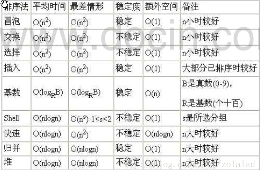
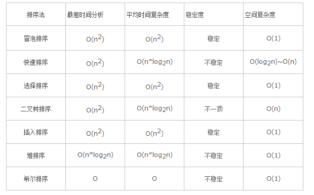

# 算法时间复杂度

常见算法时间复杂度由大道小依次为：**Ο(1)＜Ο(log2n)＜Ο(n)＜Ο(nlog2n)＜Ο(n2)＜Ο(n3)＜…＜Ο(2n)＜Ο(n!)**

求解算法时间复杂度的具体步骤：

1. 找出算法中的基本语句：算法中执行次数最多的那条语句就是基本语句，通常是最内层循环的循环体。
2. 计算基本语句的执行次数的数量级。
3. 用大O记号表示算法的时间性能。

如果算法中包含嵌套循环，基本语句通常是最内层的循环体;如果算法中包含并列循环，则将并列循环的时间复杂度相加。

Ο(1)表示基本语句的执行次数是一个常数，一般来说，只要算法中不存在循环语句，其时间复杂度就是Ο(1)。其中**Ο(log2n)、Ο(n)、 Ο(nlog2n)、Ο(n2)和Ο(n3)**称为多项式时间，而**Ο(2n)和Ο(n!)**称为指数时间。

计算算法时间复杂度的几个简单程序分析法则：

1. 简单的输入输出语句或者赋值语句，近似认为需要O(1)时间。
2. 顺序结构，需要依次执行一系列语句所用的时间，可采用O下求和法则。
3. 选择结构，if语句，主要耗费时间是在执行then字句或else字句;校验条件也需要O(1)时间。
4. 循环结构，循环语句的运行时间主要体现在多次迭代中执行循环体以及检验循环条件的时间耗费，一般可用大O下乘法法则。
5. 复杂算法，可以将它分为几个容易估算的部分，然后利用求和法则和乘法法则计算整个算法的时间复杂度。

常用算法时间复杂度和空间复杂度：



常用排序时间复杂度：



# 冒泡排序及时间复杂度

冒泡排序的思想是：通过无序区中相邻记录关键字间的比较和位置交换，使关键字的记录如气泡一般逐渐往上漂浮至水面。

整个算法是**从最下面的记录**开始，对每两个相邻的关键字进行比较，且使关键字较小的记录切换至关键字较大的记录之上，使得经过一趟冒泡排序之后，关键字最小的记录到达最上端，接着在剩下的记录中找关键字最小的记录，并把它换到第二个位置上。以此类推，一直到所有记录都有序为止。

时间复杂度：

对于长度为n的数组，需要进行n-1趟操作，才能确保排序完成，时间复杂度为O(n^2)。

空间复杂度：

排序过程中需要一个临时变量进行两两交换，需要的额外空间为1，空间复杂度为O(1)。

稳定性：

冒泡排序在排序过程中，元素两两交换时，相同元素的前后顺序并没有改变，所以是稳定排序算法。

代码实现：

```java
package me.cxis;

import java.util.Arrays;

public class BubbleSort {

    public static int[] bubbleSort(int[] originArray) {
        System.out.println("排序之前的数组：" + Arrays.toString(originArray));
        for (int i = 1; i < originArray.length; i++) {
            for (int j = originArray.length - 1; j > i - 1; j-- ) {
                if (originArray[j] < originArray[j-1]) {
                    int tmp = originArray[j-1];
                    originArray[j-1] = originArray[j];
                    originArray[j] = tmp;
                }
            }
            System.out.println("第" + (i + 1) + "次排序后的数组：" + Arrays.toString(originArray));
        }
        System.out.println("排序之后的数组：" + Arrays.toString(originArray));
        return originArray;
    }

    public static void main(String[] args) {
        int[] originArray = {3, 4, 1, 9, 5, 6, 2};
        bubbleSort(originArray);

    }
}
```

## 排序算法的稳定性

排序算法的稳定是指：相同的值在排序过后相对位置不变。也就是保证排序前两个相等的数的前后顺序，和排序后它们两个的前后位置顺序相同。


# 了解AQS吗？AQS源码等

AQS即AbstractQueuedSynchronizer，队列同步器，用来构建锁和其他同步组件的框架。

## AQS的核心思想

如果被请求的共享资源空闲，则将当前请求资源的线程设置为有效工作线程，并且将共享资源设置为锁定状态；如果被请求的共享资源被占用，那么就需要一套线程阻塞等待以及被唤醒时锁分配的机制，这个机制在AQS中是使用CLH队列锁来实现的，即将暂时获取不到锁的线程加入到队列中。

CLH队列是一个虚拟双向队列，即不存在队列实例，仅存在结点之间的关联关系。AQS将每条请求共享资源的线程封装成一个CLH锁队列的一个结点（Node）来实现锁的分配。

## AQS实现

AQS维护一个volatile int state（代表共享资源）和一个FIFO线程等待队列（多线程争用资源被阻塞时会进入此队列）。state访问方式有下面三种：

- getState()
- setState()
- compareAndSetState()

AQS定义两种资源共享方式：

- Exclusive，独占：只有一个线程能执行，比如ReentrantLock。
- Share，共享：多个线程可同时执行，比如Semaphore和CountDownLatch。

不同的自定义同步器争用共享资源的方式也不同。自定同步器在实现时只需要实现共享资源state的获取与释放方式即可，至于具体线程等待队列的维护（如获取资源失败入队或唤醒出队等）AQS已经在顶层实现好。

自定义同步器实现时主要实现以下几种方法：

- isHeldExclusively()：该线程是否正在独占资源，只有用到Condition才需要实现它。
- tryAcquire(int)：独占方式，尝试获取资源，成功返回true；失败返回false。
- tryRelease(int)：独占方式，尝试释放资源，成功返回true；失败返回false。
- tryAcquireShared(int)：共享方式，尝试获取资源，负数表示失败；0表示成功，但没有剩余可用资源；正数表示成功，且有剩余资源。
- tryReleaseShared(int)：共享方式，尝试释放资源，成功返回true；失败返回false。

## 自定义同步器

### ReentrantLock

state初始化为0，表示未锁定状态。A线程lock()时，会调用tryAcquire()独占该锁并将state加1。此后，其他线程再尝试获取tryAcquire()时就会失败，直到A线程unlock()到state为0（即释放锁）为止，然后其他线程才有机会获取该锁。

当然，释放锁之前，A线程自己是可以重复获取此锁的，state会累加，这就是可重入的概念。获取多少次就要释放多少次，这样才能保证state是能回到0状态的。

### CountDownLatch

任务分为N个子线程去执行，state初始化为N。这N个子线程是并行执行的，每个子线程执行完后countDown()一次，state会CAS减1。等到所有子线程都执行完后（即state=0），会unpark()主调用线程，然后主调用线程就会从await()函数返回，继续后余动作。

一般来说，自定义同步器要么是独占方式，要是是共享方式，只需要实现tryAcquire和tryRelease或者实现tryAcquireShared和tryReleaseShared中的一种即可。但AQS也支持自定义同步器同时实现独占和共享两种方式，如ReentrantReadWriteLock。

# ReentrantLock原理以及源码

是可重入的互斥锁，和synchronized语义类似，都具有可重入性，ReentrantLock增加了一些高级功能，比如实现了公平锁，还可以绑定多个Condition。

- 可重入性：可以支持一个线程对锁的重复获取。
- 公平锁/非公平锁：公平锁，多个线程获取同一个锁的时候，必须按照严格的锁的申请时间来依次获得锁；非公平锁，当锁被释放时候，等待中的线程均有机会获得锁。synchronized是非公平锁，ReentrantLock默认也是非公平锁，可以通过构造方法来指定使用公平锁。一般非公平锁性能比公平锁好。

synchronized是Java原生的互斥同步锁，使用方便，无需显式释放锁。底层是通过monitorenter和monitorexit两个字节码指令来实现加锁和解锁操作的。ReentrantLock做为API层面的互斥锁，需要显式的加锁和解锁。

ReentrantLock内部定义了三个静态内部类：Sync、FairSync、NoFairSync。Sync继承了AQS，其他两个继承Sync，各自完成公平和非公平的逻辑。

公平性和非公平性的区别是：在尝试获取锁的时候多了一个判断，公平锁在尝试获取锁的时候先判断是否有比自己申请早的线程在同步队列中等待，有，则等待；没有就抢占。

# Synchronized实现原理

理解要点：

- 理解synchronized的实现方式：monitorenter和monitorexit。
- 为什么称为重量级锁。
- 对重量级锁的优化：自旋锁和自适应自旋锁。
- 演化：轻量级锁。
- 演化：偏向锁。

## 实现及重量级锁

synchronized是Java中最基本的互斥同步手段，编译之后会在同步块的前后添加monitorenter和monitorexit两个字节码指令。同步块在已经进入的线程执行完之前，会阻塞后面其他的线程，在Java中线程是映射到操作系统的原生线程之上，阻塞线程就会涉及到用户态切换到核心态等等，所以synchronized被称为**重量级锁**。

## 自旋锁

互斥同步对性能最大的影响就是阻塞的实现，一般共享的锁定状态只会持续很短时间，如果物理机器上有一个以上的处理器，可以让两个或以上的线程同时并行执行，就可以让后来请求锁的线程稍微等待一下，但是不放弃处理器的执行时间。为了让线程等待，只需要让线程执行一个忙循环（自旋），这就是**自旋锁**。

自旋锁不能代替阻塞，自旋本身虽避免了线程切换的开销，但是要占用处理器的时间，如果占用时间长就会浪费处理器资源。自旋锁实现上设置了一个限度，**默认自旋次数是10次**，超过次数就使用传统方式挂起线程。

## 自适应自旋锁

JDK1.6中引入了**自适应的自旋锁**，意味着自旋时间不再固定了，而是由前一次在同一个锁上的自旋时间及锁的拥有者状态来决定。如果在同一个锁对象上，自旋等待刚刚成功获取锁，并且持有锁的线程正在运行中，虚拟机就会认为这次自旋也很有可能再次成功，就会允许自旋等待持续更长时间；如果对于某个锁，自旋很少成功获得，那么在以后要获取这个锁时可能忽略掉自旋过程，避免资源浪费。

## 轻量级锁

**轻量级锁**是JDK1.6加入的，本意是在没有多线程竞争的前提下，减少传统的重量级锁使用操作系统互斥量产生的性能消耗。虚拟机进入同步块的时候会先使用轻量级锁，如果发现有两条以上的线程竞争同一个锁，轻量级锁就会膨胀为重量级锁。

轻量级锁使用CAS操作避免了使用互斥量的开销，但是如果存在竞争，除了互斥量的开销外，还额外发生了CAS操作，因此在有竞争情况下，轻量级锁会比重量级锁更慢。

## 偏向锁

**偏向锁**也是在JDK1.6中引入的一项锁优化，目的是消除数据在无竞争情况下的同步原语。轻量级锁是在无竞争情况下使用CAS去消除同步使用的互斥量，偏向锁就是在无竞争情况下把整个同步都消除掉。

偏向锁会偏向于第一个获得他的线程，如果在接下来的执行过程中，该锁没有被其他线程获取，则持有偏向锁的线程永远不需要再进行同步。当另外一个线程去尝试获取这个锁的时候，偏向锁就宣告结束。

## 轻量级锁和偏向锁的实现

都是存储在对象头（Mark Word）中。

# CAS实现原理以及缺点

理解要点：

- CAS通过unsafe的方法实现：有三个操作数，内存值V，旧的预期值A，要修改的新值B，当且仅当预期值A和内存值V相同时，将内存值V改为B，否则什么都不做。
- 方法的参数：第一个参数是要修改的对象；第二个参数是对象中要修改变量的偏移量；第三个是修改前的值；第四个是修改后的值。
- 系统级别实现：CAS是借助CPU底层指令来完成的。
- CAS缺点：ABA问题，以及怎么解决

**ABA问题**，CAS在操作值的时候，需要检查下值有没有变化，没有发生变化则更新。但是如果一个值原来是A，变成了B，又变成了A，那么使用CAS检查的时候会发现它的值没有发生变化，但是实际上却发生了变化！

ABA解决思路是使用版本号，在变量前追加版本号，每次变量更新的时候把版本号加1。从JDK1.5开始提供了一个类AtomicStampedReference来解决ABA问题，它通过控制变量值的版本来保证CAS的正確性。

# HashMap和ConcurrentHashMap

HashMap底层实现是数组加链表的形式，添加数据的时候，首先根据key的hash值来计算在数组中的索引，当找到的位置有数据存在时，会在当前索引处使用链表来存储hash值相等的数据，查找链表中的数据会通过key的equals方法来判断。

在JDK1.8中HashMap采用数组加链表和红黑树的方式实现，当链表长度超过8的时候，链表就转换为红黑树进行存储。

HashMap不是线程安全的。

ConcurrentHashMap采用分段锁实现线程安全，底层实现还是数组和链表的形式。ConcurrentHashMap中有个Segment数组，这个Segment其实就是一把锁。每个Segment中还是数组和链表的形式，跟HashMap一样。

每个Segment是一把锁，ConcurrentHashMap写操作只会锁住一段Segment，其他的Segment不会被锁住，就是利用这种方式来实现并发和线程安全的。

JDK1.8中发生了变化，取消了Segments字段，采用了类似HashMap的数组加链表和红黑树的形式实现，可以实现对每一行数据进行加锁，利用CAS和synchronized进行高效的同步更新数据。

# Java内存模型/JMM

Java内存模型用来屏蔽各种硬件和操作系统间的内存访问差异。在JSR-133实现中逐步完善和成熟。Java内存模型分为主存和工作内存，所有的变量都存储在主存中，每条线程还有自己的工作内存，线程的工作内存中保存了所使用的变量的主存的副本拷贝，线程对变量的操作都必须在工作内存中进行。

# volatile的理解

被volatile修饰的变量一般会有两个特性：

- 保证了不同线程对该变量操作的内存可见性。
- 禁止指令重排序。

内存可见性，首先需要说一下JMM也就是Java内存模型，分为主存和工作内存，所有变量都存储在主存中，每个线程都有自己的工作内存，存储着需要的变量的主存的副本，对变量的操作都在工作内存中进行，操作完成之后，需要将变量写回主存中，如果有多个线程都操作，可能会造成缓存不一致的问题。而使用volatile关键字修饰变量，就可以解决这个问题，来保证内存可见性，对一个变量的修改会立刻回写到主存，其他线程需要该变量时，会去主存中读取新值。

volatile只能保证可见性和有序性，但是不能保证原子性。

# Java深克隆和浅克隆/深拷贝和浅拷贝

浅克隆：复制一个对象的实例，但是该对象中包含的其他的对象还是公用的，不会克隆一份。一般使用super.clone()，clone的对象就是浅克隆。

深克隆：复制一个对象的实例，而且这个对象中包含的其他的对象也要复制一份。

# Java内存区域/Java运行时数据区域

- 程序计数器：当前线程所执行的字节码的行号指示器，是线程私有的。
- Java虚拟机栈：是线程私有的，与线程的生命周期相同。虚拟机栈描述的是Java方法执行的内存模型，每个方法在执行的同时都会创建一个栈帧，用于存储局部变量表、操作数栈、动态链接、方法出口等信息。每一个方法从调用直至执行完成，就对应着一个栈帧在虚拟机栈中入栈到出栈的过程。
- 本地方法栈：执行本地方法服务的。
- Java堆：虚拟机管理的内存中最大的一块，是被所有线程共享的，在虚拟机启动的时候创建，用来存放对象实例。所有的对象和数组都要在堆上分配。Java堆可以分为新生代和老年代；新生代可分为Eden空间，From Suvivor空间和To Suvivor空间等。
- 方法区：是各个线程共享的内存区域，用于存储虚拟机加载的类信息、常量、静态变量、即时编译器编译后的代码等数据。

# 垃圾回收机制/垃圾收集算法

- 标记-清除
- 复制
- 标记-整理
- 分代收集

## 标记-清除算法

首先标记出所有需要回收的对象，在标记完成之后要统一回收所有被标记的对象。标记和清除的效率都不高，在标记清除之后会产生大量不连续的空间碎片，空间碎片太多可能会导致以后在程序运行过程中需要分配较大对象时，无法找到足够的连续内存而不得不提前触发另一次垃圾收集动作。

## 复制算法

复制算法将内存划分为大小相等的两块，每次只使用其中的一块。当一块内存使用完了，就将还存在着的对象复制到另外一块上，然后把已使用的内存空间一次清理掉。但是这样就会把内存缩小为原来的一半，代价有点高。

现在的虚拟机，将内存分为一块较大的Eden空间和两块较小的Survivor空间，每次使用Eden空间和其中一块Survivor空间。当回收时，将Eden和Survivor中还活着的对象一次性复制到另外一个Survivor空间上，然后清理掉Eden和刚才用过的Survivor空间。HotSpot虚拟机默认Eden和Survivor比例是8：1。

## 标记-整理算法

老年代一般使用标记整理算法，标记过程首先标记出需要清理的对象，然后将所有存活的对象都向一端移动，最后直接清理掉端边界以外的内存。

## 分代收集算法

分代收集是将上面的算法组合使用，Java堆一般分为新生代和老年代，新生代使用复制算法，老年代使用标记整理或者标记清理算法。

# 内存分配策略

**对象优先分配在新生代的Eden区**，当Eden区没有足够的空间进行分配时，虚拟机会执行一次Minor GC。如果还找不到足够空间，就通过担保机制提前分配到老年代中去。

**大对象直接进入老年代**，虚拟机提供了一个-XX：PretenureSizeThreshold参数，令大于这个设置值的对象直接在老年代分配。这样做的目的是避免在Eden区以及两个Survivor区域之间发生大量的内存复制。

**长期存活对象进入老年代**，虚拟机为每个对象定义了一个年龄计数器，每经过一次Minor GC存活的对象年龄就加1，当年龄增加到一定程度，默认为15，就会晋升到老年代中。

**动态对象年龄判定**，如果Survivor区中相同年龄的对象大小总和大于Survivor空间的一半，则年龄大于或者等于该年龄的对象直接进入老年代。

**空间分配担保**，每次进行Minor  GC时，JVM会计算Survivor区移到老年代的对象的平均大小。如果这个值大于老年代的剩余值大小则进行一次Full GC，如果小于就检查HandlePromotionFailure设置，如果为true，就进行Minor GC，如果为false就进行Full GC。


# Minor GC/Major GC/Full GC

Minor GC，发生在新生代的垃圾收集动作，Minor GC发生频繁，回收速度也比较快。

Major GC/Full GC，发生在老年代的GC，出现了Major GC一般会伴随至少一次Minor GC。Major GC一般会比Minor GC慢10倍。

# 类的生命周期

- 加载
- 链接：验证、准备、解析
- 初始化
- 使用
- 卸载

# 类加载过程

## 加载

在加载阶段，虚拟机需要完成：

- 通过一个类的全限定名获取定义此类的二进制字节流。
- 将字节流所代表的静态存储结构转化为方法区的运行时数据结构。
- 在内存中生成一个代表这个类的Class对象，作为方法区这个类的访问的入口。

加载阶段完成后，虚拟机外部的二进制字节流就按照虚拟机所需的格式存储在方法区中，然后在内存中实例化一个Class类的对象，这个对象存储在方法区中，这个对象作为程序访问方法区中的这个类的外部接口。

## 验证

验证是为了确保Class文件中字节流中包含的信息符合当前虚拟机的要求，并且不会损害虚拟机自身的安全。

- 文件格式验证
- 元数据验证
- 字节码验证
- 符号引用验证

## 准备

准备阶段是正式为类变量分配内存并设置类变量初始值的阶段。类变量所使用的内存都在方法区中进行分配。

## 解析

解析阶段是虚拟机将常量池中的符号引用替换为直接引用的过程。

## 初始化

类初始化阶段是类加载过程的最后一步，这个阶段才是真正开始执行类中定义的Java代码。初始化阶段是执行类构造器`<clinit>()`方法的过程。

- `<clinit>()`方法是由编译器自动收集类中所有类变量的赋值动作和静态语句块中的语句合并产生的。编译器收集的顺序是由语句在源文件中出现的顺序决定的。
- `<clinit()>`方法和实例构造器`<init>()`方法不同，类构造器方法不需要显式调用父类构造器，虚拟机会保证在子类的`<clinit>()方法执行之前，父类的类构造器方法已经执行完成。`
- 由于父类的类构造器方法先执行，所以父类中定义的静态语句块要优先于子类的变量赋值操作。
- 如果一个类中没有静态语句块，编译器可以不为这个类生产`<clinit>()`方法。
- 接口没有静态语句块，但是有变量初始化赋值操作，所以接口也会有类构造器方法，但是执行接口的类构造器方法不需要先执行父接口的`<clinit>()`方法。接口的实现类初始化时也不会执行接口的类构造器方法。
- 虚拟机会保证类的`<clinit>()`方法的线程安全。

# 对象在内存中的初始化过程/对象的创建

对象的初始化和创建的大致过程如下，虚拟机遇到一个new指令，会首先在常量池中去定位到一个类的符号引用，并检查这个符号引用代表的类是否被加载、解析和初始化过。如果没有的话，先执行类的加载过程。在类加载检查通过后，虚拟机会为新生对象分配内存。内存分配完成后，虚拟机需要将分配到的内存空间都初始化为零值，这能保证对象的实例字段在Java代码中不赋予初始值就可以直接使用。接下来虚拟机要对对象进行必要的设置，例如是哪个类的实例，如何才能找到类的元数据信息等。之后会执行`<init>`方法，把对象按照程序员的意愿进行初始化。


当一个对象被创建时，虚拟机就会为其分配内存来存放对象自己的实例变量以及从父类继承过来的实例变量，在为这些实例变量分配内存的同时，这些实例变量也会被赋予默认值。内存分配完成之后，Java虚拟机就会开始对新创建的对象按照程序员的意志进行初始化。Java对象初始化过程中，主要涉及三种执行对象初始化的结构：

- 实例变量初始化
- 实例代码块初始化
- 构造函数初始化

## 实例变量初始化以及实例代码块初始化

在定义实例变量的同时，还可以直接对实例变量进行赋值或者使用实例代码块进行赋值，它们将在构造函数执行之前完成这些初始化操作。

如果我们对实例变量直接赋值或者使用实例代码块赋值，编译器会将其中的代码放到类的构造函数中去，并且这些代码会被放在对超类构造函数的调用语句之后，构造函数本身的代码之前。**Java要求构造函数的第一条语句必须是超类构造函数的调用语句**

## 构造函数初始化

实例变量和实例代码块初始化总是发生在构造方法初始化之前。编译生成的字节码中这些构造函数会被命名成`<init>()`

Java要求在实例化之前必须实例化其超类，以保证所创建实例的完整性，Java强制要求除了Object对象之外所有的对象的构造方法的第一条语句必须是超类构造方法的调用语句。默认编译器会为我们自动生成一个对超类构造方法的调用。

**类实例化的过程**：父类的类构造器`<clinit>()` --> 子类的类构造器`<clinit>()` --> 父类的成员变量和实例代码块 --> 父类构造方法 --> 子类的成员变量和实例代码块 --> 子类的构造方法。

# Spring AOP应用场景以及原理

AOP适合于那些具有横切逻辑的应用，比如：性能监测，访问控制，事务管理，缓存，对象池管理以及日志记录。AOP将这些分散在各个业务逻辑中的代码通过横向切割的方式抽取到一个独立的模块中。

AOP实现的关键就在于AOP框架自动创建的AOP代理，AOP代理可以分为静态代理和动态代理：

- 静态代理，在编译阶段就可以生成AOP代理类，也称为编译时增强。
- 动态代理，借助JDK动态代理或者CGLIB等动态生成代理类，也称为运行时增强。

Spring AOP使用的是动态代理的方式，在运行时动态生成代理类。

## JDK和CGLib的区别

JDK动态代理机制只能代理接口，不能代理实现类。而cglib是针对实现类来进行代理的，对指定的目标类生成一个子类，并覆盖其中的方法实现增强，不能对final修饰的类进行代理。

# 线程的状态

1. 新建状态New：新创建了一个线程对象。
2. 就绪状态Runnable：线程对象创建后，其他线程调用了该对象的start()方法，该状态的线程位于可运行线程池中，变得可运行，只等待获取CPU的使用权。即在就绪状态的进程除了CPU之外，其他的运行所需资源都已全部获得。
3. 运行状态Running：就绪状态的线程获取了CPU，执行程序代码。
4. 阻塞状态Blocked：阻塞是线程因为某种原因放弃CPU使用权，暂时停止运行，直到线程进入就绪状态，才有机会转到运行状态。
5. 死亡状态Dead：线程执行完了或者因为异常退出了run()方法，该线程结束生命周期。

**阻塞状态**分为三种：

- 等待阻塞：运行的线程执行wait()方法，该线程会释放占用的所有资源，JVM会把该线程放入等待池中，进入这个状态的线程是不能自动唤醒的，必须依靠其他线程调用notify()或notifyAll()方法才能被唤醒。
- 同步阻塞：运行的线程在获取对象的同步锁时，若该同步锁被别的线程占用，JVM会把该线程放入锁池中。
- 其他阻塞：运行的线程执行sleep()或join()方法，或者发出了IO请求时，JVM会把该线程置为阻塞状态，当sleep()状态超时、join()等待线程终止或者超时、IO处理完毕时，线程重新转入就绪状态。

线程的实现有两种方式：继承Thread类和实现Runnable接口，当我们new了这个对象后，线程就进入了初始状态。调用对象的start方法，线程进入就绪状态，当对象被操作系统选中获得CPU时间片后就会进入运行状态。

- run方法或者main方法结束后，线程就进入了终止状态。
- 线程调用自身sleep方法或者其他线程的join方法，线程让出CPU后进入阻塞状态。sleep方法不会释放锁。当sleep或者join结束后，该线程进入就绪状态，等待OS分配CPU时间片。
- 线程调用yield方法，放弃当前CPU时间片，回到就绪状态。
- 线程进入可运行状态，发现将要调用的资源被synchronized，获取不到锁标记，将会立即进入锁池中，等待获取锁标记，处于队列状态，一旦获得锁后，就立即进入就绪状态。

## suspend()和resume()

suspend使线程进入阻塞状态，不会自动恢复，必须使用对应的resume被调用，才能使线程进入可执行状态。

## wait()和notify()

线程调用wait方法后，进入等待队列，线程会释放其拥有的资源，线程不会自动唤醒，需要其他线程调用notify或者notifyAll方法才能唤醒。

wait被调用后，线程会释放调它所占用的锁标志，从而使其他的线程可以获取到锁。所以wait和notify必须在synchronized方法或者块中调用。

# Java序列化和反序列化

## 序列化是干嘛的

序列化是为了保存内存中各种对象的状态（实例变量，不包括方法），反序列化可以把保存的对象状态再读出来。序列化可以把内存中对象保存到一个文件或者数据库中，可以在网络上传输对象，可以使用RMI传输对象。

## 相关事项

- 序列化只对对象的状态进行保存，不保存对象的方法，只保存成员变量，不会保存类中的静态变量。
- 父类实现了序列化接口，子类自动实现序列化，不需要显式实现。
- 一个对象的实例变量引用其他的对象，序列化该对象时也把引用对象进行序列化。
- 通过ObjectOutputStream和ObjectInputStream对对象进行序列化和反序列化。
- transient控制变量的序列化，transient修饰的变量，不会把变量的值序列化到文件中，反序列化之后该变量会被设置为初始值。
- 虚拟机是否允许反序列化，不仅取决于类路径和功能代码是否一致，还有一个重要的是两个类的序列化id是否一致。

## ArrayList的序列化和反序列化

ArrayList中这个`transient Object[] elementData;`字段，被transient修饰，也就是说ArrayList中的数据是不可以被序列化以及反序列化的，但是实际验证下来的结果却不是这样，ArrayList中的值被正确的序列化和反序列化了。原因是ArrayList定义了两个方法writeObject和readObject。

如果一个类中定义了这两个方法，在对对象进行序列化和反序列化的时候，虚拟机就会调用自定义的writeObject和readObject方法。如果类中没有定义这两个方法，则默认使用ObjectOutputStream的defaultWriteObject方法和ObjectInputStream的defaultReadObject方法。

## ArrayList为什么要自定义序列化和反序列化方法呢？

ArrayList底层实现是动态数组，当数组的长度是10的时候，但是实际上只存储了1个元素，其他9个都是null，这时候如果直接序列化改数组，就会造成序列化和反序列化9个null，造成浪费。所以ArrayList将保存数据的数组设置成transient。

ArrayList中保存数据的数组被设置成了transient，那它怎么序列化和反序列化其中的数据呢？这时候就需要ArrayList自己实现序列化和饭序列化的方法了，也就是writeObject和readObject方法。相关的代码可查看ArrayList的源码。

ArrayList中的writeObject和readObject方法是什么时候被调用的？可以查看下ObjectOutputStream的writeObject的源码，调用栈为：`writeObject --> writeObject0 --> writeOrdinaryObject --> writeSerialData --> invokeWriteObject`在invokeWriteObject方法中通过反射调用ArrayList中的writeObject方法。这样就调用到自定义的序列化和反序列化方法了。

另外在序列化的时候，会判断要被序列化的类是否是Enum、Array和Serializable类型的，不是的话就抛出异常NotSerializableException。

# 线程池的原理及实现

## 线程池简介

多线程技术主要解决处理器单元内多个线程执行的问题，它可以显著减少处理器单元的闲置时间，增加处理器单元的吞吐能力。

假如一个服务器完成一项任务所需时间为：T1创建线程时间，T2线程执行任务时间，T3销毁线程时间。如果T1+T3远大于T2，则可以用线程池，以提高服务器性能。

线程池技术正是关注如何缩短或调整T1和T3时间的技术，把T1和T3分别安排在服务器启动和结束时间或者空闲时间，这样服务器处理客户请求时，T1和T3时间开销就会大大减少，从而提高服务器程序性能。另外线程池还能显著减少创建线程的数目。

线程池一般包括以下四个基本组成部分：

- 线程池管理器（ThreadPool），用于创建并管理线程池，包括创建线程池、销毁线程池、添加新任务。
- 工作线程（PoolWorker），线程池中的线程，在没有任务时处于等待状态，可以循环的执行任务。
- 任务接口（Task），每个任务必须实现的接口，以供工作线程调度任务的执行，主要规定了任务的入口，任务执行完后的收尾工作，任务的执行状态等。
- 任务队列（taskQueue），用于存放没有处理的任务，提供一种缓冲机制。

## 使用线程池的意义

- 复用：web服务器等系统，内部需要使用大量的线程来处理请求，单次请求响应时间通常比较短，此时Java基于操作系统的本地调用方式大量创建和销毁线程本身会成为系统的一个性能瓶颈和资源浪费。若使用线程池技术可以实现工作线程的复用，即一个工作线程创建和销毁的生命周期内可以执行处理多个任务，从而总体上降低线程创建和销毁的频率和时间，提升了系统性能。
- 流控，服务器资源有限，超过服务器性能的过高并发反而会成为系统负担，造成CPU大量耗费与上下文切换、内存溢出等后果，通过线程池技术可以控制系统最大并发数和最大处理任务量，从而很好的实现流控，保证系统不至于崩溃。


## 线程池技术要点

- 工作者线程（Worker），即线程池中可以重复利用起来执行任务的线程，一个工作者线程生命周期内会不停的处理多个业务。通过设置不同参数可以控制工作者线程的数量，从而实现线程池容量的伸缩，来实现复杂的业务需求。
- 待处理工作的存储队列，工作者线程数量是有限的，同一时间最多只能处理指定数量的任务，对于来不及处理的任务要保存到等待队列中，空闲了的工作者线程会不停的读取空闲队列里的任务进行处理。基于不同的队列实现可以扩展出多种功能的线程池，如：定制队列出队顺序实现带处理优先级的线程池，定制队列为阻塞有界队列实现可阻塞能力的线程池。
- 线程池初始化，即线程池参数的设定和多个工作者线程的初始化方式，通常有一开始就初始化指定数量的工作者线程或者请求时逐步初始化工作者线程的两种方式。前者线程池启动初期响应会比较慢，但造成了空载时少量性能浪费；后者基于请求量灵活扩容，但牺牲了线程池启动初期性能，到不到最优。
- 处理业务任务的算法，业务给线程池添加任务时线程池的处理算法，有的线程基于算法识别直接处理任务还是增加工作者数量，或者放入待处理队列；也有的线程池会直接将任务放入待处理队列，等待工作者线程去取出执行。
- 工作者线程的增减算法，业务线程数不是持久不变的，有高低峰期。线程池要有自己的算法根据业务请求频率高低调节自身工作者线程数量来调节线程池大小，从而实现业务高峰期增加工作者数量提高响应速度，而业务低峰期减少工作者数量来节省服务器资源，增加算法通常基于几个维度进行：待处理工作数，线程池定义的最大最小工作者线程，工作者闲置时间。

## Java Executor线程池解析

### Executor接口

Executor框架是一个根据一组执行策略调用、调度、执行和控制异步任务的框架。它提供了一种将任务提交与任务运行分离开来的机制。线程池有两个作用：

- 避免Thread不断创建和销毁的开销。
- 通过使用线程池可以限制任务所消耗的资源，比如使用最大线程数，最大消息缓冲池等。

Executor是线程池的顶级接口，只定义了一个方法`void execute(Runnable command);`表示可以执行Runnable方法。

### ExecutorService接口

ExecutorService接口扩展了Executor接口，增加了生命周期管理的方法，生命周期有三种状态：运行、关闭、终止。

- shutdown()方法被调用后，处于关闭状态，此时isShutdown()返回true，这时候心任务不能再被添加，但是正在执行的和队列中的任务会继续执行完。
- shutdownNow()方法被调用，会直接结束所有正在运行的线程，删除等待队列中的线程。
- 所有任务执行完成之后，Executor处于终止状态，isTerminated()方法返回true。
- submit()方法传递一个Callable或Runnable，返回Future。

### ThreadPoolExecutor

ThreadPoolExecutor是线程池的具体实现类，一般用的各种线程池都是基于这个类来实现。

构造方法如下：

```java
public ThreadPoolExecutor(int corePoolSize,
                          int maximumPoolSize,
                          long keepAliveTime,
                          TimeUnit unit,
                          BlockingQueue<Runnable> workQueue,
                          ThreadFactory threadFactory,
                          RejectedExecutionHandler handler) {
    if (corePoolSize < 0 ||
        maximumPoolSize <= 0 ||
        maximumPoolSize < corePoolSize ||
        keepAliveTime < 0)
        throw new IllegalArgumentException();
    if (workQueue == null || threadFactory == null || handler == null)
        throw new NullPointerException();
    this.corePoolSize = corePoolSize;
    this.maximumPoolSize = maximumPoolSize;
    this.workQueue = workQueue;
    this.keepAliveTime = unit.toNanos(keepAliveTime);
    this.threadFactory = threadFactory;
    this.handler = handler;
}
```

- corePoolSize，线程池核心线程数，线程池中运行的线程数，线程池中运行的线程数永远不会超过corePoolSize个，超过这个范围的时候，就需要将新的线程放入到等待队列中，默认情况下可以一直存活。可以通过设置allowCoreThreadTimeOut为true，此时核心线程数就是0，此时keepAliveTime控制所有线程的超时时间。
- maximumPoolSize，线程池允许的最大线程数。当大于了这个值，就会将线程由一个丢弃处理机制来处理。
- keepAliveTime，空闲线程结束的超时时间。
- unit，表示keepAliveTime的单位。
- workQueue，表示存放任务的队列，当达到corePoolSize的时候，就向该等待队列放入线程信息。
- handler，就是参数maximumPoolSize达到后丢弃处理的方法。
- threadFactory，用于创建线程的工厂。

#### 理解corePoolSize、maximumPoolSize、workQueue关系

- 如果没有空闲的线程执行新任务，并且当前运行的线程数小于corePoolSize，则添加新的线程执行新任务。
- 如果没有空闲的线程执行新任务，并且当前线程数等于corePoolSize，同时阻塞队列未满，则将任务加入队列，不添加新线程。
- 如果没有空闲的线程执行新任务，并且阻塞队列已满，同时线程池中的线程数小于maximumPoolSize，则创建新线程执行该任务。
- 如果没有空闲的线程执行新任务，并且阻塞队列已满，同时线程池中的线程数等于maximumPoolSize，则根据构造函数中的handler指定的策略来拒绝新的任务。

#### 理解handler

当等待队列已满，并且线程池中的线程数达到maximumPoolSize时，线程池拒绝添加新的任务就是handler来进行处理的。

- AbortPolicy，抛出RejectedExecutionExecuption异常。
- CallerRunsPolicy，由向线程池提交任务的线程来执行该任务。
- DiscardOldestPolicy，抛弃最旧的任务。
- DiscardPolicy，抛弃当前任务。

#### 理解workQueue

workQueue决定了缓存任务的排队策略，对于不同场景可能采取不同的排队策略，需要不同类型的阻塞队列。

- SynchronousQueue，此队列不缓存任何一个任务，向线程池提交任务时，如果没有空闲线程来执行任务，则入队列操作会阻塞；当有线程来获取任务时，出队列操作会唤醒执行入队列操作的线程。SynchronousQueue是一个无界队列，使用此队列时，maximumPoolSize没有作用。
- LinkedBlockingQueue，链表实现的队列，可以是有界，也可以是无界的，默认在Executors中使用无界队列。


### Executors

Executors类提供了创建常用配置线程池的方法，为了防止使用错误搭配ThreadPoolExecutor构造函数的各个参数以及更加方便简洁的创建ThreadPoolExecutor对象。

#### newCachedThreadPool

```java
public static ExecutorService newCachedThreadPool() {
    return new ThreadPoolExecutor(0, Integer.MAX_VALUE,
                                  60L, TimeUnit.SECONDS,
                                  new SynchronousQueue<Runnable>());
}
```

使用SynchronousQueue作为阻塞队列，队列无界，线程空闲时限60秒。此类线程适用于IO密集的服务，IO请求具有密集、数量巨大、不持续、服务端CPU等待IO响应时间长的特点，服务器端为了能提高CPU使用率就应该为每个IO请求都创建一个线程，以免CPU因等待 IO响应而空闲。

#### newFixedThreadPool

```java
public static ExecutorService newFixedThreadPool(int nThreads) {
    return new ThreadPoolExecutor(nThreads, nThreads,
                                  0L, TimeUnit.MILLISECONDS,
                                  new LinkedBlockingQueue<Runnable>());
}
```

指定核心线程数，核心线程数和最大线程数相同，使用LinkedBlockingQueue作为阻塞队列，队列无界，线程空闲时限为0秒。此类线程池适用于CPU密集的任务，CPU忙于计算很少空闲，由于CPU真正并发执行的线程数是一定的，所以对于那些需要CPU进行大量计算的线程，创建的线程数超过CPU能够真正并发执行的线程数就没有太大意义。

#### newSingleThreadExecutor

```java
public static ExecutorService newSingleThreadExecutor() {
    return new FinalizableDelegatedExecutorService
        (new ThreadPoolExecutor(1, 1,
                                0L, TimeUnit.MILLISECONDS,
                                new LinkedBlockingQueue<Runnable>()));
}
```

此线程池中只有一个线程工作，阻塞队列无界，能保证按照任务提交的顺序来执行任务。