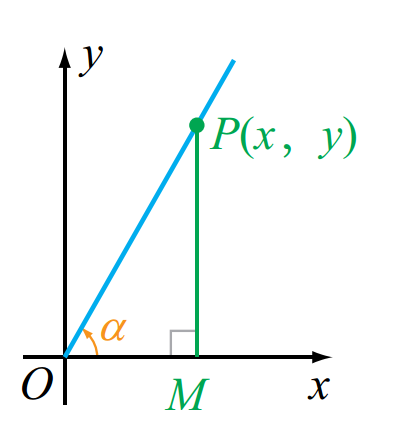
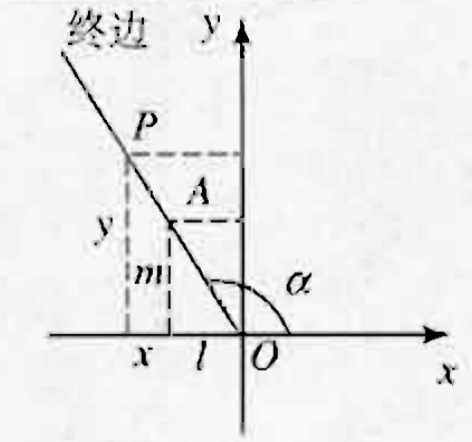
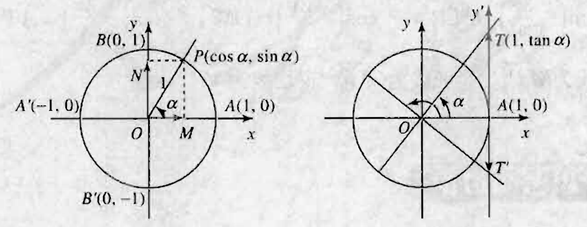

# 锐角三角函数

$$
\sin A = \frac{\angle A的对边}{斜边}=\frac{a}{c}
$$

$$
\cos A = \frac{\angle A的邻边}{斜边} = \frac{b}{c}
$$

$$
\tan A = \frac{\angle A的对边}{\angle A的邻边} = \frac{a}{b}
$$

| 三角函数\锐角a | $30^\circ$           | $45^\circ$           | $60^\circ$           |
| -------- | -------------------- | -------------------- | -------------------- |
| $\sin a$ | $\frac{1}{2}$        | $\frac{\sqrt{2}}{2}$ | $\frac{\sqrt{3}}{2}$ |
| $\cos a$ | $\frac{\sqrt{3}}{2}$ | $\frac{\sqrt{2}}{2}$ | $\frac{1}{2}$        |
| $\tan a$ | $\frac{\sqrt{3}}{3}$ | 1                    | $\sqrt{3}$           |

# 弧度制和角度制

在半径为r的圆中，弧长为l的弧所对圆心角为 $\alpha$ rad，则 $\alpha = \frac{l}{r}$。

因为半径为r的圆周长为 $2 \pi r$，所以周角的弧度数是 $\frac{2 \pi r}{r} = 2 \pi$。于是：

- $360^\circ = 2 \pi \ rad$；
- $180^\circ = \pi \ rad$。

设一个角的弧度数为 $\alpha$，角度数为n，则：

- $\alpha \ rad = (\frac{180 \alpha}{\pi})^\circ$；
- $n^\circ = n \cdot \frac{\pi}{180} \ rad$。

特殊角的角度数与弧度数的对应表：

| 度           | 弧度                |
| ----------- | ----------------- |
| $0^\circ$   | 0                 |
| $30^\circ$  | $\frac{\pi}{6}$   |
| $45^\circ$  | $\frac{\pi}{4}$   |
| $60^\circ$  | $\frac{\pi}{3}$   |
| $90^\circ$  | $\frac{\pi}{2}$   |
| $120^\circ$ | $\frac{2}{3} \pi$ |
| $135^\circ$ | $\frac{3}{4} \pi$ |
| $150^\circ$ | $\frac{5}{6} \pi$ |
| $180^\circ$ | $\pi$             |
| $225^\circ$ | $\frac{5}{4} \pi$ |
| $270^\circ$ | $\frac{3}{2} \pi$ |
| $315^\circ$ | $\frac{7}{4} \pi$ |
| $360^\circ$ | $2 \ \pi$         |
# 任意角的三角函数

## 锐角三角函数

锐角三角函数和直角坐标系图：

$\alpha$为锐角，记 $\angle MOP = \alpha$，P(x, y)是 $\alpha$终边上不同于坐标原点的任意一点， $MP \bot Ox$与点M，则： OM=x，MP=y， $r=OP= \sqrt{x^2+y^2} > 0$，根据锐角三角函数定义可知：

- $\sin \alpha = \frac{y}{r}$
- $\cos \alpha = \frac{x}{r}$
- $\tan \alpha = \frac{y}{x}$
- $\cot \alpha = \frac{x}{y}$

## 任意角的三角函数

任意角的三角函数和直角坐标系图：

在任意角 $\alpha$的终边上取点A，使OA=1，设点A的坐标为(l, m)，再任取一点P(x, y)，设 $OP = r (r \neq 0)$，由相似三角形对应边成比例，得：

$$
\frac{|x|}{r} = l, \ \frac{|y|}{r} = |m|, \ \frac{|y|}{|x|} = \frac{|m|}{|l|}。
$$

因为A，P在同一象限内，所以它们的坐标符号相同。因此得：

$$
\frac{x}{r} = l, \ \frac{y}{r} = m, \ \frac{y}{x} = \frac{m}{l}。
$$

不论点P在终边的位置如何，它们都是定值，它们只依赖于 $\alpha$的大小，与点P在 $\alpha$终边上的位置无关。即当点P在 $\alpha$的终边上变化时，这三个比值始终等于定值。因此我们可以定义：

- $\frac{x}{r}$叫做角 $\alpha$的余弦，记作 $\cos \alpha$，即 $\cos \alpha = \frac{x}{r}$；
-  $\frac{y}{r}$叫做角 $\alpha$的正弦，记作 $\sin \alpha$，即 $\sin \alpha = \frac{y}{r}$；
-  $\frac{y}{x}$叫做角 $\alpha$的正切，记作 $\tan \alpha$，即 $\tan \alpha = \frac{y}{x}$，

其他三个函数：

- 角 $\alpha$的正割： $\sec \alpha = \frac{1}{\cos \alpha} = \frac{r}{x}$；
- 角 $\alpha$的余割： $\csc \alpha = \frac{1}{\sin \alpha} = \frac{r}{y}$；
- 角 $\alpha$的余切： $\cot \alpha = \frac{1}{\tan \alpha} = \frac{x}{y}$。

正弦函数、余弦函数和正切函数的定义域：

- $\sin \alpha , \alpha \in R$。
- $\cos \alpha, \alpha \in R$
- $\tan \alpha, \{\alpha | \alpha \neq k \pi + \frac{\pi}{2}, k \in Z\}$

## 单位圆与三角函数线

单位圆与三角函数线图：

我们把半径为1的圆叫做单位圆。设单位圆的圆心与坐标原点重合，则单位圆与x轴的交点分别为 $A(1, 0), A^{\prime}(-1, 0)$，而与y轴的交点分别为 $B(0, 1), B^{\prime}(0, -1)$。

设角 $\alpha$的顶点在圆心O，始边与x轴的正半轴重合，终边与单位圆相交于点P，过点P作PM垂直x轴于M，作PN垂直y轴与点N，则点M，N分别是点P在x轴、y轴上的正射影（简称射影）。由三角函数定义可知，点P的坐标为 $(\cos \alpha, \sin \alpha)$，即 $P(\cos \alpha, \sin \alpha)$。其中 $\cos \alpha = OM, \sin \alpha = ON$。

这就是说，角 $\alpha$的余弦和正弦分别等于角 $\alpha$终边与单位圆交点的横坐标和纵坐标。

以A为原点建立 $y^{\prime}$轴与y轴同向， $y^{\prime}$轴与 $\alpha$的终边（或其反向延长线）相交于点T（或 $T^{\prime}$），则 $\tan \alpha = AT (或AT^{\prime})$。

我们把轴上向量 $\overrightarrow{OM}, \overrightarrow{ON}, \overrightarrow{AT}(或 \overrightarrow{AT^{\prime}})$分别叫做 $\alpha$的余弦线、正弦线和正切线。

## 同角三角函数的基本关系式

在单位圆中，由三角函数的定义和勾股定理，可得：

- $\sin^2 \alpha + \cos^2 \alpha = 1$，
- $\tan \alpha = \frac{\sin \alpha}{\cos \alpha}$。

## 诱导公式

**角 $\alpha$与 $\alpha + k \cdot 2 \pi (k \in Z)$的三角函数间的关系** ：

在直角坐标系中， $\alpha$与 $\alpha + k \cdot 2 \pi$的终边相同，根据三角函数的定义，它们的三角函数值相等，即：

- $\cos(\alpha + k \cdot 2 \pi) = \cos \alpha$，
- $\sin(\alpha + k \cdot 2 \pi) = \sin \alpha$，
- $\tan(\alpha + k \cdot 2 \pi) = \tan \alpha$。

**角 $\alpha$与 $-\alpha$的三角函数间的关系** ：

设单位圆与角 $\alpha$和角 $-\alpha$的终边的交点分别为P和 $P^{\prime}$。容易看出点P和点 $P^{\prime}$关于x轴对称。已知点P的坐标是 $(\cos \alpha, \sin \alpha)$，则 $P^{\prime}$的坐标是 $(\cos \alpha, - \sin \alpha)$，于是，得：

- $\cos (- \alpha) = \cos \alpha$，
- $\sin (- \alpha) = - \sin \alpha$，
- $\tan (- \alpha) = - \tan \alpha$。

**角 $\alpha$与 $\alpha + (2k + 1) \pi (k \in Z)$的三角函数间的关系** ：

设角 $\alpha$与 $\alpha + \pi$的终边与单位圆分别交于点P和 $P^{\prime}$。易知， $\alpha + \pi$与 $\alpha - \pi , \alpha + 3 \pi , \alpha - 3 \pi , \cdots , \alpha + (2k + 1) \pi (k \in Z)$的终边相同，因此它们的三角函数值也相等。由点P与点 $P^{\prime}$关于原点对称，它们的对应坐标互为相反数，所以：

- $\cos [\alpha + (2k + 1) \pi] = -\cos \alpha$，
- $\sin [\alpha + (2k + 1) \pi] = - \sin \alpha$，
- $\tan [\alpha + (2k + 1) \pi] = \tan \alpha$。

设角 $\alpha$与 $\pi - \alpha$和单位圆分别相交于点 $P， P^{\prime}$。点 $P， P^{\prime}$关于y轴对称，可以得到 $\alpha$与 $\pi - \alpha$之间的三角函数的关系：

- $\sin (\pi - \alpha) = \sin \alpha$，
- $\cos (\pi - \alpha) = - \cos \alpha$。

**$\alpha$与 $\alpha + \frac{\pi}{2}$的三角函数间的关系** ：

设 $\alpha$的终边与单位圆相交于点 $P(\cos \alpha, \sin \alpha)$，点P关于直线y=x的轴对称点M的坐标为 $(\sin \alpha, \cos \alpha)$，点M关于y轴的对称点N的坐标为 $(- \sin \alpha, \cos \alpha)$。

点P经过以上两次轴对称变换到点N，等同于点P沿单位圆旋转到N，而且旋转角的大小为：

$$
\angle PON = 2(\angle AOM + \angle MOB) = 2 \times \frac{\pi}{4} = \frac{\pi}{2}
$$

因此，点N的坐标又为：

$$
(\cos (\alpha + \frac{\pi}{2}), (\sin (\alpha + \frac{\pi}{2})))
$$

所以：

- $\cos (\alpha + \frac{\pi}{2}) = - \sin \alpha$，
- $\sin (\alpha + \frac{\pi}{2}) = \cos \alpha$。

上述公式中以 $- \alpha$代替 $\alpha$可得：

- $\cos (- \alpha + \frac{\pi}{2}) = \sin \alpha$，
- $\sin (- \alpha + \frac{\pi}{2}) = \cos \alpha$。

由三角函数之间的关系可得：

- $\tan (\alpha + \frac{\pi}{2}) = - \cot \alpha$，
- $\cot (\alpha + \frac{\pi}{2}) = - \tan \alpha$，
- $\tan (- \alpha + \frac{\pi}{2}) = \cot \alpha$，
- $\cot (-\alpha + \frac{\pi}{2}) = \tan \alpha$。