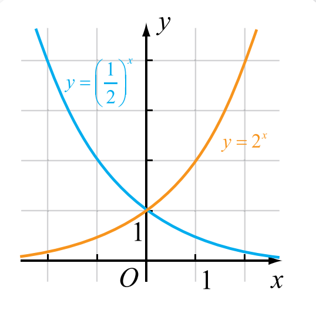
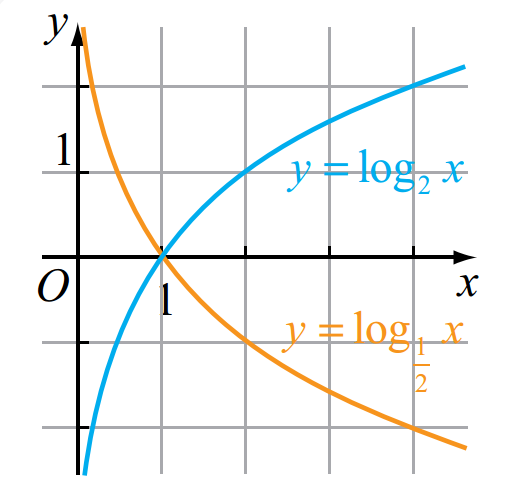
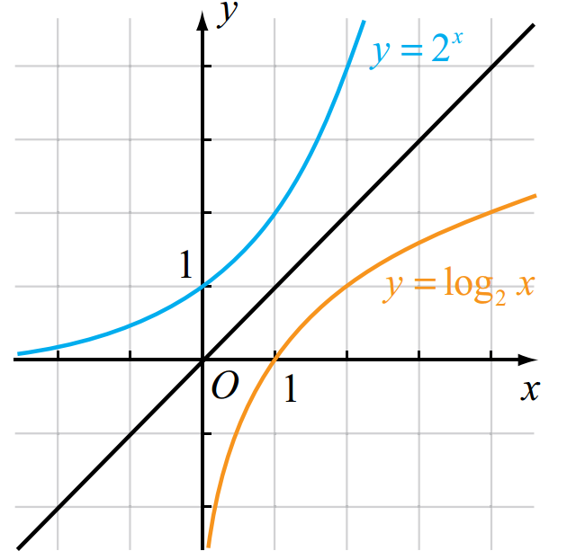
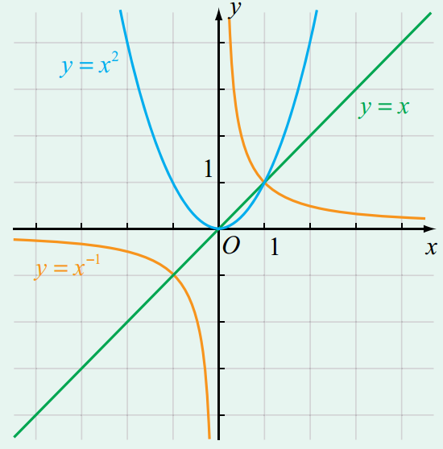

# 指数

**整数指数**

$a^1 = 1$

$a^m \cdot a^n = a^{m+n}$

$(a^m)^n = a^{mn}$

$\frac{a^m}{a^n} = a^{m-n} (m > n, a \neq 0)$

$(ab)^m = a^m b^m$

$a^0 = 1 (a \neq 0)$

$a^{-n} = \frac{1}{a^n} (a \neq 0, n \in N_+)$

**分数指数**

根式具有性质：

$$
(1) \ (\sqrt[n]{a})^n = a (n > 1, 且 n \in N_+)； 
$$

$$
(2) \ \sqrt[n]{a^n} = 
\begin{cases}
a, & 当n为奇数时 \\
|a|, & 当n为偶数时
\end{cases}
$$

$$
a^{\frac{1}{n}} = \sqrt[n]{a} (a > 0)；
$$

$$
a^{\frac{m}{n}} = (\sqrt[n]{a})^m = \sqrt[n]{a^m} (a > 0, n, m \in N_+, 且 \frac{m}{n}为既约分数)。
$$

$$
a^{- \frac{m}{n}} = \frac{1}{a^{\frac{m}{n}}} (a > 0, n, m \in N_+, 且 \frac{m}{n}为既约分数)。
$$

**有理指数幂**。设a>0，b>0，对任意有理数 $\alpha, \beta$，有理指数幂有如下三条运算法则：

- $a^{\alpha}a^{\beta} = a^{\alpha + \beta}$，
- $(a^{\alpha})^{\beta} = a^{\alpha \beta}$，
- $(ab)^{\alpha} = a^{\alpha}b^{\alpha}$。

# 指数函数

$y = a^x (a > 0, a \neq 1, x \in R)$

- 定义域是实数集R；
- 值域是 $(0, + \infty)$；
- 函数图像在x轴的上方且都通过点(0, 1)；
- 当a>1时，这个函数是增函数；当0<a<1时，这个函数是减函数。

指数函数图像：

# 对数

以a为底N的对数b记作 $b = \log_{a}{N} (a>0，且a \neq 1)$

$a^{\log_{a}{N}} = N$

对数 $\log_{a}{N} (a>0, 且a \neq 1)$具有下列性质：

- 0和负数没有对数，即N>0；
- 1的对数为0，即 $\log_{a}{1} = 0$；
- 底的对数等于1，即 $\log_{a}{a} = 1$。

**常用对数**： $\lg_{}{N}$。

对数运算法则：

- $\log_{a}{MN} = \log_{a}{M} + \log_{a}{N}$
- $\log_{a}{\frac{M}{N}} = \log{a}{M} - \log{a}{N}$
- $\log_{a}{M^a} = a \log_{a}{M}$

**换底公式**：

$$
\log_{b}{N} = \frac{\log_{a}{N}}{\log_{a}{b}}
$$

证明：

$$
\begin{align*}
& 设 \log_bN=x，则 & \\
&& b^x = N. \\
& 两边取以a为底的对数，得 & \\
&& x \log_ab=\log_aN. \\
& 所以 & x=\frac{\log_aN}{\log_ab}. \\
& 即 & \log_bN = \frac{\log_aN}{\log_ab}.
\end{align*}
$$

**自然对数**：以无理数e=2.71828...为底的对数。以e为底的对数叫做自然对数。 $\log_{e}{N}$通常记作 $\ln_{}{N}$。

# 其他

$$
a^x = (e^{\ln a})^x=e^{x \ln a} = e^{\ln a^x}
$$

# 对数函数

$y = \log_{a}{x} (a>0, a \neq 1, x > 0)$。

对数函数具有以下性质：

- 值域是实数集R；
- 在定义域内，当a>1时是增函数，当 0<a<1时是减函数；
- 图像都通过点(1, 0)。

# 指数函数与对数函数的关系

对数函数 $y = \log_{a}{x}$与指数函数 $y=a^x$互为反函数。它们的图像关于直线y=x对称。

指数函数和对数函数关系图像：

# 幂函数

$y=x^a (x \in R)$的函数称为幂函数，其中a为常数。

幂函数性质：

- 所有幂函数在 $(0, + \infty)$都有定义，并且图像都通过点(1, 1)；
- 如果a>0，则幂函数的图像通过原点，并且在区间 $[0, + \infty)$上是增函数；
- 如果a<0，则幂函数在区间 $(0, + \infty)$上是减函数，在第一象限内，当x从右边趋向于原点时，图像在y轴右方无限地逼近y轴，当x趋向于 $+ \infty$时，图像在x轴上方无限地逼近x轴。

幂函数图像：

