# 一、代数

## 1. 指数

$$
a^ma^n=a^{m+n}, \quad (ab)^m=a^mb^m, \quad (a^m)^n=a^{mn}, \quad a^{\frac{m}{n}}=\sqrt[n]{a^m}=(\sqrt[n]{a})^m
$$

如果 $a \neq 0$，那么 

$$
\frac{a^m}{a^n}=a^{m-n}, \quad a^0=1, \quad a^{-m}=\frac{1}{a^m}.
$$

## 2. 对数

$$
a^{\log_{a}{N}} = N, \quad \log_{a}{1} = 0, \quad \log_{a}{a} = 1, \quad a^x = (e^{\ln a})^x=e^{x \ln a} = e^{\ln a^x}
$$
- 对数运算法则：
	- $\log_{a}{MN} = \log_{a}{M} + \log_{a}{N}$
	- $\log_{a}{\frac{M}{N}} = \log{a}{M} - \log{a}{N}$
	- $\log_{a}{M^a} = a \log_{a}{M}$
- 换底公式：
	- $\log_{b}{N} = \frac{\log_{a}{N}}{\log_{a}{b}}$
- 常用对数： $\lg_{10}{N}$， $\lg N$
- 自然对数： $\log_{e}{N}$， $\ln N$

## 3. 零

除以零是没有定义的。

如果 $a \neq 0$，那么 $\frac{0}{a}=0, \quad a^0=1, \quad 0^a = 0$
对任何数a： $a \cdot 0 = 0 \cdot a = 0$

## 4. 分式

$$
\frac{a}{b}+\frac{c}{d}=\frac{ad+bc}{bd}, \quad \frac{a}{b} \cdot \frac{c}{d}=\frac{ac}{bd}, \quad \frac{a/b}{c/d}=\frac{a}{b} \cdot \frac{d}{c}, \quad \frac{-a}{b}=-\frac{a}{b}=\frac{a}{-b}
$$

## 5. 数列

- 等差数列：
	- 通项公式： $a_n = a_1 + (n - 1)d$
	- 前n项和公式： $S_n = \frac{n(a_1+a_n)}{2}$或 $S_n = na_1 + \frac{n(n-1)}{2}d$
- 等比数列：
	- 通项公式： $a_n = a_1q^{n-1}$
	- 前n项和公式： $S_n= \begin{cases} na_1, && (q=1) \\ \frac{a_1(1-q^n)}{1-q} && (q \neq 1) \end{cases}$

## 6. 排列组合

- 排列：
	- 排列数列公式： $A_n^m = n(n-1)(n-2) \cdots (n-m+1)$
	- 阶乘： $A_n^n = n! = n \cdot (n-1) \cdot (n-2) \cdot \ \cdots \ \cdot 3 \cdot 2 \cdot 1$
	- 排列数列公式变形： $A_n^m = \frac{n!}{(n-m)!}$
	- $0! = 1$
- 组合：
	- 组合的计算公式： $C_n^m = \frac{A_n^m}{A_m^m}=\frac{n!}{m!(n-m)!}$
	-  $C_n^n=1$
	- $C_n^0=1$
	-  $C_n^m = C_n^{n-m}$
	- $C_{n+1}^m = C_n^m + C_n^{m-1}$

## 7. 二项式定理

对任何正整数n，

$$
\begin{align*}
(a+b)^n=&a^n+na^{n-1}b+\frac{n(n-1)}{1 \cdot 2}a^{n-2}b^2+\frac{n(n-1)(n-2)}{1 \cdot 2 \cdot 3}a^{n-3}b^3+\cdots+nab^{n-1}+b^n \\
=& C_n^0a^n+C_n^1a^{n-1}b+C_n^2a^{n-2}b^2+ \cdots + C_n^ra^{n-r}b^r+ \cdots + C_n^nb^n (n \in N_+).
\end{align*}
$$

令 $a=1, b=x$得：

$$
(1+x)^n=1+C_n^1x+C_n^2x^2+ \cdots + C_n^rx^r + \cdots + C_n^nx^n
$$

令 $a=1, b=1$ 得： 
$$
2^n = C_n^0+C_n^1+C_n^2+ \cdots + c_n^n
$$
## 8. 整数幂的差

$n>1$， $a^n-b^n=(a-b)(a^{n-1}+a^{n-2}b+a^{n-3}b^2+\cdots+ab^{n-2}+b^{n-1})$

例如：

$$
\begin{align*}
& a^2-b^2 = (a-b)(a+b), \\
& a^3-b^3=(a-b)(a^2+ab+b^2), \\
& a^4-b^4=(a-b)(a^3+a^2b+ab^2+b^3)
\end{align*}
$$

## 9. 配（平）方

如果 $a \neq 0$，那么

$$
\begin{align*}
ax^2+bx+c=&a(x^2+\frac{b}{a}x)+c \\
=&a(x^2+\frac{b}{a}x+\frac{b^2}{4a^2}-\frac{b^2}{4a^2})+c \\
=&a(x^2+\frac{b}{a}x+\frac{b^2}{4a^2})+a(-\frac{b^2}{4a^2})+c \\
=&a\underbrace{(x^2+\frac{b}{a}x+\frac{b^2}{4a^2})}_{这是(x+\frac{b}{2a})^2}+\underbrace{c-\frac{b^2}{4a^2}}_{称这部分为C} \\
=&au^2+C \quad (u=x+(b/2a))
\end{align*}
$$

## 10. 二次公式

如果 $a \neq 0$，那么

$$
\begin{align*}
& ax^2+bx+c=0 \\
& x=\frac{-b \pm \sqrt{b^2-4ac}}{2a}.
\end{align*}
$$

# 二、几何

（A=面积，B=底面积，C=周长，S=侧面积或表面积，V=体积）

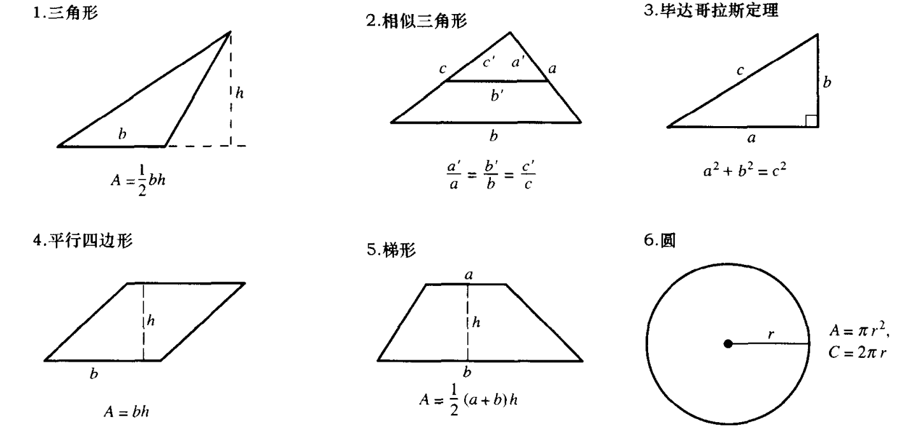
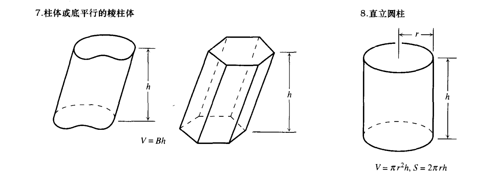
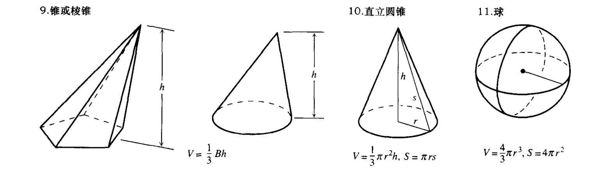

# 三、三角公式

## 1. 定义和基本恒等式

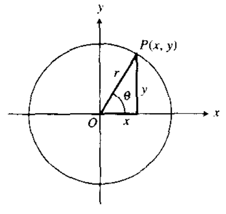

- 正弦： $\sin \theta = \frac{对边}{斜边}=\frac{y}{r}=\frac{1}{\csc \theta}$
- 余弦： $\cos \theta = \frac{邻边}{斜边}= \frac{x}{r}=\frac{1}{\sec \theta}$
- 正切： $\tan \theta = \frac{对边}{邻边}= \frac{y}{x}=\frac{\sin \theta}{\cos \theta}=\frac{1}{\cot \theta}$

| 三角函数\角   | $30^\circ$           | $45^\circ$           | $60^\circ$           |
| -------- | -------------------- | -------------------- | -------------------- |
| $\sin a$ | $\frac{1}{2}$        | $\frac{\sqrt{2}}{2}$ | $\frac{\sqrt{3}}{2}$ |
| $\cos a$ | $\frac{\sqrt{3}}{2}$ | $\frac{\sqrt{2}}{2}$ | $\frac{1}{2}$        |
| $\tan a$ | $\frac{\sqrt{3}}{3}$ | 1                    | $\sqrt{3}$           |

- 正割： $\sec \theta = \frac{1}{\cos \theta} = \frac{r}{x}$；
- 余割： $\csc \theta = \frac{1}{\sin \theta} = \frac{r}{y}$；
- 余切： $\cot \theta = \frac{1}{\tan \theta} = \frac{x}{y}$

## 2. 恒等式

- $\sin (-\theta)=-\sin \theta$
- $\cos (-\theta)=\cos \theta$
- $\sin^2 \theta+\cos^2 \theta=1$
- $\sec^2 \theta=1+\tan^2 \theta$
- $\csc^2 \theta=1+\cot^2 \theta$
- $\sin 2\theta=2\sin \theta \cos \theta$
- $\cos 2 \theta=\cos^2 \theta+\sin^2 \theta = 2\cos^2 \theta -1 = 1- 2\sin^2 \theta$
- $\tan 2 \theta = \frac{2 \tan \theta}{1-\tan^2 \theta}$
- $\cos^2 \theta=\frac{1+\cos 2 \theta}{2}$
- $\sin^2 \theta=\frac{1-\cos 2 \theta}{2}$
- $\sin(A+B)=\sin A \cos B + \cos A \sin B$
- $\sin (A-B)=\sin A \cos B-\cos A \sin B$
- $\cos(A+B)=\cos A \cos B-\sin A \sin B$
- $\cos (A-B)=\cos A \cos B+\sin A \sin B$
- $\tan (A+B)=\frac{\tan A+\tan B}{1-\tan A \tan B}$
- $\tan (A-B)=\frac{\tan A-\tan B}{1+\tan A \tan B}$
- $\sin(A-\frac{\pi}{2})=-\cos A$
- $\sin(A+\frac{\pi}{2})=\cos A$
- $\cos(A-\frac{\pi}{2})=\sin A$
- $\cos(A+\frac{\pi}{2})=-\sin A$
- $\sin A \sin B=\frac{1}{2}\cos(A-B)-\frac{1}{2}\cos(A+B)$
- $\cos A \cos B=\frac{1}{2}\cos (A-B)+\frac{1}{2}\cos (A+B)$
- $\sin A \cos B=\frac{1}{2}\sin (A-B)+\frac{1}{2} \sin(A+B)$
- $\sin A + \sin B=2\sin \frac{1}{2}(A+B)\cos \frac{1}{2}(A-B)$
- $\sin A - \sin B=2\cos \frac{1}{2}(A+B)\sin \frac{1}{2}(A-B)$
- $\cos A + \cos B=2\cos \frac{1}{2}(A+B)\cos \frac{1}{2}(A-B)$
- $\cos A - \cos B=-2\sin \frac{1}{2}(A+B)\sin \frac{1}{2}(A-B)$
- $\cos \frac{\theta}{2} = \pm \sqrt{\frac{1 + \cos \theta}{2}}$
- $\sin \frac{\theta}{2} = \pm \sqrt{\frac{1 - \cos \theta}{2}}$
- $\tan \frac{\theta}{2} = \pm \sqrt{\frac{1 - \cos \theta}{1 + \cos \theta}}$

## 3. 诱导公式

- $\cos(\alpha + k \cdot 2 \pi) = \cos \alpha$
- $\sin(\alpha + k \cdot 2 \pi) = \sin \alpha$
- $\tan(\alpha + k \cdot 2 \pi) = \tan \alpha$
- $\cos (- \alpha) = \cos \alpha$
- $\sin (- \alpha) = - \sin \alpha$
- $\tan (- \alpha) = - \tan \alpha$
- $\cos [\alpha + (2k + 1) \pi] = -\cos \alpha$
- $\sin [\alpha + (2k + 1) \pi] = - \sin \alpha$
- $\tan [\alpha + (2k + 1) \pi] = \tan \alpha$
-  $\sin (\pi - \alpha) = \sin \alpha$
- $\cos (\pi - \alpha) = - \cos \alpha$
- $\cos (\alpha + \frac{\pi}{2}) = - \sin \alpha$
- $\sin (\alpha + \frac{\pi}{2}) = \cos \alpha$
- $\cos (- \alpha + \frac{\pi}{2}) = \sin \alpha$
- $\sin (- \alpha + \frac{\pi}{2}) = \cos \alpha$
- $\tan (\alpha + \frac{\pi}{2}) = - \cot \alpha$
- $\cot (\alpha + \frac{\pi}{2}) = - \tan \alpha$
- $\tan (- \alpha + \frac{\pi}{2}) = \cot \alpha$
- $\cot (-\alpha + \frac{\pi}{2}) = \tan \alpha$

## 4. 解三角形

- 正弦定理：在一个三角形中，各边的长和它所对角的正弦的比相等，即： $\frac{a}{\sin A}= \frac{b}{\sin B}=\frac{c}{\sin C}$。
- 余弦定理：三角形任何一边的平方等与其他两边的平方和减去这两边与它们夹角的余弦的积的两倍，即：
	- $c^2 = a^2 + b^2 - 2ac \cos C$
	- $b^2 = a^2 + c^2 - 2ac \cos B$
	- $a^2 = b^2 + c^2 - 2bc \cos A$
	- $\cos A = \frac{b^2 + c^2 - a^2}{2bc}$
	- $\cos B = \frac{a^2 + c^2 - b^2}{2cz}$
	- $\cos C = \frac{a^2 + b^2 - c^2}{2ab}$

# 四、三角函数

## 1. 弧度度量

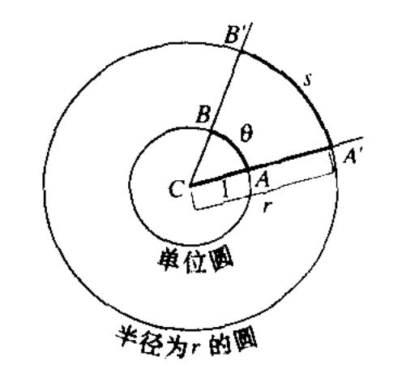

$\frac{s}{r}=\frac{\theta}{1}=\theta$或 $\theta=\frac{s}{r}$，$180^{\circ}=\pi 弧度$， $360^\circ=2 \pi 弧度$

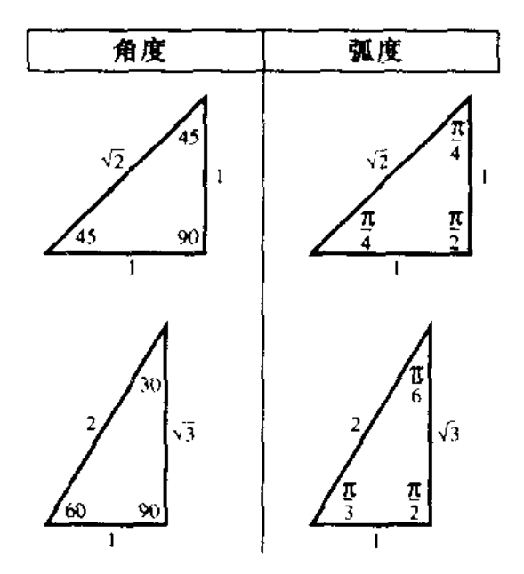

用角度和弧度表示的两个同样的三角形的角。

| 度           | 弧度                |
| ----------- | ----------------- |
| $0^\circ$   | 0                 |
| $30^\circ$  | $\frac{\pi}{6}$   |
| $45^\circ$  | $\frac{\pi}{4}$   |
| $60^\circ$  | $\frac{\pi}{3}$   |
| $90^\circ$  | $\frac{\pi}{2}$   |
| $120^\circ$ | $\frac{2}{3} \pi$ |
| $135^\circ$ | $\frac{3}{4} \pi$ |
| $150^\circ$ | $\frac{5}{6} \pi$ |
| $180^\circ$ | $\pi$             |
| $225^\circ$ | $\frac{5}{4} \pi$ |
| $270^\circ$ | $\frac{3}{2} \pi$ |
| $315^\circ$ | $\frac{7}{4} \pi$ |
| $360^\circ$ | $2 \ \pi$         |

## 2. 三角函数的图形

### 正弦函数

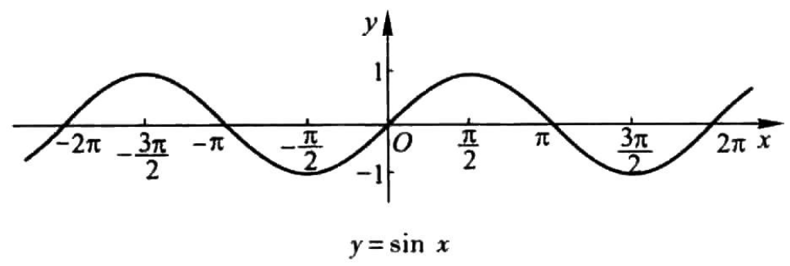

- 定义域： $x \in R$或 $(-\infty,+\infty)$
- 值域： $[-1,1]$
- 最大值：当且仅当 $x=2k \pi + \frac{\pi}{2} (k \in Z)$时，取最大值1
- 最小值：当且仅当 $x=2k \pi - \frac{\pi}{2} (k \in Z)$（或 $x=2k \pi + \frac{3 \pi}{2} (k \in Z)$）时，取最小值-1
- 周期：由诱导公式 $\sin(x+2k \pi) = \sin x (k \in Z)$，得周期为 $2k \pi (k \in Z, 且 k \neq 0)$
- 最小正周期： $2 \pi$
- 奇偶性：由诱导公式 $\sin(-x)=- \sin x$，奇函数，关于原点对称
- 单调性：
	- 在闭区间 $[- \frac{\pi}{2}+2k \pi, \frac{\pi}{2}+2k \pi] (k \in Z)$上，从-1增大到1，增函数
	- 在闭区间 $[\frac{\pi}{2}+2k \pi, \frac{3 \pi}{2}+2k \pi] (k \in Z)$上，从1减小到-1，减函数
- 零点： $k \pi (k \in Z)$
- 正弦曲线：
	- 轴对称图形，对称轴为 $x=\frac{\pi}{2}+k \pi (k \in Z)$
	- 中心对称图形，对称中心为 $(k \pi, 0) (k \in Z)$

### 正弦型函数

**正弦型函数  $y = A \sin x$**：

- 正弦型函数： $y = A \sin x (A \neq 0)$
- 定义域： $x \in R$
- 值域： $[-|A|, |A|]$
- 最大值： $|A|$
- 最小值： $-|A|$
- 周期： $2 \pi$
- 频率： $f = \frac{1}{T} = \frac{1}{2 \pi}$
- 振幅： $|A|$
- 初相： 0
- 图像： 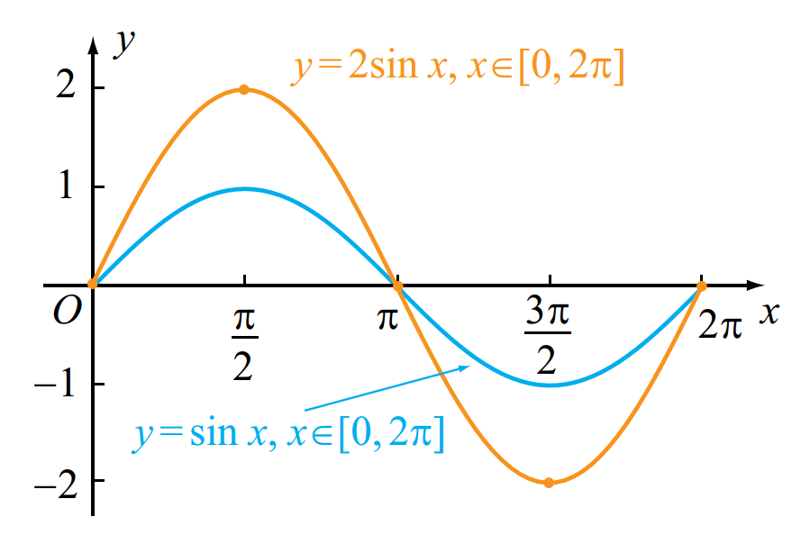

**正弦型函数 $y= \sin(x+ \phi)$**：

- 正弦型函数： $y = \sin (x + \phi)$
- 定义域： $x \in R$
- 值域： $[-1, 1]$
- 最大值： 1
- 最小值： -1
- 周期： $2 \pi$
- 频率： $f = \frac{1}{T} = \frac{1}{2 \pi}$
- 振幅： 1
- 初相： $\phi$
- 图像： 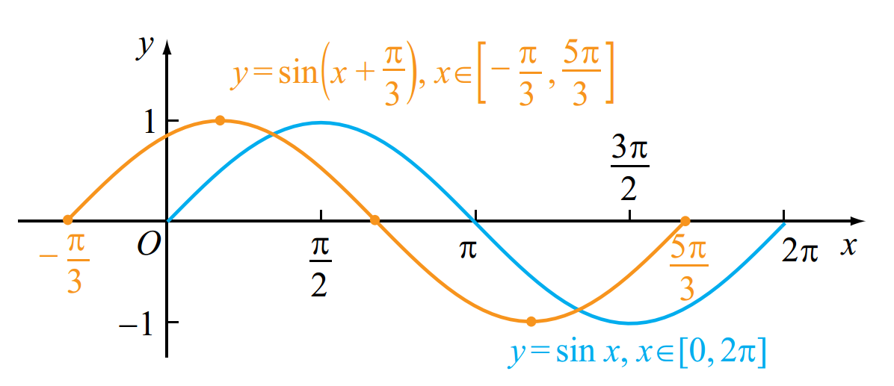

**正弦型函数 $y= \sin \omega x$**：

- 正弦型函数： $y = \sin \omega x$，其中 $\omega > 0且 \omega \neq 1$
- 定义域： $x \in R$
- 值域： $[-1, 1]$
- 最大值： 1
- 最小值： -1
- 周期： $T = \frac{2 \pi}{|\omega|}$
- 频率： $f = \frac{1}{T} = \frac{|\omega|}{2 \pi}$
- 振幅： 1
- 初相： 0
- 图像： 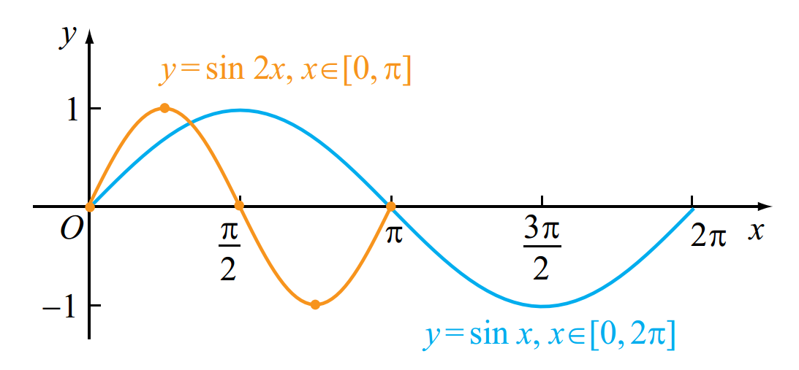

**正弦型函数 $y = A \sin(\omega x + \phi)$**：

- 正弦型函数： $y = A \sin(\omega x + \phi)$，其中 $A, \omega, \phi$都是常数，且 $A \neq 0, \omega \neq 0$
- 定义域： $x \in R$
- 值域： $[-|A|, |A|]$
- 最大值： $|A|$
- 最小值： $-|A|$
- 周期： $T = \frac{2 \pi}{|\omega|}$
- 频率： $f = \frac{1}{T} = \frac{|\omega|}{2 \pi}$
- 振幅： $|A|$
- 初相： $\phi$
- 图像：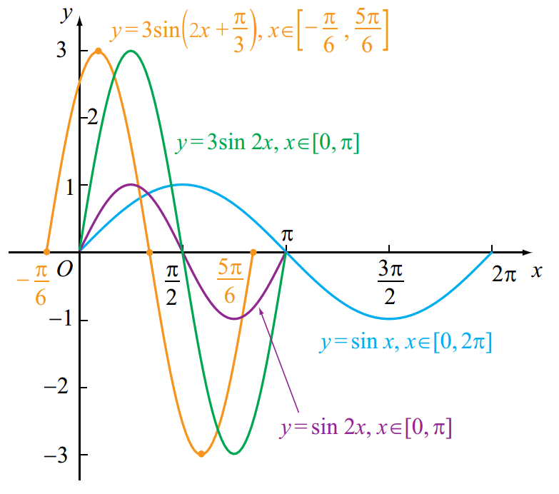

### 余弦函数

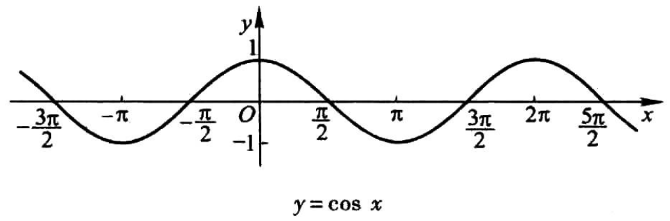

- 定义域： $x \in R$或 $(-\infty,+\infty)$
- 值域： $[-1,1]$
- 最大值：当且仅当 $x=2k \pi (k \in Z)$时，取最大值1
- 最小值：当且仅当 $x=2k \pi + \pi (k \in Z)$时，取最小值-1
- 周期：由诱导公式 $\cos(x+2k \pi) = \cos x (k \in Z)$，得周期为 $2k \pi (k \in Z, 且 k \neq 0)$
- 最小正周期： $2 \pi$
- 奇偶性：由诱导公式 $\cos(-x)= \cos x$，偶函数，关于y轴对称
- 单调性：
	- 在闭区间 $[2k \pi, 2k \pi+ \pi] (k \in Z)$上，从1减小到-1，减函数
	- 在闭区间 $[2k \pi + \pi, 2k \pi + 2 \pi] (k \in Z)$上，从-1增大到1，增函数
- 零点： $\frac{\pi}{2} + k \pi (k \in Z)$
- 余弦曲线：
	- 轴对称图形，对称轴为 $x=k \pi (k \in Z)$
	- 中心对称图形，对称中心为 $(\frac{\pi}{2} + k \pi, 0) (k \in Z)$

### 正切函数

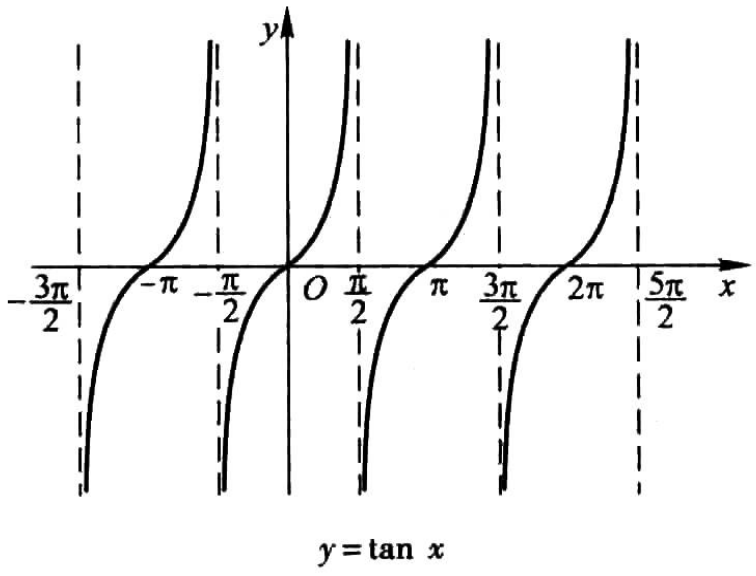

- 定义域：除 $\frac{\pi}{2}$的奇整数倍数外的所有实数（或 $\{x|x \neq k \pi + \frac{\pi}{2}, k \in Z\}$）
- 值域： $R$或 $(\infty,+\infty)$
- 最大值：趋向于正无穷大，无最大值
- 最小值：趋向于负无穷大，无最小值
- 周期：由诱导公式 $\tan(x+ \pi) = \tan x (x \in R, 且 x \neq k \pi + \frac{\pi}{2}, k \in Z)$，得周期为 $\pi$
- 最小正周期： $\pi$
- 奇偶性：由诱导公式 $\tan(-x)= - \tan x$，奇函数，关于原点对称
- 单调性：
	- 在开区间 $(- \frac{\pi}{2} + k \pi, \frac{\pi}{2} + k \pi) (k \in Z)$内都是增函数
- 零点： $k \pi (k \in Z)$
- 正切曲线：
	- 中心对称图形，对称中心为 $(\frac{k\pi}{2}, 0) (k \in Z)$

### 余切函数

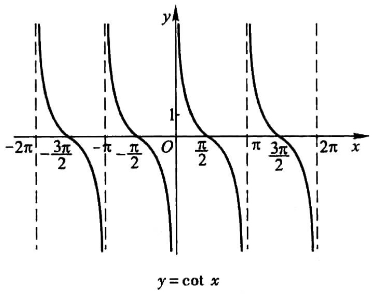

- 定义域： $x \neq 0, \pm \pi, \pm 2\pi, \cdots$
- 值域： $(-\infty,+\infty)$

### 正割函数

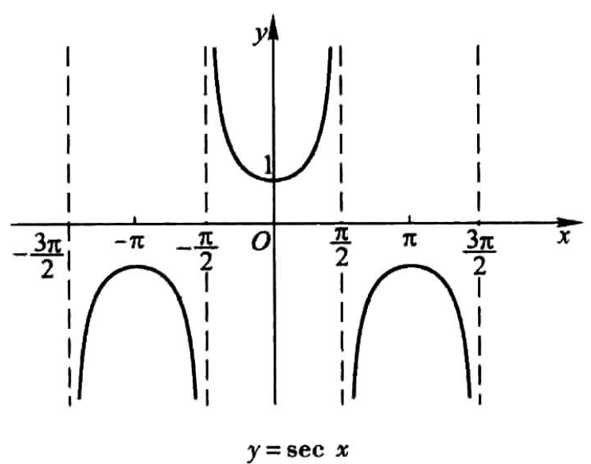

- 定义域： $x \neq \pm \frac{\pi}{2}, \pm \frac{3\pi}{2}, \cdots$
- 值域： $(-\infty, -1] \cup [1, +\infty)$

### 余割函数

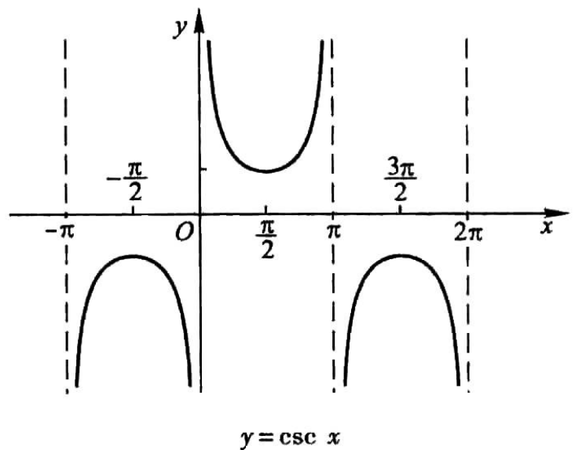

- 定义域： $x \neq 0, \pm \pi, \pm 2\pi, \cdots$
- 值域： $(-\infty, -1] \cup [1, +\infty)$

## 3. 反三角函数的图形

### 反正弦函数

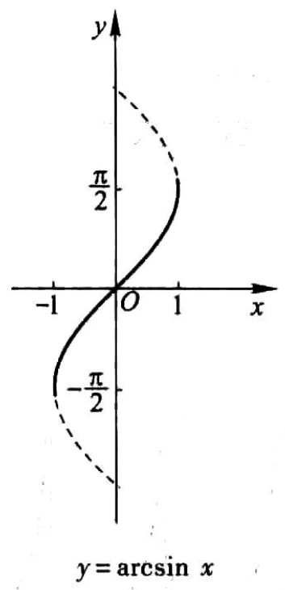

### 反余弦函数

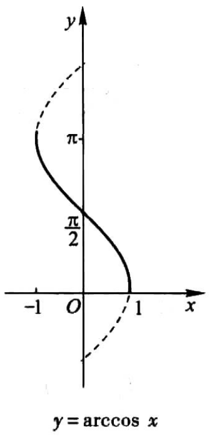

### 反正切函数

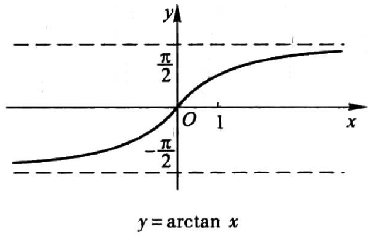

### 反余切函数

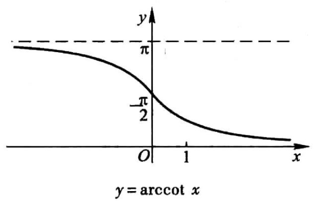

# 五、幂函数的图形

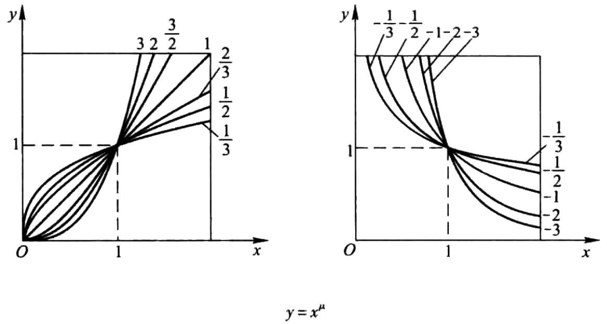

$y=x^a (x \in R)$

- 所有幂函数在 $(0, + \infty)$都有定义，并且图像都通过点 $(1, 1)$；
- 如果 $a>0$，则幂函数的图像通过原点，并且在区间 $[0, + \infty)$上是增函数；
- 如果 $a<0$，则幂函数在区间 $(0, + \infty)$上是减函数，在第一象限内，当 $x$从右边趋向于原点时，图像在 $y$轴右方无限地逼近 $y$轴，当 $x$趋向于 $+ \infty$时，图像在 $x$轴上方无限地逼近 $x$轴。
# 六、指数函数的图形

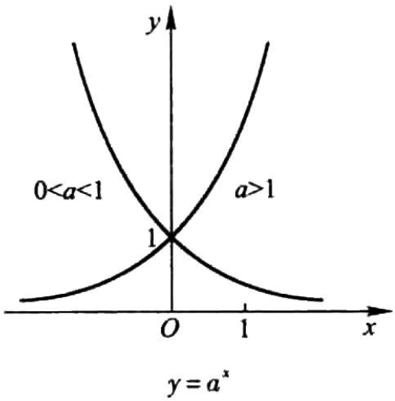

$y = a^x (a > 0, a \neq 1, x \in R)$

- 定义域是实数集 $R$；
- 值域是 $(0, + \infty)$；
- 函数图像在 $x$轴的上方且都通过点 $(0, 1)$；
- 当 $a>1$时，这个函数是增函数；当 $0<a<1$时，这个函数是减函数。
# 七、对数函数的图形

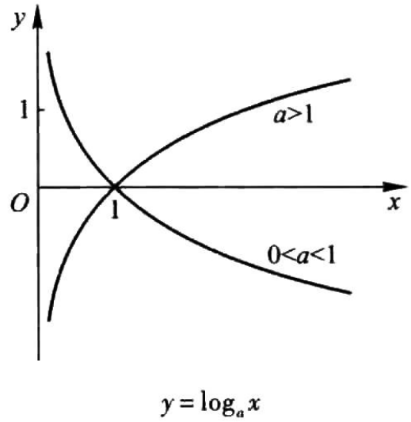

$y = \log_{a}{x} (a>0, a \neq 1, x > 0)$。

- 值域是实数集 $R$；
- 在定义域内，当 $a>1$时是增函数，当 $0<a<1$时是减函数；
- 图像都通过点 $(1, 0)$。

# 八、指数函数与对数函数的关系

对数函数 $y = \log_{a}{x}$与指数函数 $y=a^x$互为反函数。它们的图像关于直线 $y=x$对称。

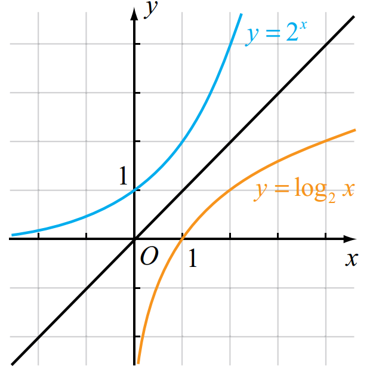