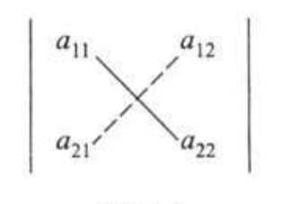
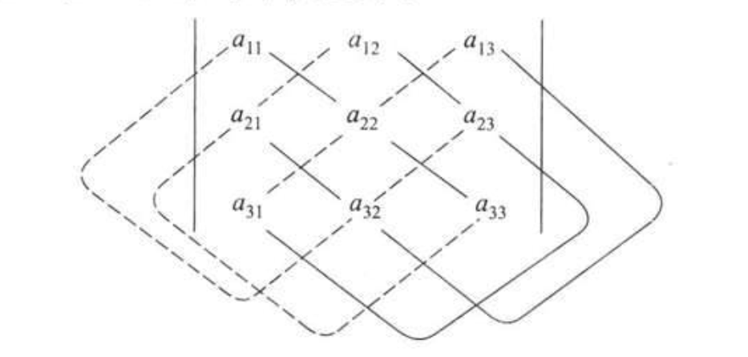

# 第1章 行列式

## 1 二阶与三阶行列式

### 一、二元线性方程组与二阶行列式

用消元法解二元线性方程组：

$$
\begin{cases}
a_{11}x_1+a_{12}x_2=b_1 \\
a_{21}x_1+a_{22}x_2=b_2
\end{cases}
$$

当 $a_{11}a_{22}-a_{12}a_{21} \neq 0$时，求得方程组的解为：

$$
x_1=\frac{b_1a_{22}-a_{12}b_2}{a_{11}a_{22}-a_{12}a_{21}}
$$

$$
x_2=\frac{a_{11}b_2-b_1a_{21}}{a_{11}a_{22}-a_{12}a_{21}}
$$
方程组的解 $x1, x_2$中的分子、分母都是四个数分两对相乘再相减而得，其中分母 $a_{11}a_{22}-a_{12}a_{21}$是由方程组的四个系数确定的，把这四个数按它们在方程组中的位置，排列成二行二列（横排称行、竖排称列）的数表：

$$
\begin{matrix}
a_{11} & a_{12} \\
a_{21} & a_{22}
\end{matrix}
$$

表达式 $a_{11}a_{22}-a_{12}a_{21}$称为数表所确定的二阶行列式，并记作：

$$
\begin{vmatrix}
a_{11} & a_{12} \\
a_{21} & a_{22}
\end{vmatrix}
$$
其中：

- 数 $a_{ij}(i=1,2; j=1,2)$称为行列式的元素或元。
- 元素 $a_{ij}$的第一个下标 $i$称为行标，表明该元素位于第 $i$行；
- 第二个下标 $j$称为列标，表明该元素位于第 $j$列。
- 位于第 $i$行第 $j$列的元素称为行列式的 $(i,j)$元。

图1.1：

上述二阶行列式的定义，可用对角线法则来记忆。参看图1.1，把 $a_{11}$到 $a_{22}$的实连线称为主对角线， $a_{12}$到 $a_{21}$的虚连线称为副对角线，于是二阶行列式便是主对角线上的两元素之积减去副对角线上两元素之积所得的差。

利用二级行列式的概念，方程组的解 $x_1,x_2$的分子也可以写成二阶行列式，即：

$$
b_1a_{22}-a_{12}b_2= \begin{vmatrix}
b_{1} & a_{12} \\
b_{2} & a_{22}
\end{vmatrix}
$$

$$
a_{11}b_2-b_1a_{21}= \begin{vmatrix}
a_{11} & b_{1} \\
a_{21} & b_{2}
\end{vmatrix}
$$

若记：

$$
D=\begin{vmatrix}
a_{11} & a_{12} \\
a_{21} & a_{22}
\end{vmatrix}
$$

$$
D_1= \begin{vmatrix}
b_{1} & a_{12} \\
b_{2} & a_{22}
\end{vmatrix}
$$

$$
D_2= \begin{vmatrix}
a_{11} & b_{1} \\
a_{21} & b_{2}
\end{vmatrix}
$$
那么方程组的解可以写成：

$$
x_1=\frac{D_1}{D}=\frac
{
\begin{vmatrix}
b_{1} & a_{12} \\
b_{2} & a_{22}
\end{vmatrix}
}

{
\begin{vmatrix}
a_{11} & a_{12} \\
a_{21} & a_{22}
\end{vmatrix}
}
$$
$$
x_1=\frac{D_2}{D}=\frac
{
\begin{vmatrix}
a_{11} & b_{1} \\
a_{21} & b_{2}
\end{vmatrix}
}

{
\begin{vmatrix}
a_{11} & a_{12} \\
a_{21} & a_{22}
\end{vmatrix}
}
$$
注意：

- 这里的分母D是由方程组的系数所确定的二阶行列式（称系数行列式），
- $x_1$的分子 $D_1$是用常数项 $b_1, b_2$替换D中第1列的元素 $a_{11},a_{21}$所得的二阶行列式，
- $x_2$的分子 $D_2$是用常数项 $b_1,b_2$替换D中第2列的元素 $a_{12},a_{22}$所得的二阶行列式。

### 二、三阶行列式

**定义1** 设有9个数排成3行3列的数表：

$$
\begin{matrix}
a_{11} & a_{12} & a_{13} \\
a_{21} & a_{22} & a_{23} \\
a_{31} & a_{32} & a_{33}
\end{matrix}
$$

记：

$$
\begin{align*}
&
\begin{vmatrix}
a_{11} & a_{12} & a_{13} \\
a_{21} & a_{22} & a_{23} \\
a_{31} & a_{32} & a_{33}
\end{vmatrix}

\\
= & a_{11}a_{22}a_{33}+a_{12}a_{23}a_{31}+a_{13}a_{21}a_{32}-a_{11}a_{23}a_{32}-a_{12}a_{21}a_{33}-a_{13}a_{22}a_{31}
\end{align*}
$$

式为数表所确定的三阶行列式。

上述定义表明三阶行列式含6项，每项均为不同行不同列的三个元素的乘积再冠以正负号，其规律遵循图1.2所示的对角线法则：

- 图中有三条实现看作是平行于主对角线的连线，
- 三条虚线看作是平行于副对角线的连线，
- 实线上三元素的乘积冠以正号，
- 虚线上三元素的乘积冠以负号。

图1.2：

对角线法则只适用于二阶与三阶行列式。

## 2 全排列和对换

### 一、排列及其逆序数

把 $n$个不同的元素排成一列，叫做这 $n$个元素的全排列（也简称排列）。

n个不同元素的所有排列的种数，通常用 $P_n$表示，可计算如下：

- 从n个元素中任取一个放在第一个位置上，有n种取法；
- 从剩下的 $n-1$个元素中任取一个放在第二个位置上，有 $n-1$种取法；
- 这样继续下去，直到最后只剩下一个元素放在第n个位置上，只有1种取法。

于是， $P_n=n \cdot (n-1) \cdot \ \cdots \ \cdot 3 \cdot 2 \cdot 1 = n!$。

- 对于n个不同的元素，先规定各元素之间有一个标准次序，于是在这n个元素的任一排列中，当某一对元素的先后次序与标准次序不同时，就说它构成1个逆序。
- 一个排列中所有逆序的总数叫做这个排列的逆序数。
- 逆序数为奇数的排列叫做奇排列，
- 逆序数为偶数的排序叫做偶排列。

计算排列的逆序数的方法：

设n个元素为1至n这n个自然数，并规定由小到大为标准次序。设 $p_1p_2 \cdots p_n$为这n个自然数的一个排列，考虑元素 $p_i(i=1,2,\cdots,n)$，如果比 $p_i$大的且排在 $p_i$前面的元素有 $t_i$个，就说 $p_i$这个元素的逆序数是 $t_i$。全体元素的逆序数之总和 $t=t_1+t_2+\cdots +t_n=\sum \limits_{i=1}^nt_i$即是这个排列的逆序数。

### 二、对换

在排列中，将任意两个元素对调，其余的元素不动，这种作出新排列的手续叫做对换。将相邻两个元素对换，叫做相邻对换。

**定理1** 一个排列中的任意两个元素对换，排列改变奇偶性。

**推论** 奇排列对换成标准排列的对换次数为奇数，偶排列对换成标准排列的对换次数为偶数。

## 3 n阶行列式的定义

**定义2** 设有 $n^2$个数，排成n行n列的数表：

$$
\begin{matrix}
a_{11} & a_{12} & \cdots & a_{1n} \\
a_{21} & a_{22} & \cdots &a_{2n} \\
& \cdots \cdots \cdots \cdots \\
a_{n1} & a_{n2} & \cdots &a_{nn}
\end{matrix}
$$

作出表中位于不同行不同列的n个数的乘积，并冠以符号 $(-1)^t$，得到形如 $(-1)^ta_{1p_1}a_{2p_2} \cdots a_{np_n}$的项，其中 $p_1p_2 \cdots p_n$为自然数 $1,2,\cdots ,n$的一个排列，t为这个排列的逆序数。由于这样的排列共有 $n!$个，因而形如 $(-1)^ta_{1p_1}a_{2p_2} \cdots a_{np_n}$式的项共有 $n!$项。所有这 $n!$项的代数和 $\sum (-1)^ta_{1p_1}a_{2p_2} \cdots a_{np_n}$称为n阶行列式，记作：

$$
D=
\begin{vmatrix}
a_{11} & a_{12} & \cdots & a_{1n} \\
a_{21} & a_{22} & \cdots &a_{2n} \\
\vdots & \vdots &  & \vdots \\
a_{n1} & a_{n2} & \cdots &a_{nn}
\end{vmatrix}
$$
简记作 $\det(a_{ij})$，其中数 $a{ij}$为行列式D的 $(i,j)$元。

- 主对角线以下（上）的元素都为0的行列式叫做上（下）三角形行列式；
- 特别，主对角线以下和以上的元素都为0的行列式叫做对角行列式。

下三角行列式：

$$
D=
\begin{vmatrix}
a_{11} & & & \\
a_{21} & a_{22} & & 0 \\
\vdots & \vdots & \ddots & \vdots \\
a_{n1} & a_{n2} & \cdots &a_{nn}
\end{vmatrix}
=a_{11}a_{22} \cdots a_{nn}
$$

对角行列式：

$$
D=
\begin{vmatrix}
\lambda_{1} & & & \\
 & \lambda_{2} & & \\
 & & \ddots & \\
 & & & \lambda_{n}
\end{vmatrix}
=\lambda_1 \lambda_2 \cdots \lambda_n
$$

## 4 行列式的性质

记：

$$
D=
\begin{vmatrix}
a_{11} & a_{12} & \cdots & a_{1n} \\
a_{21} & a_{22} & \cdots &a_{2n} \\
\vdots & \vdots &  & \vdots \\
a_{n1} & a_{n2} & \cdots &a_{nn}
\end{vmatrix}
$$

$$
D^T=
\begin{vmatrix}
a_{11} & a_{21} & \cdots & a_{n1} \\
a_{12} & a_{22} & \cdots &a_{n2} \\
\vdots & \vdots &  & \vdots \\
a_{1n} & a_{2n} & \cdots &a_{nn}
\end{vmatrix}
$$

行列式 $D^T$称为行列式D的转置行列式。

**性质1** 行列式与它的转置行列式相等。

由此性质可知，行列式中的行与列具有同等的地位，行列式的性质凡是对行成立的对列也同样成立，反之亦然。

**性质2** 对换行列式的两行（列），行列式变号。

以 $r_i$表示行列式的第i行，以 $c_i$表示行列式的第i列：

- 对换i，j两行记作 $r_i \leftrightarrow r_j$，
- 对换i，j两列记作 $c_i \leftrightarrow c_j$。

**推论** 如果行列式有两行（列）完全相同，则此行列式等于零。

**性质3** 行列式的某一行（列）中所有的元素都乘同一数k，等于用数k乘此行列式。

第i行（或列）乘k，记作 $r_i \times k$（或 $c_i \times k$）。

**推论** 行列式中某一行（列）的所有元素的公因子可以提到行列式记号的外面。

第i行（或列）提出公因子k，记作 $r_i \div k$（或 $c_i \div k$），有：

$$
\begin{vmatrix}
a_{11} & a_{12} & \cdots & a_{1n} \\
\vdots & \vdots &  & \vdots \\
ka_{i1} & ka_{i2} & \cdots & ka_{in} \\
\vdots & \vdots &  & \vdots \\
a_{n1} & a_{n2} & \cdots & a_{nn}
\end{vmatrix}

\overset{r_j \div k}{=} k

\begin{vmatrix}
a_{11} & a_{12} & \cdots & a_{1n} \\
\vdots & \vdots &  & \vdots \\
a_{i1} & a_{i2} & \cdots & a_{in} \\
\vdots & \vdots &  & \vdots \\
a_{n1} & a_{n2} & \cdots & a_{nn}
\end{vmatrix}
$$

**性质4** 行列式中如果有两行（列）元素成比例，则此行列式等于零。

**性质5** 若行列式的某一行（列）的元素都是两数之和，例如第i行的元素都是两数之和：

$$
D=\begin{vmatrix}
a_{11} & a_{12} & \cdots & a_{1n} \\
\vdots & \vdots &  & \vdots \\
a_{i1}+a_{i1}^{\prime} & a_{i2}+a_{i2}^{\prime} & \cdots & a_{in}+a_{in}^{\prime} \\
\vdots & \vdots &  & \vdots \\
a_{n1} & a_{n2} & \cdots & a_{nn}
\end{vmatrix}
$$

则D等于下列两个行列式之和：

$$
D=\begin{vmatrix}
a_{11} & a_{12} & \cdots & a_{1n} \\
\vdots & \vdots &  & \vdots \\
a_{i1} & a_{i2} & \cdots & a_{in} \\
\vdots & \vdots &  & \vdots \\
a_{n1} & a_{n2} & \cdots & a_{nn}
\end{vmatrix}

+

\begin{vmatrix}
a_{11} & a_{12} & \cdots & a_{1n} \\
\vdots & \vdots &  & \vdots \\
a_{i1}^{\prime} & a_{i2}^{\prime} & \cdots & a_{in}^{\prime} \\
\vdots & \vdots &  & \vdots \\
a_{n1} & a_{n2} & \cdots & a_{nn}
\end{vmatrix}
$$

**性质6** 把行列式的某一行（列）的各元素乘同一数然后加到另一行（列）对应的元素上去，行列式不变。

例如以数k乘第i行加到第j行上（记作 $r_j+kr_i$），有：

$$
\begin{vmatrix}
a_{11} & a_{12} & \cdots & a_{1n} \\
\vdots & \vdots &  & \vdots \\
a_{i1} & a_{i2} & \cdots & a_{in} \\
\vdots & \vdots &  & \vdots \\
a_{j1} & a_{j2} & \cdots & a_{jn} \\
\vdots & \vdots &  & \vdots \\
a_{n1} & a_{n2} & \cdots & a_{nn}
\end{vmatrix}

\overset{r_j+kr_i}{=}

\begin{vmatrix}
a_{11} & a_{12} & \cdots & a_{1n} \\
\vdots & \vdots &  & \vdots \\
a_{i1} & a_{i2} & \cdots & a_{in} \\
\vdots & \vdots &  & \vdots \\
a_{j1}+ka_{i1} & a_{j2}+ka_{i2} & \cdots & a_{jn}+ka_{in} \\
\vdots & \vdots &  & \vdots \\
a_{n1} & a_{n2} & \cdots & a_{nn}
\end{vmatrix}

(i \neq j).
$$

以数k乘第i列加到第j列上，记作 $c_j+kc_i$。

性质5表明：当某一行（或列）的元素为两数之和时，行列式关于该行（或列）可分解为两个行列式。若n阶行列式每个元素都表示成两数之和，则它可分解成 $2^n$个行列式。

## 5 行列式按行（列）展开

在n阶行列式中，把 $(i,j)$元 $a_{ij}$所在的第i行和第j列划去后，留下来的 $n-1$阶行列式叫做 $(i,j)$元 $a_{ij}$的余子式，记作 $M_{ij}$；记 $A_{ij}=(-1)^{i+j}M_{ij}$， $A_{ij}$叫做 $(i,j)$元 $a_{ij}$的代数余子式。

**引理** 一个n阶行列式，如果其中第i行所有元素除 $(i,j)$元 $a_{ij}$外都为零，那么这行列式等于 $a_{ij}$与它的代数余子式的乘积，即 $D=a_{ij}A_{ij}$。

**定理2** 行列式等于它的任一行（列）的各元素与其对应的代数余子式乘积之和，即 $D=a_{i1}A_{i1}+a_{i2}A_{i2}+\cdots+a_{in}A_{in}(i=1,2,\cdots,n)$或 $D=a_{1j}A_{1j}+a_{2j}A_{2j}+\cdots+a_{nj}A_{nj}(j=1,2,\cdots,n)$。

这个定理叫做行列式按行（列）展开法则。

**推论** 行列式某一行（列）的元素与另一行（列）的对应元素的代数余子式乘积之和等于零。即 $a_{i1}A_{j1}+a_{i2}A_{j2}+\cdots+a_{in}A_{jn}=0, i \neq j$或 $a_{1i}A_{1j}+a_{2i}A_{2j}+\cdots+a_{ni}A_{nj}=0, i \neq j$。

代数余子式的重要性质：

$$
\sum \limits_{k=1}^n a_{ki}A_{kj}=
\begin{cases}
D, &当i=j, \\
0, &当i \neq j
\end{cases}
$$

或 

$$
\sum \limits_{k=1}^n a_{ik}A_{jk}=
\begin{cases}
D, &当i=j, \\
0, &当i \neq j
\end{cases}
$$

# 第2章 矩阵及其运算

## 1 线性方程组和矩阵

### 一、线性方程组

