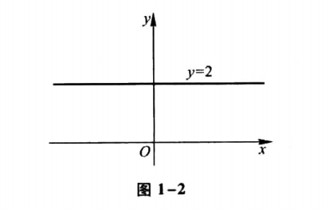
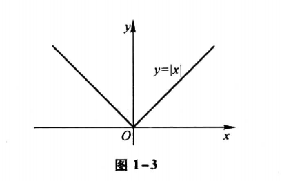
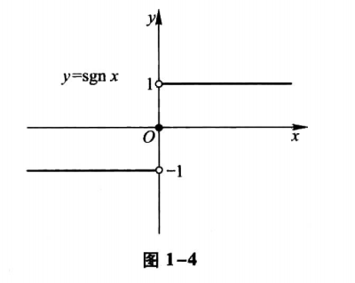
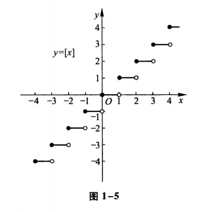
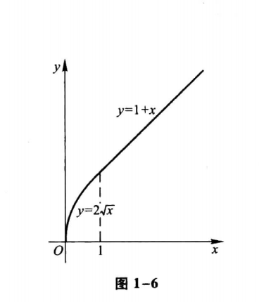

# 第一章 函数与极限

## 第一节 映射与函数

### 一、映射

#### 1. 映射概念

**例1** 设 $f:R \to R$，对每个 $x \in R, f(x) = x^2$。显然：

- f是一个映射，
- f的定义域 $D_f=R$，
- 值域 $R_f = \{y|y \geq 0\}$，它是R的一个真子集。
- 对于 $R_f$中的元素y，除y=0外，它的原像不是唯一的。如y=4的原像就有x=2和x=-2两个。
- f不是单射，
- f不是满射。
- 没有逆映射。

**例2** 设 $X=\{(x,y)|x^2+y^2=1\}, Y=\{(x,0) \ | \ |x| \leq 1\}, f:X \to Y$，对每个 $(x,y) \in X$，有唯一确定的 $(x, 0) \in Y$与之对应。显然：

- f是一个映射，
- f的定义域 $D_f=X$，
- 值域 $R_f=Y$。
- 在几何上，这个映射表示将平面上一个圆心在原点的单位圆周上的投影到x轴的区间[-1,1]上。
- f不是单射，
- f是满射。
- 没有逆映射。

**例3** 设 $f:[-\frac{\pi}{2}, \frac{\pi}{2}] \to [-1,1]$，对每个 $x \in [-\frac{\pi}{2},\frac{\pi}{2}], f(x)=\sin x$。

- f是一个映射，
- 定义域 $D_f=[-\frac{\pi}{2},\frac{\pi}{2}]$，
- 值域 $R_f=[-1,1]$。
- f是单射，
- f是满射，
- f为一一映射。
- 有逆映射。这个逆映射是反正弦函数的主值 $f^{-1}(x) = \arcsin x, x \in [-1,1]$，定义域 $D_{f^{-1}}=[-1,1]$，值域 $R_{f^{-1}}=[-\frac{\pi}{2},\frac{\pi}{2}]$。
#### 2. 逆映射与复合映射

**例4** 设有映射 $g:R \to [-1,1]$，对每个 $x \in R, g(x)=\sin x$，映射 $f:[-1,1] \to [0,1]$，对每个 $u \in [-1,1], f(u)= \sqrt{1-u^2}$，则：

- 映射g和f构成的符合映射 $f \circ g: R \to [0,1]$，
- 对每个 $x \in R$，有 $(f \circ g)(x)=f[g(x)]=f(\sin x)= \sqrt{1 - \sin^2 x} = |\cos x|$。

### 二、函数

#### 1. 函数的概念

**例5** 函数y=2：

- 定义域 $D=(- \infty, + \infty)$，
- 值域 $W={2}$，
- 它的图形是一条平行于x轴的直线，如图1-2所示
图1-2：

**例6** 函数

$$
y = |x| = 
\begin{cases}
-x, & x < 0 \\
x, & x \geq 0
\end{cases}
$$

的：

- 定义域 $D=(- \infty, + \infty)$，
- 值域 $R_f=[0, + \infty)$，
- 这函数称为绝对值函数。
- 它的图形如图1-3所示

图1-3：

**例7** 函数 

$$
y = sgn \ n = 
\begin{cases}
-1, & x < 0 \\
0, & x = 0 \\
1, & x > 0
\end{cases}
$$

- 称为符号函数，
- 定义域 $D=(- \infty, + \infty)$，
- 值域 $R_f = \{-1, 0, 1\}$。
- 对于任何实数x， $x=sgn \ x \cdot |x|$成立。
- 它的图形如图1-4所示

图1-4：

**例8** 设x为任一实数，不超过x的最大整数称为x的整数部分，记作 [x]。例如：

- $[\frac{5}{7}=0]$
- $[\sqrt2=1]$
- $[\pi]=3$
- $[-1]=-1$
- $[-3.5]=-4$

把x看作变量，则函数y=[x]的：

- 定义域 $D=(- \infty, + \infty)$，
- 值域 $R_f = Z$。
- 图形如图1-5所示，这个图形称为阶梯曲线。
- 在x为整数值处，图形发生跳跃，跃度为1。这函数称为取整函数。

图1-5：

**例9** 函数 

$$
y=f(x)=
\begin{cases}
2\sqrt x, & 0 \leq x \leq 1, \\
1+x, & x > 1
\end{cases}
$$

是一个分段函数。它的：

- 定义域 $D=[0, + \infty)$。
- 当 $x \in [0,1]$时，对应函数值 $f(x)=2\sqrt x$；
- 当 $x \in (1, +\infty)$时，对应函数值 $f(x)=1+x$。
- 函数图形如图1-6所示

图1-6：

#### 2. 函数的几种特性

**例10** 狄利克雷（Dirichlet）函数

$$
D(x)=
\begin{cases}
1, & x \in Q, \\
0, & x \in Q^C
\end{cases}
$$

是一个周期函数，任何正有理数r都是它的周期。因为不存在最小的正有理数，所以它没有最小正周期。

#### 4. 函数的运算

**例11** 设函数f(x)的定义域为(-l,l)，证明必存在(-l,l)上的偶函数g(x)及奇函数h(x)，使得f(x)=g(x)+h(x)。

**证** 

先分析如下：

这里是要证明必存在，那么我们只需要找到一个g(x)和一个h(x)即可证明。

假设这样的g(x)和h(x)存在，使得f(x)=g(x)+h(x)成立。

由于g(x)是偶函数，故g(-x)=g(x)；h(x)是奇函数，故h(-x)=-h(x)。

由于f(x)=g(x)+h(x)成立，将x替换为-x代入该式得f(-x)=g(-x)+h(-x)=g(x)-h(x)。这时候我们就得到了两个式子：

- f(x)=g(x)+h(x)
- f(-x)=g(x)-h(x)

由这两个式子可以解出g(x)和h(x)如下：

- $g(x) = \frac{1}{2}[f(x)+f(-x)]$
- $h(x)=\frac{1}{2}f(x)-f(-x)$

现在通过分析就找到了这个g(x)和f(x)，接下来我们用找到的这两个值来进行证明。

在这上面的都是分析的过程，下面才是真正进行证明的部分。

具体证明过程如下：

我们让：

- $g(x) = \frac{1}{2}[f(x)+f(-x)]$
- $h(x)=\frac{1}{2}f(x)-f(-x)$

则两个式子相加g(x)+h(x)=f(x)，即证明了f(x)=g(x)+h(x)。接下来需要继续证明g(x)为偶函数，h(x)为奇函数。

首先证明g(x)为偶函数，由于 $g(-x) = \frac{1}{2}[f(-x)+f(x)]=g(x)$，故g(x)是偶函数。

接着证明h(x)为奇函数，由于 $h(-x)=\frac{1}{2}f(-x)-f(x)=-\frac{1}{2}f(x)-f(-x)=-h(x)$，故h(x)是奇函数。

如上证明了存在g(x)和h(x)使得f(x)=g(x)+h(x)，并且也证明了g(x)是偶函数，h(x)是奇函数。

证毕。

## 习题 1-1

1 求下列函数的自然定义域:

自然定义域的概念：一个函数是抽象的用算式表达的函数，通常约定这种函数的定义域是使得算式有意义的一切实数组成的集合，这种定义域称为函数的自然定义域。

（1） $y=\sqrt{3x+2}$

$3x+2 \geq 0$，可得 $x \geq -\frac{2}{3}$，即定义域为： $[-\frac{2}{3}, +\infty)$。

（2） $y=\frac{1}{1-x^2}$

$1-x^2 \neq 0$，可得 $x \neq \pm 1$，即定义域为 $(-\infty, -1) \cup (-1,1) \cup (1, +\infty)$。

（3） $y=\frac{1}{x}-\sqrt{1-x^2}$

$x \neq 0$并且 $1-x^2 \geq 0$，可得 $x \neq 0$并且 $|x| \leq 1$，即定义域为 $[-1,0) \cup (0,1]$。

（4） $y=\frac{1}{\sqrt{4-x^2}}$

$4-x^2 > 0$，可得 $|x|<2$，即定义域为$(-2,2)$。

（5） $y=\sin \sqrt x$

$x \geq 0$，即定义域为 $[0, +\infty)$。

（6） $y=\tan(x+1)$

$x+1 \neq k \pi + \frac{\pi}{2} (k \in Z)$，可得 $x \neq k \pi + \frac{\pi}{2} - 1 (k \in Z)$，即定义域为 $\{x|x\in R 且 x \neq k \pi + \frac{\pi}{2} - 1, k \in Z\}$。

（7） $y = \arcsin (x-3)$

$|x-3| \leq 1$，得 $2 \leq x \leq 4$，即定义域为 $[2,4]$。

（8） $y=\sqrt{3-x}+\arctan \frac{1}{x}$

$3-x \geq 0$且 $x \neq 0$，得 $x \leq 3$且 $x \neq 0$，即定义域为 $(-\infty, 0) \cup (0, 3]$。

（9） $y=\ln(x+1)$

$x+1>0$，得 $x>-1$，即定义域为$(-1, +\infty)$。

（10） $y=e^{\frac{1}{x}}$

$x \neq 0$，即定义域为 $(-\infty, 0) \cup (0, +\infty)$。

2 下列各题中，函数f(x)和g(x)是否相同？为什么？

如果两个函数的定义域相同，对应法则也相同，那么这两个函数就是相同的，否则就是不同的。

（1） $f(x)=\lg x^2, g(x)=2 \lg x$

f(x)的定义域为 $x^2>0$，即 $x=R$，而g(x)的定义域为 $x>0$，由于定义域不同，故两个函数是不同的。

（2） $f(x)=x, g(x)=\sqrt {x^2}$

f(x)的定义域为R，g(x)的定义域为R，两个函数定义域相同。而g(x)为：

$$
g(x) = \sqrt{x^2} = 
\begin{cases}
x, & x \geq 0 \\
-x, & x<0
\end{cases}
$$
故两个函数的法则不同，所以两个函数是不同的。

（3） $f(x)=\sqrt[3]{x^4-x^3}, g(x)=x \sqrt[3]{x-1}$

两个函数的定义域都为R，而 $f(x)=\sqrt[3]{x^4-x^3} = \sqrt[3]{x^3(x-1)} =x \sqrt[3]{x-1}=g(x)$，对应法则相同，所以两个函数是相同的。

（4） $f(x)=1, g(x)=\sec^2x-\tan^2x$

f(x)的定义域为R，g(x)的定义域为 $x \neq (k+\frac{1}{2}) \pi, k \in Z$，定义域不同，所以两个函数是不同的。

3 