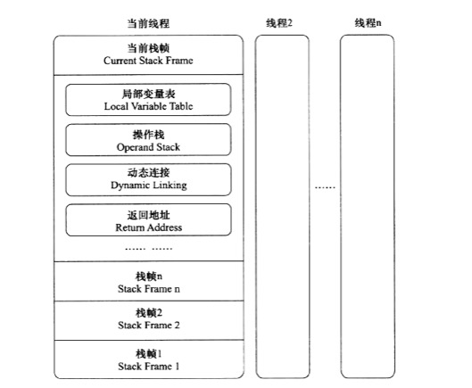

# 深入理解Java虚拟机：JVM高级特性与最佳实践

# Java内存区域与内存溢出异常
## 运行时数据区域

1. 程序计数器
2. Java虚拟机栈
3. 本地方法栈
4. Java堆
5. 方法区
6. 运行时常量池

### 程序计数器
当前线程所执行的字节码的行号指示器.每条线程都需要有一个独立的程序计数器.

字节码解释器工作时就是通过改变这个计数器的值来选取下一条需要执行的字节码指令。

Java虚拟机的多线程是通过线程轮流切换并分配处理器执行时间的方式来实现的，在任何一个确定的时刻一个处理器只会执行一条线程中的指令，因此为了线程切换后能恢复到正确的执行位置，每条线程都需要一个独立的程序计数器。

线程私有的内存。

执行的是java方法,计数器记录的是正在执行的虚拟机字节码指令的地址.执行的是Native方法,计数器值为空.

此内存区域是唯一一个在Java虚拟机规范中没有规定任何OutOfMemoryError情况的区域.

### Java虚拟机栈
Java虚拟机栈也是线程私有的,生命周期与线程相同.

描述的是Java方法执行的内存模型:每个方法被执行的时候都会同时创建一个栈帧用于存储局部变量表,操作栈,动态链接,方法出口等信息.

方法被调用到执行完就对应一个栈帧在虚拟机栈中从入栈到出栈的过程.

局部变量表存放编译期可知的基本数据类型,对象引用和returnAddress类型

局部变量表所需内存空间在**编译期**完成分配。

如果线程请求的栈深度大于虚拟机允许的深度,将抛出StackOverflowError异常;如果虚拟机栈可以动态扩展,当扩展时无法申请到足够内存时,会抛OutOfMemoryError异常.

### 本地方法栈
虚拟机栈为虚拟机执行Java方法服务,而本地方法栈则是为虚拟机使用到的native方法服务.

SunHotSpot虚拟机把本地方法栈和虚拟机栈合二为一.

本地方法栈也会抛StackOverflowError和OutOfMemoryError异常.

### Java堆
被所有线程共享，虚拟机启动时创建，存放对象实例。

所有的对象实例以及数组都要在堆上分配。

Java堆还可以细分为新生代和老年代，还有Eden空间,From Survivor空间,To Survivor空间。

物理上不连续的内存空间,只要逻辑上是连续的即可。

堆中没有内存完成实例分配,并且堆也无法再扩展时,将会抛出OutOfMemoryError异常.

### 方法区
方法区和Java堆一样，是各个线程共享的内存区域，用于存储已被虚拟机加载的类信息、常量、静态变量、即时编译器编译后的代码等数据。

很多人把方法区称为永久代，Hotspot虚拟机使用永久代来实现方法区，其他虚拟机不存在永久代的概念。

垃圾收集行为在这个区域是比较少见的。这个区域的内存回收目标主要是针对常量池的回收和对类型的卸载。

会抛出OutOfMemoryError异常。

### 运行时常量池
运行时常量池是方法区的一部分。 用于存放编译期生成的各种字面量和符号引用,这部分内容将在类加载后存放到方法区的运行时常量池中。

### 直接内存
不是虚拟机运行时数据区的一部分。

NIO可以使用Native函数库直接分配堆外内存。

## Hotspot虚拟机对象
### 对象的创建
### 对象的内存布局
Hotspot虚拟机中，对象在内存中存储的布局可分为3块区域：对象头，实例数据，对齐填充。

#### 对象头
对象头包括两部分信息，第一部分用于存储对象自身的运行时数据，如哈希码，GC分代年龄，锁状态标志，线程持有的锁，偏向线程ID，偏向时间戳等。称为Mark Word。

在32位的HotSpot虚拟机中，如果对象处于未被锁定的状态下，那么MarkWord的32bit空间中的25bit用于存储对象哈希码，4bit存储对象分代年龄，2bit存储锁标志位，1bit固定为0。

对象头的另一部分是类型指针，即对象指向它的类元数据的指针，虚拟机通过这个指针来确定这个对象是哪个类的实例。

如果对象是一个Java数组，那在对象头中还必须有一块用于记录数组长度的数据。

#### 实例数据
对象真正存储的有效信息。

#### 对齐填充

### 对象的访问定位
Java程序需要通过栈上的reference数据来操作堆上的具体对象。

主要访问方式有使用句柄和直接指针：

* 使用句柄 最大好处是reference中存储的是稳定的句柄地址，在对象被移动时只会改变句柄中的实例数据指针。
* 直接指针 好处是速度快。

HotSpot使用直接指针的方式进行对象访问。

# 垃圾收集器与内存分配策略

## 对象已死吗

### 引用计数算法
	
很难解决对象间的相互循环引用问题
	
### 可达性分析算法
Java中可作为GC Roots的对象包括：

* 虚拟机栈中引用的对象
* 方法区中类静态属性引用的对象
* 方法区中常量引用的对象
* 本地方法栈中JNI引用的对象

### 引用

- 强引用
- 软阴影
- 弱引用
- 虚引用

### 回收方法区
方法区或者叫永久代的垃圾收集主要回收两部分内容:废弃常量和无用的类。

类需要同时满足下面3个条件才能算是无用的类：

* 该类所有的实例都已经被回收
* 加载该类的ClassLoader已经被回收
* 该类对应的java.lang.Class对象没有在任何地方被引用，无法在任何地方通过反射访问该类的方法

HotSpot虚拟机提供-Xnoclassgc参数控制是否对类进行回收。

## 垃圾收集算法

### 标记-清除算法
首先标记出所有需要回收的对象，在标记完成后统一回收所有被标记的对象。

缺点:效率问题和空间问题，效率不高，清除之后会产生大量不连续内存碎片。
### 复制算法

它将可用内存按容量化为大小相等的两块,每次只使用一块,当这一块用完了,就将还存活的对象复制到另外一块,再把已使用的一次清理掉。
	
通常用来回收新生代。
	
将内存分为一块较大的Eden空间和两块较小的Survivor空间,每次使用Eden和其中的一块Survivor,回收时将Eden和Survivor中还存活着的对象一次性的拷贝到另外一块Survivor空间上,最后清理掉Eden和刚用过的Survivor空间。
	
HotSpot虚拟机默认Eden和Survivor比例是8:1
	
### 标记-整理算法
根据老年代的特点，有人提出了标记整理算法。

让所有存活的对象都向一端移动,然后直接清理掉端边界以外的内存
### 分代收集算法
根据对象存活周期的不同将内存划分为几块。一般把Java堆分为新生代和老年代。

## HotSpot的算法实现（过）
### 枚举根节点（过）
### 安全点（过）
### 安全区域（过）

## 垃圾收集器
1. Serial收集器
	* 新生代
	* 单线程收集器
	* 必须暂停其他的工作线程
	* 简单而高效
	* 运行在Client模式下的默认新生代收集器
2. ParNew收集器
	* 是Serial收集器的多线程版本,使用多线程进行垃圾收集
	* 新生代收集器
	* 运行在Server模式下的虚拟机中首选的新生代收集器
	* 除了Serial收集器之外,目前只有它能与CMS收集器配合
3. Parallel Scavenge收集器
	* 新生代收集器,使用复制算法
	* 并行多线程收集器
	* 目标是达到一个可控制的吞吐量
	* 主要适合在后台运算而不需要太多交互的任务
	* -XX:MaxGCPauseMills 控制最大垃圾收集停顿时间
	* -XX:GCTimeRatio 设置吞吐量大小
	* -XX:+UseAdptiveSizePolicy 打开,可以自适应调节策略
4. Serial Old收集器
	* Serial收集器的老年代版本
	* 单线程收集器
	* 标记-整理算法
	* Cliet模式下虚拟机使用
	* Server模式下,在JDK1.5以及之前版本中与Parallel Scavenge收集器搭配使用,另一个就是作为CMS收集器的后备预案
5. Parallel Old收集器
	* Parallel Scavenge收集器的老年代版本
	* 使用多线程和标记-整理算法
6. CMS(Concurrent Mark Sweep)收集器
	* 以获取最短回收停顿时间为目标的收集器
	* 	标记-清除算法实现
	*  运作过程:
		+ 初始标记
		+ 并发标记
		+ 重新标记
		+ 并发清除
	* 并发收集,低停顿
	* 缺点:
		+ 对CPU资源非常敏感
		+ 无法处理浮动垃圾(Floating Garbage)
		+ 标记-清除算法,会产生大量空间碎片
7. G1收集器(Garbage First)
	* 并行与并发
	* 分代收集
	* 空间整合z
	* 可预测的停顿
	* 运作步骤:
		+ 初始标记
		+ 并发标记
		+ 最终标记
		+ 筛选回收
8. Minor GC和Full GC
	* Minor GC 新生代GC,频繁,速度快
	* Major GC/Full GC 老年代GC,速度慢

9. 大对象直接进入老年代
	* 大对象是指需要大量连续内存空间的Java对象.
	* -XX:PretenureSizeThreshold 大于这个值得对象直接进入老年代分配,只对Serial和ParNew两款收集器有效
10. 长期存活对象进入老年代
	* 对象年龄(Age)计数器
	* 年龄增加到一定程度(默认15)时,被晋升到老年代
	* -XX:MaxTenuringThreshold来设置
11. 动态对象年龄判定
	* Surviver空间中相同年龄所有对象大小的总和大于Surviver空间的一半,年龄大于或等于该年龄的对象直接进入老年代,无需等到MaxTenuringThreshold要求的年龄

# 虚拟机性能监控
	1. jps 显示所有HotSpot虚拟机进程
	2. jstat 收集HotSpot虚拟机各方面运行数据
	3. jinfo 显示虚拟机配置信息
	4. jmap 生成虚拟机的内存转储快照
	5. jhat 分析heapdump文件
	6. jstack 显示虚拟机线程快照
## jps 虚拟机进程状况工具
可以列出正在运行的虚拟机进程,显示虚拟机执行主类名称,显示进程的本地虚拟机唯一ID(LVMID).

本地虚拟机进程LVMID与系统进程ID(PID)是一致的.

jps命令格式:

```
jps [options] [hostid]
```
options:

* -q 只输出LVMID,不显示主类名
* -m 输出虚拟机进程启动时传递给main()的参数
* -l 输出主类全名或者jar路径
* -v 输出虚拟机进程启动时JVM参数

## jstat 虚拟机统计信息监视工具
监视各种运行状态信息,显示本地或远程虚拟机进程中的类装载,内存,垃圾收集,JIT编译等运行数据

jstat命令格式:

```
jstat [option vmid [interval[s|ms] [count]]]

```
* VMID 如果是本地虚拟机进程,VMID与LVMID是一致的,如果是远程虚拟机,VMID格式是:[protocal:][//]lvmid[@hostname[:port]/servername]
* interval和count 查询间隔和次数
* options:
	+ -class 监视类装载,卸载数量,总空间,类装载耗费时间
	+ -gc 监视java堆情况,包括Eden区,2个survivor区,老年代,永久代的容量,已用空间,GC时间合计
	+ -gccapacity 与-gc基本相同,主要关注堆各个区域使用到的最大和最小空间
	+ -gcutil 与-gc基本相同,主要关注已使用空间占总空间的百分比
	+ -gccause 与-gcutil一样,额外输出导致上一次GC产生的原因
	+ -gcnew 监视新生代GC情况
	+ -gcnewcapacity 与-gcnew基本相同,主要关注使用到的最大和最小空间
	+ -gcold 监视老年代GC情况
	+ -gcoldcapacity 与-gcold基本相同,主要关注使用到的最大和最小空间
	+ -gcpermcapacity 永久代使用的最大和最小空间
	+ -compiler 输出JIT编译器编译过的方法,耗时等信息
	+ printcompilation 输出已被JIT编译的方法

## jinfo 配置信息工具
实时查看和调整虚拟机的参数
jinfo命令格式:

```
jinfo [option] pid
```

## jmap 内存映像工具
生成堆转储快照(heapdump)

查询finalize执行队列,java堆和永久代的详细信息,如空间使用率,当前用的哪种收集器

jmap命令格式:

```
jmap [option] vmid
```

option

* -dump 生成java堆转储快照,格式:-dump:[live,]format=b,file=<filename>
* -finalizerinfo 显示在F-Queue中等待Finalizer线程执行finalize方法的对象
* -heap 显示堆详细信息
* -histo 显示堆中对象统计信息,包括类,实例数量,合计容量
* -permstat 以ClassLoader为统计口径显示永久代内存状态
* -F 强制生成dump快照

## jhat 虚拟机堆转储快照分析工具
分析jmap生成的堆转储快照

## jstack 堆栈跟踪工具
生成虚拟机当前时刻的线程快照.

线程快照:当前虚拟机内每一条线程正在执行的方法堆栈集合.

目的主要是定位线程出现长时间停顿的原因.

jstack命令格式:

```
jstack [option] vmid
```

option:
* -F 强制输出线程堆栈
* -l 除堆栈外,显示关于锁的附加信息
* -m 如果调用到本地方法,显示c/c++的堆栈

# JDK可视化工具

## JConsole java监视与管理控制台

### 概述标签

### 内存监控
相当于可视化的jstat命令,监视受收集器管理的虚拟机内存(Java堆和永久代)的变化趋势

### 线程监控
相当于可视化的jstack命令

## VisualVM 多合一故障处理工具

### BTrace动态日志跟踪插件

# 类文件结构
## Class类文件的结构
Class文件中只有两种数据类型，无符号数和表。

无符号数属于基本的数据类型，u1，u2，u4，u8分别代表1个字节，2个字节，4个字节，8个字节的无符号数，无符号数可用来描述数字，索引引用，数量值，UTF-8编码构成字符串值。

表是由多个无符号数或者其他表作为数据项构成的复合数据类型，表都以`_info`结尾。

```
ClassFile {

	u4 magic;
	
	u2 minor_version;
	
	u2 major_version;
	
	u2 constant_pool_count;
	
	cp_info constant_pool[constant_pool_count-1];
	
	u2 access_flags;
	
	u2 this_class;
	
	u2 super_class;
	
	u2 interfaces_count;
	
	u2 interfaces[interfaces_count];
	
	u2 fields_count;
	
	field_info fields[fields_count];
	
	u2 methods_count;
	
	method_info methods[methods_count];
	
	u2 attributes_count;
	
	attribute_info attributes[attributes_count];

}
```

Class文件本质上就是一张表。

### 魔数与Class文件的版本
Class文件的头4个字节是魔数，确定这个文件是否能被虚拟机接受。`0xCAFEBABE`。

接着魔术的4个字节是Class文件的版本号，5，6字节是次版本号，7，8字节是主版本号。

### 常量池
主版本号后面试常量池入口。

常量池中常量的数量是不固定的，所以在常量池入口有一个u2类型的数据，代表常量池容量计数值。

常量池中主要存放两大类常量，字面量和符号引用。字面量接近于Java语言层面的常量概念，如文本字符串，声明为final的常量值等。

符号引用属于编译原理方面的概念，包括以下三类常量：

* 类和接口的全限定名
* 字段的名称和描述符
* 方法的名称和描述符

常量池中每一项都是一个表。表开始的第一位是u1类型的标志位tag

### 访问标志
常量池结束后，紧接着的两个字节代表访问标志access_flags，用于识别类或者接口层次的访问信息。

- ACC_PUBLIC，表示是否为public类型
- ACC_FINAL，是否被声明为final，只有类可设置。
- ACC_SUPER，是否允许使用invokespecial字节码指令的新语意。
- ACC_INTERFACE，标识这是一个接口。
- ACC_ABSTRACT，是否为abstract类型，接口和抽象类此标志为真，其他为假。
- ACC_SYNTHETIC，标识这个类并非由用户代码产生的。
- ACC_ANNOTATION，标识是一个注解。
- ACC_ENUM，标识是一个枚举。

### 类索引，父类索引与接口索引集合
类索引`this_class`和父类索引`super_class`都是u2类型的数据，接口索引interfaces是一组u2类型的数据集合，Class文件由这三项数据来确定这个类的继承关系。

都在访问标志之后。

类索引和父类索引用两个u2类型的索引值表示，他们各自指向一个类型为CONSTANT_Class_info的类描述符常量，通过类描述符常量中的索引值可以找到ConSTANT_Utf8_info中的权限定名。

接口索引集合，第一项为u2类型的数据为接口计数器`interfaces_count`。

### 字段表集合
字段表`field_info`描述接口或者类中声明的变量。字段包括类级变量和实例级变量，但不包括在方法内声明的局部变量。

字段信息包括：

* 作用域public，private，protected修饰符。
* 实例变量还是类变量static修饰符
* 可变性final
* 并发可见性volatile
* 可否被序列化transient
* 字段数据类型
* 字段名称

字段修饰符`access_flags`与类的`access_flags`类似，是一个u2的数据类型。

跟随着`access_flags`标志的是两项索引值，name_index和descriptor_index，是对常量池的引用，对应字段的简单名称和方法的描述符。

描述符用来描述字段的数据类型，方法的参数列表和返回值。基本数据类型以及代表无返回值的void类型都用一个大写字符来表示，对象类型则用字符L加对象的全限定名来表示。

```
B-byte

C-char

D-double

F-float

I-int

J-long

S-short

Z-boolean

V-void

L-Ljava/lang/Object
```

数组类型每一维度使用一个前置的`[`来描述，二维数组`[[Ljava/lang/String;`，整形数组`int[]`表示为`[I`

描述符描述方法时，先参数列表后返回值的顺序描述。

```
void inc()--> ()V

java.lang.String toString()--> ()Ljava/lang/String;

int indexOf(char[] source,int sourceOffset,int sourcrCount,char[] target,int targetOffset,int targetCount,int fromIndex)--> ([CII[CIII)I
```

字段表集合中不会列出从超类或者父接口继承而来的字段。

### 方法表集合
方法表结构：

* 访问标志
* 名称索引
* 描述符索引
* 属性表集合

### 属性表集合
#### Code属性
方法体中的代码经过编译后，最终变成字节码指令存储在Code属性中。接口和抽象类不需要Code属性。

attribute_name_index是一项指向CONSTANT_Utf8_info型常量的索引。

max_stack操作数栈深度的最大值，虚拟机运行时候需要根据这个值来分配栈帧中的操作栈深度。

max_locals局部变量表所需的存储空间。

code_length代表字节码长度。u4类型，但是虚拟机只是用u2，不允许超过65535条字节码指令。

code存储字节码指令。

#### Exceptions属性
与Code属性平级。作用是列举出方法中可能抛出的受检查异常。

#### LineNumberTable属性
描述Java远吗行号与字节码行号对应关系。
#### LocalVariableTable属性
描述栈帧中局部变量表中的变量与Java源码中定义的变量之间的关系。

#### SourceFile属性
Class文件的源码文件名称。

#### ConstantValue
通知虚拟机自动为静态变量赋值、只有被static修饰的变量才能使用这个属性。

非static类型的实例变量，赋值是在实例构造器`<init>`方法中进行的；对于类变量，有两种方法，在类构造器`<clinit>`方法中或者使用ConstantValue属性。

#### InnerClasses属性
记录内部类与宿主类之间的关联。

#### Deprecated和Synthethic属性
Deprecated表示某个类，字段，方法已被标定为不在推荐使用。

Synthethic表示此字段或者方法不是由Java源码直接生成的。

#### StackMapTable
jdk1.6增加的，位于Code属性表中，会在虚拟机类加载的字节码验证阶段被新类型检查验证器使用。

#### Signature属性
jdk1.5之后添加，记录泛型签名信息。

#### BootstrapMethods属性
jdk1.7之后添加，位于类文件属性表中，用于保存invokedynamic指令引用的引导方法限定符。

## 字节码指令简介
### 加载和存储指令
用于将数据在栈帧中的局部变量表和操作数栈之间来回传输。

将一个局部变量加载到操作栈：`iload,iload<n>,lload,lload_<n>,fload,fload_<n>,dload,dload_<n>,aload,aload_<n>`

将一个数值从操作数栈存储到局部变量表：`istore,itsore_<n>,lstore,lstore_<n>,fstore,fstore_<n>,dstore,dstore_<n>,astore,astore_<n>`

将一个常量加载到操作数栈：`bipush,sipush,ldc,ldc_w,ldc2_w,aconst_null,iconst_ml,iconst_<i>,lconst_<l>,fconst_<f>,dconst_<d>`

扩充局部变量表的访问索引的指令：`wide`

存储数据的操作数栈和局部变量表主要就是由加载和存储指令进行操作，除此之外，还有少量指令，如访问对象的字段或数组元素的指令也会向操作数栈传输数据。

`iload_<n>`,实际上是代表了一组指令如`iload_0,iload_1,iload_2`，这几组指令都是某个带有一个操作数的通用指令的特殊形式。它们省略掉了显示的操作数，不需要进行取操作数的动作，隐含在了指令中。

### 运算指令
对两个操作数栈上的值进行某种特定运算，并把结果重新存入到操作栈顶。

加法指令：`iadd,ladd,fadd,dadd`

减法指令：`isub,lsub,fsub,dsub`

乘法指令：`imul,lmul,fmul,dmul`

除法指令：`idiv,ldiv,fdiv,ddiv`

求余指令：`irem,lrem,frem,drem`

取反指令：`ineg,lneg,fneg,dneg`

位移指令：`ishl,ishr,iushr,lshl,lshr,lushr`

按位或指令：`ior,lor`

按位与指令：`iand,land`

按位异或指令：`ixor,lxor`

局部变量自增指令：`iinc`

比较指令：`dcmpg,dcmpl,fcmpg,fcmpl,lcmp`

### 类型转换指令
可以将两种不同的数值类型进行相互转换。

JVM直接支持一下数值类型的宽化类型转换，小类型向大类型的安全转换：

* int到long，float，double转换
* long到float，double
* float到double

处理窄化类型转换必须显式的使用转换指令来完成，指令包括：`i2b,i2c,i2s,l2i,f2i,d2i,d2l,d2f`。

### 对象创建于访问指令

* 创建类实例new
* 创建数组newarray,anewarray,multianewarray
* 访问类字段（static字段）和实例字段的指令：getfield,putfield,getstatic,putstatic
* 把一个数组元素加载到操作数栈的指令baload,caload,saload,iaload,laload,daload,daload,aaload
* 将一个操作数栈的值存储到数组元素中的指令，bastore,castore,sastore,iastore,fastore,dastore,aastore
* 取数组长度arraylength
* 检查类实例类型的指令instanceof，checkcast

### 操作数栈管理指令

* 将操作数栈的栈顶一个或者两个元素出栈pop,pop2
* 复制栈顶一个或两个数值并将复制值或双份的复制值重新压入栈顶，`dup,dup2,dup_x1,dup2_x1,dup_x2,dup2_x2`
* 将栈最顶端的两个数值互换swap

### 控制转移指令
可以让java虚拟机有条件或者无条件的从指定的位置指令，而不是控制转移指令的下一条指令继续执行。

* 条件分支`ifeq,iflt,ifle,ifgt,ifge,ifnull,ifnonnull,if_icmpeq,if_icmpne,if_icmplt,if_icmpgt,if_icmple,if_icmpge,if_acmpeq,if_acmpne`
* 复合条件分支tableswitch,lookupswitch
* 无条件分支`goto,goto_w,jsr,jsr_w,ret`

### 方法调用和返回指令
方法调用指令：

* invokevirtual用于调用对象的实例方法，根据对象的实际类型进行分派
* invokeinterface调用接口方法，会在运行时搜索一个实现了这个接口方法的对象，找出适合的方法进行调用
* invokespecial调用一些需要特殊处理的实例方法，包括实例初始化方法，私有方法，父类方法
* invokestatic调用类方法
* invokedynamic用于在运行时动态解析出调用点限定符所引用的方法，并执行该方法。

方法返回指令是根据返回值的类型区分的，包括ireturn，lreturn，freturn，dreturn，areturn，还有一个return指令提供声明为void的方法，实例初始化方法以及类和接口的类初始化方法使用。

### 异常处理指令
显式抛出的异常都由athrow指令来实现。

异常处理现在采用异常表完成，以前采用指令jsr和ret。

### 同步指令
JVM支持方法级同步和方法内部一段指令序列同步，都是使用管程Monitor来支持。

方法级的同步是隐式的，无需通过字节码指令来控制。JVM可以从方法常量池的方法表结构中的ACC_SYNCHRONIZED访问标志得知一个方法是否是同步方法。

同步一段指令集序列是由synchronized语句块表示，有monitorenter和monitorexit两条指令来支持synchronized关键字的语义。

为了保证方法异常完成时monitorenter和monitorexit指令依然可以正确配对执行，编译器会自动产生一个异常处理器，这个异常处理器可以处理所有异常，目的就是用来执行monitorexit指令。

## 共有设计和私有实现
## Class文件结构的发展


# 虚拟机类加载机制

## 类加载时机
生命周期：

* 加载
* 验证
* 准备
* 解析
* 初始化
* 使用
* 卸载

加载，连接，初始化，其中连接包括验证，准备，解析。

加载阶段JVM虚拟机规范没有进行强制约束。

初始化阶段虚拟机规范严格规定了有且只有5中情况必须立即对类进行初始化：

1. 遇到new(创建一个对象)，getstatic（获取指定类的静态域），putstatic（为指定类的静态域赋值），invokestatic（调用静态方法）这四条字节码指令时如果类没有初始化，则需要先触发其初始化。生成这4条指令最常见的代码场景是：使用new关键字实例化对象，读取或设置一个类的静态字段（被final修饰已在编译期把结果放入常量池的静态字段除外），调用一个类的静态方法。
2. 使用java.lang.reflect包的方法对类进行反射调用的时候，如果类没有初始化，需要先触发初始化。
3. 初始化一个类的时候，发现其父类还没有进行过初始化，需要先触发其父类的初始化。
4. 虚拟机启动时，用户需要指定一个要执行的主类，虚拟机会先初始化这个主类。
5. 使用JDK1.7的动态语言支持时，如果java.lang.invoke.MethodHandle实例最后的解析结果是`REF_getStatic,REF_putStatic,REF_invokeStatic`的方法句柄，并且这个方法句柄所对应的类没有进行过初始化，则需要先触发其初始化。

对于静态字段，只有直接定义这个字段的类才会被初始化，通过子类来引用父类中定义的静态字段，只会出发父类的初始化，而不会触发子类的初始化。

一个类在初始化时候，要求其父类全部都已经初始化，但是在一个接口初始化时，并不要求其父接口全部都完成了初始化，只有在真正使用到父接口的时候，才会初始化。

## 类加载的过程
 
### 加载

1. 通过类的全限定名获取定义此类的二进制字节流
2. 将字节流代表的静态存储结构转化为方法区的运行时数据结构
3. 在java堆中生成一个代表这个类的java.lang.Class对象,作为方法区这些数据的访问入口

+ ZIP包读取,JAR,EAR,WAR
+ 网络读取,Applet
+ 动态代理
+ 其他文件,JSP
+ 数据库
+ ...

### 验证
1. 文件格式验证
2. 元数据验证
3. 字节码验证
4. 符号引用验证

### 准备
正式为类变量分配内存并设置类变量初始值,这些内存将在方法区中进行分配。这时候进行内存分配的仅仅包括类变量被static修饰的变量，不包括实例变量。实例变量会在对象实例化时随着对象一起分配在Java堆中。

这里的初始值是数据类型的零值。

如果类字段的字段属性表中存在ConstantValue属性，在准备阶段变量value就会被初始化为ConstantValue属性所指定的值，final修饰的变量。

### 解析
虚拟机将常量池内的符号引用替换为直接引用。

* 符号引用
	
	符号引用以一组符号来描述所引用目标,可以是任何形式的字面量.符号引用与虚拟机实现的内存布局无关,引用目标不一定已经加载到内存中
	
* 直接引用
	
	直接引用可以是直接指向目标的指针,相对偏移量或是一个能间接定位到目标的句柄.直接引用是与虚拟机实现的内存布局相关的,同一个符号引用在不用虚拟机实例上翻译出来的直接引用一般不会相同.如有直接引用,那引用的目标必定已经存在内存中。
	
虚拟机规范中并未规定解析阶段发生的具体时间，只要求在执行anewarray、checkcast、getfield、getstatic、instanceof、invokedynamic、invokeinterface、inovkespecial、invokestatic、invokevirtual、ldc、ldc_w、multianewarray、new、putfield、putstatic这16个用于操作符号引用的字节码指令之前，先对他们所使用的符号引用进行解析。

1. 类或接口的解析
2. 字段解析
3. 类方法解析
4. 接口方法解析

### 初始化
初始化阶段才真正开始执行类中定义的Java代码。

初始化阶段是执行类构造器`<clinit>()`方法的过程。

* `<clinit>()`方法是由编译器自动收集类中的所有类变量的赋值动作和静态语句块中的语句合并产生的,编译器收集的顺序是由语句在源文件中出现的顺序所决定的,静态语句块中只能访问到定义在静态语句块之前的变量,定义在它之后的变量,在前面的静态语句块中可以赋值,但不能访问。
* `<clinit>()`方法与类的构造函数不同,它不需要显式的调用父类构造器,虚拟机会保证子类的`<clinit>()`方法执行之前,父类的`<clinit>()`已经执行完毕.因此在虚拟机中第一个被执行的`<clinit>()`方法的类肯定是java.lang.Object。
* 由于父类的`<clinit>()`方法先执行,也就意味着父类中定义的静态语句块要优先于子类的变量赋值操作。
* `<clinit>()`方法对于类或接口来说并不是必须的,一个类中没有静态语句块,也没有对变量的赋值操作,编译器可以不为这个类生成`<clinit>()`方法。
* 接口中不能使用静态语句块,但是有变量初始化赋值操作,因此接口与类一样都会生成`<clinit>()`方法。接口与类不同,执行接口的`<clinit>()`方法不需要先执行父接口的`<clinit>()`方法,只有当父类接口中定义的变量被使用时,父接口才会被初始化.接口的实现类在初始化时也一样不会执行接口的`<clinit>()`方法。
* 虚拟机会保证一个类的`<clinit>()`方法在多线程中被正确的加锁和同步.阻塞。

# 类加载器
* 启动类加载器
	
	加载`<JAVA_HOME>\lib`中的或者被`-Xbootclasspath`所指定路径的,并且是虚拟机是别的,仅按照文件名,如rt.jar
	
* 扩展类加载器
	
	加载`<JAVA_HOME>\lib\ext`中的或者被`java.ext.dirs`系统变量所指定的类库,开发者可直接使用扩展加载器

* 应用程序类加载器
	
	也称为系统类加载器,加载用户类路径(ClassPath)上指定的类库,开发者可以直接使用这个类加载器
	
双亲委派模型，要求除了顶层的启动类加载器之外，其余的类加载器都应当有自己的父类加载器。

双亲委派模型的工作过程是：如果一个类加载器收到类加载的请求，他首先不会自己去加载这个类，而是把这个请求委派给父类加载器去完成，每一个层次的类加载器都是如此。只有当父类加载器无法加载请求，子加载器才会尝试自己去加载。
	

# 虚拟机字节码执行引擎
## 运行时栈帧结构
栈帧用于支持虚拟机进行方法调用和方法执行的数据结构。是虚拟机运行时数据区中的虚拟机栈的栈元素。存储了方法的局部变量表，操作数栈，动态连接和方法返回地址等信息。

每一个栈帧都包括了局部变量表，操作数栈，动态连接，方法返回地址和一些额外的附加信息。

编译代码的时候，栈帧中需要多大的局部变量表，多深的操作数栈都已经确定，写入到方法表的Code属性中。

一个线程中的方法调用链可能会很长，很多方法都同时处于执行状态。对于执行引擎来说，在活动线程中，只有位于栈顶的栈帧才是有效的，称为当前栈帧，与这个栈帧相关联的方法称为当前方法。

执行引擎运行的所有字节码指令都只针对当前栈帧进行操作。



### 局部变量表
存放方法参数和方法内部定义的局部变量。在编译为Class文件时，就在方法的Code属性的max_locals数据项中确定了该方法所需要分配的局部变量表的最大容量。

变量槽Slot为最小单位。

方法执行时，虚拟机使用局部变量表完成参数值到参数变量列表的传递过程，若果执行的是实例方法，局部变量表中第0个Slot默认是传递方法所属对象实例的引用，可通过this关键字来访问这个隐含的参数。

### 操作数栈
LIFO栈。操作数栈最大深度在编译的时候写入到Code属性的max_stack数据项中。

当一个方法开始执行的时候，方法的操作数栈是空的，方法执行过程中，会有各种字节码指令往操作数栈中写入和提取内容，也就是出栈和入栈操作。

操作数栈中元素的数据类型必须与字节码指令的序列严格匹配，编译器和类校验阶段的数据流分析中会验证。

### 动态连接
每个栈帧都包含一个指向运行时常量池中该栈帧所属方法的引用，持有这个引用是为了支持方法调用过程中的动态连接。

Class常量池中有大量的符号引用，字节码中的方法调用指令就以常量池中指向方法的符号引用作为参数。这些符号引用一部分会在类加载阶段或第一次使用时候转化为直接引用，成为静态解析。另一部分会在每一次运行期间转化为直接引用，称为动态连接。

### 方法返回地址
当一个方法开始执行后，只有两种方法可以退出方法：正常完成出口和异常完成出口。

正常完成出口：执行引擎遇到任意一个方法返回的字节码指令。这时候可能会有返回值传递给上层的方法调用者，是否有返回值和返回值的类型将根据遇到何种方法返回指令来决定。

异常完成出口：在方法执行过程中遇到了异常，并且这个异常没有在方法体内得到处理，无论是Java虚拟机内部产生的异常，还是代码中使用athrow字节码指令产生的异常。只要在本方法的异常表中没有搜索到匹配的异常处理器，就会导致方法退出。方法使用异常完成出口退出是不会给调用者产生任何返回值的。

方法退出的过程实际上就等同于把当前栈帧出栈，退出时可能执行的操作有：恢复上层方法的局部变量表和操作数栈，把返回值压入调用者栈帧的操作数栈中，调整PC计数器的值，以指向方法调用指令后面的一条指令。
#### 附加信息

## 方法调用
确定被调用方法的版本(即调用哪一个方法)

### 解析
所有方法调用中的目标方法在Class文件里都是一个常量池中的符号引用,在类加载的解析阶段,会将其中一部分符号引用转化为直接引用.

符合"编译期可知,运行期不可变"的方法主要有静态方法和私有方法.

### 分派
分派调用过程将揭示多态性特征的一些最基本的体现,如重载和重写.

1. 静态分派
	
	所有依赖静态类型来定位方法执行版本的分派动作,都称为静态分派.
	
	静态分派的典型应用就是方法重载.
	
	静态分派发生在编译阶段.

2. 动态分派
	
	重写
	
	运行期根据实际类型确定方法执行版本的分派工程称为动态分派

3. 单分派与多分派
	
	方法的接收者与方法的参数统称为方法的宗量。
	
	单分派是根据一个宗量对目标方法进行选择
	
	多分派则是根据多于一个的宗量对目标方法进行选择
	
	Java语言的静态分派属于多分派类型。
	
	Java语言的动态分派属于单分派类型。
	
	
