# 计算机系统漫游
## 信息就是位+上下文
## 程序被其他程序翻译成不同的格式
预处理器、编译器、汇编器、链接器一起构成了编译系统。

- 预处理阶段，预处理器cpp会修改原始的C程序，比如会把`#include <stdio.h>`命令告诉预处理器读取系统头文件stdio.h的内容，并插入程序文本中，得到了另一个c程序，通常以.i为扩展名
- 编译阶段，编译器ccl将.i文件翻译成.s文件，包含一个汇编语言程序。
- 汇编阶段，汇编器as会将.s翻译成机器语言指令，把这些指令打包成一种叫做可重定位目标程序的格式，并将结果保存在目标.o文件中。.o文件是一个二进制文件。
- 链接阶段，链接器ld负责将程序中调用标准库的函数同函数所在的预编译文件进行链接，得到一个可执行的目标文件，此文件可以被加载到内存中，由系统执行。

## 了解编译系统如何工作是大有益处的
## 处理器读并解释存储在内存中的指令
### 系统的硬件组成

1. 总线，它携带信息字节并负责在各个部件间传递。
2. I/O设备，每个I/O设备都通过一个控制器或适配器与I/O总线相连。控制器是I/O设备本身或系统的主板上的芯片组，适配器是一块插在主板插槽上的卡。
3. 主存，是临时存储设备。物理上来说，主存是一组动态随机存取存储器DRAM芯片组成的。从逻辑上说，存储器是一个线性的字节数组，每个字节都有其唯一的地址，地址从零开始。
4. 处理器，CPU，是解释或执行存储在主存中指令的引擎，处理器核心是一个大小为一个字的存储设备（寄存器），称为程序计数器PC，任何时刻PC都指向主存中某条机器语言指令。

例子，CPU在指令的要求下可能会执行这些操作：

- 加载：从主存复制一个字节或一个字到寄存器，以覆盖寄存器原来的内容。
- 存储：从寄存器复制一个字节或一个字到主存的某个位置，以覆盖原来的内容。
- 操作：把两个寄存器的内容复制到ALU，ALU对这两个字做算术运算，并将结果放到一个寄存器中，以覆盖该寄存器中原来的内容。
- 跳转：从指令本身中抽取一个字，并将这个子复制到程序计数器PC中，以覆盖PC中原来的值。

### 执行hello程序

## 高速缓存至关重要
## 存储设备形成层次结构
### 进程
进程是操作系统对一个正在运行的程序的一种抽象。
### 线程
### 虚拟内存

- 程序代码和数据
- 堆
- 共享库
- 栈
- 内核虚拟内存

### 文件
文件就是字节序列。

## 系统之间利用网络通信

## 重要主题
### 并发和并行

1. 线程级并发
2. 指令级并行
3. 单指令、多数据并行

# 信息的表示和处理

- 无符号（unsigned）编码基于传统的二进制表示法，表示大于或者等于零的数字。
- 补码（two's-complement）编码是表示有符号整数的最常见方式，有符号整数就是可以为正或者为负的数字。
- 浮点数（floating-point）编码是表示实数的科学计数法以2为基数的版本。

## 信息存储
大多数计算机使用8位的块或者字节（byte）作为最小的可寻址的内存单位，而不是访问内存中单独的位。

机器级程序将内存视为一个非常大的字节数组，称为虚拟内存，内存的每个字节都由一个唯一的数字来标识，称为它的地址，所有的可能地址的集合就成为虚拟地址空间。

### 十六进制表示法
一个字节由8位组成，二进制表示法的值域是00000000~11111111，十进制表示法的值域是0-255。十六进制表示法的值域是00-FF。

### 字数据大小
每台计算机都由一个字长word size，指明指针数据的标称大小。虚拟地址是以这样的字来编码的，所以字长决定的最重要的系统参数就是虚拟地址空间的最大大小。

### 寻址和字节顺序

- 最低有效字节在最前的方式，称为小端法little endian。
- 最高有效字节在最前的方式，称为大端法big endian。

### 表示字符串
### 表示代码
### 布尔代数简介
### C语言中的位级运算
### C语言中的逻辑运算
### C语言中的位移运算
`x<<k`表示x向左移动k位，丢弃最高的k位，并在右端补k个0。

`x>>k`右移运算，逻辑右移或算数右移。逻辑右移在左端补齐k个0，算术右移是在左端补k个最高有效位的值。

Java中`x>>k`是算术右移，`x>>>k`是逻辑右移

## 整数表示
### 整型数据类型
### 无符号数的编码
### 补码编码
有符号数的计算机表示方式就是补码形式。字节的最高有效位解释为负权。最高有效位称为符号位，符号位被设置为1时，表示值为负，设置为0时，值为非负。

### 有符号数和无符号数之间的转换
（未完成）

### C语言中的有符号数与无符号数
C语言支持所有整形数据类型的有符号和无符号运算。大多数数字都默认为是有符号的。

printf输出数值时，%d表示有符号十进制，%u表示无符号十进制，%x表示十六进制格式。

### 扩展一个数字的位表示
要将一个无符号数转换为一个更大的数据类型，只要简单的在表示的开头添加0，这种运算称为零扩展。

（未完成）

## 整数运算
（未完成）

## 浮点数
（未完成）

# 程序的机器级表示
## 程序编码
### 机器级代码

## 数据格式
字word表示16位数据类型，32位数为双字double words，64位数为四字quad words。

在64位机器中指针长8字节。
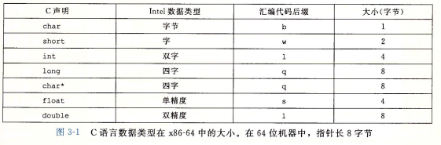

大多说GCC生成的汇编代码指令都有一个字符的后缀，表明操作数的大小。后缀l表示双字，32位被看成是长字long word。后缀l可以表示4字节整数和8字节双精度浮点数，但是并没有
歧义，因为浮点数使用的是一组完全不同的指令和寄存器。

## 访问信息

x86-64的CPU包含一组16个存储64位值的通用目的寄存器，用来存储整数数据和指针。

### 操作数指示符
大多数指令有一个或多个操作数，指示出执行一个操作中要 使用的源数据值以及放置结果的目的位置。

不同操作数可能被分为三种类型：

- 立即数，用来表示常数
- 寄存器，表示某个寄存器的内容
- 内存引用，它会根据计算出来的地址访问某个内存位置

### 数据传送指令

- movb 传送字节
- movw 传送字
- movl 传送双字
- movq 传送四字
- movabsq 传送绝对的四字

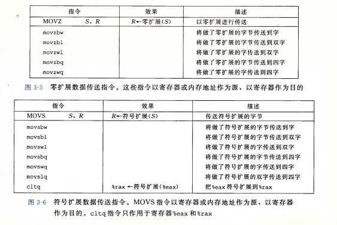

MOVZ类中的指令把目的中剩余的字节填充为0，MOVS类中的指令通过符号扩展来填充，把源操作的最高位进行复制。

### 压入和弹出栈数据

栈指针%rsp保存着栈顶元素的地址

- pushq 将四字压入栈
- popq 将四字弹出栈

将一个四字值压入栈中，首先要将栈指针减8，然后将值写到新的栈顶地址。

弹出一个四字的操作包括从栈顶位置读出数据，然后将栈指针加8。

## 算数和逻辑操作

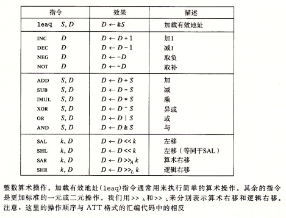

### 加载有效地址
加载有效地址load effactive address，leaq，从内存读数据到寄存器，但是实际上它根本没有引用内存，它的第一个操作数看上去是一个内存引用，但该指令并不是从指定的位置读入数据，而是将有效地址写入到目的操作数。

### 一元和二元操作

一元操作，只有一个操作数，既是源又是目的。这个操作数可以是一个寄存器，也可以是一个内存位置。比如incq(%rsp)会使栈顶的8字节元素加1。

二元操作，第二个操作数既是源又是目的。
### 移位操作

位移操作，先给出位移量，然后第二项给出的是要移位的数。

### 特殊的算术操作

16字节的数称为8字oct word。

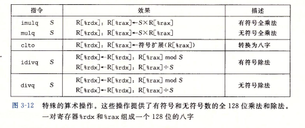

## 控制

机器代码提供基本的低级机制来实现有条件的行为：测试数据值，然后根据测试的结果来改变控制流或者数据流。

jump指令合一改变一组机器代码指令的执行顺序。

### 条件码

CPU还维护着一组单个位的条件码寄存器，描述最近的算术或逻辑操作的属性，可以检测这些寄存器来执行条件分支指令。常用条件码有：

- CF进位标志，最近的操作使最高位产生了进位，可用来检查无符号操作的溢出。
- ZF零标志，最近的操作得出的结果为0。
- SF符号标志，最近的操作得到的结果为负数。
- OF溢出标志，最近的操作导致一个补码溢出，正溢出或负溢出。

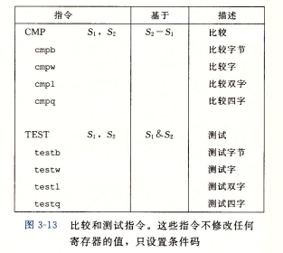

CMP指令根据两个操作数之差来设置条件码，不更新目的寄存器。

### 访问条件码
条件码通常不会直接读取，通常使用的方法有三种：

1. 可以根据条件码的某种组合，将一个字节设置为0或者1。
2. 可以条件跳转到程序的某个其他部分。
3. 可以有条件的传送数据。

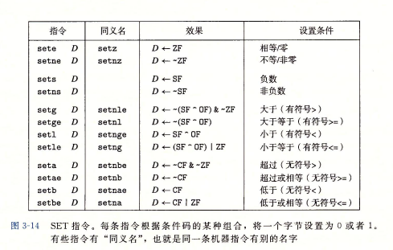

### 跳转指令
跳转jump指令会导致执行切换到程序中一个全新的位置。

jmp指令是无条件跳转，可以是直接跳转，也可以是间接跳转。

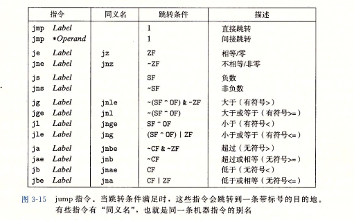

### 跳转指令的编码

当执行PC相对寻址时，程序计数器的值是跳转指令后面的那条指令的地址，而不是跳转指令本身的地址。

### 用条件控制来实现条件分支
### 用条件传送来实现条件分支

这种方法计算一个条件操作的两种结果，然后再根据条件是否满足从中选取一个。

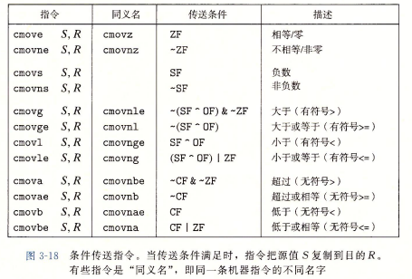

### 循环

do-while，while，for，汇编中没有相应的指令存在，可以用条件测试和跳转组合起来实现循环的效果。

### switch语句

跳转表是一个数组，表项i是一个代码段的地址，这个代码段实现当开关所以in值等于i时程序应该采取的动作。

## 过程
过程的形式多样：函数function，方法method，子例程subroutine，处理函数handler。
### 运行时栈

x86-64的栈向低地址方向增长，而栈指针%rsp指向栈顶元素，可以用pushq和popq指令将数据存入栈中或是从栈中取出。

当x86-64过程需要的存储空间超出寄存器能够存放的大小时，就会在栈上分配空间，这部分成为过程的栈帧stack fram。

过程P可以传递最多6反而整数值，也就是指针和整数，但是如果Q需要更多的参数，P可以在调用Q之前在自己的栈帧里存储好这些参数。	

### 转移控制
将控制从函数P转移到Q，只需把程序计数器PC设置为Q的代码的起始位置，当从Q返回的时候，处理器必须记录好它需要继续P的执行的代码的位置，在x86-64机器中，这个信息是用指令call Q调用过程Q来记录的。该指令会把地址A压入栈中，并将PC设置为Q的其实地址，压入的地址A称为返回地址，是紧跟在call指令后面的那条指令的地址。指令ret会从栈中弹出地址A，并把PC设置为A。

call指令有一个目标，指明被调用过程起始的指令地址，调用可以是直接的，也可以是间接的。

### 数据传送

x86-64中大部分过程间的数据传送是通过寄存器实现的。

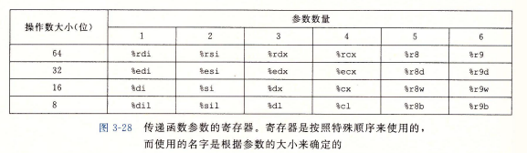

如果一个函数有大于6个整形参数，超出6个的部分就要通过栈来传递。通过栈传递参数时，所有数据大小都向8的倍数对齐。

### 栈上的局部存储

有时候局部数据需要放在内存中，常见情况包括：

- 寄存器不足够存放所有的本地数据。
- 对一个局部变量使用地址运算符&，因此必须能够为它产生一个地址。
- 某些局部变量是数组或结构，因此必须能通过数据或结构引用被访问到。

一般来说，过程通过减小栈指针在栈上分配空间。分配的结果作为栈帧的一部分，标号为局部变量。

### 寄存器中的局部存储空间

寄存器组是唯一被所有过程共享的资源。

### 递归过程
## 数组分配和访问
### 基本原则
### 指针运算
### 嵌套的数组
### 定长数组
### 变长数组
## 异质的数据结构
### 结构
struct，类似于数组的实现，结构中所有组成部分都放在内存中一段连续的区域内，指向结构的指针就是结构第一个字节的地址。

### 联合
union
### 数据对齐
## 在机器级程序中将控制于数据结合起来
### 内存越界引用和缓冲区溢出
### 对抗缓冲区溢出攻击

- 栈随机化
- 栈破坏检测
- 限制可执行代码区域

### 支持变长栈帧

为了管理变长栈帧，x86-64代码使用寄存器%rbp作为帧指针，或者基指针。

## 浮点代码
### 浮点传送和转换操作
### 过程中的浮点代码
### 浮点运算操作
### 定义和使用浮点常数
### 在浮点代码中使用位级操作
### 浮点比较操作

# 处理器体系结构
一个处理器支持的指令和指令的字节级编码称为它的指令集体系结构（Instruction-Set Architecture，ISA）。

## Y86-64指令集体系结构
### 程序员可见状态
Y86-64程序中的每条指令都会读取或修改处理器状态的某些部分，这称为程序员可见状态。
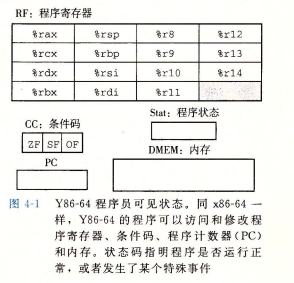

每个程序寄存器存储一个64位的字。寄存器%rsp被入栈、出栈、调用和返回指令作为栈指针，除此之外寄存器没有固定的含义或固定值。条件码ZF、SF、OF保存着最近的算术或逻辑指令所造成影响的有关信息。程序计数器PC存放当前正在执行指令的地址。

内存从概念上说是一个很大的字节数组，保存着程序和数据。Y86-64程序用虚拟地址来引用内存位置。硬件和操作系统软件联合起来将虚拟地址翻译成实际或物理地址，指明数据实际存在内存中哪个地方。

状态码Stat表明程序执行的总体状态，会指示是正常运行还是出现了某种异常。

### Y86-64指令

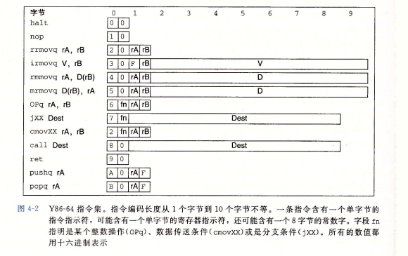

- movq指令分成了4个不同指令：irmovq，rrmovq，mrmovq，rmmovq，分别显式的指明源和目的的格式，源可以时立即数i，寄存器r，内存m。指令名字第一个字母表明源的类型。目的可以是寄存器或内存，第二个字母指明了目的类型。
- 有4个整数操作指令，addq、subq、andq、xorq，只对寄存器数据进行操作。这些指令会设置三个条件码，ZF零，SF符号，OF溢出。
- 7个跳转指令，jmp，jle，jl，je，jne，jge，jg。根据指令的类型和条件代码的设置来选择分支。
- 6个条件传送指令，cmovle，cmovl，cmove，cmovne，cmovge，cmovq。这些指令的格式与寄存器-寄存器传送指令rrmovq一样，但是只有当条件码满足所需要的约束时，才会更新目的寄存器的值。
- call指令将返回地址入栈，然后跳转到目的地址，ret指令从这样的调用中返回。
- pushq和popq指令实现了入栈和出栈。
- halt指令停止指令的执行，执行halt指令会导致处理器停止，并将状态码设置为HLT。

### 指令编码

每条指令需要1-10个字节不等。每条指令的第一个字节表明指令的类型，这个字节分为两个部分，高4位是代码code部分，低4位是功能function部分。

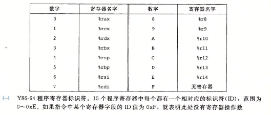

15个程序寄存器中每一个都有一个相对应的范围在0到0xE之间的寄存器标识符Register ID。

### Y86-64异常

状态码：AOK表示程序执行正常，其他的代码表示发生了某种类型的异常。HLT表示处理器执行了一条halt指令。ADR表示处理器试图从一个非法内存地址读或者向一个非法内存地址写。INS表示遇到了非法的指令代码。

## 逻辑设计和硬件控制语言HCL

大多数现代电路技术都是用信号线上的高电压或低电压来表示不同的位值，当前技术中，逻辑1是用1.0伏特左右的高电压表示的，逻辑0是用0.0伏特左右的低电压表示的。

实现一个数字系统，需要三个主要组成部分：计算对位进行操作的函数的组合逻辑，存储位的存储器单元，控制存储器单元更新的时钟信号。

### 逻辑门

逻辑门是数字电路的基本计算单元。

### 组合电路和HCL布尔表达式

将很多的逻辑门组合成一个网，就能构建计算块，成为组合电路。

### 字级的组合电路和HCL整数表达式

算术/逻辑单元ALU。

### 集合关系

### 存储器和时钟

组合电路从本质上讲，不存储任何信息。相反，它们只是简单的 相应输入信号，产生等于输入的某个函数的输出。为了产生时序电路，也就是有状态并且在这个状态上进行计算的系统，我们必须引入按位存储信息的设备。存储设备都是由同一个时钟控制的，时钟是一个周期性信号，决定什么时候要把新值加载到设备中。

- 时钟寄存器，存储单个位或字，时钟信号控制寄存器加载输入值。
- 随即访问存储器，存储多个字，用地址来选择该读或写哪个字。

## Y86-64的顺序实现

### 将处理组织成阶段

- 取指fetch，取指阶段从内存读取指令字节，地址为程序计数器PC的值，从指令中抽取出指令指示符字节的两个四位部分，称为icode指令代码和ifun指令功能。
- 译码decode，译码阶段从寄存器文件读入最多两个操作数。
- 执行execute，在执行阶段，算术/逻辑单元ALU要么执行指令指明的操作，计算内存引用的有效地址，要么增加或减少指针。
- 访存memory，访存阶段可以将数据写入内存，或者从内存读出数据。
- 写回write back，写回阶段最多可以写两个结果到寄存器文件。
- 更新PC PC update，将PC设置成下一条指令的地址。

### SEQ硬件结构

## 流水线的通用原理

（未完成）

# 优化程序性能

（跳过）

# 存储器层次结构

## 存储技术

### 随机访问存储器

随机访问存储器分为：静态SRAM和动态DRAM，静态比动态更快，静态用来做为高速缓存存储器，可以在CPU芯片上，也可以在片下。DRAM用来作为主存以及图形系统的帧缓冲区。

1. 静态RAM将每个位存储在一个双稳态存储器单元里。
2. 动态RAM将每个位存储为对一个电容的充电。
3. 传统的DRAM。
4. 内存模块。
5. 增强的DRAM。
6. 非易失性存储器。
7. 访问主存，每次CPU和主存之间的数据传送都是通过一系列步骤来完成的，这些步骤称为总线事务，读事务从主存传送数据到CPU，写事务从CPU传送数据到主存。

### 磁盘存储

1. 磁盘构造
2. 磁盘容量
3. 磁盘操作
4. 逻辑磁盘块
5. 连接I/O设备
6. 访问磁盘

### 固态硬盘

## 局部性

时间局部性和空间局部性。

### 对程序数据引用的局部性

### 取指令的局部性

## 存储器层次结构

### 存储器层次结构中的缓存

缓存。

# 链接

## 编译器驱动程序

## 静态链接

为了构造可执行文件，链接器必须要完成两个任务：

- 符号解析，目标文件定义和引用符号，每个符号对应于一个函数、一个全局变量或一个静态变量。符号解析的目的是将每个符号引用正好和一个符号定义关联起来。
- 重定位。

## 目标文件

- 可重定位目标文件，包含二进制代码和数据，其形式可以在编译时与其他可重定位目标文件合并起来，创建一个可执行目标文件。
- 可执行目标文件，包含二进制代码和数据，其形式可以被直接复制到内存并执行。
- 共享目标文件 ，一种特殊类型的可重定位目标文件，可以在加载或者运行时被动态的加载进内存并链接。

编译器和汇编器生成可重定位目标问价。链接器生成可执行目标文件。

## 可重定位目标文件

