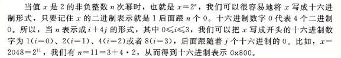
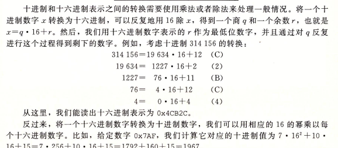

# 计算机系统漫游
## 信息就是位+上下文
## 程序被其他程序翻译成不同的格式
预处理器、编译器、汇编器、链接器一起构成了编译系统。

- 预处理阶段，预处理器cpp会修改原始的C程序，比如会把`#include <stdio.h>`命令告诉预处理器读取系统头文件stdio.h的内容，并插入程序文本中，得到了另一个c程序，通常以.i为扩展名
- 编译阶段，编译器ccl将.i文件翻译成.s文件，包含一个汇编语言程序。
- 汇编阶段，汇编器as会将.s翻译成机器语言指令，把这些指令打包成一种叫做可重定位目标程序的格式，并将结果保存在目标.o文件中。.o文件是一个二进制文件。
- 链接阶段，链接器ld负责将程序中调用标准库的函数同函数所在的预编译文件进行链接，得到一个可执行的目标文件，此文件可以被加载到内存中，由系统执行。

## 了解编译系统如何工作是大有益处的
## 处理器读并解释存储在内存中的指令
### 系统的硬件组成

1. 总线，它携带信息字节并负责在各个部件间传递。
2. I/O设备，每个I/O设备都通过一个控制器或适配器与I/O总线相连。控制器是I/O设备本身或系统的主板上的芯片组，适配器是一块插在主板插槽上的卡。
3. 主存，是临时存储设备。物理上来说，主存是一组动态随机存取存储器DRAM芯片组成的。从逻辑上说，存储器是一个线性的字节数组，每个字节都有其唯一的地址，地址从零开始。
4. 处理器，CPU，是解释或执行存储在主存中指令的引擎，处理器核心是一个大小为一个字的存储设备（寄存器），称为程序计数器PC，任何时刻PC都指向主存中某条机器语言指令。

例子，CPU在指令的要求下可能会执行这些操作：

- 加载：从主存复制一个字节或一个字到寄存器，以覆盖寄存器原来的内容。
- 存储：从寄存器复制一个字节或一个字到主存的某个位置，以覆盖原来的内容。
- 操作：把两个寄存器的内容复制到ALU，ALU对这两个字做算术运算，并将结果放到一个寄存器中，以覆盖该寄存器中原来的内容。
- 跳转：从指令本身中抽取一个字，并将这个子复制到程序计数器PC中，以覆盖PC中原来的值。

### 执行hello程序

## 高速缓存至关重要
## 存储设备形成层次结构
### 进程
进程是操作系统对一个正在运行的程序的一种抽象。
### 线程
### 虚拟内存

- 程序代码和数据
- 堆
- 共享库
- 栈
- 内核虚拟内存

### 文件
文件就是字节序列。

## 系统之间利用网络通信

## 重要主题
### 并发和并行

1. 线程级并发
2. 指令级并行
3. 单指令、多数据并行

# 信息的表示和处理

- 无符号（unsigned）编码基于传统的二进制表示法，表示大于或者等于零的数字。
- 补码（two's-complement）编码是表示有符号整数的最常见方式，有符号整数就是可以为正或者为负的数字。
- 浮点数（floating-point）编码是表示实数的科学计数法以2为基数的版本。

## 信息存储
大多数计算机使用8位的块或者字节（byte）作为最小的可寻址的内存单位，而不是访问内存中单独的位。

机器级程序将内存视为一个非常大的字节数组，称为虚拟内存，内存的每个字节都由一个唯一的数字来标识，称为它的地址，所有的可能地址的集合就成为虚拟地址空间。

### 十六进制表示法
一个字节由8位组成，二进制表示法的值域是00000000~11111111，十进制表示法的值域是0-255。十六进制表示法的值域是00-FF。

### 字数据大小
每台计算机都由一个字长word size，指明指针数据的标称大小。虚拟地址是以这样的字来编码的，所以字长决定的最重要的系统参数就是虚拟地址空间的最大大小。

### 寻址和字节顺序

- 最低有效字节在最前的方式，称为小端法little endian。
- 最高有效字节在最前的方式，称为大端法big endian。

### 表示字符串
### 表示代码
### 布尔代数简介
### C语言中的位级运算
### C语言中的逻辑运算
### C语言中的位移运算
`x<<k`表示x向左移动k位，丢弃最高的k位，并在右端补k个0。

`x>>k`右移运算，逻辑右移或算数右移。逻辑右移在左端补齐k个0，算术右移是在左端补k个最高有效位的值。

Java中`x>>k`是算术右移，`x>>>k`是逻辑右移

## 整数表示
### 整型数据类型
### 无符号数的编码
### 补码编码
有符号数的计算机表示方式就是补码形式。字节的最高有效位解释为负权。最高有效位称为符号位，符号位被设置为1时，表示值为负，设置为0时，值为非负。

### 有符号数和无符号数之间的转换
（未完成）

### C语言中的有符号数与无符号数
C语言支持所有整形数据类型的有符号和无符号运算。大多数数字都默认为是有符号的。

printf输出数值时，%d表示有符号十进制，%u表示无符号十进制，%x表示十六进制格式。

### 扩展一个数字的位表示
要将一个无符号数转换为一个更大的数据类型，只要简单的在表示的开头添加0，这种运算称为零扩展。

（未完成）

## 整数运算
（未完成）

## 浮点数
（未完成）

# 程序的机器级表示
## 程序编码
### 机器级代码

## 数据格式
字word表示16位数据类型，32位数为双字double words，64位数为四字quad words。

在64位机器中指针长8字节。
!()[3.3.png]

大多说GCC生成的汇编代码指令都有一个字符的后缀，表明操作数的大小。后缀l表示双字，32位被看成是长字long word。后缀l可以表示4字节整数和8字节双精度浮点数，但是并没有
歧义，因为浮点数使用的是一组完全不同的指令和寄存器。

## 访问信息

x86-64的CPU包含一组16个存储64位值的通用目的寄存器，用来存储整数数据和指针。

### 操作数指示符
大多数指令有一个或多个操作数，指示出执行一个操作中要 使用的源数据值以及放置结果的目的位置。

不同操作数可能被分为三种类型：

- 立即数，用来表示常数
- 寄存器，表示某个寄存器的内容
- 内存引用，它会根据计算出来的地址访问某个内存位置

### 数据传送指令

- movb 传送字节
- movw 传送字
- movl 传送双字
- movq 传送四字
- movabsq 传送绝对的四字

!()[3.4.2.png]

MOVZ类中的指令把目的中剩余的字节填充为0，MOVS类中的指令通过符号扩展来填充，把源操作的最高位进行复制。

### 压入和弹出栈数据

栈指针%rsp保存着栈顶元素的地址

- pushq 将四字压入栈
- popq 将四字弹出栈

将一个四字值压入栈中，首先要将栈指针减8，然后将值写到新的栈顶地址。

弹出一个四字的操作包括从栈顶位置读出数据，然后将栈指针加8。

## 算数和逻辑操作

!()[3.5.png]

### 加载有效地址
加载有效地址load effactive address，leaq，从内存读数据到寄存器，但是实际上它根本没有引用内存，它的第一个操作数看上去是一个内存引用，但该指令并不是从指定的位置读入数据，而是将有效地址写入到目的操作数。

### 一元和二元操作

一元操作，只有一个操作数，既是源又是目的。这个操作数可以是一个寄存器，也可以是一个内存位置。比如incq(%rsp)会使栈顶的8字节元素加1。

二元操作，第二个操作数既是源又是目的。
### 移位操作

位移操作，先给出位移量，然后第二项给出的是要移位的数。

### 特殊的算术操作

16字节的数称为8字oct word。

!()[3.5.5.png]

## 控制

机器代码提供基本的低级机制来实现有条件的行为：测试数据值，然后根据测试的结果来改变控制流或者数据流。

jump指令合一改变一组机器代码指令的执行顺序。

### 条件码

CPU还维护着一组单个位的条件码寄存器，描述最近的算术或逻辑操作的属性，可以检测这些寄存器来执行条件分支指令。常用条件码有：

- CF进位标志，最近的操作使最高位产生了进位，可用来检查无符号操作的溢出。
- ZF零标志，最近的操作得出的结果为0。
- SF符号标志，最近的操作得到的结果为负数。
- OF溢出标志，最近的操作导致一个补码溢出，正溢出或负溢出。

!()[3.6.1.png]

CMP指令根据两个操作数之差来设置条件码，不更新目的寄存器。

### 访问条件码
条件码通常不会直接读取，通常使用的方法有三种：

1. 可以根据条件码的某种组合，将一个字节设置为0或者1。
2. 可以条件跳转到程序的某个其他部分。
3. 可以有条件的传送数据。
### 跳转指令
跳转jump指令会导致执行切换到程序中一个全新的位置。
### 跳转指令的编码
### 用条件控制来实现条件分支
### 用条件传送来实现条件分支
### 循环
### switch语句

## 过程
过程的形式多样：函数function，方法method，子例程subroutine，处理函数handler。
### 运行时栈
### 转移控制
将控制从函数P转移到Q，只需把程序计数器PC设置为Q的代码的起始位置，当从Q返回的时候，处理器必须记录好它需要继续P的执行的代码的位置，在x86-64机器中，这个信息是用指令call Q调用过程Q来记录的。该指令会把地址A压入栈中，并将PC设置为Q的其实地址，压入的地址A称为返回地址，是紧跟在call指令后面的那条指令的地址。指令ret会从栈中弹出地址A，并把PC设置为A。

### 数据传送
### 栈上的局部存储
有时候局部数据需要放在内存中，常见情况包括：

- 寄存器不足够存放所有的本地数据。
- 对一个局部变量使用地址运算符&，因此必须能够为它产生一个地址。
- 某些局部变量是数组或结构，因此必须能通过数据或结构引用被访问到。

### 寄存器中的局部存储空间
寄存器组是唯一被所有过程共享的资源。

### 递归过程
## 数组分配和访问
### 基本原则
### 指针运算
### 嵌套的数组
### 定长数组
### 变长数组
## 异质的数据结构
### 结构
struct，类似于数组的实现，结构中所有组成部分都放在内存中一段连续的区域内，指向结构的指针就是结构第一个字节的地址。

### 联合
union
### 数据对齐
## 在机器级程序中将控制于数据结合起来
### 内存越界引用和缓冲区溢出
### 对抗缓冲区溢出攻击

- 栈随机化
- 栈破坏检测
- 限制可执行代码区域

### 支持变长栈帧
## 浮点代码
### 浮点传送和转换操作
### 过程中的浮点代码
### 浮点运算操作
### 定义和使用浮点常数
### 在浮点代码中使用位级操作
### 浮点比较操作

