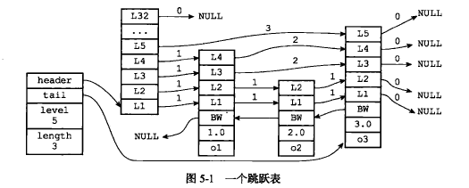

跳表skiplist是一种有序数据结构，在每个节点维持指向其他节点的指针，可以达到快速访问节点的目的。可以认为跳表在原有的有序链表上增加了多级索引，通过索引就可以快速查找。跳表的查找、插入、删除事件复杂度都是O(log n)，还可以实现区间查找。

Redis的有序集合的底层实现使用了跳表。

# Redis为什么使用跳表而不使用红黑树

- 在查找、插入、删除、有序输出元素，跳表和红黑树都可以完成，并且时间复杂度都是O(long n)。
- 查找区间内的元素红黑树效率没有跳表高。跳表只需要定位两个端点在最低层级的位置，然后遍历元素；红黑树定位到端点后，需要每次从首位置开始查找元素。
- 红黑树实现也很复杂，跳表实现简单。

# 跳表的实现

Redis跳表由两个结构组成：zskiplistNode表示跳表节点、zskiplist保存跳表节点相关信息：

```c
struct zskiplist {
  // 表头节点和表尾节点
  struct zskiplistNode *header， *tail;
  
  // 表中节点的数量
  unsigned long length;
  
  // 表中层数最大的节点的层数
  int level;
}

struct zskiplistNode {
  // level数组，层
  struct zskiplistLevel {
    // 前进指针
    struct zskiplistNode *forward;
    
    // 跨度
    unsigned int span;
  } level[];
  
  // 后退指针
  struct zskiplistNode *backward;
  
  // 分值
  double score;
  
  // 成员对象
  robj *obj;
  
}
```



zskiplist：

- header指向跳表头节点
- tail指向跳表尾节点
- level表示跳表内层数最大的节点层数，表头节点层数不计算在内
- length表示跳表长度、包含节点的数量，不包含表头节点

zskiplistNode：

- level，层，每个层有两个属性：前进指针和跨度，前进指针指向表尾方向的其他的节点；跨度记录了前进至真所指向节点和当前结点的距离
- backward，指向当前节点的前一个节点，用于从表尾向表头遍历时使用
- score，分值，各个结点的分值从小到大排列
- obj，成员对象。