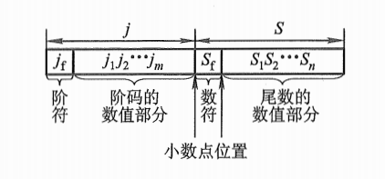
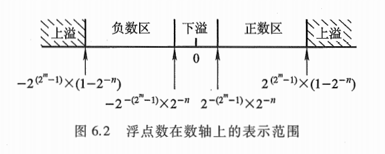
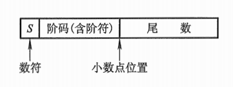

# 第一章 计算机系统概论

## 1.2 计算机的基本组成

### 1.2.1 冯诺依曼计算机的特点

冯诺依曼机的特点如下：

- 计算机由运算器、存储器、控制器、输入设备和输出设备五大部件组成。

- 指令和数据以同等地位存放于存储器内，并可按地址寻访。

- 指令和数据均用二进制数表示。

- 指令由操作码和地址码组成，操作码用来表示操作的性质，地址码用来表示操作数在存储器中的位置。

- 指令在存储器内按顺序存放。通常，指令是顺序执行的，在特定条件下，可根据运算结果或根据设定的条件改变执行顺序。

- 机器以运算器为中心，输入输出设备与存储器间的数据传送通过运算器完成。

### 1.2.2 计算机的硬件框图

典型的冯诺依曼计算机是以运算器为中心的。现代的计算机已转化为以存储器为中心。

各部件功能如下：

- 运算器：用来完成算术运算和逻辑运算，并将运算的中间结果暂存在运算器内。

- 存储器：用来存放数据和程序。

- 控制器：用来控制、指挥程序和数据的输入、运行以及处理运算结果。

- 输入设备：用来将人们熟悉的信息形式转换为机器能识别的信息形式，常见的有键盘、鼠标等。

- 输出设备：可将机器运算结果转换为人们熟悉的细细形式，如打印机输出、显示器输出等。

运算器和控制器通常将它们合起来统称为中央处理器（Central Processing Unit，CPU）。把输入设备与输出设备简称为I/O设备（Input/Output Equipment）。

现代计算机可认为由三大部分组成：CPU、I/O设备及主存储器（Main Memory，MM）。CPU与主存储器合起来又可成为主机，I/O设备又可成为外部设备。

主存储器是存储器子系统中的一类，用来存放程序和数据，可以直接与CPU交换信息。另一类称为辅助存储器，简称辅存，又称外存。

算术逻辑单元（Arithmetic Logic Unit，ALU）简称算逻部件，用来完成算术逻辑运算。控制单元（Control Unit，CU）用来解释存储器中的指令，并发出各种操作命令来执行指令。ALU和CU是CPU的核心部件。

I/O设备也受CU控制，用来完成相应的输入、输出操作。

### 1.2.3 计算机的工作步骤

#### 主存储器

主存储器（简称主存或内存），包括：存储体M、各种逻辑部件、控制电路等。

存储体由许多存储单元组成，每个存储单元又包含若干个存储元件（或称存储基元、存储元），每个存储元件能寄存一位二进制代码0或1。

一个存储单元可存储一串二进制代码，称这串二进制代码为一个存储字，这串二进制代码的位数称为存储字长。存储字长可以是8位、16位或32位等。

可以赋予每个存储单元一个编号，称为存储单元的地址号。

主存的工作方式就是按存储单元的地址号来实现对存储字各位的存（写入）、取（读出）。这种存取方式称为按地址存储方式，即按地址访问存储器（简称访存）。

为了能实现按地址访问的方式，主存中还必须配置两个寄存器MAR和MDR。MAR（Memory Address Register）是存储器地址寄存器，用来存放欲访问的存储单元的地址，其位数对应存储单元的个数（如MAR为10位，则有2^10=1024个存储单元，记为1K）。MDR（Memory Data Register）是存储器数据寄存器，用来存放从存储体某单元取出的代码或准备往某存储单元存入的代码，其位数与存储字长相等。

#### 运算器

运算器最少包括3个寄存器（现代计算机内部往往设有通用寄存器组）和一个算术逻辑单元（ALU）。其中ACC（Accumulator）为累加器，MQ（Multiplier-Quotient Register）为乘商寄存器，X为操作数寄存器。

运算器加、减、乘、除四则运算的操作过程，假设：

- M表示存储器的任一地址号

- [M]表示对应M地址号单元中的内容

- X表示X寄存器

- [X]表示X寄存器中的内容

- ACC表示累加器

- [ACC]表示累加器中的内容

- MQ表示乘商寄存器

- [MQ]表示乘商寄存器中的内容

假设ACC中已存有前一时刻的运算结果，并作为下述运算中的一个操作数。

加法操作过程为：

```
[M] -> X
[ACC] + [X] -> ACC
```

即将[ACC]看作被加数，先从主存中取一个存放在M地址号单元内的加数[M]，送至运算器的X寄存器中，然后将被加数[ACC]与加数[X]相加，结果（和）保留在ACC寄存器中。

减法操作过程为：

```
[M] -> X
[ACC] - [X] -> ACC
```

即将[ACC]看作被减数，先取出存放在主存M地址号单元中的减数[M]并送入X，然后[ACC]-[X]，结果（差）保留在ACC寄存器中。

乘法操作过程为：

```
[M] -> MQ
[ACC] -> X
0 -> ACC
[X] x [MQ] -> ACC//MQ（//表示两个寄存器串接）
```

即将[ACC]看作被乘数，先取出存放在主存M号地址单元中的乘数[M]并送入乘商寄存器MQ，再把被乘数送入X寄存器，并将ACC清0，然后[X]和[MQ]相乘，结果（积）的高位保留在ACC中，低位保留在MQ中。

除法操作过程为：

```
[M] -> X
[ACC] / [X] -> M
余数R在ACC中
```

即将[ACC]看作被除数，先取出存放在主存M号地址单元内的除数[M]并送至X寄存器，然后[ACC]除以[X]，结果（商）暂留于MQ，[ACC]为余数R。

#### 控制器

控制器首先要命令存储器读出一条指令，称为取指过程（也称取指阶段）。

接着，它要对这条指令进行分析，指出该指令要完成什么样的操作，并按寻址特征指明操作数的地址，称为分析过程（也称分析阶段）。

最后根据操作数所在的地址以及指令的操作码完成某种操作，称为执行过程（也称执行阶段）

控制器由程序计数器（Program Counter，PC）、指令寄存器（Instruction Register，IR）以及控制单元（CU）组成。

PC用来存放当前欲执行指令的地址，它与主存的MAR之间有一条直接通路，具有自动加1的功能，即可自动形成下一条指令的地址。

IR用来存放当前的指令，IR的内容来自主存的MDR。IR中的操作码OP送至CU，用来分析指令；地址码Ad作为操作数的地址送至存储器的MAR。

CU用来分析当前指令所需完成的操作，并发出各种微操作命令序列，用以控制所有被控对象。

#### I/O

I/O子系统包括各种I/O设备及其相应的接口。每一种I/O设备都由I/O接口与主机联系，它接收CU发出的各种控制命令，并完成相应的操作。

## 1.3 计算机硬件的主要技术指标

### 1.3.1 机器字长

机器字长是指CPU一次能处理数据的位数，通常与CPU的寄存器位数有关。字长越长，数的表示范围越大，精度也越高。

### 1.3.2 存储容量

存储容量包括：主存容量、辅存容量。

主存容量是指主存中存放二进制代码的总位数，即：存储容量 = 存储单元个数 x 存储字长。

MAR的位数反映了存储单元的个数，MDR的位数反应了存储字长。例如，MAR为16位，即存储体内的存储单元个数为2^16=65535个（即64K个存储字，1K=1024=2^10）；MDR为32位，表示存储容量为2^16 x 32=2^21 = 2M位（1M=2^20）。

现代计算机中常以字节数来描述容量的大小，一个字节被定义为8位二进制代码。例如，上述存储容量为2M位，也可以用2^18字节表示，记作2^18B或256KB（B用来表示一个字节）。

辅存容量通常用字节数来表示。

### 1.3.3 运算速度

计算机的运算速度与许多因素有关，如机器的主频、执行什么样的操作、主存本身的速度等都有关。

衡量运算速度的方法：

- 完成一次加法或乘法所需的时间，即普通法

- 吉普森法，综合考虑每条指令执行时间以及它们在全部操作中所占的百分比

- 时间单位内执行指令的平均条数，并用MIPS（Million Instruction Per Second，百万条指令每秒）作为计量单位

- CPI（Cycle Per Instruction）即执行一条指令所需的时钟周期数

- FLOPS（Floating Point Operation Per Second）浮点运算次数每秒

# 第3章 系统总线

## 3.1 总线的基本概念

计算机五大部件之间的互连方式有两种：

- 各部件之间使用单独的连线，称为分散连接

- 各部件连接到一组公共信息传输线上，称为总线连接

总线实际上是由许多传输线或通路组成，每条线可一位一位的传输二进制代码，若干条传输线可以同时传输若干位二进制代码。例如，16条传输线组成的总线可同时传输16位二进制代码。

连接CPU和主存的总线，称为存储总线（M总线）；建立CPU和各I/O设备之间交换信息的通道，称为输入输出总线（I/O总线）。

## 3.2 总线的分类

### 3.2.1 片内总线

片内总线是指芯片内部的总线，如在CPU芯片内部，寄存器与寄存器之间、寄存器与算术逻辑单元ALU之间都由片内总线连接。

### 3.2.2 系统总线

系统总线是指CPU、主存、I/O设备（通过I/O接口）各大部件之间的信息传输线。由于这些部件通常安放在主办或各个插件板（插卡）上，故又称板级总线或板间总线。

系统总线分三类：

- 数据总线：用来传输各功能部件之间的数据信息，是双向传输总线，其位数与机器字长、存储字长有关，一般为8位、16位或32位。数据总线的位数称为数据总线宽度。

- 地址总线：用来指出数据总线上的源数据或目的数据在主存单元的地址或I/O设备的地址。地址总线上的代码是用来指明CPU欲访问的存储单元或I/O端口的地址，由CPU输出，单向传输。地址线的位数与存储单元的个数有关，如地址线为20根，则对应存储单元的个数为2^20。

- 控制总线：用来发出各种控制信号的传输线。通常对任一控制线而言，它的传输是单向的。但对于控制总线总体来说，又可认为是双向的。控制总线还起到监视各部件状态的作用。对CPU而言，控制信号既有输出，又有输入。

常见的控制信号如下：

- 时钟：用来同步各种操作

- 复位：初始化所有部件

- 总线请求：表示某部件需获得总线使用权

- 总线允许：表示需要获得总线使用权的部件已获得了控制权

- 中断请求：表示某部件提出中断请求

- 中断响应：表示中断请求已被接收

- 存储器写：将数据总线上的数据写至存储器的指定地址单元内

- 存储器读：将指定存储器单元中的数据读到数据总线上

- I/O读：从指定的I/O端口将数据读到数据总线上

- I/O写：将数据总线上的数据输出到指定的I/O端口内

- 传输响应：表示数据已被接收，或已将数据送至数据总线上

### 3.2.3 通信总线

通信总线用于计算机系统之间或计算机系统与其他系统之间的通信。按照传输方式可分为两种：

- 串行通信

- 并行通信

## 3.3 总线特性及性能指标

### 3.3.1 总线特性

总线特性包括以下几项：

- 机械特性：指总线在机械连接方式上的一些性能，如插头与插座使用的标准，它们的几何尺寸、形状、引脚的个数以及排列的顺序，接头处的可靠接触等。

- 电气特性：指总线的每一根传输线上信号的传递方向和有效电平范围。通常规定由CPU发出的信号为输出信号，送入CPU的信号为输入信号。

- 功能特性：指总线中每根传输线的功能。例如：地址总线用来指出地址码；数据总线用来传递数据；控制总线发出控制信号等。

- 时间特性：指总线中的任一根线在什么时间内有效。每条总线上的各种信号互相存在一种有效时序的关系，因此时间特性一般可用信号时序图来描述。

### 3.3.2 总线性能指标

总线性能指标如下：

- 总线宽度：指数据总线的根数，用bit（位）来表示，如8位、16位、32位、64位（即8根、16根、32根、64根）。

- 总线带宽：指总线的传输速率，即单位时间内总线上传输数据的位数，通常用每秒传输信息的字节数来衡量，单位可用MBps（兆字节每秒）表示。例如，总线工作频率为33MHz，总线宽度位32位（4B），则总线带宽位33x(32/8)=132MBps。

- 时钟同步/异步：总线上的数据与时钟同步工作的总线称为同步总线；与时钟不同步工作的总线称为异步总线。

- 总线复用：一条信号线上分时传送两种信号。为了提高总线利用率，优化设计，将地址总线和数据总线共用一组物理线路，在这组物理线路上分时传输地址信号和数据信号，即为总线的多路复用。

- 信号线数：地址总线、数据总线和控制总线三种总线数的总和。

- 总线控制方式：包括突发工作、自动配置、仲裁方式、逻辑方式、计数方式等。

- 其他指标：负载能力、电源电压、总线宽度能否扩展等。

### 3.3.3 总线标准

流行的总线标准有以下几种：

- ISA总线

- EISA总线

- VESA（VL-BUS）总线

- PCI总线

- AGP总线

- RS-232C总线

- USB总线

## 3.4 总线结构

- 单总线结构

- 多总线结构

## 3.5 总线控制

### 3.5.1 总线判优控制

总线上所连接的各类设备，按其对总线有无控制功能可以分为：

- 主设备（模块）：对总线有控制权

- 从设备（模块）：对总线没有控制权，只能响应主设备发来的总线命令

总线上信息的传送是由主设备启动的，如某个主设备欲与另外一个设备（从设备）进行通信时，首先由主设备发出总线请求信号，若多个主设备同时要使用总线时，就由总线控制器的判优、仲裁逻辑按一定的优先等级顺序确定哪个主设备能使用总线。只有获得总线使用权的主设备才能开始传送数据。

总线判优控制分为两种：

- 集中式：将控制逻辑集中在一处（如CPU中）

- 分布式：将控制逻辑分散在与总线连接的各个部件或设备上

集中控制优先权仲裁方式有以下三种：

- 链式查询

- 计数器定时查询

- 独立请求方式

#### 链式查询

控制总线有：BS总线忙、BR总线请求、BG总线同意等线用于总线控制。其中总线同意信号BG是串行的从一个I/O接口送到下一个I/O接口。如果BG到达的接口由总线请求，BG信号就不再往下传，意味着该接口获得了总线控制权，并建立总线忙BS信号，表示它占用了总线。

在链式查询中，离总线控制部件最近的设备具有最高的优先级。特点：只需很少几根线就能按一定优先次序实现总线控制，容易扩充设备。但对电路故障很敏感，且优先级别低的设备可能很难获得请求。

#### 计数器定时查询

计数定时查询方式比链式查询多了一组设备地址线，少了一根总线同意线BG。总线控制部件接到由BR送来的总线请求信号后，在总线未被使用（BS=0）的情况下，总线控制部件中的计数器开始计数，并通过设备地址线向各设备发出一组地址信号。当某个请求占用总线的设备地址与计数值一致时，便获得总线使用权，此时终止计数查询。

特点：计数可从0开始，一旦设备优先次序固定，设备的优先级就按0-n的顺序降序排列，而且固定不变；计数也可以从上一次计数的终止点开始，即是一种循环方法，此时设备使用总线的优先级相等；计数器的初始值还可由程序设置，故优先次序可以改变。这种方式对电路故障不如链式查询方式敏感，但增加了控制线（设备地址）数，控制也较复杂。

#### 独立请求方式

每一台设备均有一对总线请求线BR和总线同意线BG。当设备要求使用总线时，便发出该设备的请求信号，总线控制部件中有一排队电路，可根据优先次序确定响应哪一台设备的请求。

特点：响应速度快，优先次序控制灵活（通过程序改变），但控制线数量多，总线控制更复杂。

### 3.5.2 总线通信控制

完成一次总线操作的时间称为总线周期。总线周期可分4个阶段：

1. 申请分配阶段：由需要使用总线的主模块（或主设备）提出申请，经总线仲裁机构决定下一传输周期的总线使用权授予某一申请者。

2. 寻址阶段：取得了使用权的主模块通过总线发出本次要访问的从模块（或从设备）的地址及有关命令，启动参与本次传输的从模块。

3. 传数阶段：主模块和从模块进行数据交换，数据由源模块发出，经数据总线流入目的模块。

4. 结束阶段：主模块的有关信息均从系统总线上撤除，让出总线使用权。

总线通信控制主要解决通信双方如何获知传输开始和传输结束，以及通信双方如何协调如何配合。通常用四种方式：

- 同步通信

- 异步通信

- 半同步通信

- 分离式通信

#### 同步通信

通信双方由统一时标控制数据传送，称为同步通信。时标通常由CPU的总线控制部件发出，送到总线上的所有部件；也可由每个部件各自的时序发生器发出，但必须由总线控制部件发出的时钟信号对它们进行同步。

同步通信优点是规定明确、统一，模块间的配合简单一致。缺点是主、从模块时间配合属于强制性同步，必须在限定时间内完成规定的要求。并且对所有从模块都用同一限时，对各不相同速度的部件而言，必须按最慢速度的那个部件来设计公共时钟，严重影响总线的工作效率，也给设计带来了局限性，缺乏灵活性。

同步通信一般用于总线长度较短、各部件存储时间比较一致的场合。

#### 异步通信

异步通信允许各模块速度的不一致性，没有公共的时钟标准，不要求所有部件严格的统一操作时间，而是采用应答方式（又称握手方式），即当主模块发出请求信号时，一直等待从模块反馈回来响应信号后才开始通信。需要主、从模块之间增加两条应答线（握手交互信号线）。

异步通信的应答方式可分为三种类型：

- 不互锁：主模块发出请求信号后，不必等待接到从模块的回答信号，而是经过一段时间，确认从模块已收到请求信号，便撤销其请求信号；从模块接到请求信号后，在条件允许时发出回答信号，并经过一段时间确认主模块已收到回答信号后，自动撤销回答信号。

- 半互锁：主模块发出请求信号后，必须待接到从模块的回答信号后再撤销其请求信号，有互锁关系；而从模块在接到请求信号后发出回答信号，但不必等待获知主模块的请求信号已经撤销，而是隔一段时间后自动撤销其回答信号，无互锁关系。

- 全互锁：主模块发出请求信号后，必须待从模块回答后再撤销其请求信号；从模块发出回答信号，必须待获知主模块请求信号已撤销后，再撤销其回答信号。

可用比特率来衡量异步串行通信的数据传输速率，即单位时间内传送二进制有效数据的位数，单位用bps表示。

#### 半同步通信

半同步通信保留了同步通信的基本特点，如所有地址、命令、数据信号的发出时间，都严格参照系统时钟的某个前沿开始，而接收方都采用系统时钟后沿时刻来进行判断识别；同时又像异步通信那样，允许不同速度的模块和谐工作。

半同步通信增加了等待响应信号线，采用插入时钟（等待）周期的措施来协调通信双方的配合问题。

半同步通信适用于系统工作速度不高但又包含了由许多工作速度差异较大的各类设备组成的简单系统。半同步通信控制方式比异步通信简单，系统内各模块在统一的系统时钟控制下工作，可靠性高，同步结构方便。缺点是对系统时钟频率不能要求太高，整体上看系统工作的速度不是很高。

#### 分离式通信

分离式通信方式基本思想是将一个传输周期（或总线周期）分解为两个子周期。在第一个子周期中，主模块A在获得总线使用权后将命令、地址以及其他有关信息，包括该主模块编号发到系统总线上，经总线传输后，由有关的从模块B接收下来。主模块A只占用总线很短时间，发送完就立即放弃总线使用权。在第二个子周期中，B模块收到A模块发来的命令信号后，经选择、译码、读取等内部操作，将A模块所需数据准备好，便由B模块申请总线使用权，一旦获准，B模块将A模块的编号、B模块的地址、A模块所需的数据等一系列信息送到总线上，供A模块接收。

分离式通信方式特点：

- 各模块要占用总线使用权都必须提出申请

- 在得到总线使用权后，主模块在限定时间内向对方传送信息，采用同步方式传送，不再等待对方的回答信号。

- 各模块在准备数据过程中都不占用总线，使总线可接受其他模块的请求。

- 总线被占用时都在做有效工作，不存在空闲等待时间。

缺点是这种方式比较复杂，一般在普通微型计算机系统很少采用。

# 第4章 存储器

## 4.1 概述

### 4.1.1 存储器分类

按存储介质分类：

- 半导体存储器

- 磁表面存储器

- 磁芯存储器

- 光盘存储器

按存取方式分类：

- 随机存储器（Random Access Memory，RAM）
  
  - 静态RAM
  
  - 动态RAM

- 只读存储器（Read Only Memory，ROM）

- 串行访问存储器

按在计算机中的作用分类：

- 主存储器

- 辅助存储器

- 缓冲存储器

## 4.2 主存储器

### 4.2.1 概述

主存储器简称主存。

根据MAR（存储器地址寄存器）中的地址访问某个存储单元时，还需经过地址译码、驱动等电路，才能找到所需访问的单元。读出时，需经过读出放大器，才能将被选中单元的存储字送到MDR（存储器数据寄存器）。写入时，MDR中的数据须经过写入电路才能写入被选中的单元中。

现代计算机主存由半导体集成电路构成。驱动器、译码器和读写电路在存储芯片中，而MAR和MDR在CPU芯片中。存储芯片和CPU芯片通过总线连接。

#### 主存中存储单元地址的分配

主存中各存储单元的空间位置是由单元地址号来表示的，地址总线是用来指出存储单元地址号的，根据该地址可读出或写入一个存储字。

不同机器的存储字长也不同，常用8位二进制数来表示一个字节，存储字长都取8的倍数。通常计算机系统既可按字寻址，也可按字节寻址。

#### 主存的技术指标

主存的主要技术指标是：

- 存储容量：主从能存放二进制代码的总位数，即 `存储容量 = 存储单元个数 x 存储字长`，也可用字节总数来表示，即 `存储容量 = 存储单元个数 x 存储字长 / 8`

- 存储速度：存储速度由存取时间和存取周期来表示
  
  - 存取时间，又称存储器的访问时间（Memory Access Time），是指启动一次存储器操作（读或写）到完成该操作所需的全部时间。分为读出时间和写入时间两种。读出时间是从存储器接收到有效地址开始，到产生有效输出所需的全部时间。写入时间是从存储器接收到有效地址开始，到数据写入被选中单元位置所需的全部时间。
  
  - 存储周期（Memory Cycle Time）指存储器进行连续两次独立的存储操作所需的最小间隔时间，通常存取周期大于存取时间。

- 存储器带宽：表示单位时间内存储器存取的信息量，单位可用字/秒或字节/秒或位/秒表示。为了提高存储器带宽，可采用如下措施：
  
  - 缩短存取周期
  
  - 增加存储字长，使每个存取周期可读/写更多的二进制位数
  
  - 增加存储体

### 4.2.2 半导体存储芯片简介

基本结构：半导体存储芯片采用超大规模集成电路制造工艺，在一个芯片内集成具有记忆功能的存储矩阵、译码驱动电路和读/写电路等。

- 译码驱动能把地址总线送来的地址信号翻译成对应存储单元的选择信号，该信号在读/写电路的配合下完成对被选中单元的读/写操作

- 读/写电路包括读出放大器和写入电路，用来完成读/写操作。

- 存储芯片通过地址总线、数据总线和控制总线与外部连接。

- 地址线是单向输入的，其位数与芯片容量有关。

- 数据线是双向的，其位数与芯片可读出或写入的数据位数有关。数据线的位数与芯片容量有关。

- 控制线主要有读/写控制线与片选线两种。读/写控制线决定芯片进行读/写操作，片选线用来选择存储芯片。

半导体存储芯片的译码驱动方式：

- 线选法：用一根字选择线（字线），直接选中一个存储单元的各位（如一个字节）。结构简单，但只适用于容量不大的存储芯片。

- 重合法：被选单元是由X、Y两个方向的地址决定

### 4.2.3 随机存取存储器

随机存取存储器可分为：

- 静态RAM

- 动态RAM

#### 静态RAM（Static RAM，SRAM）

存储器中用于寄存0和1代码的电路称为存储器的基本单元电路。

静态RAM是用触发器工作原理存储信息的，即使信息读出后，它仍保持其原状态，不需要再生。但电源掉电时，原存信息丢失，故它属于易失性半导体存储器。

不论是对存储器进行读操作还是写操作，在读周期和写周期内，地址线上的地址始终不变。

#### 动态RAM（Dynamic RAM，DRAM）

常见的动态RAM基本单元电路有三管式和单管式两种，它们的共同特点都是靠电容存储电荷的原理来寄存信息。若电容上存有足够多的电荷表示存1，电容上无电荷表示存0。

电容上的电荷一般只能维持1-2ms，因此即使电源不掉电，信息也会自动消失，为此，必须在2ms内对其所有存储单元恢复一次原状态，这个过程称为再生或刷新。

动态RAM比静态RAM具有集成度高、功耗更低的特点。

动态RAM的刷新：

刷新的过程实质上是先将原存信息读出，再由刷新放大器形成原信息并重新写入的再生过程。

须采用定时刷新方法，在一定时间内，对动态RAM的全部基本单元电路做一次刷新，一般取2ms，这个时间称为刷新周期，又称再生周期。刷新是一行行进行的，必须在刷新周期内由专门的刷新电路来完成对基本单元电路的逐行刷新。

通常有三种方式刷新：

- 集中刷新：在规定的一个刷新周期内，对全部存储单元集中一段时间逐行进行刷新，此刻必须停止读/写操作。不能进行读/写操作的时间称为死时间，又称访存死区，所占比率称为死时间率。

- 分散刷新：对每行存储单元的刷新分散到每个存取周期内完成。把机器的存取周期分成两段，前半段用来读/写或维持信息，后半段用来刷新。比允许的间隔2ms短的多，不存在停止读/写操作的死时间，但存取周期长了，整个系统速度降低了。

- 异步刷新：异步刷新是前两种方式的结合，既可缩短死时间，又充分利用最大刷新间隔2ms。

#### 动态RAM与静态RAM的比较

动态RAM比静态RAM应用广泛，原因如下：

- 动态RAM集成度高，动态RAM基本单元电路为一个MOS管，静态RAM为4-6个MOS管

- 动态RAM行、列地址按先后属虚输送，减少了芯片引脚，封装尺寸也减少

- 动态RAM功耗比静态RAM小

- 动态RAM价格比静态RAM便宜

动态RAM缺点：

- 由于使用动态元件（电容），因此它的速度比静态RAM低

- 动态RAM需要再生，需配置再生电路，需要消耗一部分功率。

通常容量不大的高速缓冲存储器大多用静态RAM实现。

### 4.2.4 只读存储器

半导体ROM基本器件为两种：

- MOS型

- TTL型

#### 掩模ROM

行选择线与列选择线交叉处既可有耦合元件MOS管，也可没有。用行、列交叉处是否有耦合元件MOS管，便可区分原存1还是存0。此ROM制成后不可能改变原行、列交叉处的MOS管是否存在，所以用户无法改变原始状态。

#### PROM

PROM是可以实现一次性编程的只读存储器。

#### EPROM

EPROM是一种可擦除可编程的只读存储器。可由用户对其所存信息作任意次的改写。目前用的较多的是由浮动栅雪崩注入型MOS管构成，又称FAMOS型EPROM。

EPROM改写可用两种方法：

- 用紫外线照射，擦出时间比较长，不能对个别需改写单元进行单独擦除或重写。

- 电气方法将存储内容擦除，再重写

在联机条件下，用字擦除方式或页擦除方式，既可局部擦写又可全部擦写，这种就是EEPROM。

闪速存储器（Flash Memory），又称快擦型存储器。

### 4.2.5 存储器与CPU的连接

#### 存储器容量的扩展

由于单片存储芯片的容量是有限的，需要将若干存储芯片连在一起才能组成足够容量的存储器，成为存储容量的扩展。通常有如下扩展：

- 位扩展：指增加存储字长，如2片1Kx4位的芯片可组成1Kx8位的存储器。

- 字扩展：增加存储字的数量，如2片1Kx8位的存储芯片可组成一个2Kx8位的存储器，即存储字增加了一倍。

- 字、位扩展：指既增加存储字的数量，又增加存储字长，如8片1Kx4位的芯片组成4Kx8位的存储器

#### 存储器与CPU的连接

- 地址线的连接，存储芯片容量不同，地址线数也不同，CPU地址线数往往比存储芯片地址线数多，通常总是将CPU地址线的低位与存储芯片的地址线相连，CPU地址线的高位或在存储芯片扩充时用，或做其他用途，如片选信号。

- 数据线的连接，CPU的数据线数与存储芯片的数据线数也不一定相等，此时必须对存储芯片扩位，使其数据位数与CPU的数据线数相等。

- 读/写命令线的连接，CPU读/写命令线一般可直接与存储芯片的读/写控制端相连，通常高电平为读，低电平为写。

- 片选线的连接

### 4.2.6 存储器的校验

### 4.2.7 提高访存速度的措施

- 单体多字结构，要求程序和数据在存储体内是连续存放的，CPU方寸取出的信息也是连续的，在一个存取周期内，从同一地址取出多条指令，再逐条将指令送至CPU执行。增大了存储器的带宽，提高了单体存储器的工作速度。

- 多体并行系统，采用多体模块组成的存储器。每个模块都有相同的容量和存取速度，各模块各自都有独立的地址寄存器（MAR）、数据寄存器（MDR）、地址译码、驱动电路和读/写电路，它们能并行工作，又能交叉工作。

- 高性能存储芯片

## 4.3 高速缓冲存储器

### 4.3.1 概述

CPU从主存取指令或取数据，在一定时间内，只是对主存局部地址区域的访问。这是由于指令和数据在主存内都是连续存放的，并且有些指令和数据往往被多次调用（如子程序、循环程序和一些常数），即指令和数据在主存的地址分布不是随机的，而是相对的簇聚，使得CPU在执行程序时，访存具有相对的局部性，这就称为程序访问的局部性原理。

CPU欲读取主存某字时，有两种可能：

- 所需要的字已在缓存中，即可直接访问Cache，这种情况为CPU访问Cache命中

- 所需的字不在Cache内，此时需要将该字所在的主存整个字块一次调入Chache中，这种情况为CPU访问Cache不命中。

Cache的基本结构：

- Cache存储体，以块为单位与主存交换信息，为加速Cache与主存之间的调动，主存大多采用多体结构，且Cache访存的优先级最高。

- 地址映射变换机构，将CPU送来的主存地址转换为Cache地址。

- 替换机构，当Cache内容已满，无法接受来自主存块的信息时，就由Cache内的替换机构按一定的替换算法来确定应从Cache内移出哪个块返回主存，而把新的主存块调入Cache。

- Cache的读写操作。当程序运行过程中需对某个单元进行写操作时，会出现如何使Cache与主存内容保持一致的问题，目前主要采用以下几种方法：
  
  - 写直达法（Write-through），又称存直达法（Store-through），即写操作时数据既写入Cache又写入主存。它能随时保证主存和Cache的数据始终一致，但增加了访存次数。
  
  - 写回法（Write-back）又称拷回法（Copy-back），即写操作时只把数据写入Cache而不写入主存，但当Cache数据被替换出去时才写回主存。写回法Cache中的数据会与主存中的不一致。

Cache的改进：

- 单一缓存和两级缓存

- 统一缓存和分立缓存
  
  - 统一缓存是指指令和数据都存放在同一缓存内的Cache
  
  - 分立缓存是指指令和数据分别存放在两个缓存中，一个称为指令Cache，另一个称为数据Cache

### 4.3.2 Cache-主存地址映射

由主存地址映射到Cache地址称为地址映射。地址映射方式有：

- 直接映射

- 全相联映射

- 组相联映射

#### 直接映射

直接映射方式实现简单，只需利用主存地址的某些位直接判断，即可确定所需字块是否在缓存中。

直接映射方式缺点是不够灵活，每个主存块只能固定的对应某个缓存块，即使缓存内还空着许多位置也不能用，缓存存储空间得不到充分的利用。如果程序恰好要重复访问对应同一缓存位置的不同主存块，就要不停的进行替换，从而降低命中率。

#### 全相联映射

全相联映射允许主存中每一字块映射到Cache中的任何一块位置上。

#### 组相联映射

组相联映射是对直接映射和全相联映射的一种折中。

### 4.3.3 替换策略

- 先进先出（First-In-First-Out，FIFO）算法：选择最早调入Cache的字块进行替换，不需要记录各字块的使用情况，比较容易实现，开销小，但没有根据访存的局部性原理，不能提高Cache命中率。

- 近期最少使用（Least Recently Used，LRU）算法：比较好的利用访存局部性原理，替换出近期用的最少的字块。需要随时记录Cache中各字块的使用情况，以便确定哪个字块是近期最少使用的字块。

- 随机法

## 4.4 辅助存储器

### 4.4.1 概述

辅助存储器作为主存的后援设备又称为外部存储器，简称外存。

### 4.4.3 硬磁盘存储器

#### 硬磁盘的磁道记录格式

盘面的信息串行排列在磁道上，以字节为单位，若干相关的字节组成记录块，一系列记录块构成一个记录，一批相关记录组成了文件。为了便于寻址，数据块在盘面上的分布遵循一定规律，称为磁道记录格式。常见的有：

- 定长记录格式

- 不定长记录格式

# 第5章 输入输出系统

## 5.1 概述

### 5.1.4 I/O设备与主机信息传送的控制方式

有5种控制方式：

- 程序查询方式：CPU通过程序不断查询I/O设备是否已做好准备，从而控制I/O设备与主机交换信息。

- 程序中断方式：CPU启动I/O设备后，不查询设备是否已经准备就绪，当I/O设备准备就绪并向CPU发出中断请求后才予以响应。

- 直接存储器存储方式（DMA）：主存与I/O设备之间有一条数据通路，主存与I/O设备交换信息时，无需调用中断服务程序。

- I/O通道方式

- I/O处理机方式

# 第6章 计算机的运算方法

## 6.1 无符号数和有符号数

### 6.1.1 无符号数

计算机中的数均放在寄存器中，称寄存器的位数为机器字长。

无符号数，即没有符号的数，在寄存器中的每一位均可用来存放数值。当存放有符号数时，需要留出位置存放符号。在机器字长相同时，无符号数和有符号数所对应的数值范围是不同的。

### 6.1.2 有符号数

#### 机器数与真值

符号的正负机器是无法识别的，但由于正负恰好是两种截然不同的状态，如果用0表示正，用1表示负，这样符号也被数字化了，并且规定将它放在有效数字的前面，即组成了有符号数。

把符号数字化的数称为机器数。

把带正负符号的数称为真值。

#### 原码表示法

原码的符号位为0表示正数，符号位为1表示负数，数值位即真值的绝对值，故原码表示又称为带符号的绝对值表示。

约定：整数的符号位与数值位之间用逗号隔开；小数的符号位与数值之间用小数点隔开。

整数原码的定义：

$$
[x]_原=\begin{cases} 
0,x \quad 2^n >x \geq 0 \\ 
2^n - x, \quad 0 \geq x >-2^n 
\end{cases}
$$

其中x为真值，n为整数的位数。

例如：

- 当x=+1110时， $[x]_原=0,1110$

- 当x=-1110时， $[x]_原=2^4-(-1110)=1,1110$

小数原码的定义为：

$$
[x]_原=\begin{cases} 
x \quad 1 >x \geq 0 \\ 
1 - x, \quad 0 \geq x >-1
\end{cases}
$$

其中x为真值。

例如：

- 当x=0.1101时， $[x]_原=0.1101$

- 当x=-0.1101时， $[x]_原=1-（-0.1101）=1.1101$

当x=0时：

- $[+0.0000]_原=0.0000$

- $[-0.0000]_原=1-(0.0000)=1.0000$

可见 $[+0]_原$不等于 $[-0]_原$，即原码中的零有两种表示形式。

原码表示简单，易于和真值转换，但原码进行加减运算时会麻烦：当两个操作数符号不同且要做加法运算时，先要判断两数绝对值大小，然后将绝对值大的数减去绝对值小的数，结果的符号以绝对值大的数为准。运算步骤复杂费时，本来是加法运算却要用减法器实现。

如果能找到一个与负数等价的正数来代替该负数，就可以把减法操作用加法代替。机器数采用补码时，就能满足此要求。

#### 补码表示法

- 一个负数可用它的正补数来代替，而这个正补数可以用模加上负数本身求得。

- 一个正数和一个负数互为补数时，它们的绝对值之和即为模数。

- 正数的补数ji即该正数本身。

整数补码的定义：

$$
[x]_补=
\begin{cases} 
0,x \quad 2^n > x \geq 0
\\
2^{n + 1} + x \quad 0 > x \geq -2^n  \quad (mod \ 2^{n + 1})
\end{cases}
$$

式中x为真值，n为整数的位数。

例如：

- 当x = +1010时， $[x]_补 = 0,1010$

- 当x = -1101时， $[x]_补 = 2^{n + 1} + x = 100000 - 1101 = 1,0011$

小数补码的定义：

$$
[x]_补=
\begin{cases} 
x \quad 1 > x \geq 0
\\
2 + x \quad 0 > x \geq -1 \quad (mod \ 2)
\end{cases}
$$

式中x为真值。

例如：

- 当x = 0.1001时， $[x]_补 = 0.1001$

- 当x = -0.0110时， $[x]_补 = 2 + x = 10.0000 - 0.0110 = 1.1010$

当x等于0时：

- $[+0.0000]_补 =  0.0000$

- $[-0.0000]_补 = 2 + (-0.0000) = 10.0000 - 0.0000 = 0.0000$

也就是补码中的零只有一种表示形式。

引入补码的概念是为了消除减法运算，但根据补码的定义，在形成补码的过程中又出现了减法。例如：x = -1011，则：

$$
[x]_补 = 2^{4+1} + x = 100000 - 1011 = 1,0101
$$

若把模 $2^{4+1}$改写成 $2^5 = 100000 = 11111 + 00001$时，则上式可写成：

$$
[x]_补 = 2^5 + x = 11111 + 00001 + x
$$

又因x是负数，若x用 $-x_1x_2x_3x_4$表示，其中 $x_i(i=1, 2, 3, 4)$不为0则为1，于是上式可写成：

$$
[x]_补 = 2^5 + x = 11111 + 00001 - x_1x_2x_3x_4 \\
= 1 \overline x_1 \overline x_2 \overline x_3 \overline x_4 + 00001
$$

因为任一位1减去 $x_i$即为 $\overline x_i$，所以上式成立。

由于负数 $-x_1x_2x_3x_4$的原码为 $1,x_1x_2x_3x_4$，因此对这个负数求补，可以看作对它的原码除符号位外，每位求反，末位加1，简称：求反加1。这样，由真值通过原码求补码就可避免减法运算。

由原码除符号位外，每位求反，末位加1求补码，这一规则同样适用于由 $[x]_补$求 $[x]_原$。而对于一个负数，若对其原码除符号位外，每位求反，或是对其补码减去末位的1，即得机器数的反码。

#### 反码表示法

反码通常用来作为由原码求补码或这由补码求原码的中间过渡。

整数反码的定义为：

$$
[x]_反=
\begin{cases} 
0,x \quad 2^n > x \geq 0
\\
(2^{n + 1} - 1) + x \quad 0 > x \geq -2^n  \quad (mod \ (2^{n + 1} - 1)
\end{cases}
$$

式中，x为真值，n为整数的位数。

例如：

- 当x = +1101时， $[x]_反 = 0,1101$

- 当x = -1101时， $[x]_反 = (2^{4+1} - 1) + x = 11111 - 1101 = 1,0010$

小数的反码定义为：

$$
[x]_反=
\begin{cases} 
x \quad 1 > x \geq 0
\\
（2 - 2^{-n}) + x \quad 0 > x \geq -1 \quad (mod \ (2 - 2^{-n}))
\end{cases}
$$

式中，x为真值，n为小数的位数。

例如：

- 当x = +0.0110时， $[x]_反 = 0.0110$

- 当x = -0.0110时， $[x]_反 = (2 - 2^{-4} + x) = 1.1111 - 0.0110 = 1.1001$

当x = 0时：

- $[+0.0000]_反 = 0.0000$

- $[-0.0000]_反 = (10.0000 - 0.0001) - 0.0000 = 1.1111$

可见 $[+0]_反$不等于 $[-0]_反$即，反码中的零也有两种表示形式。

三种机器数的特点如下：

- 三种机器数的最高位均为符号位。符号位和数值部分之间可用“.”（对于小数）或“,”（对于整数）隔开。

- 当真值为正时，原码、补码、反码的表示形式均相同，即符号位用0表示，数值部分与真值相同。

- 当真值为负时，原码、补码、反码的表示形式不同，但其符号位都用1表示，而数值部分有这样的关系，即补码是原码的求反加1，反码是原码的每位求反。

不论真值是正或负，由 $[y]_补$求 $[-y]_补$都是采用连同符号位在内，每位取反，末位加1的规则。

#### 移码表示法

当真值用补码表示时，由于符号位和数值部分一起编码，与习惯上的表示法不同，因此很难从补码的形式上直接判断其真值的大小。

移码的定义：

$$
[x]_移 = 2^n + x \ (2^n > x \geq -2^n)
$$

式中，x为真值，n为整数的位数。

移码就是在真值上加一个常数 $2^n$。在数轴上移码所表示的范围恰好对应于真值在数轴上的范围向数轴的正方向移动 $2^n$个单元。

例如：

- x=10100， $[x]_移 = 2^5 + 10100 = 1,10100$

- x=-10100， $[x]_移 = 2^5 - 10100 = 0,01100$

当x=0时：

- $[+0]_移 = 2^5 + 0 = 1,00000$

- $[-0]_移 = 2^5 - 0 = 1,00000$

可见 $[+0]_移$等于 $[-0]_移$，即移码中零也是唯一的。

同一个真值的移码和补码仅差一个符号位，若将补码的符号位由0改为1或从1改为0，即可得该真值的移码。

## 6.2 数的定点表示和浮点表示

计算机中有两种方法表示小数点的存在：

- 定点表示，定点表示的数称为定点数

- 浮点表示，浮点表示的数称为浮点数

### 6.2.1 定点表示

小数点固定在某一位置的数为定点数，有两种格式：

- 数符 小数点 数值

- 数符 数值 小数点

当小数点位于数符和第一数值位之间时，机器内的小数为纯小数；当小数点位于数值位之后时，机器内的数为纯整数。

采用定点数的机器称为定点机。

数值部分的位数n决定了定点机中数的表示范围。若机器数采用原码，小数定点机中数的表示范围是 $-(1 - 2^{-n})$~ $(1 - 2^{-n})$，整数定点机中数的表示范围是 $-(2^n - 1)$~ $(2^n - 1)$。

在定点机中，由于小数点的位置固定不变，故当机器处理的数不是纯小数或纯整数时，必须乘上一个比例因子，否则会产生溢出。

### 6.2.2 浮点表示

浮点数即小数点的位置可以浮动的数。

通常，浮点数被表示成： $N = S \times r^j$，式中：

- S为尾数，可正可负

- j为阶码，可正可负

- r是基数（或基值）。在计算机中，基数可取2、4、8、16等。

以基数r=2为例，数N可以写成下列不同的形式：

$$
N = 11.0101 \\
= 0.110101 \times 2^{10} \\
= 1.10101 \times 2^1 \\
= 1101.01 \times 2^{-10} \\
= 0.00110101 \times 2^{100} \\
. \\
. \\
. \\
$$

在计算机中规定，浮点数的尾数用纯小数形式。将尾数最高位为1的浮点数称为规格化数，浮点数表示成规格化形式后，其精度最高。

#### 浮点数的表示形式

浮点数在机器中的形式如下：



采用这种数据格式的机器称为浮点机。

浮点数由阶码j和尾数S两部分组成：

- 阶码是整数，阶符和阶码的位数m合起来反应浮点数的表示范围及小数点的实际位置；

- 尾数是小数，其位数n反应了浮点数的精度；尾数的符号 $S_f$代表浮点数的正负。

#### 浮点数的表示范围

以通式 $N = S \times r^j$为例，设浮点数阶码的数值位取m位，尾数的数值位取n位，当浮点数为非规格化数时，它在数轴上的表示范围如下：



- 最大正数为： $2^{(2^m-1)} \times (1 - 2^{-n})$

- 最小正数为： $2^{-(2^m - 1)} \times 2^{-n}$

- 最大负数为： $-2^{-(2^m-1)} \times 2^{-n}$

- 最小负数为： $-2^{(2^m-1)} \times (1 - 2^{-n})$

当浮点数阶码大于最大阶码时，称为上溢，此时机器停止运算，进行中断溢出处理；当浮点数阶码小于最小阶码时，称为下溢，此时溢出的数绝对值很小，通常将尾数各位强置为零，按机器零处理，此时机器可以继续运行。

一旦浮点数的位数确定后，阶码和尾数的位数，直接影响浮点数的表示范围和精度：

- 短实数（总位数为32位），阶码取8位（含阶符1位），尾数取24位（含数符1位）；

- 长实数（总位数为64位），阶码取11位（含阶符1位），尾数取53位（含数符1位）；

- 临时实数（总位数为80位），阶码取15位（含阶符1位），尾数取65位（含数符1位）。

#### 浮点数的规格化

为了提高浮点数的精度，尾数必须为规格化数。将非规格化数转换成规格化数的过程称为规格化。

- 当基数为2时，尾数最高位为1的数为规格化数。规格化时，尾数左移一位，阶码减1（向左规格化，简称左归）；尾数右移一位，阶码加1（向右规格化，简称右归）。

- 当基数位为时，尾数的最高两位不全为零的数位规格化数。规格化时，尾数左移两位，阶码减1；尾数右移两位，阶码加1。

- 当基数为8时，尾数的最高三位不全为零的数为规格化数。规格化时，尾数左移三位，阶码减1；尾数右移三位，阶码加1。

### 6.2.5 IEEE 754标准

形式如下：



按IEEE标准，常用的浮点数有三种：

|      | 符号位S | 阶码  | 尾数  | 总位数 |
| ---- | ---- | --- | --- | --- |
| 短实数  | 1    | 8   | 23  | 32  |
| 长实数  | 1    | 11  | 52  | 64  |
| 临时实数 | 1    | 15  | 64  | 80  |

其中：

- S为数符，表示浮点数的正负，与其有效位（尾数）是分开的。

- 阶码用移码表示，阶码的真值都被加上一个常数（偏移量）。

- 尾数部分通常都是规格化表示。

## 6.3 定点运算

定点运算包括：

- 移位

- 加

- 减

- 乘

- 除

### 6.3.1 移位运算

#### 移位的意义

十进制数相对于小数点左移n位时，相当于该数乘以 $10^n$；右移n位时，相当于该数除以 $10^n$。

二进制表示的机器数在相对于小数点作n位左移或右移时，其实质就是该数乘以或除以 $2^n(n=1,2,...,n)$。

移位运算称为移位操作。当计算机没有乘（除）法运算线路时，可以采用移位和加法相结合，实现乘（除）法运算。

有符号数的移位称为算术移位。

#### 算术移位规则

正数，由于 $[x]_原=[x]_补=[x]_反=真值$，故移位后出现的空位均以0添补。

负数，由于原码、补码、反码的表示形式不同，故当机器数移位时，对其空位的添补规则也不同，规则如下：

| 真值  | 码制       | 添补代码 |
| --- | -------- | ---- |
| 正数  | 原码、补码、反码 | 0    |
| 负数  | 原码       | 0    |
|     | 补码       | 左移添0 |
|     |          | 右移添1 |
|     | 反码       | 1    |

不论是正数还是负数，移位后其符号位均不变。

- 机器数为正时，不论是左移还是右移，添补代码均为0。

- 由于负数的原码数值部分与真值相同，故在移位时只要符号位不变，其空位均添0即可。

- 由于负数的反码各位除符号位外与负数的原码正好相反，故移位后所添的代码应与原码相反，即全部添1。

- 分析任意负数的补码可发现，当对其由低位向高位找到第一个1时，在此1左边的各位均与对应的反码相同，而在此1右边的各位（包括此1在内）均与对应的原码相同。故负数的补码左移时，因空位出现在低位，则添补的代码与原码相同，即添0；右移时因空位出现在高位，则添补的代码应与反码相同，即添1。

#### 算术移位和逻辑移位的区别

有符号数的移位称为算术移位。

无符号数的移位称为逻辑移位。

逻辑移位的规则是：逻辑左移时，高位移丢，低位添0；逻辑右移时，低位移丢，高位添0。

### 6.3.2 加法与减法运算

现代计算机中都采用补码作为加减法运算。

#### 补码加减运算的基本公式

补码加法的基本公式：

- 整数： $[A]_补 + [B]_补 = [A + B]_补(mod \ 2^{n+1})$

- 小数： $[A]_补 + [B]_补 = [A + B]_补(mod \ 2)$

补码表示的两个数在进行加法运算时，可以把符号位与数值位同等处理，只要结果不超出机器能表示的数值范围，运算后的结果按 $2^{n+1}$取模（对于整数）或按2取模（对于小数），就能得到本次加法的运算结果。

补码减法的基本公式：

- 整数： $[A-B]_补 = [A]_补 + [-B]_补(mod \ 2^{n+1})$

- 小数： $[A-B]_补 = [A]_补 + [-B]_补(mod \ 2)$

若机器数采用补码，当求A - B时，只需先求 $[-B]_补$（称 $[-B]_补$为求补后的减数），就可按补码加法规则进行运算。而 $[-B]_补$由 $[B]_补$连同符号位在内，每位取反，末位加1而得。

不论操作数是正还是负，在做补码加减法时，只需将符号位和数值部分一起参加运算，并且将符号位产生的进位自然丢掉即可。

超出机器字长的现象叫溢出。在补码定点加减运算过程中，必须对结果是否溢出做出明确的判断。

#### 溢出判断

补码定点加减运算判断溢出有两种方法：

- 用一位符号位判断溢出

- 用两位符号位判断溢出

##### 用一位符号位判断溢出

对于加法，只有在正数加正数和负数加负数的情况下才可能出现溢出，符号不同的两个数相加是不会溢出的。

对于减法，只有在正数减负数或负数减正数的情况下才可能出现溢出，符号相同的两个数相减是不会溢出的。

不论是作加法还是减法，只要实际参加操作的两个数符号相同，结果又与原操作数的符号不同，即为溢出。

采用1位符号位判断时，通常用符号位产生的进位与最高有效位产生的进位异或操作后，按其结果进行判断。若异或结果为1，则为溢出；异或结果为0，则无溢出。

##### 用两位符号位判断溢出

2位符号位的补码，即变形补码，它是以4为模的，定义为：

$$
[x]_{补^{\prime}} = 
\begin{cases} 
x \quad 1 > x \geq 0
\\
4 + x \quad 0 > x \geq -1 \quad (mod \ 4)
\end{cases}
$$

在用变形补码作加法时，2位符号位要连同数值部分一起参加运算，而且高位符号位产生的进位自动丢失，便可得正确结果，即 $[x]_{补^{\prime}} + [y]_{补^{\prime}} = [x + y]_{补^{\prime}} \quad (mod \ 4)$

变形补码判断溢出的原则是：当2位符号位不同时，表示溢出；否则，无溢出。不论是否发生溢出，高位（第1位）符号位永远代表真正的符号。

### 6.3.3 乘法运算

#### 笔算乘法

设A=0.1101，B=0.1011，求AxB。

笔算乘法，乘积的符号由两数符号心算而得：正正得正。数值部分运算如下：

$$
\begin{align*}
0.1101 & \\
\underline {\times \ 0.1011} & \\
1101 & \ ......A \times 2^0 \quad A不移位 \\
1101 \ \ & \ ......A \times 2^1 \quad A左移1位 \\
0000 \ \ \ \ & \ ......\ 0 \times 2^2 \quad 0左移2位 \\
1101 \ \ \ \ \ \ & \ ......A \times 2^3 \quad A左移3位 \\
\overline{0.10001111} &
\end{align*}
$$

这里包含着被乘数A的多次左移，以及4各位积的相加运算。

计算机完全模仿笔算乘法步骤，会有两大困难：第一，将4个位积一次相加，机器难以实现；第二，乘积位数增长了一倍，将造成器材的浪费和运算时间的增加。

#### 笔算乘法的改进

$$
\begin{align*}
A \cdot B & = A \cdot 0.1011 \\
& = 0.1A + 0.00A + 0.001A + 0.0001A \\
& = 0.1A + 0.00A + 0.001(A + 0.1A) \\
& = 0.1A + 0.01[0A + 0.1(A + 0.1A)] \\
& = 0.1 \{ A + 0.1[0A + 0.1(A + 0.1A)] \} \\
& = 2^{-1} \{ A + 2^{-1} [0A + 2^{-1}(A + 2^{-1}A)] \} \\
& = 2^{-1} \{ A + 2^{-1} [0A + 2^{-1}(A + 2^{-1}(A + 0))] \}
\end{align*}
$$

两数相乘的过程，可视为加法和移位（乘 $2^{-1}$相当于做一位右移）两种运算。

从初始值为0开始，对上式作分部步运算：

$$
\begin{align*}
& 第一步：被乘数加0 & A + 0 = 0.1101 + 0.0000 = 0.1101 \\
& 第二步：右移一位，得新的部分积 & 2^{-1}(A + 0) = 0.01101 \\
& 第三步：被乘数加部分积 & A + 2^{-1}(A + 0) = 0.1101 + 0.01101 = 1.00111 \\
& 第四步：右移一位，得新的部分积 & 2^{-1}[A + 2^{-1}(A + 0)] = 0.100111 \\
& 第五步：被乘数加部分积 & 0 \cdot A + 2^{-1}[A + 2^{-1}(A + 0)] = 0.100111 \\
& 第六步：右移一位，得新的部分积 & 2^{-1} \{ A + 2^{-1}[A + 2^{-1}(A + 0)] \} = 0.0100111 \\
& 第七步： & A + 2^{-1} \{ A + 2^{-1}[A + 2^{-1}(A + 0)] \} = 1.0001111 \\
& 第八步： & 2^{-1} \{ A + 2^{-1} \{ A + 2^{-1}[A + 2^{-1}(A + 0)] \} \} = 0.10001111
\end{align*}
$$

上述运算过程可归纳如下：

1. 乘法运算可用移位和加法来实现，两个4位数相乘，总共需要进行4次加法运算和4次移位。

2. 由乘数的末位值确定被乘数是否与原部分积相加，然后右移一位，形成新的部分积；同时，乘数也右移一位，由次低位作新的末位，空出最高位放部分积的最低位。

3. 每次做加法时，被乘数仅仅与原部分积的高位相加，其低位被移至乘数所空出的高位位置。

计算机很容易实现这种运算规则。用一个寄存器存放被乘数，一个寄存器存放乘积的高位，另一个寄存器存放乘数及乘积的低位，再配上加法器及其他相应电路，就可组成乘法器。

#### 原码乘法

原码表示与真值极为相似，只差一个符号，乘积的符号又可以通过两数符号的逻辑异或求得。

原码一位乘：

$$
\begin{align*}
设 \quad & [x]_原 = x_0.x_1x_2...x_n \\
& [y]_原 = y_0.y_1y_2...y_n \\
则 \ [x]_原 \cdot & [y]_原 = x_0 \oplus y_0.(0.x_1x_2...x_n)(0.y_1y_2...y_n)
\end{align*}
$$

式中， $0.x_1x_2...x_n$为x的绝对值，记作 $x^{\ast}$； $0.y_1y_2...y_n$为y的绝对值，记作 $y^{\ast}$。

运算规则如下：

1. 乘积的符号位由两位原码符号位异或运算结果决定。

2. 乘积的数值部分由两数绝对值相乘，其通式为：

$$
\begin{align*}
x^{\ast} \cdot y^{\ast} & = x^{\ast}(0.y_1y_2...y_n) \\
& = x^{\ast}(y_12^{-1} + y_22^{-2} + ... + y_n2^{-n}) \\
& = \underbrace{2^{-1}(y_1x^{\ast} + \underbrace{2^{-1}(y_2x^{\ast} + 2^{-1}(... + \underbrace{2^{-1}(y_{n-1}x^{\ast} + \underbrace{2^{-1}(y_nx^{\ast} + \underbrace{0}_{z_0})}_{z_1})}_{z_2}...))}_{z_{n-1}})}_{z_n}
\end{align*}
$$

令 $z_i$表示第i次部分积，则上式可写成如下递推公式：

$$
\left. 
\begin{align*}
z_0 & = 0 \\
z_1 & = 2^{-1}(y_n \cdot x^{\ast} + z_0) \\
z_2 & = 2^{-1}(y_{n-1} \cdot x^{\ast} + z_1) \\
\vdots \\
z_i & = 2^{-1}(y_{n-i+1} \cdot x^{\ast} + z_{i-1}) \\
\vdots \\
z_n & = 2^{-1}(y_1 \cdot x^{\ast} + z_{n-1})
\end{align*} 
\right \}

$$

原码两位乘：

原码两位乘与原码一位乘一样，符号位的运算和数值部分是分开进行的，但原码两位乘使用两位乘数的状态来决定新的部分积如何形成，可以提高运算速度。

两位乘数共有四种状态，如下：

| 乘数 $y_{n-1}y_n$ | 新的部分积                 |
| --------------- | --------------------- |
| 00              | 新部分积等于原部分积右移两位        |
| 01              | 新部分积等于原部分积加被乘数后右移两位   |
| 10              | 新部分积等于原部分积加2倍被乘数后右移两位 |
| 11              | 新部分积等于原部分积加3倍被乘数后右移两位 |

表中2倍被乘数可通过将被乘数左移一位实现。

3倍被乘数，可将3视为4-1（11=100-1）,即把乘3分为两步完成：

- 第一步先完成减1倍被乘数操作

- 第二步完成加4倍被乘数的操作。

而加4倍被乘数的操作实际上是由比11高的两位乘数代替完成的，可看作是在高两位乘数上加1。这个1可暂存在 $C_j$触发器中。机器完成 $C_j$置1，即意味着对高两位乘数加1，也即要求高两位乘数代替本两位乘数11来完成加4倍被乘数的操作。

原码两位乘的运算规则：

| 乘数判断位 $y_{n-1}y_n$ | 标志位 $C_j$ | 操作内容                                          |
| ------------------ | --------- | --------------------------------------------- |
| 00                 | 0         | z右移2位， $y^{\ast}$右移2位， $C_j$保持0               |
| 01                 | 0         | $z + x^{\ast}$右移2位， $y^{\ast}$右移2位， $C_j$保持0  |
| 10                 | 0         | $z + 2x^{\ast}$右移2位， $y^{\ast}$右移2位， $C_j$保持0 |
| 11                 | 0         | $z - x^{\ast}$右移2位， $y^{\ast}$右移2位， $C_j$置1   |
| 00                 | 1         | $z + x^{\ast}$右移2位， $y^{\ast}$右移2位， $C_j$置0   |
| 01                 | 1         | $z + 2x^{\ast}$右移2位， $y^{\ast}$右移2位， $C_j$置0  |
| 10                 | 1         | $z - x^{\ast}$右移2位， $y^{\ast}$右移2位， $C_j$保持1  |
| 11                 | 1         | z右移2位， $y^{\ast}$右移2位， $C_j$保持1               |

表中z表示原有部分积， $x^{\ast}$表示被乘数的绝对值， $y^{\ast}$表示乘数的绝对值

#### 补码乘法

补码一位乘：

$$
\begin{align*}
&设被乘数 && [x]_补 = x_0.x_1x_2...x_n \\
&乘数 && [y]_补 = y_0.y_1y_2...y_n
\end{align*}
$$

被乘数x符号任意，乘数y符号为正：

$$
\begin{align*}
& [x]_补 = x_0.x_1x_2...x_n = 2 + x = 2^{n+1} + x \ (mod \ 2) \\
& [y]_补 = 0.y_1y_2...y_n = y \\
\end{align*}
$$

则 $[x]_补 \cdot [y]_补 = [x]_补 \cdot y = (2^{n+1} + x) \cdot y = 2^{n+1} \cdot y + xy$

由于 $y = 0.y_1y_2...y_n = \sum_{i=1}^{n}y_i2^{-i}$，则 $2^{n+1} \cdot y = 2 \sum_{i=1}^{n}y_i2^{n-i}$，且 $\sum_{i=1}^{n}y_i2^{n-i}$是一个大于或等于1的正整数，根据模运算的性质，有 $2^{n+1} \cdot y = 2(mod \ 2)$，故

$$
[x]_补 \cdot [y]_补 = 2^{n+1} \cdot y + xy = 2 + xy = [x \cdot y]_补 \quad (mod \ 2)
$$

即： $[x \cdot y]_补 = [x]_补 \cdot [y]_补 = [x]_补 \cdot y$

对照原码乘法式，当乘数y为正数时，不管被乘数x符号如何，都可按原码乘法的规则运算，即：

$$
\left .
\begin{align*}
[z_0]_补 & = 0 \\
[z_1]_补 & = 2^{-1}(y_n [x]_补 + [z_0]_补) \\
[z_2]_补 & = 2^{-1}(y_{n-1} [x]_补 + [z_1]_补) \\
\vdots \\
[z_i]_补 & = 2^{-1}(y_{n-i+1} [x]_补 + [z_{i-1}]_补) \\
\vdots \\
[x \cdot y]_补 & =[z_n]_补 = 2^{-1}(y_1 [x]_补 + [z_{n-1}]_补)
\end{align*}
\right \}
$$

这里加和移位都必须按补码规则运算。

被乘数x符号任意，乘数y符号为负：

$$
\begin{align*}
& [x]_补 = x_0.x_1x_2...x_n \\
& [y]_补 = 1.y_1y_2...y_n = 2 + y \ (mod \ 2) \\
\end{align*}
$$

则 $y = [y]_补 - 2 = 1.y_1y_2...y_n - 2 = 0.y_1y_2...y_n - 1$

$x \cdot y = x(0.y_1y_2...y_n - 1) = x(0.y_1y_2...y_n) - x$

故： $[x \cdot y]_补 = [x(0.y_1y_2...y_n)]_补 + [-x]_补$ 

将上式 $0.y_1y_2...y_n$视为一个正数，正好与上述情况相同。

则 $[x(0.y_1y_2...y_n)]_补 = [x]_补(0.y_1y_2...y_n)$

所以 $[x \cdot y]_补 = [x]_补(0.y_1y_2...y_n) + [-x]_补$

由此可得，当乘数为负时是把乘数的补码 $[y]_补$去掉符号位，当成一个正数与 $[x]_补$相乘，然后加上 $[-x]_补$进行校正，也称校正法，用递推公式表示如下：

$$
\left .
\begin{align*}
[z_0]_补 & = 0 \\
[z_1]_补 & = 2^{-1}(y_n [x]_补 + [z_0]_补) \\
[z_2]_补 & = 2^{-1}(y_{n-1} [x]_补 + [z_1]_补) \\
\vdots \\
[z_i]_补 & = 2^{-1}(y_{n-i+1} [x]_补 + [z_{i-1}]_补) \\
\vdots \\
[z_n]_补 & = 2^{-1}(y_1 [x]_补 + [z_{n-1}]_补) \\
[x \cdot y]_补 & = [z_n]_补 + [-x]_补
\end{align*}
\right \}
$$

由上面可得，乘数为负的补码乘法与乘数为正时类似，只需最后加上一项校正项 $[-x]_补$即可。