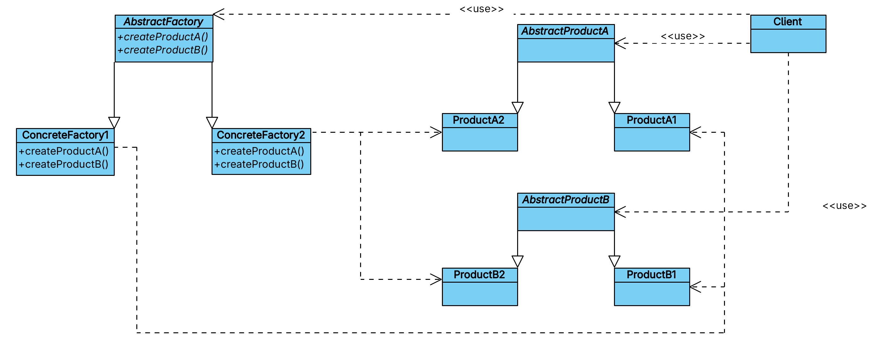

# 第3章 创建型模式

第一段原文：

> 创建型设计模式抽象了实例化过程。它们帮助一个系统独立于如何创建、组合和表示它的那些对象。一个类创建型模式使用继承改变被实例化的类，而一个对象创建型模式将实例化委托给另一个对象。

要理解第一句话，我们应该要先知道什么叫做“实例化过程”，或者什么叫做“实例化”。在Java中，实例化一个对象就是使用关键字`new`创建一个对象，比如要创建一个数据库的连接： `DatabaseConnection conn = new MySQLConnection();`，这就是实例化。而“抽象了实例化过程”的意思就是不让我们直接使用 `new`创建对象，而是把创建对象这种事隐藏起来。所以第一句话的意思就是：一个创建型的设计模式会帮我们进行对象的实例化（创建），而不需要我们直接去使用 `new`关键字创建对象。 创建型的设计模式帮我们做了原来我们一直重复在做的 `new`操作。

为什么创建型设计模式要帮我们做这件事情？也就是为什么要帮我们去做 `new`这个创建对象实例的操作。很常见的一个场景是，在一个系统中，一个对象会被用在很多的地方，分散在各个功能模块中，分散在各个类中，比如我们会在很多地方都要连接数据库，这些地方都要做一样的操作： `DatabaseConnection conn = new MySQLConnection();`，在很多类中都需要写这种代码进行对象的创建。假如有一天要创建的对象不再是 `MySQLConnection`而是要换成 `PostgreSQLConnection`，代码中所有的地方都要修改一遍。

有人会说，我们项目定死就用 `MySQL`数据库，永远都不会变，所以到处`new MySQLConnection();`也没什么问题。那也不是不行，但是实际场景是在创建完类对象后还有一系列复杂的操作要做，比如如下的数据库设置：

``` java
DatabaseConnection conn = new MySQLConnection();  
conn.setHost("localhost");  
conn.setPort(3306);  
conn.setUsername("root");  
conn.setPassword("123456");  
conn.connect();
```

这些同样的设置代码在项目中到处都是，同时还得保证所有地方都得写正确，不能漏了哪一步。如果有一天数据库的配置要更改，所有这些地方都要同步进行修改。

这就是我们自己去做 `new`操作时会出现的问题，创建型设计模式可以帮我们把这些“抽象”掉，也就是帮我们把 `new`后面的事情给做掉。这样，我们就可以使用新的方式来重新做上面的事情了： `DatabaseConnection conn = ConnectionFactory.create();`，原来分散在各个地方的数据库配置代码现在都隐藏在了 `ConnectionFactory.create()`方法中，这样做的好处应该无需再多说。

所以第一句话“创建型设计模式抽象了实例化过程”的意思就是：把 `new`谁、怎么 `new`这件事由“创建设计模式”给集中管理起来，我们不在关心具体的 `new`，创建的逻辑被“抽象”掉了。

理解了第一句话，第二句话也就很好懂了，第二句是“它们帮助一个系统独立于如何创建、组合和表示它的那些对象”，意思是“创建型设计模式”帮助我们创建和管理那些对象，原本那些对象是由我们自己亲手到处去 `new`的。原本分散的对象被集中起来管理，这样“系统”和“那些对象”是不是就相对的“独立”了。

第三句话初次读起来可能会感觉有点懵，”一个类创建型模式使用继承改变被实例化的类，而一个对象创建型模式将实例化委托给另一个对象"，这句话其实是在说创建型设计模式的两种类型（或者两种具体方式）：

- 第一种是：类创建型的模式，我们要创建一个类的实例，需要靠继承来实现，不是直接去`new`这个类，而是去`new`这个类的子类；
- 第二种是：对象创建型的模式，创建对象既不靠继承，也不需要我们直接`new`，而是交给“创建型设计模式”来帮我们`new`。

第二段原文：
> 随着系统演化得越来越依赖于对象组合而不是类继承，创建型模式变得更为重要。当这种情况发生时，重心从对一组固定行为的硬编码（hard-coding）转移为定义一个较小的基本行为集，这些行为可以被组合成任意数目的更复杂的行为。这样创建有特定行为的对象要求的不仅仅是实例化一个类。

第一句话是说，系统一直在进化，我们原来大量的使用继承的方式来实现系统中的功能，由于系统在逐渐变得复杂，现在进化到更多的使用对象的组合来实现功能，也就是继承的方式使用变少了，而对象组合的方式使用的变多了。对象组合方式的变多意味着`new`对象也变多了，根据第一段的内容我们就知道：创建型模式也变得越来越重要了。

什么叫做使用继承的方式？什么叫做使用对象组合的方式？

首先来看早期依赖继承的做法，最开始的时候有一个最原始最基础的创建`MySQL`连接的类：

```java
class MySQLConnection {  
    void connect() { 
	    System.out.println("MySQL连接"); 
	}  
}
```

当有一天想要一个有日志的功能模块时，我们创建一个子类：

```java
class MySQLConnectionWithLog extends MySQLConnection {  
    void connect() {  
		System.out.println("记录日志");  
		super.connect();  
	}  
}
```

当有一天又想要一个带缓存功能的模块时，我们又创建一个新子类：

```java
class MySQLConnectionWithCache extends MySQLConnection {  
	void connect() {  
		System.out.println("使用缓存");  
		super.connect();  
	}  
}
```

当有一天我们想要一个同时有日志和缓存功能的模块时，我们又创建一个子类：

```java
class MySQLConnectionWithLogAndCache extends MySQLConnection {  
	void connect() {
		System.out.println("记录日志"); 
		System.out.println("使用缓存");  
		super.connect();  
	}  
}
```

随着需要功能的越来越多，各种不同组合越来越多，子类也越来越多，可以想象慢慢膨胀的后果，就是有意大堆的子类以及各种不同的杂交子类。这就是继承方式的弊端，接下来我们看下对象组合方式。

首先定义一个接口：

```java
interface Connection {  
	void connect();  
}
```

有一个最原始最基础的创建`MySQL`连接的类：

```java
class MySQLConnection implements Connection {  
	public void connect() {  
		System.out.println("MySQL连接");  
	}  
}
```

想要一个日志记录的功能，就添加一个日志功能模块：

```java
class LogDecorator implements Connection {  
private Connection conn;  
  
LogDecorator(Connection conn) {  
	this.conn = conn;  
}  
  
public void connect() {  
	System.out.println("记录日志");  
		conn.connect();  
	}  
}
```

想要一个缓存功能，就添加一个缓存功能模块：

```java
class CacheDecorator implements Connection {  
private Connection conn;  
  
CacheDecorator(Connection conn) {  
	this.conn = conn;  
}  
  
public void connect() {  
	System.out.println("使用缓存");  
		conn.connect();  
	}  
}
```

再使用时，我同时想要日志和缓存功能，就可以这样使用：

```java
Connection conn =  
new LogDecorator(  
		new CacheDecorator(  
			new MySQLConnection()  
	)  
);  
  
conn.connect();
```

这样就不用再使用继承来进行堆类，而是像搭积木一样的组合对象。

看起来对象的组合时类的膨胀速度要比继承方式的膨胀速度慢的多，但是现在使用时创建逻辑却变得很复杂。最开始我们只需要去`new`一个具体功能的对象就行，现在我们要用这种`new LogDecorator(new CacheDecorator(new MySQLConnection()));`复杂的逻辑进行创建对象，所以我们需要创建型模式来管理这种复杂的对象创建。

第二句话和第三句话是对第一句话的解释：
- ”当这种情况发生时，重心从对一组固定行为的硬编码（hard-coding）转移为定义一个较小的基本行为集，这些行为可以被组合成任意数目的更复杂的行为“：也就是第一句中的由原来的继承方式变为现在的对象组合方式；
- ”这样创建有特定行为的对象要求的不仅仅是实例化一个类“：这就是说现在对象组合的方式创建对象的逻辑变复杂了。

第三段话：
> 在这些模式中有两个不断出现的主旋律。第一，它们都将关于该系统使用哪些具体的类的信息封装起来。第二，它们隐藏了这些类的实例是如何被创建和放在一起的。整个系统关于这些对象所知道的是由抽象类所定义的接口。因此，创建型模式在什么被创建、谁创建它、它是怎样被创建的，以及何时创建等方面给予你很大的灵活性。它们允许你用结构和功能差别很大的“产品”对象配置一个系统。配置可以是静态的（即在编译时指定），也可以是动态的（在运行时指定）。

这段话是在对创建型模式进行总的描述，所有创建型模式本质上都在做两件事情：

- 第一：将具体类的信息封装起来进行隐藏；
- 第二：这些类是怎么创建和组合的也被隐藏了起来。

当这两件隐藏的事情做了之后，在我们整个系统中所有要使用这些功能的地方，都看不到具体的东西了，而只能看到由抽象类所定义的接口。

如果第一点中具体类的信息不封装不隐藏，那么我们在系统中各个角落将会直接暴露出使用的是什么，也就是到处都是 `DatabaseConnection conn = new MySQLConnection();`或者 `DatabaseConnection conn = new PostgresConnection();`。而当我们使用封装隐藏之后，上述所有的地方都看不到具体使用的是什么，而只是一个 `DatabaseConnection conn = ConnectionFactory.create();`，这样就把具体要使用哪个类给隐藏了起来。

第二点是说创建型模式要把对象创建以及组合也帮我们做掉，这样我们不会在系统中到处看到类似如下的代码：

```java
conn = new CacheDecorator(  
	new LogDecorator(  
		new MySQLConnection()  
	)  
);
```

当创建型模式帮我们做完这两件事情之后，我们系统中能看到的就只有它留给我们的接口，具体的事情它去全帮我们做了，不管它做的事情有多复杂我们都看不到了，不管它是使用写死的还是动态配置的我们也看不到。我们想要的就是一个结果。

第四段话原文：
> 有时创建型模式是相互竞争的。例如，有些情况下Prototype（3.4）或Abstract Factory（3.1）用起来都很好。而在有些情况下它们是互补的：Builder（3.2）可以使用其他模式去实现某个构件的创建；Prototype（3.4）可以在它的实现中使用Singleton（3.5）。

这段话很好理解，创建型模式有很多种，它们有的不能同时用，有的可以相互配合同时用，还可以用一个或多个模式去实现另外的模式。

剩下的内容就是举一个具体的例子来说明，不做过多解释。

## 3.1 Abstract Factory（抽象工厂）-对象创建型模式

### 1. 意图

原文：
> 提供一个接口以创建一系列相关或相互依赖的对象，而无须指定它们具体的类。

提供一个接口：抽象工厂只给我们提供了一个接口，其他的我们看不到，在系统中各个地方使用的时候只用这个接口就可以了。

抽象工厂定义了一个接口：

```java
interface DatabaseFactory {  
	Connection createConnection();  
	Command createCommand();  
}
```

我们在使用的时候只需要知道`DatabaseFactory`即可，不需要知道具体的实现类。

创建一系列对象：抽象工厂并不是创建一个对象，而是创建一整套的对象，这些对象之间有关联。

普通工厂只会创建一个对象：

```java
Connection conn = factory.createConnection();
```

而抽象工厂则会创建一组对象，一次性就能提供一整套的产品：

```java
Connection conn = factory.createConnection();  
Command cmd = factory.createCommand();  
Transaction tx = factory.createTransaction();
```

相关或相互依赖：意思就是抽象工厂提供的这一组的对象是不能随便拼在一起用的，必须要配套使用。

比如`DatabaseFactory`有两种具体实现：

```java
class MySQLFactory implements DatabaseFactory {  
	public Connection createConnection() {  
		return new MySQLConnection();  
	}  
	  
	public Command createCommand() {  
		return new MySQLCommand();  
	}  
}

class PostgreSQLFactory implements DatabaseFactory {  
	public Connection createConnection() {  
		return new PostgreSQLConnection();  
	}  
	  
	public Command createCommand() {  
		return new PostgreSQLCommand();  
	}  
}
```

我们在使用的时候不能进行下面这样的错误组合：

```java
Connection conn = new MySQLConnection();  
Command cmd = new PostgresSQLCommand();
```

正确的使用方式是要用一组相关的整套的组合：

```java
DatabaseFactory factory = new MySQLFactory();  
  
Connection conn = factory.createConnection();  
Command cmd = factory.createCommand();
```

无须指定它们具体的类：在使用的时候不需要写 `new MySQLConnection();`而只需要使用 `DatabaseFactory factory = new MySQLFactory();`即可。

### 2. 别名

Kit，在我们开发的语境下，Kit通常表示一组可以一起使用、彼此兼容的组件集合。而抽象工厂模式提供的就是一整套的配套对象，就像一个工具包（Kit）。

### 3. 动机

### 4. 适用性

原文：
> 在以下情况下使用Abstract Factory模式：
> - 一个系统要独立于它的产品的创建、组合和表示。
> - 一个系统要由多个产品系列中的一个来配置。
> - 要强调一系列相关的产品对象的设计以便进行联合使用。
> - 提供一个产品类库，但只想显示它们的接口而不是实现。

这段话是说在什么时候该用抽象工厂，给出了四种情况。

第一种情况 ”一个系统要独立于它的产品的创建、组合和表示“，这是在说一个系统不应该关心对象怎么创建、对象怎么组合、对象的具体实现细节。比如下面的代码就是一种不独立的情况：

```java
DatabaseConnection conn = new MySQLConnection();  
conn.setHost("localhost");  
conn.setPort(3306);  
  
Command cmd = new MySQLCommand(conn);
```

这种方式会出现在系统的很多地方，强依赖 `MySQLConnection`，对组合方式也强依赖，具体的实现细节也被暴露。

如果使用工厂模式，就是下面这样子：

```java
DatabaseFactory factory = new MySQLFactory();  
  
DatabaseConnection conn = factory.createConnection();  
Command cmd = factory.createCommand();
```

此时系统只需要知道 `DatabaseConnection`和 `Command`，而完全不知道 `MySQLConnection`。

第二种情况是“一个系统要由多个产品系列中的一个来配置”，意思是系统要支持多种“整套方案”，运行时只选择其中一个使用。

第三种情况是“要强调一系列相关的产品对象的设计以便进行联合使用”，这里的意思是若干个对象是需要一起工作的，它们组成一整套的方案，不同方案之间的对象不能混用。这种情况就可以使用抽象工厂进行。

在没有抽象工厂的时候，下面是错误用法：

```java
DatabaseConnection conn = new MySQLConnection();  
Command cmd = new PostgreSQLCommand();
```

使用抽象工厂保持一致性的正确用法：

```java
DatabaseFactory factory = new MySQLFactory();  
  
DatabaseConnection conn = factory.createConnection();  
Command cmd = factory.createCommand();
```

第四种情况是“提供一个产品类库，但只想显示它们的接口而不是实现”，意思是你如果要提供一个库给别人用，但是你不想暴露实现细节和具体的类，而是只暴露接口。

### 5. 结构

抽象工厂模式的结构如下：



### 6. 参与者

- `AbstractFactory`：定义一个工厂接口，接口中声明了一组操作，这些操作用于创建各种抽象产品对象。
- `ConcreteFactory`：实现了在 `AbstractFactory`中定义的操作，这些操作用来创建具体的产品对象，也就是真正的去 `new`对象。
- `AbstractProduct`：声明一个接口，这个接口代表一种类型的产品。
- `ConcreteProduct`：实现了 `AbstractProduct`接口，表明这是一个具体的产品对象，这个具体的产品对象将会被具体的 `ConcreteFactory`来进行生产。
- `Client`：只允许使用 `AbstractFactory`和 `AbstractProduct`两个接口来实现对产品的使用，绝对不能出现具体类。

### 7. 协作

这一段是在讲抽象工厂最核心的“运行时行为+延迟绑定思想”。

第一句话“通常在运行时创建一个`ConcreteFactroy`类的实例”，这句话是说程序运行的时候才决定用哪个工厂，而不是写死在代码里或者至少可以动态切换。比如如下代码就是在运行的时候才决定创建哪个工厂：

```java
String type = System.getProperty("db");

DatabaseFactory factory;

if (type.equals("mysql")) {
    factory = new MySQLFactory();
} else {
    factory = new PostgresFactory();
}
```

第二句话“这一具体的工厂创建具有特定实现的产品对象”，这句话是说一旦选择了某个具体的工厂，那它创建出来的所有对象都是一整套可以搭配使用的对象。

第三句话“为创建不同的产品对象，客户应使用不同的具体工厂”，这句话很好理解，如果你想要换一套实现，比如从`MySQL`换到`PostgreSQL`，所要做的不是改产品代码，而是换工厂，因为一旦换了工厂，整套产品也就被换掉了。

第四句话“ `AbstractFactory`将产品对象的创建延迟到它的 `ConcreteFactory`子类”，这句话是说抽象工厂本身不知道怎么创建对象，它也不负责创建对象，只是把创建工作交给子类去做。这里的延迟并不是说时间上的延迟，而是决定权，是抽象工厂将创建对象的决定权交给了子类。

### 8. 效果

抽象工厂模式的优点和缺点：

- 它分离了具体的类
- 它使得易于交换产品系列
- 它有利于产品的一致性
- 难以支持新种类的产品

> 它分离了具体的类　Abstract Factory模式帮助你控制一个应用创建的对象的类。因为一个工厂封装创建产品对象的责任和过程，它将客户与类的实现分离。客户通过它们的抽象接口操纵实例。产品的类名也在具体工厂的实现中被隔离，即它们不出现在客户代码中。

“它分离了具体的类”：把具体的类（比如`MySQLConnection`）从项目的客户端代码中拿走，如果不把这种具体的类和我们的客户端代码做分离，那我们业务代码中到处都是 `MySQLConnection`。分离之后，我们就只需要依赖 `DatabaseConnection`接口就行类。

“Abstract Factory模式帮助你控制一个应用创建的对象的类”：抽象工厂模式统一帮我们管理对象的创建，不再让具体的应用或者客户端代码去自己创建对象。客户端代码只需要引用工厂，工厂来帮我们创建具体的类：

```java
DatabaseFactory factory;

if (config.equals("mysql")) {
    factory = new DatabaseFactory factory;

if (config.equals("mysql")) {
    factory = new MySQLFactory();
} else {
    factory = new PostgresFactory();
}();
} else {
    factory = new PostgresFactory();
}
```
对象的创建在 `MySQLFactory`或者 `PostgresFactory`中。

“因为一个工厂封装创建产品对象的责任和过程，它将客户与类的实现分离”：抽象工厂负责所有的 `new`以及初始化逻辑，客户端代码中不再负责这些事情。如果不做封装，那么客户端代码中到处都要写如下代码：

```java
MySQLConnection conn = new MySQLConnection();
conn.setHost("localhost");
conn.initPool();
```

而如果封装到抽象工厂中：

```java
class MySQLFactory implements DatabaseFactory {
    public DatabaseConnection createConnection() {
        MySQLConnection conn = new MySQLConnection();
        conn.setHost("localhost");
        conn.initPool();
        return conn;
    }
}
```
那么客户端代码中就只需要写 `DatabaseConnection conn = factory.createConnection();`即可，这样客户端便不再依赖具体的实现类。

“客户通过它们的抽象接口操纵实例”：客户端只用接口来操作对象，它只会使用 `DatabaseConnection`接口，而不会使用 `MySQLConnection`这种具体的实现类。

“产品的类名也在具体工厂的实现中被隔离，即它们不出现在客户代码中“：客户端代码中不再出现任何具体类名，它完全不知道有 `MySQLConnection`或 `PostgresConnection`的存在，它只能知道有工厂的存在 `DatabaseConnection conn = factory.createConnection();`。

“它使得易于交换产品系列”和“它有利于产品的一致性”这两点很容易理解，因为抽象工厂可提供若干个具体的实现方案，每个方案都是一整套的东西。如果想要切换到其他的方案，就只需要转换到对应的具体工厂实现即可。由于每个方案都是一整套东西，所有功能都是配套的，所以能很好的保持产品的一致性。

“难以支持新种类的产品”，这部分是工厂模式的缺点。抽象工厂很难新增一种产品类型，这里新的产品类型并不是指的 `MySQL`或 `Postgres`这种，而是指的产品类别： `Connection`或 `Command`。比如我想再增加一个新功能 `Transaction`，就意味着抽象工厂接口必须修改，接口一改就会导致所有实现类都需要修改。

```
  MySQL    -->   Postgres  -->    Oracle   （横向扩展）
    |               |               |
Connection      Connection      Connection
    |               |               |
 Command         Command         Command
    |               |               |
Transaction     Transaction     Transaction

（纵向扩展）
```
抽象工厂横向扩展容易，也就是增加具体的工厂实现类和具体的产品族；而纵向扩展很难，因为要修改抽象工厂以及所有的工厂实现和所有产品族。

### 9. 实现

下面是实现抽象工厂模式的一些有用的技巧：

1. 将工厂作为单件
2. 创建产品
3. 定义可扩展的工厂

第1点是说，一般在实际应用中，每个产品系列只需要一个对应的实现，故此工厂最好使用单例模式实现。

第2点：“ `AbstractFactory` 仅声明一个创建产品的接口，真正创建产品是由 `ConcreteProduct` 子类实现的“，这句话翻译有点不严谨，这句话意思是抽象工厂只做接口定义，真正的去创建产品是由工厂实现类去做的，工厂实现类去创建一个产品。

”最通常的办法是为每一个产品定义一个工厂方法“，这句话是说抽象工厂应该这样设计：每一种产品，对应抽象工厂中的一个方法，就像如下代码一样：

```java
interface AbstractFactory {
    ProductA createA(); // 产品A → 一个方法
    ProductB createB(); // 产品B → 一个方法
}
```

”一个具体的工厂将为每个产品重定义该工厂方法以指定产品“，每个具体的工厂都要将抽象工厂接口中定义的所有方法做实现，在这些实现的方法中返回具体的产品。

"虽然这样的实现很简单，但它却要求每个产品系列都要有一个新的具体工厂子类，即使这些产品系列的差别很小"，抽象工厂模式横向扩展很简单，有新的产品系列，就去增加新的产品系列实现就好，原来已有的产品系列不需要有任何改动。但是也有缺点，就是如果两个产品系列只有很小很小的差别，那也要有两套实现存在，也就是说两套实现中绝大部分代码都是一样的。

“如果有多个可能的产品系列，具体工厂也可以使用Prototype（3.4）模式来实现。具体工厂使用产品系列中每一个产品的原型实例来初始化，且它通过复制它的原型来创建新的产品。基于原型的方法使得并非每个新的产品系列都需要一个新的具体工厂类”，这段话是在讲一个改进思路，使用原型模式来代替大量抽象工厂的实现类。

第3点中的这几段话是在讲：如何让抽象工厂扩展新产品种类更见容易，以及这样做了会有什么代价。代价就是：类型安全和扩展灵活令需要二选一。

抽象工厂中，产品的种类写死在了方法签名里，也就是抽象工厂的每个方法就是一个产品：

```java
interface Factory {
    ProductA createA();
    ProductB createB();
}
```
如果想要增加一个新的产品，则抽象工厂以及所有的工厂实现类都要修改，这就是抽象工厂扩展的缺点。

想要实现更容易扩展的抽象工厂，可以给创建对象的操作增加一个参数，该参数用来指定被创建的对象的种类，但是这样做不安全。

老的抽象工厂变成更容易扩展的抽象工厂：

```java
interface Factory {
    Product create(String type);
}
```

此时抽象工厂中只有一个方法，使用 `type`这个参数来指定创建不同的产品。使用方法如下：

```java
Product p1 = factory.create("A");
Product p2 = factory.create("B");
Product p3 = factory.create("C"); // 新增产品无需改接口
```

新增产品无需改抽象工厂和工厂实现，只需要增加对应的产品就行。

这种实现在动态语言中更易用，动态语言不关心返回类型。但是在像Java/C++这样的静态语言中就不太好了。

### 10. 代码示例

### 11. 已知应用

### 12. 相关模式

- 抽象工厂类通常用工厂方法实现，也可以用原型实现。
- 一个具体的工厂实现通常是一个单例。
## 3.3 Factory Method（工厂方法）-对象创建型模式


