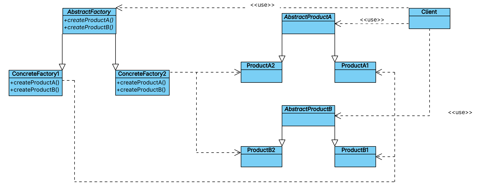
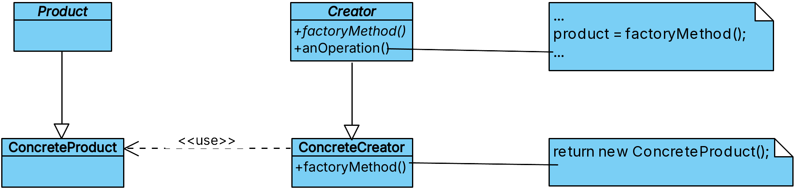
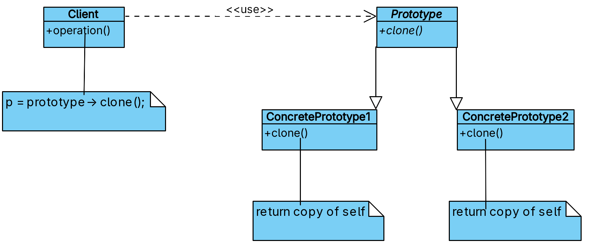
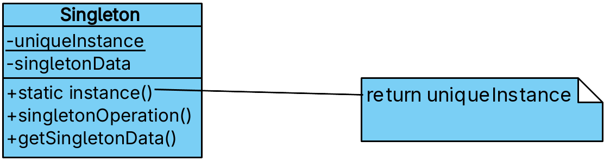

# 第3章 创建型模式

第一段原文：

> 创建型设计模式抽象了实例化过程。它们帮助一个系统独立于如何创建、组合和表示它的那些对象。一个类创建型模式使用继承改变被实例化的类，而一个对象创建型模式将实例化委托给另一个对象。

要理解第一句话，我们应该要先知道什么叫做“实例化过程”，或者什么叫做“实例化”。在Java中，实例化一个对象就是使用关键字`new`创建一个对象，比如要创建一个数据库的连接： `DatabaseConnection conn = new MySQLConnection();`，这就是实例化。而“抽象了实例化过程”的意思就是不让我们直接使用 `new`创建对象，而是把创建对象这种事隐藏起来。所以第一句话的意思就是：一个创建型的设计模式会帮我们进行对象的实例化（创建），而不需要我们直接去使用 `new`关键字创建对象。 创建型的设计模式帮我们做了原来我们一直重复在做的 `new`操作。

为什么创建型设计模式要帮我们做这件事情？也就是为什么要帮我们去做 `new`这个创建对象实例的操作。很常见的一个场景是，在一个系统中，一个对象会被用在很多的地方，分散在各个功能模块中，分散在各个类中，比如我们会在很多地方都要连接数据库，这些地方都要做一样的操作： `DatabaseConnection conn = new MySQLConnection();`，在很多类中都需要写这种代码进行对象的创建。假如有一天要创建的对象不再是 `MySQLConnection`而是要换成 `PostgreSQLConnection`，代码中所有的地方都要修改一遍。

有人会说，我们项目定死就用 `MySQL`数据库，永远都不会变，所以到处`new MySQLConnection();`也没什么问题。那也不是不行，但是实际场景是在创建完类对象后还有一系列复杂的操作要做，比如如下的数据库设置：

``` java
DatabaseConnection conn = new MySQLConnection();  
conn.setHost("localhost");  
conn.setPort(3306);  
conn.setUsername("root");  
conn.setPassword("123456");  
conn.connect();
```

这些同样的设置代码在项目中到处都是，同时还得保证所有地方都得写正确，不能漏了哪一步。如果有一天数据库的配置要更改，所有这些地方都要同步进行修改。

这就是我们自己去做 `new`操作时会出现的问题，创建型设计模式可以帮我们把这些“抽象”掉，也就是帮我们把 `new`后面的事情给做掉。这样，我们就可以使用新的方式来重新做上面的事情了： `DatabaseConnection conn = ConnectionFactory.create();`，原来分散在各个地方的数据库配置代码现在都隐藏在了 `ConnectionFactory.create()`方法中，这样做的好处应该无需再多说。

所以第一句话“创建型设计模式抽象了实例化过程”的意思就是：把 `new`谁、怎么 `new`这件事由“创建设计模式”给集中管理起来，我们不在关心具体的 `new`，创建的逻辑被“抽象”掉了。

理解了第一句话，第二句话也就很好懂了，第二句是“它们帮助一个系统独立于如何创建、组合和表示它的那些对象”，意思是“创建型设计模式”帮助我们创建和管理那些对象，原本那些对象是由我们自己亲手到处去 `new`的。原本分散的对象被集中起来管理，这样“系统”和“那些对象”是不是就相对的“独立”了。

第三句话初次读起来可能会感觉有点懵，”一个类创建型模式使用继承改变被实例化的类，而一个对象创建型模式将实例化委托给另一个对象"，这句话其实是在说创建型设计模式的两种类型（或者两种具体方式）：

- 第一种是：类创建型的模式，我们要创建一个类的实例，需要靠继承来实现，不是直接去`new`这个类，而是去`new`这个类的子类；
- 第二种是：对象创建型的模式，创建对象既不靠继承，也不需要我们直接`new`，而是交给“创建型设计模式”来帮我们`new`。

第二段原文：
> 随着系统演化得越来越依赖于对象组合而不是类继承，创建型模式变得更为重要。当这种情况发生时，重心从对一组固定行为的硬编码（hard-coding）转移为定义一个较小的基本行为集，这些行为可以被组合成任意数目的更复杂的行为。这样创建有特定行为的对象要求的不仅仅是实例化一个类。

第一句话是说，系统一直在进化，我们原来大量的使用继承的方式来实现系统中的功能，由于系统在逐渐变得复杂，现在进化到更多的使用对象的组合来实现功能，也就是继承的方式使用变少了，而对象组合的方式使用的变多了。对象组合方式的变多意味着`new`对象也变多了，根据第一段的内容我们就知道：创建型模式也变得越来越重要了。

什么叫做使用继承的方式？什么叫做使用对象组合的方式？

首先来看早期依赖继承的做法，最开始的时候有一个最原始最基础的创建`MySQL`连接的类：

```java
class MySQLConnection {  
    void connect() { 
	    System.out.println("MySQL连接"); 
	}  
}
```

当有一天想要一个有日志的功能模块时，我们创建一个子类：

```java
class MySQLConnectionWithLog extends MySQLConnection {  
    void connect() {  
		System.out.println("记录日志");  
		super.connect();  
	}  
}
```

当有一天又想要一个带缓存功能的模块时，我们又创建一个新子类：

```java
class MySQLConnectionWithCache extends MySQLConnection {  
	void connect() {  
		System.out.println("使用缓存");  
		super.connect();  
	}  
}
```

当有一天我们想要一个同时有日志和缓存功能的模块时，我们又创建一个子类：

```java
class MySQLConnectionWithLogAndCache extends MySQLConnection {  
	void connect() {
		System.out.println("记录日志"); 
		System.out.println("使用缓存");  
		super.connect();  
	}  
}
```

随着需要功能的越来越多，各种不同组合越来越多，子类也越来越多，可以想象慢慢膨胀的后果，就是有意大堆的子类以及各种不同的杂交子类。这就是继承方式的弊端，接下来我们看下对象组合方式。

首先定义一个接口：

```java
interface Connection {  
	void connect();  
}
```

有一个最原始最基础的创建`MySQL`连接的类：

```java
class MySQLConnection implements Connection {  
	public void connect() {  
		System.out.println("MySQL连接");  
	}  
}
```

想要一个日志记录的功能，就添加一个日志功能模块：

```java
class LogDecorator implements Connection {  
private Connection conn;  
  
LogDecorator(Connection conn) {  
	this.conn = conn;  
}  
  
public void connect() {  
	System.out.println("记录日志");  
		conn.connect();  
	}  
}
```

想要一个缓存功能，就添加一个缓存功能模块：

```java
class CacheDecorator implements Connection {  
private Connection conn;  
  
CacheDecorator(Connection conn) {  
	this.conn = conn;  
}  
  
public void connect() {  
	System.out.println("使用缓存");  
		conn.connect();  
	}  
}
```

再使用时，我同时想要日志和缓存功能，就可以这样使用：

```java
Connection conn =  
new LogDecorator(  
		new CacheDecorator(  
			new MySQLConnection()  
	)  
);  
  
conn.connect();
```

这样就不用再使用继承来进行堆类，而是像搭积木一样的组合对象。

看起来对象的组合时类的膨胀速度要比继承方式的膨胀速度慢的多，但是现在使用时创建逻辑却变得很复杂。最开始我们只需要去`new`一个具体功能的对象就行，现在我们要用这种`new LogDecorator(new CacheDecorator(new MySQLConnection()));`复杂的逻辑进行创建对象，所以我们需要创建型模式来管理这种复杂的对象创建。

第二句话和第三句话是对第一句话的解释：
- ”当这种情况发生时，重心从对一组固定行为的硬编码（hard-coding）转移为定义一个较小的基本行为集，这些行为可以被组合成任意数目的更复杂的行为“：也就是第一句中的由原来的继承方式变为现在的对象组合方式；
- ”这样创建有特定行为的对象要求的不仅仅是实例化一个类“：这就是说现在对象组合的方式创建对象的逻辑变复杂了。

第三段话：
> 在这些模式中有两个不断出现的主旋律。第一，它们都将关于该系统使用哪些具体的类的信息封装起来。第二，它们隐藏了这些类的实例是如何被创建和放在一起的。整个系统关于这些对象所知道的是由抽象类所定义的接口。因此，创建型模式在什么被创建、谁创建它、它是怎样被创建的，以及何时创建等方面给予你很大的灵活性。它们允许你用结构和功能差别很大的“产品”对象配置一个系统。配置可以是静态的（即在编译时指定），也可以是动态的（在运行时指定）。

这段话是在对创建型模式进行总的描述，所有创建型模式本质上都在做两件事情：

- 第一：将具体类的信息封装起来进行隐藏；
- 第二：这些类是怎么创建和组合的也被隐藏了起来。

当这两件隐藏的事情做了之后，在我们整个系统中所有要使用这些功能的地方，都看不到具体的东西了，而只能看到由抽象类所定义的接口。

如果第一点中具体类的信息不封装不隐藏，那么我们在系统中各个角落将会直接暴露出使用的是什么，也就是到处都是 `DatabaseConnection conn = new MySQLConnection();`或者 `DatabaseConnection conn = new PostgresConnection();`。而当我们使用封装隐藏之后，上述所有的地方都看不到具体使用的是什么，而只是一个 `DatabaseConnection conn = ConnectionFactory.create();`，这样就把具体要使用哪个类给隐藏了起来。

第二点是说创建型模式要把对象创建以及组合也帮我们做掉，这样我们不会在系统中到处看到类似如下的代码：

```java
conn = new CacheDecorator(  
	new LogDecorator(  
		new MySQLConnection()  
	)  
);
```

当创建型模式帮我们做完这两件事情之后，我们系统中能看到的就只有它留给我们的接口，具体的事情它去全帮我们做了，不管它做的事情有多复杂我们都看不到了，不管它是使用写死的还是动态配置的我们也看不到。我们想要的就是一个结果。

第四段话原文：
> 有时创建型模式是相互竞争的。例如，有些情况下Prototype（3.4）或Abstract Factory（3.1）用起来都很好。而在有些情况下它们是互补的：Builder（3.2）可以使用其他模式去实现某个构件的创建；Prototype（3.4）可以在它的实现中使用Singleton（3.5）。

这段话很好理解，创建型模式有很多种，它们有的不能同时用，有的可以相互配合同时用，还可以用一个或多个模式去实现另外的模式。

剩下的内容就是举一个具体的例子来说明，不做过多解释。

## 3.1 Abstract Factory（抽象工厂）-对象创建型模式

### 1. 意图

原文：
> 提供一个接口以创建一系列相关或相互依赖的对象，而无须指定它们具体的类。

提供一个接口：抽象工厂只给我们提供了一个接口，其他的我们看不到，在系统中各个地方使用的时候只用这个接口就可以了。

抽象工厂定义了一个接口：

```java
interface DatabaseFactory {  
	Connection createConnection();  
	Command createCommand();  
}
```

我们在使用的时候只需要知道`DatabaseFactory`即可，不需要知道具体的实现类。

创建一系列对象：抽象工厂并不是创建一个对象，而是创建一整套的对象，这些对象之间有关联。

普通工厂只会创建一个对象：

```java
Connection conn = factory.createConnection();
```

而抽象工厂则会创建一组对象，一次性就能提供一整套的产品：

```java
Connection conn = factory.createConnection();  
Command cmd = factory.createCommand();  
Transaction tx = factory.createTransaction();
```

相关或相互依赖：意思就是抽象工厂提供的这一组的对象是不能随便拼在一起用的，必须要配套使用。

比如`DatabaseFactory`有两种具体实现：

```java
class MySQLFactory implements DatabaseFactory {  
	public Connection createConnection() {  
		return new MySQLConnection();  
	}  
	  
	public Command createCommand() {  
		return new MySQLCommand();  
	}  
}

class PostgreSQLFactory implements DatabaseFactory {  
	public Connection createConnection() {  
		return new PostgreSQLConnection();  
	}  
	  
	public Command createCommand() {  
		return new PostgreSQLCommand();  
	}  
}
```

我们在使用的时候不能进行下面这样的错误组合：

```java
Connection conn = new MySQLConnection();  
Command cmd = new PostgresSQLCommand();
```

正确的使用方式是要用一组相关的整套的组合：

```java
DatabaseFactory factory = new MySQLFactory();  
  
Connection conn = factory.createConnection();  
Command cmd = factory.createCommand();
```

无须指定它们具体的类：在使用的时候不需要写 `new MySQLConnection();`而只需要使用 `DatabaseFactory factory = new MySQLFactory();`即可。

### 2. 别名

Kit，在我们开发的语境下，Kit通常表示一组可以一起使用、彼此兼容的组件集合。而抽象工厂模式提供的就是一整套的配套对象，就像一个工具包（Kit）。

### 3. 动机

### 4. 适用性

原文：
> 在以下情况下使用Abstract Factory模式：
> - 一个系统要独立于它的产品的创建、组合和表示。
> - 一个系统要由多个产品系列中的一个来配置。
> - 要强调一系列相关的产品对象的设计以便进行联合使用。
> - 提供一个产品类库，但只想显示它们的接口而不是实现。

这段话是说在什么时候该用抽象工厂，给出了四种情况。

第一种情况 ”一个系统要独立于它的产品的创建、组合和表示“，这是在说一个系统不应该关心对象怎么创建、对象怎么组合、对象的具体实现细节。比如下面的代码就是一种不独立的情况：

```java
DatabaseConnection conn = new MySQLConnection();  
conn.setHost("localhost");  
conn.setPort(3306);  
  
Command cmd = new MySQLCommand(conn);
```

这种方式会出现在系统的很多地方，强依赖 `MySQLConnection`，对组合方式也强依赖，具体的实现细节也被暴露。

如果使用工厂模式，就是下面这样子：

```java
DatabaseFactory factory = new MySQLFactory();  
  
DatabaseConnection conn = factory.createConnection();  
Command cmd = factory.createCommand();
```

此时系统只需要知道 `DatabaseConnection`和 `Command`，而完全不知道 `MySQLConnection`。

第二种情况是“一个系统要由多个产品系列中的一个来配置”，意思是系统要支持多种“整套方案”，运行时只选择其中一个使用。

第三种情况是“要强调一系列相关的产品对象的设计以便进行联合使用”，这里的意思是若干个对象是需要一起工作的，它们组成一整套的方案，不同方案之间的对象不能混用。这种情况就可以使用抽象工厂进行。

在没有抽象工厂的时候，下面是错误用法：

```java
DatabaseConnection conn = new MySQLConnection();  
Command cmd = new PostgreSQLCommand();
```

使用抽象工厂保持一致性的正确用法：

```java
DatabaseFactory factory = new MySQLFactory();  
  
DatabaseConnection conn = factory.createConnection();  
Command cmd = factory.createCommand();
```

第四种情况是“提供一个产品类库，但只想显示它们的接口而不是实现”，意思是你如果要提供一个库给别人用，但是你不想暴露实现细节和具体的类，而是只暴露接口。

### 5. 结构

抽象工厂模式的结构如下：



### 6. 参与者

- `AbstractFactory`：定义一个工厂接口，接口中声明了一组操作，这些操作用于创建各种抽象产品对象。
- `ConcreteFactory`：实现了在 `AbstractFactory`中定义的操作，这些操作用来创建具体的产品对象，也就是真正的去 `new`对象。
- `AbstractProduct`：声明一个接口，这个接口代表一种类型的产品。
- `ConcreteProduct`：实现了 `AbstractProduct`接口，表明这是一个具体的产品对象，这个具体的产品对象将会被具体的 `ConcreteFactory`来进行生产。
- `Client`：只允许使用 `AbstractFactory`和 `AbstractProduct`两个接口来实现对产品的使用，绝对不能出现具体类。

### 7. 协作

这一段是在讲抽象工厂最核心的“运行时行为+延迟绑定思想”。

第一句话“通常在运行时创建一个`ConcreteFactroy`类的实例”，这句话是说程序运行的时候才决定用哪个工厂，而不是写死在代码里或者至少可以动态切换。比如如下代码就是在运行的时候才决定创建哪个工厂：

```java
String type = System.getProperty("db");

DatabaseFactory factory;

if (type.equals("mysql")) {
    factory = new MySQLFactory();
} else {
    factory = new PostgresFactory();
}
```

第二句话“这一具体的工厂创建具有特定实现的产品对象”，这句话是说一旦选择了某个具体的工厂，那它创建出来的所有对象都是一整套可以搭配使用的对象。

第三句话“为创建不同的产品对象，客户应使用不同的具体工厂”，这句话很好理解，如果你想要换一套实现，比如从`MySQL`换到`PostgreSQL`，所要做的不是改产品代码，而是换工厂，因为一旦换了工厂，整套产品也就被换掉了。

第四句话“ `AbstractFactory`将产品对象的创建延迟到它的 `ConcreteFactory`子类”，这句话是说抽象工厂本身不知道怎么创建对象，它也不负责创建对象，只是把创建工作交给子类去做。这里的延迟并不是说时间上的延迟，而是决定权，是抽象工厂将创建对象的决定权交给了子类。

### 8. 效果

抽象工厂模式的优点和缺点：

- 它分离了具体的类
- 它使得易于交换产品系列
- 它有利于产品的一致性
- 难以支持新种类的产品

> 它分离了具体的类　Abstract Factory模式帮助你控制一个应用创建的对象的类。因为一个工厂封装创建产品对象的责任和过程，它将客户与类的实现分离。客户通过它们的抽象接口操纵实例。产品的类名也在具体工厂的实现中被隔离，即它们不出现在客户代码中。

“它分离了具体的类”：把具体的类（比如`MySQLConnection`）从项目的客户端代码中拿走，如果不把这种具体的类和我们的客户端代码做分离，那我们业务代码中到处都是 `MySQLConnection`。分离之后，我们就只需要依赖 `DatabaseConnection`接口就行类。

“Abstract Factory模式帮助你控制一个应用创建的对象的类”：抽象工厂模式统一帮我们管理对象的创建，不再让具体的应用或者客户端代码去自己创建对象。客户端代码只需要引用工厂，工厂来帮我们创建具体的类：

```java
DatabaseFactory factory;

if (config.equals("mysql")) {
    factory = new DatabaseFactory factory;

if (config.equals("mysql")) {
    factory = new MySQLFactory();
} else {
    factory = new PostgresFactory();
}();
} else {
    factory = new PostgresFactory();
}
```
对象的创建在 `MySQLFactory`或者 `PostgresFactory`中。

“因为一个工厂封装创建产品对象的责任和过程，它将客户与类的实现分离”：抽象工厂负责所有的 `new`以及初始化逻辑，客户端代码中不再负责这些事情。如果不做封装，那么客户端代码中到处都要写如下代码：

```java
MySQLConnection conn = new MySQLConnection();
conn.setHost("localhost");
conn.initPool();
```

而如果封装到抽象工厂中：

```java
class MySQLFactory implements DatabaseFactory {
    public DatabaseConnection createConnection() {
        MySQLConnection conn = new MySQLConnection();
        conn.setHost("localhost");
        conn.initPool();
        return conn;
    }
}
```
那么客户端代码中就只需要写 `DatabaseConnection conn = factory.createConnection();`即可，这样客户端便不再依赖具体的实现类。

“客户通过它们的抽象接口操纵实例”：客户端只用接口来操作对象，它只会使用 `DatabaseConnection`接口，而不会使用 `MySQLConnection`这种具体的实现类。

“产品的类名也在具体工厂的实现中被隔离，即它们不出现在客户代码中“：客户端代码中不再出现任何具体类名，它完全不知道有 `MySQLConnection`或 `PostgresConnection`的存在，它只能知道有工厂的存在 `DatabaseConnection conn = factory.createConnection();`。

“它使得易于交换产品系列”和“它有利于产品的一致性”这两点很容易理解，因为抽象工厂可提供若干个具体的实现方案，每个方案都是一整套的东西。如果想要切换到其他的方案，就只需要转换到对应的具体工厂实现即可。由于每个方案都是一整套东西，所有功能都是配套的，所以能很好的保持产品的一致性。

“难以支持新种类的产品”，这部分是工厂模式的缺点。抽象工厂很难新增一种产品类型，这里新的产品类型并不是指的 `MySQL`或 `Postgres`这种，而是指的产品类别： `Connection`或 `Command`。比如我想再增加一个新功能 `Transaction`，就意味着抽象工厂接口必须修改，接口一改就会导致所有实现类都需要修改。

```
  MySQL    -->   Postgres  -->    Oracle   （横向扩展）
    |               |               |
Connection      Connection      Connection
    |               |               |
 Command         Command         Command
    |               |               |
Transaction     Transaction     Transaction

（纵向扩展）
```
抽象工厂横向扩展容易，也就是增加具体的工厂实现类和具体的产品族；而纵向扩展很难，因为要修改抽象工厂以及所有的工厂实现和所有产品族。

### 9. 实现

下面是实现抽象工厂模式的一些有用的技巧：

1. 将工厂作为单件
2. 创建产品
3. 定义可扩展的工厂

第1点是说，一般在实际应用中，每个产品系列只需要一个对应的实现，故此工厂最好使用单例模式实现。

第2点：“ `AbstractFactory` 仅声明一个创建产品的接口，真正创建产品是由 `ConcreteProduct` 子类实现的“，这句话翻译有点不严谨，这句话意思是抽象工厂只做接口定义，真正的去创建产品是由工厂实现类去做的，工厂实现类去创建一个产品。

”最通常的办法是为每一个产品定义一个工厂方法“，这句话是说抽象工厂应该这样设计：每一种产品，对应抽象工厂中的一个方法，就像如下代码一样：

```java
interface AbstractFactory {
    ProductA createA(); // 产品A → 一个方法
    ProductB createB(); // 产品B → 一个方法
}
```

”一个具体的工厂将为每个产品重定义该工厂方法以指定产品“，每个具体的工厂都要将抽象工厂接口中定义的所有方法做实现，在这些实现的方法中返回具体的产品。

"虽然这样的实现很简单，但它却要求每个产品系列都要有一个新的具体工厂子类，即使这些产品系列的差别很小"，抽象工厂模式横向扩展很简单，有新的产品系列，就去增加新的产品系列实现就好，原来已有的产品系列不需要有任何改动。但是也有缺点，就是如果两个产品系列只有很小很小的差别，那也要有两套实现存在，也就是说两套实现中绝大部分代码都是一样的。

“如果有多个可能的产品系列，具体工厂也可以使用Prototype（3.4）模式来实现。具体工厂使用产品系列中每一个产品的原型实例来初始化，且它通过复制它的原型来创建新的产品。基于原型的方法使得并非每个新的产品系列都需要一个新的具体工厂类”，这段话是在讲一个改进思路，使用原型模式来代替大量抽象工厂的实现类。

第3点中的这几段话是在讲：如何让抽象工厂扩展新产品种类更见容易，以及这样做了会有什么代价。代价就是：类型安全和扩展灵活令需要二选一。

抽象工厂中，产品的种类写死在了方法签名里，也就是抽象工厂的每个方法就是一个产品：

```java
interface Factory {
    ProductA createA();
    ProductB createB();
}
```
如果想要增加一个新的产品，则抽象工厂以及所有的工厂实现类都要修改，这就是抽象工厂扩展的缺点。

想要实现更容易扩展的抽象工厂，可以给创建对象的操作增加一个参数，该参数用来指定被创建的对象的种类，但是这样做不安全。

老的抽象工厂变成更容易扩展的抽象工厂：

```java
interface Factory {
    Product create(String type);
}
```

此时抽象工厂中只有一个方法，使用 `type`这个参数来指定创建不同的产品。使用方法如下：

```java
Product p1 = factory.create("A");
Product p2 = factory.create("B");
Product p3 = factory.create("C"); // 新增产品无需改接口
```

新增产品无需改抽象工厂和工厂实现，只需要增加对应的产品就行。

这种实现在动态语言中更易用，动态语言不关心返回类型。但是在像Java/C++这样的静态语言中就不太好了。

### 10. 代码示例

### 11. 已知应用

### 12. 相关模式

- 抽象工厂类通常用工厂方法实现，也可以用原型实现。
- 一个具体的工厂实现通常是一个单例。

## 3.2 Builder（生成器）-对象创建型模式

### 1. 意图

> 将一个复杂对象的构建与它的表示分离，使得同样的构建过程可以创建不同的表示。

在创建一个非常复杂的对象的时候，可以使用建造者模式去帮助我们创建对象，不需要我们在一个类中直接写死对象的构造过程。这就是构建与表示分离，构建的过程由建造者模式帮我们完成，我们只需要简单的定义一个类就行。

在使用普通的办法来创建一个对象的时候，我们可能会有如下的代码：

```java
class Computer {
    String cpu;
    String memory;
    String disk;

    public Computer() {
        this.cpu = "Intel";
        this.memory = "16GB";
        this.disk = "1TB";
    }
}
```

当我们创建一个 `Computer`对象的时候，创建的过程已经写死在了构造器中，后续我们想要修改这个 `Computer`的配置的时候就可能需要直接修改构造器中的代码，当我既想要这个配置又同时想要另外一个配置的时候，我们就需要其他的办法了。

而当我们使用建造者模式的时候，一个具体的 `Computer`类和我们想要的对象的构造是分开的。如下是类的定义：

```java
class Computer {
    String cpu;
    String memory;
    String disk;
}
```
这个定义很简单，只有属性，没有任何的其他的构造逻辑。构造逻辑是由建造者模式帮我们在另外的地方去做了，比如如下代码定义一个构造过程接口：

```java
interface ComputerBuilder {
    void buildCPU();
    void buildMemory();
    void buildDisk();
    Computer getResult();
}
```
在这个接口的具体实现类中我们去构造具体的 `Computer`，这时”复杂对象的构件“和”它的表示“就分离了。

”使得同样的构建过程可以创建不同的表示“，是说一个创建者模式有一个统一的创建对象的流程，但这个统一的流程可以创建出不同的对象。

像这样的一个创建流程： `buildCPU → buildMemory → buildDisk`，可以造出办公电脑，也可以造出游戏电脑。

首先有两个不同的电脑的构造器，游戏电脑：

```java
class GamingComputerBuilder implements ComputerBuilder {

    Computer computer = new Computer();

    public void buildCPU() {
        computer.cpu = "i9";
    }

    public void buildMemory() {
        computer.memory = "32GB";
    }

    public void buildDisk() {
        computer.disk = "2TB SSD";
    }

    public Computer getResult() {
        return computer;
    }
}
```

办公电脑的构造器：

```java
class OfficeComputerBuilder implements ComputerBuilder {

    Computer computer = new Computer();

    public void buildCPU() {
        computer.cpu = "i5";
    }

    public void buildMemory() {
        computer.memory = "16GB";
    }

    public void buildDisk() {
        computer.disk = "512GB SSD";
    }

    public Computer getResult() {
        return computer;
    }
}
```

构造一个电脑的过程，这个过程只有一个：

```java
class Director {

    public void construct(ComputerBuilder builder) {
        builder.buildCPU();
        builder.buildMemory();
        builder.buildDisk();
    }
}
```

使用构造过程和构造器去创建不同的对象：

```java
Director director = new Director();

// 游戏电脑
ComputerBuilder builder1 = new GamingComputerBuilder();
director.construct(builder1);
Computer gamingPC = builder1.getResult();

// 办公电脑
ComputerBuilder builder2 = new OfficeComputerBuilder();
director.construct(builder2);
Computer officePC = builder2.getResult();
```

这里 `Director`的构建过程完全一样： `buildCPU → buildMemory → buildDisk`，给出不同的构造器，得到的结果就不一样。

### 2. 动机

### 3. 适用性

- 当创建复杂对象的算法应该独立于该对象的组成部分以及它们的装配方式时。
- 当构造过程必须允许被构造的对象有不同的表示时。

第一点是讲对象的创建过程是一部分；对象由什么组成、怎么将对象拼起来是另一部分，这两部分应该要分开。如果要分开这两部分，可以使用建造者模式。

如果两部分不分开，就是如下的这种形式：

```java
class Computer {
    public Computer(String type) {
        if (type.equals("gaming")) {
            // 构建过程 + 组成 + 装配 全混在一起
            System.out.println("i9 + 32GB + 2TB");
        } else {
            System.out.println("i5 + 16GB + 512GB");
        }
    }
}
```
此时对象的表示（类）、对象的创建过程、对象的组装都混合到了一起。

而使用建造者模式对这两部分进行分离则是如下的方式，首先要定义一个创建过程：

```java
class Director {
    public void construct(Builder builder) {
        builder.buildCPU();
        builder.buildMemory();
        builder.buildDisk();
    }
}
```
这个过程描述了创建一个 `Computer`的流程： `buildCPU → buildMemory → buildDisk`，这个过程从 `Computer`类中解放了出来。

接下来是定义两个”组成+装配“的具体类：

```java
class GamingBuilder implements Builder {
    Computer c = new Computer();

    public void buildCPU() { c.cpu = "i9"; }
    public void buildMemory() { c.memory = "32GB"; }
    public void buildDisk() { c.disk = "2TB"; }
}
```

这样原来在 `Computer`类中的复杂流程和装配等都被分离了出来， `Computer`类中就只剩下基本的定义了。

第2点，这句话的意思是：同一套构建步骤，必须能生成不同的结果。也就是对于同一套流程： `buildCPU → buildMemory → buildDisk`既可以生产出游戏电脑，也可以生产出办公电脑，在代码中的反应就是 `Director`代码是完全不用变化的。

### 4. 结构

结构图：


### 5. 参与者

- `Builder`： 一个接口，接口中定义创建 `Product`各个部分的方法。
- `ConcreteBuilder`： `Builder`接口的实现，创建 `Product`对象，并且 `Product`各个部分的具体代码实现都在这里；还需要提供一个用来获取被创建的对象的方法。
- `Director`： 使用`Builder`接口，将接口中定义的 `Product`各个部分的方法按照实际的需求编排顺序，进行组装。
- `Product`： 要被构造的复杂的对象。

### 6. 协作

代码中需要使用到 `Product`对象的地方，只需要使用 `Director`和 对应的`Builder`就可以得到 `Product`。

- `Client`要创建一个 `Director`对象和一个 具体的`Builder`对象， `Director`要使用 `Builder`去创建 `Product`。
- `Builder`负责去创建 `Product`。
- 创建完成后， `Client`就可以使用 `Builder`获取已经创建的 `Product`对象。
### 7. 效果

1. 它使你可以改变一个产品的内部表示
2. 它将构造代码和表示代码分开
3. 它使你可对构造过程进行更精细的控制

第1点是说，你可以改变一个对象的内部结构、数据和组成等等，但是不需要改构建的流程。

在不是用创建者模式的时候，我们通常会使用如下的代码去创建一个对象：

```java
class Computer {
    String cpu;
    String memory;
}
```

创建对象：

```java
Computer c = new Computer();
c.cpu = "i5";
c.memory = "16GB";
```

当我们想要改变结构的时候：

```java
class Computer {
    String cpu;
    String memory;
    String gpu; // 新增
}
```

创建对象的所有代码都需要修改：

```java
Computer c = new Computer();
c.cpu = "i5";
c.memory = "16GB";
c.gpu = "XxX"; // 所有地方都需要修改
```

而如果我们使用创建者模式，则构建的流程不用变：

```java
director.construct(builder);
```

只需要修改 `Builder`即可：

```java
class GamingBuilder implements Builder {
    public void buildCPU() { ... }
    public void buildMemory() { ... }
    public void buildGPU() { ... } // 新增
}
```

在一个 `Director`中，它不关心对象的任何构建细节，只是调用 `Builder`的各个方法：

```java
interface Builder {
    void buildCPU();
    void buildMemory();
}
```

```java
class Director {
    public void construct(Builder builder) {
        builder.buildCPU();
        builder.buildMemory();
    }
}
```

`Director`只能看到抽象的 `Builder`，看不到具体的实现。

`Builder`把对象内部长什么样、用了什么字段、怎么存数据以及怎么装配等都给隐藏了起来。如下两个具体的 `Builder`实现：

```java
class SimpleBuilder implements Builder {
    Product p = new Product();

    public void buildCPU() {
        p.setCPU("i5");
    }
}
```

```java
class ComplexBuilder implements Builder {
    Product p = new Product();

    public void buildCPU() {
        p.setCPU("i9");
        p.enableOverclock(); // 额外逻辑
    }
}
```

这两个 `Builder`内部不一样，但是 `Director`完全不知道这些，因为它只会这样的调用： `director.construct(builder);`。

如果想要新增一个产品，我们要做的也只是新增一个 `Builder`即可，不用修改原有代码。比如说原来系统中有两个：

```
Builder:
- GamingBuilder
- OfficeBuilder
```

现在想要一个新的服务器的版本，我们也只需要新增一个 `Builder`：

```java
class ServerBuilder implements Builder {

    Product product = new Product();

    public void buildCPU() {
        product.cpu = "Xeon";
    }

    public void buildMemory() {
        product.memory = "64GB ECC";
    }
}
```

其他的代码完全不需要改变，在需要的地方使用即可：

```java
director.construct(new ServerBuilder());
```

第2点，建造者模式会将构造代码和表示代码分开。表示代码是一个具体的产品类，比如：

```java
class Computer {
    String cpu;
    String memory;
}
```

而构造代码是 `Builder`和 `Director`，其中 `Builder`负责构造对象以及对象的各个部分， `Director`负责构造流程：

```java
interface Builder {
    void buildCPU();
    void buildMemory();
}
```

```java
class Director {
    void construct(Builder builder) {
        builder.buildCPU();
        builder.buildMemory();
    }
}
```

这三部分都是分开成三个模块的，如果产品想要增加一些属性：

```java
class Computer {
    String cpu;
    String memory;
    String gpu; // 新增
}
```
此时我们只需要修改 `Builder`：

```java
public void buildGPU() {
    product.gpu = "RTX 4090";
}
```

而 `Director`和 `Client`都不需要改变。

客户端 `Client`看不到产品的详细信息以及装配的细节，因为它只和抽象的 `Builder`以及 `Director`打交道。

对于每一个具体的 `Builder`实现，都是一个特定的产品的一整套的构建逻辑，这些代码只需要再这个具体的 `Builder`中写一次。不同的 `Director`可以复用它去构建不同的 `Product`。 `Director`中是装配的流程，所以可以在不同的 `Director`中使用同一个 `Builder`但却使用不同的顺序去构建。

同一个Builder：

```java
Builder builder = new GamingBuilder();
```

给不同的 `Director`使用：

```java
class Director1 {
    void construct(Builder b) {
        b.buildCPU();
        b.buildMemory();
    }
}
```

```java
class Director2 {
    void construct(Builder b) {
        b.buildMemory();
        b.buildCPU();
    }
}
```

第3点，`Builder`中定义了构建对象的每个部分，使用 `Director`可以控制构建的流程，也就是在 `Director`中可以一步一步的构造一个产品。

### 8. 实现

- `Builder`是一个抽象类，定义很多的方法，每一个方法只用来构建一个产品的一部分。
- `ConcreteBuilder`是一个具体的创建产品的实现类，想要产品长什么样子就在该类中进行“创作”即可。

需要考虑的实现问题：

1. 装配和构造接口
2. 为什么产品没有抽象类
3. 在 `Builder`中缺省的方法为空

第1点， `Builder`中定义的接口要足够的通用，不能够太具体，否则就等于写死了。如下的情况就是接口太具体：

```java
interface Builder {
    void buildIntelCPU();  // 写死 Intel
    void buildDDR5Memory(); // 写死类型
}
```

这样的定义 `GamingBuilder`可以用，但 `ServerBuilder`就不适用了。

下面是比较通用的接口定义：

```java
interface Builder {
    void buildCPU();
    void buildMemory();
}
```

不同的实现：

```java
class GamingBuilder implements Builder {
    public void buildCPU() { /* i9 */ }
}

class ServerBuilder implements Builder {
    public void buildCPU() { /* Xeon */ }
}
```

另外在一般的 `Builder`设计中，在每一步都是往产品中添加东西，也就是在 `Builder`的每个方法中都是往 `Product`对象中设置属性，不会修改其他方法中已经设置过的属性，也不会依赖已经设置过的属性。相当于每次调用一个方法就是在给一个 `Product`做“加法”。但是有些场景下，我们不是简单的做加法，还需要依赖已经设置过的属性，比如如下代码：

```java
class ComplexBuilder implements Builder {

    Computer product = new Computer();

    public void buildCPU() {
        product.cpu = "i9";
    }

    public void buildMemory() {
        if (product.cpu.equals("i9")) {
            product.memory = "32GB";
        } else {
            product.memory = "16GB";
        }
    }
}
```
在构建 `Memory`的时候就需要依赖 `cpu`的属性，这样就变得更复杂和容易出错。这种场景是我们需要重新考虑的。

第2点，这段话是在解释为什么建造者模式中的 `Product`没有抽象的父类，通常是因为产品与产品之间差异很大，一般没有办法抽象出共同的父类。并且在 `Client`中使用的时候，我们通常都会知道要使用哪一个产品对应的 `Builder`。

第3点是在向我们讲一个非常实用的小技巧，我们应该在 `Builder`接口的定义中给每个方法一个空的实现。

比如我们使用普通的接口定义：

```java
interface Builder {
    void buildCPU();
    void buildMemory();
    void buildDisk();
}
```
每个实现类都必须实现所有的方法，哪怕这个方法你不需要：

```java
class SimpleBuilder implements Builder {
    public void buildCPU() { ... }
    public void buildMemory() { ... }
    public void buildDisk() { } // 其实不需要，但必须写
}
```

如果采用空实现的方式，则是如下的样子，先定义抽象类，给出默认空实现：

```java
abstract class Builder {

    public void buildCPU() {}     // 默认空实现
    public void buildMemory() {}  // 默认空实现
    public void buildDisk() {}    // 默认空实现

    public abstract Product getResult();
}
```

子类只需要重写所需要的方法，而不需要关心那些没有用的方法：

```java
class SimpleBuilder extends Builder {

    Product product = new Product();

    @Override
    public void buildCPU() {
        product.cpu = "i5";
    }

    @Override
    public Product getResult() {
        return product;
    }
}
```

### 9. 代码示例

### 10. 已知应用

### 11. 相关模式

- 抽象工厂模式与建造者模式类似，区别是：
	- 建造者模式着重于一步一步的构造一个复杂对象，而抽象工厂模式着重于能够以统一的形式来生成多个系列的产品对象。
	- 建造者模式在最后一步返回产品，而抽象工厂模式是立即返回创建的产品。
- 组合模式（ `Composite`）通常是用创建者模式生成的。
## 3.3 Factory Method（工厂方法）-对象创建型模式

### 1. 意图

> 定义一个用于创建对象的接口，让子类决定实例化哪一个类。Factory Method使一个类的实例化延迟到其子类。

“定义一个用于创建对象的接口”，不直接去 `new`对象，而是提供一个“创建对象的方法（接口）”。我们使用普通的方式去创建对像的时候可能会像下面代码一样：

```java
class Client {
    public void doSomething() {
        Product p = new ProductA(); // 写死
    }
}
```

这里创建对象的逻辑写死，无法扩展，以后想要换成其他的 `ProductB`，必须修改代码。而如果使用工厂方法创建则会像下面的代码示例，首先创建一个抽象类并定义一个工厂方法：

```java
abstract class Creator {
    abstract Product createProduct(); // 工厂方法
}
```

客户端使用的时候不再直接去 `new`对象，而是使用工厂方法获取对象：

```java
Product p = creator.createProduct();
```

“让子类决定实例化哪一个类”，父类只定义方法，具体的创建对象的工作由子类去做。

“Factory Method使一个类的实例化延迟到其子类”，这里的延迟不是时间上的延迟，而是指创建对象的工作被推给了子类。普通的创建对象的时机是在 `Client`中直接去创建一个对象：

```java
class Client {
    public void doSomething() {
        Product p = new ProductA(); // 这里就决定了
    }
}
```

现在使用工厂方法模式之后，创建对象则工作交给了子类去做， `Client`不再直接去创建对象，而是使用工厂方法：

```java
abstract class Creator {
    abstract Product createProduct();

    public void doSomething() {
        Product p = createProduct(); // 延迟点
        p.use();
    }
}
```

创建对象的工作由抽象接口 `Creator`的具体子类去做：

```java
class CreatorA extends Creator {
    Product createProduct() {
        return new ProductA(); // 真正发生在这里
    }
}
```

`Client`使用方式：

```java
Creator creator = new CreatorA();  
creator.doSomething(); // 使用产品
```
### 2. 别名

虚构造器（Virtual Constructor）。

什么是构造器，构造器就是负责创建对象的东西：

```java
class Product {
    public Product() {
        System.out.println("创建产品");
    }
}
```

使用的时候直接调用：

```java
Product p = new Product();
```

构造器有一个缺点：它是写死的，不能多态替换。比如：

```java
Product p = new ProductA(); // 写死了
```

无法做到运行时动态决定：

```java
Product p = new ???(); // 运行时动态决定
```

什么是虚，在 `Java`里虚通常指通过多态，在运行时决定调用哪个实现。

虚构造器就是用“方法+多态”来代替“构造器+new”，可以在运行时决定创建哪个对象的“构造器”。
### 3. 动机

> 框架使用抽象类定义和维护对象之间的关系。这些对象的创建通常也由框架负责。

"框架使用抽象类定义和维护对象之间的关系"，框架提前写好一套“骨架结构”，这套结构规定了哪些对象要协作、它们之间怎么调用，而我们要做的就是“填空”（继承抽象类，实现抽象方法），框架帮我们做的事情，我们不需要再重复的做很多次。

对象之间的关系，就像 `Controller → Service → DAO`， `Controller`调用 `Service`， `Service`调用 `DAO`，这就是关系。

框架怎么定义关系？就是用抽象类+模版方法，如下代码示例：

```java
abstract class Framework {

    // 模板方法（定义流程 = 定义关系）
    public void process() {
        ObjectA a = createObjectA();
        ObjectB b = createObjectB();

        a.doSomething();
        b.doSomething();

        // A和B的协作关系写死在这里
    }

    // 工厂方法（先不创建，交给子类）
    protected abstract ObjectA createObjectA();
    protected abstract ObjectB createObjectB();
}
```

上述代码中的 `Framework`就帮我们做了定义和维护对象之间的关系这件事情：

```java
a.doSomething();
b.doSomething();
```
这里的先后顺序就是关系。

子类无需关心“关系”，只需要实现工厂方法提供具体对象就行：

```java
class MyFramework extends Framework {

    protected ObjectA createObjectA() {
        return new ObjectAImpl();
    }

    protected ObjectB createObjectB() {
        return new ObjectBImpl();
    }
}
```

“这些对象的创建通常也由框架负责”，框架帮我们创建好对象，再交给我们使用。如果是我们自己创建并使用对象，可能会像如下的方式：

```java
Service s = new ServiceImpl();
Controller c = new Controller(s);
```

而如果框架来帮我们创建，就会变成如下的方式：

```java
abstract class Framework {

    public void run() {
        Service s = createService();
        Controller c = createController(s);

        c.handle();
    }

    protected abstract Service createService();
    protected abstract Controller createController(Service s);
}
```

子类提供实现：

```java
class MyApp extends Framework {

    protected Service createService() {
        return new ServiceImpl();
    }

    protected Controller createController(Service s) {
        return new ControllerImpl(s);
    }
}
```

这样框架控制着整个流程，并且框架进行对象的创建。

这里子类实现中有我们自己写的代码去 `new`对象，看起来好像还是我们在自己 `new`对象，框架并没有去负责创建对象。这里要转变一下想法，不要把“谁写了 `new`”当成“谁负责创建”，“负责创建”表示的是谁掌控“创建发生的时机以及创建被如何使用”。

上述例子中框架有控制权，它决定对象什么时候创建、创建的对象在哪里使用。我们的子类仅仅只有执行权，也就是仅仅只能提供要去 `new`哪个类。我们是没有机会去写如下的代码的：

```java
Service s = new ServiceImpl();
Controller c = new ControllerImpl(s);
c.handle();
```

如果没有框架，我们自己全权负责，就会像如下的代码：

```java
public class Main {
    public static void main(String[] args) {
        Service s = new ServiceImpl();
        Controller c = new ControllerImpl(s);

        c.handle();
    }
}
```
我们自己决定了一切。而如果有框架负责，则我们只需要按照如下方式去使用即可：

```java
public class Main {
    public static void main(String[] args) {
        Framework app = new MyApp();
        app.run(); // 一切交给框架
    }
}
```
其余的事情比如像什么时候创建 `Service`， `Controller`依赖谁，调用顺序，生命周期等等都有框架来负责。

我们要做的就是提供一下要用哪个实现类。

所以框架负责创建并不是替我们写 `new`，而是框架掌控对象的创建流程、时机、依赖关系等。

### 4. 适用性

- 当一个类不知道它所必须创建的对象的类的时候。
- 当一个类希望由它的子类来指定它所创建的对象的时候。
- 当类将创建对象的职责委托给多个帮助子类的中的某一个，并且你希望将哪一个帮助子类是代理者这一信息局部化的时候。

第1点，“当一个类不知道它所必须创建的对象的类的时候”，一个类只知道它需要一个对象，但不知道这个对象具体是哪种实现类。

为什么会出现“不知道”的情况？通常是因为具体需要哪个实现类是在运行时才决定的，比如：

- 通过配置文件配置
- 用户选择
- 插件系统

这样的场景下，在代码里是不知道要使用的具体的对象的，只有在运行时才知道要使用的具体对象。

第2点，“当一个类希望由它的子类来指定它所创建的对象的时候”，父类主动的说“我不决定创建哪个对象，由你们子类来决定”。

第3点，“当类将创建对象的职责委托给多个帮助子类的中的某一个，并且你希望将哪一个帮助子类是代理者这一信息局部化的时候”，有很多个“候选创建者”，但你不想让外部知道到底用了哪一个。

“多个帮助子类”，比如如下的代码是表示有多种 `Logger`的实现（创建）方式：

```java
class FileLogger {}
class DatabaseLogger {}
class CloudLogger {}
```

“委托给某一个”，也就是要使用其中的一个具体的 `Logger`：

```java
class Client {
    public void log() {
        Logger logger;

        if (type.equals("file")) {
            logger = new FileLogger();
        } else {
            logger = new DatabaseLogger();
        }
    }
}
```

这样写的话 `Client`知道了所有细节。

“信息局部化”，用工厂方法局部化信息，把要使用的具体的 `Logger`的选择藏起来：

```java
abstract class LoggerFactory {
    abstract Logger createLogger();
}
```

不同子类负责不同的策略：

```java
class FileLoggerFactory extends LoggerFactory {
    Logger createLogger() {
        return new FileLogger();
    }
}

class DBLoggerFactory extends LoggerFactory {
    Logger createLogger() {
        return new DatabaseLogger();
    }
}
```

`Client`在使用的时候完全不知道选择细节：

```java
class Client {
    public void log(LoggerFactory factory) {
        Logger logger = factory.createLogger();
        logger.log();
    }
}
```

这就把要用哪个类这一信息限制在了一个小范围内（工厂类中）。

### 5. 结构

结构图：



### 6. 参与者

- `Product`: 这个是一个接口，表示的是工厂方法要创建的对象。
- `ConcreteProduct`: `Product`接口的实现类。
- `Creator`: 声明工厂方法的抽象类。
- `ConcreteCreator`: `Creator`的实现类，重定义工厂方法来返回一个具体的 `ConcreteProduct`对象实例。

### 7. 协作

> Creator依赖于它的子类来定义工厂方法，所以它返回一个适当的ConcreteProduct实例。

这句话读起来很别扭，需要改成更容易懂的： `Creator`只声明（定义）工厂方法的接口，而将具体的实现交给子类，因此它最终得到的是一个由子类创建的具体的产品对象。

### 8. 效果

> 工厂方法不再将与特定应用有关的类绑定到你的代码中。代码仅处理Product接口，因此它可以与用户定义的任何ConcreteProduct类一起使用。

- 绑定：就是写死依赖。
- 特定应用的类：比如 `ConcreteProduct`或者 `ProductA`。
- 你的代码：指的是 `Client`或 `Creator`。

这句话是说，如果使用了工厂方法，我们 `Client`代码中将不会再直接写死：

```java
new ProductA();
```

这也就是说代码不再依赖某个具体的类。我们的代码 `Client`中只需要依赖 `Product`接口即可，后续如果再增加任何的 `Product`的实现类，原来的 `Product`的实现类以及原来的 `Creator`的实现类的代码完全不用修改。

> 工厂方法的一个潜在缺点在于，客户可能仅仅为了创建一个特定的ConcreteProduct对象，就不得不创建Creator的子类。当Creator子类不是必需的时，客户现在必然要处理类演化的其他方面。但是当客户无论如何必须创建Creator的子类时，创建子类也是可行的。

工厂方法的缺点是，如果新增一个 `Product`的实现类，则必须要新增一个 `Creator`的实现类。

在一些简单场景下没必要使用工厂方法，会使得代码变得很复杂，这就说常说的过度设计。但是如果本来就需要定义子类，则可以使用工厂方法，并不会产生过多的负担，是合理的。

工厂方法模式的另外两种效果：

1. 为子类提供钩子
2. 连接平行的类层次

第1点是工厂方法模式的一个非常实用的能力，给代码提供扩展点。父类写好流程，在某个点上留一个空位，让子类去填：

```java
abstract class Creator {

    // 这就是“钩子”
    protected abstract Product createProduct();

    public void operation() {
        System.out.println("通用逻辑1");

        Product p = createProduct(); // 子类可以插手这里

        System.out.println("通用逻辑2");
        p.use();
    }
}
```

子类使用扩展点插入自己的逻辑：

```java
class CreatorA extends Creator {
    protected Product createProduct() {
        return new ProductA(); // 插入自己的逻辑
    }
}
```

相比直接在代码中写死对象的创建，这种方式则更加灵活，子类在创建对象的时候可以做很多的事情，可以扩展或增强要创建的对象。

如果不使用工厂方法（提供钩子），而是直接在内部创建对象，则非常不灵活，无法进行扩展。这种方式的代码如下所示：

```java
class Creator {
    public void operation() {
        Product p = new ProductA(); // 写死
        p.use();
    }
}
```

而如果使用工厂方法（钩子），代码则如下：

```java
abstract class Creator {
    protected abstract Product createProduct();

    public void operation() {
        Product p = createProduct(); // 可变
        p.use();
    }
}
```

子类就可以进行各种各样的扩展，比如可以替换对象的类型：

```java
return new ProductB();
```

子类还可以增加逻辑：

```java
protected Product createProduct() {
    System.out.println("记录日志");
    return new ProductA();
}
```

子类也可以将对象进行增强，返回增强版本的对象：

```java
protected Product createProduct() {
    return new EnhancedProduct(new ProductA());
}
```

第2点，这段话是在讲一个高级用法：工厂方法可以用来连接两个平行的类层次，保证相关对象成对出现。

“平行的类层次”是指有两组类结构（两个继承体系），它们之间存在对应关系，如下的代码是一个有平行的类层次关系的示例。

层次1: UI控件

```java
abstract class Button {
    abstract void click();
}

class WinButton extends Button {}
class MacButton extends Button {}
```

层次2：窗口

```java
abstract class Dialog {
    abstract Button createButton(); // 工厂方法
}

class WinDialog extends Dialog {
    Button createButton() {
        return new WinButton(); // 对应关系
    }
}

class MacDialog extends Dialog {
    Button createButton() {
        return new MacButton();
    }
}
```

这里就形成了“平行的类层次”：

```
Dialog层次        Button层次
-----------      ------------
WinDialog  --->  WinButton
MacDialog  --->  MacButton
```

使用工厂方法就可以将这两套结构绑定在一起，如果没有工厂方法，我们需要手动保证对应关系：

```
WinDialog ↔ WinButton
MacDialog ↔ MacButton
```
这样很容易出错：

```java
Dialog dialog = new WinDialog();
Button btn = new MacButton(); // 错误组合
```

而如果使用工厂方法，则会自动匹配，由系统保证 `WinDialog`自动生成 `WinButton`：

```java
Dialog dialog = new WinDialog();
Button btn = dialog.createButton(); // 自动匹配 WinButton
```

另外，”工厂方法并不只是被Creator调用“，这句话是说工厂方法不只是写给父类用的，外部代码（ `Client`）也可以直接调用它。标准用法是在 `Creator`中调用，也就是模版方法：

```java
public void render() {
    Button btn = createButton(); // Creator内部用
    btn.click();
}
```

现在也可以这样用，即 `Client`直接调用：

```java
Dialog dialog = new WinDialog();
Button btn = dialog.createButton(); // Client直接用
btn.click();
```

工厂方法不仅仅是一个内部工具，也是对外提供的一种对象创建接口。

### 9. 实现

应用工厂方法模式需要考虑以下问题：

1. 主要有两种不同情况：
	1. `Creator`是一个抽象类且不提供工厂方法的实现；
	2. `Creator`是一个具体类且为工厂方法提供一个缺省的实现。
2. 参数化工厂方法。
3. 特定语言的变化和问题。
4. 使用模板以避免创建子类。
5. 命名约定

第1点，工厂方法模式的两种情况，其实就是工厂方法的两种使用方式以及它们各自解决的问题。第一种方式是标准的工厂方法模式结构，使用抽象的 `Creator`，让子类决定创建什么对象。第二种方式是 `Creator`是一个具体类，工厂方法有默认的实现。

第一种方式是标准的工厂方法模式结构：

```java
abstract class Creator {

    // 只声明，不实现
    protected abstract Product createProduct();

    public void operation() {
        Product p = createProduct(); // 子类提供
        p.use();
    }
}
```
父类不知道应该要创建什么，所以不能写默认的逻辑，这样的好处是父类不用硬编码一个具体类。

第二种方式代码如下：

```java
class Creator {

    protected Product createProduct() {
        return new ProductA(); // 默认实现
    }

    public void operation() {
        Product p = createProduct();
        p.use();
    }
}
```

这种方式我们可以直接使用 `Creator`这个父类，也可以用子类来重写 `Creator`。现在这个 `Creator`中默认的是 `ProductA`，如果想要另外的产品，只需要用子类去重写父类的方法就行：

```java
class CustomCreator extends Creator {
    protected Product createProduct() {
        return new ProductB(); // 覆盖默认
    }
}
```

这样更灵活一些，默认方案也能用，如果你想要修改也可以自己去修改。

第2点，参数化工厂方法，这里是说工厂方法的一种变体：参数化工厂方法。比标准的工厂方法更灵活，一个工厂方法不再只生产一个产品，而是可以生产多个产品。

标准工厂方法：

```java
abstract class Creator {
    abstract Product createProduct(); // 只能创建一种
}
```

参数化工厂方法：

```java
Product createProduct(String type); // 可以创建多种
```

参数化工厂方法使用参数来告诉工厂要创建哪个对象，一个简单的示例如下：

```java
class Creator {

    public Product createProduct(String type) {

        if (type.equals("A")) {
            return new ProductA();
        } else if (type.equals("B")) {
            return new ProductB();
        }

        return null;
    }
}
```

这样不管创建A还是B，由于它们都属于同一类型体系，所以可以在一个工厂中完成。如果想要扩展，增加一个新的产品C，此时可以只在工厂中增加一个分支就行：

```java
public Product createProduct(String type) {

    if (type.equals("A")) return new ProductA();
    if (type.equals("B")) return new ProductB();
    if (type.equals("C")) return new ProductC(); // 新增
}
```

除了可以通过引入新类型C来增加新产品，还可以改变类型和产品之间的映射：

```java
if (type.equals("A")) {
    return new ProductB(); // 改映射
}
```

参数化工厂可以看作是一个可配置的映射系统。

第4点，是在讲对工厂方法模式的一个优化思路，使用模板（泛型）减少类的数量。工厂方法中一个对象需要对应一个工厂：

```java
abstract class Creator {
    abstract Product createProduct();
}
```

产品A的工厂：

```java
class CreatorA extends Creator {
    Product createProduct() {
        return new ProductA();
    }
}
```

如果想要一个产品B，则需要有一个产品B的工厂：

```java
class CreatorB extends Creator {
    Product createProduct() {
        return new ProductB();
    }
}
```

可以使用一个通用的 `Creator`，将变化点变成参数，而不是变成一个一个子类，使用泛型来解决：

```java
class Creator<T extends Product> {

    private Class<T> clazz;

    public Creator(Class<T> clazz) {
        this.clazz = clazz;
    }

    public T createProduct() {
        try {
            return clazz.getDeclaredConstructor().newInstance();
        } catch (Exception e) {
            throw new RuntimeException(e);
        }
    }
}
```

使用：

```java
Creator<ProductA> creator = new Creator<>(ProductA.class);
Product p = creator.createProduct();
```

这时使用的就只有 `Creator`和需要的产品类，而不会再有 `Creator`的子类。


### 10. 代码示例

### 11. 已知应用

工厂方法主要用于工具包和框架中。

工具包指的是一些通用组件，比如：日志、序列化、UI组件、网络库等。特点是：不知道用户是谁、不依赖具体业务、要支持各种扩展。

框架指的是控制程序执行流程，但允许用户填空的系统，比如： `Spring`、 `JUnit`、 `Android Framework`等。特点是：框架控制流程、用户只能扩展，不能改核心。

工厂方法主要用于那些无法提前知道具体业务类型的通用系统中，即上面说的框架和工具库，它们需要通过子类或扩展点来决定创建什么对象。

普通业务代码不太需要工厂方法，一般我们都知道具体的类型、很少需要扩展机制，直接去 `new`一个对象反而更简单。如果使用工厂方法反而会造成过度设计。

相反，框架则必须要用工厂方法，因为框架不知道用户是谁，不知道要使用什么，比如框架需要定义这种：

```java
abstract class RepositoryFactory {
    abstract Repository createRepository();
}
```

具体使用什么由用户来决定：

```java
class MySQLFactory extends RepositoryFactory {
    Repository createRepository() {
        return new MySQLRepository();
    }
}
```

框架需要做的是一些通用的事情，它并不关心具体用的什么：

```java
Repository repo = factory.createRepository();
repo.save();
```

对于工具包，则是由于它们通常需要支持多种实现，比如日志相关的工具包： `LogFactory → ConsoleLog / FileLog / CloudLog`，如果不用工厂方法，则工具包中必须写死 `new ConsoleLog()`，这样就无法扩展。

使用工厂方法实现，工具包只需要定义：

```java
abstract class LogFactory {
    abstract Logger createLogger();
}
```

用户选择具体使用哪种日志方式：

```java
LoggerFactory factory = new ConsoleLoggerFactory();
```

### 12. 相关模式

- 抽象工厂经常使用工厂方法来实现。
- 工厂方法通常在模版方法中被调用。
- 原型模式不需要创建 `Creator`的子类，但它们通常要求一个针对 `Product`类的实例化操作。原型模式的 `Creator`使用实例化来初始化对象，但工厂方法不需要这样的操作。

“抽象工厂经常使用工厂方法来实现”，这句话是说抽象工厂通常是用工厂方法组合出来的。抽象工厂要创建一整套相关对象，而工厂方法正好负责创建单个对象，在形式上看起来好像是一个抽象工厂中有多个工厂方法。

下面是两种模式的结构对比：

- 工厂方法的目标是创建一个对象：  `Creator → Product`，一个工厂方法等于一个产品，子类决定创建哪个具体类。
- 抽象工厂目标是创建一整套的相关对象： `Factory → ProductA + ProductB + ProductC（一整套）`，一次创建多个产品，产品之间是配套关系。

工厂方法结构代码：

```java
abstract class Creator {
    abstract Product createProduct();
}
```

抽象工厂结构代码：

```java
abstract class GUIFactory {

    abstract Button createButton();
    abstract Checkbox createCheckbox();
}
```

“工厂方法通常在Template Method中被调用”，这是一种非常经典的设计模式组合关系：模板方法+工厂方法。

最后一段是原型模式和工厂方法模式的对比，略过。

## 3.4 Prototype（原型）--对象创建型模式

### 1. 意图

> 用原型实例指定创建对象的种类，并且通过拷贝这些原型创建新的对象。

原型模式到底想解决什么问题？在很多情况下，创建对象的过程非常复杂，比如：

- 要读取配置文件。
- 要连接数据库。
- 要初始化大量字段。
- 要进行复杂计算。
- 要经过很多步骤。

如果要重新 `new`一个对象成本很高。这时候就需要一个新办法：不要每次都去重新创建对象，而是复制已有对象，这就是`clone`。原型模式使用克隆已有对象的方式来创建新的对象，用来解决重新 `new`对象时成本很高的问题。

“用原型实例指定创建对象的种类“，这里”原型实例“指的是已存在的对象，例如：

```java
Sheep sheep = new Sheep();
```

这个 `sheep`对象就是原型。

”指定创建对象的种类“是说通过这个已经存在的对象，决定以后要创建的对象是什么类型。例如：

```java
Sheep sheep = new Sheep();
```

这是一个原型，以后复制出来的对象都是 `Sheep`类型：

```java
Sheep copy1 = sheep.clone();
Sheep copy2 = sheep.clone();
```

一个已有的原型对象，决定了将来要创建的对象的类型。

”并且通过拷贝这些原型创建新的对象“，意思是创建新对象不是通过 `new`，而是通过 `clone`：

```java
Sheep copy = sheep.clone();
```

这里的 `copy`就是通过拷贝原型对象创建出来的新对象。

为什么需要原型模式？

原因1，对象创建成本高，比如：

```java
class BigObject {
    public BigObject() {
        loadDataFromDatabase();
        loadConfig();
        initHugeMemory();
    }
}
```

如果每次都去 `new BigObject();`，会很慢，使用 `BigObject copy = prototype.clone();`则会更快。

原因2，需要动态创建对象，有时候不知道具体类是什么，可能需要用户去选择，比如用户可能会去选择：圆形、矩形、三角形等等，通常会像如下的代码：

```java
if(type.equals("circle")) {
    return new Circle();
}
```

而使用原型模式则是如下：

```java
return prototypeMap.get(type).clone();
```

在使用的时候并不知道具体类。

原型模式的代码示例，第一步：定义原型类。代码如下：

```java
class Sheep implements Cloneable {

    private String name;
    private int age;

    public Sheep(String name, int age) {
        this.name = name;
        this.age = age;
    }

    @Override
    public Sheep clone() {
        try {
            return (Sheep) super.clone();
        } catch (CloneNotSupportedException e) {
            throw new RuntimeException(e);
        }
    }

    public void show() {
        System.out.println(name + " : " + age);
    }
}
```

第二步：使用原型复制对象。代码如下：

```java
public class Main {
    public static void main(String[] args) {

        Sheep sheep1 = new Sheep("Tom", 2);

        Sheep sheep2 = sheep1.clone();

        sheep1.show();
        sheep2.show();

        System.out.println(sheep1 == sheep2);
    }
}
```

输出如下：

```
Tom : 2
Tom : 2
false
```

上述代码中： `Sheep sheep1 = new Sheep("Tom", 2);`就是创建一个原型对象， `Sheep sheep2 = sheep1.clone();`就是复制原型，这里创建 `sheep2`的时候并没有使用 `new`而是复制一个已有的对象 `sheep1`。从输出可以看到：两个对象的数据一样，但不是同一个对象。

原型模式与 `new`方式的对比：

- `new`：从零创建，调用构造函数，初始化流程完整
- `clone`：直接复制内存中的对象，不一定调用构造函数，速度快

原型模式缺点是：

- `clone`很复杂，尤其是深拷贝更复杂；
- 浅拷贝很危险，会出现引用共享的问题；
- 维护成本高，每个类都要实现 `clone`。

### 2. 动机

### 3. 适用性

在下列情况下可以使用Prototype模式：

- 当一个系统应该独立于它的产品创建、构成和表示时。
- 当要实例化的类是在运行时指定时，例如，通过动态装载。
- 为了避免创建一个与产品类层次平行的工厂类层次时。
- 当一个类的实例只能有几个不同状态组合中的一种时。建立相应数目的原型并克隆它们可能比每次用合适的状态手工实例化该类更方便一些。

第1点，“当一个系统应该独立于它的产品创建、构成和表示时“，这句话需要先拆解下：

”产品“，不是商品，而是系统中创建出来的对象，比如： `Button, TextBox, Window, Enemy, Document, Shape`这些都叫做产品对象。

”创建“，意思是对象怎么创建：
- 使用 `new Button()`方式创建对象；
- 或者使用 `button.clone()`方式创建对象

”构成“，意思是对象内部由什么组成，如下代码：

```java
class Car {
    Engine engine;
    Wheel wheel;
}
```

这就是对象的构成。

”表示“，意思是对象具体是什么类型，比如 `WindowsButton, MacButton, LinuxButton`，虽然都叫做 `Button`，但具体表示不同。

”系统应该独立于“，这是设计模式最核心的思想之一，意思是系统不要依赖于具体类。下面这段代码就是一个依赖于具体类的示例：

```java
if(os.equals("windows")) {
    button = new WindowsButton();
}
```

代码中直接依赖 `WindowsButton`，而设计模式则是希望系统不要关心：

- 对象怎么创建。
- 对象具体类型。
- 对象内部结构。

系统只负责使用对象，这就是”系统应该独立于“。

原型模式如何做到独立？关键是不再直接 `new`，而是使用 `prototype.clone()`，比如：

```java
Shape shape = prototypeMap.get(type).clone();
```

系统根本不知道是 `Circle`还是 `Rectangle`，而只是去复制一个原型，这样系统和具体类就解耦了。

在不使用原型模式的时候，代码如下：

```java
class Client {

    public Shape create(String type) {

        if(type.equals("circle")) {
            return new Circle();
        }

        if(type.equals("rect")) {
            return new Rectangle();
        }

        return null;
    }
}
```

此时 `Client`中依赖所有的具体类，而使用原型模式则是如下所示：

```java
class Client {

    private Map<String, Shape> prototypes;

    public Shape create(String type) {
        return prototypes.get(type).clone();
    }
}
```

`Client`中不知道有哪些具体的形状类。

所以这句话的意思是：当系统不希望依赖对象的具体创建过程、具体类型、具体结构时，可以使用原型模式。

第2点，”当要实例化的类是在运行时指定时，例如，通过动态装载“，这是原型模式的经典应用场景。其中“运行时指定”是指编译时不知道要创建哪个类，只有程序运行后才知道，比如需要用户选择：圆形、矩形、三角形等等，程序在运行之前不知道用户要选什么。

“动态装载”意思是程序运行过程中，动态加载类，比如：

```java
Class.forName(className);
```

像一些插件系统都是在程序启动后才加载类：

- Photoshop插件
- IDE插件
- Spring Bean

使用原型模式时就不需要在系统中写死 `new xxx()`，而是使用 `prototype.clone()`即可。

第3点，“为了避免创建一个与产品类层次平行的工厂类层次时”，这里产品类层次是指如下形式：

```
Shape
 ├── Circle
 ├── Rectangle
 └── Triangle
```

工厂类层次，如果使用工厂方法模式，可能会有如下几个工厂类：

```
ShapeFactory
 ├── CircleFactory
 ├── RectangleFactory
 └── TriangleFactory
```

产品和工厂类是对应的，有几个产品类，就有几个工厂类，这就是平行类层次。产品和工厂对应的问题是类的数量会很多，有多少个产品类就有多少个工厂类。

使用原型模式可以解决这个问题，只需要一个原型注册器：

```java
class ShapeManager {

    Map<String, Shape> map = new HashMap<>();
}
```

所有对象统一 `clone()`，不需要若干个工厂类。

第4点，“当一个类的实例只能有几个不同状态组合中的一种时。建立相应数目的原型并克隆它们可能比每次用合适的状态手工实例化该类更方便一些”，这句话是说，如果一个对象只有少量的固定配置时，可以提前创建好这些模板对象，以后直接复制即可，无需再反复的重新创建对象。

比如像游戏里的敌人：

```
红色 + 小型
红色 + 大型
蓝色 + 小型
蓝色 + 大型
```

这四种组合就是状态组合，如果不使用原型模式，而是每次使用到其中的一个组合时就需要去创建对象：

```java
Enemy e = new Enemy();
e.setColor("red");
e.setSize("large");
e.setSpeed(10);
e.setPower(20);
```
这样做太麻烦。使用原型模式时会直接预先准备几个模板对象，比如：

```java
Enemy redLarge;
Enemy blueSmall;
```

然后在使用的时候直接复制：

```java
Enemy e = redLarge.clone();
```

代码示例：

```java
class Enemy implements Cloneable {

    private String color;
    private String size;

    public Enemy(String color, String size) {
        this.color = color;
        this.size = size;
    }

    @Override
    public Enemy clone() {
        try {
            return (Enemy) super.clone();
        } catch (Exception e) {
            throw new RuntimeException(e);
        }
    }

    public void show() {
        System.out.println(color + " " + size);
    }
}
```

使用：

```java
Enemy redLarge = new Enemy("Red", "Large");

Enemy e1 = redLarge.clone();
Enemy e2 = redLarge.clone();
```

这样初始化就只做一次，之后使用时候直接复制即可。

### 4. 结构

结构图：



### 5. 参与者

- `Prototype`：原型接口，该接口表明需要克隆自身。
- `ConcretePrototype`：一个需要克隆自身的类，该类需要实现原型接口 `Prototype`，表明需要克隆自身。
- `Client`： 客户端，代码中使用原型进行克隆，从而得到一个新对象。

### 6. 协作

### 7. 效果

原型模式、抽象工厂模式、建造者模式都有一个共同特点：客户端不依赖具体类。这也是设计模式中的一个核心思想。虽然这三种模式的实现方式不同，但都能达到这一目标（解耦）。

“客户”不是用户，而是使用这些对象的代码，比如：

```java
public class Client {
}
```

这里的 `Client`就是客户端。

“具体产品类”，就是具体类，比如： `WindowsButton, MacButton, LinuxButton`。

“隐藏”就是 `Client`不应该直接依赖这些具体产品类，即 `Client`的代码中不应该有如下代码：

```java
WindowsButton btn = new WindowsButton();
```

这样 `Client`直接知道 `WindowsButton`，耦合严重。

设计模式则是希望 `Client`只知道 `Button`，而不知道 `WindowsButton, MacButton`，因为这些具体的类是经常变化的，如果客户端到处都是具体实现类，一旦有变化则全部都需要修改。

原型模式、抽象工厂模式、建造者模式都可以隐藏具体类，也就是在 `Client`中不知道具体类。

原型模式的另外一些优点：

第1点，运行时增加和删除产品。这是原型模式一个非常强大的能力：运行时动态扩展系统。其他几个模式比如工厂方法模式、抽象工厂模式、建造者模式都没有这种特殊的能力。这也使得原型模式更适合下列场景：

- 插件系统
- 动态模块
- 配置驱动系统
- 游戏对象编辑器

程序运行过程中可以动态增加新对象类型，动态删除对象类型，而不需要修改原有对象代码。

客户端可以把一个原型对象放进系统中，比如：

```java
manager.register("circle", new Circle());
```

这里的 `new Circle()`就是原型实例， `register`就是告诉系统以后可以复制这个对象。通过这一步之后，系统就支持这种对象了。例如现在系统只支持 `Circle, Rectangle`，如果通过代码：
```java
manager.register("triangle", new Triangle());
```

于是现在系统就支持了 `Triangle`对象，我们也没有修改原有代码。

原型模式经典结构的示例代码如下，首先是原型接口：

```java
interface Shape extends Cloneable {

    Shape clone();
}
```

具体产品实现：

```java
class Circle implements Shape {

    @Override
    public Shape clone() {
        return new Circle();
    }

    public void draw() {
        System.out.println("Circle");
    }
}
```

```java
class Rectangle implements Shape {

    @Override
    public Shape clone() {
        return new Rectangle();
    }

    public void draw() {
        System.out.println("Rectangle");
    }
}
```

原型管理器：

```java
class ShapeManager {

    private Map<String, Shape> map =
            new HashMap<>();

    // 注册原型
    public void register(String name,
                         Shape shape) {

        map.put(name, shape);
    }

    // 删除原型
    public void remove(String name) {
        map.remove(name);
    }

    // 创建对象
    public Shape create(String name) {

        Shape prototype = map.get(name);

        if(prototype == null) {
            return null;
        }

        return prototype.clone();
    }
}
```

客户端使用：

```java
public class Client {

    public static void main(String[] args) {

        ShapeManager manager = new ShapeManager();

        // 动态注册
        manager.register("circle", new Circle());

        manager.register("rect", new Rectangle());

        Shape s1 = Manager.create("circle");

        s1.draw();

        // 动态删除
        manager.remove("rect");
    }
}
```

`ShapeManager`从头到尾都不知道 `Circle, Rectangle, Triangle`，它只知道 `Shape`。另外客户端代码中可以动态扩展，即 `manager.register("triangle", new Triangle());`，可以使系统立即支持 `Triangle`。

第2点，改变值以指定新对象。这里不再是只讨论 `clone`了，而是在讨论“对象”代替“类”这一更高级的思想。前面我们使用原型模式时也就只是简单的复制对象，这里是原型模式的一种更高级用法：基于对象编程，而不是基于类编程。

传统的OOP中，如果我们需要得到一种新的对象，通常我们需要定义新类，比如：

- 想要增加一种按钮： `class RedButton extends Button`。
- 想要新增一种敌人： `class FireEnemy extends Enemy`
- 想要新增一种角色： `class Warrior extends Character`

这种传统方式认为“新行为”等于“新类”。而使用原型模式，则不一定要新类，我们可以改变对象中的值从而得到新的行为。

比如有一个 `Enemy`类：

```java
class Enemy {

    int speed;
    int attack;
}
```

我们可以不通过新增类，而是通过改变属性值得到不同的对象，比如可以得到一个慢速敌人：

```java
Enemy e1 = new Enemy();
e1.speed = 1;
```

快速敌人：

```java
Enemy e2 = new Enemy();
e2.speed = 100;
```

这里没有定义新类，但是两个对象“慢速敌人”和“快速敌人”的行为已经不一样了。

这是设计模式中的重要思想：组合优于继承。原型模式非常适合通过对象配置产生新行为，而不是通过新增子类。

“高度动态的系统”是指：

- 游戏编辑器，运行时新增怪物。
- UI编辑器，运行时新增组件。
- Spring，运行时新增Bean。
- 插件系统，运行时动态加载模块。

“对象组合”，比如有一个角色类，角色类中有一个 `Weapon`对象，这就是组合，代码如下：

```java
class Character {

    Weapon weapon;
}
```

角色的行为由 `Weapon`决定，不同的 `Weapon`会导致角色的行为不同，比如如果武器是 `Sword`，则 `character.attack();`就是近战攻击；如果武器是 `Gun`，则会变成远程攻击。这里角色类并没改变，只是内部对象变了，行为就变了。

“通过对象变量指定值”，例如： `enemy.speed = 100;`或者 `enemy.weapon = new Gun();`，这里也是没有定义新类，但是对象的行为变了。

为什么这很重要？使用传统方式，新的行为就需要新的子类，比如：

```
FastEnemy
SlowEnemy
FireEnemy
IceEnemy
```

这样不同行为的对象是不同的子类，类的数量会有很多。如果使用原型模式+组合的方式，只需要一个 `Enemy`类即可，通过改变对象的状态来实现变化。

行为不一定来自继承，还可以来自：

- 对象状态
- 对象组合
- 对象委托

原型模式可以让对象像类一样工作：

第一步，实例化已有类：

```java
Enemy e = new Enemy();
```

第二步，注册为原型：

```java
manager.register("fireEnemy", e);
```

此时系统中已经有了 `fireEnemy`这个“新类型”，但我们并没有定义新类。

第3点，改变结构以指定新对象。

第4点，减少子类的构造。这里将原型模式和工厂方法模式进行对比，工厂方法模式中一个产品对应一个工厂类，这样会导致类数量爆炸，维护困难。原型模式则不需要大量的工厂类，使用经典的原型注册器即可消除大量的工厂类。

第5点，用类动态配置应用。程序运行过程中动态增加类，而不是在编译时写死所有类。

原型模式最经典结构是原型注册器。

原型模式主要的缺点是每个原型的子类都必须实现 `clone`操作，还会涉及到浅拷贝和深拷贝等问题。

### 8. 实现

实现原型时，需要考虑以下问题：

1. 使用一个原型管理器，原型管理器是一个原型的注册表，可动态的创建和销毁原型对象。
2. 实现克隆操作，需要注意浅拷贝和深拷贝问题。
3. 初始化克隆对象，不能在 `clone`操作的时候传递参数，而是要在 `clone`操作之后，再进行对象的设置。

### 9. 代码示例

### 10. 已知应用

### 11. 相关模式

原型模式和抽象工厂模式有时候可以解决同样的问题，有时候也可以一起来解决一些问题。

抽象工厂模式经典写法如下，定义产品接口：

```java
interface Button {

    void click();
}
```

实现具体产品：

```java
class WindowsButton implements Button {

    @Override
    public void click() {

        System.out.println("Windows Button");
    }
}
```

```java
class MacButton implements Button {

    @Override
    public void click() {

        System.out.println("Mac Button");
    }
}
```

定义抽象工厂接口：

```java
interface GUIFactory {

    Button createButton();
}
```

每个产品对应一个工厂：

```java
class WindowsFactory implements GUIFactory {

    @Override
    public Button createButton() {

        return new WindowsButton();
    }
}
```

这里工厂中就写死了 `new WindowsButton()`，新增产品通常还要改工厂。

使用原型+抽象工厂改造如下，先定义产品原型：

```java
interface Button extends Cloneable {

    Button clone();

    void click();
}
```

原型的实现：

```java
class WindowsButton implements Button {

    private String color;

    public WindowsButton(String color) {
        this.color = color;
    }

    @Override
    public Button clone() {

        try {

            return (Button) super.clone();

        } catch (CloneNotSupportedException e) {

            throw new RuntimeException(e);
        }
    }

    @Override
    public void click() {

        System.out.println(
                "Windows Button: "
                        + color);
    }
}
```

```java
class MacButton implements Button {

    private String theme;

    public MacButton(String theme) {

        this.theme = theme;
    }

    @Override
    public Button clone() {

        try {

            return (Button) super.clone();

        } catch (CloneNotSupportedException e) {

            throw new RuntimeException(e);
        }
    }

    @Override
    public void click() {

        System.out.println(
                "Mac Button: "
                        + theme);
    }
}
```

定义一个基于原型的工厂：

```java
class GUIFactory {

    private Button buttonPrototype;

    public GUIFactory(Button buttonPrototype) {

        this.buttonPrototype =
                buttonPrototype;
    }

    public Button createButton() {

        return buttonPrototype.clone();
    }
}
```

客户端使用：

```java
public class Main {

    public static void main(String[] args) {

        // Windows 原型
        Button winButton = new WindowsButton("Blue");

        // 基于原型的工厂
        GUIFactory windowsFactory = new GUIFactory(winButton);

        // clone 创建对象
        Button b1 = windowsFactory.createButton();

        b1.click();

        System.out.println();

        // Mac 原型
        Button macButton = new MacButton("Dark");
        GUIFactory macFactory = new GUIFactory(macButton);

        Button b2 = macFactory.createButton();

        b2.click();
    }
}
```

改造后工厂中没有出现过 `new WindowsButton()`，它只是保存原型。

还可以在工厂中使用原型注册器，比如： `Map<String, Prototype>`，这样就可以动态注册新产品。

原型模式还可以和组合模式以及装饰器模式来配合使用，尤其是大量使用组合模式及装饰器模式的场景，原型模式会发挥很大的作用。

## 3.5 Singleton（单例）--对象创建型模式

### 1. 意图

整个程序运行期间，一个类只能创建一个对象，任何地方都能拿到这个唯一的对象。

如下是经典的单例实现：

```java
class Singleton {

    // 1. 保存唯一实例
    private static Singleton instance = new Singleton();

    // 2. 构造方法私有化
    private Singleton() {
        System.out.println("创建Singleton对象");
    }

    // 3. 提供全局访问点
    public static Singleton getInstance() {
        return instance;
    }
}
```

### 2. 动机

“全局变量使得一个对象可以被访问，但它不能防止你实例化多个对象”，这是一种错误的单例实现。

比如，有一个配置类，需要在整个系统中只能有一个实例存在：

```java
class Config {
    public String name = "系统配置";
}
```

然后在另外一个类中统一定义一个全局变量：

```java
public class Main {

    // 全局变量
    public static Config config = new Config();

    public static void main(String[] args) {
        System.out.println(config.name);
    }
}
```

这里 `public static Config config`就是一个全局变量， `static`属于类，整个程序都能访问这个全局变量。例如，可以在其他地方这样使用： `Main.config.name`。

虽然已经定义了全局变量，但是仍然可以去创建新的 `Config`的实例：

```java
Config c1 = new Config();
Config c2 = new Config();
```

这时系统中有 `Main.config, c1, c2`三个实例。

全局变量只能解决共享访问问题，但无法解决只能有一个对象的问题。

”让类自身负责保存它的唯一实例“，也就是让 `Config`类自己管理自己，将原来在外部创建实例的方式： `Main.config = new Config();`改为由 `Config`类自己创建管理：

```java
class Config {
    private static Config instance;
}
```

”这个类可以保证没有其他实例可以被创建“，这句是说只有 `Config`类自己可以创建实例，除此之外任何地方进行 `new Config()`操作都不可能成功。想要实现这种限制，私有化构造方法就可以：

```java
private Singleton() {
}
```

Java创建对象 `new Config()`本质上会调用构造方法，如果构造方法是 `private`的，外部就无法调用。

`Config`不允许任何其他地方去创建实例，并且只有自己有一个实例，别的地方需要这个对象的时候，就只能通过 `Config`自己提供的入口：

```java
public static Config getInstance() {
    return instance;
}
```

### 3. 适用性

- 一个类只能有一个实例，并且只提供一个访问该实例的方法。
- 一个类只能有一个实例，而且这个实例可通过子类进行扩展，不管怎么扩展，客户端使用的地方无需修改代码。

第2点是在讲单例模式还需要支持继承，系统中唯一的那个对象有时还需要能够替换成子类的对象。这样能做到不修改客户端的代码，也能改变系统的行为。

单例对象在系统中仅存在一个，但是单例对象不一定永远是固定类，将来可能需要换一种实现。

比如一个原始版本的日志模块：

```java
class Logger {

    private static Logger instance = new Logger();

    private Logger() {}

    public static Logger getInstance() {
        return instance;
    }
    
    public void log(String msg) {  
		System.out.println(msg);  
	}
}
```

以后也可能需要：

- 文件日志： `FileLogger`
- 数据库日志： `DatabaseLogger`
- 网络日志： `RemoteLogger`

如果单例被写死，那么就不支持扩展，这样客户端代码在使用的时候也只能使用被写死的单例，一旦需要更换日志方式，所有地方都需要修改。

比如客户端代码开始的时候使用文件日志方式：

```java
FileLogger logger = new FileLogger();
```

以后要换成数据库日志：

```java
DatabaseLogger logger = new DatabaseLogger();
```

系统中所有地方都需要修改。这是一个非常不好的设计。

一个好的设计，客户端永远只能看到如下代码：

```java
Logger logger = Logger.getInstance();
```

日志方式的改变只在底层出现，客户端代码是不用跟着变化的。

比如从文件日志方式改为数据库日志方式，只需要在 `Logger.getInstance()`内部修改为： `new DatabaseLogger()`即可。

代码示例如下，父类：

```java
class Logger {

    // 保存唯一实例
    protected static Logger instance;

    protected Logger() {
    }

    public static Logger getInstance() {

        if (instance == null) {

            // 默认使用文件日志
            instance = new FileLogger();
        }

        return instance;
    }

    public void log(String msg) {
        System.out.println("普通日志：" + msg);
    }
}
```

子类，文件日志：

```java
class FileLogger extends Logger {

    @Override
    public void log(String msg) {
        System.out.println("写入文件：" + msg);
    }
}
```

子类，数据库日志：

```java
class DatabaseLogger extends Logger {

    @Override
    public void log(String msg) {
        System.out.println("写入数据库：" + msg);
    }
}
```

客户端代码：

```java
public class Main {

    public static void main(String[] args) {

        Logger logger = Logger.getInstance();

        logger.log("hello");
    }
}
```

如果要修改日志方式，客户端完全不用变化，只需要从日志系统内部修改即可，将：

```java
instance = new FileLogger();
```

改为：

```java
instance = new DatabaseLogger();
```

总之这段话的意思就是：单例不应该把具体类写死：

```java
private static Singleton instance = new Singleton();
```

而是应该支持： 唯一对象+多态扩展。

### 4. 结构

结构图：



### 5. 参与者

- `Singleton`：单例类

### 6. 协作

客户端只能通过单例类的唯一方法去获取唯一的单例的实例。

### 7. 效果

优点：

1. 对唯一实例的受控访问，单例的实例由单例类自己管理，并且唯一，收到单例类的严格控制。
2. 缩小名字空间，单例模式是对全局变量名字的改进，访问单例实例需要使用单例类的名字以及包名，可以让名字做到唯一。
3. 允许对操作和表示的精化，单例类可以有子类，可以实现扩展。
4. 允许可变数目的实例，单例不一定非要只有一个对象，允许有多个实例，单例自己控制实例的数量。
5. 比类操作更灵活，类操作就是 `static`方法，使用这种方式实现没有单例模式好。

第4点，允许可变数目的实例，这段话是在讲单例模式的一个扩展版本，单例不一定非要是只有一个对象。单例的思想不是永远只能有一个对象，而是由类自己去控制实例数量，对象的创建权由类自己控制。

传统单例模式只有一个对象：

```java
private static Singleton instance
```

扩展后的单例可能是如下的方式，允许多个对象存在：

```java
private static List<Singleton> instances
```

这还能叫单例吗？需要转变一下，单例思想更深层次的思想是对象创建权由类自己控制，而不是一定只有一个对象。普通类任何人都能无限制的去 `new`，对象数量会失控。而单例思想是对象需要创建多少个、什么时候创建、谁来创建这些全部都由类内部控制。

这种扩展的单例可以称为有限多例模式（Multiton），多例模式介于普通类和单例之间，多例模式允许固定数量的对象。

多例模式实现：

```java
import java.util.ArrayList;
import java.util.List;

class Printer {

    // 最大实例数量
    private static final int MAX_COUNT = 3;

    // 保存实例
    private static List<Printer> instances = new ArrayList<>();

    // 当前索引
    private static int index = 0;

    // 私有构造器
    private Printer() {
    }

    // 静态初始化
    static {

        for (int i = 0; i < MAX_COUNT; i++) {
            instances.add(new Printer());
        }
    }

    // 获取实例
    public static Printer getInstance() {

        Printer printer = instances.get(index);

        index = (index + 1) % MAX_COUNT;

        return printer;
    }

    public void print() {
        System.out.println(this + " 正在打印");
    }
}
```

测试代码：

```java
public class Main {

    public static void main(String[] args) {

        for (int i = 0; i < 10; i++) {

            Printer printer = Printer.getInstance();

            printer.print();
        }
    }
}
```

第5点，比类操作更灵活，类操作是 `static`方法，这段话是说为什么不能只用 `static`方法来代替单例模式。

`static`方法示例：

```java
class Logger {

    public static void log(String msg) {
        System.out.println(msg);
    }
}
```

调用：

```java
Logger.log("hello");
```

看起来这种方式更简单，但是这种方式本质上是写死的，而单例模式则更灵活，可以利用面向对象的能力：

- 继承
- 多态
- 接口
- 动态替换

### 8. 实现

使用单例模式要考虑的实现问题：

1. 保证一个唯一的实例
2. 创建单例类的子类

第1点，保证一个唯一的实例，单例模式最核心目标是整个系统只能存在一个对象，如下代码中的 `instance`就是唯一的实例：

```java
class Singleton {

    private static Singleton instance;

    private Singleton() {
    }

    public static Singleton getInstance() {

        if (instance == null) {
            instance = new Singleton();
        }

        return instance;
    }
}
```

单例模式中的对象 `Singleton instance`本质上仍然是普通对象，它是通过 `new Singleton()`被创建出来的对象。既然它只是一个普通对象，那么它就拥有如下的能力：

- 继承
- 多态
- 接口
- 动态替换

这就比使用 `static`方法的方式要更强大。

单例模式中的实例只会被创建一次，整个系统中只有一个实例，通常会使用一个 `static`方法来创建和获取这个实例：

```java
public static Singleton getInstance()
```

该方法需要保证只有一个实例被创建；该方法需要能访问这个实例，因为该方法是唯一让外部获取这个单例实例的地方；该方法需要在这个实例被使用之前完成初始化，也就是只要在第一次被用前，实例完成初始化就可以，不需要提前创建和初始化。这其实就是懒汉式（Lazy Singleton），代码如下所示：

```java
class Singleton {

    private static Singleton instance;

    private Singleton() {
    }

    public static Singleton getInstance() {

        if (instance == null) {
            instance = new Singleton();
        }

        return instance;
    }
}
```

单例类的构造器通常是私有的：

```java
private Singleton() {
}
```

这样能禁止外部通过 `new`创建对象。

另外只使用一个全局或静态对象，靠自动初始化来保证单例实例是不够的，也就是像如下这样是不行的：

```java
class Singleton {  
  
public static Singleton instance =  
new Singleton();  
}
```

仅仅这样做，不能保证只能实例化一个对象，我们可以在其他地方也能这样去实例化一个对象：

```java
public static Singleton another = new Singleton();
```

这样系统中就有多个对象了。 `static`不等于单例，真正的单例是需要禁止外部 `new`对象的。

另外使用`static`修饰的这种全局变量，在类加载时就创建了，如果创建对象的时候，一些需要的配置都还没开始加载，创建对象就会失败。

这种在类加载时就创建的方式，会让一个单例不管有没有用到，都会被实例化。

第2点，创建单例类的子类，定义一个单例类的子类很简单：

```java
class MySingleton extends Singleton
```

直接使用继承来创建一个子类，这是很简单的一件事情，但真正的困难是系统到底应该创建哪一个子类的对象？比如下面的代码，父类：

```java
abstract class Logger {

    public abstract void log(String msg);
}
```

子类1: 

```java
class FileLogger extends Logger {

    @Override
    public void log(String msg) {
        System.out.println("文件日志");
    }
}
```

子类2:  
```java
class DatabaseLogger extends Logger {

    @Override
    public void log(String msg) {
        System.out.println("数据库日志");
    }
}
```

现在的问题是系统中的 `Logger.getInstance()`到底应该返回哪一个？是 `FileLogger`还是 `DatabaseLogger`？

由于在客户端代码中，我们不应该依赖具体的实现，也就是不能写 `FileLogger`或者 `DatabaseLogger`，而只能写 `Logger logger = Logger.getInstance();`，那么选择具体子类实现的功能就交给了父类 `Logger`去做：

```java
class Logger {

    // 保存唯一实例
    protected static Logger instance;

    protected Logger() {
    }

    public static Logger getInstance() {

        if (instance == null) {

            // 默认使用文件日志
            instance = new FileLogger();
        }

        return instance;
    }

    public void log(String msg) {
        System.out.println("普通日志：" + msg);
    }
}
```

在 `getInstance()`方法中我们就可以去指定具体的子类。这种方式虽然能够实现想要的功能，但是一旦想要切换子类实现，就需要去修改 `getInstance()`方法中的代码。我们可以采用另外一种改进办法：

```java
class Logger {

    // 保存唯一实例
    protected static Logger instance;

    protected Logger() {
    }

    public static Logger getInstance() {

		String type = System.getProperty("logger");
        if (instance == null) {

            if ("file".equals(type)) {  
				instance = new FileLogger();  
			} else {  
				instance = new DatabaseLogger();  
			}
        }

        return instance;
    }

    public void log(String msg) {
        System.out.println("普通日志：" + msg);
    }
}
```

这样只需要在运行的时候指定不同参数即可改变实现，如果需要 `FileLogger`就指定参数 `-Dlogger=file`，如果需要 `DatabaseLogger`就指定参数： `-Dlogger=db`，这样所有代码都不需要修改。

一种更灵活的方法是使用一个单例注册表：

```java
import java.util.HashMap;
import java.util.Map;

class SingletonRegistry {

    private static Map<String, Logger> registry = new HashMap<>();

    public static void register(String name, Logger logger) {
        registry.put(name, logger);
    }

    public static Logger getInstance(String name) {
        return registry.get(name);
    }
}
```

`Logger`：

```java
abstract class Logger {

    public abstract void log(String msg);
}
```

`FileLogger`：

```java
class FileLogger extends Logger {

    @Override
    public void log(String msg) {
        System.out.println("文件日志");
    }
}
```

`DatabaseLogger`：

```java
class DatabaseLogger extends Logger {

    @Override
    public void log(String msg) {
        System.out.println("数据库日志");
    }
}
```

注册：

```java
SingletonRegistry.register(
        "file",
        new FileLogger()
);

SingletonRegistry.register(
        "db",
        new DatabaseLogger()
);
```

获取：

```java
Logger logger = SingletonRegistry.getInstance("file");

logger.log("hello");
```

这样如果需要新增一个中实现，只需要 `register()`注册一下即可，不需要修改其他代码。

### 9. 代码示例

### 10. 已知应用

### 11. 相关模式

很多模式可以使用单例模式实现：

- 抽象工厂
- 建造者
- 原型

设计模式不是单独存在的，而是互相配合使用的，单例模式也可以被用到其他的模式的实现中。

单例模式主要负责提供全局唯一对象，其他模式则负责对象创建逻辑。

## 3.6 创建型模式的讨论

“用一个系统创建的那些对象的类对系统进行参数化有两种常用方法”，这句话中的“参数化”的意思是让系统行为可配置、可替换。比如一个 `GUI`系统中可能会有两种风格：

- `Windows`风格： `WindowsButton`
- `Mac`风格： `MacButton`

系统应该要创建谁？如果我们代码中直接写死 `new WindowsButton()`，则系统就不能切换，只有一种风格。

“参数化”的意思就是让系统创建什么对象可以灵活变化。这样的方法有两种：

- 通过继承，对应工厂方法模式。
- 通过对象组合，对应的是抽象工厂模式、建造者模式、原型模式。

第一种是通过继承改变创建行为，典型的模式是工厂方法模式。比如如下代码，父类：

```java
abstract class Dialog {

    public void render() {

        Button button = createButton();

        button.paint();
    }

    protected abstract Button createButton();
}
```

`Windows`风格的子类：

```java
class WindowsDialog extends Dialog {

    @Override
    protected Button createButton() {
        return new WindowsButton();
    }
}
```

`Mac`风格的子类：

```java
class MacDialog extends Dialog {

    @Override
    protected Button createButton() {
        return new MacButton();
    }
}
```

完全由子类来决定创建什么风格的产品。

这种方法的缺点是，如果想要创建不同的产品，就需要新建一个子类，比如想要一个 `LinuxButton`，就必须要新增一个 `LinuxDialog`，会导致类数量很多。