# 第3章 创建型模式

第一段原文：

> 创建型设计模式抽象了实例化过程。它们帮助一个系统独立于如何创建、组合和表示它的那些对象。一个类创建型模式使用继承改变被实例化的类，而一个对象创建型模式将实例化委托给另一个对象。

要理解第一句话，我们应该要先知道什么叫做“实例化过程”，或者什么叫做“实例化”。在Java中，实例化一个对象就是使用关键字`new`创建一个对象，比如要创建一个数据库的连接： `DatabaseConnection conn = new MySQLConnection();`，这就是实例化。而“抽象了实例化过程”的意思就是不让我们直接使用 `new`创建对象，而是把创建对象这种事隐藏起来。所以第一句话的意思就是：一个创建型的设计模式会帮我们进行对象的实例化（创建），而不需要我们直接去使用 `new`关键字创建对象。 创建型的设计模式帮我们做了原来我们一直重复在做的 `new`操作。

为什么创建型设计模式要帮我们做这件事情？也就是为什么要帮我们去做 `new`这个创建对象实例的操作。很常见的一个场景是，在一个系统中，一个对象会被用在很多的地方，分散在各个功能模块中，分散在各个类中，比如我们会在很多地方都要连接数据库，这些地方都要做一样的操作： `DatabaseConnection conn = new MySQLConnection();`，在很多类中都需要写这种代码进行对象的创建。假如有一天要创建的对象不再是 `MySQLConnection`而是要换成 `PostgreSQLConnection`，代码中所有的地方都要修改一遍。

有人会说，我们项目定死就用 `MySQL`数据库，永远都不会变，所以到处`new MySQLConnection();`也没什么问题。那也不是不行，但是实际场景是在创建完类对象后还有一系列复杂的操作要做，比如如下的数据库设置：

``` java
DatabaseConnection conn = new MySQLConnection();  
conn.setHost("localhost");  
conn.setPort(3306);  
conn.setUsername("root");  
conn.setPassword("123456");  
conn.connect();
```

这些同样的设置代码在项目中到处都是，同时还得保证所有地方都得写正确，不能漏了哪一步。如果有一天数据库的配置要更改，所有这些地方都要同步进行修改。

这就是我们自己去做 `new`操作时会出现的问题，创建型设计模式可以帮我们把这些“抽象”掉，也就是帮我们把 `new`后面的事情给做掉。这样，我们就可以使用新的方式来重新做上面的事情了： `DatabaseConnection conn = ConnectionFactory.create();`，原来分散在各个地方的数据库配置代码现在都隐藏在了 `ConnectionFactory.create()`方法中，这样做的好处应该无需再多说。

所以第一句话“创建型设计模式抽象了实例化过程”的意思就是：把 `new`谁、怎么 `new`这件事由“创建设计模式”给集中管理起来，我们不在关心具体的 `new`，创建的逻辑被“抽象”掉了。

理解了第一句话，第二句话也就很好懂了，第二句是“它们帮助一个系统独立于如何创建、组合和表示它的那些对象”，意思是“创建型设计模式”帮助我们创建和管理那些对象，原本那些对象是由我们自己亲手到处去 `new`的。原本分散的对象被集中起来管理，这样“系统”和“那些对象”是不是就相对的“独立”了。

第三句话初次读起来可能会感觉有点懵，”一个类创建型模式使用继承改变被实例化的类，而一个对象创建型模式将实例化委托给另一个对象"，这句话其实是在说创建型设计模式的两种类型（或者两种具体方式）：

- 第一种是：类创建型的模式，我们要创建一个类的实例，需要靠继承来实现，不是直接去`new`这个类，而是去`new`这个类的子类；
- 第二种是：对象创建型的模式，创建对象既不靠继承，也不需要我们直接`new`，而是交给“创建型设计模式”来帮我们`new`。

第二段原文：
> 随着系统演化得越来越依赖于对象组合而不是类继承，创建型模式变得更为重要。当这种情况发生时，重心从对一组固定行为的硬编码（hard-coding）转移为定义一个较小的基本行为集，这些行为可以被组合成任意数目的更复杂的行为。这样创建有特定行为的对象要求的不仅仅是实例化一个类。

第一句话是说，系统一直在进化，我们原来大量的使用继承的方式来实现系统中的功能，由于系统在逐渐变得复杂，现在进化到更多的使用对象的组合来实现功能，也就是继承的方式使用变少了，而对象组合的方式使用的变多了。对象组合方式的变多意味着`new`对象也变多了，根据第一段的内容我们就知道：创建型模式也变得越来越重要了。

什么叫做使用继承的方式？什么叫做使用对象组合的方式？

首先来看早期依赖继承的做法，最开始的时候有一个最原始最基础的创建`MySQL`连接的类：

```java
class MySQLConnection {  
    void connect() { 
	    System.out.println("MySQL连接"); 
	}  
}
```

当有一天想要一个有日志的功能模块时，我们创建一个子类：

```java
class MySQLConnectionWithLog extends MySQLConnection {  
    void connect() {  
		System.out.println("记录日志");  
		super.connect();  
	}  
}
```

当有一天又想要一个带缓存功能的模块时，我们又创建一个新子类：

```java
class MySQLConnectionWithCache extends MySQLConnection {  
	void connect() {  
		System.out.println("使用缓存");  
		super.connect();  
	}  
}
```

当有一天我们想要一个同时有日志和缓存功能的模块时，我们又创建一个子类：

```java
class MySQLConnectionWithLogAndCache extends MySQLConnection {  
	void connect() {
		System.out.println("记录日志"); 
		System.out.println("使用缓存");  
		super.connect();  
	}  
}
```

随着需要功能的越来越多，各种不同组合越来越多，子类也越来越多，可以想象慢慢膨胀的后果，就是有意大堆的子类以及各种不同的杂交子类。这就是继承方式的弊端，接下来我们看下对象组合方式。

首先定义一个接口：

```java
interface Connection {  
	void connect();  
}
```

有一个最原始最基础的创建`MySQL`连接的类：

```java
class MySQLConnection implements Connection {  
	public void connect() {  
		System.out.println("MySQL连接");  
	}  
}
```

想要一个日志记录的功能，就添加一个日志功能模块：

```java
class LogDecorator implements Connection {  
private Connection conn;  
  
LogDecorator(Connection conn) {  
	this.conn = conn;  
}  
  
public void connect() {  
	System.out.println("记录日志");  
		conn.connect();  
	}  
}
```

想要一个缓存功能，就添加一个缓存功能模块：

```java
class CacheDecorator implements Connection {  
private Connection conn;  
  
CacheDecorator(Connection conn) {  
	this.conn = conn;  
}  
  
public void connect() {  
	System.out.println("使用缓存");  
		conn.connect();  
	}  
}
```

再使用时，我同时想要日志和缓存功能，就可以这样使用：

```java
Connection conn =  
new LogDecorator(  
		new CacheDecorator(  
			new MySQLConnection()  
	)  
);  
  
conn.connect();
```

这样就不用再使用继承来进行堆类，而是像搭积木一样的组合对象。

看起来对象的组合时类的膨胀速度要比继承方式的膨胀速度慢的多，但是现在使用时创建逻辑却变得很复杂。最开始我们只需要去`new`一个具体功能的对象就行，现在我们要用这种`new LogDecorator(new CacheDecorator(new MySQLConnection()));`复杂的逻辑进行创建对象，所以我们需要创建型模式来管理这种复杂的对象创建。

第二句话和第三句话是对第一句话的解释：
- ”当这种情况发生时，重心从对一组固定行为的硬编码（hard-coding）转移为定义一个较小的基本行为集，这些行为可以被组合成任意数目的更复杂的行为“：也就是第一句中的由原来的继承方式变为现在的对象组合方式；
- ”这样创建有特定行为的对象要求的不仅仅是实例化一个类“：这就是说现在对象组合的方式创建对象的逻辑变复杂了。

第三段话：
> 在这些模式中有两个不断出现的主旋律。第一，它们都将关于该系统使用哪些具体的类的信息封装起来。第二，它们隐藏了这些类的实例是如何被创建和放在一起的。整个系统关于这些对象所知道的是由抽象类所定义的接口。因此，创建型模式在什么被创建、谁创建它、它是怎样被创建的，以及何时创建等方面给予你很大的灵活性。它们允许你用结构和功能差别很大的“产品”对象配置一个系统。配置可以是静态的（即在编译时指定），也可以是动态的（在运行时指定）。

这段话是在对创建型模式进行总的描述，所有创建型模式本质上都在做两件事情：

- 第一：将具体类的信息封装起来进行隐藏；
- 第二：这些类是怎么创建和组合的也被隐藏了起来。

当这两件隐藏的事情做了之后，在我们整个系统中所有要使用这些功能的地方，都看不到具体的东西了，而只能看到由抽象类所定义的接口。

如果第一点中具体类的信息不封装不隐藏，那么我们在系统中各个角落将会直接暴露出使用的是什么，也就是到处都是 `DatabaseConnection conn = new MySQLConnection();`或者 `DatabaseConnection conn = new PostgresConnection();`。而当我们使用封装隐藏之后，上述所有的地方都看不到具体使用的是什么，而只是一个 `DatabaseConnection conn = ConnectionFactory.create();`，这样就把具体要使用哪个类给隐藏了起来。

第二点是说创建型模式要把对象创建以及组合也帮我们做掉，这样我们不会在系统中到处看到类似如下的代码：

```java
conn = new CacheDecorator(  
	new LogDecorator(  
		new MySQLConnection()  
	)  
);
```

当创建型模式帮我们做完这两件事情之后，我们系统中能看到的就只有它留给我们的接口，具体的事情它去全帮我们做了，不管它做的事情有多复杂我们都看不到了，不管它是使用写死的还是动态配置的我们也看不到。我们想要的就是一个结果。

第四段话原文：
> 有时创建型模式是相互竞争的。例如，有些情况下Prototype（3.4）或Abstract Factory（3.1）用起来都很好。而在有些情况下它们是互补的：Builder（3.2）可以使用其他模式去实现某个构件的创建；Prototype（3.4）可以在它的实现中使用Singleton（3.5）。

这段话很好理解，创建型模式有很多种，它们有的不能同时用，有的可以相互配合同时用，还可以用一个或多个模式去实现另外的模式。

剩下的内容就是举一个具体的例子来说明，不做过多解释。

## 3.1 Abstract Factory（抽象工厂）-对象创建型模式

### 1. 意图

原文：
> 提供一个接口以创建一系列相关或相互依赖的对象，而无须指定它们具体的类。

提供一个接口：抽象工厂只给我们提供了一个接口，其他的我们看不到，在系统中各个地方使用的时候只用这个接口就可以了。

抽象工厂定义了一个接口：

```java
interface DatabaseFactory {  
	Connection createConnection();  
	Command createCommand();  
}
```

我们在使用的时候只需要知道`DatabaseFactory`即可，不需要知道具体的实现类。

创建一系列对象：抽象工厂并不是创建一个对象，而是创建一整套的对象，这些对象之间有关联。

普通工厂只会创建一个对象：

```java
Connection conn = factory.createConnection();
```

而抽象工厂则会创建一组对象，一次性就能提供一整套的产品：

```java
Connection conn = factory.createConnection();  
Command cmd = factory.createCommand();  
Transaction tx = factory.createTransaction();
```

相关或相互依赖：意思就是抽象工厂提供的这一组的对象是不能随便拼在一起用的，必须要配套使用。

比如`DatabaseFactory`有两种具体实现：

```java
class MySQLFactory implements DatabaseFactory {  
	public Connection createConnection() {  
		return new MySQLConnection();  
	}  
	  
	public Command createCommand() {  
		return new MySQLCommand();  
	}  
}

class PostgreSQLFactory implements DatabaseFactory {  
	public Connection createConnection() {  
		return new PostgreSQLConnection();  
	}  
	  
	public Command createCommand() {  
		return new PostgreSQLCommand();  
	}  
}
```

我们在使用的时候不能进行下面这样的错误组合：

```java
Connection conn = new MySQLConnection();  
Command cmd = new PostgresSQLCommand();
```

正确的使用方式是要用一组相关的整套的组合：

```java
DatabaseFactory factory = new MySQLFactory();  
  
Connection conn = factory.createConnection();  
Command cmd = factory.createCommand();
```

无须指定它们具体的类：在使用的时候不需要写 `new MySQLConnection();`而只需要使用 `DatabaseFactory factory = new MySQLFactory();`即可。

### 2. 别名

Kit，在我们开发的语境下，Kit通常表示一组可以一起使用、彼此兼容的组件集合。而抽象工厂模式提供的就是一整套的配套对象，就像一个工具包（Kit）。

### 3. 动机

### 4. 适用性

原文：
> 在以下情况下使用Abstract Factory模式：
> - 一个系统要独立于它的产品的创建、组合和表示。
> - 一个系统要由多个产品系列中的一个来配置。
> - 要强调一系列相关的产品对象的设计以便进行联合使用。
> - 提供一个产品类库，但只想显示它们的接口而不是实现。

这段话是说在什么时候该用抽象工厂，给出了四种情况。

第一种情况 ”一个系统要独立于它的产品的创建、组合和表示“，这是在说一个系统不应该关心对象怎么创建、对象怎么组合、对象的具体实现细节。比如下面的代码就是一种不独立的情况：

```java
DatabaseConnection conn = new MySQLConnection();  
conn.setHost("localhost");  
conn.setPort(3306);  
  
Command cmd = new MySQLCommand(conn);
```

这种方式会出现在系统的很多地方，强依赖 `MySQLConnection`，对组合方式也强依赖，具体的实现细节也被暴露。

如果使用工厂模式，就是下面这样子：

```java
DatabaseFactory factory = new MySQLFactory();  
  
DatabaseConnection conn = factory.createConnection();  
Command cmd = factory.createCommand();
```

此时系统只需要知道 `DatabaseConnection`和 `Command`，而完全不知道 `MySQLConnection`。

第二种情况是“一个系统要由多个产品系列中的一个来配置”，意思是系统要支持多种“整套方案”，运行时只选择其中一个使用。

第三种情况是“要强调一系列相关的产品对象的设计以便进行联合使用”，这里的意思是若干个对象是需要一起工作的，它们组成一整套的方案，不同方案之间的对象不能混用。这种情况就可以使用抽象工厂进行。

在没有抽象工厂的时候，下面是错误用法：

```java
DatabaseConnection conn = new MySQLConnection();  
Command cmd = new PostgreSQLCommand();
```

使用抽象工厂保持一致性的正确用法：

```java
DatabaseFactory factory = new MySQLFactory();  
  
DatabaseConnection conn = factory.createConnection();  
Command cmd = factory.createCommand();
```

第四种情况是“提供一个产品类库，但只想显示它们的接口而不是实现”，意思是你如果要提供一个库给别人用，但是你不想暴露实现细节和具体的类，而是只暴露接口。

### 5. 结构

抽象工厂模式的结构如下：


### 6. 参与者

- `AbstractFactory`：定义一个工厂接口，接口中声明了一组操作，这些操作用于创建各种抽象产品对象。
- `ConcreteFactory`：实现了在 `AbstractFactory`中定义的操作，这些操作用来创建具体的产品对象，也就是真正的去 `new`对象。
- `AbstractProduct`：声明一个接口，这个接口代表一种类型的产品。
- `ConcreteProduct`：实现了 `AbstractProduct`接口，表明这是一个具体的产品对象，这个具体的产品对象将会被具体的 `ConcreteFactory`来进行生产。
- `Client`：只允许使用 `AbstractFactory`和 `AbstractProduct`两个接口来实现对产品的使用，绝对不能出现具体类。

### 7. 协作

这一段是在讲抽象工厂最核心的“运行时行为+延迟绑定思想”。

第一句话“通常在运行时创建一个`ConcreteFactroy`类的实例”，这句话是说程序运行的时候才决定用哪个工厂，而不是写死在代码里或者至少可以动态切换。比如如下代码就是在运行的时候才决定创建哪个工厂：

```java
String type = System.getProperty("db");

DatabaseFactory factory;

if (type.equals("mysql")) {
    factory = new MySQLFactory();
} else {
    factory = new PostgresFactory();
}
```

第二句话“这一具体的工厂创建具有特定实现的产品对象”，这句话是说一旦选择了某个具体的工厂，那它创建出来的所有对象都是一整套可以搭配使用的对象。

第三句话“为创建不同的产品对象，客户应使用不同的具体工厂”，这句话很好理解，如果你想要换一套实现，比如从`MySQL`换到`PostgreSQL`，所要做的不是改产品代码，而是换工厂，因为一旦换了工厂，整套产品也就被换掉了。

第四句话“ `AbstractFactory`将产品对象的创建延迟到它的 `ConcreteFactory`子类”，这句话是说抽象工厂本身不知道怎么创建对象，它也不负责创建对象，只是把创建工作交给子类去做。这里的延迟并不是说时间上的延迟，而是决定权，是抽象工厂将创建对象的决定权交给了子类。

### 8. 效果

抽象工厂模式的优点和缺点：

- 它分离了具体的类
- 它使得易于交换产品系列
- 它有利于产品的一致性
- 难以支持新种类的产品

> 它分离了具体的类　Abstract Factory模式帮助你控制一个应用创建的对象的类。因为一个工厂封装创建产品对象的责任和过程，它将客户与类的实现分离。客户通过它们的抽象接口操纵实例。产品的类名也在具体工厂的实现中被隔离，即它们不出现在客户代码中。

“它分离了具体的类”：把具体的类（比如`MySQLConnection`）从项目的客户端代码中拿走，如果不把这种具体的类和我们的客户端代码做分离，那我们业务代码中到处都是 `MySQLConnection`。分离之后，我们就只需要依赖 `DatabaseConnection`接口就行类。

“Abstract Factory模式帮助你控制一个应用创建的对象的类”：抽象工厂模式统一帮我们管理对象的创建，不再让具体的应用或者客户端代码去自己创建对象。客户端代码只需要引用工厂，工厂来帮我们创建具体的类：

```java
DatabaseFactory factory;

if (config.equals("mysql")) {
    factory = new DatabaseFactory factory;

if (config.equals("mysql")) {
    factory = new MySQLFactory();
} else {
    factory = new PostgresFactory();
}();
} else {
    factory = new PostgresFactory();
}
```
对象的创建在 `MySQLFactory`或者 `PostgresFactory`中。

“因为一个工厂封装创建产品对象的责任和过程，它将客户与类的实现分离”：抽象工厂负责所有的 `new`以及初始化逻辑，客户端代码中不再负责这些事情。如果不做封装，那么客户端代码中到处都要写如下代码：

```java
MySQLConnection conn = new MySQLConnection();
conn.setHost("localhost");
conn.initPool();
```

而如果封装到抽象工厂中：

```java
class MySQLFactory implements DatabaseFactory {
    public DatabaseConnection createConnection() {
        MySQLConnection conn = new MySQLConnection();
        conn.setHost("localhost");
        conn.initPool();
        return conn;
    }
}
```
那么客户端代码中就只需要写 `DatabaseConnection conn = factory.createConnection();`即可，这样客户端便不再依赖具体的实现类。

“客户通过它们的抽象接口操纵实例”：客户端只用接口来操作对象，它只会使用 `DatabaseConnection`接口，而不会使用 `MySQLConnection`这种具体的实现类。

“产品的类名也在具体工厂的实现中被隔离，即它们不出现在客户代码中“：客户端代码中不再出现任何具体类名，它完全不知道有 `MySQLConnection`或 `PostgresConnection`的存在，它只能知道有工厂的存在 `DatabaseConnection conn = factory.createConnection();`。

“它使得易于交换产品系列”和“它有利于产品的一致性”这两点很容易理解，因为抽象工厂可提供若干个具体的实现方案，每个方案都是一整套的东西。如果想要切换到其他的方案，就只需要转换到对应的具体工厂实现即可。由于每个方案都是一整套东西，所有功能都是配套的，所以能很好的保持产品的一致性。

“难以支持新种类的产品”，这部分是工厂模式的缺点。抽象工厂很难新增一种产品类型，这里新的产品类型并不是指的 `MySQL`或 `Postgres`这种，而是指的产品类别： `Connection`或 `Command`。比如我想再增加一个新功能 `Transaction`，就意味着抽象工厂接口必须修改，接口一改就会导致所有实现类都需要修改。

```
  MySQL    -->   Postgres  -->    Oracle   （横向扩展）
    |               |               |
Connection      Connection      Connection
    |               |               |
 Command         Command         Command
    |               |               |
Transaction     Transaction     Transaction

（纵向扩展）
```
抽象工厂横向扩展容易，也就是增加具体的工厂实现类和具体的产品族；而纵向扩展很难，因为要修改抽象工厂以及所有的工厂实现和所有产品族。

### 9. 实现

下面是实现抽象工厂模式的一些有用的技巧：

1. 将工厂作为单件
2. 创建产品
3. 定义可扩展的工厂

第1点是说，一般在实际应用中，每个产品系列只需要一个对应的实现，故此工厂最好使用单例模式实现。

第2点：“ `AbstractFactory` 仅声明一个创建产品的接口，真正创建产品是由 `ConcreteProduct` 子类实现的“，这句话翻译有点不严谨，这句话意思是抽象工厂只做接口定义，真正的去创建产品是由工厂实现类去做的，工厂实现类去创建一个产品。

”最通常的办法是为每一个产品定义一个工厂方法“，这句话是说抽象工厂应该这样设计：每一种产品，对应抽象工厂中的一个方法，就像如下代码一样：

```java
interface AbstractFactory {
    ProductA createA(); // 产品A → 一个方法
    ProductB createB(); // 产品B → 一个方法
}
```

”一个具体的工厂将为每个产品重定义该工厂方法以指定产品“，每个具体的工厂都要将抽象工厂接口中定义的所有方法做实现，在这些实现的方法中返回具体的产品。

"虽然这样的实现很简单，但它却要求每个产品系列都要有一个新的具体工厂子类，即使这些产品系列的差别很小"，抽象工厂模式横向扩展很简单，有新的产品系列，就去增加新的产品系列实现就好，原来已有的产品系列不需要有任何改动。但是也有缺点，就是如果两个产品系列只有很小很小的差别，那也要有两套实现存在，也就是说两套实现中绝大部分代码都是一样的。

“如果有多个可能的产品系列，具体工厂也可以使用Prototype（3.4）模式来实现。具体工厂使用产品系列中每一个产品的原型实例来初始化，且它通过复制它的原型来创建新的产品。基于原型的方法使得并非每个新的产品系列都需要一个新的具体工厂类”，这段话是在讲一个改进思路，使用原型模式来代替大量抽象工厂的实现类。

第3点中的这几段话是在讲：如何让抽象工厂扩展新产品种类更见容易，以及这样做了会有什么代价。代价就是：类型安全和扩展灵活令需要二选一。

抽象工厂中，产品的种类写死在了方法签名里，也就是抽象工厂的每个方法就是一个产品：

```java
interface Factory {
    ProductA createA();
    ProductB createB();
}
```
如果想要增加一个新的产品，则抽象工厂以及所有的工厂实现类都要修改，这就是抽象工厂扩展的缺点。

想要实现更容易扩展的抽象工厂，可以给创建对象的操作增加一个参数，该参数用来指定被创建的对象的种类，但是这样做不安全。

老的抽象工厂变成更容易扩展的抽象工厂：

```java
interface Factory {
    Product create(String type);
}
```

此时抽象工厂中只有一个方法，使用 `type`这个参数来指定创建不同的产品。使用方法如下：

```java
Product p1 = factory.create("A");
Product p2 = factory.create("B");
Product p3 = factory.create("C"); // 新增产品无需改接口
```

新增产品无需改抽象工厂和工厂实现，只需要增加对应的产品就行。

这种实现在动态语言中更易用，动态语言不关心返回类型。但是在像Java/C++这样的静态语言中就不太好了。

### 10. 代码示例

### 11. 已知应用

### 12. 相关模式

- 抽象工厂类通常用工厂方法实现，也可以用原型实现。
- 一个具体的工厂实现通常是一个单例。

## 3.2 Builder（生成器）-对象创建型模式

### 1. 意图

> 将一个复杂对象的构建与它的表示分离，使得同样的构建过程可以创建不同的表示。

在创建一个非常复杂的对象的时候，可以使用建造者模式去帮助我们创建对象，不需要我们在一个类中直接写死对象的构造过程。这就是构建与表示分离，构建的过程由建造者模式帮我们完成，我们只需要简单的定义一个类就行。

在使用普通的办法来创建一个对象的时候，我们可能会有如下的代码：

```java
class Computer {
    String cpu;
    String memory;
    String disk;

    public Computer() {
        this.cpu = "Intel";
        this.memory = "16GB";
        this.disk = "1TB";
    }
}
```

当我们创建一个 `Computer`对象的时候，创建的过程已经写死在了构造器中，后续我们想要修改这个 `Computer`的配置的时候就可能需要直接修改构造器中的代码，当我既想要这个配置又同时想要另外一个配置的时候，我们就需要其他的办法了。

而当我们使用建造者模式的时候，一个具体的 `Computer`类和我们想要的对象的构造是分开的。如下是类的定义：

```java
class Computer {
    String cpu;
    String memory;
    String disk;
}
```
这个定义很简单，只有属性，没有任何的其他的构造逻辑。构造逻辑是由建造者模式帮我们在另外的地方去做了，比如如下代码定义一个构造过程接口：

```java
interface ComputerBuilder {
    void buildCPU();
    void buildMemory();
    void buildDisk();
    Computer getResult();
}
```
在这个接口的具体实现类中我们去构造具体的 `Computer`，这时”复杂对象的构件“和”它的表示“就分离了。

”使得同样的构建过程可以创建不同的表示“，是说一个创建者模式有一个统一的创建对象的流程，但这个统一的流程可以创建出不同的对象。

像这样的一个创建流程： `buildCPU → buildMemory → buildDisk`，可以造出办公电脑，也可以造出游戏电脑。

首先有两个不同的电脑的构造器，游戏电脑：

```java
class GamingComputerBuilder implements ComputerBuilder {

    Computer computer = new Computer();

    public void buildCPU() {
        computer.cpu = "i9";
    }

    public void buildMemory() {
        computer.memory = "32GB";
    }

    public void buildDisk() {
        computer.disk = "2TB SSD";
    }

    public Computer getResult() {
        return computer;
    }
}
```

办公电脑的构造器：

```java
class OfficeComputerBuilder implements ComputerBuilder {

    Computer computer = new Computer();

    public void buildCPU() {
        computer.cpu = "i5";
    }

    public void buildMemory() {
        computer.memory = "16GB";
    }

    public void buildDisk() {
        computer.disk = "512GB SSD";
    }

    public Computer getResult() {
        return computer;
    }
}
```

构造一个电脑的过程，这个过程只有一个：

```java
class Director {

    public void construct(ComputerBuilder builder) {
        builder.buildCPU();
        builder.buildMemory();
        builder.buildDisk();
    }
}
```

使用构造过程和构造器去创建不同的对象：

```java
Director director = new Director();

// 游戏电脑
ComputerBuilder builder1 = new GamingComputerBuilder();
director.construct(builder1);
Computer gamingPC = builder1.getResult();

// 办公电脑
ComputerBuilder builder2 = new OfficeComputerBuilder();
director.construct(builder2);
Computer officePC = builder2.getResult();
```

这里 `Director`的构建过程完全一样： `buildCPU → buildMemory → buildDisk`，给出不同的构造器，得到的结果就不一样。

### 2. 动机

### 3. 适用性

- 当创建复杂对象的算法应该独立于该对象的组成部分以及它们的装配方式时。
- 当构造过程必须允许被构造的对象有不同的表示时。

第一点是讲对象的创建过程是一部分；对象由什么组成、怎么将对象拼起来是另一部分，这两部分应该要分开。如果要分开这两部分，可以使用建造者模式。

如果两部分不分开，就是如下的这种形式：

```java
class Computer {
    public Computer(String type) {
        if (type.equals("gaming")) {
            // 构建过程 + 组成 + 装配 全混在一起
            System.out.println("i9 + 32GB + 2TB");
        } else {
            System.out.println("i5 + 16GB + 512GB");
        }
    }
}
```
此时对象的表示（类）、对象的创建过程、对象的组装都混合到了一起。

而使用建造者模式对这两部分进行分离则是如下的方式，首先要定义一个创建过程：

```java
class Director {
    public void construct(Builder builder) {
        builder.buildCPU();
        builder.buildMemory();
        builder.buildDisk();
    }
}
```
这个过程描述了创建一个 `Computer`的流程： `buildCPU → buildMemory → buildDisk`，这个过程从 `Computer`类中解放了出来。

接下来是定义两个”组成+装配“的具体类：

```java
class GamingBuilder implements Builder {
    Computer c = new Computer();

    public void buildCPU() { c.cpu = "i9"; }
    public void buildMemory() { c.memory = "32GB"; }
    public void buildDisk() { c.disk = "2TB"; }
}
```

这样原来在 `Computer`类中的复杂流程和装配等都被分离了出来， `Computer`类中就只剩下基本的定义了。

第2点，这句话的意思是：同一套构建步骤，必须能生成不同的结果。也就是对于同一套流程： `buildCPU → buildMemory → buildDisk`既可以生产出游戏电脑，也可以生产出办公电脑，在代码中的反应就是 `Director`代码是完全不用变化的。

### 4. 结构

结构图：


### 5. 参与者

- `Builder`： 一个接口，接口中定义创建 `Product`各个部分的方法。
- `ConcreteBuilder`： `Builder`接口的实现，创建 `Product`对象，并且 `Product`各个部分的具体代码实现都在这里；还需要提供一个用来获取被创建的对象的方法。
- `Director`： 使用`Builder`接口，将接口中定义的 `Product`各个部分的方法按照实际的需求编排顺序，进行组装。
- `Product`： 要被构造的复杂的对象。

### 6. 协作

代码中需要使用到 `Product`对象的地方，只需要使用 `Director`和 对应的`Builder`就可以得到 `Product`。

- `Client`要创建一个 `Director`对象和一个 具体的`Builder`对象， `Director`要使用 `Builder`去创建 `Product`。
- `Builder`负责去创建 `Product`。
- 创建完成后， `Client`就可以使用 `Builder`获取已经创建的 `Product`对象。
### 7. 效果

1. 它使你可以改变一个产品的内部表示
2. 它将构造代码和表示代码分开
3. 它使你可对构造过程进行更精细的控制

第1点是说，你可以改变一个对象的内部结构、数据和组成等等，但是不需要改构建的流程。

在不是用创建者模式的时候，我们通常会使用如下的代码去创建一个对象：

```java
class Computer {
    String cpu;
    String memory;
}
```

创建对象：

```java
Computer c = new Computer();
c.cpu = "i5";
c.memory = "16GB";
```

当我们想要改变结构的时候：

```java
class Computer {
    String cpu;
    String memory;
    String gpu; // 新增
}
```

创建对象的所有代码都需要修改：

```java
Computer c = new Computer();
c.cpu = "i5";
c.memory = "16GB";
c.gpu = "XxX"; // 所有地方都需要修改
```

而如果我们使用创建者模式，则构建的流程不用变：

```java
director.construct(builder);
```

只需要修改 `Builder`即可：

```java
class GamingBuilder implements Builder {
    public void buildCPU() { ... }
    public void buildMemory() { ... }
    public void buildGPU() { ... } // 新增
}
```

在一个 `Director`中，它不关心对象的任何构建细节，只是调用 `Builder`的各个方法：

```java
interface Builder {
    void buildCPU();
    void buildMemory();
}
```

```java
class Director {
    public void construct(Builder builder) {
        builder.buildCPU();
        builder.buildMemory();
    }
}
```

`Director`只能看到抽象的 `Builder`，看不到具体的实现。

`Builder`把对象内部长什么样、用了什么字段、怎么存数据以及怎么装配等都给隐藏了起来。如下两个具体的 `Builder`实现：

```java
class SimpleBuilder implements Builder {
    Product p = new Product();

    public void buildCPU() {
        p.setCPU("i5");
    }
}
```

```java
class ComplexBuilder implements Builder {
    Product p = new Product();

    public void buildCPU() {
        p.setCPU("i9");
        p.enableOverclock(); // 额外逻辑
    }
}
```

这两个 `Builder`内部不一样，但是 `Director`完全不知道这些，因为它只会这样的调用： `director.construct(builder);`。

如果想要新增一个产品，我们要做的也只是新增一个 `Builder`即可，不用修改原有代码。比如说原来系统中有两个：

```
Builder:
- GamingBuilder
- OfficeBuilder
```

现在想要一个新的服务器的版本，我们也只需要新增一个 `Builder`：

```java
class ServerBuilder implements Builder {

    Product product = new Product();

    public void buildCPU() {
        product.cpu = "Xeon";
    }

    public void buildMemory() {
        product.memory = "64GB ECC";
    }
}
```

其他的代码完全不需要改变，在需要的地方使用即可：

```java
director.construct(new ServerBuilder());
```

第2点，建造者模式会将构造代码和表示代码分开。表示代码是一个具体的产品类，比如：

```java
class Computer {
    String cpu;
    String memory;
}
```

而构造代码是 `Builder`和 `Director`，其中 `Builder`负责构造对象以及对象的各个部分， `Director`负责构造流程：

```java
interface Builder {
    void buildCPU();
    void buildMemory();
}
```

```java
class Director {
    void construct(Builder builder) {
        builder.buildCPU();
        builder.buildMemory();
    }
}
```

这三部分都是分开成三个模块的，如果产品想要增加一些属性：

```java
class Computer {
    String cpu;
    String memory;
    String gpu; // 新增
}
```
此时我们只需要修改 `Builder`：

```java
public void buildGPU() {
    product.gpu = "RTX 4090";
}
```

而 `Director`和 `Client`都不需要改变。

客户端 `Client`看不到产品的详细信息以及装配的细节，因为它只和抽象的 `Builder`以及 `Director`打交道。

对于每一个具体的 `Builder`实现，都是一个特定的产品的一整套的构建逻辑，这些代码只需要再这个具体的 `Builder`中写一次。不同的 `Director`可以复用它去构建不同的 `Product`。 `Director`中是装配的流程，所以可以在不同的 `Director`中使用同一个 `Builder`但却使用不同的顺序去构建。

同一个Builder：

```java
Builder builder = new GamingBuilder();
```

给不同的 `Director`使用：

```java
class Director1 {
    void construct(Builder b) {
        b.buildCPU();
        b.buildMemory();
    }
}
```

```java
class Director2 {
    void construct(Builder b) {
        b.buildMemory();
        b.buildCPU();
    }
}
```

第3点，`Builder`中定义了构建对象的每个部分，使用 `Director`可以控制构建的流程，也就是在 `Director`中可以一步一步的构造一个产品。

### 8. 实现

- `Builder`是一个抽象类，定义很多的方法，每一个方法只用来构建一个产品的一部分。
- `ConcreteBuilder`是一个具体的创建产品的实现类，想要产品长什么样子就在该类中进行“创作”即可。

需要考虑的实现问题：

1. 装配和构造接口
2. 为什么产品没有抽象类
3. 在 `Builder`中缺省的方法为空

第1点， `Builder`中定义的接口要足够的通用，不能够太具体，否则就等于写死了。如下的情况就是接口太具体：

```java
interface Builder {
    void buildIntelCPU();  // 写死 Intel
    void buildDDR5Memory(); // 写死类型
}
```

这样的定义 `GamingBuilder`可以用，但 `ServerBuilder`就不适用了。

下面是比较通用的接口定义：

```java
interface Builder {
    void buildCPU();
    void buildMemory();
}
```

不同的实现：

```java
class GamingBuilder implements Builder {
    public void buildCPU() { /* i9 */ }
}

class ServerBuilder implements Builder {
    public void buildCPU() { /* Xeon */ }
}
```

另外在一般的 `Builder`设计中，在每一步都是往产品中添加东西，也就是在 `Builder`的每个方法中都是往 `Product`对象中设置属性，不会修改其他方法中已经设置过的属性，也不会依赖已经设置过的属性。相当于每次调用一个方法就是在给一个 `Product`做“加法”。但是有些场景下，我们不是简单的做加法，还需要依赖已经设置过的属性，比如如下代码：

```java
class ComplexBuilder implements Builder {

    Computer product = new Computer();

    public void buildCPU() {
        product.cpu = "i9";
    }

    public void buildMemory() {
        if (product.cpu.equals("i9")) {
            product.memory = "32GB";
        } else {
            product.memory = "16GB";
        }
    }
}
```
在构建 `Memory`的时候就需要依赖 `cpu`的属性，这样就变得更复杂和容易出错。这种场景是我们需要重新考虑的。

第2点，这段话是在解释为什么建造者模式中的 `Product`没有抽象的父类，通常是因为产品与产品之间差异很大，一般没有办法抽象出共同的父类。并且在 `Client`中使用的时候，我们通常都会知道要使用哪一个产品对应的 `Builder`。

第3点是在向我们讲一个非常实用的小技巧，我们应该在 `Builder`接口的定义中给每个方法一个空的实现。

比如我们使用普通的接口定义：

```java
interface Builder {
    void buildCPU();
    void buildMemory();
    void buildDisk();
}
```
每个实现类都必须实现所有的方法，哪怕这个方法你不需要：

```java
class SimpleBuilder implements Builder {
    public void buildCPU() { ... }
    public void buildMemory() { ... }
    public void buildDisk() { } // 其实不需要，但必须写
}
```

如果采用空实现的方式，则是如下的样子，先定义抽象类，给出默认空实现：

```java
abstract class Builder {

    public void buildCPU() {}     // 默认空实现
    public void buildMemory() {}  // 默认空实现
    public void buildDisk() {}    // 默认空实现

    public abstract Product getResult();
}
```

子类只需要重写所需要的方法，而不需要关心那些没有用的方法：

```java
class SimpleBuilder extends Builder {

    Product product = new Product();

    @Override
    public void buildCPU() {
        product.cpu = "i5";
    }

    @Override
    public Product getResult() {
        return product;
    }
}
```

### 9. 代码示例

### 10. 已知应用

### 11. 相关模式

- 抽象工厂模式与建造者模式类似，区别是：
	- 建造者模式着重于一步一步的构造一个复杂对象，而抽象工厂模式着重于能够以统一的形式来生成多个系列的产品对象。
	- 建造者模式在最后一步返回产品，而抽象工厂模式是立即返回创建的产品。
- 组合模式（ `Composite`）通常是用创建者模式生成的。
## 3.3 Factory Method（工厂方法）-对象创建型模式

### 1. 意图

> 定义一个用于创建对象的接口，让子类决定实例化哪一个类。Factory Method使一个类的实例化延迟到其子类。

“定义一个用于创建对象的接口”，不直接去 `new`对象，而是提供一个“创建对象的方法（接口）”。我们使用普通的方式去创建对像的时候可能会像下面代码一样：

```java
class Client {
    public void doSomething() {
        Product p = new ProductA(); // 写死
    }
}
```

这里创建对象的逻辑写死，无法扩展，以后想要换成其他的 `ProductB`，必须修改代码。而如果使用工厂方法创建则会像下面的代码示例，首先创建一个抽象类并定义一个工厂方法：

```java
abstract class Creator {
    abstract Product createProduct(); // 工厂方法
}
```

客户端使用的时候不再直接去 `new`对象，而是使用工厂方法获取对象：

```java
Product p = creator.createProduct();
```

“让子类决定实例化哪一个类”，父类只定义方法，具体的创建对象的工作由子类去做。

“Factory Method使一个类的实例化延迟到其子类”，这里的延迟不是时间上的延迟，而是指创建对象的工作被推给了子类。普通的创建对象的时机是在 `Client`中直接去创建一个对象：

```java
class Client {
    public void doSomething() {
        Product p = new ProductA(); // 这里就决定了
    }
}
```

现在使用工厂方法模式之后，创建对象则工作交给了子类去做， `Client`不再直接去创建对象，而是使用工厂方法：

```java
abstract class Creator {
    abstract Product createProduct();

    public void doSomething() {
        Product p = createProduct(); // 延迟点
        p.use();
    }
}
```

创建对象的工作由抽象接口 `Creator`的具体子类去做：

```java
class CreatorA extends Creator {
    Product createProduct() {
        return new ProductA(); // 真正发生在这里
    }
}
```

`Client`使用方式：

```java
Creator creator = new CreatorA();  
creator.doSomething(); // 使用产品
```
### 2. 别名

虚构造器（Virtual Constructor）。

什么是构造器，构造器就是负责创建对象的东西：

```java
class Product {
    public Product() {
        System.out.println("创建产品");
    }
}
```

使用的时候直接调用：

```java
Product p = new Product();
```

构造器有一个缺点：它是写死的，不能多态替换。比如：

```java
Product p = new ProductA(); // 写死了
```

无法做到运行时动态决定：

```java
Product p = new ???(); // 运行时动态决定
```

什么是虚，在 `Java`里虚通常指通过多态，在运行时决定调用哪个实现。

虚构造器就是用“方法+多态”来代替“构造器+new”，可以在运行时决定创建哪个对象的“构造器”。
### 3. 动机

> 框架使用抽象类定义和维护对象之间的关系。这些对象的创建通常也由框架负责。

"框架使用抽象类定义和维护对象之间的关系"，框架提前写好一套“骨架结构”，这套结构规定了哪些对象要协作、它们之间怎么调用，而我们要做的就是“填空”（继承抽象类，实现抽象方法），框架帮我们做的事情，我们不需要再重复的做很多次。

对象之间的关系，就像 `Controller → Service → DAO`， `Controller`调用 `Service`， `Service`调用 `DAO`，这就是关系。

框架怎么定义关系？就是用抽象类+模版方法，如下代码示例：

```java
abstract class Framework {

    // 模板方法（定义流程 = 定义关系）
    public void process() {
        ObjectA a = createObjectA();
        ObjectB b = createObjectB();

        a.doSomething();
        b.doSomething();

        // A和B的协作关系写死在这里
    }

    // 工厂方法（先不创建，交给子类）
    protected abstract ObjectA createObjectA();
    protected abstract ObjectB createObjectB();
}
```

上述代码中的 `Framework`就帮我们做了定义和维护对象之间的关系这件事情：

```java
a.doSomething();
b.doSomething();
```
这里的先后顺序就是关系。

子类无需关心“关系”，只需要实现工厂方法提供具体对象就行：

```java
class MyFramework extends Framework {

    protected ObjectA createObjectA() {
        return new ObjectAImpl();
    }

    protected ObjectB createObjectB() {
        return new ObjectBImpl();
    }
}
```

“这些对象的创建通常也由框架负责”，框架帮我们创建好对象，再交给我们使用。如果是我们自己创建并使用对象，可能会像如下的方式：

```java
Service s = new ServiceImpl();
Controller c = new Controller(s);
```

而如果框架来帮我们创建，就会变成如下的方式：

```java
abstract class Framework {

    public void run() {
        Service s = createService();
        Controller c = createController(s);

        c.handle();
    }

    protected abstract Service createService();
    protected abstract Controller createController(Service s);
}
```

子类提供实现：

```java
class MyApp extends Framework {

    protected Service createService() {
        return new ServiceImpl();
    }

    protected Controller createController(Service s) {
        return new ControllerImpl(s);
    }
}
```

这样框架控制着整个流程，并且框架进行对象的创建。

这里子类实现中有我们自己写的代码去 `new`对象，看起来好像还是我们在自己 `new`对象，框架并没有去负责创建对象。这里要转变一下想法，不要把“谁写了 `new`”当成“谁负责创建”，“负责创建”表示的是谁掌控“创建发生的时机以及创建被如何使用”。

上述例子中框架有控制权，它决定对象什么时候创建、创建的对象在哪里使用。我们的子类仅仅只有执行权，也就是仅仅只能提供要去 `new`哪个类。我们是没有机会去写如下的代码的：

```java
Service s = new ServiceImpl();
Controller c = new ControllerImpl(s);
c.handle();
```

如果没有框架，我们自己全权负责，就会像如下的代码：

```java
public class Main {
    public static void main(String[] args) {
        Service s = new ServiceImpl();
        Controller c = new ControllerImpl(s);

        c.handle();
    }
}
```
我们自己决定了一切。而如果有框架负责，则我们只需要按照如下方式去使用即可：

```java
public class Main {
    public static void main(String[] args) {
        Framework app = new MyApp();
        app.run(); // 一切交给框架
    }
}
```
其余的事情比如像什么时候创建 `Service`， `Controller`依赖谁，调用顺序，生命周期等等都有框架来负责。

我们要做的就是提供一下要用哪个实现类。

所以框架负责创建并不是替我们写 `new`，而是框架掌控对象的创建流程、时机、依赖关系等。

### 4. 适用性

- 当一个类不知道它所必须创建的对象的类的时候。
- 当一个类希望由它的子类来指定它所创建的对象的时候。
- 当类将创建对象的职责委托给多个帮助子类的中的某一个，并且你希望将哪一个帮助子类是代理者这一信息局部化的时候。

第1点，“当一个类不知道它所必须创建的对象的类的时候”，一个类只知道它需要一个对象，但不知道这个对象具体是哪种实现类。

为什么会出现“不知道”的情况？通常是因为具体需要哪个实现类是在运行时才决定的，比如：

- 通过配置文件配置
- 用户选择
- 插件系统

这样的场景下，在代码里是不知道要使用的具体的对象的，只有在运行时才知道要使用的具体对象。

第2点，“当一个类希望由它的子类来指定它所创建的对象的时候”，父类主动的说“我不决定创建哪个对象，由你们子类来决定”。

第3点，“当类将创建对象的职责委托给多个帮助子类的中的某一个，并且你希望将哪一个帮助子类是代理者这一信息局部化的时候”，有很多个“候选创建者”，但你不想让外部知道到底用了哪一个。

“多个帮助子类”，比如如下的代码是表示有多种 `Logger`的实现（创建）方式：

```java
class FileLogger {}
class DatabaseLogger {}
class CloudLogger {}
```

“委托给某一个”，也就是要使用其中的一个具体的 `Logger`：

```java
class Client {
    public void log() {
        Logger logger;

        if (type.equals("file")) {
            logger = new FileLogger();
        } else {
            logger = new DatabaseLogger();
        }
    }
}
```

这样写的话 `Client`知道了所有细节。

“信息局部化”，用工厂方法局部化信息，把要使用的具体的 `Logger`的选择藏起来：

```java
abstract class LoggerFactory {
    abstract Logger createLogger();
}
```

不同子类负责不同的策略：

```java
class FileLoggerFactory extends LoggerFactory {
    Logger createLogger() {
        return new FileLogger();
    }
}

class DBLoggerFactory extends LoggerFactory {
    Logger createLogger() {
        return new DatabaseLogger();
    }
}
```

`Client`在使用的时候完全不知道选择细节：

```java
class Client {
    public void log(LoggerFactory factory) {
        Logger logger = factory.createLogger();
        logger.log();
    }
}
```

这就把要用哪个类这一信息限制在了一个小范围内（工厂类中）。

### 5. 结构

结构图：


### 6. 参与者

- `Product`: 这个是一个接口，表示的是工厂方法要创建的对象。
- `ConcreteProduct`: `Product`接口的实现类。
- `Creator`: 声明工厂方法的抽象类。
- `ConcreteCreator`: `Creator`的实现类，重定义工厂方法来返回一个具体的 `ConcreteProduct`对象实例。

### 7. 协作

> Creator依赖于它的子类来定义工厂方法，所以它返回一个适当的ConcreteProduct实例。

这句话读起来很别扭，需要改成更容易懂的： `Creator`只声明（定义）工厂方法的接口，而将具体的实现交给子类，因此它最终得到的是一个由子类创建的具体的产品对象。

### 8. 效果

> 工厂方法不再将与特定应用有关的类绑定到你的代码中。代码仅处理Product接口，因此它可以与用户定义的任何ConcreteProduct类一起使用。

- 绑定：就是写死依赖。
- 特定应用的类：比如 `ConcreteProduct`或者 `ProductA`。
- 你的代码：指的是 `Client`或 `Creator`。

这句话是说，如果使用了工厂方法，我们 `Client`代码中将不会再直接写死：

```java
new ProductA();
```

这也就是说代码不再依赖某个具体的类。我们的代码 `Client`中只需要依赖 `Product`接口即可，后续如果再增加任何的 `Product`的实现类，原来的 `Product`的实现类以及原来的 `Creator`的实现类的代码完全不用修改。

> 工厂方法的一个潜在缺点在于，客户可能仅仅为了创建一个特定的ConcreteProduct对象，就不得不创建Creator的子类。当Creator子类不是必需的时，客户现在必然要处理类演化的其他方面。但是当客户无论如何必须创建Creator的子类时，创建子类也是可行的。

工厂方法的缺点是，如果新增一个 `Product`的实现类，则必须要新增一个 `Creator`的实现类。

在一些简单场景下没必要使用工厂方法，会使得代码变得很复杂，这就说常说的过度设计。但是如果本来就需要定义子类，则可以使用工厂方法，并不会产生过多的负担，是合理的。

工厂方法模式的另外两种效果：

1. 为子类提供钩子
2. 连接平行的类层次

第1点是工厂方法模式的一个非常实用的能力，给代码提供扩展点。父类写好流程，在某个点上留一个空位，让子类去填：

```java
abstract class Creator {

    // 这就是“钩子”
    protected abstract Product createProduct();

    public void operation() {
        System.out.println("通用逻辑1");

        Product p = createProduct(); // 子类可以插手这里

        System.out.println("通用逻辑2");
        p.use();
    }
}
```

子类使用扩展点插入自己的逻辑：

```java
class CreatorA extends Creator {
    protected Product createProduct() {
        return new ProductA(); // 插入自己的逻辑
    }
}
```

相比直接在代码中写死对象的创建，这种方式则更加灵活，子类在创建对象的时候可以做很多的事情，可以扩展或增强要创建的对象。

如果不使用工厂方法（提供钩子），而是直接在内部创建对象，则非常不灵活，无法进行扩展。这种方式的代码如下所示：

```java
class Creator {
    public void operation() {
        Product p = new ProductA(); // 写死
        p.use();
    }
}
```

而如果使用工厂方法（钩子），代码则如下：

```java
abstract class Creator {
    protected abstract Product createProduct();

    public void operation() {
        Product p = createProduct(); // 可变
        p.use();
    }
}
```

子类就可以进行各种各样的扩展，比如可以替换对象的类型：

```java
return new ProductB();
```

子类还可以增加逻辑：

```java
protected Product createProduct() {
    System.out.println("记录日志");
    return new ProductA();
}
```

子类也可以将对象进行增强，返回增强版本的对象：

```java
protected Product createProduct() {
    return new EnhancedProduct(new ProductA());
}
```

第2点，这段话是在讲一个高级用法：工厂方法可以用来连接两个平行的类层次，保证相关对象成对出现。

“平行的类层次”是指有两组类结构（两个继承体系），它们之间存在对应关系，如下的代码是一个有平行的类层次关系的示例。

层次1: UI控件

```java
abstract class Button {
    abstract void click();
}

class WinButton extends Button {}
class MacButton extends Button {}
```

层次2：窗口

```java
abstract class Dialog {
    abstract Button createButton(); // 工厂方法
}

class WinDialog extends Dialog {
    Button createButton() {
        return new WinButton(); // 对应关系
    }
}

class MacDialog extends Dialog {
    Button createButton() {
        return new MacButton();
    }
}
```

这里就形成了“平行的类层次”：

```
Dialog层次        Button层次
-----------      ------------
WinDialog  --->  WinButton
MacDialog  --->  MacButton
```

使用工厂方法就可以将这两套结构绑定在一起，如果没有工厂方法，我们需要手动保证对应关系：

```
WinDialog ↔ WinButton
MacDialog ↔ MacButton
```
这样很容易出错：

```java
Dialog dialog = new WinDialog();
Button btn = new MacButton(); // 错误组合
```

而如果使用工厂方法，则会自动匹配，由系统保证 `WinDialog`自动生成 `WinButton`：

```java
Dialog dialog = new WinDialog();
Button btn = dialog.createButton(); // 自动匹配 WinButton
```

另外，”工厂方法并不只是被Creator调用“，这句话是说工厂方法不只是写给父类用的，外部代码（ `Client`）也可以直接调用它。标准用法是在 `Creator`中调用，也就是模版方法：

```java
public void render() {
    Button btn = createButton(); // Creator内部用
    btn.click();
}
```

现在也可以这样用，即 `Client`直接调用：

```java
Dialog dialog = new WinDialog();
Button btn = dialog.createButton(); // Client直接用
btn.click();
```

工厂方法不仅仅是一个内部工具，也是对外提供的一种对象创建接口。

### 9. 实现

应用工厂方法模式需要考虑以下问题：

1. 主要有两种不同情况：
	1. `Creator`是一个抽象类且不提供工厂方法的实现；
	2. `Creator`是一个具体类且为工厂方法提供一个缺省的实现。
2. 参数化工厂方法。
3. 特定语言的变化和问题。
4. 使用模板以避免创建子类。
5. 命名约定

第1点，工厂方法模式的两种情况，其实就是工厂方法的两种使用方式以及它们各自解决的问题。第一种方式是标准的工厂方法模式结构，使用抽象的 `Creator`，让子类决定创建什么对象。第二种方式是 `Creator`是一个具体类，工厂方法有默认的实现。

第一种方式是标准的工厂方法模式结构：

```java
abstract class Creator {

    // 只声明，不实现
    protected abstract Product createProduct();

    public void operation() {
        Product p = createProduct(); // 子类提供
        p.use();
    }
}
```
父类不知道应该要创建什么，所以不能写默认的逻辑，这样的好处是父类不用硬编码一个具体类。

第二种方式代码如下：

```java
class Creator {

    protected Product createProduct() {
        return new ProductA(); // 默认实现
    }

    public void operation() {
        Product p = createProduct();
        p.use();
    }
}
```

这种方式我们可以直接使用 `Creator`这个父类，也可以用子类来重写 `Creator`。现在这个 `Creator`中默认的是 `ProductA`，如果想要另外的产品，只需要用子类去重写父类的方法就行：

```java
class CustomCreator extends Creator {
    protected Product createProduct() {
        return new ProductB(); // 覆盖默认
    }
}
```

这样更灵活一些，默认方案也能用，如果你想要修改也可以自己去修改。

第2点，参数化工厂方法，这里是说工厂方法的一种变体：参数化工厂方法。比标准的工厂方法更灵活，一个工厂方法不再只生产一个产品，而是可以生产多个产品。

标准工厂方法：

```java
abstract class Creator {
    abstract Product createProduct(); // 只能创建一种
}
```

参数化工厂方法：

```java
Product createProduct(String type); // 可以创建多种
```

参数化工厂方法使用参数来告诉工厂要创建哪个对象，一个简单的示例如下：

```java
class Creator {

    public Product createProduct(String type) {

        if (type.equals("A")) {
            return new ProductA();
        } else if (type.equals("B")) {
            return new ProductB();
        }

        return null;
    }
}
```

这样不管创建A还是B，由于它们都属于同一类型体系，所以可以在一个工厂中完成。如果想要扩展，增加一个新的产品C，此时可以只在工厂中增加一个分支就行：

```java
public Product createProduct(String type) {

    if (type.equals("A")) return new ProductA();
    if (type.equals("B")) return new ProductB();
    if (type.equals("C")) return new ProductC(); // 新增
}
```

除了可以通过引入新类型C来增加新产品，还可以改变类型和产品之间的映射：

```java
if (type.equals("A")) {
    return new ProductB(); // 改映射
}
```

参数化工厂可以看作是一个可配置的映射系统。

第4点，是在讲对工厂方法模式的一个优化思路，使用模板（泛型）减少类的数量。工厂方法中一个对象需要对应一个工厂：

```java
abstract class Creator {
    abstract Product createProduct();
}
```

产品A的工厂：

```java
class CreatorA extends Creator {
    Product createProduct() {
        return new ProductA();
    }
}
```

如果想要一个产品B，则需要有一个产品B的工厂：

```java
class CreatorB extends Creator {
    Product createProduct() {
        return new ProductB();
    }
}
```

可以使用一个通用的 `Creator`，将变化点变成参数，而不是变成一个一个子类，使用泛型来解决：

```java
class Creator<T extends Product> {

    private Class<T> clazz;

    public Creator(Class<T> clazz) {
        this.clazz = clazz;
    }

    public T createProduct() {
        try {
            return clazz.getDeclaredConstructor().newInstance();
        } catch (Exception e) {
            throw new RuntimeException(e);
        }
    }
}
```

使用：

```java
Creator<ProductA> creator = new Creator<>(ProductA.class);
Product p = creator.createProduct();
```

这时使用的就只有 `Creator`和需要的产品类，而不会再有 `Creator`的子类。


### 10. 代码示例

### 11. 已知应用

工厂方法主要用于工具包和框架中。

工具包指的是一些通用组件，比如：日志、序列化、UI组件、网络库等。特点是：不知道用户是谁、不依赖具体业务、要支持各种扩展。

框架指的是控制程序执行流程，但允许用户填空的系统，比如： `Spring`、 `JUnit`、 `Android Framework`等。特点是：框架控制流程、用户只能扩展，不能改核心。

工厂方法主要用于那些无法提前知道具体业务类型的通用系统中，即上面说的框架和工具库，它们需要通过子类或扩展点来决定创建什么对象。

普通业务代码不太需要工厂方法，一般我们都知道具体的类型、很少需要扩展机制，直接去 `new`一个对象反而更简单。如果使用工厂方法反而会造成过度设计。

相反，框架则必须要用工厂方法，因为框架不知道用户是谁，不知道要使用什么，比如框架需要定义这种：

```java
abstract class RepositoryFactory {
    abstract Repository createRepository();
}
```

具体使用什么由用户来决定：

```java
class MySQLFactory extends RepositoryFactory {
    Repository createRepository() {
        return new MySQLRepository();
    }
}
```

框架需要做的是一些通用的事情，它并不关心具体用的什么：

```java
Repository repo = factory.createRepository();
repo.save();
```

对于工具包，则是由于它们通常需要支持多种实现，比如日志相关的工具包： `LogFactory → ConsoleLog / FileLog / CloudLog`，如果不用工厂方法，则工具包中必须写死 `new ConsoleLog()`，这样就无法扩展。

使用工厂方法实现，工具包只需要定义：

```java
abstract class LogFactory {
    abstract Logger createLogger();
}
```

用户选择具体使用哪种日志方式：

```java
LoggerFactory factory = new ConsoleLoggerFactory();
```

### 12. 相关模式

- 抽象工厂经常使用工厂方法来实现。
- 工厂方法通常在模版方法中被调用。
- 原型模式不需要创建 `Creator`的子类，但它们通常要求一个针对 `Product`类的实例化操作。原型模式的 `Creator`使用实例化来初始化对象，但工厂方法不需要这样的操作。

“抽象工厂经常使用工厂方法来实现”，这句话是说抽象工厂通常是用工厂方法组合出来的。抽象工厂要创建一整套相关对象，而工厂方法正好负责创建单个对象，在形式上看起来好像是一个抽象工厂中有多个工厂方法。

下面是两种模式的结构对比：

- 工厂方法的目标是创建一个对象：  `Creator → Product`，一个工厂方法等于一个产品，子类决定创建哪个具体类。
- 抽象工厂目标是创建一整套的相关对象： `Factory → ProductA + ProductB + ProductC（一整套）`，一次创建多个产品，产品之间是配套关系。

工厂方法结构代码：

```java
abstract class Creator {
    abstract Product createProduct();
}
```

抽象工厂结构代码：

```java
abstract class GUIFactory {

    abstract Button createButton();
    abstract Checkbox createCheckbox();
}
```

“工厂方法通常在Template Method中被调用”，这是一种非常经典的设计模式组合关系：模板方法+工厂方法。

最后一段是原型模式和工厂方法模式的对比，略过。

## 3.4 Prototype（原型）--对象创建型模式

### 1. 意图

> 用原型实例指定创建对象的种类，并且通过拷贝这些原型创建新的对象。

原型模式到底想解决什么问题？在很多情况下，创建对象的过程非常复杂，比如：

- 要读取配置文件。
- 要连接数据库。
- 要初始化大量字段。
- 要进行复杂计算。
- 要经过很多步骤。

如果要重新 `new`一个对象成本很高。这时候就需要一个新办法：不要每次都去重新创建对象，而是复制已有对象，这就是`clone`。原型模式使用克隆已有对象的方式来创建新的对象，用来解决重新 `new`对象时成本很高的问题。

“用原型实例指定创建对象的种类“，这里”原型实例“指的是已存在的对象，例如：

```java
Sheep sheep = new Sheep();
```

这个 `sheep`对象就是原型。

”指定创建对象的种类“是说通过这个已经存在的对象，决定以后要创建的对象是什么类型。例如：

```java
Sheep sheep = new Sheep();
```

这是一个原型，以后复制出来的对象都是 `Sheep`类型：

```java
Sheep copy1 = sheep.clone();
Sheep copy2 = sheep.clone();
```

一个已有的原型对象，决定了将来要创建的对象的类型。

”并且通过拷贝这些原型创建新的对象“，意思是创建新对象不是通过 `new`，而是通过 `clone`：

```java
Sheep copy = sheep.clone();
```

这里的 `copy`就是通过拷贝原型对象创建出来的新对象。

为什么需要原型模式？

原因1，对象创建成本高，比如：

```java
class BigObject {
    public BigObject() {
        loadDataFromDatabase();
        loadConfig();
        initHugeMemory();
    }
}
```

如果每次都去 `new BigObject();`，会很慢，使用 `BigObject copy = prototype.clone();`则会更快。

原因2，需要动态创建对象，有时候不知道具体类是什么，可能需要用户去选择，比如用户可能会去选择：圆形、矩形、三角形等等，通常会像如下的代码：

```java
if(type.equals("circle")) {
    return new Circle();
}
```

而使用原型模式则是如下：

```java
return prototypeMap.get(type).clone();
```

在使用的时候并不知道具体类。

原型模式的代码示例，第一步：定义原型类。代码如下：

```java
class Sheep implements Cloneable {

    private String name;
    private int age;

    public Sheep(String name, int age) {
        this.name = name;
        this.age = age;
    }

    @Override
    public Sheep clone() {
        try {
            return (Sheep) super.clone();
        } catch (CloneNotSupportedException e) {
            throw new RuntimeException(e);
        }
    }

    public void show() {
        System.out.println(name + " : " + age);
    }
}
```

第二步：使用原型复制对象。代码如下：

```java
public class Main {
    public static void main(String[] args) {

        Sheep sheep1 = new Sheep("Tom", 2);

        Sheep sheep2 = sheep1.clone();

        sheep1.show();
        sheep2.show();

        System.out.println(sheep1 == sheep2);
    }
}
```

输出如下：

```
Tom : 2
Tom : 2
false
```

上述代码中： `Sheep sheep1 = new Sheep("Tom", 2);`就是创建一个原型对象， `Sheep sheep2 = sheep1.clone();`就是复制原型，这里创建 `sheep2`的时候并没有使用 `new`而是复制一个已有的对象 `sheep1`。从输出可以看到：两个对象的数据一样，但不是同一个对象。

原型模式与 `new`方式的对比：

- `new`：从零创建，调用构造函数，初始化流程完整
- `clone`：直接复制内存中的对象，不一定调用构造函数，速度快

原型模式缺点是：

- `clone`很复杂，尤其是深拷贝更复杂；
- 浅拷贝很危险，会出现引用共享的问题；
- 维护成本高，每个类都要实现 `clone`。

### 2. 动机

### 3. 适用性

在下列情况下可以使用Prototype模式：

- 当一个系统应该独立于它的产品创建、构成和表示时。
- 当要实例化的类是在运行时指定时，例如，通过动态装载。
- 为了避免创建一个与产品类层次平行的工厂类层次时。
- 当一个类的实例只能有几个不同状态组合中的一种时。建立相应数目的原型并克隆它们可能比每次用合适的状态手工实例化该类更方便一些。

第1点，“当一个系统应该独立于它的产品创建、构成和表示时“，这句话需要先拆解下：

”产品“，不是商品，而是系统中创建出来的对象，比如： `Button, TextBox, Window, Enemy, Document, Shape`这些都叫做产品对象。

”创建“，意思是对象怎么创建：
- 使用 `new Button()`方式创建对象；
- 或者使用 `button.clone()`方式创建对象

”构成“，意思是对象内部由什么组成，如下代码：

```java
class Car {
    Engine engine;
    Wheel wheel;
}
```

这就是对象的构成。

”表示“，意思是对象具体是什么类型，比如 `WindowsButton, MacButton, LinuxButton`，虽然都叫做 `Button`，但具体表示不同。

”系统应该独立于“，这是设计模式最核心的思想之一，意思是系统不要依赖于具体类。下面这段代码就是一个依赖于具体类的示例：

```java
if(os.equals("windows")) {
    button = new WindowsButton();
}
```

代码中直接依赖 `WindowsButton`，而设计模式则是希望系统不要关心：

- 对象怎么创建。
- 对象具体类型。
- 对象内部结构。

系统只负责使用对象，这就是”系统应该独立于“。

原型模式如何做到独立？关键是不再直接 `new`，而是使用 `prototype.clone()`，比如：

```java
Shape shape = prototypeMap.get(type).clone();
```

系统根本不知道是 `Circle`还是 `Rectangle`，而只是去复制一个原型，这样系统和具体类就解耦了。

在不使用原型模式的时候，代码如下：

```java
class Client {

    public Shape create(String type) {

        if(type.equals("circle")) {
            return new Circle();
        }

        if(type.equals("rect")) {
            return new Rectangle();
        }

        return null;
    }
}
```

此时 `Client`中依赖所有的具体类，而使用原型模式则是如下所示：

```java
class Client {

    private Map<String, Shape> prototypes;

    public Shape create(String type) {
        return prototypes.get(type).clone();
    }
}
```

`Client`中不知道有哪些具体的形状类。

所以这句话的意思是：当系统不希望依赖对象的具体创建过程、具体类型、具体结构时，可以使用原型模式。

第2点，”当要实例化的类是在运行时指定时，例如，通过动态装载“，这是原型模式的经典应用场景。其中“运行时指定”是指编译时不知道要创建哪个类，只有程序运行后才知道，比如需要用户选择：圆形、矩形、三角形等等，程序在运行之前不知道用户要选什么。

“动态装载”意思是程序运行过程中，动态加载类，比如：

```java
Class.forName(className);
```

像一些插件系统都是在程序启动后才加载类：

- Photoshop插件
- IDE插件
- Spring Bean

使用原型模式时就不需要在系统中写死 `new xxx()`，而是使用 `prototype.clone()`即可。

第3点，“为了避免创建一个与产品类层次平行的工厂类层次时”，这里产品类层次是指如下形式：

```
Shape
 ├── Circle
 ├── Rectangle
 └── Triangle
```

工厂类层次，如果使用工厂方法模式，可能会有如下几个工厂类：

```
ShapeFactory
 ├── CircleFactory
 ├── RectangleFactory
 └── TriangleFactory
```

产品和工厂类是对应的，有几个产品类，就有几个工厂类，这就是平行类层次。产品和工厂对应的问题是类的数量会很多，有多少个产品类就有多少个工厂类。

使用原型模式可以解决这个问题，只需要一个原型注册器：

```java
class ShapeManager {

    Map<String, Shape> map = new HashMap<>();
}
```

所有对象统一 `clone()`，不需要若干个工厂类。

第4点，“当一个类的实例只能有几个不同状态组合中的一种时。建立相应数目的原型并克隆它们可能比每次用合适的状态手工实例化该类更方便一些”，这句话是说，如果一个对象只有少量的固定配置时，可以提前创建好这些模板对象，以后直接复制即可，无需再反复的重新创建对象。

比如像游戏里的敌人：

```
红色 + 小型
红色 + 大型
蓝色 + 小型
蓝色 + 大型
```

这四种组合就是状态组合，如果不使用原型模式，而是每次使用到其中的一个组合时就需要去创建对象：

```java
Enemy e = new Enemy();
e.setColor("red");
e.setSize("large");
e.setSpeed(10);
e.setPower(20);
```
这样做太麻烦。使用原型模式时会直接预先准备几个模板对象，比如：

```java
Enemy redLarge;
Enemy blueSmall;
```

然后在使用的时候直接复制：

```java
Enemy e = redLarge.clone();
```

代码示例：

```java
class Enemy implements Cloneable {

    private String color;
    private String size;

    public Enemy(String color, String size) {
        this.color = color;
        this.size = size;
    }

    @Override
    public Enemy clone() {
        try {
            return (Enemy) super.clone();
        } catch (Exception e) {
            throw new RuntimeException(e);
        }
    }

    public void show() {
        System.out.println(color + " " + size);
    }
}
```

使用：

```java
Enemy redLarge = new Enemy("Red", "Large");

Enemy e1 = redLarge.clone();
Enemy e2 = redLarge.clone();
```

这样初始化就只做一次，之后使用时候直接复制即可。

### 4. 结构

结构图：


### 5. 参与者

- `Prototype`：原型接口，该接口表明需要克隆自身。
- `ConcretePrototype`：一个需要克隆自身的类，该类需要实现原型接口 `Prototype`，表明需要克隆自身。
- `Client`： 客户端，代码中使用原型进行克隆，从而得到一个新对象。

### 6. 协作

### 7. 效果

原型模式、抽象工厂模式、建造者模式都有一个共同特点：客户端不依赖具体类。这也是设计模式中的一个核心思想。虽然这三种模式的实现方式不同，但都能达到这一目标（解耦）。

“客户”不是用户，而是使用这些对象的代码，比如：

```java
public class Client {
}
```

这里的 `Client`就是客户端。

“具体产品类”，就是具体类，比如： `WindowsButton, MacButton, LinuxButton`。

“隐藏”就是 `Client`不应该直接依赖这些具体产品类，即 `Client`的代码中不应该有如下代码：

```java
WindowsButton btn = new WindowsButton();
```

这样 `Client`直接知道 `WindowsButton`，耦合严重。

设计模式则是希望 `Client`只知道 `Button`，而不知道 `WindowsButton, MacButton`，因为这些具体的类是经常变化的，如果客户端到处都是具体实现类，一旦有变化则全部都需要修改。

原型模式、抽象工厂模式、建造者模式都可以隐藏具体类，也就是在 `Client`中不知道具体类。

原型模式的另外一些优点：

第1点，运行时增加和删除产品。这是原型模式一个非常强大的能力：运行时动态扩展系统。其他几个模式比如工厂方法模式、抽象工厂模式、建造者模式都没有这种特殊的能力。这也使得原型模式更适合下列场景：

- 插件系统
- 动态模块
- 配置驱动系统
- 游戏对象编辑器

程序运行过程中可以动态增加新对象类型，动态删除对象类型，而不需要修改原有对象代码。

客户端可以把一个原型对象放进系统中，比如：

```java
manager.register("circle", new Circle());
```

这里的 `new Circle()`就是原型实例， `register`就是告诉系统以后可以复制这个对象。通过这一步之后，系统就支持这种对象了。例如现在系统只支持 `Circle, Rectangle`，如果通过代码：
```java
manager.register("triangle", new Triangle());
```

于是现在系统就支持了 `Triangle`对象，我们也没有修改原有代码。

原型模式经典结构的示例代码如下，首先是原型接口：

```java
interface Shape extends Cloneable {

    Shape clone();
}
```

具体产品实现：

```java
class Circle implements Shape {

    @Override
    public Shape clone() {
        return new Circle();
    }

    public void draw() {
        System.out.println("Circle");
    }
}
```

```java
class Rectangle implements Shape {

    @Override
    public Shape clone() {
        return new Rectangle();
    }

    public void draw() {
        System.out.println("Rectangle");
    }
}
```

原型管理器：

```java
class ShapeManager {

    private Map<String, Shape> map =
            new HashMap<>();

    // 注册原型
    public void register(String name,
                         Shape shape) {

        map.put(name, shape);
    }

    // 删除原型
    public void remove(String name) {
        map.remove(name);
    }

    // 创建对象
    public Shape create(String name) {

        Shape prototype = map.get(name);

        if(prototype == null) {
            return null;
        }

        return prototype.clone();
    }
}
```

客户端使用：

```java
public class Client {

    public static void main(String[] args) {

        ShapeManager manager = new ShapeManager();

        // 动态注册
        manager.register("circle", new Circle());

        manager.register("rect", new Rectangle());

        Shape s1 = Manager.create("circle");

        s1.draw();

        // 动态删除
        manager.remove("rect");
    }
}
```

`ShapeManager`从头到尾都不知道 `Circle, Rectangle, Triangle`，它只知道 `Shape`。另外客户端代码中可以动态扩展，即 `manager.register("triangle", new Triangle());`，可以使系统立即支持 `Triangle`。

第2点，改变值以指定新对象。这里不再是只讨论 `clone`了，而是在讨论“对象”代替“类”这一更高级的思想。前面我们使用原型模式时也就只是简单的复制对象，这里是原型模式的一种更高级用法：基于对象编程，而不是基于类编程。

传统的OOP中，如果我们需要得到一种新的对象，通常我们需要定义新类，比如：

- 想要增加一种按钮： `class RedButton extends Button`。
- 想要新增一种敌人： `class FireEnemy extends Enemy`
- 想要新增一种角色： `class Warrior extends Character`

这种传统方式认为“新行为”等于“新类”。而使用原型模式，则不一定要新类，我们可以改变对象中的值从而得到新的行为。

比如有一个 `Enemy`类：

```java
class Enemy {

    int speed;
    int attack;
}
```

我们可以不通过新增类，而是通过改变属性值得到不同的对象，比如可以得到一个慢速敌人：

```java
Enemy e1 = new Enemy();
e1.speed = 1;
```

快速敌人：

```java
Enemy e2 = new Enemy();
e2.speed = 100;
```

这里没有定义新类，但是两个对象“慢速敌人”和“快速敌人”的行为已经不一样了。

这是设计模式中的重要思想：组合优于继承。原型模式非常适合通过对象配置产生新行为，而不是通过新增子类。

“高度动态的系统”是指：

- 游戏编辑器，运行时新增怪物。
- UI编辑器，运行时新增组件。
- Spring，运行时新增Bean。
- 插件系统，运行时动态加载模块。

“对象组合”，比如有一个角色类，角色类中有一个 `Weapon`对象，这就是组合，代码如下：

```java
class Character {

    Weapon weapon;
}
```

角色的行为由 `Weapon`决定，不同的 `Weapon`会导致角色的行为不同，比如如果武器是 `Sword`，则 `character.attack();`就是近战攻击；如果武器是 `Gun`，则会变成远程攻击。这里角色类并没改变，只是内部对象变了，行为就变了。

“通过对象变量指定值”，例如： `enemy.speed = 100;`或者 `enemy.weapon = new Gun();`，这里也是没有定义新类，但是对象的行为变了。

为什么这很重要？使用传统方式，新的行为就需要新的子类，比如：

```
FastEnemy
SlowEnemy
FireEnemy
IceEnemy
```

这样不同行为的对象是不同的子类，类的数量会有很多。如果使用原型模式+组合的方式，只需要一个 `Enemy`类即可，通过改变对象的状态来实现变化。

行为不一定来自继承，还可以来自：

- 对象状态
- 对象组合
- 对象委托

原型模式可以让对象像类一样工作：

第一步，实例化已有类：

```java
Enemy e = new Enemy();
```

第二步，注册为原型：

```java
manager.register("fireEnemy", e);
```

此时系统中已经有了 `fireEnemy`这个“新类型”，但我们并没有定义新类。

第3点，改变结构以指定新对象。

第4点，减少子类的构造。这里将原型模式和工厂方法模式进行对比，工厂方法模式中一个产品对应一个工厂类，这样会导致类数量爆炸，维护困难。原型模式则不需要大量的工厂类，使用经典的原型注册器即可消除大量的工厂类。

第5点，用类动态配置应用。程序运行过程中动态增加类，而不是在编译时写死所有类。

原型模式最经典结构是原型注册器。

原型模式主要的缺点是每个原型的子类都必须实现 `clone`操作，还会涉及到浅拷贝和深拷贝等问题。

### 8. 实现

实现原型时，需要考虑以下问题：

1. 使用一个原型管理器，原型管理器是一个原型的注册表，可动态的创建和销毁原型对象。
2. 实现克隆操作，需要注意浅拷贝和深拷贝问题。
3. 初始化克隆对象，不能在 `clone`操作的时候传递参数，而是要在 `clone`操作之后，再进行对象的设置。

### 9. 代码示例

### 10. 已知应用

### 11. 相关模式

原型模式和抽象工厂模式有时候可以解决同样的问题，有时候也可以一起来解决一些问题。

抽象工厂模式经典写法如下，定义产品接口：

```java
interface Button {

    void click();
}
```

实现具体产品：

```java
class WindowsButton implements Button {

    @Override
    public void click() {

        System.out.println("Windows Button");
    }
}
```

```java
class MacButton implements Button {

    @Override
    public void click() {

        System.out.println("Mac Button");
    }
}
```

定义抽象工厂接口：

```java
interface GUIFactory {

    Button createButton();
}
```

每个产品对应一个工厂：

```java
class WindowsFactory implements GUIFactory {

    @Override
    public Button createButton() {

        return new WindowsButton();
    }
}
```

这里工厂中就写死了 `new WindowsButton()`，新增产品通常还要改工厂。

使用原型+抽象工厂改造如下，先定义产品原型：

```java
interface Button extends Cloneable {

    Button clone();

    void click();
}
```

原型的实现：

```java
class WindowsButton implements Button {

    private String color;

    public WindowsButton(String color) {
        this.color = color;
    }

    @Override
    public Button clone() {

        try {

            return (Button) super.clone();

        } catch (CloneNotSupportedException e) {

            throw new RuntimeException(e);
        }
    }

    @Override
    public void click() {

        System.out.println(
                "Windows Button: "
                        + color);
    }
}
```

```java
class MacButton implements Button {

    private String theme;

    public MacButton(String theme) {

        this.theme = theme;
    }

    @Override
    public Button clone() {

        try {

            return (Button) super.clone();

        } catch (CloneNotSupportedException e) {

            throw new RuntimeException(e);
        }
    }

    @Override
    public void click() {

        System.out.println(
                "Mac Button: "
                        + theme);
    }
}
```

定义一个基于原型的工厂：

```java
class GUIFactory {

    private Button buttonPrototype;

    public GUIFactory(Button buttonPrototype) {

        this.buttonPrototype =
                buttonPrototype;
    }

    public Button createButton() {

        return buttonPrototype.clone();
    }
}
```

客户端使用：

```java
public class Main {

    public static void main(String[] args) {

        // Windows 原型
        Button winButton = new WindowsButton("Blue");

        // 基于原型的工厂
        GUIFactory windowsFactory = new GUIFactory(winButton);

        // clone 创建对象
        Button b1 = windowsFactory.createButton();

        b1.click();

        System.out.println();

        // Mac 原型
        Button macButton = new MacButton("Dark");
        GUIFactory macFactory = new GUIFactory(macButton);

        Button b2 = macFactory.createButton();

        b2.click();
    }
}
```

改造后工厂中没有出现过 `new WindowsButton()`，它只是保存原型。

还可以在工厂中使用原型注册器，比如： `Map<String, Prototype>`，这样就可以动态注册新产品。

原型模式还可以和组合模式以及装饰器模式来配合使用，尤其是大量使用组合模式及装饰器模式的场景，原型模式会发挥很大的作用。

## 3.5 Singleton（单例）--对象创建型模式

### 1. 意图

整个程序运行期间，一个类只能创建一个对象，任何地方都能拿到这个唯一的对象。

如下是经典的单例实现：

```java
class Singleton {

    // 1. 保存唯一实例
    private static Singleton instance = new Singleton();

    // 2. 构造方法私有化
    private Singleton() {
        System.out.println("创建Singleton对象");
    }

    // 3. 提供全局访问点
    public static Singleton getInstance() {
        return instance;
    }
}
```

### 2. 动机

“全局变量使得一个对象可以被访问，但它不能防止你实例化多个对象”，这是一种错误的单例实现。

比如，有一个配置类，需要在整个系统中只能有一个实例存在：

```java
class Config {
    public String name = "系统配置";
}
```

然后在另外一个类中统一定义一个全局变量：

```java
public class Main {

    // 全局变量
    public static Config config = new Config();

    public static void main(String[] args) {
        System.out.println(config.name);
    }
}
```

这里 `public static Config config`就是一个全局变量， `static`属于类，整个程序都能访问这个全局变量。例如，可以在其他地方这样使用： `Main.config.name`。

虽然已经定义了全局变量，但是仍然可以去创建新的 `Config`的实例：

```java
Config c1 = new Config();
Config c2 = new Config();
```

这时系统中有 `Main.config, c1, c2`三个实例。

全局变量只能解决共享访问问题，但无法解决只能有一个对象的问题。

”让类自身负责保存它的唯一实例“，也就是让 `Config`类自己管理自己，将原来在外部创建实例的方式： `Main.config = new Config();`改为由 `Config`类自己创建管理：

```java
class Config {
    private static Config instance;
}
```

”这个类可以保证没有其他实例可以被创建“，这句是说只有 `Config`类自己可以创建实例，除此之外任何地方进行 `new Config()`操作都不可能成功。想要实现这种限制，私有化构造方法就可以：

```java
private Singleton() {
}
```

Java创建对象 `new Config()`本质上会调用构造方法，如果构造方法是 `private`的，外部就无法调用。

`Config`不允许任何其他地方去创建实例，并且只有自己有一个实例，别的地方需要这个对象的时候，就只能通过 `Config`自己提供的入口：

```java
public static Config getInstance() {
    return instance;
}
```

### 3. 适用性

- 一个类只能有一个实例，并且只提供一个访问该实例的方法。
- 一个类只能有一个实例，而且这个实例可通过子类进行扩展，不管怎么扩展，客户端使用的地方无需修改代码。

第2点是在讲单例模式还需要支持继承，系统中唯一的那个对象有时还需要能够替换成子类的对象。这样能做到不修改客户端的代码，也能改变系统的行为。

单例对象在系统中仅存在一个，但是单例对象不一定永远是固定类，将来可能需要换一种实现。

比如一个原始版本的日志模块：

```java
class Logger {

    private static Logger instance = new Logger();

    private Logger() {}

    public static Logger getInstance() {
        return instance;
    }
    
    public void log(String msg) {  
		System.out.println(msg);  
	}
}
```

以后也可能需要：

- 文件日志： `FileLogger`
- 数据库日志： `DatabaseLogger`
- 网络日志： `RemoteLogger`

如果单例被写死，那么就不支持扩展，这样客户端代码在使用的时候也只能使用被写死的单例，一旦需要更换日志方式，所有地方都需要修改。

比如客户端代码开始的时候使用文件日志方式：

```java
FileLogger logger = new FileLogger();
```

以后要换成数据库日志：

```java
DatabaseLogger logger = new DatabaseLogger();
```

系统中所有地方都需要修改。这是一个非常不好的设计。

一个好的设计，客户端永远只能看到如下代码：

```java
Logger logger = Logger.getInstance();
```

日志方式的改变只在底层出现，客户端代码是不用跟着变化的。

比如从文件日志方式改为数据库日志方式，只需要在 `Logger.getInstance()`内部修改为： `new DatabaseLogger()`即可。

代码示例如下，父类：

```java
class Logger {

    // 保存唯一实例
    protected static Logger instance;

    protected Logger() {
    }

    public static Logger getInstance() {

        if (instance == null) {

            // 默认使用文件日志
            instance = new FileLogger();
        }

        return instance;
    }

    public void log(String msg) {
        System.out.println("普通日志：" + msg);
    }
}
```

子类，文件日志：

```java
class FileLogger extends Logger {

    @Override
    public void log(String msg) {
        System.out.println("写入文件：" + msg);
    }
}
```

子类，数据库日志：

```java
class DatabaseLogger extends Logger {

    @Override
    public void log(String msg) {
        System.out.println("写入数据库：" + msg);
    }
}
```

客户端代码：

```java
public class Main {

    public static void main(String[] args) {

        Logger logger = Logger.getInstance();

        logger.log("hello");
    }
}
```

如果要修改日志方式，客户端完全不用变化，只需要从日志系统内部修改即可，将：

```java
instance = new FileLogger();
```

改为：

```java
instance = new DatabaseLogger();
```

总之这段话的意思就是：单例不应该把具体类写死：

```java
private static Singleton instance = new Singleton();
```

而是应该支持： 唯一对象+多态扩展。

### 4. 结构

结构图：


### 5. 参与者

- `Singleton`：单例类

### 6. 协作

客户端只能通过单例类的唯一方法去获取唯一的单例的实例。

### 7. 效果

优点：

1. 对唯一实例的受控访问，单例的实例由单例类自己管理，并且唯一，收到单例类的严格控制。
2. 缩小名字空间，单例模式是对全局变量名字的改进，访问单例实例需要使用单例类的名字以及包名，可以让名字做到唯一。
3. 允许对操作和表示的精化，单例类可以有子类，可以实现扩展。
4. 允许可变数目的实例，单例不一定非要只有一个对象，允许有多个实例，单例自己控制实例的数量。
5. 比类操作更灵活，类操作就是 `static`方法，使用这种方式实现没有单例模式好。

第4点，允许可变数目的实例，这段话是在讲单例模式的一个扩展版本，单例不一定非要是只有一个对象。单例的思想不是永远只能有一个对象，而是由类自己去控制实例数量，对象的创建权由类自己控制。

传统单例模式只有一个对象：

```java
private static Singleton instance
```

扩展后的单例可能是如下的方式，允许多个对象存在：

```java
private static List<Singleton> instances
```

这还能叫单例吗？需要转变一下，单例思想更深层次的思想是对象创建权由类自己控制，而不是一定只有一个对象。普通类任何人都能无限制的去 `new`，对象数量会失控。而单例思想是对象需要创建多少个、什么时候创建、谁来创建这些全部都由类内部控制。

这种扩展的单例可以称为有限多例模式（Multiton），多例模式介于普通类和单例之间，多例模式允许固定数量的对象。

多例模式实现：

```java
import java.util.ArrayList;
import java.util.List;

class Printer {

    // 最大实例数量
    private static final int MAX_COUNT = 3;

    // 保存实例
    private static List<Printer> instances = new ArrayList<>();

    // 当前索引
    private static int index = 0;

    // 私有构造器
    private Printer() {
    }

    // 静态初始化
    static {

        for (int i = 0; i < MAX_COUNT; i++) {
            instances.add(new Printer());
        }
    }

    // 获取实例
    public static Printer getInstance() {

        Printer printer = instances.get(index);

        index = (index + 1) % MAX_COUNT;

        return printer;
    }

    public void print() {
        System.out.println(this + " 正在打印");
    }
}
```

测试代码：

```java
public class Main {

    public static void main(String[] args) {

        for (int i = 0; i < 10; i++) {

            Printer printer = Printer.getInstance();

            printer.print();
        }
    }
}
```

第5点，比类操作更灵活，类操作是 `static`方法，这段话是说为什么不能只用 `static`方法来代替单例模式。

`static`方法示例：

```java
class Logger {

    public static void log(String msg) {
        System.out.println(msg);
    }
}
```

调用：

```java
Logger.log("hello");
```

看起来这种方式更简单，但是这种方式本质上是写死的，而单例模式则更灵活，可以利用面向对象的能力：

- 继承
- 多态
- 接口
- 动态替换

### 8. 实现

使用单例模式要考虑的实现问题：

1. 保证一个唯一的实例
2. 创建单例类的子类

第1点，保证一个唯一的实例，单例模式最核心目标是整个系统只能存在一个对象，如下代码中的 `instance`就是唯一的实例：

```java
class Singleton {

    private static Singleton instance;

    private Singleton() {
    }

    public static Singleton getInstance() {

        if (instance == null) {
            instance = new Singleton();
        }

        return instance;
    }
}
```

单例模式中的对象 `Singleton instance`本质上仍然是普通对象，它是通过 `new Singleton()`被创建出来的对象。既然它只是一个普通对象，那么它就拥有如下的能力：

- 继承
- 多态
- 接口
- 动态替换

这就比使用 `static`方法的方式要更强大。

单例模式中的实例只会被创建一次，整个系统中只有一个实例，通常会使用一个 `static`方法来创建和获取这个实例：

```java
public static Singleton getInstance()
```

该方法需要保证只有一个实例被创建；该方法需要能访问这个实例，因为该方法是唯一让外部获取这个单例实例的地方；该方法需要在这个实例被使用之前完成初始化，也就是只要在第一次被用前，实例完成初始化就可以，不需要提前创建和初始化。这其实就是懒汉式（Lazy Singleton），代码如下所示：

```java
class Singleton {

    private static Singleton instance;

    private Singleton() {
    }

    public static Singleton getInstance() {

        if (instance == null) {
            instance = new Singleton();
        }

        return instance;
    }
}
```

单例类的构造器通常是私有的：

```java
private Singleton() {
}
```

这样能禁止外部通过 `new`创建对象。

另外只使用一个全局或静态对象，靠自动初始化来保证单例实例是不够的，也就是像如下这样是不行的：

```java
class Singleton {  
  
public static Singleton instance =  
new Singleton();  
}
```

仅仅这样做，不能保证只能实例化一个对象，我们可以在其他地方也能这样去实例化一个对象：

```java
public static Singleton another = new Singleton();
```

这样系统中就有多个对象了。 `static`不等于单例，真正的单例是需要禁止外部 `new`对象的。

另外使用`static`修饰的这种全局变量，在类加载时就创建了，如果创建对象的时候，一些需要的配置都还没开始加载，创建对象就会失败。

这种在类加载时就创建的方式，会让一个单例不管有没有用到，都会被实例化。

第2点，创建单例类的子类，定义一个单例类的子类很简单：

```java
class MySingleton extends Singleton
```

直接使用继承来创建一个子类，这是很简单的一件事情，但真正的困难是系统到底应该创建哪一个子类的对象？比如下面的代码，父类：

```java
abstract class Logger {

    public abstract void log(String msg);
}
```

子类1: 

```java
class FileLogger extends Logger {

    @Override
    public void log(String msg) {
        System.out.println("文件日志");
    }
}
```

子类2:  
```java
class DatabaseLogger extends Logger {

    @Override
    public void log(String msg) {
        System.out.println("数据库日志");
    }
}
```

现在的问题是系统中的 `Logger.getInstance()`到底应该返回哪一个？是 `FileLogger`还是 `DatabaseLogger`？

由于在客户端代码中，我们不应该依赖具体的实现，也就是不能写 `FileLogger`或者 `DatabaseLogger`，而只能写 `Logger logger = Logger.getInstance();`，那么选择具体子类实现的功能就交给了父类 `Logger`去做：

```java
class Logger {

    // 保存唯一实例
    protected static Logger instance;

    protected Logger() {
    }

    public static Logger getInstance() {

        if (instance == null) {

            // 默认使用文件日志
            instance = new FileLogger();
        }

        return instance;
    }

    public void log(String msg) {
        System.out.println("普通日志：" + msg);
    }
}
```

在 `getInstance()`方法中我们就可以去指定具体的子类。这种方式虽然能够实现想要的功能，但是一旦想要切换子类实现，就需要去修改 `getInstance()`方法中的代码。我们可以采用另外一种改进办法：

```java
class Logger {

    // 保存唯一实例
    protected static Logger instance;

    protected Logger() {
    }

    public static Logger getInstance() {

		String type = System.getProperty("logger");
        if (instance == null) {

            if ("file".equals(type)) {  
				instance = new FileLogger();  
			} else {  
				instance = new DatabaseLogger();  
			}
        }

        return instance;
    }

    public void log(String msg) {
        System.out.println("普通日志：" + msg);
    }
}
```

这样只需要在运行的时候指定不同参数即可改变实现，如果需要 `FileLogger`就指定参数 `-Dlogger=file`，如果需要 `DatabaseLogger`就指定参数： `-Dlogger=db`，这样所有代码都不需要修改。

一种更灵活的方法是使用一个单例注册表：

```java
import java.util.HashMap;
import java.util.Map;

class SingletonRegistry {

    private static Map<String, Logger> registry = new HashMap<>();

    public static void register(String name, Logger logger) {
        registry.put(name, logger);
    }

    public static Logger getInstance(String name) {
        return registry.get(name);
    }
}
```

`Logger`：

```java
abstract class Logger {

    public abstract void log(String msg);
}
```

`FileLogger`：

```java
class FileLogger extends Logger {

    @Override
    public void log(String msg) {
        System.out.println("文件日志");
    }
}
```

`DatabaseLogger`：

```java
class DatabaseLogger extends Logger {

    @Override
    public void log(String msg) {
        System.out.println("数据库日志");
    }
}
```

注册：

```java
SingletonRegistry.register(
        "file",
        new FileLogger()
);

SingletonRegistry.register(
        "db",
        new DatabaseLogger()
);
```

获取：

```java
Logger logger = SingletonRegistry.getInstance("file");

logger.log("hello");
```

这样如果需要新增一个中实现，只需要 `register()`注册一下即可，不需要修改其他代码。

### 9. 代码示例

### 10. 已知应用

### 11. 相关模式

很多模式可以使用单例模式实现：

- 抽象工厂
- 建造者
- 原型

设计模式不是单独存在的，而是互相配合使用的，单例模式也可以被用到其他的模式的实现中。

单例模式主要负责提供全局唯一对象，其他模式则负责对象创建逻辑。

## 3.6 创建型模式的讨论

“用一个系统创建的那些对象的类对系统进行参数化有两种常用方法”，这句话中的“参数化”的意思是让系统行为可配置、可替换。比如一个 `GUI`系统中可能会有两种风格：

- `Windows`风格： `WindowsButton`
- `Mac`风格： `MacButton`

系统应该要创建谁？如果我们代码中直接写死 `new WindowsButton()`，则系统就不能切换，只有一种风格。

“参数化”的意思就是让系统创建什么对象可以灵活变化。这样的方法有两种：

- 通过继承，对应工厂方法模式。
- 通过对象组合，对应的是抽象工厂模式、建造者模式、原型模式。

第一种是通过继承改变创建行为，典型的模式是工厂方法模式。比如如下代码，父类：

```java
abstract class Dialog {

    public void render() {

        Button button = createButton();

        button.paint();
    }

    protected abstract Button createButton();
}
```

`Windows`风格的子类：

```java
class WindowsDialog extends Dialog {

    @Override
    protected Button createButton() {
        return new WindowsButton();
    }
}
```

`Mac`风格的子类：

```java
class MacDialog extends Dialog {

    @Override
    protected Button createButton() {
        return new MacButton();
    }
}
```

完全由子类来决定创建什么风格的产品。

这种方法的缺点是，如果想要创建不同的产品，就需要新建一个子类，比如想要一个 `LinuxButton`，就必须要新增一个 `LinuxDialog`，会导致类数量很多。

## 第4章 结构型模式

> 结构型模式涉及如何组合类和对象以获得更大的结构

创建型模式关心对象怎么创建，而结构型模式关心对象创建后怎么拼起来工作。举个例子，假设已经有了 `Button, TextBox, Menu, Window`，如何把它们组成一个 `GUI`系统？又比如已经有了 `CPU, Memory, Disk`，如何把它们组成 `Computer`？这就是结构型模式需要关心的事情。

> 结构型类模式采用继承机制来组合接口或实现

“类模式”的意思是主要针对类，主要描述的是类之间的关系。结构型类模式中主要是使用继承来将多个类的功能合并起来，比如有两个类表示能飞和能游泳：

```java
class Flyable {

    void fly() {
    }
}
```

```java
class Swimmable {

    void swim() {
    }
}
```

如果想要一个既能飞又能游泳的，就可以使用多继承：

```c++
class Duck : public Flyable,
             public Swimmable
```

这里使用的 `C++`示例，是因为 `Java`不支持多继承。这样实现后， `Duck`同时拥有 `fly()`和 `swim()`，这就是组合多个实现。

> 一个简单的例子是采用多重继承方法将两个以上的类组合成一个类，结果这个类包含了所有父类的性质。

这是 `C++`的内容， `C++`支持多继承， `Java`不支持多继承。但是 `Java`支持多接口实现，也可以实现一样的功能：

```java
interface Flyable {

    void fly();
}
```

```java
interface Swimmable {

    void swim();
}
```

`Duck`：

```java
class Duck implements Flyable,
                      Swimmable {

    @Override
    public void fly() {
        System.out.println("飞");
    }

    @Override
    public void swim() {
        System.out.println("游");
    }
}
```

同样也是组合了多个接口的功能。这样新的类就同时拥有了多个功能，将多个类的功能合并到了一起。

为什么这样组合很重要？在实际的系统中，很多功能来自不同模块、来自不同模块，使用结构型模式就可以把这些来自不同地方的不同功能拼起来使用。

> 这一模式尤其有助于多个独立开发的类库协同工作。

在实际的项目中很多功能都不是我们自己写的，而是来自第三方类库，比如：

- 支付相关的库 `AliPaySDK`
- 日志库 `LogFramework`
- 网络库 `HttpClient`

这些库接口不同，风格各异，调用方式也不一样。怎样协同工作？结构型模式就是要解决这个问题。

> 另外一个例子是类形式的Adapter（4.1）模式。一般来说，适配器使得一个接口（adaptee的接口）与其他接口兼容，从而给出多个不同接口的统一抽象。为此，类适配器对一个adaptee类进行私有继承。这样，适配器就可以用adaptee的接口表示它的接口。

这里在用适配器模式来举例子，适配器就是一个接口转换器，可以将一个接口转换成另一个接口，就像我们出国时候用的电源转换头一样。

`adaptee`是被适配的对象，比如有个老系统中的打印程序：

```java
class OldPrinter {

    public void oldPrint() {
        System.out.println("旧打印");
    }
}
```

在新系统统一要求使用新打印接口：

```java
interface Printer {

    void print();
}
```

老的 `OldPrinter`就不能用了，它不符合新接口的规范。如果要使用老的，就需要对老接口进行适配， `OldPrinter`就是 `adaptee`。

适配器代码通常如下：

```java
class PrinterAdapter
        implements Printer {

    private OldPrinter oldPrinter;

    public PrinterAdapter(
            OldPrinter oldPrinter) {

        this.oldPrinter = oldPrinter;
    }

    @Override
    public void print() {

        oldPrinter.oldPrint();
    }
}
```

使用：

```java
Printer printer =
        new PrinterAdapter(
                new OldPrinter());

printer.print();
```

原文中“类私有继承”是 `C++`的内容， `Java`中没有私有继承，也不支持多继承，通常使用对象组合的方式进行适配，也就是像上面代码中的 `private OldPrinter oldPrinter;`这样使用。

> 结构型对象模式不是对接口和实现进行组合，而是描述了如何对一些对象进行组合，从而实现新功能的一些方法。因为可以在运行时改变对象组合关系，所以对象组合方式具有更大的灵活性，而这种机制用静态类组合是不可能实现的。

“对象模式”意思是主要针对对象，而不是类，类模式主要的方式是继承，而对象模式主要的方式是组合。

类模式中主要依赖 `extends, implements`，而对象模式主要依赖“对象引用”。比如下面是对象模式：

```java
class Car {

    private Engine engine;
}
```

即 `Car`里有 `Engine`，这是对象组合。

使用对象组合能实现复杂功能，比如有一个咖啡的接口：

```java
interface Coffee {

    double cost();
}
```

最基础的咖啡：

```java
class SimpleCoffee implements Coffee {

    public double cost() {
        return 10;
    }
}
```

加奶：

```java
class MilkDecorator implements Coffee {

    private Coffee coffee;

    public MilkDecorator(Coffee coffee) {
        this.coffee = coffee;
    }

    @Override
    public double cost() {
        return coffee.cost() + 2;
    }
}
```

加糖：

```java
class SugarDecorator implements Coffee {

    private Coffee coffee;

    public SugarDecorator(Coffee coffee) {
        this.coffee = coffee;
    }

    @Override
    public double cost() {
        return coffee.cost() + 1;
    }
}
```

如果想要一杯加奶加糖的咖啡，则使用如下代码：

```java
Coffee coffee =
        new SugarDecorator(
                new MilkDecorator(
                        new SimpleCoffee()));

System.out.println(coffee.cost());
```

对象一层一层组合，功能也是一个一个加上。

对象组合在运行时是动态的，运行时可能是：

```java
coffee = new MilkDecorator(
            new SimpleCoffee());
```

或： 

```java
coffee = new MilkDecorator(
            new SimpleCoffee());
```

或者：

```java
coffee =
    new SugarDecorator(
        new MilkDecorator(
            new SimpleCoffee()));
```

功能是在运行时动态组合的。对象可以动态替换，所以相对使用继承的方式，使用对象组合的方式更加灵活。

`Java`中的 `IO`流使用时就是一个非常经典的组合方式，基础流：

```java
FileInputStream
```

缓冲流：

```java
BufferedInputStream
```

数据流：

```java
DataInputStream
```

组合使用：

```java
InputStream in =
    new DataInputStream(
        new BufferedInputStream(
            new FileInputStream("a.txt")));
```

功能动态叠加：

- 文件读取
- 缓冲
- 数据解析

> Composite（4.3）模式是结构型对象模式的一个实例。它描述了如何构造一个类层次式结构，这一结构由两种类型的对象（基元对象和组合对象）所对应的类构成。其中的组合对象使得你可以组合基元对象以及其他的组合对象，从而形成任意复杂的结构。在Proxy（4.7）模式中，proxy对象作为其他对象的一个方便的替代或占位符。它的使用可以有多种形式。例如，它可以在局部空间中代表一个远程地址空间中的对象，也可以表示一个要求被加载的较大的对象，还可以用来保护对敏感对象的访问。Proxy模式还提供了对对象的一些特有性质的一定程度上的间接访问，从而它可以限制、增强或修改这些性质。

组合模式是典型的结构型对象模式，在组合模式中是一个对象包含其他对象，比如：

- 目录包含文件
- 公司包含部门
- 菜单包含菜单项
- 树节点包含子节点

“层次式结构”是树结构，即：

```
公司
 ├── 技术部
 │    ├── 后端组
 │    └── 前端组
 └── 财务部
```

或者：

```
目录
 ├── 图片
 ├── 视频
 └── 文档
```

这些都是层次结构。

组合模式中只有两种对象：

- 基元对象，即叶子结点，它不能再包含子对象。
- 组合对象，即容器节点，它可以包含其他对象。

组合模式支持递归、支持嵌套，能形成任意复杂的树结构。

组合模式的代码示例，定义一个抽象组件：

```java
interface Node {

    void show();
}
```

叶子结点（基元对象）： 

```java
class FileNode implements Node {

    private String name;

    public FileNode(String name) {
        this.name = name;
    }

    @Override
    public void show() {
        System.out.println("文件: " + name);
    }
}
```

组合节点（组合对象）：

```java
import java.util.ArrayList;
import java.util.List;

class FolderNode implements Node {

    private String name;

    private List<Node> children =
            new ArrayList<>();

    public FolderNode(String name) {
        this.name = name;
    }

    public void add(Node node) {
        children.add(node);
    }

    @Override
    public void show() {

        System.out.println("目录: " + name);

        for (Node node : children) {
            node.show();
        }
    }
}
```

使用：

```java
public class Main {

    public static void main(String[] args) {

        FolderNode root = new FolderNode("根目录");

        root.add(new FileNode("a.txt"));

        FolderNode images = new FolderNode("图片");

        images.add(new FileNode("1.png"));

        root.add(images);

        root.show();
    }
}
```

代理模式的思想是用一个对象代替另外一个对象，客户端不直接访问真实对象，而是访问代理对象。比如说一般联系明星的时候，不能直接联系，而是要找经纪人。

代理模式可以用在远程代理中，比如 `RPC`，客户端本地调用：

```java
userService.getUser()
```

但实际上对象在远程服务器上，代理负责：

- 网络通信
- 序列化
- 发送请求

等一系列客户端不可见的操作，客户端感觉是在调用本地对象。

当一个对象非常大的时候，也可用代理实现，一般称为虚拟代理。比如要加载一个很大的图片，我们并不希望程序一启动就加载，而是真正使用的时候才加载真实图片。

代理模式还可以保护敏感对象，一般称为保护代理。

另外代理模式还可以对对象进行限制、增强和修改，像 `Spring`的 `AOP`本质就是代理。

> Flyweight（4.6）模式为了共享对象定义了一个结构。至少有两个原因要求对象共享：效率和一致性。Flyweight的对象共享机制主要强调对象的空间效率。使用很多对象的应用必须考虑每一个对象的开销。使用对象共享而不是进行对象复制，可以节省大量的空间资源。但是仅当这些对象没有定义与上下文相关的状态时，它们才可以被共享。Flyweight的对象没有这样的状态，任何执行任务时需要的其他信息仅当需要时才传递过去。由于不存在与上下文相关的状态，因此Flyweight对象可以被自由地共享。

享元模式解决的问题非常特殊：对象太多，内存爆炸。该模式的核心思想是：共享对象，减少内存占用。

要记住享元模式的核心目标：让同一个对象在多个地方共享。

原本可能系统中需要100万个对象，使用共享元模式现在可能只需要10个对象。能这么做的原因是大多数的对象的内容都是一样的。比如一个文本编辑器，在一个文档中输入100万个 `aaa...`，如果每个字符都是 `new Character('a')`，那么就有100万的对象。而享元模式是让所有 `a`都共用一个对象。

共享对象的原因，一个是因为对象太占用内存，假设个对象有100字节，那么100万个对象就有100MB，如果是共享对象则可能总共只需要几KB。

另一个原因是数据的一致性，所有地方都是引用的同一个对象，数据保持一致。

在 `Java`中 `Integer`类中的缓存池就是一个经典的享元模式的例子：

```java
Integer a = 100;
Integer b = 100;

System.out.println(a == b);
```

运行这段代码输入结果是 `true`，这是因为 `Java`缓存了 `-128 ~ 127`之间的 `Integer`对象。

但是享元模式使用也是有条件的，就是对象不能依赖上下文，一个对象不能有一些特殊的数据，否则它就和其他共享对象内容不一样了。

享元模式的示例，定义一个享元对象：

```java
class CharacterFlyweight {

	// c是内部状态，可共享
    private char c;

    public CharacterFlyweight(char c) {
        this.c = c;
    }

	// x, y是外部状态，在调用时传入
    public void display(int x, int y) {

        System.out.println(
            "字符: " + c +
            " 位置: " + x + "," + y);
    }
}
```

享元工厂：

```java
import java.util.HashMap;
import java.util.Map;

class FlyweightFactory {

    private static Map<Character, CharacterFlyweight> pool = new HashMap<>();

    public static CharacterFlyweight get(char c) {

        if (!pool.containsKey(c)) {
            pool.put(c,
                new CharacterFlyweight(c));
        }

        return pool.get(c);
    }
}
```

使用：

```java
CharacterFlyweight a1 =
        FlyweightFactory.get('a');

CharacterFlyweight a2 =
        FlyweightFactory.get('a');

System.out.println(a1 == a2);
```

`Java`中 `String`的缓存， `Integer`的缓存都是享元模式应用。

> 如果说Flyweight模式说明了如何生成很多较小的对象，那么Facade（4.5）模式则描述了如何用单个对象表示整个子系统。模式中的facade用来表示一组对象，facade的职责是将消息转发给它所表示的对象。Bridge（4.2）模式将对象的抽象和其实现分离，从而可以独立地改变它们。

享元模式解决对象太多的问题。

外观模式解决系统太复杂的问题，用一个统一的入口来隐藏复杂的系统。比如电脑启动需要 `CPU, Memory, Disk, BIOS`等协同工作，如果这些部件都需要客户端自己操作，则太复杂了，客户端需要一步一步执行：

```java
cpu.start();
memory.load();
disk.read();
bios.init();
```

所以我们需要一个统一的入口，即：

```java
computer.start();
```

这就是外观模式做的事情，外观模式相当于”总控台“或”前台“，用户是不需要知道后台有多复杂的，只需要面对一个简单的入口。

代码示例：

```java
class CPU {

    public void start() {
        System.out.println("CPU启动");
    }
}

class Memory {

    public void load() {
        System.out.println("内存加载");
    }
}

class Disk {

    public void read() {
        System.out.println("磁盘读取");
    }
}
```

外观类：

```java
class ComputerFacade {

    private CPU cpu = new CPU();

    private Memory memory = new Memory();

    private Disk disk = new Disk();

    public void start() {

        cpu.start();

        memory.load();

        disk.read();

        System.out.println("电脑启动完成");
    }
}
```

客户端使用：

```java
public class Main {

    public static void main(String[] args) {

        ComputerFacade computer = new ComputerFacade();

        computer.start();
    }
}
```

外观类本身不是业务的核心，它只是用来包装多个对象，可认为是一个统一代理层。外观类将用户的请求转发到各个实际做业务的对象中去。

桥接模式是要解决抽象和实现耦合的问题。

> Decorator（4.4）模式描述了如何动态地为对象添加职责。Decorator模式是一种结构型模式。这一模式采用递归方式组合对象，从而允许你添加任意多的对象职责。例如，一个包含用户界面组件的Decorator对象可以将边框或阴影这样的装饰添加到该组件中，或者它可以将窗口滚动和缩放这样的功能添加到组件中。将一个Decorator对象嵌套在另一个对象中就可以很简单地增加两个装饰，添加其他的装饰也是如此。因此，每个Decorator对象必须与其组件的接口兼容并且保证将消息传递给它。Decorator模式在转发一条信息之前或之后都可以完成它的工作（比如绘制组件的边框）。

装饰器模式思想是：不修改原对象，动态增强对象功能。很多地方都在大量使用装饰器模式，比如：

- `Java IO`
- `Spring`
- `Servlet`
- `GUI`
- `中间件`

先看一个问题，假如有一个文本组件： `TextView`，我们需要它支持：边框、滚动条、阴影、缩放等功能。最容易想到的就是使用继承，于是我们有了如下的子类：

```
BorderTextView
ScrollTextView
ShadowTextView
```

继续组合：

```
BorderAndScrollTextView
BorderAndShadowTextView
ScrollAndShadowTextView
```

这样组合下去，系统中类数量激增，功能复杂。

而装饰器模式思想就是动态的给对象增加功能，通过包装对象形成新的结构：

```java
Component c =
    new BorderDecorator(
        new ScrollDecorator(
            new TextView()));
```

装饰器模式通常用递归方式组合对象，允许任意多的添加功能。

代码示例，定义一个接口：

```java
interface Component {

    void draw();
}
```

`TextView`：

```java
class TextView implements Component {

    @Override
    public void draw() {
        System.out.println("绘制文本");
    }
}
```

装饰器抽象类：

```java
abstract class Decorator
        implements Component {

    protected Component component;

    public Decorator(Component component) {
        this.component = component;
    }
}
```

具体的装饰器类：

```java
class BorderDecorator
        extends Decorator {

    public BorderDecorator(
            Component component) {

        super(component);
    }

    @Override
    public void draw() {

        component.draw();

        drawBorder();
    }

    private void drawBorder() {

        System.out.println("添加边框");
    }
}
```

使用：

```java
Component component =

    new BorderDecorator(
        new TextView());

component.draw();
```

如果想要增加滚动功能，则添加一个装饰器：

```java
class ScrollDecorator
        extends Decorator {

    public ScrollDecorator(
            Component component) {

        super(component);
    }

    @Override
    public void draw() {

        component.draw();

        addScroll();
    }

    private void addScroll() {

        System.out.println("增加滚动");
    }
}
```

使用：

```java

Component component =

    new BorderDecorator(
        new ScrollDecorator(
            new TextView()));

component.draw();
```

## 4.1 Adapter（适配器）--类对象结构型模式

### 1. 意图

> 将一个类的接口转换成客户希望的另外一个接口。Adapter模式使得原本由于接口不兼容而不能一起工作的那些类可以一起工作。

“接口”不是单指关键字 `interface`，在设计模式中接口一词是一个更广义的定义，一般是指对象提供给外部的调用方式。比如：

```java
class OldPrinter {

    public void oldPrint() {
        System.out.println("旧打印");
    }
}
```

它对外暴露的方法 `oldPrint()`就是它的接口。

假设新系统希望用的接口是 `print()`，此时就没办法使用上述代码了，因为接口不匹配。使用适配器模式就可将旧接口转换成新接口。

如果出国旅游可能就会遇到这种情况，各国的插座不一样，我们通常都会携带一个电源转换器，这个转换器就是适配器模式的作用。

适配器模式让两个不兼容的接口（不能一起使用的接口）可以一起工作。

代码示例，老系统接口：

```java
class OldAudioPlayer {

    public void playMp3() {
        System.out.println("播放MP3");
    }
}
```

新系统要求使用接口：

```java
interface MediaPlayer {

    void play();
}
```

老的 `OldAudioPlayer`不能直接当成 `MediaPlayer`，故在新系统的要求下老的接口是没办法使用的。

使用适配器模式进行改造， `OldAudioPlayer`是被适配的类（ `Adaptee`），适配器类代码如下：

```java
class AudioAdapter implements MediaPlayer {

    private OldAudioPlayer player;

    public AudioAdapter(OldAudioPlayer player) {

        this.player = player;
    }

    @Override
    public void play() {

        player.playMp3();
    }
}
```

使用：

```java
public class Main {

    public static void main(String[] args) {

        MediaPlayer player = new AudioAdapter(new OldAudioPlayer());

        player.play();
    }
}
```

在实际的开发中，已有代码通常要比新写的代码多得多，老代码接口不同、风格不同、参数不同。而我们通常不会轻易的去修改或重写旧系统，也不能修改第三方类库，所以我们只能去适配。

`Java`中的适配器模式的经典案例： `InputStreamReader`。

`InputStream`处理字节流， `Reader`处理字符流，这两套接口不兼容，它们处理的类型不同，而 `InputStreamReader`负责处理字节流到字符流的转换，它就是一个适配器。使用方式：

```java
InputStream in = new FileInputStream("a.txt");

Reader reader = new InputStreamReader(in);
```

适配器模式有两种：

- 类适配器，需要多继承，通常在 `C++`中用。
- 对象适配器，由于 `Java`不支持多继承，故在 `Java`中常用的是对象适配器。

### 2. 别名

包装器（wrapper）

### 3. 动机

老的代码当初设计的时候是按照当时的实际需要做的，它在当时肯定是合理的。而随着时间推移，现在又有了新的理念，故看起来老的设计不是那么合理，于是按照现在的理念又重新做了合理的设计。但是旧代码也要使用，只是接口不一样，底层逻辑实现没什么问题，而一般我们也不会去动旧的代码，此时由于设计不一致，导致旧代码接口我们不能直接使用。

适配器模式就可以用在这种场景下面，提供对老代码的兼容，让老代码接口按照新接口的设计去工作。

另外适配器还可以提供老代码中没有的一些功能，也就是增加新功能。

“工具箱类”，可以理解成：库、框架、组件、第三方代码，例如 `Java`中的：

- `Swing`
- `JDBC`
- `IO`
- `Spring`

或者一个公司内部的：

- 公共 `SDK`
- 基础组件
- 通用模块

上述这些基本都是为了复用而设计。但是有时候这些本来可以复用的却不能复用，这里说不能复用并不是说全部代码都不能复用，而是接口不匹配。比如原有工具类中提供 `parseXML()`但是我们系统中需要的是 `parse()`，仅仅是调用方式不一样，代码原本的功能是没问题的，这就是接口不兼容。

一个大型的系统通常不是一次性写出来的，而是慢慢演化出来的，会出现很多的：

- 老模块
- 新模块
- 第三方模块
- 不同团队的模块

于是会出现功能类似，但接口完全不同。比如同样是登录的功能，可能在不同的模块中接口完全不同： `login(), signIn(), authenticate()`等等，这就是接口不兼容。

其中一个让它们兼容的方法是直接修改已有的代码，但是修改的前提是要有老代码的源码。现实情况中往往做不到，因为代码可能是：

- 第三方库
- 闭源的 `SDK`
- 公司的公共模块
- 已上线系统

哪怕有这些源码，直接修改也是没有意义的，这些代码通常是通用的，不该修改这些通用代码而让它们被我们的业务代码污染。

所以上面的方法基本不会使用，而是使用适配器模式。适配器模式主要有两种实现：

- 类适配器
- 对象适配器

类适配器主要依赖继承，通常在 `C++`中使用，因为要使用多继承的方式：

```C++
class Adapter :
    public Target,
    private Adaptee
```

类适配器不适合用在 `Java`中， `Java`不支持类多继承。在 `Java`中通常使用对象适配器，也就是组合的方式：

```java
class Adapter implements Target {

    private Adaptee adaptee;
}
```

适配器模式不仅能转换接口，还能增加功能，即”增强兼容性“。比如旧系统中：

```
playMp3()
```

新系统中要求：

```
play()
stop()
pause()
```

旧系统中没有 `pause()`，使用适配器就可以增加这个功能：

```java
@Override
public void pause() {

    System.out.println("暂停播放");
}
```

### 4. 适用性

第一种情况是：如果你想用一个已有的类，但是接口不兼容。这种是接口实现的功能可以满足，只是接口的调用方式不对。

比如有一个第三方日志库：

```java
class OldLogger {

    public void writeLog(String msg) {

        System.out.println(msg);
    }
}
```

而我们系统希望使用接口：

```java
interface Logger {

    void log(String msg);
}
```

`OldLogger`中没有 `log()`方法，所以不能直接使用。使用适配器解决：

```java
class LoggerAdapter implements Logger {

    private OldLogger logger;

    public LoggerAdapter(OldLogger logger) {

        this.logger = logger;
    }

    @Override
    public void log(String msg) {

        logger.writeLog(msg);
    }
}
```

使用：

```java
Logger logger = new LoggerAdapter(new OldLogger());

logger.log("hello");
```

第二种情况是：当我们想创建一个可复用的类或者开发一个通用的框架，但是还需要兼容已有的一些代码；或者未来还有很多功能要接入但现在还不知道具体是什么样子。

第三种情况是，一个类有很多子类，这种情况适合使用对象适配器。由于使用类适配器使用继承来实现，如果一个类有多个子类，那么每个子类都要对应一个适配器，会导致类数量激增。这种使用对象适配器最合适。

代码示例：

```java
interface Drawable {

    void draw();
}
```

`Adaptee`父类：

```java
class Shape {

    public void display() {

        System.out.println("显示图形");
    }
}
```

子类：

```java
class Circle extends Shape {
}

class Rectangle extends Shape {
}
```

对象 `Adapter`：

```java
class ShapeAdapter implements Drawable {

    private Shape shape;

    public ShapeAdapter(Shape shape) {

        this.shape = shape;
    }

    @Override
    public void draw() {

        shape.display();
    }
}
```

使用：

```java
Drawable d1 = new ShapeAdapter(new Circle());

Drawable d2 = new ShapeAdapter(new Rectangle());

d1.draw();
d2.draw();
```

一个适配器适配所有的子类。

### 5. 结构

类适配器结构：

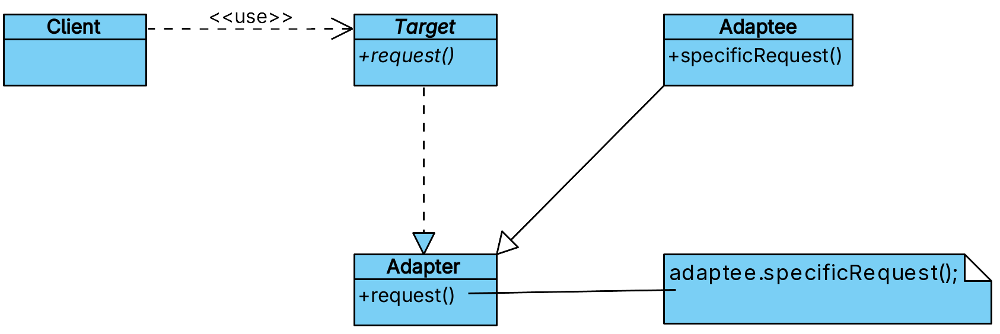

对象适配器结构：

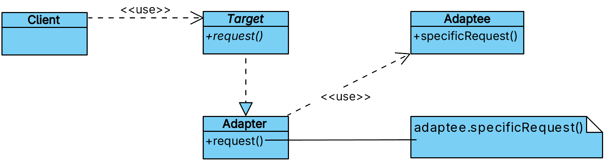

### 6. 参与者

- `Target`：系统中的新接口，也就是我们当前要使用或者正在使用的接口。
- `Client`： 客户端代码，要使用 `Target`接口的代码。
- `Adaptee`： 系统中的老接口，这个是要被适配的接口，它与新接口不兼容。
- `Adapter`： 适配器，把老接口 `Adaptee`和新接口 `Target`进行适配。

### 8. 效果

类适配器的优缺点：

- 一个 `Adapter`要继承 `Adaptee`，由于Java中不支持多继承，所以如果想要适配 `Adaptee`的所有子类的时候，就无法完成，需要针对每个子类去实现一个 `Adapter`。
- 由于一个 `Adapter`继承类 `Adaptee`，所以适配器可以重写父类的方法，修改 `Adaptee`的行为。
- 类适配器不需要像对象适配器那样在 `Adapter`中引用 `Adaptee`对象，也就是没有额外的对象引用，主要是很久以前需要考虑内存和性能等问题，故这在当时是一个很重要的问题，现在几乎不会考虑这个因素了。

对象适配的优缺点：

- `Adapter`持有 `Adaptee`的对象引用，所以如果 `Adaptee`如果有多个子类也需要进行适配，该 `Adapter`也同样适用与这些子类。另外还以在 `Adapter`中给要适配的这些类统一的进行功能增强。
- 由于不是继承 `Adaptee`，所以 `Adapter`不能直接修改 `Adaptee`的行为，需要额外的 `Adaptee`的子类去修改父类行为，然后 `Adapter`再使用子类去适配。

使用适配器模式还要考虑的其他一些因素：

第一个： `Adapter`的匹配程度。不同的适配器的转换难度不同，有的可能只需要改个方法名，有的则需要重构调用逻辑。

比如最简单的适配器只需要将名字进行转换即可， `Target`：

```java
interface Target {

    void request();
}
```

`Adaptee`：

```java
class Adaptee {

    public void specificRequest() {

        System.out.println("specific");
    }
}
```

`Adapter`：

```java
class Adapter
        implements Target {

    private Adaptee adaptee;

    @Override
    public void request() {

        adaptee.specificRequest();
    }
}
```

有时候 `Target`和 `Adaptee`的差异巨大，这时的适配器转换就比较复杂， `Target`：

```java
interface JsonService {

    JsonObject getJson();
}
```

`Adaptee`：

```java
class XmlService {

    public String getXml() {

        return "<data></data>";
    }
}
```

这种适配不仅需要改接口，还需要转换数据结构，逻辑比较复杂。

第二个：可插入的 `Adapter`。一个类越少的依赖具体的接口，那这个类就更容易被复用。比如说一个 `ReportService`如果强依赖 `MySQLService`，这个 `ReportService`在将来要换成其他数据库就很麻烦。但是如果它依赖的是 `Database`接口，那么将来切换任何数据库的时候 `ReportService`就可以不用改变。这句话是说 `ReportService`不要依赖具体的数据库实现，而是让 `Database`接口去适配不同的数据库。

回到适配器模式中，由于适配器可以帮我们将其他的接口转换成我们需要的接口，所以我们系统就不需要考虑要使用的其他的接口都是完全一致的，不一致也无所谓，适配器可以帮我们转换成我们想要的。这样系统就更开放，我们也不要求要使用的其他的所有接口都要有统一的形式。

另外如果我们在老系统上进行开发，又看不惯老系统的接口定义，还不想修改老代码。那我们就可以直接定义新接口，使用适配器去调用老代码。

第三点，使用双向适配器提供透明操作。这段话的意思是让适配器同时兼容 `Target`和 `Adaptee`，直接看代码示例：

```java
interface Target {

    void request();
}
```

```java
class Adaptee {

    public void specificRequest() {

        System.out.println("specific");
    }
}
```

双向适配器：

```java
class BidirectionalAdapter
        extends Adaptee
        implements Target {

    @Override
    public void request() {

        specificRequest();
    }
}
```

使用方式1，可以当成 `Target`使用：

```java
Target t =
    new BidirectionalAdapter();
```

释放方式2，也可以当成 `Adaptee`用：

```java
Adaptee a =
    new BidirectionalAdapter();
```

这就是双向透明。这能提供新老系统的兼容性，新系统中和老系统中都能使用。

### 9. 实现

1. 使用 `C++`实现适配类，这是在说 `C++`的方式。
2. 可插入的适配器

第二点有三种实现：

- 使用抽象操作
- 使用代理对象
- 参数化的适配器

### 10. 代码示例

### 11. 已知应用

### 12. 相关模式

桥接模式和对象适配器模式的结构类似，但意图不一样，桥接模式目的是将接口部分和实现部分分离。

装饰器模式增强了其他对象的功能，又不改变原有接口。

代理模式不改变原有接口。

## 4.2 Bridge(桥接)--对象结构型模式

### 1. 意图

> 将抽象部分与它的实现部分分离，使它们可以独立地变化。

这里的“抽象”和“实现”不是 `Java`语法层面的概念，不要去想 `abstract class, interface, implements`这些。

桥接模式中的抽象（Abstraction）和实现（Implementation）是系统设计层面的概念。

桥接模式的“抽象”是指系统对外暴露的高层业务逻辑，也就是用户眼中的功能。比如一个消息通知系统中，有：

- 普通消息
- 紧急消息
- 定时消息

这些消息都是业务层的概念。

定义消息通知：

```java
abstract class Notification {
    abstract void send(String message);
}
```

这里的 `Notification`就是桥接模式中的“抽象部分”，也就是整个上层的消息通知业务就是“抽象部分”。它描述了系统中这个业务提供的功能：消息通知。

桥接模式中的“实现”指的是底层的实现机制（系统中的公共基础模块或者是类似于公司中间件团队的基础系统）。比如通知消息可以通过多种方式发送：

- 邮件
- 短信

这些具体的发送方式属于更基础的技术实现，并不单单属于某一个上层业务，而是所有业务层都可以用到的基础部分。可以定义发送方式：

```java
interface MessageSender {
    void sendMessage(String message);
}
```

这里 `MessageSender`就是桥接模式中的“实现部分”，也就是独立于业务层面的，更底层的基础功能部分。

具体发送方式的代码：

```java
class EmailSender implements MessageSender {
    public void sendMessage(String message) {
        System.out.println("邮件发送: " + message);
    }
}
```

```java
class SmsSender implements MessageSender {
    public void sendMessage(String message) {
        System.out.println("短信发送: " + message);
    }
}
```

上层的消息通知业务只关心消息通知的事情，比如消息类型，是普通通知还是紧急通知；消息内容；消息格式等等。

底层的发送方式属于基础组件或者直接就是中间件团队的基础系统，它完全不关心业务是什么，只需要业务层给出业务层想要发送的东西就行。对底层基础组件而言，业务层的消息就像是个打包好的东西，它只管发出去。底层基础组件关心的是怎么发送，比如：

- 短信：怎么连接运营商、怎么发请求、怎么鉴权；
- 邮件：`SMTP`协议、邮件服务器、编码格式。

所谓“分离”就是将业务系统和基础组件（中间件基础系统）进行分离。

如果说不用桥接模式去分离这两部分，而是将消息通知和基础的发送方式融合在一起，可能有的代码就像如下：

```java
class EmailNormalNotification
class SmsNormalNotification

class EmailUrgentNotification
class SmsUrgentNotification
```

这样设计会让类的数量巨多，现在有3种消息类型，2种发送方式，类的数量就是 3x2=6个。

如果以后再新增通知方式：

- 微信
- 钉钉
- 语音
- AI

类的数量会爆炸。产生这种问题的根本原因是系统中有两个维度：

- 第一个维度：消息类型
	- 普通消息
	- 紧急消息
	- 定时消息
- 第二个维度：发送方式
	- 邮件
	- 短信

并且这两个维度耦合在一起了，这样的方式就会成了如下的组合：

```
普通+邮件
普通+短信

紧急+邮件
紧急+短信
```

类的数量是 `m * n`。

使用桥接模式就是要把这两个变化维度给拆开，让这两个维度独立变化。对于业务层的消息定义代码可能是如下这样：

```java
abstract class Notification {
    protected MessageSender sender;

    public Notification(MessageSender sender) {
        this.sender = sender;
    }

    abstract void send(String message);
}
```

而对于基础组件（或者是中间件基础系统）的发放方式的定义代码如下：

```java
interface MessageSender {
    void sendMessage(String message);
}
```

在业务层的代码 `Notification`中内部持有基础组件的 `protected MessageSender sender;`，这就是所谓的 `Bridge`桥，因为业务层的功能 `Notification`和基础组件的 `MessageSender`通过组合的方式连接起来了。

“独立变化”，由于两部分分开了，一部分是业务层代码，一部分是基础组件代码，这两部分的变化是不会相互影响的。

比如新增消息类型，也只是在业务层中新增消息类型，完全不会影响到基础组件部分。新增一个消息类型：

```java
class SevereNotification extends Notification {

    public SevereNotification(MessageSender sender) {
        super(sender);
    }

    @Override
    void send(String message) {
        sender.sendMessage("[严重通知]" + message);
    }
}
```

基础组件代码完全不用修改。

同样，如果基础组件增加了新的发送方式，业务层代码也完全不会收到影响。比如增加新的发送方式：

```java
class WechatSender implements MessageSender {

    @Override
    public void sendMessage(String message) {
        System.out.println("微信发送: " + message);
    }
}
```

业务层代码完全不用修改。这就是两个维度的独立变化。

下面是完整的代码示例，首先是“实现部分“，也就是基础组件的发送方式， `MessageSender`：

```java
interface MessageSender {

    void send(String message);
}
```

`EmailSender`：

```java
class EmailSender implements MessageSender {

    @Override
    public void send(String message) {

        System.out.println("邮件发送: " + message);
    }
}
```

`SmsSender`：

```java
class SmsSender implements MessageSender {

    @Override
    public void send(String message) {

        System.out.println("短信发送: " + message);
    }
}
```

接下来是“抽象部分”，也就是业务层的通知逻辑， `Notification`：

```java
abstract class Notification {

    protected MessageSender sender;

    public Notification(MessageSender sender) {
        this.sender = sender;
    }

    public abstract void send(
            String message);
}
```

接下来是“扩展抽象”，也就是业务层的具体的通知逻辑的实现，普通消息通知：

```java
class NormalNotification extends Notification {

    public NormalNotification(MessageSender sender) {
        super(sender);
    }

    @Override
    public void send(String message) {
        sender.send("[普通] " + message);
    }
}
```

紧急消息通知：

```java
class UrgentNotification extends Notification {

    public UrgentNotification(MessageSender sender) {
        super(sender);
    }

    @Override
    public void send(String message) {
        sender.send("[紧急] " + message);
    }
}
```

客户端使用，紧急+邮件：

```java
Notification n1 = new UrgentNotification(new EmailSender());

n1.send("服务器宕机");
```

普通加短信：

```java
Notification n2 = new NormalNotification(new SmsSender());

n2.send("今晚发布");
```

现在可以再试着重新理解下这句话：“将抽象部分与它的实现部分分离，使它们可以独立地变化。”

### 2. 别名

`Handle/Body`，这是 `C++`中的概念，这本书是很早很早之前写的，要解决的问题都是当时出现的问题，有些问题可能现在看起来也不是那么严重类。所使用的概念都是当时的，有些看起也很别扭。

### 3. 动机

对于一个抽象概念，通常用父类+子类来实现不同的变体。比如有一个抽象的图形的概念，它可以有很多实现：圆形、矩形、三角形等，我们会很自然的想到继承体系：

```java
abstract class Shape {
    abstract void draw();
}
```

```java
class Circle extends Shape {
    @Override
    void draw() {
        System.out.println("绘制圆形");
    }
}
```

```java
class Rectangle extends Shape {
    @Override
    void draw() {
        System.out.println("绘制矩形");
    }
}
```

父类 `Shape`统一定义接口，子类 `Circle`， `Rectangle`分别实现。

这种单纯依赖继承的方式不灵活，系统中有时不仅仅只有一个变化维度。上面例子中不仅图形会变化：

- 圆形
- 矩形
- 三角形

绘制的 `API`也会变化：

- `Windows API`
- `Linux API`
- `Mac API`

此时系统有两个维度：

- 维度1：图形类型
	- `Circle`
	- `Rectangle`
- 维度2: 绘图平台
	- `Windows`
	- `Linux`

如果继续使用继承方式，则会像如下的代码：

```java
class WindowsCircle extends Shape {}
class LinuxCircle extends Shape {}

class WindowsRectangle extends Shape {}
class LinuxRectangle extends Shape {}
```

以后再增加 `Mac`则需要添加：

```java
MacCircle
MacRectangle
```

类的数量爆炸，这就是继承体系的缺点。同时继承也将“抽象部分“和”实现部分“写死在一起了：

```java
class WindowsCircle extends Shape
```

这里的 `Circle`和 `Windows API`绑定在了一起，即图形类型和平台实现耦合了。

这样后面无论是修改图形，还是修改平台都会相互影响，比如 `Windows API`修改了，可能就要修改：

```java
WindowsCircle
WindowsRectangle
WindowsTriangle
```

如果要新增 `Mac`平台，那么需要: `所有图形 x Mac`；如果要新增一个三角形，那么需要： `三角形 x 所有平台`。

桥接模式将“抽象部分”和“实现部分”分开，上述例子使用桥接模式实现如下，首先定义实现部分，也就是平台 `API`：

```java
interface DrawAPI {
    void drawCircle();
}
```

具体的平台实现：

```java
class WindowsDrawAPI implements DrawAPI {

    public void drawCircle() {
        System.out.println("Windows画圆");
    }
}
```

```java
class LinuxDrawAPI implements DrawAPI {

    public void drawCircle() {
        System.out.println("Linux画圆");
    }
}
```

抽象部分，也就是图形部分：

```java
abstract class Shape {

    protected DrawAPI drawAPI;

    public Shape(DrawAPI drawAPI) {
        this.drawAPI = drawAPI;
    }

    abstract void draw();
}
```

扩展抽象，也就是具体的图形：

```java
class Circle extends Shape {

    public Circle(DrawAPI drawAPI) {
        super(drawAPI);
    }

    @Override
    void draw() {
        drawAPI.drawCircle();
    }
}
```

使用：

```java
public class Main {

    public static void main(String[] args) {

        Shape shape1 =
                new Circle(new WindowsDrawAPI());

        Shape shape2 =
                new Circle(new LinuxDrawAPI());

        shape1.draw();
        shape2.draw();
    }
}
```

在使用继承体系的时候 `WindowsCircle`是编译时绑定的，而现在 `new Circle(new WindowsDrawAPI())`可在运行时组合。

### 4. 适用性

第一种场景，如果不想要业务（抽象部分）和基础组件（实现部分）之间有强耦合，可以使用桥接模式。如果两部分是分开的，程序运行时实现部分就可以被动态替换。

第二种场景，“类的抽象”不是指 `Java`语法 `abstract class`，而是高层的业务功能。“实现”也不是语法层面的实现，而是底层实现机制（基础功能）。这是系统中的两个维度，桥接模式让这两个维度都可以独立进行扩展，并可以让这两部分自由的动态组合。

第三种场景，实现部分（基础组件）的修改，对客户端（也就是使用基础组件的代码）没影响，客户端不需要修改。

第四种场景，这部分是在讲 `C++`中的问题。

第五种场景，如果系统中有多个维度，不将这些维度分开而是直接耦合在一起去实现功能，会导致类的数量过多。比如有一个系统中有一些窗口：

- 普通窗口
- 图标窗口
- 弹出窗口

这些窗口都是上层功能，属于一个维度。同时还有对应不同系统的实现：

- `Windows`
- `Linux`
- `Mac`

这些是针对特定系统的底层实现，属于另外一个维度。

如果使用普通的继承方式来实现，则会有如下的一大堆的类：

```java
WindowsNormalWindow
WindowsIconWindow
WindowsPopupWindow

LinuxNormalWindow
LinuxIconWindow
LinuxPopupWindow

MacNormalWindow
MacIconWindow
MacPopupWindow
```

如果出现了这种情况，那就说明需要将这两个维度分解程两部分，不能再直接耦合到一起。这种情况就可以使用桥接模式。

“嵌套泛化”，在面向对象里泛化=继承，例如：

```
Animal
   ├── Dog
   ├── Cat
```

这就是一个泛化层次。为什么叫泛化？是因为父类 `Animal`是更一般的概念，而子类 `Dog`和 `Cat`是更具体的概念。

所谓“嵌套的泛化”是说一个继承层次里面又包含另一个继承维度。比如下面的是一次层泛化：

```
Window
   ├── PopupWindow
   ├── IconWindow
```

第二层泛化：

```
WindowsWindow
LinuxWindow
MacWindow
```

使用嵌套泛化我们就会像如下进行组合：

```
WindowsPopupWindow
LinuxPopupWindow
MacPopupWindow
```

第六种场景，多个对象共享实现。

### 5. 结构

结构图：

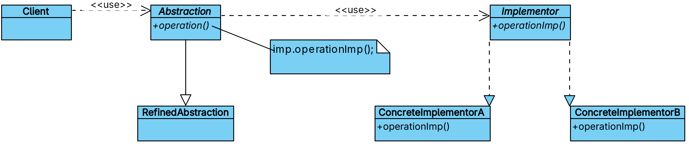
### 6. 参与者

- `Abstraction`，一个抽象类，定义的“抽象部分”，也就是业务层的抽象，并且内部持有 `Implementor`的引用。
- `RefinedAbstraction`：具体的“抽象部分”的实现，也就是具体的业务实现。
- `Implementor`： 一个接口，定义的是“实现部分”，也就是基础模块。
- `ConcreteImplementor`：基础模块的具体实现。

### 7. 协作

抽象部分将客户端的请求转发给实现部分，也就是业务层调用基础组件层。

### 8. 效果

桥接模式优点：

1. 分离接口及其实现部分，业务层和基础组件层分离，两部分能独立变化，互不影响。
2. 提高可扩充性，业务层和基础组件分离，两部分可分别单独扩展。
3. 实现细节对客户透明，客户端只看到和使用业务层代码，具体基础组件不会跟客户端打交道。

### 9. 实现

### 10. 代码示例

### 11. 已知应用

### 12 相关模式

抽象工厂模式可用来创建和配置一个特定的桥接模式。

适配器模式和桥接模式看起来都像是在中间加一层，但它们的设计目的完全不同。适配器模式通常是一种补救措施，它要适配的一方往往是已经存在了的但是不兼容的接口。而桥接模式是在开始的时候就设计好的结构，提前预判系统中会有多个维度的变化。

## 4.3 Composite（组合）--对象结构型模式

### 1. 意图

> 将对象组合成树形结构以表示“部分–整体”的层次结构。Composite使得用户对单个对象和组合对象的使用具有一致性。

组合模式要解决的是一个经典的问题：如何用统一方式处理单个对象和一组对象。这是 `GUI`、文件系统、组织结构、菜单系统等很多系统中的核心问题。

“部分-整体”，比如如下：

```
文件夹
   ├── 文件
   ├── 文件
   └── 子文件夹
```

这里的 `文件夹`是整体，而 `文件`和 `子文件夹`是部分。

再比如公司组织结构：

```
总经理
   ├── 技术部
   │      ├── 张三
   │      └── 李四
   └── 财务部
```

这里面的部门是整体，员工是部分。

`GUI`界面：

```
窗口
   ├── 按钮
   ├── 文本框
   └── 面板
```

这里的窗口是整体，而按钮等是部分。

上面的例子中都是同样的结构：一个对象包含其他对象。像这种整体包含部分，部分又包含子部分的关系，就像是一棵树，因此也叫树形结构，这也是面向对象里的递归结构。

如果没有组合模式，我们可能会写如下代码：

```java
class File {
    void show() {
        System.out.println("显示文件");
    }
}
```

```java
class Folder {

    List<File> files;

    List<Folder> folders;
}
```

此时 `Folder`中既有 `File`又有 `Folder`，我们需要分开处理：

```java
for(File f : files) {}

for(Folder f : folders) {}
```

如果以后要新增其他类型，假如是：
- `Shortcut`
- `ZipFile`
- `CloudFolder`

处理逻辑将会变得很复杂，因为我们区分了不同的类型。而使用组合模式则不一样，组合模式中文件和文件夹本质上都是节点，于是有统一的抽象：

```java
abstract class FileSystemNode {

    protected String name;

    public FileSystemNode(String name) {
        this.name = name;
    }

    abstract void display();
}
```

叶子节点：

```java
class FileNode extends FileSystemNode {

    public FileNode(String name) {
        super(name);
    }

    @Override
    void display() {
        System.out.println("文件: " + name);
    }
}
```

组合节点：

```java
class FolderNode extends FileSystemNode {

    private List<FileSystemNode> children = new ArrayList<>();

    public FolderNode(String name) {
        super(name);
    }

    public void add(FileSystemNode node) {
        children.add(node);
    }

    @Override
    void display() {
        System.out.println("文件夹: " + name);

        for (FileSystemNode node : children) {
            node.display();
        }
    }
}
```

在 `FolderNode`中存的是 `List<FileSystemNode>`，而不是 `List<FileNode>`，这意味着 `Folder`中可包含任何节点：文件、文件夹、未来新增节点。

客户端代码在使用的时候不用区分对象是单个对象还是组合对象：

```java
FileNode file = new FileNode("a.txt");
FolderNode folder = new FolderNode("docs");

file.display();
folder.display();
```

完全不需要像如下的方式使用：

```java
if (是文件)
if (是文件夹)
```

这就是使用时的一致性，可以消灭大量的条件判断。如果没有组合模式，我们可能会写：

```java
if(node instanceof File) {

} else if(node instanceof Folder) {

}
```

有了组合模式之后不需要复杂判断逻辑，而是直接：

```java
node.display();
```

组合模式统一的对待叶子和容器，让客户端不再关心对象的类型，以后新增类型，客户端也不用修改。

组合模式体现了递归思想的面向对象化，因为组合对象内部还可以包含同一种抽象对象，这就是递归定义。

“将对象组合成树形结构”意思是对象之间形成递归包含关系。

“表示“部分–整体”的层次结构”意思是有整体和部分这种层次结构。

“对单个对象和组合对象的使用具有一致性”，意思是客户端不需要区分叶子和容器，统一调用接口。

组合模式的核心目标是用统一的方式处理单个对象和组合对象。使用统一的抽象接口来做到这一点，让单个对象和组合对象抽象为同一种类型，这样组合对象中包含单个对象就形成了递归树结构。

组合模式本质不是树结构，而是统一处理单个对象与组合对象。
### 2. 动机

### 3. 适用性

使用组合模式的情况：

- 一个对象如果是“部分-整体”的层次结构，可以使用组合模式来表示。
- 如果想要客户端代码统一的调用所有对象，不是去区分组合对象和单个对象，可以使用组合模式。

第一条是讲组合模式应用场景中的结构是什么样子的，第二条是讲客户端代码使用组合模式中的对象的方式，这两条合起来就在讲为什么需要组合模式。

“部分-整体”就是一个对象由多个子对象组成。比如文件系统中：

```
文件夹
   ├── 文件
   ├── 文件
   └── 子文件夹
```

文件夹是整体，文件和子文件夹是部分。

比如GUI界面：

```
窗口
   ├── 按钮
   ├── 面板
   │      ├── 文本框
```

窗口是整体，按钮是部分。

比如公司组织结构：

```
公司
   ├── 部门
   │      ├── 员工
```
公司是整体，部门是部分。

上面在说明的都是“对象包含对象”这种结构。

“层次结构”，基本上就是在说树结构，比如：

```
公司
   ├── 技术部
   │      ├── 后端组
   │      │      ├── 张三
```

这种结构就存在层级，也就是层次结构。在处理这种层次结构的情况时，如果不使用组合模式，将会是下面这样的情形：

```java
class FileNode {

    void show() {
        System.out.println("显示文件");
    }
}
```

```java
class FolderNode {

    List<FileNode> files;

    List<FolderNode> folders;
}
```

这时候 `Folder`中包含两部分内容：文件和文件夹，需要分别去处理，代码中会到处存在如下的判断逻辑：

```java
if (是文件)

if (是文件夹)
```

而组合模式则是将文件和文件夹都看作是同一类型的东西，即节点，这样便可以统一进行抽象：

```java
abstract class Node {

    protected String name;

    public Node(String name) {
        this.name = name;
    }

    abstract void show();
}
```

这样便可以方便的表示“部分-整体”，“部分”：

```java
class FileNode extends Node {

    public FileNode(String name) {
        super(name);
    }

    @Override
    void show() {
        System.out.println("文件: " + name);
    }
}
```

“整体“：

```java
class FolderNode extends Node {

    private List<Node> children =
            new ArrayList<>();

    public FolderNode(String name) {
        super(name);
    }

    public void add(Node node) {
        children.add(node);
    }

    @Override
    void show() {

        System.out.println("文件夹: " + name);

        for (Node node : children) {
            node.show();
        }
    }
}
```

这里没有了文件集合和文件夹集合，取而代之的是一个节点集合。节点是文件和文件夹的抽象，故可以代表文件和文件夹，也可代表未来新增的新类型节点。

上面这种表示方式也是递归结构。

使用组合模式之后，客户端代码不需要关心一个对象是单个对象还是组合对象，调用的时候统一使用节点：

```java
Node file = new FileNode("a.txt");
Node folder = new FolderNode("docs");

file.show();

folder.show();
```

客户端再也不用使用如下方式调用了：

```java
if(node instanceof FileNode) {

} else if(node instanceof FolderNode) {

}
```

### 4. 结构

结构图：

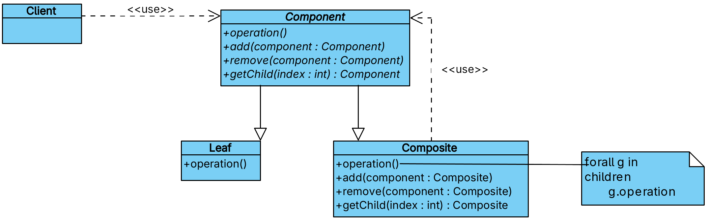

### 5. 参与者

- `Component`： 组合中的对象的抽象，既能表示“部分”，也能表示“整体”。
- `Leaf`： 在组合中表示叶节点对象（“部分”），叶节点没有子节点。
- `Composite`： 表示“整体”，也即是它包含子部件。
- `Client`： 通过 `Component`接口操作组合对象。

### 6. 协作

客户端代码只依赖 `Component`接口与组合结构中的对像进行交互。如果调用的 `Component`是一个叶节点，则叶节点直接处理请求；如果 `Component`是一个 `Composite`则 `Composite`会将请求转发给子对象进行处理。

### 7. 效果

- 定义了包含基本对象和组合对象的类层次结构，利用基本对象可以组成复杂的组合对象，而组合对象又可以被组合，形成一个递归树结构。
- 简化客户端代码，客户端代码使用统一的抽象，而不是去判断是单个对象还是组合对象。
- 使得更容易增加新类型的组件，由于客户端代码中没有使用具体的 `Composite`子类，而是使用的抽象的 `Composite`，因此增加新类型后客户端代码不需要修改。
- 使你的设计变得更加一般化，这段是在讲组合模式的一个缺点，组合模式太灵活了也不太好。

对于最后一点，组合模式的缺点是太灵活了，类型系统很难约束结构是否合法，也就是会削弱编译器的类型检查。

组合模式确实让系统更一般化，即系统变得更通用、更抽象、更灵活。它统一了单个对象和组合对象：

```java
abstract class Component
```

所有对象都变成 `Component`，客户端可以统一处理： `component.operation();`而不用关心具体的对象类型，这确实让系统变得更加灵活。比如在一个文件夹中存在 `List<Component>`，未来不管新增什么类型，客户端代码都不需要修改。

灵活性是优点也是缺点，灵活性通常意味着约束减少。比如一个文件夹：

```java
class Folder extends Component {

    List<Component> children;
}
```

文件夹中可包含任何的 `Component`，只要是 `Component`类型的都可以。在一个 `GUI`系统中 `Panel`应该只能包含 `UI`组件，但是由于我们代码中是 `List<Component>`，所以理论上可以包含任何对象，只要它实现了 `Component`接口，类型系统阻止不了这些。

我们其实希望的是某些组合只能包含某些特定的组件，比如在 `GUI`系统中， `Window`只能包含 `UI`组件； `Menu`只能包含 `MenuItem`等等，这些限制就是结构约束。组合模式中为了统一性，会写 `List<Component>`这样的抽象代码，就会导致类型系统失去结构约束的能力。我们不能依赖编译器去帮我们检查结构是否合法，类型系统只知道 `Component`，而不知道 `Menu`里面只能放 `MenuItem`，这就是组合模式统一接口的代价。

这个问题我们只能在运行时进行检查，像如下的代码：

```java
class Menu extends Component {

    @Override
    public void add(Component c) {

        if (!(c instanceof MenuItem)) {
            throw new IllegalArgumentException(
                "Menu只能包含MenuItem"
            );
        }

        children.add(c);
    }
}
```

运行时检查的问题是只有在运行的时候才能发现问题。

这个问题也是一个常见的经典问题，做了统一抽象就会出现这样的问题，我们需要在灵活性和安全性之间做权衡。

### 8. 实现

实现组合模式需要注意的问题。

第1点，显式的父部件引用。子节点是否要保存父节点的引用，这在实际使用的时候是很重要的，会直接影响：

- 树的遍历
- 节点删除
- 节点移动
- 责任链
- 事件冒泡
- DOM操作

等大量操作。这其实也是在将如何维护树结构的双向关系。

显式的父部件引用就是直接保存父节点引用，比如：

```java
class Component {

    protected Component parent;
}
```

每个节点既知道自己的子节点，也知道自己的父节点。没有父节点的时候，如果要遍历组合结构，只能向下遍历，也就是只能从父节点到子节点去遍历。如果想要知道一个节点的父节点，只能从根节点重新遍历搜索。有了父节点，就可以实现双向遍历，这样就遍历就简化了。

有了父节点之后，对于结构的管理（节点的删除、移动、插入）也会极大的简化。

有了父节点引用，也能支持责任链模式，因为责任链模式本质上是向上委托，即交给父节点处理，如果没有父节点的引用根本没法实现。

父类的引用通常写在 `Component`类中：

```java
abstract class Component {

    protected Component parent;

    public void setParent(Component parent) {
        this.parent = parent;
    }

    public Component getParent() {
        return parent;
    }
}
```

还需要保证父子关系必须一致，通常父节点的修改由 `Composite`统一管理，不能允许外部乱改：

```java
class Composite extends Component {

    private List<Component> children = new ArrayList<>();

    public void add(Component child) {
        children.add(child);

        child.setParent(this);
    }

    public void remove(Component child) {
        children.remove(child);

        child.setParent(null);
    }
}
```

第2点，共享组件。这是在讲组合模式中的节点共享问题，一个节点能不能同时属于多个父节点。

组合模式中的 `Composite`不一定是树结构，当节点可共享时结构就变成了图。

共享组件可以减少内存占用，因为多个地方是都是用的同一个对象的引用，而不是一个对象的多份拷贝。

如果有一个组件只有一个父部件，就意味着这个节点只能属于一个父节点，这样这个组件就不能共享类。想要实现共享，就需要这个组件有多个父节点，但这样当一个请求需要向父节点传递时，就会导致无法确定向哪个父节点传递。

第3点，最大化 `Component`接口。这段话是在讲 `Component`接口到底应该定义多少东西。组合模式想要做到客户端完全不用区分 `Leaf`和 `Composite`，但是 `Leaf`和 `Composite`又不是完全一样的东西，所以哪些方法应该放进 `Component`就成了一个问题。

组合模式目的之一就是要让客户端不区分 `Leaf`和 `Composite`，于是要尽可能的把操作放进 `Component`中，即使像 `add()`这样的方法对 `Leaf`来讲并没有什么用，也要这样做，这样才能提供统一的接口。另外还要提供默认实现，比如像 `add()`方法对 `Leaf`来说没用，故要有默认实现：抛异常。 `Leaf`和 `Composite`也可以对默认实现进行重定义。

将尽可能多的方法放进 `Component`中与类层结构设计的原则冲突，类层次结构设计的原则规定父类不应该定义对子类没意义的方法。在 `Component`中就有很多方法对 `Leaf`没有意义，它本身就是叶子结点，没有子节点，有些方法在逻辑上不存在。但为了统一接口，这些方法又必须放在 `Component`中。

通常我们会给 `Component`中的方法一个默认空实现或者直接抛异常，这样 `Leaf`可以用默认实现，而 `Composite`则需要重新实现这个操作。

第4点，声明管理子部件的操作。这里还是在讲是不是应该尽可能把方法都放进 `Component`中。这涉及到安全性和透明性两种方案的选择。

透明性的意思是尽可能将所有方法都放进 `Component`中，这样所有子类不用单独区分类型，客户端使用统一的接口就可以。但同时也会出现上面说的问题，有很多方法对 `Leaf`无意义。

安全性的意思是不是将所有方法都放进 `Component`中，而是将所有共用方法放进去， `Composite`需要的方法只放进 `Composite`中，这样的好处是 `Leaf`继承的方法都是有意义的，另外在像 `Java`和 `C++`这样的静态语言中，编译时就能确定正确性。缺点就是失去了透明性， `Leaf`和 `Composite`具有不同接口。

第5点，`Component`是否应该实现一个 `Component`列表。这段是在讨论子节点集合 `children`应该放在哪里？这是一个空间效率和接口统一性的权衡问题。

一种方式是放在 `Component`中：

```java
abstract class Component {

    protected List<Component> children = new ArrayList<>();
}
```

好处是所有节点都有 `children`，接口统一，使用的时候不需要区分是 `Leaf`还是 `Composite`。但是 `Leaf`节点实际上是没有 `children`的， 它继承自 `Component`的 `children`实际上没有用，但是却占用内存空间，如果叶子节点数量巨多，那空间的浪费就会很严重。

另外一种方式是放在 `Composite`中：

```java
class Composite extends Component {

    List<Component> children = new ArrayList<>();
}
```

这种方式在实际项目中更常见，因为通常叶子结点的数量都很多。这种方式缺点就是需要牺牲接口的统一性。

第6点，子部件排序。有些场景需要子部件有顺序，比如语法分析树。需要顺序的需要注意实现，迭代器模式可以完成这项功能。

第7点，使用高速缓冲存储改善性能。需要频繁的进行遍历和查找，可以使用缓存加速。

第8点，应该由谁删除 `Component`。没有垃圾回收机制的语言中，当一个 `Composite`被销毁时，其子节点应该由 `Composite`进行删除。如果子节点是共享的，可以不用删除。

第9点，存储组件最好用哪种数据结构。可根据实际情况选择列表、树、数组或哈希表等。

### 9. 代码示例

### 10. 已知应用

### 11. 相关模式

- 通常父子部件连接，使用责任链模式。
- 装饰器模式通常会和组合模式一起使用。
- 享元模式可实现共享组件，但不能引用父部件。
- 迭代器模式可用来遍历 `Composite`。
- 访问者模式。

## 4.4 Decorator（装饰）--对象结构型模式

### 1. 意图

> 动态地给一个对象添加一些额外的职责。就增加功能来说，Decorator模式相比生成子类更为灵活。

“动态”是指在运行时添加功能，而不是编译时固定。比如说有一个基础的 `Coffee`，还可以加牛奶、加糖、加奶油，如果用继承来做可能会像如下：

```java
MilkCoffee
SugarCoffee
MilkSugarCoffee
CreamMilkSugarCoffee
```

这样组合的数量会非常多。装饰器模式不是这做，即不是提前定义所有组合，而是在运行时进行组合：

```java
Coffee coffee = new SimpleCoffee();

coffee = new MilkDecorator(coffee);

coffee = new SugarDecorator(coffee);
```

这里是在运行时动态组合，也就是“动态地添加职责”。

这里的“职责”不是什么业务职责而是额外额行为或者是附加的功能，比如如下的都是额外的职责：

- `Java IO`中 `BufferedInputStream`增加缓冲功能； `DataInputStream`增加读取基本类型的功能。
- `GUI`中给组件增加滚动条、边框、阴影。
- 日志系统中给对象增加缓存、权限检查、事务、统计。

这些都是额外职责。添加职责的意思是不修改原对象，而是在外面包一层，这些功能是叠加的：

```java
new MilkDecorator(
    new SugarDecorator(
        coffee
    )
)
```

装饰器模式比继承更加灵活，本质上就是用组合代替继承。继承的问题如下，假设有 `TextView`，想要扩展功能添加滚动、边框、阴影，使用继承来实现可能会像如下写代码：

```java
BorderTextView
ScrollableTextView
ShadowTextView
```

不同功能的不同组合：

```java
BorderScrollableTextView
ShadowBorderScrollableTextView
```

这种是静态组合，在编译期就固定了，这种组合会导致类的数量爆炸，这种情况也叫做子类爆炸。

由于装饰器模式不会提前定义各种组合，是在运行时动态组合，所以不会出现这种类爆炸的情况。运行时自由组合：

```java
Component c =
    new BorderDecorator(
        new ScrollDecorator(
            new TextView()
        )
    );
```

这就是比继承更灵活。

装饰器模式可认为是对继承的一种扩展，标准的继承是类层次扩展，而装饰器模式则是对象层次的扩展。继承在编译期决定，而装饰器模式在运行时决定。

`Java IO`中的 `BufferedInputStream`就是装饰器模式：

```java
new BufferedInputStream(
    new FileInputStream("a.txt")
)
```

`Spring AOP`：事务，日志，权限等都是动态包装。

### 2.  别名

包装器（wrapper）

### 3. 动机

有时需要给对象添加功能，而不是给整个类添加功能。

比如有一个 `TextView`类，现在有三个对象： `text1, text2, text3`，我们想要给 `text1`增加滚动条，而 `text2, text3`保持不变，这种就是对象级别的添加功能。

对象级别的添加功能不适合用继承的方式，如果使用继承的方式做：

```java
class ScrollTextView extends TextView
```

那么所有的 `ScrollTextView`实例都有滚动功能，无法做到只有某个对象有滚动功能，其他对象没有滚动功能。

类级别的继承是静态的，也就是编译期确定的，一旦类定义好，功能就固定了，我们在运行时也就无法动态的去增加功能。

而装饰器模式就可以在运行时动态增加：

```java
service = new LogDecorator(service);

if(enableCache) {
    service =
        new CacheDecorator(service);
}
```

装饰器模式是将我们的对象嵌入到另一个对象中，也就是让另外一个对象包装我们的对象，比如：

```java
new BorderDecorator(
    textView
)
```

这里 `textView`是我们的对像，而 `BorderDecorator`是另外一个对象。 `BorderDecorator`内部保存 `textView`，这就是嵌入对象。

另一个对象（装饰器对象）的标准结构：

```java
class Decorator implements Component {

    protected Component component;

    public Decorator(Component component) {
        this.component = component;
    }
}
```

这就是标准的对象组合，所以装饰器模式本质上也是使用组合代替继承。

嵌入的对象（另一个对象）称为装饰器。装饰器需要与我们的对象接口一致，这是因为装饰器要伪装成原对象，提供给客户端代码用。

比如：

```java
interface Component {
    void operation();
}
```

具体的组件：

```java
class TextView implements Component
```

装饰器：

```java
class BorderDecorator implements Component
```

只有这样客户端才能无感知的替换，客户端只知道 `Component`，至于有多少层的装饰器它并不知道。

比如：

```java
Component c =
    new BorderDecorator(
        new ScrollDecorator(
            new TextView()
        )
    );
```

客户端仍然只调用 `c.operation()`。

装饰器会把客户端的请求转发给它所装饰的对象，装饰器本身不真正的完成核心功能，而是转发请求。装饰器还可以在转发前后增加功能。

由于装饰器是一个 `Component`，因此它还能继续被包装：

```java
new BorderDecorator(
    new ScrollDecorator(
        new ShadowDecorator(
            textView
        )
    )
)
```

这就是递归包装，也就意味着能添加任意多的功能。

装饰器模式不仅仅是简单增强对象，而是把功能拆成可组合的模块，然后通过对象嵌套动态的进行拼接，从而增强对象。

### 4. 适用性

适配器模式适用的场景：

- 动态扩展对象功能。
- 可撤销功能。
- 避免类爆炸或无法继承。

第1点，不给整个类添加功能，而是要给某一个对象添加功能。比如有3个 `TextView`对象：

```java
TextView text1;
TextView text2;
TextView text3;
```

如果只希望给 `text1`添加滚动条，其他两个对象保持不变，使用继承的方式就做不到，因为 `class ScrollTextView extends TextView`这样会影响所有 `ScrollTextView`的实例。

而使用装饰器模式就可以为单个对象添加功能：

```java
text1 = new ScrollDecorator(text1);
```

此时只有 `text1`被增强。

这就是对象级别的扩展，这种扩展是动态的，也就是运行是决定的，而不是编译时固定，比如：

```java
if(enableBorder) {
    component =
        new BorderDecorator(component);
}
```

这种包装对客户端是透明的，客户端不知道对象被包装了，它只能看到 `Component`：

```java
Component c =
    new BorderDecorator(
        new ScrollDecorator(
            new TextView()
        )
    );
```

客户端仍然使用 `c.draw();`调用，而不需要做这种判断： `if(c instanceof Decorator)`。

第2点，功能可以动态移除，继承的方式无法做到，一旦使用继承实现类某个功能： `new BorderWindow()`，该功能就永久存在了。使用装饰器模式则可以动态的移除功能，比如有增加了功能的代码：

```java
component = new BorderDecorator(component);
```

如果想要去掉边框功能，则可以如下实现：

```java
component =((BorderDecorator)component).getInnerComponent();
```

也可以进行重新包装。

第3点，不能用继承的方式进行扩展的时候，当一个类有大量的扩展，不同的组合会产生大量的子类，导致类数量爆炸。比如一个 `TextView`可支持：

- `Border`
- `Scroll`
- `Shadow`

如果用继承方式实现则会有如下代码：

```java
BorderTextView
ScrollTextView
ShadowTextView
```

如果要继续支持不同的组合，则会有：

```java
BorderScrollTextView
BorderShadowTextView
ScrollShadowTextView
BorderScrollShadowTextView
```

功能增多后，类的数量快速变多。这是继承方式的弊端，继承是静态组合，每种组合都需要一个子类，组合的增加导致类数量增加。

装饰器模式不提前定义组合，运行时动态拼装，比如：

```java
new BorderDecorator(
    new ShadowDecorator(
        new ScrollDecorator(
            textView
        )
    )
)
```

另外一种情况是类定义被隐藏，比如第三方类库，我们无法拿到源码。又或者类被 `final`修饰导致我们无法继承，此时我们就可以用装饰器模式来扩展。

装饰器模式实际上解决的是功能维度和类型维度的耦合问题。继承把功能写死在类型层次，类型同时承担类是什么以及有哪些功能，导致类爆炸。装饰器模式则把功能从类型中拆出来，功能变成可独立组合模块。

### 5. 结构

结构图：

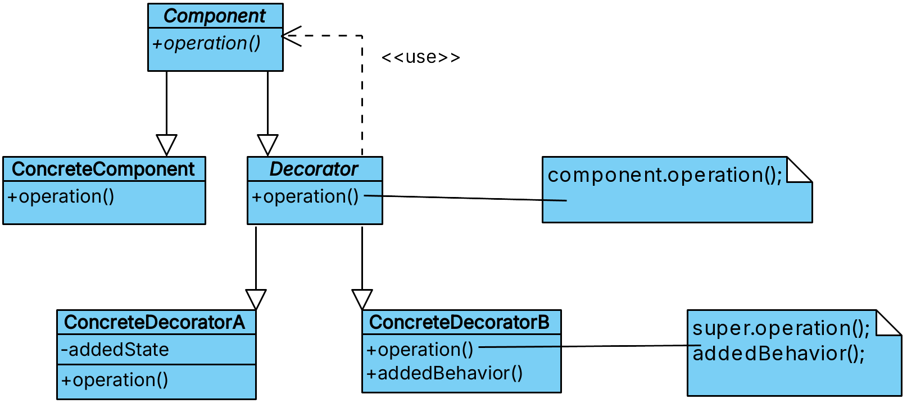

### 6. 参与者

- `Component`：实际对象的接口。
- `ConcreteComponent`：具体类型的对象。
- `Decorator`： 装饰器的抽象，继承 `Component`并持有 `Component`。
- `ConcreteDecorator`：装饰器的具体实现，在这里给具体的 `Component`添加职责。

### 7. 协作

装饰器将请求转发给具体的 `Component`对象，并且可以在转发请求前后执行一些额外的操作。

### 8. 效果

装饰器模式优点：

- 比静态继承更灵活
- 避免在层次结构高层的类有太多的特征

第1点是在讲对象组合优于类继承。普通的类继承是静态的继承，即在编译期确定，类一旦定义功能就固定了，比如：

```java
class BorderWindow extends Window
```

对象创建后不能动态变化。

装饰器模式是动态功能组合，在运行时动态添加和删除职责。比如添加职责：

```java
component = new BorderDecorator(component);
```

删除职责：

```java
component = ((BorderDecorator) component).getInnerComponent();
```

这就是动态的改变对象行为。

使用装饰器模式是还可以为一个 `Component`提供多个不同的装饰器，每个装饰器对应一个独立的功能，让功能模块化，这样功能就可以自由组合。

装饰器模式还可以重复的添加功能，比如：

```java
new BorderDecorator(
    new BorderDecorator(
        window
    )
)
```

第2点，可以避免将所有功能都塞进基类中，如果在基类中加入太多功能，会导致基类变的很大，功能复杂，并且不是所有子类都会使用全部的功能。装饰器模式不需要在基类中添加过多功能，如需要新功能则使用装饰器进行组合。

缺点：

- 装饰器与它的 `Component`不一样。
- 有许多小对象。

第1点，装饰器会破坏对象标识。虽然一个装饰器看起来像原对象，它们都实现了相同的接口 `Component`，但实际上它们并不是同一个对象。比如：

```java
Component text = new TextView();

Component decorated = new BorderDecorator(text);
```

这里 `text != decorated`。之所以强调它们不是同一个对象，是因为这是一个透明的包装，客户端可以像使用原对象一样使用装饰器，在客户端眼里它使用的就是原对象，它并不知道装饰器的存在。客户端使用代码：

```java
Component c =
    new BorderDecorator(
        new TextView()
    );

c.draw();
```

透明并不等于原对象。

对象标识就是对象是不是同一个实例， `Java`中的 `==`，比如：

```java
TextView text = new TextView();

Component decorated = new BorderDecorator(text);

System.out.println(text == decorated);
```

会输出 `false`，这是因为它俩是两个对象。

这会导致很多问题，比如缓存，比如原对象已经缓存：

```java
Map<Component, Data>
```

后续原对象被包装：

```
component = new BorderDecorator(component);
```

由于缓存的 `key`是对象，故使用包装后的对象查询缓存肯定是会失败的，原对象和装饰器不是通过一个和对象， `key`也就不一样。

第2点，装饰器模式会产生很多小对象，这是因为每个功能都被单独拆成一个装饰器。这样做可以自由组合功能，非常灵活，但系统复杂度会变大，学习和排错也会很困难。

### 9. 实现

使用装饰器模式要注意的点：

1. 接口的一致性。
2. 省略抽象的 `Decorator`类。
3. 保持 `Component`类的简单性。
4. 改变对象外壳与改变对象内核。

第1点，装饰器必须伪装成原对象，也就是它要和原对象一样都要实现 `Component`接口，这样客户端才能无感知的使用。

第2点，如果功能很简单只有一个装饰器，就可以省略 `Decorator`抽象类，避免过度设计。

第3点， `Component`要给原对象和包装器同时使用，它的定义要尽可能简单，不要塞过多的功能进去。

第4点，这是在讲有些场景下可以不用装饰器模式，而是使用策略模式代替。

“改变对象外壳”就是装饰器，装饰器在对象外面包一层，原对象并没有改变，所以改变的像是“对象外壳”。

“改变对象内核”是说策略模式，策略模式不是在外面包一层，而是在内部进行行为替换。

当一个 `Component`类很大的时候，用装饰器模式代价就会很大，这种情况使用策略模式比较好。

### 10. 代码示例

### 11. 已知应用

### 12. 相关模式

- 装饰器模式仅改变对象的职责，而不改变接口；适配器模式则将给对象一个全新的接口。
- 可以将装饰器视为一个退化的、仅有一个组件的 `Composite`，另外装饰器仅给对象添加额外职责，它的目的并不是对象的聚集。
- 装饰器模式改变对象的外壳，策略模式改变对象的内核。

## 4.5 Facade（外观）--对象结构型模式

### 1. 意图

> 为子系统中的一组接口提供一个一致的界面，Facade模式定义了一个高层接口，这个接口使得这一子系统更加容易使用。

一个复杂的系统内部可能有很多类、很多调用步骤。外观模式会在外面再包一层，提供一个简单统一的入口，让客户端不用了解系统内部细节，也能方便的调用整个系统。

“子系统”就是系统内部的一组功能模块。比如一个电商系统中有很多子系统：

- 支付系统
- 库存系统
- 物流系统
- 消息系统
- 订单系统

“一组接口”，这里接口不是 `Java`关键字 `interface`，而是对外提供的功能调用方法，比如库存系统中的：

```java
reduceStock()
lockStock()
unlockStock()
```

支付系统中的：

```java
pay()
refund()
query()
```

这些统称为子系统的一组接口。

“提供要给一致的界面”意思是给一个统一的入口。原来用户需要和很多复杂系统打交道，现在有了统一的入口之后，用户只需要调用这个入口即可。

假设有一个下单功能，表面看用户只需要点击提交订单即可，但是后台却需要非常复杂的逻辑：

```
1. 创建订单
2. 扣减库存
3. 创建支付单
4. 调用支付
5. 创建物流
6. 发送短信
7. 发送邮件
8. 写审计日志
```

如果这些都由客户端自己使用如下的方式调用：

```java
orderService.create();

stockService.reduce();

paymentService.pay();

logisticsService.create();

smsService.send();

emailService.send();
```

这里会有很多问题：

1. 客户端必须知道内部的细节，比如：调用顺序、哪些服务需要调用、那些参数需要调用、那些步骤必须成功等等。
2. 使用复杂，每个调用的地方都要写一遍： `创建订单 -> 扣库存 -> 支付 -> 发消息`。
3. 子系统修改会影响所有客户端，比如物流系统的接口有变化，所有调用这个接口的地方都需要修改。

外观模式中，这些复杂的事情不让客户端去做，而是增加一个 `Facade`去做，客户端只需要使用 `Facade`这个统一的入口即可，这就是“一致的界面”。

使用外观模式的代码示例，首先定义各种子系统，订单系统：

```java
public class OrderService {

    public void createOrder() {
        System.out.println("创建订单");
    }
}
```

库存系统：

```java
public class StockService {

    public void reduceStock() {
        System.out.println("扣减库存");
    }
}
```

支付系统：

```java
public class PaymentService {

    public void pay() {
        System.out.println("完成支付");
    }
}
```

物流系统：

```java
public class LogisticsService {

    public void deliver() {
        System.out.println("创建物流订单");
    }
}
```

创建外观类：

```java
public class OrderFacade {

    private OrderService orderService = new OrderService();

    private StockService stockService = new StockService();

    private PaymentService paymentService = new PaymentService();

    private LogisticsService logisticsService = new LogisticsService();

    public void placeOrder() {

        orderService.createOrder();

        stockService.reduceStock();

        paymentService.pay();

        logisticsService.deliver();
    }
}
```

客户端调用：

```java
public class Client {

    public static void main(String[] args) {

        OrderFacade facade = new OrderFacade();

        facade.placeOrder();
    }
}
```

“高层接口”，这里不是 `Java Interface`而是更高级别，更粗粒度，更容易理解的接口。原来的子系统的各种接口是低层接口：

```java
createOrder()

reduceStock()

pay()

deliver()
```

这些接口的粒度更细，如果客户端直接使用这些接口，则客户端必须要了解每个接口的细节。

外观模式提供的高层接口，比如上述例子中的 `placeOrder()`方法就是高层接口，它代表的是完成一次下单业务。

客户端只需要面对这个简单的接口，而不是面对底层多个子系统的接口，客户端不需要知道：

- 调用顺序
- 内部逻辑
- 子系统依赖

这样对客户端来说更简单，后续维护也更容易，如果想要增加积分系统、优惠券系统、风控系统等，只需要修改 `OrderFacade`，客户端完全不用修改。

外观模式最核心的本质就是：封装复杂流程。它适合的场景：

- 老系统封装，很多老的系统 `API`混乱、调用复杂、顺序严格，使用外观模式加一层 `Facade`即可。
- 第三方 `SDK`封装，比如支付的 `SDK`内部非常复杂，需要：签名、加密、 `token`、`HTTP`调用、回调验证等等，实际项目通常会在封装一下。
- 微服务聚合，现在很多网关层本质上就是 `Facade`。

### 2. 动机

通常我们会将一个系统分成很多的子系统，这样系统复杂度降低。另外还希望子系统之间不要有太多的耦合，也就是不要相互调用形成复杂的网格结构，将会非常复杂。可以使用外观模式来提供一个统一的入口，将底层的子系统以及复杂的调用流程给隐藏掉。

### 3. 适用性

使用外观模式的场景。

第1种，需要为一个复杂的子系统提供一个简单接口时，可用外观模式。

复杂子系统指的是内部有大量模块、大量类、大量调用关系的系统。比如一个支付系统内部可能包含：

```
风控系统
支付路由
银行卡网关
余额系统
优惠券系统
积分系统
日志系统
消息系统
事务系统
```

这对于普通的业务开发来说太复杂了。

子系统随着业务的变化而变化，会越来越复杂。通常我们会使用各种设计模式来优化系统，而大多数的模式会产生很多的但是很小的类，这让子系统复用性更强，但这也会给普通用户调用带来使用上的困难，普通用户根本不想知道子系统中的细节。

外观模式可以提供一个简单的接口给普通给用户使用，这足以应对大多数的场景。对于那些想要更多定制功能的高级用户，则可以跳过 `Facade`，而直接使用底层细粒度接口进行自定义。

第2种，上层业务系统和底层基础组件需要分开的时候，可以使用外观模式。

第3种，如果系统需要进行分层，比如经典的三层架构：

```
Controller层
    ↓
Service层
    ↓
DAO层
```

每一层可使用外观模式定义统一的入口。

### 4. 结构

结构图：

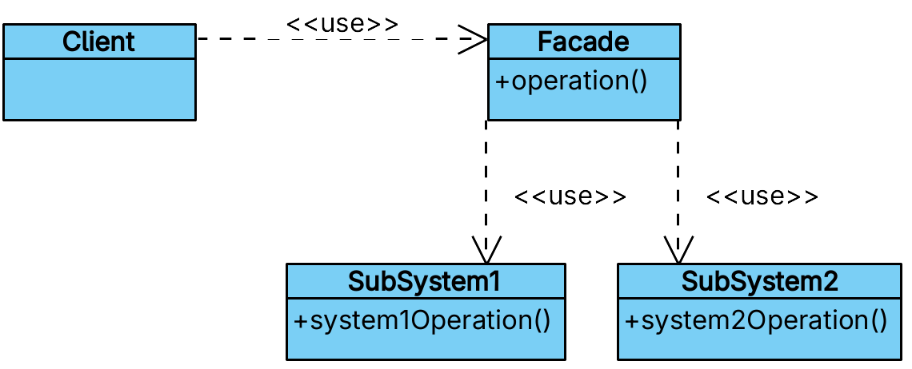

### 5. 参与者

- `Facade`：给调用方提供一个简单接口，在内部将复杂的逻辑实现给实现掉。
- `Subsystemclasses`：子系统。

### 6. 协作

客户端发送请求给 `Facade`， `Facade`负责与子系统进行通信，将请求转发给合适的子系统进行处理。

### 7. 效果

外观模式的优点：

1. 让客户端不再依赖子系统，客户端可以减少复杂的调用逻辑，让客户端更简单。
2. 客户端和子系统之间实现了松耦合，子系统中的变化不影响客户端。外观模式有助于建立层次结构系统，还可以消除复杂的循环依赖关系。
3. 外观模式不会限制客户端只使用 `Facade`，客户端可以自己选择，可以使用 `Facade`或者直接使用子系统接口。

### 8. 实现

使用外观模式需要注意的：

1. 降低客户-子系统之间的耦合度
2. 公共子系统类与私有子系统类

第1点， `Facade`还可以继续进行抽象，这样客户端就只依赖抽象的 `Facade`，而不是具体的 `Facade`，进一步降低客户端与子系统的耦合度。

除了使用子类方式，还有一种方法就是使用组合的方式。

第2点，在讲哪些接口应该暴露给外部。子系统应该也要有公共接口和私有接口，公共接口包含所有客户端可访问的类，私有结构仅仅用于内部。

”私有化子系统类“，即一个类只能让子系统内部看到，外部根本看不到。 `Java`中做不到真正完全私有，在 `Java`中修饰符有：

```java
public
protected
private
default
```

`private`只能修饰字段、方法、内部类，不能真正隐藏整个包级别。

- `package-private`：不是用任何修饰符，可见性仅在包内部，跨包看不到。
- `internal`包，只是告诉别人别乱用。
- `Java 9`的 `Module`使用 `module-info.java`可真正限制暴露。

### 9. 代码示例

### 10. 已知应用

### 11. 相关模式

抽象工厂模式可以与外观模式一起用，外观模式负责将复杂的问题对外包装成一个简单的接口，抽象工厂模式负责创建一组相关对象。

假设一个系统支持 `Windows、Linux、Mac`，并且每个平台上都有 `Button、TextBox、Menu`的不同实现。

抽象工厂接口：

```java
public interface UIFactory {

    Button createButton();

    TextBox createTextBox();
}
```

`Windows`实现：

```java
public class WindowsFactory implements UIFactory {

    @Override
    public Button createButton() {
        return new WindowsButton();
    }

    @Override
    public TextBox createTextBox() {
        return new WindowsTextBox();
    }
}
```

使用外观模式再包装一次：

```java
public class UIFacade {

    private UIFactory factory;

    public UIFacade(UIFactory factory) {
        this.factory = factory;
    }

    public void renderUI() {

        Button button = factory.createButton();
        TextBox textBox = factory.createTextBox();

        button.draw();
        textBox.draw();
    }
}
```

客户端使用：

```java
uiFacade.renderUI();
```

抽象工厂模式还可以代替外观模式隐藏与平台相关的类，工厂本身就已经起到类 `Facade`的作用。客户端只接触 `UIFactory`，而不会接触到 `WindowsButton`、 `LinuxButton`，平台细节已经被隐藏。

外观模式和抽象工厂模式都在隐藏复杂性，但外观模式隐藏的是使用复杂性，抽象工厂隐藏的是创建复杂性。

中介者模式和外观模式结构上有点像，但核心目标不同，外观模式目标是简化使用，中介者模式目标则是解耦对象之间通信。

一般仅需要一个 `Facade`对象，因此 `Facade`对象经常用单例模式实现。

## 4.6 Flyweight（享元）--对象结构型模式

### 1. 意图

> 运用共享技术有效地支持大量细粒度的对象。

当系统中存在大量相似的小对象时，不要重复创建他们，而是让它们共享，从而节省内存。

享元模式出现的根本原因是对象太多，内存撑不住了，它首要解决的是内存问题，而不是代码结构问题。

”大量对象“，比如：

- 游戏场景里的：
	- 10万个子弹
	- 100万个粒子
	- 50万个树叶
	- 20万个NPC
- 文本编辑器：100万个字符对象
- 地图系统：100万棵树
- 电商系统：1000万个商品标签对象

`Java`对象不仅有字段，还有对象头、对齐填充、引用等，所以看起来是一个小对象，其实并不小。

大量的这种小对象的问题：

- 内存占用很大
- 大量的对象也会导致频繁的GC
- 创建对象的成本也很高

”细粒度对象”，是指非常小、数量非常多的对象，比如上面说的一个字符对象、一个树叶对象、一个子弹对象都属于细粒度对象。

“共享技术”指的是对象复用，多个地方共用同一个对象。

享元模式就是共享对象，但不是无差别共享，而是相同部分共享，不同部分外部传入。享元模式把状态分成两类：

- 内部状态：可共享，不会变化
- 外部状态：不能共享，每次都不一样

享元模式就是共享不会变化的部分，从外部传入会变化的部分。

比如一个围棋系统的例子，定义一个享元接口：

```java
public interface ChessPiece {

    void display(int x, int y);
}
```

具体的享元，白子和黑子：

```java
public class BlackChessPiece implements ChessPiece {

    @Override
    public void display(int x, int y) {

        System.out.println(
            "黑棋位置: " + x + "," + y
        );
    }
}
```

享元工厂：

```java
import java.util.HashMap;
import java.util.Map;

public class ChessFactory {

    private static final Map<String, ChessPiece> pool = new HashMap<>();

    static {

        pool.put("black", new BlackChessPiece());
        pool.put("white", new WhiteChessPiece());
    }

    public static ChessPiece getChessPiece(String color) {
        return pool.get(color);
    }
}
```

客户端使用：

```java
public class Client {

    public static void main(String[] args) {

        ChessPiece black1 = ChessFactory.getChessPiece("black");

        ChessPiece black2 = ChessFactory.getChessPiece("black");

        System.out.println(black1 == black2);

        black1.display(1, 2);

        black2.display(3, 4);
    }
}
```

享元模式不仅仅是缓存对象，真正的本质是分离可共享状态和不可共享状态。

享元模式的例子：

- `Java`字符串常量池
- `Integer`缓存池
- 数据库连接池
- 线程池
- `Spring`的单例 `Bean`

### 2. 动机

### 3. 适用性

享元模式使用场景。享元模式主要解决内存和性能问题，只有在特定场景下才适合使用。享元模式高度依赖对象的特点、使用场景、数据规模，不能随意的使用享元模式。

享元模式会增加系统复杂度，使用时必须考虑如下问题：

- 区分内部状态
- 区分外部状态
- 管理共享池
- 考虑线程安全
- 控制对象生命周期

享元模式的使用条件如下，以下条件必须同时存在：

- 要使用大量的对象，对象少了根本没必要优化。
- 内存问题主要来自系统中有大量的对象。
- 对象大多数状态都可变为外部状态，也就是对象内部状态很少，这些状态不可变，适合共享。
- 如果对象大多数状态变为外部状态后，就可以用比较少的对象共享来代替原有的大量的对象。
- 系统中不能依赖于对象的唯一表示，由于对象是共享的，故它们唯一标识一样，使用 `==`会得到 `true`。

### 4. 结构

结构图：

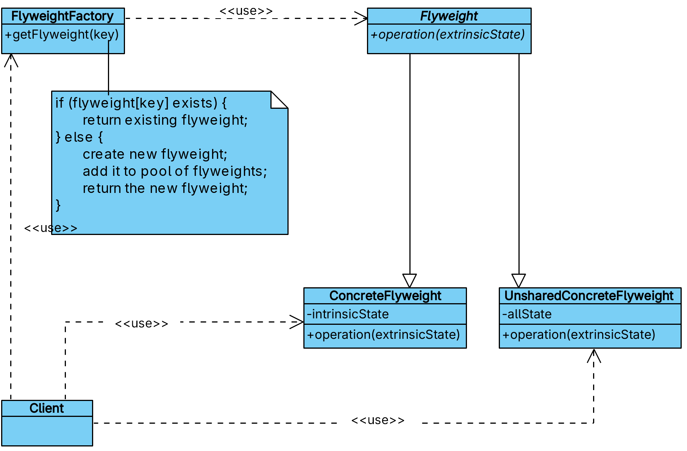

### 5. 参与者

- `Flyweight`：享元的抽象接口
- `ConcreteFlyweight`：具体的享元，可共享对象
- `UnsharedConcreteFlyweight`：具体的享元，不可共享对象
- `FlyweightFactory`：享元工厂创建并管理享元对象。
- `Client`：通过享元工厂来获取享元对象并使用。

### 6. 协作

享元在使用时，内部状态存储在享元对象内部，而外部状态则又客户端对象存储或计算，并在调用享元对象的操作方法时将外部状态传入享元对象内。

客户端需要使用享元工厂获取共享的享元对象。

### 7. 效果

使用享元模式由于外部状态需要计算、传输，这些都需要有开销，但是相比于内存空间的节省，这些开销可以忽略。共享的对象越多，节省的空间就越多。

节约空间的多少来自如下几个因素：

- 共享对象让系统中实际对象数量变得到底少了多少
- 对象内部状态变少了多少
- 外部状态是存储的还是计算的

### 8. 实现

实现享元模式需要注意的事项。

1. 删除外部状态
2. 管理共享对象

第1点，享元模式是否适合使用，关键在于能不能把对象状态拆开，将状态拆成内部状态和外部状态。如果外部状态本身仍然很多，即使共享对象，也省不了多少内存。

第2点，在讲共享对象的管理，共享对象由享元工厂管理。对于对象的回收也需要考虑。

### 9. 代码示例

### 10. 已知应用

### 11. 相关模式

享元模式经常和组合模式结合使用。

最好是用享元模式实现状态模式和策略模式。

## 4.7 Proxy（代理）--对象结构型模式

### 1. 意图

> 为其他对象提供一种代理以控制对这个对象的访问。

不直接访问目标对象，而是通过一个中间对象来间接访问，并且这个中间对象可以在访问前后做一些额外控制。这里的“中间对象”就是代理。

需要代理的原因是有时候我们不希望客户端直接接触真实对象，就可以在访问真实对象之前加一层代理。使用代理可以做到：

- 权限控制，不是所有人都能访问真实对象。
- 延迟加载，对象太大，先不创建。
- 远程调用，真实对象在另一台机器。
- 日志统计，访问前后需要记录日志。
- 缓存，避免重复计算。
- 事务控制，调用前开启事务，调用后提交事务。

“其他对象”是真正干活的对象，也叫真实对象。代理本质上就是一个替身，代理对象长得像真实对象，客户端可以无感使用。一般代理对象和真实对象都实现同一个接口。

代理对象不只是简单转发，还能对调用进行控制，在调用前的控制：

- 权限检查
- 日志记录
- 缓存判断
- 延迟初始化

调用后的控制：

- 结果缓存
- 事务提交
- 性能统计

### 2. 别名

Surrogate

### 3. 动机

### 4. 适用性

当普通的引用不够用的时候，可以用代理对象代替普通引用。

可以使用代理模式的情况：

1. 远程代理
2. 虚代理
3. 保护代理
4. 智能指引

第1点，远程代理，要使用的对象不在当前进程或者不在当前机器，需要在本地使用一个代理对象。客户端直接调用本地的代理对象，代理对象内部负责：

- 网络通信
- 序列化
- 发送请求
- 接收结果

该代理对象就是远程对象在本地的替身。远程代理的实例：

- `Java RMI`
- `Dubbo`
- `gRPC`

`RPC`框架本质上全是远程代理。

第2点，虚代理，就是延迟加载的思想。有些对象的创建成本巨大，比如：

- 高清图片
- 视频
- 大模型
- 数据库对象
- 超大文件

这些对象用户不一定会真正使用，所以没必要一开始就直接创建。可以先创建一个轻量的代理对象，等到真正要访问的时候再创建真实对象。

第3点，保护代理，权限控制代理，有时候不是所有用户都能访问真实对象。比如系统中有管理员、普通用户、游客，他们的权限不同，保护代理在访问前先检查权限。

实际场景有：

- `Spring Security`
- `API`权限校验
- `Linux`文件权限
- 操作系统内核对象保护

### 5. 结构

结构图：

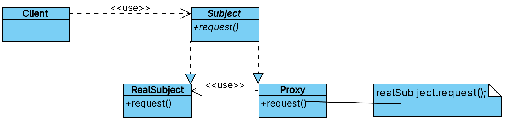

### 6. 参与者

- `Proxy`，代理对象，用来代替真实对象
- `Subject`，代理和真实对象的共用接口。
- `RealSubject`，真实对象

### 7. 协作

代理将客户端请求转发给真实对象。

### 8. 效果

代理模式访问真实对象的中间加了一层，有不同的代理类型：

1. 远程代理，可以让客户端像调用本地方法一样的调用远程方法。
2. 虚代理，实现延迟加载。
3. 保护代理和智能引用都可以在访问真实对象的前后做一些额外处理。

代理模式还有一种更高级的优化技术： `Copy-On-Write`，是一种延迟复制的思想，本质上属于虚代理模式的一种高级应用。

`Copy-On-Write`写时复制，意思是先共享，等真正修改时再复制。这在使用大对象的时候非常有用，大对象的复制成本很高，有时候复制后根本不会修改，所以复制完全浪费。 `Copy-On-Write`不会一开始就直接复制，而是直接共享原对象，等到真正发生写操作的时候才复制。

### 9. 实现

### 10. 代码示例

### 11. 已知应用

### 12.  相关模式

适配器模式为它所适配的对象提供了一个不同的接口。而代理模式则提供了与它所代理的真实对象相同的接口。

装饰器模式和代理模式的实现相似，但是目的不一样，装饰器模式给对象增加功能，代理模式则是控制对对象的访问。

## 4.8 结构型模式的讨论

结构型模式看起来很像，但是它们却依然是不同的模式。

这些模式大多数都在做对象之间的组织关系，很多结构型模式都会出现：

```java
class A {

    private B b;
}
```

这种对象组合的形式。比如说代理模式：

```java
class Proxy {

    private RealSubject realSubject;
}
```

装饰器模式：

```java
class Decorator {

    private Component component;
}
```

桥接模式：

```java
class Abstraction {
    protected Implementor implementor;
}
```

适配器模式：

```java
class Adapter {

    private Adaptee adaptee;
}
```

这样的结构看起来确实非常想，都是在实际的对象外包了一层。

这些模式的协作关系也很像，都是在进行转发调用，比如代理模式：

```java
realSubject.request()
```

装饰器模式：

```java
component.operation()
```

适配器模式：

```java
adaptee.specificRequest()
```

“这可能是因为结构型模式依赖于同一个很小的语言机制集合”这句话中的语言机制指的是编程语言最基础的能力。

这里是说这些模式不是靠特殊语法实现的，而是靠最基础的面向对象机制组合出来的。面向对象机制有：

- 单继承
- 多重继承
- 对象组合

“模式依赖于语言机制”，比如：

- 装饰器模式，核心机制：对象组合。
- 代理模式，核心机制：对象组合。
- 适配器模式有两种，一种是继承，也就是类适配器；另一种是组合，也就是对象适配器。

“很小的语言机制”，意思是设计模式依赖的基础语言机制没有很多，只有那几种组织方式：

- `extends`
- `implements`
- `has-a`

在面向对象的语言机制中，单继承和多继承属于类模式，也就是通过继承关系复用行为。比如适配器模式就可以用类模式：

```java
class Adapter
    extends Adaptee
    implements Target
```

对象的组合机制属于对象模式，也就是通过对象的引用组合行为，比如代理模式：

```java
private RealSubject realSubject;
```

装饰器模式：

```java
private Component component;
```

桥接模式：

```java
private Implementor implementor;
```

总之这些模式在结构上看起来有点像，但是目的完全不同。

代理模式与装饰器模式的结构几乎一样，都有：

```java
private Component component;
```

都要实现相同的接口，都做转发调用，但是它们的目的完全不同。代理模式目的是做控制访问：

- 权限
- 延迟加载
- 远程调用

而装饰器模式则是动态增强功能：

- 增加缓存
- 增加日志
- 增加功能

外观模式和适配器模式，结构上都可能包装一堆的对象，但是外观模式目的简化接口，而适配器模式则是转换接口。

桥接模式和适配器模式，结构上都是 `A持有B`，但是桥接模式的目的是分离抽象（业务）与实现（基础组件），适配器模式则是兼容已有接口。

### 4.8.1 适配器模式与桥接模式

适配器模式和桥接模式长得很像，都是使用对象组合。适配器模式：

```java
class Adapter {
    private Adaptee adaptee;
}
```

桥接模式：

```java
class Abstraction {
    private Implementor implementor;
}
```

都是在一个对象中持有另外一个对象的形式。

客户端在访问对象 `Adaptee`和 `Implementor`的时候不是直接访问，而是通过 `Adapter`和 `Abstraction`间接进行访问。这种间接访问的好处就是有更大的灵活性，可以实现：

- 替换实现
- 动态切换
- 添加控制
- 隔离变化

等功能。

另外适配器模式和桥接模式中都有转发请求的功能。

上面是在解释适配器模式和桥接模式的结构相似的地方，都是包装+转发。

这两个模式的不同的地方是它们的用途不同，也就是要解决的问题不是同一个。

适配器模式主要解决两个接口不匹配的问题，比如说系统需要一个接口 `Target.request()`，但是现在系统中有的接口是 `Adaptee.specificRequest()`，这两个接口不一样，适配器模式就是负责将现有接口转换成我们需要的接口形式。适配器模式并不关心接口内部具体是怎么实现的，它只是将老接口适配成新接口。

桥接模式的目的不是兼容旧接口，而是将抽象和实现分离。这里抽象就是上层业务模块，实现就是底层基础模块，这两部分都会独立的进行变化。

适配器模式和桥接模式使用的时机不同，适配器模式更像是事后补救，因为当要用适配器模式的时候，被适配的接口往往是已经存在了，并且兼容现在的系统。而桥接模式则是事前设计，也就是在架构设计的时候就要考虑，业务层和基础组件层是要分开的。

### 4.8.2 组合模式、装饰器模式与代理模式

组合模式和装饰器模式结构相似，都是对象包含同类型对象。组合模式：

```java
class Composite implements Component {
    private List<Component> children;
}
```

装饰器模式：

```java
class Decorator implements Component {
    protected Component component;
}
```

都实现统一接口，持有同类型对象引用，都会转发调用，都能形成递归结构。

装饰器模式看起来像是一个退化了的组合模式，从结构上看确实如此，但是这两个模式的目的是完全不同的。

装饰器模式可以动态的给对象增加职责，不需要使用继承生成子类的方式来实现，这就可以避免功能组合导致子类急剧增加的问题。

组合模式目的则是让单个对象和对象集合能统一进行处理，它并不是为了增强对象，而是为了表达树状结构。

装饰器模式中的递归是为了叠加行为，而组合模式中的递归则是为了表示层次结构。

组合模式和装饰器模式也可以协同使用。组合模式关注结构组织，装饰器模式关注功能增强，通常情况下一个系统既需要结构，也需要功能扩展。

比如一个 `GUI系统`中：

- 按钮、面板、容器形成树结构，这是组织结构
- 同时还想给按钮加边框、加阴影、加动画，这是增强功能

这时就可以使用组合模式来负责组织结构，装饰器模式来负责增强功能。

代理模式和装饰器模式的结构几乎完全一样，但它们也是具有不同的设计目的的。

装饰器模式：

```java
public abstract class Decorator implements Component {
    protected Component component;
}
```

代理模式：

```java
public class Proxy implements Subject {

    private RealSubject realSubject;
}
```

装饰器模式和代理模式都是在内部持有一个对象， 并且和该对象具有一样的接口，让客户端像使用原对象一样使用装饰器和代理。但是代理模式不能像装饰器模式那样动态的添加或者删除功能，代理模式不是为了递归组合而设计，而是为了代替真实对象而设计的。

代理模式中的被代理的对象是真正核心功能实现的地方，代理仅仅是决定能不能访问真实对象，它并不负责核心功能。

而在装饰器模式中，组件仅仅提供了部分基础功能，完整的功能需要多个装饰器进行叠加。装饰器模式适用于不知道最终对象需要哪些功能，在运行时根据需要动态添加功能的情况。代理模式则是强调一种静态的关系，往往在设计阶段就已经确定。

# 第5章 行为型模式

> 行为型模式涉及算法和对象间职责的分配。行为型模式不仅描述对象或类的模式，还描述它们之间的通信模式。这些模式刻画了在运行时难以跟踪的复杂的控制流。它们将你的注意力从控制流转移到对象间的联系方式上来。

“算法”不是狭义上的排序算法、搜索算法等，而是完成某件事的步骤流程。比如一定订单系统的创建订单流程：

- 校验库存
- 扣减余额
- 创建物流
- 发送通知

这个流程就是一个业务算法。

流程中的这些步骤该由谁来负责，也就是这些步骤代码要放到哪个模块或系统中，比如：

- 订单模块
- 库存模块
- 支付模块
- 物流模块
- 通知模块

这些流程中的步骤分配就是“职责分配”。

行为型模式不是去关注对象长什么样，而是关注对象是怎么合作的：

- 谁发消息
- 谁控制流程
- 谁调用谁
- 谁通知谁
- 谁决定下一步

比如：
- 策略模式关注算法如何替换；
- 命令模式关注请求如何封装；
- 观察者模式关注对象如何通知；
- 中介者模式关注对象如何通信；
- 状态模式关注状态如何改变行为。

行为型模式的本质是：对象协作的模式。

在结构型模式中，主要关注的是对象之间是什么连接、组合的，比如：

- 组合模式：对象树
- 装饰器模式：包装链
- 代理模式：代理关系

这些模式的关注点是结构。

在行为型模式中关注的是消息是怎么流动的，也就是“通信模式”，比如：

- 观察者模式中： `Subject`通知 `Observers`
- 命令模式中： `Invoker`发送 `Command`给 `Receiver`
- 中介者模式中： `Colleague`通过 `Mediator`相互通信

“通信模式”就是：

- 观察者模式中的：广播通知
- 中介者模式的：中央调度
- 责任链模式的：链式传递
- 命令模式的：请求封装
- 状态模式的：状态切换

“控制流”就是程序执行顺序，在传统的过程式编程中控制流如下：

```java
step1();
step2();
step3();
```

但是在面向对象编程中，控制流会变得非常分散，比如：

```
按钮点击
   ↓
触发Command
   ↓
Command调用Service
   ↓
Service更新Model
   ↓
Model通知Observer
   ↓
Observer刷新UI
```

代码执行的流程跨越多个对象，这时候就很难看清程序是怎么运行的了。这种复杂的流程就是“复杂控制流”。

在一个大型的面向对象的系统中，对象本身并不复杂，对象之间的协作关系才是真正复杂的。

在传统的思维中我们关注程序下一步要执行什么，但是行为型模式则让我们关注谁和谁协作。比如一个过程式代码：

```java
save();

sendMessage();

refreshUI();
```

这里控制流就是写死的，而如果使用观察者模式则是：

```java
subject.notifyObservers();
```

这里面谁更新 `UI`、谁发送消息、谁写日志等等， `Subject`根本不知道，控制流被分散到了对象关系中，这就是“从控制流转移到对象的联系方式上来”。

行为型模式真正的思想不是如何写流程代码，而是如何组织对象职责，解决在复杂系统中的行为组织问题。

在一个系统中如果写死控制流会导致：高耦合、难扩展、难维护，行为型模式则希望对象自治协作，比如：

- 观察者模式：对象自己订阅
- 策略模式：对象自己切换算法
- 状态模式：状态自己决定行为
- 中介者模式：中介统一协调通信

> 类行为型模式使用继承机制在类间分派行为。本章包括两个这样的模式。其中Template Method（5.10）较为简单和常用。模板方法是一个算法的抽象定义，它逐步地定义该算法，每一步调用一个抽象操作或一个原语操作，子类定义抽象操作以具体实现该算法。另一种类行为型模式是Interpreter（5.3）。它将一个文法表示为一个类层次，并实现一个解释器作为这些类的实例上的一个操作。

行为型模式中有一类是类行为型模式，类行为型模式意思是行为的变化主要通过继承完成。“行为“不是简单的方法调用，而是对象完成任务的方式或者是业务流程。比如：

- 游戏启动流程
- 文件解析流程
- 数据处理流程

行为型模式关心这些流程中的步骤，哪些是固定的，那些是变化的。

”分派行为“意思是把部分行为交给子类实现，父类定义整体的流程，子类决定具体的细节。比如说一个系统需要支持导出`CSV`， `Excel`， `PDF`，整体的导出流程为：

```
读取数据
→ 格式转换
→ 写入文件
→ 保存
```

但是由于导出的格式不同，转换的细节也不一样此时就可以在父类中固定导出的流程，子类去实现转换的细节。这种就是通过继承分配行为，代码示例如下，父类定义整体流程：

```java
abstract class Exporter {

    // 模板方法
    public final void export() {

        readData();

        formatData();

        writeFile();

        save();
    }

    protected void readData() {
        System.out.println("读取数据");
    }

    protected abstract void formatData();

    protected void writeFile() {
        System.out.println("写入文件");
    }

    protected void save() {
        System.out.println("保存文件");
    }
}
```

`CSV`格式导出：

```java
class CsvExporter extends Exporter {

    @Override
    protected void formatData() {
        System.out.println("转换为CSV格式");
    }
}
```

`PDF`导出：

```java
class PdfExporter extends Exporter {

    @Override
    protected void formatData() {
        System.out.println("转换为PDF格式");
    }
}
```

客户端：

```java
public class Main {

    public static void main(String[] args) {

        Exporter exporter =new CsvExporter();
        exporter.export();
    }
}
```

基于继承的类行为型模式有两个：模版方法模式和解释器模式。模版方法模式比较简单，也比较常用，在 `Spring`， `Servlet`， `JUnit`， `Android`生命周期中都大量使用模板方法模式。模版方法定义了一个执行的流程，在父类中一步一步安排流程，每一步要么是一个抽象方法，让子类去实现细节，要么是一个父类已经实现好的基础步骤。

解释器模式是另外一个类行为型模式。

“文法”，比如一个数学表达式 `1 + 2 * 3`可以拆成数字、加法、乘法，每一种都对应一个类：

- 父类： `abstract class Expression`
- 数字： `class NumberExpression`
- 加法： `class AddExpression`
- 乘法： `class MultiplyExpression`

整个表达式都变成了一个对象树，这就是文法类层次。

“并实现一个解释器作为这些类的实例上的一个操作”这句话意思是每个表达式对象自己知道如何解释自己： `expression.interpret();`，比如 `AddExpression`知道如何计算加法， `MultiplyExpression`知道如何计算乘法。

> 对象行为型模式使用对象组合而不是继承。一些对象行为型模式描述了一组对等的对象怎样相互协作以完成其中任一个对象都无法单独完成的任务。这里一个重要的问题是对等的对象如何互相了解对方。对等对象可以保持显式的对对方的引用，但那会增加它们的耦合度。在极端情况下，每一个对象都要了解所有其他的对象。Mediator（5.5）在对等对象间引入一个mediator对象以避免这种情况的出现。mediator提供了松耦合所需的间接性。

对象行为型模式通过对象协作来组织行为，不需要靠继承。对象组合就是一个对象内部持有另一个对象。比如：

```java
class Context {

    private Strategy strategy;
}
```

这里 `Context`组合了 `Strategy`对象。

“对等对象”，就是没有父子关系，比如一个 `GUI`系统中的 `Button`、 `TextBox`、 `ListBox`、 `Dialog`等它们的地位平等。这些对象之间需要相互通信，这就是对象协作，由这些对象协同完成一个个的复杂功能。比如用户点击发送消息按钮，系统需要：

- `Button`接收点击
- `TextBox`读取内容
- `MessageService`发送消息
- `Notification`更新 `UI`

这些对象之间需要通信，比如上述例子中 `Button`需要通知 `TextBox`、 `Dialog`、 `ListBox`等等，最简单的方式就是直接持有对象的引用：

```java
class Button {

    private TextBox textBox;

    private ListBox listBox;

    private Dialog dialog;
}
```

`Button`中持有所有需要的对象，其他对象也可以持有 `Button`，这样耦合度太高，系统会迅速变成一个网状结构，并且极其复杂。

中介者模式在这些对象中间引入一个中介对象，可以让多个对象通过中介进行通信，而不需要直接进行交流。比如原来是如下的方式：

```
Button → ListBox
Button → TextBox
Button → Dialog
```

引入中介以后变成了：

```
Button
   ↓
Mediator
   ↓
ListBox
```

这样 `Button`就不直接依赖 `ListBox`，而是通过中介来进行交流。

责任链模式是非常动态的一个模式，请求发送者不需要知道谁会处理请求。

观察者模式让一个对象变化时，自动通知所有依赖它的对象。

其他的对象行为型模式将行为封装在对象中。传统方式中我们通常是将行为写死在类里面，比如：

```java
class PaymentService {

    public void pay() {

        // 某种支付
    }
}
```

这种方式无法动态变化，如果要支持多种支付方式，我们就需要在代码中写多个 `if-else`。行为型模式则把行为抽出来变成独立对象，比如：

```java
interface PayStrategy {

    void pay();
}
```

现在支付行为被对象化了，也就支持动态切换了。

策略模式将行为封装在单独对象中，使用的时候可以方便的动态切换行为。

命令模式将请求封装成独立对象，可以把这个行为当作参数来传递或者其他方式使用对这个对象。

状态模式将对象的状态进行封装。

访问者模式将多个类之间的相同的行为统一封装。

迭代器模式将遍历变成对象，遍历的方式被抽象出来。

## 5.1 Chain of Responsibility （职责链）--对象行为型模式

### 1. 意图

通常情况下，一个请求只能对应一个处理者，比如 `orderService.handle(request);`，这里的请求只能由 `OrderService`处理。如果以后要增加审核、增加权限校验、增加日志、增加风控，我们只能在当前方法中去做，代码耦合在一个越来越复杂。

责任链模式中一个请求不一定只能被一个对象处理，而是可以经过多个对象，被多个对象处理，比如一个请求可能经过多个对象：

- 登录
- 权限
- 参数
- 日志
- 业务

责任链模式可以让请求的发送者和接收者解耦，比如一段代码：

```java
manager.approve(request);
```

这种就是耦合，请求发送者必须知道请求谁来处理，发送者强依赖接收者。以后如果流程发生变化：增加总监、增加CEO、增加财务审核，客户端就必须修改。责任链模式中发送者不知道谁处理请求，客户端只负责发请求，具体谁来处理请求它就不关心了。

责任链模式中的对象连成一条链，每个处理者都持有下一个处理者的引用：

```java
abstract class Handler {

    protected Handler next;

    public void setNext(Handler next) {
        this.next = next;
    }

    public abstract void handle(Request request);
}
```

这里的 `next`就是链，请求就可以沿着这条链传递，如果当前的处理者能处理就处理，不能处理就交给下一个。比如：

```java
class Manager extends Handler {

    @Override
    public void handle(Request request) {

        if (request.getDays() <= 3) {
            System.out.println("经理批准");

        } else if (next != null) {
            next.handle(request);
        }
    }
}
```

这里 `next.handle(request);`就是请求传递。请求会沿着这条链一直往后传，直到有某个处理者愿意去处理。

并不是所有的职责链都只允许一个处理者，有些职责链中每个节点都可能处理请求，比如：

```
AuthFilter
   ↓
LogFilter
   ↓
BusinessFilter
```

职责链通常有两种常见模式：

- 找到一个处理者后停止
- 所有处理者都执行

职责链常见应用场景：

- `Spring Security`过滤器链
- `Netty Pipeline`
- `Servlet Filter`
- `MyBatis`插件链
- 日志处理链
- 审批工作流

职责链的思想是让请求自己寻找处理者，可以让处理流程动态扩展，如果要新增一个处理者，只需要插入链中即可，客户端不需要修改。但是职责链也有缺点：

- 请求路径难追踪
- 调试困难
- 可能没人处理请求
- 链太长影响性能

### 2. 动机

### 3. 适用性

一个请求没有固定的处理者，多个处理者都可以去处理该请求。请求提交的时候不确定是谁来处理，只有在运行时根据时机请求内容才能确定哪个对象能处理该请求。

通常情况下我们发送请求的时候就知道请求的接收者是谁，比如：

```java
manager.handle(request);
```

这里请求发送者明确的知道 `manager`是请求的处理者，这种方式简单但是难以扩展，如果以后要增加流程，客户端的代码全部需要修改。

职责链模式可以解决这种高耦合的情况，让发送者不知道接收者，客户端只需要：

```java
chain.handle(request);
```

此时客户端不知道真正的处理者是谁，这就做到了发送者和处理者解耦。

责任链模式中的处理链还可以在运行时组装，而不需要写死。

### 4. 结构

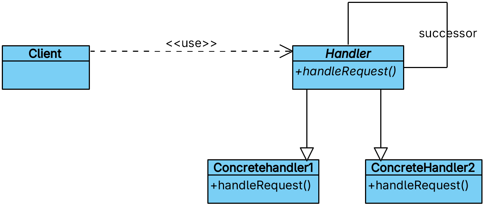

### 5. 参与者

- `Handler`： 定义处理请求的接口，保存下一个处理者的引用。
- `ConcreteHandler`： 真正处理请求的对象，只处理它能够处理的请求，将请求往后继续传递。
- `Client`： 发送请求

### 6. 协作

客户端提交请求，请求沿着链传递，直到有一个 `ConcreteHandler`对象处理该请求。

### 7. 效果

责任链模式可以降低请求发送者和请求处理者之间的耦合度。比如一个请求发送者有如下代码：

```java
Manager manager = new Manager();
manager.handle(request);
```

这里请求发送者明确的依赖 `Manager`，如果以后审批人变了，要增加新的审批人，客户端代码必须修改。

责任链模式中客户端不再写：

```java
manager.handle(request);
```

而是：

```java
handler.handle(request);
```

客户端不再知道真正的处理者是谁。这就是请求发送者不关心谁处理请求，它只负责发送请求，以后处理流程发生变化，客户端也不用修改。

责任链模式还可以简化对象之间的关系，一个对象只需要持有下一个对象的引用即可，不需要持有所有的接收者的引用。

责任链模式中处理流程不是写死的，而是可以动态组合拼接。比如一个请求处理的代码，通常我们会写如下的：

```java
public void handle() {

    authCheck();

    permissionCheck();

    log();

    business();
}
```

处理流程写死，如果想要新增 `riskCheck()`，就必须修改原代码。责任链模式则把上述的多个功能拆分成多个节点：

```
AuthHandler
   ↓
PermissionHandler
   ↓
RiskHandler
   ↓
BusinessHandler
```

每个功能独立存在，功能可以动态的进行调整。

职责链模式可以使用继承的方式扩展 `Handler`的能力，比如抽象的 `Handler`：

```java
abstract class Handler {
    public abstract void handle();
}
```

具体的子类：

```java
class AuthHandler extends Handler

class LogHandler extends Handler
```

责任链模式中的请求不一定会被处理，请求的发送者根本不知道谁处理请求，系统也无法保证一定会被处理。

### 8. 实现

后继者链有两种方式实现，第一种是自定义新的链，也就是在 `Handler`中自己保存 `next`，比如：

```java
abstract class Handler {

    protected Handler next;

    public void setNext(Handler next) {
        this.next = next;
    }

    public abstract void handle(Request request);
}
```

这里的 `protected Handler next;`就是新定义的连接，这是责任链模式自己建立的连接，对象之间原来没什么关系。

这是最经典的实现，它最灵活，链结构完全动态，在运行时可以新增节点、删除节点，修改顺序等。

一般会在抽象父类 `Handler`来定义 `next`，这可以让子类自动拥有链接能力。有时也可以让 `ConcreteHandler`来定义 `next`，比如并不是所有的 `Handler`都需要 `next`的时候，某些特殊的 `Handler`就可以自己维护 `next`。

第二种方式是使用已有的对象关系，而不是额外定义 `next`，这种情况下对象之间原本就已经连接好了，可以直接复用这些关系。比如在组合模式中：

```java
class Component {

    protected Component parent;

    public void handle(Event event) {
        if (parent != null) {
            parent.handle(event);
        }
    }
}
```

这里没有 `next`，可以直接复用 `parent`，这就是使用已有的链接。

如果系统中不存在对象之间的关系，使用职责链模式时就必须自己建立链。这时候的 `Handler`不仅要定义处理请求的 `handler`方法，还要负责维护链结构（保存 `next`）。 `Handler`中可以提供默认实现，让请求向后传递，即 `next.handleRequest(request);`，将请求转发到下一个 `Handler`：

```java
abstract class Handler {

    protected Handler next;

    public void setNext(Handler next) {
        this.next = next;
    }

    public void handleRequest(Request request) {

		// 默认转发
        if (next != null) {
            next.handleRequest(request);
        }
    }
}
```

这样 `ConcreteHandler`就只需要关心自己处理的部分，请求怎么往后传父类已经给实现好了。

```java
class ConcreteHandlerA extends Handler {

    @Override
    public void handleRequest(Request request) {
        if (canHandle(request)) {
            System.out.println("A处理请求");

        } else {
            // 不处理时：直接调用父类默认转发
            super.handleRequest(request);
        }
    }

    private boolean canHandle(Request request) {
        return false;
    }
}
```

转发逻辑由父类统一实现，子类不用重复的写 `if(next != null)`。

请求可以使用不同的方法表示，也就是 `Handler`收到的参数是什么样子的。比如：

```java
handleRequest(Request request)
```

这里的 `Request`就是请求的表示方式，

责任链模式最简单的形式是一个硬编码操作调用，也就是直接调用方法，每个功能对应一个方法： `handler.handleRequest(request);`，请求被固定在方法签名里，编译期就已经确定了，所以叫做硬编码。这种方式中方法名固定、参数类型固定、调用方式固定，使用的时候比较简单，并且类型安全，编译器可检查参数类型、方法是否存在、返回值是否正确。但是这种方式中 `Handler`中的方法是固定的，以后想要修改或新增方法，需要修改接口、实现类、调用方，扩展性不够好。

另一种方式是动态的，也就是一个方法+一个可变的请求码的形式：

```java
handle(String requestCode)
```

请求种类不再固定，可以动态的增加请求，但这种方式要求发送方和接收方要定义好一致的请求码。

这种方式虽然比较灵活，但是需要在方法的实现中使用 `if-else`来判断类型并分开处理，使用的参数的类型安全也没法保证。

可以使用使用一个请求对象，这个请求对象内部封装请求类型、请求参数、请求元数据等：

```java
class Request {

    private String type;

    private Object data;

    public Request(String type, Object data) {
        this.type = type;
        this.data = data;
    }

    public String getType() {
        return type;
    }

    public Object getData() {
        return data;
    }
}
```

`Handler`中定义一个处理请求的方法，并使用这个请求对像作为参数： `handle(request)`。这种方式容易扩展，不同请求对象使用子类来定义即可，每个对象都表示不同的请求类型。但这种方式中处理者必须知道请求类型，即 `Handler`收到 `Request` 对象后必须知道具体类型，否则就无法取对应的参数：

```java
public void handle(Request request) {

    if (request instanceof LoginRequest) {
        LoginRequest loginRequest = (LoginRequest) request;

        System.out.println(loginRequest.getUsername());
    }
}
```

为了区分请求类型，可以在请求对象中定义个类型标识，比如 `Request`中可定义一个 `getType()`：

```java
abstract class Request {

    public abstract String getType();
}
```

子类实现：

```java
class LoginRequest extends Request {

    @Override
    public String getType() {
        return "LOGIN";
    }
}
```

`Handler`中处理请求时可以使用如下方式：

```java
if(request.getType().equals("LOGIN"))
```

还可以使用运行时的类型信息判断，在 `Java`中就是 `instanceof`：

```java
if (request instanceof LoginRequest)
```

这样不需要写 `typeCode`。


### 9. 代码示例

### 10. 已知应用

### 11. 相关模式

责任链模式常和组合模式一起使用，组合模式中一个 `Component`中的 `parent`可以作为这个 `Component`的 `next`使用。


## 5.2 Command（命令）--对象行为型模式

### 1. 意图

> 将一个请求封装为一个对象，从而使你可用不同的请求对客户进行参数化，对请求排队或记录请求日志，以及支持可撤销的操作。

通常情况下我们认为数据是对象，行为是方法，命令模式中则将行为本身也对象化，于是一个请求可以像普通对象一样被传递、存储、排队、撤销、记录、组合等。

命令模式中的“请求”就是想做的一件事情，比如：

- 保存文件
- 删除用户
- 打开灯
- 下订单
- 发消息

在代码中常用的方式就是直接调用方法，比如 `service.save();`，这里的”请求“就是一次方法调用。方法调用的问题是无法保存、排队、延迟执行、撤销、重做。

命令模式把请求变成对象是指不再直接调用方法 `service.save()`，而是像如下这样：

```java
Command command = new SaveCommand(service);
```

这里的 `SaveCommand`就是请求对象，想要执行请求就可以调用：

```java
command.execute();
```

这里的“保存文件”这个动作就变成了一个对象，这就是行为对象化。代码如下：

```java
interface Command {
    void execute();
}
```

具体命令：

```java
class SaveCommand implements Command {

    private Document document;

    public SaveCommand(Document document) {
        this.document = document;
    }

    @Override
    public void execute() {
        document.save();
    }
}
```

这里 `SaveCommand`就封装了请求接收者、请求参数、请求行为，这就是将请求封装为对象。

“对客户进行参数化”意思是以前客户端是调用固定方法： `button.clickSave();`，而现在客户端可以接收不同的 `Command`对象，比如：

```java
button.setCommand(new SaveCommand());

button.setCommand(new PrintCommand());
```

现在按钮（客户端）不知道自己执行什么，它只会 `command.execute()`，于是按钮被“参数化”了，按钮的行为由传入的 `Command`决定。

又比如： `new Thread(runnable)`中， `Thread`根本不知道具体做什么，它只是执行 `runnable.run();`， `Runnable`本质上就是命令对象。

命令模式支持对请求进行排队，普通方法则不能进行排队，因为普通方法调用完就没了，而 `Command`是对象，可以放进队列中。比如：

```java
Queue<Command> queue = new LinkedList<>();

// 加入命令
queue.add(new SaveCommand());

// 以后慢慢执行
queue.poll().execute();
```

实际应用场景：

- 消息队列
- 任务调度
- 线程池
- 异步任务

命令模式还可以把请求持久化，在命令模式中请求是一个对象，对象可以进行序列化，于是命令对象就可以存储在数据库中、写入日志、从网络发送。实际应用场景：

- 数据库 `Binlog`
- `Kafka`消息
- `Redis AOF`

这些持久化的命令对象，后面还可以进行重放。

命令模式还支持请求的撤销，普通方法调用后是没法撤销的，方法执行完状态就变了，系统不知道如何恢复。命令对象可以保存执行前的状态：

```java
interface Command {

    void execute();

    void undo();
}
```

具体命令：

```java
class MoveCommand implements Command {

    private Player player;

    private int oldX;

    private int newX;

    public MoveCommand(Player player, int newX) {
        this.player = player;
        this.newX = newX;
    }

    @Override
    public void execute() {
        oldX = player.getX();
        player.setX(newX);
    }

    @Override
    public void undo() {
        player.setX(oldX);
    }
}
```

这个命令对象就保存了执行前状态，可以使用 `undo()`撤销。

命令模式的核心：把行为变成数据（行为对象化）。可以实现让原本瞬间消失的方法调用变成可以保存、传递、排队、撤销的对象。

### 2. 别名

- 动作
- 事务

动作，在通常的代码中，动作是一个方法调用，比如 `document.save();`中的 `save`就是一个动作。这个动作在执行完后就消失了，因此它无法存储、传递、撤销、排队。

命令模式本质上是把一个动作对象化，它会把 `save`这个动作变成 `SaveCommand`对象，这就是动作被对象化了。

所以命令模式又叫作动作模式，比如在 `Java Swing`中有 `Action`接口，在 `GUI`系统中特别喜欢叫 `Action`，用户操作都可以称为动作，这些动作都非常适合命令对象化。

事务，意思是一次完整的状态变化，比如：

- 转账
- 下单
- 删除文件
- 修改文档

这些操作都是事务，都改变状态。比如 `DeleteCommand`执行后，系统状态就变了，命令就像一个事务。

### 3. 动机

一个对象需要触发一个行为，但它不应该知道谁执行、怎么执行、执行什么。比如 `GUI`系统中的按钮只知道被点击了，但是按钮不知道是保存文件还是删除用户，又或者是打印文档。因为按钮是由 `GUI`工具箱提供的，而业务逻辑是由应用程序决定的，所以按钮本身不应该写死 `saveFile`这样的逻辑，否则按钮就没办法复用了。

按钮应该只知道 `Command`对象，它不知道要做什么，只是保存： `Command command`，当按钮被点击时统一调用 `command.execute();`，这样按钮就和业务逻辑解耦了。

`Command`接口：

```java
interface Command {
    void execute();
}
```

保存命令：

```java
class SaveCommand implements Command {

    private Document document;

    public SaveCommand(Document document) {
        this.document = document;
    }

    @Override
    public void execute() {
        document.save();
    }
}
```

`Button`：

```java
class Button {

    private Command command;

    public void setCommand(Command command) {
        this.command = command;
    }

    public void click() {
        command.execute();
    }
}
```

`Button`不知道业务逻辑是什么，只知道有个 `Command`要执行。

### 4. 适用性

传统编程中，通常只能传递数字、字符串、对象，而命令模式则可以传递一个动作、 传递一个未来要执行的行为。

“待执行的动作”指的是未来某个时刻要执行的行为，比如：

- 保存文件
- 删除用户
- 打印文档
- 发送消息
- 执行SQL
- 下单

等等这些都属于动作。

在传统的情况下这些动作一般都是方法调用： `document.save();`， `userService.deleteUser();`，但命令模式认为动作本身也应该被抽象成对象，比如：

```java
SaveCommand
DeleteUserCommand
PrintCommand
```

“参数化某对象”，这里参数化并不是指的 `setName("Tom")`这种普通参数，而是用不同的行为配置同一个对象。比如一个按钮本身并不知道点击后该做什么，但是我们可以使用如下的不同方式让按钮执行不同的动作：

```java
button.setCommand(new SaveCommand());

button.setCommand(new PrintCommand());

button.setCommand(new DeleteCommand());
```

同一个按钮对象因为传入了不同的 `Command`，就拥有了不同的行为，这就叫用动作参数化对象。

回调函数是把一个未来会执行的函数交给别人保存，别人会在适当的时候调用它。回调函数实际上是在传递一个函数，命令模式实际上则是在传递一个对象，这个对象里封装了行为、参数、接收者、状态。

命令模式是回调函数的面向对象版本。

“在不同的时刻指定、排列和执行请求”这句话包三个事情：

- 指定请求
- 排列请求
- 执行请求

这三个事情可以发生在不同的时刻。“指定请求”指的是创建命令对象，即：

```java
Command command = new SaveCommand(document);
```

此时只是创建了命令对象，并没有真正执行。

“排列请求”指定的是对请求进行组织和调度，比如：

```java
Queue<Command> queue = new LinkedList<>();

queue.add(new SaveCommand(doc1));
queue.add(new PrintCommand(doc2));
queue.add(new DeleteCommand(doc3));
```

这时请求被保存、排序、排队，但是仍然没有执行。

“执行请求”就是请求真正的执行：

```java
Command command = queue.poll();

command.execute();
```

这时候请求才真正的发生。

“一个Command对象可以有一个与初始请求无关的生存期”这句话在说命令对象是独立存在的。传统方法调用 `save()`执行完成后：调用结束、方法栈销毁、请求消失，但是命令对象却不一样，它可以有自己的生命周期，比如：

```java
SaveCommand command = new SaveCommand(document);
```

这个对象可以存数据库、放队列、写到日志中、发送到网络中，这个对象变成了一个可以长期存在的行为。

命令模式可以支持Undo（撤销）和Redo（重做）操作，即一个行为不仅可以执行，还可以被回滚。

命令模式在执行 `execute`操作之前，先保存旧状态，这样以后就能恢复。代码示例：

```java
interface Command {

    void execute();

    void unexecute();
}
```

请求接收者：

```java
class Player {

    private int x;

    public int getX() {
        return x;
    }

    public void setX(int x) {
        this.x = x;
    }
}
```

一个具体的命令对象：

```java
class MoveCommand implements Command {

    private Player player;

    private int oldX;

    private int newX;

    public MoveCommand(Player player, int newX) {
        this.player = player;
        this.newX = newX;
    }

    @Override
    public void execute() {
        oldX = player.getX();
        player.setX(newX);
    }

    @Override
    public void unexecute() {
        player.setX(oldX);
    }
}
```

命令对象不仅封装行为，还封装状态变化前的数据，因此它能知道如何恢复旧状态。

命令模式还可以实现命令的持久化，用于恢复等操作。持久化的东西叫做“修改日志”，也叫做操作日志、命令日志、事务日志、 `Undo/Redo log`等。修改日志就是把所有执行过的命令记录下来，当遇到系统崩溃时可以使用日志进行恢复。

命令模式还可用于事务系统。事务就是一组操作要么全部成功，要么全部失败，事务的对象是“一组操作”，也就是事务封装的不是一个简单动作，而是多个数据修改的集合，比如一个下订单的事务：

```
1. 创建订单
2. 扣库存
3. 创建支付单
4. 写日志
```

这些共同组成 `PlaceOrderTransaction`。事务和命令模式很像，命令对象就是一个完整行为的封装，事务完全可以看作是一个命令对象。

### 5. 结构

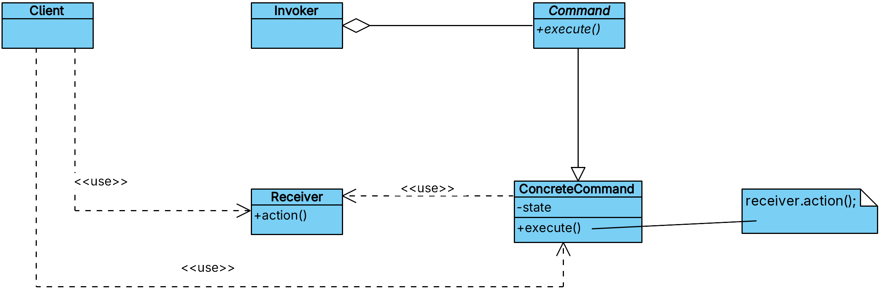

### 6. 参与者

- `Command`：统一的命令接口，抽象命令，统一调用方式，解耦调用者与执行者。
- `ConcreteCommand`：具体的命令实现类，封装具体请求，保存 `Receiver`，调用 `Receiver`的业务逻辑。
- `Client`：创建具体的命令，并设置命令的接收者。
- `Invoker`：触发命令，只负责执行 `command.execute()`。
- `Receiver`：请求接收者，真正执行业务逻辑的对象。

### 7. 协作

### 8. 效果

命令模式将请求的发送者和请求的接收者解耦。请求发送者是是指像如下一样的对象：

- 按钮
- 菜单
- 定时任务
- 调度器
- MQ消费者

这些对象只负责发送请求，并不知道具体业务如何实现。而请求的接收者是指如下的一些真正干活的对象：

- `OrderService`
- `UserService`
- `FileSystem`
- `GameEngine`

传统的方式中请求发送者和接收者是直接耦合在一起的：

```java
button.onClick() {
    orderService.createOrder();
}
```

这里的 `Button`直接依赖 `OrderService` ，这样 `UI`和业务耦合。

命令模式中会变成如下的方式调用：

```java
button.onClick() {
    command.execute();
}
```

在 `command.execute()`内部再调用 `receiver.action()`，这样 `Button`就不再知道请求由谁来执行、请求怎么执行，它只知道 `execute()`。

命令模式中的 `Command`对象可以像普通的数据一样被操作：

- 保存
- 传递
- 返回
- 组合
- 存储
- 排队

这是和普通的函数调用不同的地方，普通函数调用结束后行为就立刻消失，无法保存这次调用。命令模式中的对象代表的是行为，它可以像数据一样被保存，也可以延迟执行。

多个命令可以组成一个组合命令，这种方式也是组合模式的应用。

组合模式中新增 `Command`很容易，无需改变已经存在的类。新增功能时只需要新增一个 `NewCommand`对象，无需修改 `Invoker`、`Receiver`以及其他的 `Command`。

### 9. 实现

一个命令对象中应该要做多少事情也是需要考虑的。标准模式中 `Command`和 `Receiver`的关系是一个固定结构，在 `Command`对象中存在 `receiver.action()`，看起来命令对象只是一个方法调用的包装器，但是实际情况可能要复杂的多，真实的项目中命令对象可能会：

- 查数据库
- 做权限校验
- 找请求的接收者
- 管理事务
- 管理上下文
- 调度多个对象

这就是两种不同的命令对象，一种是很简单的转发请求的方式，另一种是会做很多事情的方式。简单的方式就像如下：

```java
class SaveCommand implements Command {

    private DocumentReceiver receiver;

    @Override
    public void execute() {
        receiver.save();
    }
}
```

命令对象中只做两件事情：保存 `Receiver`和转发调用。这种方式实现简单，职责分离明确。

另一种比较复杂的方式中命令对象可能是一个超级 `Command`，它自己实现全部业务逻辑：

```java
class CreateWindowCommand implements Command {

    @Override
    public void execute() {
        Window window = new Window();
        window.show();
    }
}
```

这里就没有 `Receiver`，它自己既是 `Command`优势 `Receiver`。这种方式一般是没有合适的 `Receiver`或者 `Receiver`太简单而没有必要拆分。比如：

```java
Runnable task = () -> {
    System.out.println("hello");
};
```

这里就没有 `Receiver`， `Runnable`自己就是行为。 `Java`中使用 `Lambda`就会有大量的自包含行为对象，而不是标准的 `Command -> Receiver`这种结构。

### 10. 代码示例

### 11. 已知应用

### 13. 相关模式

使用组合模式可以实现一个由多个命令组成的大命令。

备忘录模式可以保持一个状态，和命令模式搭配可以实现撤销操作。

历史记录中被保存的的命令对象需要使用原型模式来复制。

## 5.3 Interpreter（解释器）--类行为型模式

### 1. 意图

> 给定一个语言，定义它的文法的一种表示，并定义一个解释器，这个解释器使用该表示来解释语言中的句子。

解释器模式本质是让程序能够理解某种自定义语法。比如：

- 计算器能计算： `1 + 2 + 3`
- 规则引擎能判断真假： `age > 18 AND city == "London"`
- 数据库能执行 `SQL`： `SELECT * FROM user`
- 模版引擎能替换变量： `${name}`

这些都是在解释某种语言，解释器模式就是对这种行为的面向对象的抽象。

“给定一个语言”，这里的语言不是指 `Java`、 `Python`、 `C++`，而是一种规则表达式，比如：

- 数学表达式语言： `1+2`
- `SQL`语言： `SELECT * FROM user`
- 正则表达式语言： `[a-z]+`
- `XML`： `<user></user>`
- `Spring EL`： `#{user.name}`
- `Linux Shell`： `ls -al`
- 业务规则语言： `订单金额 > 100 并且 用户等级 = VIP`

这些都属于语言，它们都有语法规则、固定结构、特定含义。

“定义它的文法的一种表示”，这里的“文法”是指语法规则，比如一个数学表达式 `1 + 2`符合 `数字 运算符 数字`这个规则；一个 `SQL` `SELECT name FROM user`符合 `SELECT 字段 FROM 表`这个规则。

“文法的一种表示”意思是用代码结构来表示语法规则，比如数学表达式 `1 + 2`可以表示成：

```java
Number(1)
Plus
Number(2)
```

或者：

```java
AddExpression(
    NumberExpression(1),
    NumberExpression(2)
)
```

这就是文法的表示，用对象结构描述语法结构。

“并定义一个解释器”，这里的解释器不是指 `IDE`、 `JVM`、 `Python`解释器，而是负责理解并执行规则的一个东西，比如数学表达式 `1 + 2`对应的文法（语法规则）是：

```java
AddExpression(
    NumberExpression(1),
    NumberExpression(2)
)
```

解释器解释这个语法规则：

- 先解释左边
- 再解释右边
- 最后做加法

得到最后的结果3，这就是解释。

“使用该表示来解释语言中的句子”，这里的“句子”是指符合语法规则的一段内容，比如：

- 数学语言中的句子： `1 + 2 + 3`
- `SQL`语言中的句子： `SELECT * FROM user`
- 规则语言中的句子： `A AND B`

这整句话的意思是：当程序需要理解某种语言规则时，可以把语言规则表示成对象结构，再通过解释器对象去解析和执行这些规则。

解释器模式要解决的问题是：程序要动态理解用户输入的规则。比如一个规则引擎中的规则： `订单金额 > 100 AND 用户等级 = VIP`，如果不用解释器模式，就只能写死：

```java
if (amount > 100 && level.equals("VIP")) {
    ...
}
```

每次新增规则都要改代码，运营不能自己配置规则，这样系统扩展性就非常差。

实际的系统中都会把规则写成字符串，比如： `amount > 100 && level == 'VIP'`，然后让程序动态解析执行这个规则，这本质上就是解释器模式。

代码示例实现 `1 + 2 + 3`，首先定义一个表达式抽象类：

```java
public interface Expression {
    int interpret();
}
```

数字表达式：

```java
public class NumberExpression implements Expression {

    private int number;

    public NumberExpression(int number) {
        this.number = number;
    }

    @Override
    public int interpret() {
        return number;
    }
}
```

加法表达式：

```java
public class AddExpression implements Expression {

    private Expression left;
    private Expression right;

    public AddExpression(Expression left, Expression right) {
        this.left = left;
        this.right = right;
    }

    @Override
    public int interpret() {
        return left.interpret() + right.interpret();
    }
}
```

客户端：

```java
public class Client {

    public static void main(String[] args) {

        Expression expression =
                new AddExpression(
                        new NumberExpression(1),
                        new AddExpression(
                                new NumberExpression(2),
                                new NumberExpression(3)
                        )
                );

        int result = expression.interpret();

        System.out.println(result);
    }
}
```

这里使用对象表示语法，将 `1 + 2 + 3`变成了 `AddExpression(...)`，这就是文法表示。递归执行表达式，每个节点都知道如何解释自己，这叫做解释。

实际运用中解释器模式很少用 `GoF`标准结构来实现，主要是有以下缺点：

- 文法复杂度爆炸，比如支持：加减乘除、括号、变量、函数等，会导致类越来越多。
- 性能差，大量的对象递归调用。

用的更多的则是如下的方式自动生成解析器：

- `ANTLR`
- `yacc`
- 编译器工具

解释器模式真正的思想：不是解析字符串，而是把规则抽象成对象结构，让对象自己解释自己。

主要解决的问题是程序需要：

- 动态解析规则
- 动态执行表达式
- 理解用户输入语法

典型应用：

- `SQL`
- 正则表达式
- 模板引擎
- `Spring EL`
- 规则引擎
- `Shell`
- 编译器

### 2. 动机

如果某个业务逻辑总是在反复发生变化，就不应该继续使用硬编码的方式来实现，而是应该设计一种规则语言，让业务人员自己写规则，程序只需要负责解析和执行这些规则即可。

规则变化特别频繁的场景：

- 电商优惠规则，运营天天修改：
	- 满100减20
	- 满200打8折
	- VIP用户额外95折
	- 周末活动
	- 新用户活动
- 权限规则：
	- 部门经理可以审批订单的金额会发生变化
	- 财务经理可以审批订单的范围会发生变化
- 风控规则

这些频繁变化的规则，不能够继续在代码中硬编码的方式实现，而是要变成一种规则语言。然后在实现一个解释器，读取规则字符串执行规则。

### 3. 适用性

一个需要解释执行的语言，也就是某种规则表达式，比如：

- 数学表达式： `1 + 2 + 3`
- `SQL`语言： `SELECT * FROM user`
- 正则表达式语言： `[a-z]+`
- `Spring EL`： `#{user.name}`

这些都是可以被解释执行的语言。

抽象语法树（Abstract Syntax Tree， AST），比如表达式 `1 + 2 * 3`，程序不能理解这个字符串，它必须先分析谁先算、谁后算、哪部分属于谁。它会把表达式转换成：

```
       +
     /   \
    1     *
         / \
        2   3
```

这就是语法树。

解释器模式会递归解释语法树，比如上面的语法树，解释器会先解释左子树1，得到1，再解释柚子树 `2 * 3`得到6，最后计算 `1 + 6`得到7。

解释器模式适用于文法比较简单的场景，如果太复杂会导致类爆炸，解释器模式中一个语法规则对应一个类，如果规则很多则类也会很多。

实际系统中一般会用语法分析器生成器，比如：

- `ANTLR`
- `yacc`
- `bison`

这些解析器不需要真正的生成AST对象，这样可节省空间和时间。

一般的解释器通常不是直接解释语法分析树，这是因为解释器模式本质是对象递归调用，会很慢。解释器通常会将它们转化成另外的形式，比如正则表达式通常会被转成状态机。

解释器模式并不是等于写编译器，而它真正的定位是一种理解规则语言的面向对象思想。它适合：

- 小的 `DSL`
- 简单规则
- 配置表达式
- 业务规则引擎

不适合：

- 完整编程语言
- 编译器

### 4. 结构

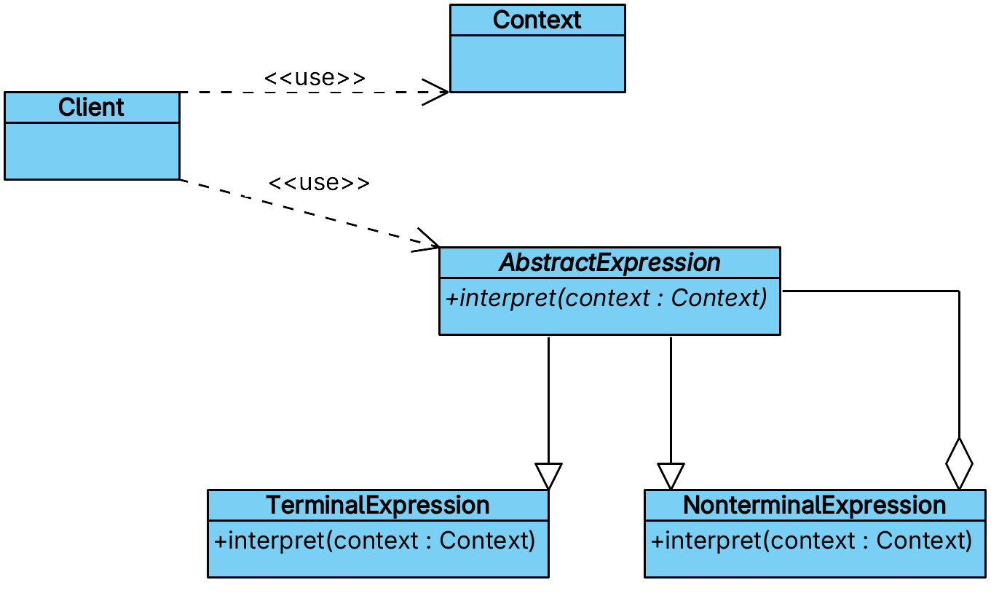

### 5. 参与者

- `AbstractExpression`：抽象表达式，所有语法节点的统一接口。
- `TerminalExpression`：终结符表达式，表示最基础的语法元素，比如数字、变量、字符串。它是语法树的叶子节点。
- `NonterminalExpression`：非终结符表达式，表示复杂的语法规则，比如加法、减法、AND、OR等。它是语法树中的非叶子节点。
- `Context`：上下文，保存全局变量、当前环境、输入数据等。
- `Client`：客户端

### 6. 协作

### 7. 效果

在解释器模式中，一种语法规则对应一个类，因此增加新语法时只需要增加新类，而不用修改已有的语法规则类。

解释器模式中的类结构都很类似，只是运算逻辑不同，这些类可以使用编译器或语法分析程序自动生成。

解释器模式通常适合简单的文法，复杂的文法则不太适合。由于一种语法规则对应一个类，如果文法非常复杂，则会有太多的类，难以维护。通常复杂的文法需要使用编译器或者语法分析程序来生成。

可以和访问者模式结合使用。

### 8. 实现

解释器模式模式只负责解释抽象语法树，而不负责生成抽象语法树，也就是不会进行语法分析。

经典的解释器模式通常像如下代码：

```java
public interface Expression {
    int interpret(Context context);
}
```

加法表达式：

```java
public class AddExpression implements Expression {

    private Expression left;
    private Expression right;

    @Override
    public int interpret(Context context) {
        return left.interpret(context)
                + right.interpret(context);
    }
}
```

这里 `interpret()`直接写在抽象语法树的节点中。如果只是简单支持计算，这样使用是没有什么问题的，但是实际的编译器中不仅要解释执行，还需要很多其他的操作，比如：

- 类型检查： `1 + "abc"`是否合法
- 优化： `1 + 2`直接优化成 `3`
- 打印： 将 `AddNode(1, 2)`打印成 `1 + 2`
- 代码生成： `JVM`字节码
- 静态分析： 未使用变量、风险分析等

如果所有行为都写在抽象语法树的节点中，则代码会变成如下的形式：

```java
class AddExpression {

    interpret();

    typeCheck();

    optimize();

    prettyPrint();

    generateCode();

    staticAnalysis();
}
```

节点变得越来越臃肿，本来节点只负责表示语法结构，但是现在还负责了很多其他功能。

抽象语法树的节点可以不自己执行行为，把行为外包出去。抽象语法树结构一般都很稳定，基本都是一些固定节点，不会每天都在变化。但是对抽象语法树的操作却会经常变化，比如新的优化器、新的代码生成器、新的分析器。

更合理的设计是抽象语法树只负责结构，行为要独立去处理。这时就可以使用访问者模式，将行为从对象中拆出去。

没有访问者模式时一个节点如下：

```java
class AddNode {

    interpret();

    optimize();

    typeCheck();
}
```

有了访问者模式后，节点代码则只保留如下：

```java
accept(visitor)
```

行为全部放进 `Vistor`中。下面是使用访问者模式的代码，首先定义 `AST`节点：

```java
public interface Expression {
    void accept(Visitor visitor);
}
```

`AddExpression`：

```java
public class AddExpression implements Expression {

    @Override
    public void accept(Visitor visitor) {
        visitor.visit(this);
    }
}
```

`Visitor`接口：

```java
public interface Visitor {

    void visit(AddExpression expression);

    void visit(NumberExpression expression);
}
```

解释器 `Visitor`：

```java
public class InterpretVisitor implements Visitor {

    @Override
    public void visit(AddExpression expression) {
        System.out.println("解释加法");
    }

    @Override
    public void visit(NumberExpression expression) {
        System.out.println("解释数字");
    }
}
```

类型检查 `Visitor`：

```java
public class TypeCheckVisitor implements Visitor {

    @Override
    public void visit(AddExpression expression) {
        System.out.println("检查加法类型");
    }

    @Override
    public void visit(NumberExpression expression) {
        System.out.println("检查数字类型");
    }
}
```

原来的行为都在抽象语法树节点内部，现在行为被拆分到了 `Visitor`对象内部。如果想要新增行为，只需要新增一个 `Visitor`类即可，不用改抽象语法树。

在文法中的一些终结符可以使用享元模式来进行共享。

### 9. 代码示例

### 10. 已知应用

### 11. 相关模式

- 抽象语法树是一个组合模式的实例。
- 抽象语法树中的终结符可用享元模式进行共享。
- 解释器可用迭代器遍历。
- 访问者模式可用来维护抽象语法树节点的行为。

## 5.4 Iterator（迭代器）--对象行为型模式

### 1. 意图

> 提供一种方法顺序访问一个聚合对象中的各个元素，而又不需要暴露该对象的内部表示。

假设系统中有个数组：

```java
public class UserCollection {

    private String[] users = {
            "Tom",
            "Jack",
            "Lucy"
    };
}
```

客户端想要遍历这个数组，最直接的写法就是：

```java
for (int i = 0; i < users.length; i++) {
    System.out.println(users[i]);
}
```

这种写法客户端知道太多的内部细节，比如 `users.length, users[i]`，这意味着客户端知道内部是数组，也就是内部实现暴露了。

以后想要修改内部实现，将数组变为 `List<String>`，所有遍历的代码都要修改。

客户端不应该依赖内部实现细节，它不应该知道是数组、链表、红黑树还是哈希表，它应该只知道如何遍历，而不是底层如何实现。

迭代器模式就是为了解决这个问题。

“提供一种方法”意思是提供了统一的遍历接口，比如：

```java
hasNext();

next();
```

“顺序访问”意思是一个一个遍历元素。

“聚合对象”就是一个容器，比如：数组、 `List`、 `Set`、 `Map`、树、图，这些都属于聚合对象，即可以包含多个元素的对象。

“而又不需要暴露内部表示”，客户端不需要知道数据怎么存、内部结构是什么、索引如何实现，只需要 `iterator.next()`即可。

迭代器去遍历对象，它负责记录当前位置、决定如何前进、返回当前元素。迭代器把遍历的算法封装起来，比如不同的类有不同的遍历逻辑：

- 数组遍历： `index++`
- 链表遍历： `node = node.next`
- 树遍历： `DFS/BFS`

迭代器将这些逻辑进行封装，客户端只需要统一的使用 `next()`即可。

迭代器模式解决的问题：将遍历逻辑和集合结构解耦，集合负责存数据，迭代器负责遍历数据。

### 2. 别名

游标（Cursor）

### 3. 动机

数组、 `List`、 `Set`、 `Map`、树、图等这些聚合对象它们能包含多个元素，客户端需要访问这些元素的时候不应该知道它们的内部是什么样的。假如用户知道是数组，就使用数组的方式去访问元素，后续如果底层想要换成 `LinkedList`，那么所有客户端代码都需要修改。

遍历的方式也有很多种，比如有正序遍历、倒序遍历、跳跃遍历、树的DFS遍历、树的BFS遍历。比如如果所有的遍历逻辑都写在 `List`中，则集合类就会变成：

```java
forwardTraverse()

backwardTraverse()

dfsTraverse()

bfsTraverse()

skipTraverse()
```

这会导致集合类臃肿复杂，存储逻辑和遍历逻辑混在一起。

由于遍历需要记录状态，如果直接将遍历逻辑写在集合内部，则多个遍历就会有问题。比如一个用户进行正序遍历，同时另外一个用户进行倒序遍历，这时候状态就会冲突。

迭代器模式可以解决这些问题。它将遍历和访问这些算法从集合本身分离出来，让它们成为两个部分，集合只负责存储数据，迭代器负责遍历数据。

遍历算法和集合对象分离后，我们也可以定义不同的迭代器来实现不同的遍历策略。

### 4. 适用性

- 不想要暴露一个聚合对象的内部实现。
- 需要支持多种遍历方式：正序、倒序等等方式。
- 为不同的聚合结构提供统一的遍历方式。

### 5. 结构

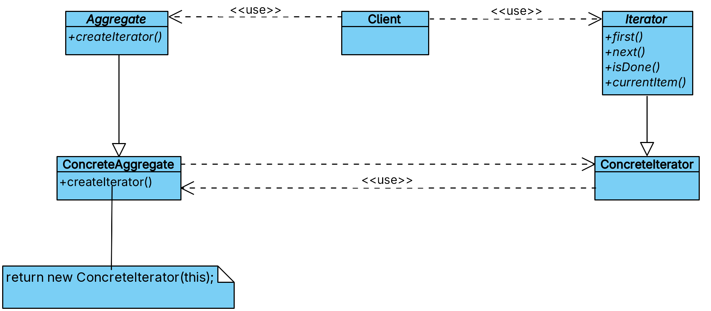

### 6. 参与者

- `Iterator`：抽象迭代器，定义遍历元素的统一接口。
- `ConcreteIterator`：具体迭代器，负责遍历集合、记录当前位置、控制遍历逻辑。
- `Aggregate`：抽象聚合，定义创建迭代器的统一接口。
- `ConcreteAggregate`：具体聚合，真正存储数据的地方，比如数组、 `List`、树等等。

### 7. 协作

### 8. 效果

- 迭代器模式支持以不同的方式遍历一个聚合对象。
- 迭代器模式将遍历的逻辑放到了迭代器中，聚合本身就不需要遍历接口了，简化了聚合的接口。
- 可以实现在同一个聚合上的多个遍历。

### 9. 实现

遍历的控制有两种，一种是由客户端来控制遍历，这种称为外部迭代器；另外一种是迭代器内部控制遍历，这种称为内部迭代器。

遍历一个集合大概就像下面的流程：

```
取元素
→ 移动游标
→ 再取元素
→ 再移动
→ 直到结束
```

遍历的控制说的就是这个流程该由谁来控制。

外部迭代器是由客户端来主动推进流程，客户端负责：

- 什么时候开始
- 什么时候结束
- 什么时候取下一个元素
- 如何组合多个遍历逻辑

代码如下：

```java
Iterator<String> iterator = list.iterator();

while (iterator.hasNext()) {
    String item = iterator.next();
    System.out.println(item);
}
```

这个 `while`循环在客户端，客户端掌握着遍历的控制权。外部迭代器本质是拉模式，客户端主动说给我下一个元素，迭代器则被动响应。

而内部迭代器则由迭代器内部控制遍流程，客户端使用的时候只会说：请帮我遍历，客户端要做的是提供遍历时该做什么，而不是如何遍历。代码如下：

```java
list.forEach(item -> {
    System.out.println(item);
});
```

这里没有 `while, for, next, hasNext`，而只有对元素要做什么，真正的循环在 `forEach`内部。内部迭代器的本质是推模式，迭代器主动把元素推给客户端，客户端只是接收。

外部迭代器更灵活，客户端掌握整个流程，可以实现复杂的逻辑。

`Java Stream`本质就是内部迭代器， `Stream`内部自己控制遍历。

外部迭代器偏命令式编程，你告诉程序一步一步怎么做；外部迭代器则偏声明式编程，你告诉程序你想要什么，程序自己决定如何执行。

遍历算法也可以在不同的地方实现，可以在聚合对象中，也可以在迭代器中。

遍历算法就是遍历本身，不同的数据结构的遍历，差异非常大，比如：

- 数组： `index++`
- 链表： `node = node.next`
- 树的遍历：前序、中序、后序、DFS、BFS

遍历算法写在迭代器中，这是最经典的方案。聚合对象负责存储数据，迭代器负责遍历逻辑。

聚合对象负责遍历算法，比如在一个聚合对象中：

```java
class Tree {
    public void next(Cursor cursor) {
    }
}
```

这里的 `Tree`负责遍历， `Cursor`则只保存位置。 `Cursor`就是迭代器，只不过该迭代器被弱化了，它只保存当前位置，这种迭代器称为游标。

游标本质就是一个状态记录器，代码：

```java
class Cursor {
    int index;
}

class Cursor {
    Node currentNode;
}
```

它不负责遍历逻辑，只记录当前位置。

迭代器负责算法的优点：同一个聚合对象上使用不同的迭代算法更容易实现。比如同一个树可能需要各种遍历算法：前序、中序、后序、DFS、BFS，如果算法在迭代器中，我们就有如下不同的迭代器：

```java
class DFSIterator
class BFSIterator
class ReverseIterator
```

容易扩展和替换，另外这些迭代器还可以被复用到其他的结构上。

迭代器负责算法的缺点：会破坏聚合对象的封装性。比如有一个树结构：

```java
class Tree {
    private Node root;
}
```

`DFSIterator`迭代器想要访问 `root`，则树结构不得不提供：

```java
public Node getRoot()
```

或者：

```java
public Node[] getInternalArray()
```

迭代器能访问它想要的数据，但这时所有人都能访问 `root`及内部数据了，这样树结构的内部就暴露出去了。客户端能看到和使用内部结构，也就可以任意修改内部结构。

`Java`集合的迭代器可以访问集合内部的 `elementData`，但是也有限制的，通过： `package-private`、内部类、 `friend-like`结构来控制访问范围。比如 `ArrayList`中 `private class Itr implements Iterator<E>`，其中 `Itr`这个迭代器是内部类，它可以直接访问 `elementData`、 `size`等，但是外部用户却看不到。

在遍历集合的时候，集合如果发生修改，怎样保证遍历的一致性，也是一个非常重要的问题。比如有一个集合：

```java
List<String> list = new ArrayList<>();

list.add("A");
list.add("B");
list.add("C");
list.add("D");
```

如果现在正在进遍历：

```java
Iterator<String> it = list.iterator();

while(it.hasNext()) {
    String s = it.next();
}
```

在遍历的过程中集合发生修改：

```java
list.remove(...)

list.add(...)
```

这时候迭代器的状态会失效，此时就会出问题，有可能会导致元素跳过或者两次访问到同一个元素。

出现问题的原因是迭代器的状态失效，迭代器内部保存了类似 `currentIndex`这种表示当前遍历位置的变量，在集合修改后当前位置元素已经变了，游标不再是正确的值了。

最简单的解决方案是将要进行遍历的集合进行拷贝，遍历操作在拷贝后的集合上进行，修改操作则在原集合上进行。这样遍历的对象不再发生变化，对集合的修改也就影响不到遍历。但是这种代价太高，复制集合会导致内存空间成本和复制时的时间成本巨大，如果是涉及到深拷贝则影响更大。另外数据的实时性也会是个问题，此时遍历的数据不是最新数据。

一个好的迭代器需要保证插入和删除操作不会对遍历造成影响，也不需要拷贝集合。经典方案是向集合注册迭代器，集合内部维护 `List<Iterator>`，创建迭代器的时候向集合注册： `register(iterator)`，修改集合的时候通知所有的迭代器结构有变化。

实际在 `Java`中使用的 `Fail-Fast`方案，原理是集合维护 `modCount`，迭代器保存 `expectedModCount`，在遍历的时候检查 `modCount == expectedModCount`，如果不一致则抛异常。这种方式是不健壮的方案，它不修复问题，而是发现问题后立即失败。 

其他的方案：

- `Copy-On-Write`比如 `CopyOnWriteArrayList`，原理是修改时复制新数组，迭代器遍历的时候使用的是旧的快照版本。这样方式安全稳定的，但是如果写操作很多会导致复制过多，开销很大。
- 保存节点方式，比如 `LinkedList`，迭代器保存节点引用，删除其他节点时影响比较小。
- 版本控制，比如数据库的 `MVCC`，迭代器看到的是某个版本的快照，而不是实时数据。

`Redis Scan`也是健壮迭代思想，遍历期间允许插入、删除、 `rehash`，但不保证元素不重复，只保证不会崩溃。

数据库游标也是健壮迭代思想，通常使用快照隔离，如果不这样的话在遍历过程中数据变化，结果会混乱。

### 10. 代码示例

### 11. 已知应用

### 12. 相关模式

- 组合模式，迭代器常被用到组合模式这种递归结构上
- 工厂方法模式，多态的迭代器需要通过工厂方法模式生成迭代器子类
- 备忘录模式，常与迭代器模式一起使用，用来存储迭代状态。

## 5.5 Mediator（中介者）--对象行为型模式

### 1. 意图

> 用一个中介对象来封装一系列的对象交互。中介者使各对象不需要显式地相互引用，从而使其耦合松散，而且可以独立地改变它们之间的交互。

“对象交互”，就是：

```
对象A 调用 对象B
对象B 通知 对象C
对象C 修改 对象D
```

这些对象之间的通信：谁通知谁，谁调用谁，谁依赖谁等等就叫做对象交互。

原来对象之间相互依赖，对象之间自己处理通信，对象自己决定：通知谁、怎么通知、调用谁、调用顺序。中介者模式则统一使用一个中介者对象来处理这些依赖和通信，对象只需要使用 `mediator.notify(this, event);`来调用中介者对象，至于通知谁、调用谁、如何协作，这些全部由中介者负责。

中介者模式让对象之间不再直接相互引用，即不会再有像如下的代码：

```java
class Button {
    private TextBox textBox;
}
```

而是使用如下的代码：

```java
class Button {
    private Mediator mediator;
}
```

这样 `Button`不再认识 `TextBox`，只认识 `Mediator`。

这样做可以让对象的耦合松散，对象之间不再直接依赖。还以让对象独立改变它们之间的交互。比如交互逻辑原来散落在各个对象内部：

```java
button.click() {
    textBox.clear();
    list.refresh();
}
```

这种逻辑到处都是，修改非常困难。使用中介者模式后，交互则集中在中介者对象中：

```java
public void notify(Component sender, String event) {
    if (sender == button) {
        textBox.clear();
        list.refresh();
    }
}
```

如果需要修改交互规则，只需要修改中介者对象，组件本身不需要修改。

中介者模式本质上是在集中管理对象协作关系，核心思想是对象只负责自身功能，协作关系交给中介者。

优点：

- 降低耦合，对象之间不直接接触。
- 交互逻辑集中，便于维护。
- 更容易扩展，新增组件时不用修改大量旧组件。
- 对象更容易复用，对象不依赖具体协作者。

缺点：

- 中介者类容易变成上帝类，所有逻辑都写在中介者类中。
- 中介者类负责度高。

实际应用：

- `GUI`框架： `Swing`， `JavaFX`大量使用中介者模式思想。
- `Spring MVC`的 `DispatcherServlet`也有中介者模式思想，它协调 `Controller, HandlerAdapter, ViewResolver, View`协作。

### 2. 动机

“面向对象设计鼓励将行为分布到各个对象中”，这是面向对象的核心思想之一，对象自己负责自己的行为。下面是一段过程式代码：

```java
public void processOrder() {

    validateOrder();

    calculatePrice();

    deductStock();

    sendMessage();
}
```

所有逻辑都在一个函数中，而面向对象的做法是会拆分成多个对象：

```java
OrderValidator
PriceCalculator
InventoryService
MessageService
```

每个对象负责自己的事情：

```java
validator.validate(order);

calculator.calculate(order);

inventory.deduct(order);

messageService.send(order);
```

这就是“将行为分不到对象中”。这样做职责清晰，每个类只做自己的事情；容易维护，修改某个逻辑只需要修改对应类即可；容易复用，每个类只做自己的事情，别的地方也能用；符合单一职责原则，一个类不会负责太多事情。

面向对象鼓励拆分行为，但是这种拆分也有不好的地方。对象之间要进行协作，比如在一个订单系统中：

```java
orderService.pay();

paymentService.notifyInventory();

inventoryService.notifyLogistics();

logisticsService.sendMessage();
```

对象之间会互相调用，在最坏的情况下，每个对象都知道其他所有对象，也就是会持有其他所有对象的引用，并且调用其方法。这种相互依赖很快就会变成一个复杂的网状结构，后续修改代码变得非常困难，系统高度耦合，无法复用。

面向对象中拆分可以提高复用，但是如果互相依赖太严重又会降低复用。

### 3. 适用性

协作关系太复杂，导致类之间相互直接依赖形成复杂的网状结构，导致系统能够难以修改，难以调试，难以复用，这种情况可以使用中介者模式。

### 4. 结构

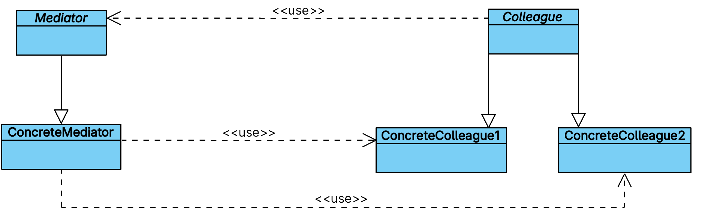

### 5. 参与者

- `Mediator`：抽象中介者，定义对象之间如何通信。
- `ConcreteMediator`：具体中介者，真正实现对象协作逻辑。
- `Colleague`：抽象同事类，所有需要通信的对象都叫同事对象，它们不直接相互通信，而是通过中介者进行通信。
- `ConcreteColleague`：具体同事类，真正实现业务逻辑的对象。

### 6. 协作

同事向中介者发送请求，中介者在各同事之间转发请求。

### 7. 效果

中介者模式可以减少子类的生成，避免因业务流程变化而导致子类爆炸。

一般为了改变对象之间的协作行为，往往会通过继承创建新子类，比如一个有多个类型的订单流程系统中，普通订单流程：

```
创建订单
→ 扣库存
→ 支付
→ 发短信
```

VIP订单：

```
创建订单
→ VIP折扣
→ 扣库存
→ 支付
→ 发短信
```

海外订单：

```
创建订单
→ 海关检查
→ 扣库存
→ 支付
→ 发短信
```

企业订单：

```
创建订单
→ 企业审批
→ 扣库存
→ 支付
→ 发短信
```

我们可能会这样设计：

```java
class OrderService {}

class VipOrderService extends OrderService {}

class OverseasOrderService extends OrderService {}

class EnterpriseOrderService extends OrderService {}
```

这就是通过子类定制行为。

行为分布在多个对象之间，也就是一个完整的业务流程被分散在多个对象之间。比如一个下单流程可能涉及：

- `OrderService.createOrder()`
- `InventoryService.deductStock()`
- `CouponService.useCoupon()`
- `SmsService.sendMessage()`
- `LogisticsService.createLogistics()`

这些分散在各个对象的行为组成完整的下单流程。

行为分布在多个对象之间会导致子类爆炸，当流程变化的时候没办法同一控制。比如要新增一个VIP用户优先发货的逻辑，可能需要修改的地方有：

- `OrderService`
- `LogisticsService`
- `InventoryService`

或者创建一个 `VipOrderService`去重写整个流程。像类似的需求一多起来，就可能会有很多个子类去实现不同需求：

```java
VipOrderService
OverseasOrderService
EnterpriseOrderService
VipOverseasOrderService
```

中介者模式可以减少这些子类的数量，它将原来分散在这些子类中的行为集中到了中介者对象中。

这样各个对象之间解耦，也简化了对象之间的关系，让复杂的业务逻辑集中在中介者对象中。但是由于逻辑都集中在中介者对象中，也让中介者对象变得非常复杂，以至于随着系统演进，导致中介者对象复杂到难以维护。

### 8. 实现

当逻辑过于简单的时候，可以不用定义抽象的中介者类，直接使用一个具体的中介者类即可。

对象和中介者对象之间的通信，可以使用观察者模式来实现。

### 9. 代码示例

### 10. 已知应用

### 11. 相关模式

外观模式和中介者模式的不同，外观模式是对一个子系统进行抽象，对外提供一个简单的接口，它的协议是单向的，也就是 `Facade`对象向子系统发送请求，但是不能反过来。而中介者模式则可以让对象之间互相通信，协议是多向的。

`Colleague`可以使用观察者模式和中介者对象通信。

## 5.6 Memento（备忘录）--对象行为型模式

### 1. 意图

> 在不破坏封装性的前提下，捕获一个对象的内部状态，并在该对象之外保存这个状态。这样以后就可将该对象恢复到原先保存的状态。

备忘录模式就是一个对象状态存档机制。

“对象状态”就是对象中成员变量的当前值，比如：

```java
class Editor {

    private String text;

    private int cursorPosition;
}
```

其中的 `text`和 `cursorPosition`都是状态，某一时刻：

```
text = "Hello"

cursorPosition = 5
```

这就是对象的当前状态。

“捕获对象内部状态”意思是把当前对象状态保存下来。

“封装性”就是对象自己管理自己的内部状态，外界不应该随便操作内部数据。

“在不破坏封装性的前提下”意思是外界不需要知道对象内部细节，但是仍然可以保存状态。

“在对象之外保存状态”意思是对象自己负责创建备份，但是备份放在外面，对象本身不负责历史的管理，而是由外部负责管理备份。

放在对象外部的是因为状态的历史不属于对象本身的职责，比如一个 `Editor`的职责是编辑文本，而一个 `History`的职责是保存历史记录。

有了历史状态，就可以支持撤销、回滚、恢复等操作。

应用场景：

- 编辑器撤销
- 游戏存档
- 数据库事务回滚
- IDE本地历史

备忘录模式缺点，会导致内存开销巨大，因为每次都要保存状态快照。

实际使用中可能会有如下的优化：

- 增量保存，只保存变化
- 限制历史数量
- 压缩状态

### 2. 别名

Token

Token本意是标记、凭证、信物、令牌。比如：

- 拿着地铁票才能有乘车资格，票就是Token
- 游戏存档码，输入 `123456`恢复游戏进度，这个码也是Token
- `JWT Token`登录后服务器给的 `eyJhbGciOi...`这个字符串代表用户身份状态，也是Token

`Memento`本质也是一种状态凭证， `EditorMemento memento = editor.save();`这里系统返回一个对象 `memento`，这个对象代表编辑器当前状态。外界不知道里面是什么，但是它知道拿着这个对象，可以恢复状态。

Token强调的是外部只能持有状态凭证，而不能操作内部状态。

### 3. 动机

需要支持恢复和撤销等功能，这些功能要求能保存对象的当前状态，但是又不能破坏封装性。

### 4. 适用性

需要保存一个对象的当前状态，以后可以支持恢复和撤销等功能，还不能暴露这个对象的内部状态，也就是不能破坏其封装性。

### 5. 结构

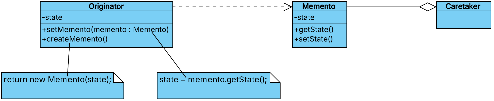

### 6. 参与者

- `Memento`，备忘录对象，用于保存原发器对象的内部状态。不允许外部修改，否则历史记录就会被修改掉。
- `Originator`，原发器，该对象的状态需要被保存，它负责创建备忘录、恢复状态。
- `Caretaker`，管理者，保存备忘录，不能操作备忘录的内容，只负责保存备忘录。

### 7. 协作

### 8. 效果

有些对象的内部状态只能对象自己知道，但是为了实现撤销、恢复等功能，这些状态又必须保存到对象外部。使用备忘录模式可以达到这种要求，对象自己生成一个状态的快照，外部负责保存这个快照，但是不知道对象内部到底有什么。对象的内部可能会非常复杂，但是其他外部对象却完全不用知道，这样可以保持封装性。

封装的意思就是一个对象应该自己管理自己的内部状态，外部不能随便改这个对象的内部状态、也不应该知道这个对象的内部实现。比如：

```java
class BankAccount {
    private double balance;
}
```

中的 `private double balance;`就是封装。这个对象状态如果有变动，需要通过自己的内部方法进行操作： `account.withdraw(100);`，而不是可以任由外部其他对象进行如下这样的操作： `account.balance -= 100;`。

破坏封装性意思是一个对象的内部状态，可以任由外部对象进行修改。比如一个编辑器有复杂的内部状态：

```java
class Editor {
    private String text;
    private int cursorPosition;
    private List<String> styles;
    private Map<String, Object> metadata;
}
```

这些状态应该由 `Editor`自己管理，外部对象不能直接进行访问。

一个破坏封装的实现：

```java
class Editor {
    public String text;
    public int cursorPosition;
}
```

一个保存历史的 `History`对象直接使用 `Editor`状态：

```java
class History {
    private List<String> texts = new ArrayList<>();

    public void save(Editor editor) {
        texts.add(editor.text);
    }
}
```

`History`直接知道 `Editor`内部有 `text`和 `cursorPosition`，也就是这两个对象直接耦合，后续如果 `Editor`内部状态有变更， `History`也需要修改。另外直接暴露一个对象的内部状态，意味着外部对象可以随意的去修这个对象的状态。

备忘录模式的做法是， 外部对象不用知道一个对象的内部是什么样子，这个对象会自己给出一个状态的快照，外部对象只需要保存就行。

使用备忘录模式的实现如下：

```java
class Editor {

    private String text;
    private int cursor;

    public void setText(String text) {
        this.text = text;
    }

    public void setCursor(int cursor) {
        this.cursor = cursor;
    }

    public void show() {
        System.out.println(
            "text=" + text +
            ", cursor=" + cursor
        );
    }

    // 创建备忘录
    public Memento save() {
        return new Memento(text, cursor);
    }

    // 恢复备忘录
    public void restore(Memento memento) {
        this.text = memento.text;
        this.cursor = memento.cursor;
    }

    // 内部类
    static class Memento {
        private final String text;
        private final int cursor;

        private Memento(String text, int cursor) {
            this.text = text;
            this.cursor = cursor;
        }
    }
}
```

```java
class History {

    private Stack<Editor.Memento> stack = new Stack<>();

    public void save(Editor.Memento memento) {
        stack.push(memento);
    }

    public Editor.Memento undo() {
        return stack.pop();
    }
}
```

```java
public class Main {

    public static void main(String[] args) {

        Editor editor = new Editor();
        History history = new History();

        editor.setText("Hello");
        editor.setCursor(5);

        history.save(editor.save());

        editor.setText("Hello World");
        editor.setCursor(11);

        editor.show();

        editor.restore(history.undo());

        editor.show();
    }
}
```

备忘录模式还可以简化 `Originator`，原来 `Originator`可能需要自己去管理内部状态的历史版本，但是备忘录模式将该功能交给了 `Caretaker`，使得 `Originator`功能简化。

备忘录模式需要保存历史状态，也就需要生成和存储大量的信息，如果频繁的进行历史状态保存或者历史状态过大，则会导致内存开销非常大。

窄接口是指只能拿着，不能看到里面，比如 `history.push(memento);`， 这个 `Caretaker`只能管理 `memento`，而不能使用如下方式 `memento.getText()`看到内部状态。

宽接口是指可以访问内部状态，比如 `Originator`需要 `restore(memento)`，因此它必须能读取： `memento.text`。

在 `Java`中可以利用 `private`、内部类和包权限来实现只有 `Originator`能访问状态：

```java
class Editor {

    private String text;

    public void setText(String text) {
        this.text = text;
    }

    public void show() {
        System.out.println(text);
    }

    // 创建备忘录
    public Memento save() {
        return new Memento(text);
    }

    // 恢复备忘录
    public void restore(Memento memento) {
        this.text = memento.getText();
    }

    // 内部类
    static class Memento {

        private final String text;

        private Memento(String text) {
            this.text = text;
        }

        // 仅包内可见
        String getText() {
            return text;
        }
    }
}
```

`Caretaker`：

```java
class History {

    private Stack<Editor.Memento> stack
            = new Stack<>();

    public void push(Editor.Memento m) {
        stack.push(m);
    }

    public Editor.Memento pop() {
        return stack.pop();
    }
}
```

这里 `Caretaker`只能 `push(), pop()`而不能 `memento.getText()`， 因为 `getText()`不是 `public`，但是 `Originator`可以访问，因为它们在同一类内部。

### 9. 实现

注意宽窄接口。

存储历史状态应使用增量式的改变。

### 10. 代码示例

### 11. 已知应用

### 12. 相关模式

命令模式中，可以使用备忘录模式来为一些可撤销的操作维护状态。

迭代器模式的状态可以使用备忘录模式来维护。

## 5.7 Observer（观察者）--对象行为型模式

### 1. 意图

> 定义对象间的一种一对多的依赖关系，当一个对象的状态发生改变时，所有依赖于它的对象都得到通知并被自动更新。

观察者模式本质是一个对象发生变化后，自动通知其他对象。

通知很重要，如果不通知，所有对象都得不停轮询，像如下代码：

```java
while(true) {

    if(order.isPaid()) {
        ...
    }
}
```

### 2. 别名

- 依赖
- 发布-订阅

### 3. 动机

在实际的系统中，一定会拆分类。刚开始的时候可能所有的逻辑都写在一个类中，比如：

```java
class SuperSystem {

    // 用户管理
    void login(){}

    // 支付
    void pay(){}

    // 库存
    void deductStock(){}

    // 发短信
    void sendSms(){}

    // 日志
    void writeLog(){}
}
```

随着系统越来越复杂，一定会将功能进行拆分。拆分之后各个类不是孤立的，而是彼此协作的，上面的代码可能会拆分到如下几个类中：

```java
OrderService
InventoryService
PaymentService
SmsService
PointService
```

这些类共同完成一个下单的业务。当拆分之后面临的第一个问题就是状态的同步，比如用户订单支付成功后，订单状态从未支付变为已支付，其他流程的状态也需要跟着同步：

- 库存减少
- 增加积分
- 发送通知
- 记录日志

等等，这些都必须保持一致。

没有拆分之前，所有流程都在同一个类中，状态的同步也比较简单：

```java
class SuperSystem {

    void pay() {
        orderStatus = PAID;
        stock--;
        points += 100;
    }
}
```

拆分成多个类之后，状态分散在了各个类中，比如：

```java
paymentService.pay();

inventoryService.update();

pointService.add();

smsService.send();
```

这时状态的同步就涉及到多个类中多个方法的调用，最直接的做法是：

```java
class PaymentService {

    private InventoryService inventoryService;
    private SmsService smsService;
    private PointService pointService;

    public void pay() {

        inventoryService.update();

        smsService.send();

        pointService.add();
    }
}
```

这里我们为了维护状态的一致性，导致类之间紧耦合，复用性降低。

观察者模式解决这个问题的思路是支付系统不直接调用别人，而是广播事件。

### 4. 适用性

“一个抽象模型有两个方面”，意思是同一个业务中的两个不同的维度。其中一个维度变化了，会影响另外一个维度。这两个维度应该独立进行封装，这样每个维度就可以单独进行改变和复用。

一个对象改变了，会导致其他的若干个对象也需要同事改变，并且这若干个对象的数量不确定。

一个对象改变之后，需要通知其他的对象，但是又不能直接依赖其他对象。


### 5. 结构

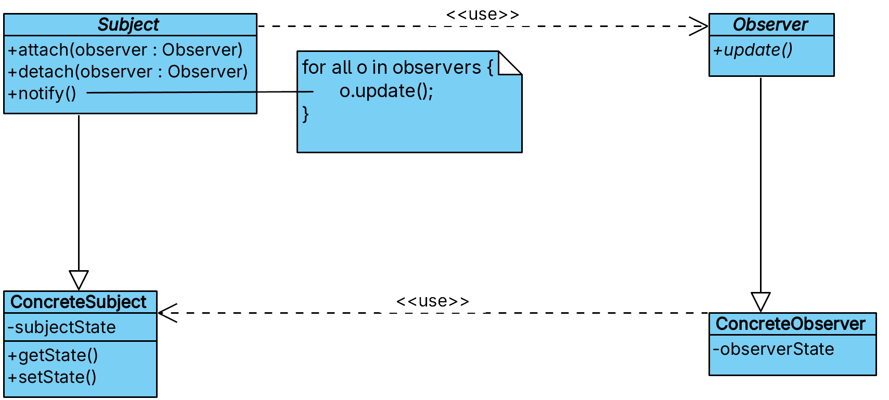

### 6. 参与者

- `Subject`：被观察者的抽象接口，被观察者是变化发生的地方，它保存观察者、通知观察者。
- `Observer`：观察者的抽象接口，观察者是关心变化的地方，收到被观察者的通知后执行更新操作。
- `ConcreteSubject`：具体的被观察者，状态发生变化后通知所有观察者。
- `ConcreteObserver`：具体的观察者，接到被观察者的通知后执行更新操作。

### 7. 协作

被观察者对象状态发生变化，通知各个观察者。观察者收到通知后，进行更新操作。

> 注意发出改变请求的Observer对象并不立即更新，而是将其推迟到它从目标得到一个通知之后。Notify不总是由目标对象调用，它也可被一个观察者或其他对象调用。

这段话在讨论观察者模式中的同步机制与事件传播机制。观察者模式中的“状态变化”和“更新”不一定同步发生，在标准的观察者模式模板中变化是立即发生的： `Subject变化 -> 立即更新所有Observer`，比如：

```java
setState()
↓
notifyObservers()
↓
observer.update()
```

这种变化和更新是立即完成的。但是在真实的系统中往往不是这样，变化和更新不是立即同步完成的，原因是观察者可能会修改 `Subject`。比如在一个股票系统中：

- `Subject`中有状态：股票价格
- `Observer`是交易机器人
- 股票价格变化： `100 -> 90`， `Subject`通知观察者
- 某个观察者收到通知后，决定立刻买入，随后又立刻修改股票（ `Subject`）状态

这时候就会有问题，在一个 `Subject`的通知里进行更新，在这个更新中又去修改 `Subject`，系统状态可能会发生混乱。实际上在使用观察者模式的时候会采用延迟更新的机制：

- `Subject`先完成所有状态变化
- 再统一进行通知
- 各观察者之后再进行更新操作

“注意发出改变请求的Observer对象并不立即更新，而是将其推迟到它从目标得到一个通知之后”，这句话的意思是观察者不只是被动接收通知，它也有可能会主动的触发数据状态变化。比如某个 `Observer`主动触发了 `Subject`状态改变：

```java
按钮监听器（观察者）
↓
修改数据模型（被观察者）
```

对应示例代码：

```java
class ButtonObserver implements Observer {

    @Override
    public void update() {
        subject.setState("NEW");
    }
}
```

这里 `Observer`主动修改了 `Subject`的状态，观察者在修改了被观察者的状态之后，观察者自己不会立即更新自己（也就是不会有 `NEW`这个状态对应的更新操作），而是会等待被观察者的通知，等到有了 `NEW`状态的通知后，观察者才会进行更新操作。

观察者不会立即更新自己的原因可能是此时整个通知链还没结束，此时立即更新自己会有危险，系统现在还处于某种中间状态，被观察者此时还在遍历 `observers`。

“Notify不总是由目标对象调用，它也可被一个观察者或其他对象调用”，这句话是说通知不是只能由被观察者发起，其他对象也可以发起通知，甚至观察者自己也能发起通知。

经典的观察者模式中都是由被观察者发起通知：

```java
setState()
↓
notifyObservers()
```

但是在复杂的系统中，“状态改变”和“通知行为”这两部分需要分离，可能就会变成如下形式：

```
状态变化
↓
事件队列
↓
调度器
↓
统一通知
```

比如：

- `GUI`框架中点击按钮，并不是按钮自己通知，而是通过事件循环统一调度。
- 消息队列系统中， `Producer`发送消息后，通知其实是由 `Broker`做的。


### 8. 效果

观察者模式让 `Subject`和 `Observer`解耦，这两部分可以单独改变和复用。

“抽象耦合”，就是依赖接口，而不是依赖具体类。在观察者模式中使用的是抽象耦合，被观察者不知道具体的观察者，它只知道抽象的观察者（ `Observer`接口），被观察者和观察者之间是最小耦合。

“系统层次”，就是系统的职责分层，比如：表现层、业务层、数据层。不同层的职责不同，分层后容易维护、扩展、复用。在层次架构中通常是高层依赖低层： `UI -> Service -> DAO`，而不是  `DAO -> UI`。

由于低层不能依赖高层，也就意味着低层有状态变化了，不能让高层感知到。在实际系统中，低层有了状态变化，高层也是要跟着改变的，但是如果要是低层直接持有高层对象引用，去直接调用高层的方法进行通知，就破坏了系统层次结构。

观察者模式给出的解决方案是，低层不直接调用高层，而是通过观察者模式去通知 `observer.update();`，这样低层就只依赖 `Observer`接口，而高层实现 `Observer`接口即可。即实现了低层向高层发送通知，同时也不破坏层次结构。

观察者模式支持广播通信。被观察者不直接依赖观察者，也不知道有多少的观察者，它只会在状态发生改变后无脑的去遍历已经注册的观察者，然后发送通知给观察者们。

如果有些观察者注册错了，被观察者也会发送通知，可能会导致意外的情况发送。

### 9. 实现

观察者模式中被观察者需要保存一个观察者列表：

```java
class Subject {

    private List<Observer> observers = new ArrayList<>();
}
```

但是当被观察者很多，但是观察者很少时，这样几乎大部分的被观察者中都有一个空的 `ArrayList()`，即使是空的，但是也会占用很大的内存空间。

一种优化方案是使用一个全局的映射关系，即 `Map<Subject, List<Observer>>`来维护被观察者和观察者之间的关系。比如如下代码：

```java
import java.util.*;

class ObserverManager {

    // 全局映射
    private Map<Subject, List<Observer>> observerMap = new HashMap<>();

    // 注册观察者
    public void addObserver(Subject subject, Observer observer) {

        observerMap
                .computeIfAbsent(
                        subject,
                        k -> new ArrayList<>())
                .add(observer);
    }

    // 获取观察者
    public List<Observer> getObservers(Subject subject) {

        return observerMap.getOrDefault(
                subject,
                Collections.emptyList());
    }
}
```

```java
class Subject {

    private ObserverManager manager;

    public Subject(ObserverManager manager) {
        this.manager = manager;
    }

    public void notifyObservers() {
        List<Observer> observers = manager.getObservers(this);

        for (Observer observer : observers) {
            observer.update();
        }
    }
}
```

如果一个观察者需要有多个被观察者，可以在 `update`操作中使用参数，来表明是哪个被观察者发送的通知。

通知的发送有两种方式：

- 由被观察者来发送，在状态改变后，直接遍历观察者进行通知。
- 由客户端负责，被观察者在状态改变后，不立即进行通知，而是由客户端来调用进行通知。

当一个被观察者销毁时，要将所有的观察者中对应的引用清理掉。

被观察者发出通知之前需要确保自己的状态是一致的，因为观察者收到通知后通常需要调用被观察者的某些方法查询状态。

被观察者发送通知的时候，可能会有额外的信息需要一起通知，这些信息的大小可能很小也可能很大。

被观察者发送通知有两种方式：

- 推模型：被观察者将通知以及额外的消息一并发给观察者
- 拉模型：被观察者只发送最小的通知给观察者，观察者接到通知后需要显式的向被观察者查询具体的变化

标准的观察者模式中，被观察者状态发生变化后会通知所有的观察者，在观察者数量很多的时候效率会非常差。另外也不是所有的观察者都关心所有的变化，也就是说一次状态变化时有很多的观察者被无意义的通知。

针对这样的场景，实现观察者时可以进行事件过滤或者是按主题订阅，观察者就只会在它感兴趣的事件发生时才会被通知。观察者现在不再是观察整个被观察者，而是观察被观察者的某种事件，粒度从粗变细了。

“支持这种做法的一种途径是，使用目标对象的方面（aspect）的概念”，这句话中的方面（aspect）不是 `AOP`中的 `Aspect`，而是指被观察者的不同维度，比如一个 `User`对象可能有如下的几个方面：

- 登录方面
- 安全方面
- 头像方面
- 余额方面

观察者不一定会关心整个 `User`，而是只关心某一个方面。

当被观察者和观察者之间的关系很复杂，不再是一对多的形式，而是形成网状关系，这时候需要一个中间的管理通知的对象 `ChangeManager`。

这个 `ChangeManager`可以统一的发送通知、管理观察者和被观察者的映射关系、管理通知策略等等。

`ChangeManager`是中介者模式中的 `Mediator`角色。通常只有一个 `ChangeManager`对象，可以使用单例模式实现。

### 10. 代码示例

### 11. 已知应用

### 12. 相关模式

- `ChangeManager`是中介者模式中的 `Mediator`角色。
- 可以使用单例模式来实现 `ChangeManager`

## 5.8 State（状态）--对象行为型模式

### 1. 意图

> 允许一个对象在其内部状态改变时改变它的行为。对象看起来似乎修改了它的类。

“允许一个对象在其内部状态改变时改变它的行为”，对象在不同状态下，表现出的行为不同。比如电梯状态和行为如下：

- 开门状态：可以进出
- 关门状态：可以运行
- 运行状态：不能开门
- 故障状态：什么都不能做

这就是状态影响行为，不同状态下行为不同。对应到代码中我们可能会写大量的 `if-else`去判断不同状态：

```java
class Elevator {

    private String state;

    public void openDoor() {
        if (state.equals("OPEN")) {
            System.out.println("已经开门");
        } else if (state.equals("RUNNING")) {
            System.out.println("运行中不能开门");
        } else if (state.equals("ERROR")) {
            System.out.println("故障状态");
        }
    }
}
```

随着状态增加， `if-else`也会增加，代码会越来越臃肿。而状态模式则认为状态本身就是对象，而不是 `String state`，即把不同状态的行为封装到不同状态类。代码中则由原来的 `if (state == xxx)`变成 `state.handle()`。

“对象看起来似乎修改了它的类”，这句话是说对象的行为变化太大了，看起来像换了一个对象。同一个对象由于状态不同，从外部看起来好像这个对象不是同一个对象，但其实对象还是同一个，只是状态变化了。

状态模式的结构示例：

```java
class Elevator {

    private State state;
}
```

`Elevator`中保存 `State`， `State`有不同状态：

- `class OpenState implements State`
- `class RunningState implements State`
- `class ErrorState implements State`

`Elevator`的行为就由 `State`决定。

状态模式解决状态爆炸问题，比如一个订单系统中有很多状态：

- 待支付
- 已支付
- 已发货
- 已签收
- 已取消
- 已退款

对应的行为有：

- `pay()`
- `cancel()`
- `ship()`
- `refund()`

如果使用 `if-else`，代码终将会全是判断语句。

### 2. 别名

状态对象（Object for state）

### 3. 动机

### 4. 适用性

一个对象的状态不同，行为就不同，比如一个订单对象：

- 待支付状态允许：  `pay(), cancel()`
- 已发货状态允许： `confirm()`，但是不允许： `cancel()`
- 已退款状态则很多操作都不能执行

同一个对象在运行过程中行为会发生变化，同一个订单对象行为就一直在变化。

这种情况适合使用状态模式，而不是大量的 `if-else`。代码如下：

`State`接口：

```java
interface OrderState {

    void cancel();

    void ship();
}
```

待支付状态：

```java
class PendingState implements OrderState {

    @Override
    public void cancel() {
        System.out.println("订单已取消");
    }

    @Override
    public void ship() {
        System.out.println("未支付不能发货");
    }
}
```

已支付状态：

```java
class PaidState implements OrderState {

    @Override
    public void cancel() {
        System.out.println("已支付不能取消");
    }

    @Override
    public void ship() {
        System.out.println("开始发货");
    }
}
```

`Context`:

```java
class Order {

    private OrderState state;

    public void setState(OrderState state) {
        this.state = state;
    }

    public void cancel() {
        state.cancel();
    }

    public void ship() {
        state.ship();
    }
}
```

如果一个方法中有大量的 `if-else`判断，比如：

```java
public void pay() {

    if (state == PENDING) {

        ...

    } else if (state == SHIPPED) {

        ...

    } else if (state == FINISHED) {

        ...

    } else if (state == REFUNDED) {

        ...
    }
}
```

这些 `if-else`不仅只存在这一个方法中，还会在其他方法中存在：

- `cancel()`中也要判断状态
- `refund()`中也要判断状态

而且这些方法中都是差不多一样的 `if-else`判断，判断的 `State`还是同一个。

这种情况也适合使用状态模式，将每个一条件分支放入一个独立的类中，比如 `if(state == PAID)`这个分支可以提取到 `PaidState`类。

原来所有状态逻辑混在一起，现在每个状态都独立成类，每个类独立管理自己的行为。

### 5. 结构

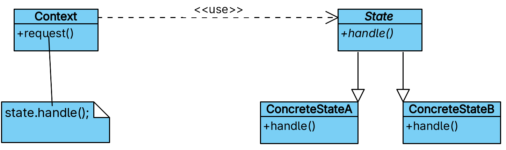

### 6. 参与者

- `Context`：环境、上下文，持有当前状态，对外提供统一接口，将行为委托给当前 `State`
- `State`：状态抽象，定义所有状态共有的行为。
- `ConcreteState`：具体状态，封装该状态下的具体行为。

### 7. 协作

### 8. 效果

状态模式将同一个状态对应的行为集中起来，将不同状态对应的行为分离开。比如一个订单系统有三个状态：待支付、已支付、已发货，有四个操作：支付、取消、发货、退款。使用最简单的方式写代码可能是如下：

```java
class Order {

    private OrderState state;

    public void pay() {
        if (state == PENDING) {
            ...
        }
    }

    public void cancel() {
        if (state == PENDING) {
            ...
        }
    }

    public void ship() {
        if (state == PAID) {
            ...
        }
    }

    public void refund() {
        if (state == PAID) {
            ...
        }
    }
}
```

这样写会导致一个状态分散在多个地方，比如待支付状态可能分散在 `pay(), cancel() , ship(), refund()`等多个方法中。状态模式则会把待支付状态相关逻辑全部放到单独的一个类中，比如 `PendingState`：

```java
class PendingState implements OrderState {

    @Override
    public void pay() {
        System.out.println("支付成功");
    }

    @Override
    public void cancel() {
        System.out.println("订单取消");
    }

    @Override
    public void ship() {
        System.out.println("未支付不能发货");
    }

    @Override
    public void refund() {
        System.out.println("未支付不能退款");
    }
}
```

多个状态原来是混在一起的：

```java
if(state == PENDING)
...
else if(state == PAID)
...
else if(state == SHIPPED)
...
```

现在就会变成几个独立的类：

```java
PendingState
PaidState
ShippedState
```

”State模式将所有与一个特定的状态相关的行为都放入一个对象中“，比如待支付状态和已支付状态都有自己的规则：支付规则、取消规则、退款规则、发货规则。每个状态自己负责自己的行为，而不是让 `Order`类负责所有状态。

新增状态时，如果是 `if-else`则需要修改所有地方： `pay(), cancel(), refund(), ship()`，而如果是状态模式，则只需要新增 `SomeState`类，原有的类则不需要修改。

状态模式可能使得状态类很多，在状态很少的时候使用 `if-else`会更方便和清晰，状态很多、状态变化频繁、状态的行为差异很大或者 `if-else`过多的时候可以使用状态模式。

状态模式让代码更清晰、更容易维护，不仅仅是消灭 `if-else`，而是把状态从一个普通的变量值变为一个独立的对象，让状态的行为和状态的转换规则集中到对应的 `State`类中，从而让代码从面向流程控制转变为面向业务状态建模，最终获得更清晰、更结构化、更容易扩展的设计。

状态模式让状态转换变得更清晰、明确、安全。

### 9. 实现

状态模式没有规定状态的转换逻辑应该写在哪里，有两种方式：

- `Context`负责状态转换
- `State`自己决定下一个状态

`Context`负责转换的代码示例：

```java
public class Order {

    private OrderState state;

    public void pay() {
        state.pay();
        
        if (state instanceof PendingState) {
            setState(new PaidState());
        }
    }

    public void ship() {
        state.ship();
        
        if (state instanceof PaidState) {
            setState(new ShippedState());
        }
    }

    public void setState(OrderState state) {
        this.state = state;
    }
}
```

这种方式比较适合状态流转规则非常稳定的情况，由于状态流转规则只存在于 `Context`，因此状态类之间不会相互依赖。

这种方式的缺点是随着状态的增多， `Context`会越来越大，每个方法中都会有 `if`判断状态，导致出现大量的 `if`判断语句。

`State`自己决定状态转换的代码示例：

```java
public class PendingState implements OrderState {

    @Override
    public void pay(Order order) {
        System.out.println("支付成功");
        
        order.setState(new PaidState());
    }
}
```

当前状态类自己决定下一个状态是什么，新增状态时修改范围比较小。需要 `Context`提供一个设置状态的方法 `setState()`让 `State`类进行调用。这种方式的缺点是当前状态类需要依赖其他的状态类。

### 10. 代码示例

### 11. 已知应用

### 12. 相关模式

- 有些情况下状态对象可以使用享元模式来进行共享。
- 状态对象可以使用单例模式实现。

## 5.9 Strategy（策略）--对象行为型模式

### 1. 意图

> 定义一系列的算法，把它们一个个封装起来，并且使它们可相互替换。本模式使得算法可独立于使用它的客户而变化。

把做事情的方法抽出来变成独立对象，让程序在运行时自由选择使用哪一种方法。

这里的“算法”是完成某件事情的具体方式，不是通常的排序算法、查找算法中的算法。比如一个支付系统中的支付可以有：Xx支付、Yy支付、银行卡支付等等，这些都是不同算法。

“定义一系列算法”的原因通常是因为同一件事有很多实现方式，比如通知系统中的发送通知就有很多方式：

- 短信
- 邮件
- 微信
- 钉钉

通常针对多种方式的实现代码是：

```java
public class NotificationService {

    public void send(String type) {

        if ("sms".equals(type)) {
            // 短信
        } else if ("email".equals(type)) {
            // 邮件
        } else if ("wechat".equals(type)) {
            // 微信
        }
    }
}
```

随着通知方式的增加，会出现越来越多的 `if-else`语句。

这种普通的方式中所有算法混在一个类中，而使用策略模式则会将每个算法都封装在不同的类中，代码实现如下：

```java
public interface NotificationStrategy {
    void send(String message);
}
```

短信：

```java
public class SmsStrategy implements NotificationStrategy {

    @Override
    public void send(String message) {
        System.out.println("短信发送：" + message);
    }
}
```

邮件：

```java
public class EmailStrategy implements NotificationStrategy {

    @Override
    public void send(String message) {
        System.out.println("邮件发送：" + message);
    }
}
```

每种发送方式都在不同类中。以后如果需要修改某种发送方式的逻辑，也仅仅只需要修改对应类即可，其他类无需修改。

客户端依赖统一的接口 `NotificationStrategy`，可以任意的更换具体的实现，而调用代码 `strategy.send();`则完全不变。

### 2. 别名

政策（Policy）

### 3. 动机

### 4. 适用性

一个对象存在多种可替换的行为，而这些行为可能经常变化，可以使用策略模式将会变化的算法（行为）从使用它的对象中分离出来，并封装成独立对象。

第一种情况是：许多相关的类仅仅是行为有异。比如一个商城系统中有一个订单价格计算器：

```java
public class NormalPriceCalculator {

    public double calculate(Order order) {
        return order.getAmount();
    }
}
```

后来增加会员功能：

```java
public class VipPriceCalculator {

    public double calculate(Order order) {
        return order.getAmount() * 0.9;
    }
}
```

再后来增加超级会员：

```java
public class SuperVipPriceCalculator {

    public double calculate(Order order) {
        return order.getAmount() * 0.8;
    }
}
```

这些类几乎完全一样，它们的数据结构相同、属性相同、生命周期相同，只有 `calculate()`方法的实现不同。

使用策略模式将变化的部分提取出来：

```java
public interface PricingStrategy {

    double calculate(Order order);
}
```

普通用户：

```java
public class NormalStrategy implements PricingStrategy {

    @Override
    public double calculate(Order order) {
        return order.getAmount();
    }
}
```

VIP：

```java
public class VipStrategy implements PricingStrategy {

    @Override
    public double calculate(Order order) {
        return order.getAmount() * 0.9;
    }
}
```

超级VIP：

```java
public class SuperVipStrategy implements PricingStrategy {

    @Override
    public double calculate(Order order) {
        return order.getAmount() * 0.8;
    }
}
```

购物车在使用计算器的时候：

```java
public class ShoppingCart {

    private PricingStrategy strategy;

    public ShoppingCart(PricingStrategy strategy) {
        this.strategy = strategy;
    }

    public double checkout(Order order) {
        return strategy.calculate(order);
    }
}
```

这就是”用多个行为中的一个行为来配置一个类“，这里计算不同的会员价格的时候， `ShoppingCart`没有变化，变化的是 `PricingStrategy`。

第二种情况是：需要使用一个算法的不同变体。这里的意思是同一个算法思想有不同的实现版本，比如排序算法都有 `sort()`，但是 `QuickSort, MergeSort, HeapSort`的实现方式不同。

再比如缓存淘汰方法都是 `evict()`，但是淘汰策略有不同实现： `LRU, LFU, FIFO`等等。如果不用策略模式，可能会像如下代码：

```java
public class Cache {

    public void evict() {

        if(type.equals("LRU")) {
            ...
        }

        else if(type.equals("LFU")) {
            ...
        }

        else if(type.equals("FIFO")) {
            ...
        }
    }
}
```

使用策略模式：

```java
public interface EvictionStrategy {

    void evict();
}
```

不同的淘汰策略：

```java
public class LRUStrategy

public class LFUStrategy

public class FIFOStrategy
```

缓存类：

```java
public class Cache {

    private EvictionStrategy strategy;

    public Cache(EvictionStrategy strategy) {
        this.strategy = strategy;
    }

    public void evict() {
        strategy.evict();
    }
}
```

这就是一个算法的多个变体。

第三种情况是：算法使用客户不应该知道的数据。这句话意思是算法内部非常复杂，算法的调用者不应该知道这些复杂的内部数据结构和逻辑。比如一个搜索的实现，客户端调用 `search("design pattern")`后拿到搜索结果 `List<Document>`即可，不需要知道搜索内部是怎么实现的：倒排索引、 `Trie`树、 `B+`树、 跳表、 `Hash`表等等。如果将这些内部实现暴露给调用方，则可能像如下的很复杂的方式：

```java
public List<Document> search(
        Trie trie,
        InvertedIndex index,
        SkipList skipList,
        String keyword)
```

而使用策略模式：

```java
public interface SearchStrategy {

    List<Document> search(String keyword);
}
```

具体的实现：

```java
public class TrieSearchStrategy {
	private Trie trie;
}

public class InvertedIndexStrategy {
	private InvertedIndex index;
}
```

客户端只需调用 `searchStrategy.search("Java");`进行搜索即可。

第四种情况是：一个类定义多种行为，并且这些行为在这个类的操作中以多个条件语句的形式出现。这句话说的就是我们常见的 `if-else`地狱问题，比如支付系统中：

```java
public class PaymentService {

    public void pay(String type, Order order) {

        if (type.equals("wechat")) {

        } else if (type.equals("alipay")) {

        } else if (type.equals("unionpay")) {

        }
    }
}
```

后面如果再增加其他的支付方式，代码就变成了：

```java
if...

else if...

else if...

else if...

else if...
```

每次增加一个支付方式， `PaymentService`就需要修改。另外， `PaymentService`还承担了多个职责。

使用策略模式：

```java
public interface PaymentStrategy {

    void pay(Order order);
}
```

各种支付方式：

```java
public class WechatPayStrategy

public class AlipayStrategy

public class UnionPayStrategy
```

支付服务：

```java
public class PaymentService {

    private PaymentStrategy strategy;

    public PaymentService(PaymentStrategy strategy) {
        this.strategy = strategy;
    }

    public void pay(Order order) {
        strategy.pay(order);
    }
}
```

如果要新增支付方式，则 `PaymentService`和其他的支付方式都不需要修改。

### 5. 结构

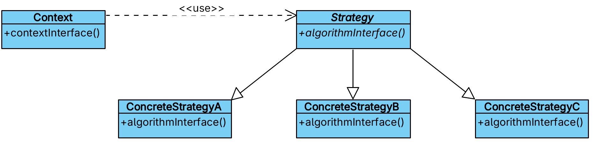

### 6. 参与者

- `Strategy`：策略接口，所有策略必须实现的算法接口。
- `ConcreteStrategy`：具体策略。
- `Context`：使用策略的业务类。

### 7. 协作

### 8. 效果

策略模式中 `Strategy`接口的各个子接口定义了不同算法， `Context`可以使用这一系列的可复用算法。

`Context`本身也可以使用继承的方式来实现不同算法的功能，但是这样 `Context`和算法就耦合在一起了。使用策略模式可以将 `Context`和算法分开。

策略模式可以减少 `if-else`条件语句。

策略模式还可以为同一个行为提供不同实现，客户端使用的使用的时候可以根据实际情况选择不同实现。

策略模式中客户端代码必须要知道策略的不同点，客户端要选择一个合适的策略，那它就必然要知道各个策略有什么不一样，这时候具体的实现就暴露给了客户端。因此只有当客户端确实需要关心算法的差异时，才适合使用策略模式。

`Strategy`接口为了统一所有算法，往往设计的比较宽泛，但是不同策略真正需要的数据可能哇暖不同，结果就是 `Context`不得不准备一堆参数，但是某些策略根本用不到这些参数。当一个接口会有大量无效的参数时，可以让 `Strategy`直接访问 `Context`中的数据，即从如下的形式：

```java
public interface Strategy {

    void execute(
            int a,
            int b,
            int c,
            int d,
            int e,
            int f);
}
```

改为如下形式：

```java
public interface Strategy {

    void execute(Context context);
}
```

然后让具体的策略实现去从 `Context`中找自己需要的参数。这样做的缺点就是让 `Strategy`和 `Context`紧耦合了。

策略模式会让类数目增加，每个策略需要对应一个类。

### 9. 实现

### 10. 代码示例

### 11. 已知应用

### 12. 相关模式

`Strategy`对象可以使用享元模式进行共享。

## 5.10 Template Method（模板方法）--类行为型模式

### 1. 意图

> 定义一个操作中的算法的骨架，而将一些步骤延迟到子类中。TemplateMethod使得子类可以不改变一个算法的结构即可重定义该算法的某些特定步骤。

这里的“算法”可以理解成：业务流程、处理流程、执行步骤、工作流。比如一个导出报表功能，无论导出的是什么格式： `Excel, PDF, CSV`，但是导出流程都是一致的：

```
读取数据
    ↓
处理数据
    ↓
生成文件
    ↓
保存文件
```

这个流程就是“算法”。

“骨架”就是：流程顺序、执行框架、步骤排列，比如上面说的导出流程：

```
第一步：读取数据
第二步：处理数据
第三步：生成文件
第四步：保存文件
```
这个顺序永远不能改变，这就是算法骨架。使用代码表示就是：

```java
public abstract class DataExporter {

    public final void export() {

        readData();

        processData();

        generateFile();

        saveFile();
    }

    protected abstract void generateFile();

    private void readData() {
        System.out.println("读取数据");
    }

    private void processData() {
        System.out.println("处理数据");
    }

    private void saveFile() {
        System.out.println("保存文件");
    }
}
```

`export()`方法就是算法骨架，该方法中的执行顺序固定。

“延迟到子类”，比如上面的 `generateFile()`方法留给子类实现，这就是延迟到子类。

模版方法可以让主要的步骤顺序、流程框架、执行时机不变，让子类重新实现其中的某些步骤。

模版方法主要解决的是流程稳定，某些步骤有变化的问题，对于流程变化步骤也变化的场景则不适合使用模版方法模式。

### 2. 动机

### 3. 适用性

第一种情况，很多业务流程中，有些步骤永远不会改变，比如支付流程：

```
参数校验
    ↓
风控检查
    ↓
执行支付
    ↓
记录日志
```

对于不同支付方式，除了执行支付这步不一样，其他的步骤可能都一样。如果不是用模版方法模式，可能会像如下代码：

```java
public class WechatPayment {

    public void pay() {

        validate();

        riskCheck();

        wechatPay();

        saveLog();
    }
}
```

```java
public class AlipayPayment {

    public void pay() {

        validate();

        riskCheck();

        alipayPay();

        saveLog();
    }
}
```

不同支付方式之间存在大量的重复代码。如果使用模板方法模式，则会像如下：

```java
public abstract class PaymentTemplate {

    public final void pay() {

        validate();

        riskCheck();

        doPay();

        saveLog();
    }

    protected abstract void doPay();

    private void validate() {
        System.out.println("参数校验");
    }

    private void riskCheck() {
        System.out.println("风控检查");
    }

    private void saveLog() {
        System.out.println("记录日志");
    }
}
```

```java
public class WechatPayment extends PaymentTemplate {

    @Override
    protected void doPay() {

        System.out.println("微信支付");
    }
}
```

```java
public class AlipayPayment extends PaymentTemplate {

    @Override
    protected void doPay() {
        System.out.println("支付宝支付");
    }
}
```

不变的三个步骤放在父类中统一实现，可变的一步让各个子类去实现。

第二种情况是如果各个子类中有很多重复的代码，可以将这些重复代码提取出来，集中到父类中。

第三种情况是控制子类扩展，意思是限制子类乱改，比如一个流程如下：

```
参数校验
↓
风控检查
↓
支付
↓
记录日志
```

规定风控检查这个步骤绝对不能跳过，如果把过程实现交给子类，则可以直接不写风控检查这一步，而使用模版方法模式，这些步骤已经固定，之类只能重写它能重写的方法。

这样的限制可以实现受控制的扩展，父类决定哪里可以修改，哪里不可以修改，子类就只能在规定好的地方去修改。

### 4. 结构

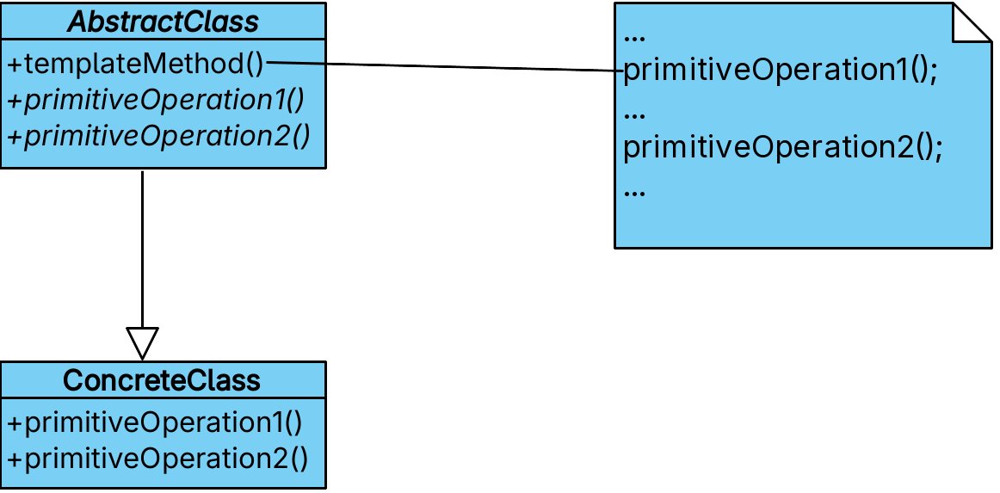

### 5. 参与者

- `AbstractClass`：抽象类，定义模板方法和算法骨架。
- `ConcreteClass`：具体实现类，实现具体步骤。

### 6. 协作
### 7. 效果

模版方法模式是一种代码复用的基本技术。

### 8. 实现

一个模板方法调用的原语操作需要保证只能被模板方法调用。

尽量减少原语操作，也就是子类重定义的方法要尽可能少，因为如果可重定义的操作越多，客户程序就越长。

可重定义的操作的名字要加上前缀，好识别，比如： `DoXxxxx`。

### 9. 代码示例

### 10. 已知应用

### 11. 相关模式

- 工厂方法模式经常和模板方法模式一起使用。
- 模版方法模式使用继承来改变算法的一部分，策略模式则使用委托来改变整个算法。

## 5.11 Visitor（访问者）--对象行为型模式

### 1. 意图

> 表示一个作用于某对象结构中的各元素的操作。它使你可以在不改变各元素的类的前提下定义作用于这些元素的新操作。

“对象结构”，这里主要指的是简单的数据结构，这个结构里面有很多的对象，比如：

- `List<Employee>`
- `List<File>`
- `List<Shape>`

或者像如下的树结构：

```
公司
 ├─ 部门A
 │   ├─ 员工1
 │   └─ 员工2
 │
 └─ 部门B
     ├─ 员工3
     └─ 员工4
```

这里并不是强调结构长什么样子，而是强调结构中有很多对象。

“元素”，就是对象结构中的每一个对象，比如 `Employee`就是一个元素。

“作用于元素的操作”，比如一个员工系统，其中有 `Engineer, Manager`，下面这些都是操作：

- 统计工资： `calculateSalary()`
- 统计绩效： `calculatePerformance()`
- 生成报表： `generateReport()`

这些都是作用于员工对象的操作。

“表示一个作用于某对象结构中的各元素的操作”，这一整句话实际上在说：访问者模式就是将这些操作封装起来。比如一个对象结构：

```
   公司
    │
    ├── Engineer
    │
    └── Manager
```

使用访问者来操作这些对象集合：

- `SalaryVisitor`负责计算工资
- `PerformanceVisitor`负责计算绩效
- `ReportVisitor`负责生成报表

这些访问者就封装了对各个对象的操作。

如果不是用访问者模式来做，可能的代码会像下面这样子：

```java
public abstract class Employee {
}
```

计算工资：
```java

public class Engineer extends Employee {

    public void calculateSalary() {
    }
}
```

```java
public class Manager extends Employee {

    public void calculateSalary() {
    }
}
```

如果需要计算绩效，则需要在 `Engineer`和 `Manager`中都需要增加 `calculatePerformance()`，后续每增加一个功能，素有元素类都必须修改。假如系统中有20种员工，对应20个类都需要修改。

访问者模式则将分散在各个元素中的操作给移出去，代码如下：

```java
public abstract class Employee {

    public abstract void accept(Visitor visitor);
}

public class Engineer extends Employee {

    @Override
    public void accept(Visitor visitor) {
        visitor.visit(this);
    }
}

public class Manager extends Employee {

    @Override
    public void accept(Visitor visitor) {
        visitor.visit(this);
    }
}
```

上面两个类中已经没有了 `calculateSalary()`和 `calculatePerformance()`方法，这两个操作被移走了。代码如下：

```java
public class SalaryVisitor implements Visitor {

    @Override
    public void visit(Engineer engineer) {
        System.out.println("计算工程师工资");
    }

    @Override
    public void visit(Manager manager) {
        System.out.println("计算经理工资");
    }
}
```

```java
public class PerformanceVisitor implements Visitor {

    @Override
    public void visit(Engineer engineer) {
        System.out.println("统计工程师绩效");
    }

    @Override
    public void visit(Manager manager) {
        System.out.println("统计经理绩效");
    }
}
```

如果需要增加其他功能，则不需要修改 `Engineer`和 `Manager`，只需要新增一个 `Visitor`即可。这就是在不改变各元素类的前提下定义新的操作。

访问者模式适合元素种类比较稳定，元素的操作经常变动的情况。将行为从对象身上拆出来放到访问者中，从而在不修改对象类的情况下不断增加新的功能。

### 2. 动机

### 3. 适用性

### 4. 结构

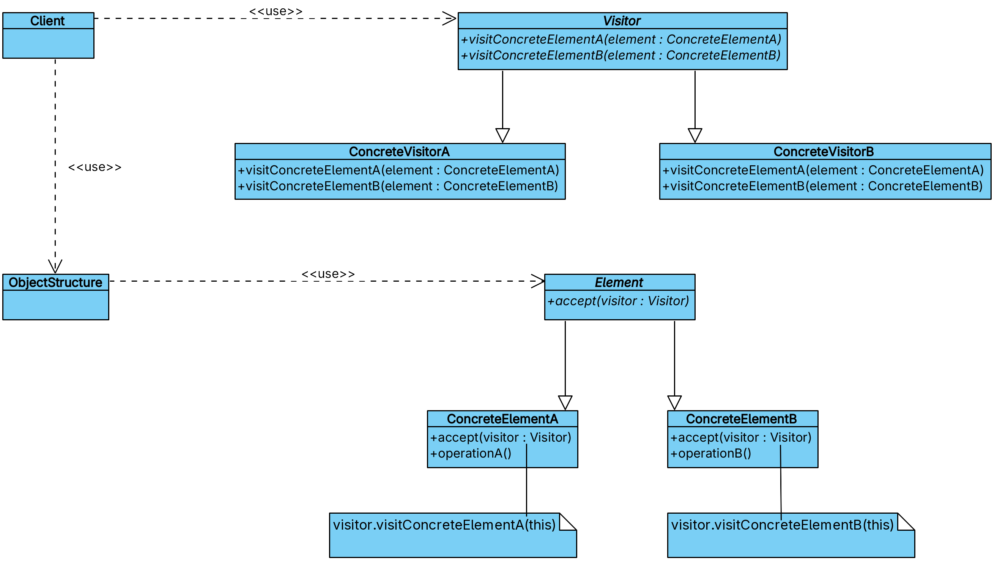

### 5. 参与者

- `Visitor`：定义访问接口
- `ConcreteVisitor`： 具体访问者
- `Element`： 元素接口
- `ConcreteElement`： 具体元素，被访问对象
- `ObjectStructure`： 对象集合

### 6. 协作

### 7. 效果

访问者模式让增加新操作变得容易，仅需要增加新的访问者即可。

访问者模式中的 `Visitor`将相关的操作集中到一起，而不相关的操作则背分离到不同的 `Visitor`中。

访问者模式中增加新的元素不方便，每增加一个新元素都要在 `Visitor`中添加一个新的抽象接口，并且要在所有 `Visitor`实现类中去实现这个新接口。

迭代器也可以来遍历整个对象结构，以此来访问每个对象，但是迭代器不能对具有不同元素类型的对象结构进行操作。爹地啊其能访问的元素都有一个共同的父类。访问者模式则没有这种限制，它可以访问有不同父类的对象。

访问者在访问每一个元素的时候可以累计状态。

访问者可能会破坏元素类的封装性，它可能需要用到元素类的内部方法。

### 8. 实现

分派（Dispatch），就是程序运行时到底决定调用哪个方法。比如：

```java
public class Animal {

    public void speak() {
        System.out.println("Animal");
    }
}
```

```java
public class Dog extends Animal {

    @Override
    public void speak() {
        System.out.println("Dog");
    }
}
```

```java
Animal animal = new Dog();

animal.speak();
```

输出： `Dog`，这里运行时决定执行 `Dog.speak()`而不是 `Animal.speak()`，这个过程就叫做动态分派。

在 `animal.speak()`中有两个东西：

- `speak()`是请求名
- `animal`是接收者

运行时系统决定调用哪个方法会依据两个东西：

- 方法名： `speak`
- 接收者类型： `Dog`

因此这里就执行 `Dog.speak()`，这里只考虑了一个对象的实际类型。这种叫做单分派，只根据一个对象的实际类型进行动态选择。

`Java`本质上是单分派语言，比如如下例子：

```java
public class Printer {

    public void print(Text text) {
        System.out.println("打印文本");
    }

    public void print(Image image) {
        System.out.println("打印图片");
    }
}
```

进行如下调用：

```java
Document doc = new Text();

Printer printer = new Printer();

printer.print(doc);
```

这里在编译的时候就会失败，这是因为 `Java`的重载是在编译期绑定的，不会在运行时看 `doc`实际上是 `Text`还是 `Image`类型。

访问者模式中的双分派，比如一个员工系统中有两个元素： `Engineer`和 `Manager`，有两个访问者： `SalaryVisitor`和 `PerformanceVisitor`，希望实现的功能是：

- `SalaryVisitor + Engineer`：可以执行 `visit(Engineer)`统计工程师的工资
- `SalaryVisitor + Manager`：可以执行 `visit(Manager)`统计经理的工资
- `PerformanceVisitor + Engineer`：可以统计工程师的绩效
- `PerformanceVisitor + Manager`：可以统计经理的绩效

也就是说最终执行哪个方法不仅仅取决于 `Visitor`类型，还要取决于 `Element`的类型，这种就是双分派。双分派执行操作取决于请求的种类和两个接收者的类型，即 `方法选择 = Visitor实际类型 + Element实际类型`。

访问者模式中的一个调用示例：

```java
Visitor visitor = new SalaryVisitor();

Element element = new Engineer();

element.accept(visitor);
```

`accept(visitor)`发生了两次分派，第一次在执行 `element.accept(visitor);`的时候发现 `element`实际类型是 `Engineer`，于是调用 `Engineer.accept()`，这是第一次动态绑定。

第二次分派是在进入 `visitor.visit(this);`时，此时 `this`已经明确是 `Engineer`，编译器选择： `visit(Engineer)`。 `visitor`的实际类型是 `SalaryVisitor`，运行时调用 `SalaryVisitor.visit(Engineer)`，这是第二次动态绑定。

因此最终决定的方法是 `SalaryVisitor.visit(Engineer)`，同时依赖 `SalaryVisitor + Engineer`，这就是双分派。

### 9. 代码示例

### 10. 已知应用

### 11. 相关模式

- 访问者模式模式可以用于一个由组合模式定义的对象结构
- 可以用在解释器模式中进行解释操作